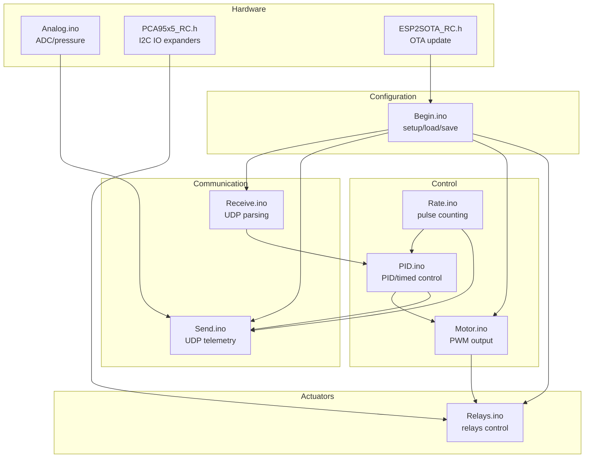
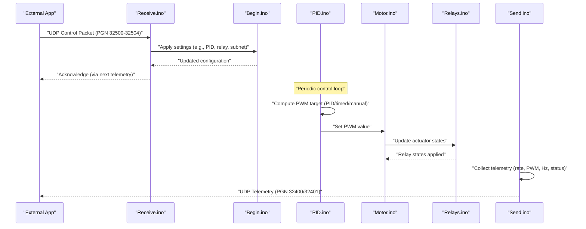
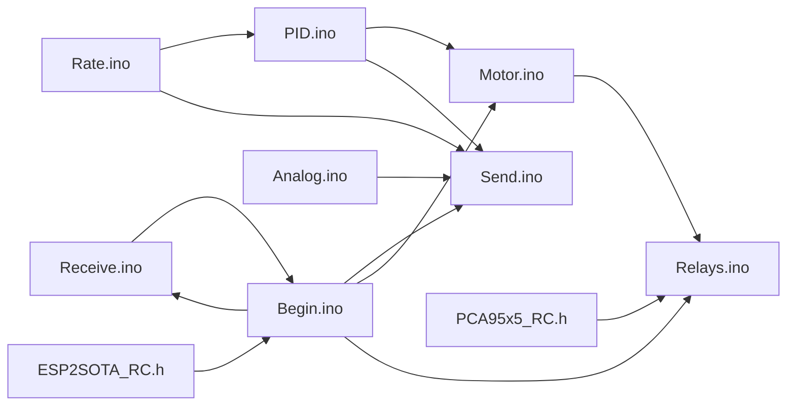
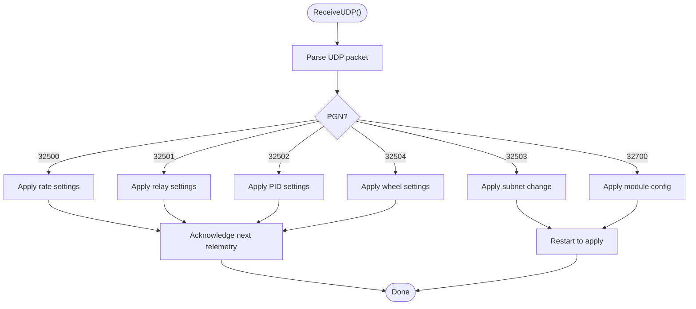
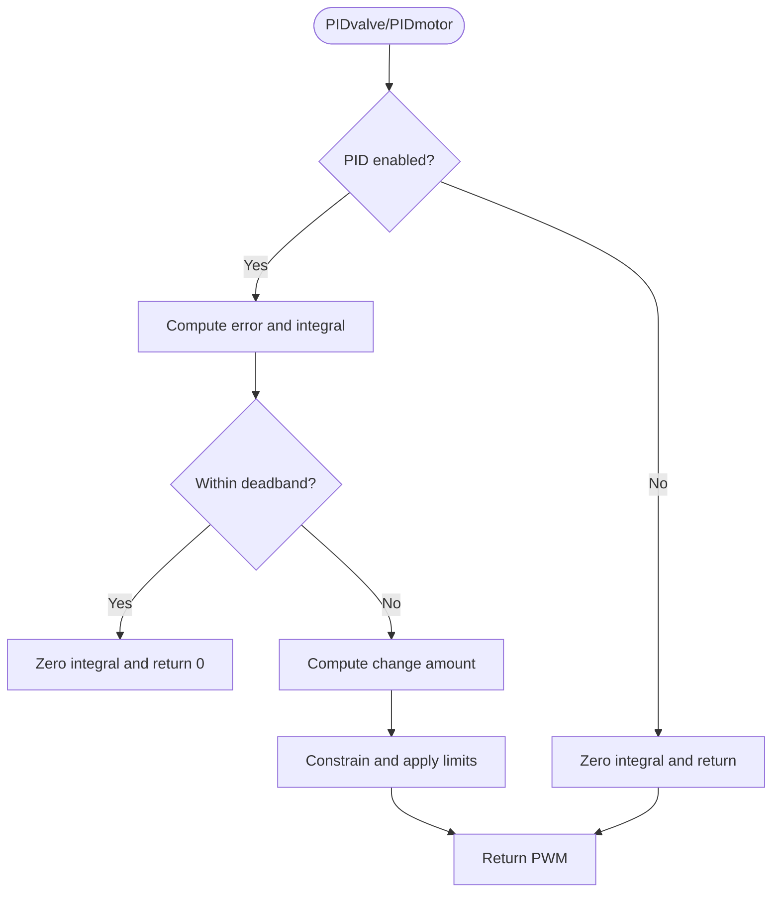

# API Reference

<cite>
**Referenced Files in This Document**
- [RC_ESP32.ino](file://RC_ESP32/RC_ESP32.ino)
- [Send.ino](file://RC_ESP32/Send.ino)
- [Receive.ino](file://RC_ESP32/Receive.ino)
- [PID.ino](file://RC_ESP32/PID.ino)
- [Rate.ino](file://RC_ESP32/Rate.ino)
- [Begin.ino](file://RC_ESP32/Begin.ino)
- [Motor.ino](file://RC_ESP32/Motor.ino)
- [Relays.ino](file://RC_ESP32/Relays.ino)
- [Analog.ino](file://RC_ESP32/Analog.ino)
- [PCA95x5_RC.h](file://RC_ESP32/PCA95x5_RC.h)
- [ESP2SOTA_RC.h](file://RC_ESP32/ESP2SOTA_RC/ESP2SOTA_RC.h)
- [Notes.txt](file://Notes.txt)
</cite>

## Table of Contents
1. [Introduction](#introduction)
2. [Project Structure](#project-structure)
3. [Core Components](#core-components)
4. [Architecture Overview](#architecture-overview)
5. [Detailed Component Analysis](#detailed-component-analysis)
6. [Dependency Analysis](#dependency-analysis)
7. [Performance Considerations](#performance-considerations)
8. [Troubleshooting Guide](#troubleshooting-guide)
9. [Conclusion](#conclusion)
10. [Appendices](#appendices)

## Introduction
This document provides a comprehensive API reference for the ESP32 Rate Control communication protocols and interfaces. It covers UDP message formats, packet structures, field definitions, encoding schemes, and the control algorithms used for rate control. It also documents configuration parameters, status reporting, telemetry formats, and integration guidelines for external applications such as tablet software, monitoring systems, and cloud services. Security considerations and authentication requirements are addressed, along with protocol versioning and backward compatibility.

## Project Structure
The ESP32 Rate Control firmware is organized around a modular architecture with distinct responsibilities:
- Communication: UDP reception and transmission
- Control: PID and timed control algorithms
- Sensors: Pulse counting and rate calculation
- Actuators: PWM output and relay control
- Hardware: I2C devices, ADC, and Ethernet/Wi-Fi connectivity
- Configuration: EEPROM-backed persistent storage and defaults
- OTA: Over-The-Air firmware updates via HTTP server

**Diagram sources**
- [Receive.ino:1-346](file://RC_ESP32/Receive.ino#L1-L346)
- [Send.ino:1-195](file://RC_ESP32/Send.ino#L1-L195)
- [PID.ino:1-232](file://RC_ESP32/PID.ino#L1-L232)
- [Rate.ino:1-106](file://RC_ESP32/Rate.ino#L1-L106)
- [Motor.ino:1-76](file://RC_ESP32/Motor.ino#L1-L76)
- [Relays.ino:1-282](file://RC_ESP32/Relays.ino#L1-L282)
- [Analog.ino:1-70](file://RC_ESP32/Analog.ino#L1-L70)
- [PCA95x5_RC.h:1-178](file://RC_ESP32/PCA95x5_RC.h#L1-L178)
- [ESP2SOTA_RC.h:1-34](file://RC_ESP32/ESP2SOTA_RC/ESP2SOTA_RC.h#L1-L34)
- [Begin.ino:1-769](file://RC_ESP32/Begin.ino#L1-L769)

**Section sources**
- [RC_ESP32.ino:1-418](file://RC_ESP32/RC_ESP32.ino#L1-L418)
- [Begin.ino:1-769](file://RC_ESP32/Begin.ino#L1-L769)

## Core Components
- UDP Telemetry Packets (PGN 32400 and 32401): Periodic status reports containing rate applied, accumulated quantity, PWM, Hz, and status flags.
- UDP Control Packets (PGN 32500 to 32504): Commands to set rates, control actuators, tune PID parameters, change subnet, and configure wheel speed sensor.
- Control Algorithms: PID control for valves and motors, timed combo control, and manual override.
- Sensor Processing: Pulse counting ISR, median filtering, rate calculation, and wheel speed measurement.
- Actuator Interfaces: PWM output and relay control via GPIO or I2C expanders.
- Configuration Management: Persistent storage of module and sensor configurations, defaults, and network settings.
- OTA Update: HTTP-based firmware update service integrated into the web server.

**Section sources**
- [Send.ino:1-195](file://RC_ESP32/Send.ino#L1-L195)
- [Receive.ino:29-343](file://RC_ESP32/Receive.ino#L29-L343)
- [PID.ino:1-232](file://RC_ESP32/PID.ino#L1-L232)
- [Rate.ino:14-106](file://RC_ESP32/Rate.ino#L14-L106)
- [Motor.ino:1-76](file://RC_ESP32/Motor.ino#L1-L76)
- [Relays.ino:11-282](file://RC_ESP32/Relays.ino#L11-L282)
- [Begin.ino:513-769](file://RC_ESP32/Begin.ino#L513-L769)

## Architecture Overview
The system operates on a periodic loop that:
- Receives UDP packets and applies configuration and control updates
- Reads sensors and calculates instantaneous rate and Hz
- Runs PID/timed control loops to compute PWM targets
- Applies PWM outputs and manages relay states
- Periodically transmits telemetry packets over UDP

**Diagram sources**
- [Receive.ino:29-343](file://RC_ESP32/Receive.ino#L29-L343)
- [Begin.ino:513-769](file://RC_ESP32/Begin.ino#L513-L769)
- [PID.ino:25-178](file://RC_ESP32/PID.ino#L25-L178)
- [Motor.ino:31-60](file://RC_ESP32/Motor.ino#L31-L60)
- [Relays.ino:11-69](file://RC_ESP32/Relays.ino#L11-L69)
- [Send.ino:1-195](file://RC_ESP32/Send.ino#L1-L195)

## Detailed Component Analysis

### UDP Message Formats and Field Definitions
The firmware uses a simple UDP-based protocol with PGN identifiers and fixed-length frames. All numeric fields are encoded in little-endian order unless otherwise noted.

- PGN 32400: Rate telemetry (per sensor)
  - Fields:
    - Bytes 0-1: Header (0x90, 0x7E)
    - Byte 2: Module/Sensor ID (upper nibble = module ID, lower nibble = sensor ID)
    - Bytes 3-5: Rate applied (units per minute × 1000), 24-bit unsigned
    - Bytes 6-8: Accumulated quantity (units × 10), 24-bit unsigned
    - Bytes 9-10: PWM value (0–255), 16-bit unsigned
    - Byte 11: Status flags
      - Bit 0: Sensor connected
    - Bytes 12-13: Hz (×10), 16-bit unsigned
    - Byte 14: CRC (sum modulo 256)
  - Transmission: Every 200 ms; sent to destination port 29999 on broadcast IP derived from module’s subnet.

- PGN 32401: Module telemetry
  - Fields:
    - Bytes 0-1: Header (0x91, 0x7E)
    - Byte 2: Module ID
    - Bytes 3-4: Pressure (0–1023), 16-bit unsigned
    - Bytes 5-6: Wheel speed (actual × 10), 16-bit unsigned
    - Bytes 7-9: Wheel count (32-bit unsigned)
    - Bytes 10-12: Firmware identifiers (InoType, InoID)
    - Byte 13: Status flags
      - Bit 0: Work pin state
      - Bit 1: Wi-Fi RSSI < -80
      - Bit 2: Wi-Fi RSSI < -70
      - Bit 3: Wi-Fi RSSI < -65
      - Bit 4: Ethernet link up
      - Bit 5: Pin configuration valid
      - Bit 6: 3-wire relays
    - Byte 14: CRC (sum modulo 256)
  - Transmission: Same schedule as PGN 32400.

- PGN 32500: Rate settings (from controller to module)
  - Fields:
    - Bytes 0-1: Header (0xF4, 0x7E)
    - Byte 2: Module/Sensor ID
    - Bytes 3-5: Rate set (UPM × 1000), 24-bit unsigned
    - Bytes 6-8: Meter calibration (×1000), 24-bit unsigned
    - Byte 9: Command
      - Bit 0: Reset accumulated quantity
      - Bits 1–3: Control type (0=standard valve, 1=combo close, 2=motor, 4=fan, 5=timed combo)
      - Bit 4: MasterOn
      - Bit 6: AutoOn
      - Bit 7: Calibration on
    - Bytes 10-11: Manual PWM adjustment (-32768 to 32767), 16-bit signed
    - Byte 13: CRC
  - Application: Updates TargetUPM, MeterCal, ControlType, MasterOn, AutoOn, CalibrationOn, ManualAdjust.

- PGN 32501: Relay settings
  - Fields:
    - Bytes 0-1: Header (0xF5, 0x7E)
    - Byte 2: Module ID
    - Bytes 3-4: Relay Lo/Hi (bitmask for sections 0–7 and 8–15)
    - Bytes 5-6: Power relay Lo/Hi (bitmask)
    - Bytes 7-8: Inverted Lo/Hi (bitmask)
    - Byte 9: Flow master valve index (0–15 or 255 disabled)
    - Byte 10: CRC
  - Application: Sets relay states and power/inverted masks.

- PGN 32502: Control settings (PID and timing)
  - Fields:
    - Bytes 0-1: Header (0xF6, 0x7E)
    - Byte 2: Module/Sensor ID
    - Byte 3: MaxPWM (% of 255)
    - Byte 4: MinPWM (% of 255)
    - Byte 5: Kp exponent (1.1^(value−120))
    - Byte 6: Ki exponent (1.1^(value−120))
    - Byte 7: Deadband (% × 10)
    - Byte 8: Brake point (%)
    - Byte 9: PID slow adjust (%)
    - Byte 10: Slew rate
    - Byte 11: Max integral (×10)
    - Byte 13: Timed minimum start (%)
    - Bytes 14-15: Timed adjust (ms)
    - Bytes 16-17: Timed pause (ms)
    - Byte 18: PID time (ms)
    - Byte 19: Pulse min Hz (×10)
    - Bytes 20-21: Pulse max Hz
    - Byte 22: Pulse sample size
    - Byte 23: CRC
  - Application: Updates PID parameters and timing for the specified sensor.

- PGN 32503: Subnet change
  - Fields:
    - Bytes 0-1: Header (0xF7, 0x7E)
    - Bytes 2-4: New subnet (IP 0–2)
    - Byte 5: CRC
  - Application: Updates module subnet and restarts device.

- PGN 32504: Wheel speed sensor settings
  - Fields:
    - Bytes 0-1: Header (0xF8, 0x7E)
    - Byte 2: Module ID
    - Byte 3: GPIO pin
    - Bytes 4-6: Wheel calibration (×1000)
    - Byte 7: Commands
      - Bit 0: Erase counts
    - Byte 8: CRC
  - Application: Updates wheel pin, calibration, and clears counts if requested.

- PGN 32700: Module configuration
  - Fields:
    - Bytes 0-1: Header (0xBC, 0x7F)
    - Byte 2: Module ID
    - Byte 3: Sensor count
    - Byte 4: Commands
      - Bit 0: Invert relay control
      - Bit 1: Invert flow control
      - Bit 3: Work pin is momentary
      - Bit 4: Is3Wire valve
      - Bit 5: ADS1115 enabled
    - Byte 5: Onboard relay control type
    - Byte 6: Remote relay control type
    - Bytes 7-12: Sensor 0/1 pins (Flow, IN1, IN2)
    - Bytes 13-28: Relay control pins 0–15
    - Byte 29: Work pin
    - Byte 30: Pressure pin
    - Byte 32: CRC
  - Application: Updates module configuration and restarts if needed.

Encoding and CRC:
- Numeric fields are encoded in little-endian order.
- CRC is computed as the sum of bytes modulo 256 over the payload (excluding CRC).

**Section sources**
- [Send.ino:7-195](file://RC_ESP32/Send.ino#L7-L195)
- [Receive.ino:29-343](file://RC_ESP32/Receive.ino#L29-L343)

### Function Signatures and Parameters
Public interfaces and internal functions used for control and communication:

- Control and telemetry
  - SendComm(): Periodically constructs and sends telemetry packets (PGN 32400/32401).
  - ReceiveUDP(): Parses incoming UDP packets and dispatches to ReadPGNs().
  - ReadPGNs(data[], len): Dispatches to handlers based on PGN.
  - SetPWM(): Computes PWM targets based on control mode and AutoOn.
  - AdjustFlow(): Applies PWM to actuators according to ControlType and MasterOn/Applying.
  - PIDvalve(ID): Valve PID control loop.
  - PIDmotor(ID): Motor/Fan PID control loop.
  - TimedCombo(ID, ManualAdjust): Timed combo control logic.
  - GetUPM(): Calculates instantaneous UPM and Hz from pulse samples.
  - ISR0..ISR5(): Interrupt handlers for pulse counting.

- Configuration and initialization
  - DoSetup(): Initializes EEPROM, loads data/networks, configures I2C, sensors, PWM, relays, Wi-Fi AP, UDP, and web server.
  - InitializeRelays(Control, End): Initializes relay control via GPIO or I2C expanders.
  - LoadData()/SaveData(): EEPROM persistence for module and sensor configs.
  - LoadDefaults(): Loads default configuration.
  - ValidData(): Validates pin and configuration ranges.
  - LoadNetworks()/SaveNetworks(): Network settings persistence.

- Actuators and sensors
  - SetPWM(ID, pwmVal): Writes PWM to IN1/IN2 pins with direction inversion and dithering.
  - CheckRelays(): Applies relay states based on connection and control modes.
  - ReadAnalog(): Reads pressure via ADS1115 or analog pin.

- Utilities
  - BuildModSenID(Mod_ID, Sen_ID): Packs module and sensor IDs into a single byte.
  - ParseModID(ID)/ParseSenID(ID): Extracts module/sensor IDs.
  - GoodCRC(data[], len): Verifies CRC.
  - CRC(data[], len, start): Computes CRC.
  - MedianFromArray(buf[], count): Computes median of pulse intervals.

**Section sources**
- [Send.ino:1-195](file://RC_ESP32/Send.ino#L1-L195)
- [Receive.ino:2-346](file://RC_ESP32/Receive.ino#L2-L346)
- [PID.ino:25-232](file://RC_ESP32/PID.ino#L25-L232)
- [Rate.ino:14-106](file://RC_ESP32/Rate.ino#L14-L106)
- [Begin.ino:4-769](file://RC_ESP32/Begin.ino#L4-L769)
- [Motor.ino:31-76](file://RC_ESP32/Motor.ino#L31-L76)
- [Relays.ino:11-282](file://RC_ESP32/Relays.ino#L11-L282)
- [Analog.ino:2-70](file://RC_ESP32/Analog.ino#L2-L70)

### Configuration Parameter Specifications
ModuleConfig (about 130 bytes):
- ID: Module identifier (0–15)
- SensorCount: Number of sensors (1–MaxProductCount)
- InvertRelay: Relay polarity inversion flag
- InvertFlow: Direction inversion for flow control
- RelayControlPins[16]: GPIO pin assignments for relays
- OnboardRelayControl: 0–6 (GPIO, PCA9555 8/16, MCP23017, PCA9685, PCF8574)
- RemoteRelayControl: Same as above for remote relays
- APname/APpassword: Access Point name and password
- WorkPin: GPIO pin for work switch or NC
- WorkPinIsMomentary: Momentary vs latching work pin
- Is3Wire: 3-wire vs 2-wire valve operation
- PressurePin: GPIO pin for pressure or NC
- ADS1115Enabled: Enable/disable ADS1115
- WheelSpeedPin: GPIO pin for wheel speed or NC
- WheelCal: Wheel calibration factor (×1000)

SensorConfig (about 104 bytes per sensor):
- FlowPin, IN1, IN2: GPIO pins for flow sensor and PWM control
- UPM: Instantaneous units per minute
- PWM: Current PWM value
- CommTime: Last communication timestamp
- ControlType: 0–5 (standard valve, combo close, motor, fan, timed combo)
- TotalPulses: Accumulated pulses
- TargetUPM: Target rate (UPM)
- MeterCal: Meter calibration factor (×1000)
- ManualAdjust: Manual PWM adjustment (-32768 to 32767)
- Hz: Instantaneous frequency (×10)
- MaxPWM, MinPWM: PWM limits (% of 255)
- Kp, Ki: PID gains (computed from exponents)
- Deadband: Deadband percentage (×1000)
- BrakePoint: Error threshold for brake point (%)
- PIDslowAdjust: Slow adjustment percentage
- SlewRate: Maximum PWM change per loop
- MaxIntegral: Max integral contribution (×10)
- TimedMinStart: Minimum start ratio (%) for timed combo
- TimedAdjust, TimedPause: Timing for timed combo (ms)
- PIDtime: Control loop period (ms)
- PulseMin, PulseMax: Pulse interval bounds (µs)
- PulseSampleSize: Sample size for median Hz calculation

Default values and ranges are loaded from LoadDefaults() and validated by ValidData(). EEPROM persistence ensures settings survive resets.

**Section sources**
- [RC_ESP32.ino:76-148](file://RC_ESP32/RC_ESP32.ino#L76-L148)
- [Begin.ino:564-619](file://RC_ESP32/Begin.ino#L564-L619)
- [Begin.ino:621-736](file://RC_ESP32/Begin.ino#L621-L736)

### Status Reporting Interfaces
Telemetry fields:
- PGN 32400 (per sensor):
  - Rate applied (UPM × 1000)
  - Accumulated quantity (units × 10)
  - PWM (0–255)
  - Status: sensor connected
  - Hz (×10)
- PGN 32401 (module-wide):
  - Pressure (0–1023)
  - Wheel speed (actual × 10)
  - Wheel count (32-bit)
  - Firmware identifiers (InoType, InoID)
  - Status flags: work pin, Wi-Fi RSSI thresholds, Ethernet link, pin validity, 3-wire relays

Diagnostic codes and error conditions:
- SensorConnected: True if communication received within timeout
- PIDenabled: True if sensor connected, AutoOn, and TargetUPM > 0
- Applying: True if MasterOn and TargetUPM > 0 or AutoOn is disabled
- CRC validation errors: Packets with invalid CRC are ignored
- Network disconnections: Automatic fallback to AP mode after repeated STA failures

**Section sources**
- [Send.ino:7-195](file://RC_ESP32/Send.ino#L7-L195)
- [RC_ESP32.ino:265-270](file://RC_ESP32/RC_ESP32.ino#L265-L270)
- [Begin.ino:212-244](file://RC_ESP32/Begin.ino#L212-L244)

### Protocol-Specific Examples
- Constructing PGN 32500 (rate settings):
  - BuildModSenID(moduleID, sensorID) and pack TargetUPM (×1000), MeterCal (×1000), Command byte, ManualAdjust (signed 16-bit), then append CRC.
- Encoding PGN 32502 (control settings):
  - Convert MaxPWM/MinPWM to percentages, Kp/Ki from exponents, Deadband/BrakePoint/PIDslowAdjust to scaled integers, and encode timing fields accordingly.
- Parsing PGN 32401 (telemetry):
  - Unpack Pressure, Wheel speed, Wheel count, InoType/InoID, and status flags; interpret RSSI thresholds and Ethernet link status.

Response handling:
- After applying PGN 32500/32502, the module updates internal state and persists settings via SaveData(). Telemetry packets reflect the new state within the next transmission cycle.

**Section sources**
- [Receive.ino:29-343](file://RC_ESP32/Receive.ino#L29-L343)
- [Send.ino:7-195](file://RC_ESP32/Send.ino#L7-L195)
- [Begin.ino:550-562](file://RC_ESP32/Begin.ino#L550-L562)

### API Versioning, Backward Compatibility, and Deprecation
- Firmware identification:
  - InoType: 4 for ESP Rate module
  - InoID: Encodes firmware date (YYYY, MM, DD) in packed format; used to validate EEPROM data integrity.
- Version display:
  - Firmware prints a formatted version string derived from InoID.
- Backward compatibility:
  - CRC-based validation ensures malformed packets are rejected.
  - Defaults are loaded if stored configuration is invalid.
- Deprecation:
  - No deprecated fields observed in current code; future changes should maintain CRC and PGN semantics.

**Section sources**
- [RC_ESP32.ino:28-32](file://RC_ESP32/RC_ESP32.ino#L28-L32)
- [Begin.ino:23-45](file://RC_ESP32/Begin.ino#L23-L45)
- [Begin.ino:521-548](file://RC_ESP32/Begin.ino#L521-L548)

### Integration Guidelines for External Applications
- Tablet software:
  - Connect to the ESP32 Access Point (SSID: RateModule_XXXXXX) and set the subnet to match the AP network (192.168.(200+module).0).
  - Send UDP control packets to port 28888 on the module’s IP or broadcast to 255.255.255.255.
- Monitoring systems:
  - Subscribe to UDP telemetry on port 29999; parse PGN 32400/32401 to monitor rates, PWM, and status.
- Cloud services:
  - Forward telemetry to cloud endpoints; ensure CRC validation and handle missing packets gracefully.
- Network configuration:
  - Use PGN 32503 to change subnet; the module will restart to apply changes.
  - Optionally enable Wi-Fi station mode via network settings; the module falls back to AP mode after repeated failures.

**Section sources**
- [Notes.txt:1-8](file://Notes.txt#L1-L8)
- [Receive.ino:222-244](file://RC_ESP32/Receive.ino#L222-L244)
- [Begin.ino:173-255](file://RC_ESP32/Begin.ino#L173-L255)

### Security Considerations and Authentication
- Access Point:
  - Open AP by default; a minimum 8-character WPA2 passphrase enables secure AP mode.
- Wi-Fi Station:
  - Credentials are stored in EEPROM; ensure secure handling of credentials and consider network segmentation.
- OTA Updates:
  - OTA is served via the built-in HTTP server; restrict access to trusted networks and consider adding authentication or HTTPS.
- Packet Integrity:
  - All control packets include CRC; malformed packets are ignored to prevent unintended control changes.

**Section sources**
- [Begin.ino:194-203](file://RC_ESP32/Begin.ino#L194-L203)
- [Receive.ino:62-98](file://RC_ESP32/Receive.ino#L62-L98)
- [ESP2SOTA_RC.h:15-33](file://RC_ESP32/ESP2SOTA_RC/ESP2SOTA_RC.h#L15-L33)

## Dependency Analysis
Key dependencies and relationships:
- Communication depends on UDP sockets for Ethernet and Wi-Fi.
- Control depends on sensor inputs and PWM outputs; relay control depends on I2C expanders or GPIO.
- EEPROM provides persistent storage for configuration and defaults.
- Web server and OTA update service integrate with the HTTP stack.

**Diagram sources**
- [Receive.ino:29-343](file://RC_ESP32/Receive.ino#L29-L343)
- [PID.ino:25-178](file://RC_ESP32/PID.ino#L25-L178)
- [Motor.ino:31-60](file://RC_ESP32/Motor.ino#L31-L60)
- [Relays.ino:11-282](file://RC_ESP32/Relays.ino#L11-L282)
- [Analog.ino:2-70](file://RC_ESP32/Analog.ino#L2-L70)
- [Send.ino:1-195](file://RC_ESP32/Send.ino#L1-L195)
- [Begin.ino:513-769](file://RC_ESP32/Begin.ino#L513-L769)
- [PCA95x5_RC.h:55-178](file://RC_ESP32/PCA95x5_RC.h#L55-L178)
- [ESP2SOTA_RC.h:15-33](file://RC_ESP32/ESP2SOTA_RC/ESP2SOTA_RC.h#L15-L33)

**Section sources**
- [RC_ESP32.ino:12-25](file://RC_ESP32/RC_ESP32.ino#L12-L25)
- [Begin.ino:513-769](file://RC_ESP32/Begin.ino#L513-L769)

## Performance Considerations
- Loop timing:
  - Main loop runs at approximately 20 Hz (50 ms).
  - Telemetry transmission occurs every 200 ms.
- ISR latency:
  - Pulse ISR uses IRAM_ATTR to minimize interrupt latency.
- PWM resolution and frequency:
  - PWM frequency is 490 Hz; bit depth varies by platform (12-bit on ESP32, 8-bit on others).
- Median filtering:
  - Pulse samples are filtered using a median calculation to reduce noise.
- CRC computation:
  - Lightweight checksum reduces overhead while ensuring packet integrity.

[No sources needed since this section provides general guidance]

## Troubleshooting Guide
Common issues and resolutions:
- No telemetry received:
  - Verify destination IP and port; ensure broadcast or correct unicast IP is used.
  - Confirm CRC validation passes on control packets.
- Incorrect rate readings:
  - Check MeterCal and PulseSampleSize; ensure sensor wiring and interrupts are configured correctly.
- Relay not responding:
  - Validate relay control type and I2C address; confirm pin assignments and polarity inversion settings.
- Wi-Fi connectivity problems:
  - Review Wi-Fi credentials and network availability; the module will fall back to AP mode after repeated failures.
- OTA update failures:
  - Ensure the update endpoint is reachable and the firmware image is valid.

**Section sources**
- [Receive.ino:62-98](file://RC_ESP32/Receive.ino#L62-L98)
- [Rate.ino:31-74](file://RC_ESP32/Rate.ino#L31-L74)
- [Relays.ino:347-511](file://RC_ESP32/Relays.ino#L347-L511)
- [Begin.ino:212-244](file://RC_ESP32/Begin.ino#L212-L244)
- [Notes.txt:6-8](file://Notes.txt#L6-L8)

## Conclusion
The ESP32 Rate Control firmware provides a robust UDP-based communication interface with well-defined packet formats, CRC validation, and comprehensive control algorithms. Its modular design supports multiple relay control mechanisms, configurable sensors, and reliable telemetry reporting. By adhering to the documented APIs and configuration parameters, external applications can integrate seamlessly for monitoring, control, and diagnostics.

[No sources needed since this section summarizes without analyzing specific files]

## Appendices

### UDP Packet Construction Flow

**Diagram sources**
- [Receive.ino:29-343](file://RC_ESP32/Receive.ino#L29-L343)

### PID Control Flow

**Diagram sources**
- [PID.ino:69-178](file://RC_ESP32/PID.ino#L69-L178)