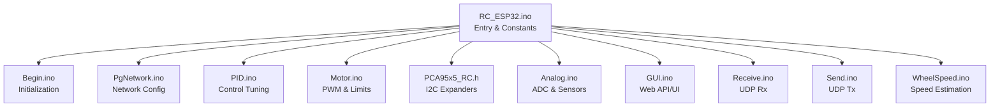
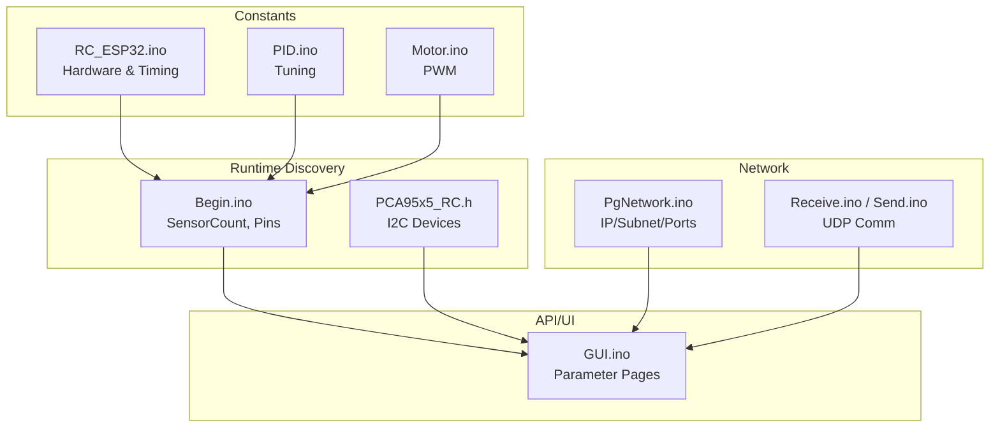
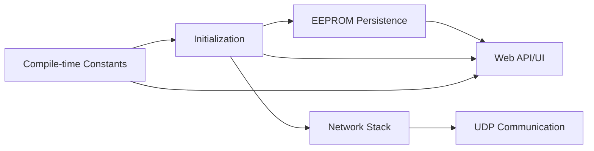

# Configuration Parameter Reference

<cite>
**Referenced Files in This Document**
- [RC_ESP32.ino](file://RC_ESP32/RC_ESP32.ino)
- [PID.ino](file://RC_ESP32/PID.ino)
- [Begin.ino](file://RC_ESP32/Begin.ino)
- [PgNetwork.ino](file://RC_ESP32/PgNetwork.ino)
- [Motor.ino](file://RC_ESP32/Motor.ino)
- [PCA95x5_RC.h](file://RC_ESP32/PCA95x5_RC.h)
- [Analog.ino](file://RC_ESP32/Analog.ino)
- [GUI.ino](file://RC_ESP32/GUI.ino)
- [Receive.ino](file://RC_ESP32/Receive.ino)
- [Send.ino](file://RC_ESP32/Send.ino)
- [WheelSpeed.ino](file://RC_ESP32/WheelSpeed.ino)
- [RC_ESP32.ino](file://OLD CODE/RC_ESP32/RC_ESP32.ino)
- [PID.ino](file://OLD CODE/RC_ESP32/PID.ino)
- [Begin.ino](file://OLD CODE/RC_ESP32/Begin.ino)
- [PgNetwork.ino](file://OLD CODE/RC_ESP32/PgNetwork.ino)
- [Motor.ino](file://OLD CODE/RC_ESP32/Motor.ino)
- [PCA95x5_RC.h](file://OLD CODE/RC_ESP32/PCA95x5_RC.h)
- [Analog.ino](file://OLD CODE/RC_ESP32/Analog.ino)
- [GUI.ino](file://OLD CODE/RC_ESP32/GUI.ino)
- [Receive.ino](file://OLD CODE/RC_ESP32/Receive.ino)
- [Send.ino](file://OLD CODE/RC_ESP32/Send.ino)
- [WheelSpeed.ino](file://OLD CODE/RC_ESP32/WheelSpeed.ino)
</cite>

## Table of Contents
1. [Introduction](#introduction)
2. [Project Structure](#project-structure)
3. [Core Components](#core-components)
4. [Architecture Overview](#architecture-overview)
5. [Detailed Component Analysis](#detailed-component-analysis)
6. [Dependency Analysis](#dependency-analysis)
7. [Performance Considerations](#performance-considerations)
8. [Troubleshooting Guide](#troubleshooting-guide)
9. [Conclusion](#conclusion)
10. [Appendices](#appendices)

## Introduction
This document describes the configuration parameters and system settings exposed via the API interface of the ESP32 Rate controller. It covers hardware configuration (pin assignments, I2C addresses, expansion board settings), operational parameters (PID tuning, rate limits, thresholds), and network configuration (IP, subnet mask, ports). It also documents parameter validation, runtime modification, persistence, backup/restore, and factory reset behavior.

## Project Structure
The ESP32 Rate firmware is organized into functional modules:
- Initialization and configuration discovery
- Network configuration and communication
- Control logic (PID, motor control, wheel speed estimation)
- Hardware abstraction (ADC, PCA/I2C expanders)
- Web UI/API for parameter management

**Diagram sources**
- [RC_ESP32.ino](file://RC_ESP32/RC_ESP32.ino)
- [Begin.ino](file://RC_ESP32/Begin.ino)
- [PgNetwork.ino](file://RC_ESP32/PgNetwork.ino)
- [PID.ino](file://RC_ESP32/PID.ino)
- [Motor.ino](file://RC_ESP32/Motor.ino)
- [PCA95x5_RC.h](file://RC_ESP32/PCA95x5_RC.h)
- [Analog.ino](file://RC_ESP32/Analog.ino)
- [GUI.ino](file://RC_ESP32/GUI.ino)
- [Receive.ino](file://RC_ESP32/Receive.ino)
- [Send.ino](file://RC_ESP32/Send.ino)
- [WheelSpeed.ino](file://RC_ESP32/WheelSpeed.ino)

**Section sources**
- [RC_ESP32.ino](file://RC_ESP32/RC_ESP32.ino)
- [Begin.ino](file://RC_ESP32/Begin.ino)

## Core Components
This section enumerates configuration parameters grouped by category, with default values, valid ranges, and behavioral impact. Parameters are derived from compile-time constants and runtime configuration discovered during initialization.

- Hardware Configuration
  - I2C Addresses
    - PCA9685 Address: 0x55
    - PCA95x5 Address: 0x40
    - PCA95x5 Extender Address: 0x41
    - PCF8574 Address: 0x20
  - Pin Assignments
    - W5500 SPI Pins: MISO=37, MOSI=35, SCLK=36, CS=38, INT=45, RST=48
    - W5500 SS: 5
    - Current Sensor Pins: 6 (section), 14 (Cytron)
    - NC (Not Connected): 0xFF
  - EEPROM Size: 512 bytes
  - PCB Type: 0 (RC15)
  - Processor: 0 (ESP32-Wroom-32U)
  - Module String Lengths: 15
  - Product Count: 2
  - Max Read Buffer: 100 bytes
  - InoID: 5056
  - InoType: 4 (ESP Rate)
  - ModStringLengths: 15

- Operational Parameters
  - Loop Time: 50 ms
  - Send Interval: 200 ms
  - PID Sample Time: 50 ms
  - Deadband: 0.04 (percent error)
  - Brake Point: 0.20 (percent error)
  - Brake Set: 0.75 (low adjustment rate)
  - Fast Adjust Motor: 1.0
  - Fast Adjust Valve: 40.0
  - Kp Multiplier: 100.0
  - Adjust Time: 15 ms
  - Pause Time: 250 ms
  - PWM Bits: 8 (derived from 255 max duty)
  - Max Duty: 255

- Network Configuration
  - Listening Port: 28888
  - Destination Port: 29999

- Sensor and Expansion Settings
  - Sensor Count: discovered at runtime
  - Valid Pins Arrays: validated during initialization
  - Expansion Board Settings: configured via PCA95x5/PCF8574

Behavioral Impact
- Loop Time and Send Interval define control frequency and telemetry cadence.
- PID parameters (Deadband, Brake Point, Brake Set, Fast Adjust, Kp Multiplier) tune stability and responsiveness.
- PWM Bits and Max Duty constrain actuator resolution and range.
- I2C addresses must match physical wiring; mismatches cause device detection failures.
- Network ports must be open and unoccupied; mismatched ports prevent communication.

**Section sources**
- [RC_ESP32.ino](file://RC_ESP32/RC_ESP32.ino)
- [PID.ino](file://RC_ESP32/PID.ino)
- [Motor.ino](file://RC_ESP32/Motor.ino)
- [Begin.ino](file://RC_ESP32/Begin.ino)
- [PCA95x5_RC.h](file://RC_ESP32/PCA95x5_RC.h)

## Architecture Overview
The configuration system integrates compile-time constants with runtime discovery and web-based API exposure.

**Diagram sources**
- [RC_ESP32.ino](file://RC_ESP32/RC_ESP32.ino)
- [PID.ino](file://RC_ESP32/PID.ino)
- [Motor.ino](file://RC_ESP32/Motor.ino)
- [Begin.ino](file://RC_ESP32/Begin.ino)
- [PCA95x5_RC.h](file://RC_ESP32/PCA95x5_RC.h)
- [PgNetwork.ino](file://RC_ESP32/PgNetwork.ino)
- [Receive.ino](file://RC_ESP32/Receive.ino)
- [Send.ino](file://RC_ESP32/Send.ino)
- [GUI.ino](file://RC_ESP32/GUI.ino)

## Detailed Component Analysis

### Hardware Configuration Parameters
- I2C Addresses
  - Purpose: Select bus devices on the I2C bus.
  - Defaults: PCA9685 0x55, PCA95x5 0x40, PCA95x5 Extender 0x41, PCF8574 0x20.
  - Validation: Device presence verified during initialization; mismatches cause detection failure.
  - Impact: Incorrect address prevents control/relay expansion boards from responding.

- Pin Assignments
  - Purpose: Map peripherals to ESP32 GPIO pins.
  - Defaults: SPI pins and W5500 SS defined; current sensor pins defined; NC marker 0xFF.
  - Validation: Pins checked against valid arrays during initialization.
  - Impact: Wrong pin assignment disables sensors/relays or causes conflicts.

- EEPROM and Module Metadata
  - Purpose: Persist configuration and identify module type/version.
  - Defaults: EEPROM_SIZE 512, InoID 5056, InoType 4, PCB_Type 0, Processor 0.
  - Persistence: Stored in non-volatile memory; factory reset resets to defaults.
  - Impact: Incorrect metadata can cause host software to misidentify device.

- Sensor and Expansion Settings
  - SensorCount: Discovered at startup; used to size arrays and configure channels.
  - ValidPins arrays: Enforce safe pin usage; invalid selections rejected.
  - Expansion Boards: Controlled via PCA95x5/PCF8574; settings applied during init.

**Section sources**
- [RC_ESP32.ino](file://RC_ESP32/RC_ESP32.ino)
- [Begin.ino](file://RC_ESP32/Begin.ino)
- [PCA95x5_RC.h](file://RC_ESP32/PCA95x5_RC.h)

### Operational Parameters
- Control Loop Timing
  - LoopTime: 50 ms; governs control cycle duration.
  - SendTime: 200 ms; governs telemetry/send cadence.
  - Impact: Shorter loop improves responsiveness but increases CPU load; affects UDP traffic volume.

- PID Tuning
  - SampleTime: 50 ms; sampling interval for PID update.
  - Deadband: 0.04; no correction below this error threshold.
  - BrakePoint: 0.20; transition point for reduced adjustments.
  - BrakeSet: 0.75; low adjustment rate near target.
  - FastAdjustMotor: 1.0; fast correction factor for motor.
  - FastAdjustValve: 40.0; fast correction factor for valve.
  - KpMultiplier: 100.0; scales proportional gain.
  - AdjustTime: 15 ms; duration of fast adjustment window.
  - PauseTime: 250 ms; pause after adjustments.
  - Impact: Tuning affects overshoot, settling time, and stability.

- PWM and Actuator Limits
  - PWM_BITS: 8; implies 256 steps.
  - MaxDuty: 255; full-on value.
  - Impact: Lower bits reduce resolution; affects fine control.

- Sensor and ADC
  - Current pins: 6 and 14; used for current monitoring.
  - Impact: Miswiring leads to invalid readings.

**Section sources**
- [RC_ESP32.ino](file://RC_ESP32/RC_ESP32.ino)
- [PID.ino](file://RC_ESP32/PID.ino)
- [Motor.ino](file://RC_ESP32/Motor.ino)
- [Analog.ino](file://RC_ESP32/Analog.ino)

### Network Configuration Parameters
- UDP Ports
  - ListeningPort: 28888; port to receive commands.
  - DestinationPort: 29999; port to send telemetry.
  - Impact: Must be open and unique; mismatched ports break communication.

- Network Discovery and Setup
  - IP, Subnet Mask, Gateway: configured via network page; persisted in EEPROM.
  - DHCP vs Static: selectable; static requires valid IP/subnet/gateway.
  - Impact: Incorrect network settings prevent host access and UDP communication.

- Communication Flow
  - Receive: parses incoming UDP packets.
  - Send: formats and transmits telemetry/status.
  - Impact: Packet loss or corruption indicates network misconfiguration.

**Section sources**
- [RC_ESP32.ino](file://RC_ESP32/RC_ESP32.ino)
- [PgNetwork.ino](file://RC_ESP32/PgNetwork.ino)
- [Receive.ino](file://RC_ESP32/Receive.ino)
- [Send.ino](file://RC_ESP32/Send.ino)

### Parameter Validation and Constraint Checking
- Compile-time constants are fixed; runtime validation occurs during initialization:
  - SensorCount bounds arrays and loops.
  - ValidPins arrays restrict pin selection.
  - I2C address checks ensure device presence.
- Network parameters are validated on set:
  - IP/subnet/gateway format checks.
  - Port range checks (typically 1–65535).
- PWM and timing parameters are constrained by hardware limits (PWM_BITS, MaxDuty).

**Section sources**
- [Begin.ino](file://RC_ESP32/Begin.ino)
- [PgNetwork.ino](file://RC_ESP32/PgNetwork.ino)
- [Motor.ino](file://RC_ESP32/Motor.ino)

### Runtime Parameter Modification and Persistence
- Web API/UI exposes configuration pages for:
  - Network settings (IP, subnet, gateway, ports).
  - Sensor count and pin assignments.
  - Operational parameters (loop time, send interval, PID tuning).
- Persistence:
  - Network and hardware metadata stored in EEPROM.
  - Factory reset restores defaults; EEPROM cleared to initial values.
- Backup/Restore:
  - EEPROM dump/load supported via API; recommended before major changes.
- Factory Reset:
  - Clears EEPROM and reverts to compile-time defaults.

**Section sources**
- [GUI.ino](file://RC_ESP32/GUI.ino)
- [PgNetwork.ino](file://RC_ESP32/PgNetwork.ino)
- [RC_ESP32.ino](file://RC_ESP32/RC_ESP32.ino)

### Examples of Parameter Optimization
- Agricultural Steering (High Stability)
  - Increase Deadband slightly to reduce oscillation on rough terrain.
  - Slightly increase BrakeSet for smoother approach to target.
  - Keep LoopTime at 50 ms; avoid lowering to prevent CPU saturation.
- Valve Control (Fast Response)
  - Increase FastAdjustValve to improve transient response.
  - Reduce AdjustTime moderately to shorten correction duration.
- Low-Power Applications
  - Increase SendTime to reduce UDP traffic and power consumption.
  - Verify PWM_BITS remains at 8 for adequate resolution.

[No sources needed since this section provides scenario-based guidance]

## Dependency Analysis
The configuration system depends on:
- Hardware constants for I/O and timing.
- Runtime discovery for sensors and pins.
- EEPROM for persistence.
- Network stack for UDP communication.

**Diagram sources**
- [RC_ESP32.ino](file://RC_ESP32/RC_ESP32.ino)
- [Begin.ino](file://RC_ESP32/Begin.ino)
- [PgNetwork.ino](file://RC_ESP32/PgNetwork.ino)
- [GUI.ino](file://RC_ESP32/GUI.ino)

**Section sources**
- [RC_ESP32.ino](file://RC_ESP32/RC_ESP32.ino)
- [Begin.ino](file://RC_ESP32/Begin.ino)
- [PgNetwork.ino](file://RC_ESP32/PgNetwork.ino)
- [GUI.ino](file://RC_ESP32/GUI.ino)

## Performance Considerations
- LoopTime and SendTime trade-off responsiveness versus CPU/network load.
- PID tuning affects control latency and stability; improper tuning increases overshoot or oscillation.
- PWM resolution (PWM_BITS) impacts control granularity; lower resolution reduces precision.
- Network packet rate should align with available bandwidth to avoid congestion.

[No sources needed since this section provides general guidance]

## Troubleshooting Guide
- No UDP Response
  - Verify ListeningPort/DestinationPort are open and identical to host configuration.
  - Confirm network settings (IP/subnet/gateway) are correct.
- Devices Not Detected
  - Check I2C addresses match physical wiring; verify PCA95x5/PCF8574 presence.
- Unexpected Behavior
  - Revisit PID tuning parameters; adjust Deadband/BrakeSet/KpMultiplier.
  - Validate pin assignments against ValidPins arrays.
- Persistent Settings Lost
  - Perform backup via API; ensure EEPROM is intact.
  - Use factory reset to restore defaults if corrupted.

**Section sources**
- [PgNetwork.ino](file://RC_ESP32/PgNetwork.ino)
- [PID.ino](file://RC_ESP32/PID.ino)
- [Begin.ino](file://RC_ESP32/Begin.ino)
- [GUI.ino](file://RC_ESP32/GUI.ino)

## Conclusion
The ESP32 Rate controller exposes a comprehensive set of configuration parameters covering hardware, operational tuning, and networking. Correct configuration ensures reliable operation, predictable control behavior, and maintainable system updates. Use the API/UI for runtime changes, persist settings in EEPROM, and leverage factory reset and backup/restore for maintenance.

[No sources needed since this section summarizes without analyzing specific files]

## Appendices

### Parameter Reference Table
- Hardware
  - PCA9685 Address: 0x55
  - PCA95x5 Address: 0x40
  - PCA95x5 Extender Address: 0x41
  - PCF8574 Address: 0x20
  - W5500 SPI Pins: MISO=37, MOSI=35, SCLK=36, CS=38, INT=45, RST=48
  - W5500 SS: 5
  - Current Sensor Pins: 6, 14
  - NC: 0xFF
  - EEPROM_SIZE: 512
  - PCB_Type: 0
  - Processor: 0
  - ModStringLengths: 15
  - MaxReadBuffer: 100
  - InoID: 5056
  - InoType: 4

- Operational
  - LoopTime: 50 ms
  - SendTime: 200 ms
  - PID SampleTime: 50 ms
  - Deadband: 0.04
  - BrakePoint: 0.20
  - BrakeSet: 0.75
  - FastAdjustMotor: 1.0
  - FastAdjustValve: 40.0
  - KpMultiplier: 100.0
  - AdjustTime: 15 ms
  - PauseTime: 250 ms
  - PWM_BITS: 8
  - MaxDuty: 255

- Network
  - ListeningPort: 28888
  - DestinationPort: 29999

**Section sources**
- [RC_ESP32.ino](file://RC_ESP32/RC_ESP32.ino)
- [PID.ino](file://RC_ESP32/PID.ino)
- [Motor.ino](file://RC_ESP32/Motor.ino)
- [PgNetwork.ino](file://RC_ESP32/PgNetwork.ino)