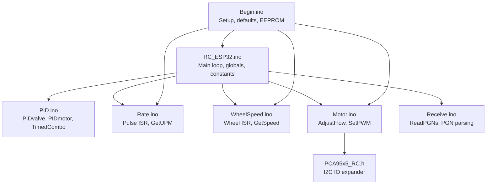
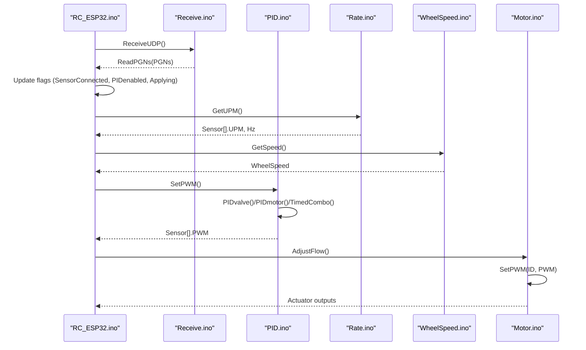
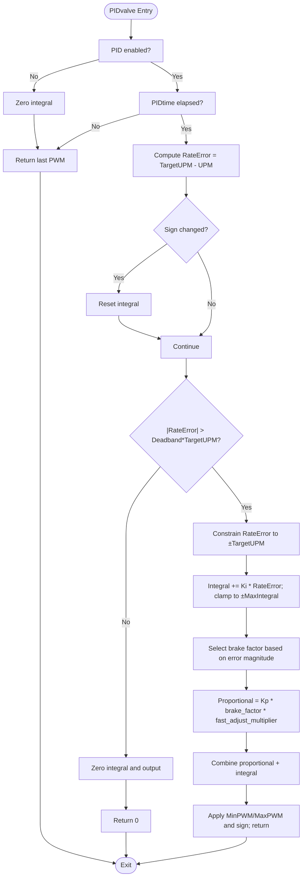
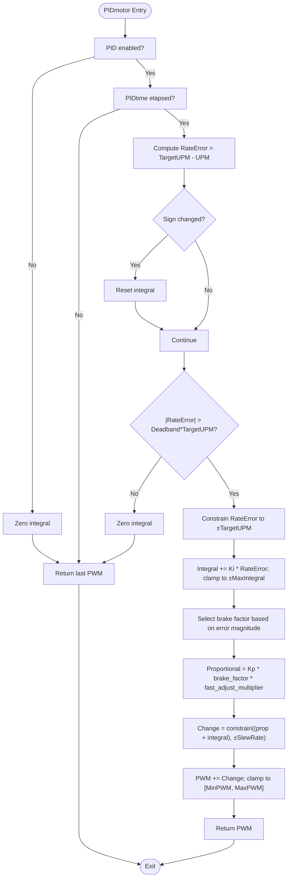
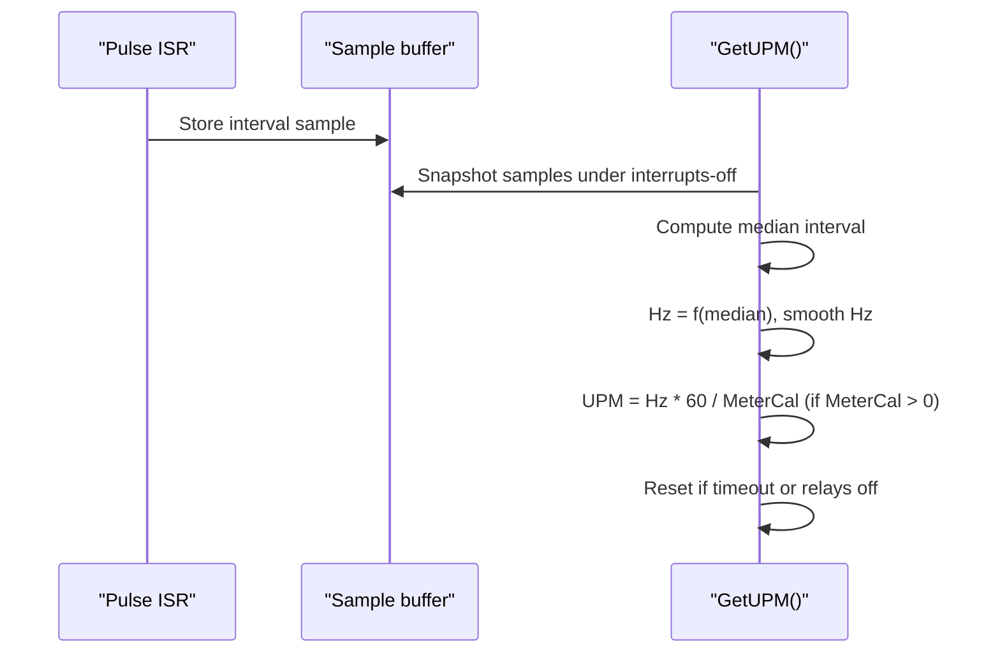
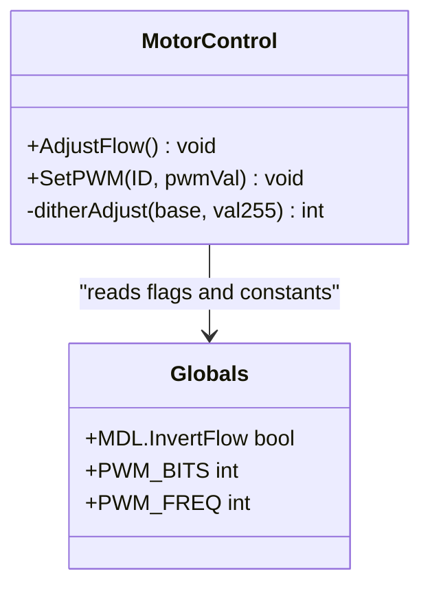
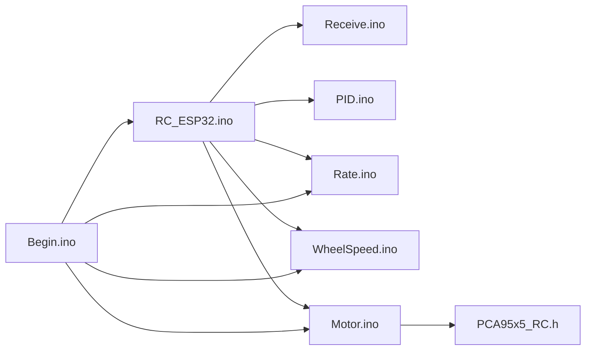

# Control Algorithm Interfaces

<cite>
**Referenced Files in This Document**
- [RC_ESP32.ino](file://RC_ESP32/RC_ESP32.ino)
- [PID.ino](file://RC_ESP32/PID.ino)
- [Rate.ino](file://RC_ESP32/Rate.ino)
- [WheelSpeed.ino](file://RC_ESP32/WheelSpeed.ino)
- [Motor.ino](file://RC_ESP32/Motor.ino)
- [Receive.ino](file://RC_ESP32/Receive.ino)
- [PCA95x5_RC.h](file://RC_ESP32/PCA95x5_RC.h)
- [Begin.ino](file://RC_ESP32/Begin.ino)
</cite>

## Table of Contents
1. [Introduction](#introduction)
2. [Project Structure](#project-structure)
3. [Core Components](#core-components)
4. [Architecture Overview](#architecture-overview)
5. [Detailed Component Analysis](#detailed-component-analysis)
6. [Dependency Analysis](#dependency-analysis)
7. [Performance Considerations](#performance-considerations)
8. [Troubleshooting Guide](#troubleshooting-guide)
9. [Conclusion](#conclusion)
10. [Appendices](#appendices)

## Introduction
This document describes the control algorithm interfaces for the ESP32 Rate module, focusing on PID control functions, rate calculation methods, and motor control APIs. It documents function signatures, parameter specifications, return value formats, and the underlying mathematics. It also explains tuning parameters (proportional, integral, derivative equivalents), sensor input processing, filtering, output scaling, motor control commands, direction control, safety limits, and anti-windup mechanisms. Practical guidance is included for parameter tuning and system calibration, along with control loop timing, stability considerations, and anti-windup protection.

## Project Structure
The control system is organized around a real-time loop that receives configuration via UDP, computes rates from sensor interrupts, applies PID control, and drives actuators. Key modules:
- Control loop and configuration: RC_ESP32.ino
- PID control and actuator PWM: PID.ino, Motor.ino
- Rate estimation from flow pulses: Rate.ino, WheelSpeed.ino
- Configuration and parameter updates: Receive.ino
- Hardware abstraction and I2C IO expanders: PCA95x5_RC.h
- Initialization and defaults: Begin.ino

**Diagram sources**
- [RC_ESP32.ino:255-280](file://RC_ESP32/RC_ESP32.ino#L255-L280)
- [PID.ino:25-126](file://RC_ESP32/PID.ino#L25-L126)
- [Rate.ino:14-74](file://RC_ESP32/Rate.ino#L14-L74)
- [WheelSpeed.ino:15-69](file://RC_ESP32/WheelSpeed.ino#L15-L69)
- [Motor.ino:2-76](file://RC_ESP32/Motor.ino#L2-L76)
- [Receive.ino:29-343](file://RC_ESP32/Receive.ino#L29-L343)
- [PCA95x5_RC.h:55-178](file://RC_ESP32/PCA95x5_RC.h#L55-L178)
- [Begin.ino:4-345](file://RC_ESP32/Begin.ino#L4-L345)

**Section sources**
- [RC_ESP32.ino:179-280](file://RC_ESP32/RC_ESP32.ino#L179-L280)
- [Begin.ino:4-345](file://RC_ESP32/Begin.ino#L4-L345)

## Core Components
- PID control functions:
  - PIDvalve: Valve control with deadband, integral anti-windup, brake factor, and output limiting.
  - PIDmotor: Motor/fan control with slew-rate limiting and integral anti-windup.
  - TimedCombo: Alternating timed close/open mode for combo valves.
  - SetPWM: Dispatches control to appropriate control function per sensor.
- Rate calculation:
  - Pulse ISR captures inter-pulse intervals, filters via median, computes Hz and UPM with exponential smoothing.
  - Wheel speed ISR and GetSpeed compute vehicle speed from wheel pulses.
- Motor control:
  - AdjustFlow: Applies control type-specific logic and safety limits.
  - SetPWM: Converts 0–255 PWM to duty cycle, handles direction, and writes to PWM channels or pins.
- Configuration and communication:
  - ReceiveUDP and ReadPGNs parse incoming PGNs to update targets, calibrations, control parameters, and wheel sensor settings.

**Section sources**
- [PID.ino:25-126](file://RC_ESP32/PID.ino#L25-L126)
- [Rate.ino:14-74](file://RC_ESP32/Rate.ino#L14-L74)
- [WheelSpeed.ino:15-69](file://RC_ESP32/WheelSpeed.ino#L15-L69)
- [Motor.ino:2-76](file://RC_ESP32/Motor.ino#L2-L76)
- [Receive.ino:29-343](file://RC_ESP32/Receive.ino#L29-L343)

## Architecture Overview
The control loop runs at approximately 20 Hz. Each iteration:
- Receives UDP packets and parses PGNs to update targets and parameters.
- Updates connectivity and enable flags for PID and applying conditions.
- Reads sensors (pulse counters, wheel speed, analog if present).
- Computes UPM from median-filtered pulse intervals.
- Executes PID control per sensor and sets PWM.
- Sends telemetry periodically.

**Diagram sources**
- [RC_ESP32.ino:255-280](file://RC_ESP32/RC_ESP32.ino#L255-L280)
- [Receive.ino:29-343](file://RC_ESP32/Receive.ino#L29-L343)
- [PID.ino:25-126](file://RC_ESP32/PID.ino#L25-L126)
- [Rate.ino:31-74](file://RC_ESP32/Rate.ino#L31-L74)
- [WheelSpeed.ino:31-69](file://RC_ESP32/WheelSpeed.ino#L31-L69)
- [Motor.ino:2-76](file://RC_ESP32/Motor.ino#L2-L76)

## Detailed Component Analysis

### PID Control Functions
- PIDvalve(ID)
  - Purpose: Valve control with deadband and integral anti-windup.
  - Inputs: Sensor[ID].TargetUPM, Sensor[ID].UPM, Sensor[ID].Deadband, Sensor[ID].Ki, Sensor[ID].Kp, Sensor[ID].PIDslowAdjust, Sensor[ID].BrakePoint, Sensor[ID].MinPWM, Sensor[ID].MaxPWM.
  - Internal state: IntegralSum[ID], LastPWM[ID], ErrorIsPositive[ID], LastCheck[ID].
  - Algorithm highlights:
    - Compute RateError = TargetUPM − UPM.
    - Zero integral on sign change of error to prevent overshoot across zero.
    - Apply deadband: only adjust if |RateError| > Deadband × TargetUPM.
    - Constrain RateError to ±TargetUPM.
    - Accumulate integral with Ki; clamp to ±MaxIntegral.
    - Select brake factor based on error magnitude relative to BrakePoint.
    - Compute proportional term with Kp multiplier and brake factor.
    - Combine terms and apply Min/Max PWM limits; preserve sign.
  - Returns: PWM command in range [−255, 255] scaled to device duty cycle later.

- PIDmotor(ID)
  - Purpose: Motor/fan control with slew-rate limiting and integral anti-windup.
  - Inputs: Same as PIDvalve plus Sensor[ID].SlewRate.
  - Algorithm highlights:
    - Same error computation and integral accumulation with anti-windup.
    - Clamp change amount to ±SlewRate per loop.
    - Integrate change into last PWM and clamp to [MinPWM, MaxPWM].
  - Returns: Updated PWM in [−255, 255].

- TimedCombo(ID, ManualAdjust)
  - Purpose: Alternates between adjustment and pause windows for combo valves.
  - Inputs: TimedAdjust, TimedPause, TimedMinStart, PIDvalve or ManualAdjust.
  - Behavior:
    - If UPM < TimedMinStart × TargetUPM, reset timer and disable pause.
    - Alternate between adjusting and pausing based on elapsed time.
    - During adjust: either run PIDvalve or use ManualAdjust (clamped to MaxPWM).
    - During pause: maintain previous state.
  - Returns: PWM command for combo operation.

- SetPWM()
  - Purpose: Dispatches control to appropriate function per ControlType.
  - Modes:
    - Motor/Fan: PIDmotor.
    - StandardValve/TimedCombo: PIDvalve.
    - Manual: use ManualAdjust clamped to MaxPWM.

Mathematical formulation summary:
- Rate error: e(t) = TargetUPM − UPM
- Deadband: only process if |e(t)| > Deadband × TargetUPM
- Integral accumulator: ∫ e(t) dt with anti-windup clamp to ±MaxIntegral
- Proportional term: Kp × brake_factor × (fast_adjust multiplier)
- Output: sign(Change) × max(0, abs(Change) + MinPWM) subject to [MinPWM, MaxPWM] for valves; integrated for motors with slew-rate limit.

Anti-windup and stability:
- Integral zeroed on sign change of error.
- MaxIntegral and SlewRate limit integrator growth and output change rate.
- Deadband prevents oscillation near setpoint.

**Section sources**
- [PID.ino:25-126](file://RC_ESP32/PID.ino#L25-L126)
- [PID.ino:128-178](file://RC_ESP32/PID.ino#L128-L178)
- [PID.ino:180-231](file://RC_ESP32/PID.ino#L180-L231)

#### PIDvalve Flowchart

**Diagram sources**
- [PID.ino:69-126](file://RC_ESP32/PID.ino#L69-L126)

#### PIDmotor Flowchart

**Diagram sources**
- [PID.ino:128-178](file://RC_ESP32/PID.ino#L128-L178)

### Rate Calculation Methods
- Pulse ISR (per sensor):
  - Captures microsecond timestamps, computes inter-pulse interval, validates against PulseMin/PulseMax, samples median window, increments counters.
- GetUPM():
  - Uses snapshot of samples under interrupts-off, computes median interval, converts to Hz with exponential smoothing, derives UPM using MeterCal.
  - If no recent pulses or relays off, resets UPM/Hz and clears samples.
- WheelSpeed ISR and GetSpeed():
  - Similar pipeline for wheel pulses, computes Hz and speed using WheelCal.

Filtering and scaling:
- Median filter over PulseSampleSize samples reduces noise.
- Exponential smoothing applied to Hz estimate.
- UPM derived from Hz using calibration constant.

Safety and timeouts:
- FlowTimeout disables rate when no pulses for extended period.
- PulseMin/PulseMax bounds valid pulses.

**Section sources**
- [Rate.ino:14-74](file://RC_ESP32/Rate.ino#L14-L74)
- [WheelSpeed.ino:15-69](file://RC_ESP32/WheelSpeed.ino#L15-L69)

#### Pulse Processing Sequence

**Diagram sources**
- [Rate.ino:14-74](file://RC_ESP32/Rate.ino#L14-L74)

### Motor Control APIs
- AdjustFlow():
  - Applies control type logic:
    - StandardValve: set PWM if sensor connected.
    - Motor/Fan: set PWM if sensor connected and Applying flag is true.
    - ComboClose/TimedCombo: set PWM if connected and Applying, otherwise force minimum duty.
- SetPWM(ID, pwmVal):
  - Converts 0–255 to duty cycle, selects direction based on sign and inversion flags, writes to PWM channels or pins.
  - 8-bit dithering support for finer resolution on platforms that support it.

Direction control and safety:
- Direction determined by sign of pwmVal and InvertFlow flag.
- Safety: disconnected sensors forced to zero; Applying flag gates motor/fan outputs.

**Section sources**
- [Motor.ino:2-76](file://RC_ESP32/Motor.ino#L2-L76)
- [Begin.ino:347-511](file://RC_ESP32/Begin.ino#L347-L511)

#### SetPWM Class Diagram

**Diagram sources**
- [Motor.ino:2-76](file://RC_ESP32/Motor.ino#L2-L76)
- [Begin.ino:49-65](file://RC_ESP32/Begin.ino#L49-L65)

### Configuration and Parameter Updates
- PGN 32500: Rate settings (TargetUPM, MeterCal, ControlType, MasterOn, AutoOn, CalibrationOn, ManualAdjust).
- PGN 32501: Relay settings (RelayLo/Hi, PowerRelayLo/Hi, InvertedLo/Hi, FlowMasterValveIndex).
- PGN 32502: Control settings (MaxPWM, MinPWM, Kp, Ki, Deadband, BrakePoint, PIDslowAdjust, SlewRate, MaxIntegral, TimedMinStart, TimedAdjust, TimedPause, PIDtime, PulseMinHz, PulseMaxHz, PulseSampleSize).
- PGN 32504: Wheel speed sensor settings (GPIO pin, calibration, commands).
- Defaults and validation loaded from EEPROM; saving persists settings.

Parameter scaling and interpretation:
- Kp/Ki derived from scroll-scale using exponential mapping.
- Deadband, BrakePoint, PIDslowAdjust, TimedMinStart in percent or millisecond units.
- PulseMin/PulseMax converted from Hz to microsecond thresholds.

**Section sources**
- [Receive.ino:29-343](file://RC_ESP32/Receive.ino#L29-L343)
- [Begin.ino:564-619](file://RC_ESP32/Begin.ino#L564-L619)

## Dependency Analysis
- RC_ESP32.ino orchestrates control, scheduling UDP receive, PID, rate estimation, motor control, and telemetry.
- PID.ino depends on SensorConfig fields and global flags; it writes Sensor[].PWM consumed by Motor.ino.
- Rate.ino and WheelSpeed.ino populate Sensor[].UPM and wheel metrics; ISR routines are attached in Begin.ino.
- Receive.ino updates SensorConfig and MDL structures; Begin.ino initializes pins, interrupts, and defaults.
- PCA95x5_RC.h supports external I/O expanders for relay control.

**Diagram sources**
- [RC_ESP32.ino:255-280](file://RC_ESP32/RC_ESP32.ino#L255-L280)
- [PID.ino:25-126](file://RC_ESP32/PID.ino#L25-L126)
- [Rate.ino:14-74](file://RC_ESP32/Rate.ino#L14-L74)
- [WheelSpeed.ino:15-69](file://RC_ESP32/WheelSpeed.ino#L15-L69)
- [Motor.ino:2-76](file://RC_ESP32/Motor.ino#L2-L76)
- [PCA95x5_RC.h:55-178](file://RC_ESP32/PCA95x5_RC.h#L55-L178)
- [Begin.ino:4-345](file://RC_ESP32/Begin.ino#L4-L345)

**Section sources**
- [RC_ESP32.ino:255-280](file://RC_ESP32/RC_ESP32.ino#L255-L280)
- [Begin.ino:124-167](file://RC_ESP32/Begin.ino#L124-L167)

## Performance Considerations
- Control loop period: approximately 50 ms (20 Hz), with telemetry send every 200 ms.
- ISR routines operate in microseconds and avoid heavy computations; sampling buffers are bounded.
- Median filtering reduces noise but increases memory use proportional to PulseSampleSize.
- PWM resolution and frequency configured per platform; ESP32 uses 12-bit resolution at 490 Hz.
- Anti-windup via integral clamping and sign-change reset improves stability near setpoint.
- Slew-rate limiting in PIDmotor prevents abrupt actuator changes.

[No sources needed since this section provides general guidance]

## Troubleshooting Guide
Common issues and remedies:
- No flow detected:
  - Symptoms: UPM remains zero after FlowTimeout.
  - Actions: Verify pulse wiring, check PulseMin/PulseMax, confirm MeterCal > 0, ensure relays are energized.
- Oscillations near setpoint:
  - Causes: Low MaxIntegral or SlewRate, insufficient Deadband.
  - Actions: Increase Deadband, reduce Kp/Ki, increase MaxIntegral, enable brake factor region.
- Slow response or sluggish motor:
  - Causes: Very low Kp or very high SlewRate limit.
  - Actions: Increase Kp gradually; verify PIDtime is adequate.
- Combo valve not alternating:
  - Causes: TimedAdjust/TimedPause misconfigured or ManualAdjust active.
  - Actions: Confirm TimedAdjust and TimedPause values; ensure AutoOn is true for automatic mode.
- Actuator does not move:
  - Causes: Sensor disconnected, Applying false, InvertFlow incorrect.
  - Actions: Check SensorConnected and Applying flags; verify InvertFlow and control type.

**Section sources**
- [Rate.ino:31-74](file://RC_ESP32/Rate.ino#L31-L74)
- [PID.ino:69-126](file://RC_ESP32/PID.ino#L69-L126)
- [PID.ino:128-178](file://RC_ESP32/PID.ino#L128-L178)
- [Motor.ino:2-29](file://RC_ESP32/Motor.ino#L2-L29)

## Conclusion
The ESP32 Rate module implements robust real-time control with configurable PID-like algorithms, median-filtered rate estimation, and safe motor control. Proper tuning of Kp/Ki, Deadband, MaxIntegral, SlewRate, and brake factors yields stable and responsive control. The modular design allows easy parameter updates via UDP and reliable actuator control through standardized APIs.

[No sources needed since this section summarizes without analyzing specific files]

## Appendices

### Function and Parameter Reference

- PIDvalve(ID)
  - Inputs: Sensor[ID].TargetUPM, Sensor[ID].UPM, Sensor[ID].Deadband, Sensor[ID].Ki, Sensor[ID].Kp, Sensor[ID].PIDslowAdjust, Sensor[ID].BrakePoint, Sensor[ID].MinPWM, Sensor[ID].MaxPWM.
  - Outputs: PWM command in [−255, 255].
  - Notes: Anti-windup via integral reset on error sign change; deadband prevents small adjustments.

- PIDmotor(ID)
  - Inputs: Same as PIDvalve plus Sensor[ID].SlewRate.
  - Outputs: Integrated PWM with slew-rate limiting.
  - Notes: Integrates change subject to SlewRate and clamps to [MinPWM, MaxPWM].

- TimedCombo(ID, ManualAdjust)
  - Inputs: TimedAdjust, TimedPause, TimedMinStart; uses PIDvalve or ManualAdjust.
  - Outputs: PWM for combo operation with alternating adjust/pause windows.

- SetPWM(ID, pwmVal)
  - Inputs: ID, pwmVal ∈ [−255, 255].
  - Outputs: Writes PWM duty and direction; applies inversion flags.

- GetUPM()
  - Inputs: Pulse ISR samples, PulseMin/PulseMax, PulseSampleSize, MeterCal.
  - Outputs: Sensor[].UPM, Sensor[].Hz with exponential smoothing.

- GetSpeed()
  - Inputs: Wheel ISR samples, WheelCal.
  - Outputs: WheelSpeed (based on Hz and calibration).

**Section sources**
- [PID.ino:69-126](file://RC_ESP32/PID.ino#L69-L126)
- [PID.ino:128-178](file://RC_ESP32/PID.ino#L128-L178)
- [PID.ino:180-231](file://RC_ESP32/PID.ino#L180-L231)
- [Motor.ino:31-60](file://RC_ESP32/Motor.ino#L31-L60)
- [Rate.ino:31-74](file://RC_ESP32/Rate.ino#L31-L74)
- [WheelSpeed.ino:31-69](file://RC_ESP32/WheelSpeed.ino#L31-L69)

### Tuning and Calibration Procedures
- Initial steps:
  - Set TargetUPM to desired rate; configure MeterCal from known flow meter characteristics.
  - Enable AutoOn and ensure SensorConnected.
- Tuning order:
  - Start with Kp small; increase until response is adequate without oscillation.
  - Add Ki to eliminate steady-state error; monitor MaxIntegral to prevent windup.
  - Adjust Deadband to avoid chatter near setpoint.
  - For motors, tune SlewRate to prevent mechanical stress; verify brake factor region.
- Calibration:
  - PGN 32500 updates TargetUPM and MeterCal; PGN 32502 updates control parameters.
  - SaveData persists settings to EEPROM; defaults are restored if validation fails.

**Section sources**
- [Receive.ino:29-343](file://RC_ESP32/Receive.ino#L29-L343)
- [Begin.ino:564-619](file://RC_ESP32/Begin.ino#L564-L619)