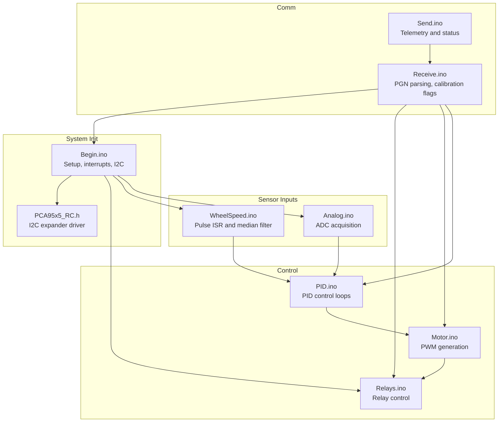
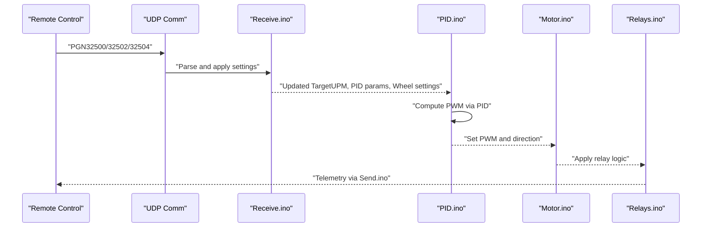
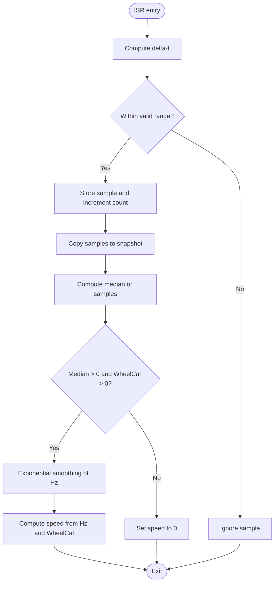
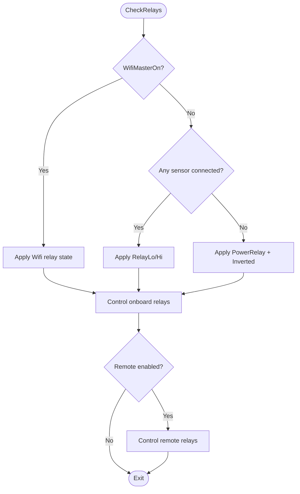
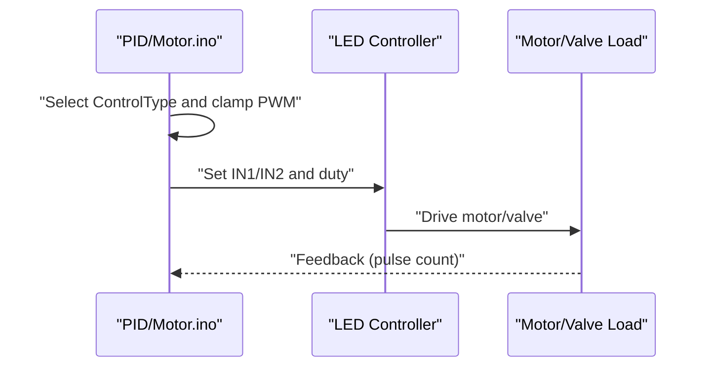
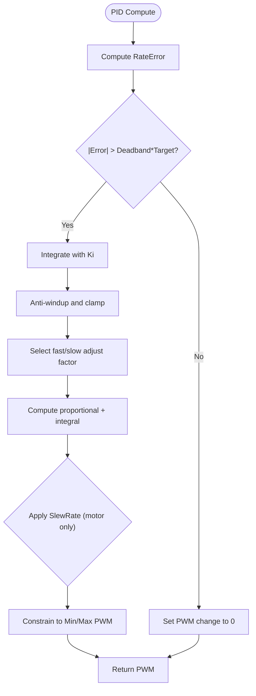
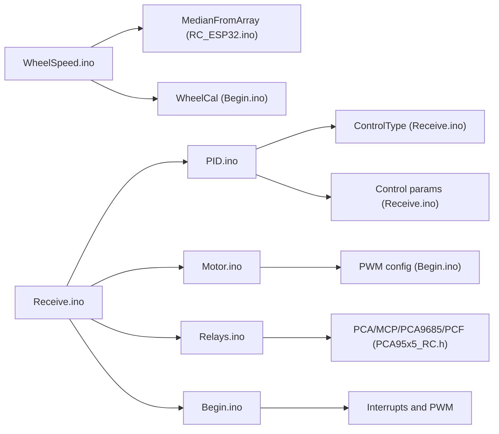

# Sensor Processing Interfaces

<cite>
**Referenced Files in This Document**
- [Analog.ino](file://RC_ESP32/Analog.ino)
- [WheelSpeed.ino](file://RC_ESP32/WheelSpeed.ino)
- [Relays.ino](file://RC_ESP32/Relays.ino)
- [Motor.ino](file://RC_ESP32/Motor.ino)
- [PID.ino](file://RC_ESP32/PID.ino)
- [Begin.ino](file://RC_ESP32/Begin.ino)
- [PCA95x5_RC.h](file://RC_ESP32/PCA95x5_RC.h)
- [Receive.ino](file://RC_ESP32/Receive.ino)
- [Send.ino](file://RC_ESP32/Send.ino)
- [RC_ESP32.ino](file://RC_ESP32/RC_ESP32.ino)
</cite>

## Table of Contents
1. [Introduction](#introduction)
2. [Project Structure](#project-structure)
3. [Core Components](#core-components)
4. [Architecture Overview](#architecture-overview)
5. [Detailed Component Analysis](#detailed-component-analysis)
6. [Dependency Analysis](#dependency-analysis)
7. [Performance Considerations](#performance-considerations)
8. [Troubleshooting Guide](#troubleshooting-guide)
9. [Conclusion](#conclusion)
10. [Appendices](#appendices)

## Introduction
This document describes the sensor processing interfaces for analog input handling, wheel speed detection, and relay control. It covers ADC configuration parameters, sampling rates, and conversion accuracy specifications; wheel encoder signal processing including pulse counting, RPM calculation, and distance measurement algorithms; and relay control interfaces including timing parameters, duty cycle control, and safety interlocks. It also documents calibration procedures for sensor zero points and scale factors, signal conditioning requirements, noise filtering, and signal integrity considerations. Finally, it provides examples of integrating sensors with rate control algorithms and addresses sensor fault detection, self-diagnostic capabilities, and error handling strategies.

## Project Structure
The sensor processing system is implemented across several modules:
- Analog input acquisition and conversion
- Wheel speed and pulse processing
- Relay control and actuator interface
- Motor/PWM control and rate regulation
- PID control and timed control modes
- Initialization, configuration, and I/O setup
- Communication protocol parsing and calibration flags
- I2C device drivers for expanders

**Diagram sources**
- [Analog.ino](file://RC_ESP32/Analog.ino)
- [WheelSpeed.ino](file://RC_ESP32/WheelSpeed.ino)
- [Relays.ino](file://RC_ESP32/Relays.ino)
- [Motor.ino](file://RC_ESP32/Motor.ino)
- [PID.ino](file://RC_ESP32/PID.ino)
- [Begin.ino](file://RC_ESP32/Begin.ino)
- [PCA95x5_RC.h](file://RC_ESP32/PCA95x5_RC.h)
- [Receive.ino](file://RC_ESP32/Receive.ino)
- [Send.ino](file://RC_ESP32/Send.ino)

**Section sources**
- [Begin.ino](file://RC_ESP32/Begin.ino)

## Core Components
- Analog input handling: supports onboard ESP32 ADC or external ADS1115 via I2C with configurable gain and sample rate.
- Wheel speed detection: interrupt-driven pulse capture with median filtering and timeout-based speed decay.
- Relay control: multi-interface support for GPIO, PCA9555/PCA9535, MCP23017, PCA9685, and PCF8574 with inversion and safety logic.
- Motor/PWM control: LEDC-based PWM with direction control, optional dithering, and flow control logic.
- PID control: configurable PID with deadband, integral anti-windup, brake point transitions, and slew limiting.
- Communication: UDP-based PGN protocol for remote configuration, calibration flags, and telemetry.

**Section sources**
- [Analog.ino](file://RC_ESP32/Analog.ino)
- [WheelSpeed.ino](file://RC_ESP32/WheelSpeed.ino)
- [Relays.ino](file://RC_ESP32/Relays.ino)
- [Motor.ino](file://RC_ESP32/Motor.ino)
- [PID.ino](file://RC_ESP32/PID.ino)
- [Receive.ino](file://RC_ESP32/Receive.ino)

## Architecture Overview
The system integrates sensor inputs with control logic and actuators:
- Sensors: flow pulses and wheel encoder pulses trigger ISRs; analog pressure is sampled via ADC.
- Control: PID computes target PWM; motor control enforces direction and limits; relays switch valves/actuators.
- Actuation: PWM drives motors; relays operate valves; PCA/MCP/PCA9685/PCF devices extend I/O.
- Communication: Remote sends PGNs to configure targets, calibrations, and control parameters; module responds with telemetry.

**Diagram sources**
- [Receive.ino](file://RC_ESP32/Receive.ino)
- [PID.ino](file://RC_ESP32/PID.ino)
- [Motor.ino](file://RC_ESP32/Motor.ino)
- [Relays.ino](file://RC_ESP32/Relays.ino)
- [Send.ino](file://RC_ESP32/Send.ino)

## Detailed Component Analysis

### Analog Input Handling
- ADC selection: Uses external ADS1115 when enabled; otherwise reads ESP32 analog pin.
- ADS1115 configuration:
  - Single-ended inputs AIN0–AIN3 supported.
  - Gain selectable across programmable ranges.
  - Sampling rate bits configure samples per second (up to 860 sps).
  - Single-shot mode with explicit conversion start/read toggling.
- ESP32 ADC path: Direct analogRead on configured pressure pin.
- Conversion pending state machine avoids overlapping conversions and reduces loop overhead.

Key parameters and behaviors:
- Gain programming via configuration register.
- Sample rate selection via data rate bits.
- Pending conversion flag ensures one conversion per loop iteration.
- Minimum value clamping after read.

**Section sources**
- [Analog.ino](file://RC_ESP32/Analog.ino)
- [Begin.ino](file://RC_ESP32/Begin.ino)

### Wheel Speed Detection and Signal Processing
- Interrupt service routine captures rising/falling edges on wheel pin and measures delta-t.
- Pulse validation bounds enforce reasonable minimum/maximum pulse periods.
- Ring buffer stores recent intervals; snapshot copied atomically to avoid ISR contention.
- Median filter selects robust central tendency against noise/transients.
- Exponential smoothing blends previous Hz estimate with new sample.
- Speed calculation converts Hz to user units using wheel calibration constant.
- Timeout logic resets speed to zero and clears samples if no pulses detected.

Processing logic flow:

**Diagram sources**
- [WheelSpeed.ino](file://RC_ESP32/WheelSpeed.ino)
- [RC_ESP32.ino](file://RC_ESP32/RC_ESP32.ino)

**Section sources**
- [WheelSpeed.ino](file://RC_ESP32/WheelSpeed.ino)
- [RC_ESP32.ino](file://RC_ESP32/RC_ESP32.ino)

### Relay Control Interfaces
- Dual-path control:
  - Onboard relays: GPIOs or I2C expanders (PCA9555/PCA9535, MCP23017, PCA9685, PCF8574).
  - Remote relays: separate control path with independent configuration.
- Safety logic:
  - If no sensor connections and master is off, power and inverted relays remain active to maintain valve state.
  - Inversion controlled per module settings.
- PCA/MCP/PCA9685/PCF drivers abstract I2C writes and pin mapping.

Control flow:

**Diagram sources**
- [Relays.ino](file://RC_ESP32/Relays.ino)
- [PCA95x5_RC.h](file://RC_ESP32/PCA95x5_RC.h)

**Section sources**
- [Relays.ino](file://RC_ESP32/Relays.ino)
- [PCA95x5_RC.h](file://RC_ESP32/PCA95x5_RC.h)

### Motor Control and PWM Generation
- PWM generation via LEDC channels with configurable frequency and bit depth.
- Direction control via IN1/IN2 pins; polarity inversion handled by module settings.
- Duty cycle scaling from [-255..255] mapped to actual PWM resolution.
- Optional dithering for 8-bit duty cycles to improve perceived smoothness.
- Control type logic:
  - Standard valve: PWM applied when sensor connected.
  - Motor/Fan: PWM applied only when connected and applying.
  - Combo close/timed combo: special handling with fixed off-state when not applying.

**Diagram sources**
- [Motor.ino](file://RC_ESP32/Motor.ino)
- [PID.ino](file://RC_ESP32/PID.ino)

**Section sources**
- [Motor.ino](file://RC_ESP32/Motor.ino)
- [PID.ino](file://RC_ESP32/PID.ino)

### PID Control and Rate Regulation
- PIDvalve: proportional-integral control with deadband and brake-point transition.
- PIDmotor: similar but with slew-rate limiting and integral anti-windup.
- TimedCombo: alternating adjust/pause windows with configurable durations and minimum start ratio.
- Parameters per sensor include gains, deadband, brake point, slow adjust percentage, slew rate, max integral, and PID time interval.

**Diagram sources**
- [PID.ino](file://RC_ESP32/PID.ino)

**Section sources**
- [PID.ino](file://RC_ESP32/PID.ino)

### Initialization, Interrupts, and I2C Setup
- Initializes serial, EEPROM, I2C, Ethernet/UDP, and sensors.
- Attaches interrupts per sensor channel to capture flow pulses.
- Sets up PWM channels for each sensor with module-configured frequency and bit depth.
- Detects and initializes relay controller chips (PCA9555/PCA9535, MCP23017, PCA9685, PCF8574) and configures directions/polarity.
- Supports wheel speed pin distinct from flow pins; sets up dedicated ISR for wheel encoder.

**Section sources**
- [Begin.ino](file://RC_ESP32/Begin.ino)

### Communication Protocol and Calibration Flags
- UDP reception parses PGNs for:
  - Rate settings and meter calibration.
  - Control parameters (PID, deadband, brake point, etc.).
  - Wheel speed sensor settings and calibration flags.
  - Module configuration (pins, relay types, invert flags).
- Calibration flags:
  - Per-sensor calibration-on bit enables calibration mode in remote UI.
  - Wheel calibration can be updated and saved; module restarts if wheel pin changed.

**Section sources**
- [Receive.ino](file://RC_ESP32/Receive.ino)
- [RC_ESP32.ino](file://RC_ESP32/RC_ESP32.ino)

## Dependency Analysis
- WheelSpeed depends on:
  - Interrupt-driven capture and atomic snapshot copying.
  - Median filter utility and module-level wheel calibration.
- PID depends on:
  - Sensor-target feedback and control type selection.
  - Time-based scheduling and parameter storage.
- Motor depends on:
  - Control type and direction inversion settings.
  - PWM resolution and frequency configuration.
- Relays depend on:
  - Control type selection and I2C expander availability.
  - Inversion and power/inverted relay masks.
- Begin coordinates:
  - Interrupt attachment, PWM setup, I2C initialization, and chip detection.

**Diagram sources**
- [WheelSpeed.ino](file://RC_ESP32/WheelSpeed.ino)
- [RC_ESP32.ino](file://RC_ESP32/RC_ESP32.ino)
- [PID.ino](file://RC_ESP32/PID.ino)
- [Motor.ino](file://RC_ESP32/Motor.ino)
- [Relays.ino](file://RC_ESP32/Relays.ino)
- [PCA95x5_RC.h](file://RC_ESP32/PCA95x5_RC.h)
- [Begin.ino](file://RC_ESP32/Begin.ino)
- [Receive.ino](file://RC_ESP32/Receive.ino)

**Section sources**
- [WheelSpeed.ino](file://RC_ESP32/WheelSpeed.ino)
- [PID.ino](file://RC_ESP32/PID.ino)
- [Motor.ino](file://RC_ESP32/Motor.ino)
- [Relays.ino](file://RC_ESP32/Relays.ino)
- [PCA95x5_RC.h](file://RC_ESP32/PCA95x5_RC.h)
- [Begin.ino](file://RC_ESP32/Begin.ino)
- [Receive.ino](file://RC_ESP32/Receive.ino)
- [RC_ESP32.ino](file://RC_ESP32/RC_ESP32.ino)

## Performance Considerations
- ADC sampling:
  - ADS1115 configured for up to 860 samples per second; single-shot mode prevents continuous overhead.
  - Conversion pending flag ensures non-blocking loop behavior.
- Pulse processing:
  - Median filtering reduces noise impact; ring buffer size is configurable per sensor.
  - ISR minimal; heavy lifting done outside ISR using snapshots.
- PWM control:
  - LEDC channels configured at module frequency/bit depth; dithering improves low-duty smoothness on 8-bit systems.
- Network and I/O:
  - I2C clock increased to 400 kHz; chip detection loops with bounded retries.
  - Interrupt-driven sensors reduce CPU polling overhead.

[No sources needed since this section provides general guidance]

## Troubleshooting Guide
- No pressure readings:
  - Verify ADS1115 presence and address; confirm gain and sample rate settings.
  - Check pressure pin assignment and onboard ADC fallback.
- No wheel speed:
  - Confirm wheel pin is not duplicated as a flow pin; ensure ISR attached and valid range configured.
  - Validate wheel calibration constant and timeout conditions.
- Relay not switching:
  - Check relay control type and I2C expander detection; verify inversion and power/inverted masks.
  - Ensure relay control pins are valid for the selected processor.
- PID not responding:
  - Confirm control type and AutoOn flags; verify TargetUPM and control parameters.
  - Check deadband and brake point thresholds; ensure integral anti-windup is active.
- Communication issues:
  - Validate PGN CRC and module ID matching; confirm UDP ports and subnet configuration.

**Section sources**
- [Begin.ino](file://RC_ESP32/Begin.ino)
- [Receive.ino](file://RC_ESP32/Receive.ino)
- [PID.ino](file://RC_ESP32/PID.ino)
- [WheelSpeed.ino](file://RC_ESP32/WheelSpeed.ino)
- [Relays.ino](file://RC_ESP32/Relays.ino)

## Conclusion
The sensor processing interfaces combine robust ADC acquisition, precise wheel speed estimation via median filtering, and flexible relay control across multiple I2C expanders. PID control with configurable parameters enables accurate rate regulation, while communication protocols support remote calibration and diagnostics. Proper signal conditioning, noise filtering, and safety interlocks ensure reliable operation in agricultural environments.

[No sources needed since this section summarizes without analyzing specific files]

## Appendices

### ADC Configuration Parameters
- Gain settings: programmable range selection via configuration register.
- Sampling rate: data rate bits select samples per second (up to 860 sps).
- Mode: single-shot to avoid continuous conversion overhead.
- Pending conversion flag: ensures one conversion per loop iteration.

**Section sources**
- [Analog.ino](file://RC_ESP32/Analog.ino)

### Wheel Encoder Signal Processing
- Pulse counting: ISR increments counter and stores intervals.
- Median filtering: robust central tendency computation for accurate Hz.
- RPM and distance:
  - RPM = Hz * 60
  - Distance per pulse = π * diameter = WheelCal constant
  - Distance = Total pulses * WheelCal
- Timeout-based decay: speed resets to zero if no pulses received beyond threshold.

**Section sources**
- [WheelSpeed.ino](file://RC_ESP32/WheelSpeed.ino)
- [Begin.ino](file://RC_ESP32/Begin.ino)

### Relay Control Timing and Safety
- Control types:
  - GPIO: direct digital writes.
  - PCA9555/PCA9535: 8/16-channel outputs with polarity/direction control.
  - MCP23017: dual-port 16-bit I/O expansion.
  - PCA9685: PWM-based relay control with dual-pin per valve option.
  - PCF8574: 8-bit I/O expander.
- Safety interlocks:
  - When no sensor connected and master off, power and inverted relays remain active.
  - Inversion controlled per module settings.

**Section sources**
- [Relays.ino](file://RC_ESP32/Relays.ino)
- [PCA95x5_RC.h](file://RC_ESP32/PCA95x5_RC.h)

### Calibration Procedures
- Sensor calibration:
  - Use PGN32500 to set TargetUPM and MeterCal; optionally enable calibration flag via command byte.
  - Reset accumulated quantity if needed.
- Wheel calibration:
  - Use PGN32502 to set wheel pin, calibration constant, and optional count reset.
  - Module restarts if wheel pin changes.
- Parameter tuning:
  - Use PGN32502 to update PID gains, deadband, brake point, slow adjust, slew rate, and integral limits.

**Section sources**
- [Receive.ino](file://RC_ESP32/Receive.ino)
- [Begin.ino](file://RC_ESP32/Begin.ino)

### Signal Conditioning and Noise Filtering
- Hardware:
  - Pull-up resistors on flow/wheel pins; ensure proper wiring and shielding.
  - Use appropriate ADC gain to maximize resolution within expected signal range.
- Software:
  - Median filtering for pulse intervals; exponential smoothing for Hz estimates.
  - Validity checks for pulse ranges and timeouts.

**Section sources**
- [Begin.ino](file://RC_ESP32/Begin.ino)
- [WheelSpeed.ino](file://RC_ESP32/WheelSpeed.ino)

### Integration with Rate Control Algorithms
- PIDvalve: applies proportional-integral control with deadband and brake-point transition.
- PIDmotor: adds slew-rate limiting for motor applications.
- TimedCombo: alternates adjust/pause windows for controlled actuation.

**Section sources**
- [PID.ino](file://RC_ESP32/PID.ino)