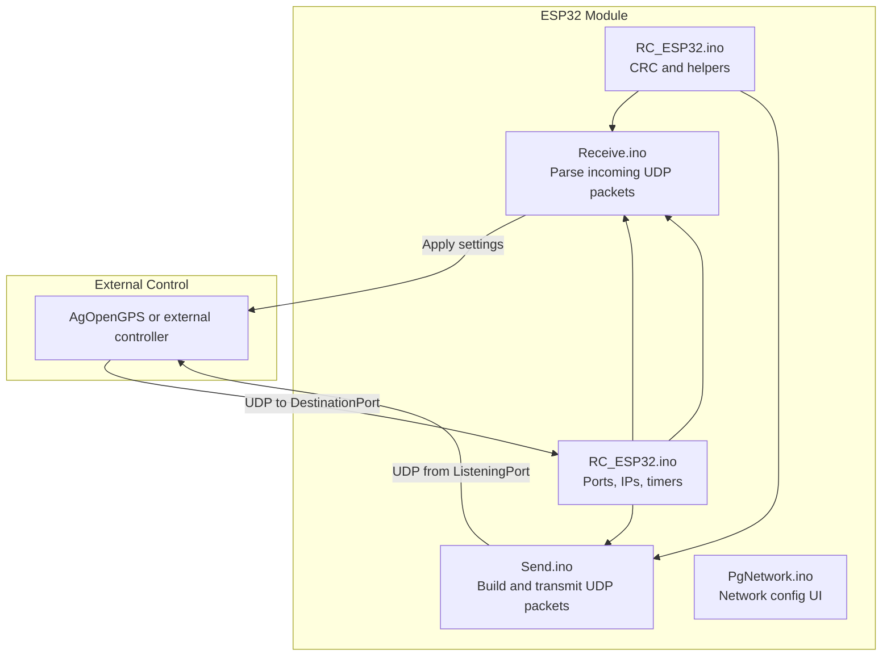
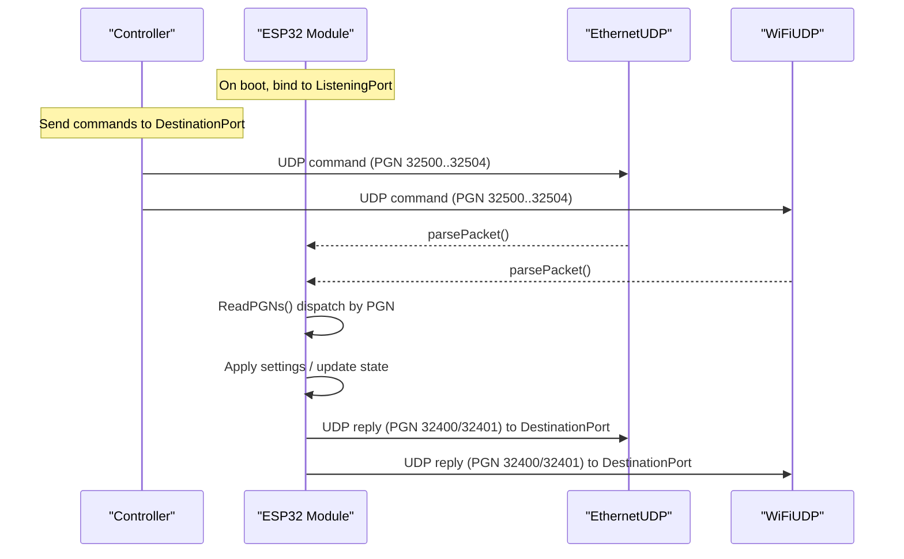
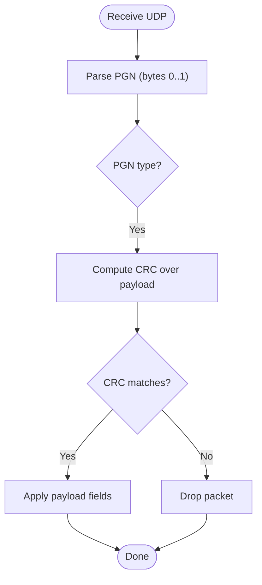
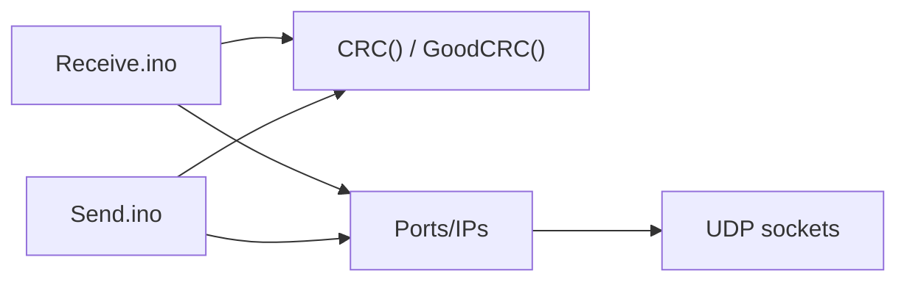

# UDP Communication Protocol

<cite>
**Referenced Files in This Document**
- [Receive.ino](file://RC_ESP32/Receive.ino)
- [Send.ino](file://RC_ESP32/Send.ino)
- [RC_ESP32.ino](file://RC_ESP32/RC_ESP32.ino)
- [PgNetwork.ino](file://RC_ESP32/PgNetwork.ino)
- [UDPComm.ino](file://OLD CODE/RC_ESP32/UDPComm.ino)
</cite>

## Table of Contents
1. [Introduction](#introduction)
2. [Project Structure](#project-structure)
3. [Core Components](#core-components)
4. [Architecture Overview](#architecture-overview)
5. [Detailed Component Analysis](#detailed-component-analysis)
6. [Dependency Analysis](#dependency-analysis)
7. [Performance Considerations](#performance-considerations)
8. [Troubleshooting Guide](#troubleshooting-guide)
9. [Conclusion](#conclusion)
10. [Appendices](#appendices)

## Introduction
This document specifies the UDP-based communication protocol used by the ESP32 Rate Control module. It defines the packet structure, message types, encoding schemes, addressing, ports, timing, validation, and operational guidance for real-time rate control applications. It also provides Wireshark analysis tips and protocol examples mapped to the actual implementation.

## Project Structure
The protocol is implemented across several modules:
- Sending telemetry and status messages
- Receiving configuration and control commands
- Network configuration and addressing
- CRC validation utilities

**Diagram sources**
- [Receive.ino:29-343](file://RC_ESP32/Receive.ino#L29-L343)
- [Send.ino:1-195](file://RC_ESP32/Send.ino#L1-L195)
- [RC_ESP32.ino:150-299](file://RC_ESP32/RC_ESP32.ino#L150-L299)
- [PgNetwork.ino:1-155](file://RC_ESP32/PgNetwork.ino#L1-L155)

**Section sources**
- [Receive.ino:29-343](file://RC_ESP32/Receive.ino#L29-L343)
- [Send.ino:1-195](file://RC_ESP32/Send.ino#L1-L195)
- [RC_ESP32.ino:150-299](file://RC_ESP32/RC_ESP32.ino#L150-L299)
- [PgNetwork.ino:1-155](file://RC_ESP32/PgNetwork.ino#L1-L155)

## Core Components
- Packet header: two-byte PGN identifier in little-endian order
- Payload: per-message fields as defined below
- Trailer: single-byte CRC covering the payload region
- Validation: CRC computed as a simple summation over the payload region

Key runtime parameters:
- DestinationPort: 29999
- ListeningPort: 28888
- Broadcast destination for UDP: 255 (computed from subnet)

**Section sources**
- [RC_ESP32.ino:150-160](file://RC_ESP32/RC_ESP32.ino#L150-L160)
- [RC_ESP32.ino:152-154](file://RC_ESP32/RC_ESP32.ino#L152-L154)
- [RC_ESP32.ino:158-159](file://RC_ESP32/RC_ESP32.ino#L158-L159)

## Architecture Overview
The module listens on a local UDP port for commands and periodically transmits telemetry/status to a configured destination. It supports Ethernet and WiFi paths, preferring Ethernet when available.

**Diagram sources**
- [Receive.ino:2-27](file://RC_ESP32/Receive.ino#L2-L27)
- [Send.ino:70-91](file://RC_ESP32/Send.ino#L70-L91)
- [Send.ino:169-191](file://RC_ESP32/Send.ino#L169-L191)
- [RC_ESP32.ino:150-160](file://RC_ESP32/RC_ESP32.ino#L150-L160)

## Detailed Component Analysis

### Packet Header and CRC
- Header: two bytes forming the PGN in little-endian order
- CRC: single byte computed as the sum modulo 256 over the payload region
- Validation: receiver recomputes CRC and compares to trailer

**Diagram sources**
- [Receive.ino:29-343](file://RC_ESP32/Receive.ino#L29-L343)
- [RC_ESP32.ino:299-314](file://RC_ESP32/RC_ESP32.ino#L299-L314)

**Section sources**
- [RC_ESP32.ino:299-314](file://RC_ESP32/RC_ESP32.ino#L299-L314)
- [Receive.ino:61-62](file://RC_ESP32/Receive.ino#L61-L62)
- [Send.ino:68-69](file://RC_ESP32/Send.ino#L68-L69)

### Message Types and Field Definitions

#### Telemetry: PGN 32400 (Rate Info)
- Purpose: Periodic status from module to controller
- Fields:
  - Bytes 0..1: PGN 32400
  - Byte 2: Module/Sensor ID (top 4 bits = module ID, bottom 4 bits = sensor index)
  - Bytes 3..5: Rate applied (units per minute × 1000), 24-bit little-endian
  - Bytes 6..8: Accumulated quantity (units × 10), 24-bit little-endian
  - Bytes 9..10: PWM value (16-bit little-endian)
  - Byte 11: Status bitmask
    - Bit 0: Sensor connected
  - Bytes 12..13: Frequency (Hz × 10), 16-bit little-endian
  - Byte 14: CRC (payload 0..13)

Encoding notes:
- Numeric fields are stored in little-endian byte order
- Floating-point values are transmitted as scaled integers

**Section sources**
- [Send.ino:7-24](file://RC_ESP32/Send.ino#L7-L24)
- [Send.ino:25-91](file://RC_ESP32/Send.ino#L25-L91)
- [Send.ino:117-14](file://RC_ESP32/Send.ino#L117-L14)

#### Telemetry: PGN 32401 (Module Info)
- Purpose: Additional module diagnostics and wheel speed
- Fields:
  - Bytes 0..1: PGN 32401
  - Byte 2: Module ID
  - Bytes 3..4: Pressure ADC (16-bit)
  - Bytes 5..6: Wheel speed (actual × 10), 16-bit
  - Bytes 7..9: Wheel counts (24-bit)
  - Bytes 10..12: InoType and InoID (16-bit)
  - Byte 13: Status bitmask
    - Bit 0: Work switch on
    - Bits 1..3: WiFi RSSI thresholds met
    - Bit 4: Ethernet connected
    - Bit 5: Pin configuration OK
    - Bit 6: 3-wire relays
  - Byte 14: CRC (payload 0..13)

**Section sources**
- [Send.ino:93-116](file://RC_ESP32/Send.ino#L93-L116)
- [Send.ino:117-191](file://RC_ESP32/Send.ino#L117-L191)

#### Command: PGN 32500 (Rate Settings)
- Purpose: Configure rate target, meter calibration, control mode, and manual adjustments
- Fields:
  - Bytes 0..1: PGN 32500
  - Byte 2: Module/Sensor ID
  - Bytes 3..5: Rate set point (UPM × 1000), 24-bit
  - Bytes 6..8: Meter calibration factor (× 1000), 24-bit
  - Byte 9: Command byte
    - Bit 0: Reset accumulated quantity
    - Bits 1..3: Control type (0–4)
    - Bit 4: Master enable
    - Bit 6: Auto enable
    - Bit 7: Calibration on
  - Bytes 10..11: Manual PWM adjustment (16-bit signed)
  - Byte 12: Reserved
  - Byte 13: CRC

Validation and behavior:
- Receiver validates CRC and checks module/sensor ID match
- Resets accumulated pulses when requested
- Updates control parameters and flags

**Section sources**
- [Receive.ino:35-100](file://RC_ESP32/Receive.ino#L35-L100)
- [Receive.ino:31-58](file://RC_ESP32/Receive.ino#L31-L58)

#### Command: PGN 32501 (Relay Settings)
- Purpose: Configure relay masks and inversion
- Fields:
  - Bytes 0..1: PGN 32501
  - Byte 2: Module ID
  - Bytes 3..4: Relay mask low/high (bits 0–15)
  - Bytes 5..6: Power relay mask low/high
  - Bytes 7..8: Inverted relay mask low/high
  - Byte 9: Flow master valve index (0–15, 255 disables)
  - Byte 10: CRC

**Section sources**
- [Receive.ino:102-134](file://RC_ESP32/Receive.ino#L102-L134)
- [Receive.ino:116](file://RC_ESP32/Receive.ino#L116)

#### Command: PGN 32502 (Control Settings)
- Purpose: PID and timing parameters
- Fields:
  - Bytes 0..1: PGN 32502
  - Byte 2: Module/Sensor ID
  - Bytes 3..4: Max/Min PWM (% scaling)
  - Bytes 5..6: Kp/Ki (scaled exponents)
  - Byte 7: Deadband (%, stored as actual/10)
  - Byte 8: Brake point (%)
  - Byte 9: PID slow adjust (%)
  - Byte 10: Slew rate
  - Bytes 11: Max integral (× 10)
  - Byte 12: Reserved
  - Bytes 13: Timed min start (× 100)
  - Bytes 14..15: Timed adjust (ms)
  - Bytes 16..17: Timed pause (ms)
  - Byte 18: PID time (ms)
  - Byte 19: Pulse min (Hz × 10)
  - Bytes 20..21: Pulse max (Hz)
  - Byte 22: Pulse sample size
  - Byte 23: CRC

Notes:
- Some fields are derived from scaling factors and stored values
- Sample size clamped to maximum

**Section sources**
- [Receive.ino:136-220](file://RC_ESP32/Receive.ino#L136-L220)
- [Receive.ino:163](file://RC_ESP32/Receive.ino#L163)

#### Command: PGN 32503 (Subnet Change)
- Purpose: Change module’s subnet for broadcast addressing
- Fields:
  - Bytes 0..1: PGN 32503
  - Bytes 2..4: IP octets (subnet)
  - Byte 5: CRC
- Behavior: Updates network, saves, and restarts

**Section sources**
- [Receive.ino:222-244](file://RC_ESP32/Receive.ino#L222-L244)
- [Receive.ino:231](file://RC_ESP32/Receive.ino#L231)

#### Command: PGN 32504 (Wheel Speed Sensor Settings)
- Purpose: Configure wheel speed pin, calibration, and reset
- Fields:
  - Bytes 0..1: PGN 32504
  - Byte 2: Module ID
  - Byte 3: GPIO pin
  - Bytes 4..6: Calibration (× 1000), 24-bit
  - Byte 7: Commands
    - Bit 0: Erase counts
  - Byte 8: CRC
- Behavior: Saves and may restart if pin changed

**Section sources**
- [Receive.ino:246-275](file://RC_ESP32/Receive.ino#L246-L275)
- [Receive.ino:259](file://RC_ESP32/Receive.ino#L259)

#### Command: PGN 32700 (Module Configuration)
- Purpose: Full module configuration including pins and relay types
- Fields:
  - Bytes 0..1: PGN 32700
  - Bytes 2: Module ID
  - Byte 3: Sensor count
  - Byte 4: Commands bitmask
    - Bit 0: Invert relay control
    - Bit 1: Invert flow control
    - Bit 3: Work pin is momentary
    - Bit 4: Is 3-wire valve
    - Bit 5: ADS1115 enabled
  - Byte 5: Onboard relay control type
  - Byte 6: Remote relay control type
  - Bytes 7..12: Sensor 0/1 pins (flow, direction, PWM)
  - Bytes 13..28: Relay control pins 0–15
  - Byte 29: Work pin
  - Byte 30: Pressure pin
  - Bytes 31..32: Reserved
  - Byte 33: CRC
- Behavior: Saves and restarts

**Section sources**
- [Receive.ino:277-341](file://RC_ESP32/Receive.ino#L277-L341)
- [Receive.ino:304](file://RC_ESP32/Receive.ino#L304)

### Encoding Schemes
- Numeric values:
  - 8-bit: unsigned byte
  - 16-bit: little-endian
  - 24-bit: little-endian across three bytes
  - Scaling: floating values are transmitted as scaled integers (e.g., UPM × 1000, Hz × 10)
- Strings: not used in current protocol
- Binary data: raw bytes; CRC covers payload region

**Section sources**
- [Send.ino:34-52](file://RC_ESP32/Send.ino#L34-L52)
- [Receive.ino:70-75](file://RC_ESP32/Receive.ino#L70-L75)
- [Receive.ino:268](file://RC_ESP32/Receive.ino#L268)

### Message Construction and Parsing Examples
Note: The following examples describe the layout and steps. They reference exact file locations for verification.

- Construct PGN 32400 (Telemetry):
  - Set PGN bytes 0..1
  - Set module/sensor ID in byte 2
  - Encode rate applied (UPM × 1000) into bytes 3..5
  - Encode accumulated quantity (units × 10) into bytes 6..8
  - Encode PWM into bytes 9..10
  - Set status byte 11 (bit 0 for sensor connected)
  - Encode frequency (Hz × 10) into bytes 12..13
  - Compute CRC over payload 0..13 and place in byte 14
  - Send via Ethernet or WiFi to DestinationPort

  **Section sources**
  - [Send.ino:25-91](file://RC_ESP32/Send.ino#L25-L91)

- Parse PGN 32500 (Rate Settings):
  - Verify PGN equals 32500
  - Validate CRC over payload
  - Match module/sensor ID
  - Decode rate set and meter cal (both × 1000)
  - Interpret command byte (reset, control type, flags)
  - Update PWM manual adjustment
  - Update timestamps

  **Section sources**
  - [Receive.ino:35-100](file://RC_ESP32/Receive.ino#L35-L100)

- Construct PGN 32502 (Control Settings):
  - Set PGN bytes 0..1
  - Encode module/sensor ID in byte 2
  - Encode Max/Min PWM percentages
  - Encode Kp/Ki using stored exponents
  - Encode deadband, brake point, PID slow adjust, slew rate
  - Encode max integral (× 10)
  - Encode timed min start (× 100), timed adjust/pause (ms)
  - Encode PID time (ms)
  - Encode pulse min/max (Hz)
  - Encode pulse sample size
  - Compute CRC and send

  **Section sources**
  - [Receive.ino:136-220](file://RC_ESP32/Receive.ino#L136-L220)

- Parse PGN 32700 (Module Config):
  - Verify PGN equals 32700
  - Validate CRC
  - Read module ID, sensor count, commands bitmask
  - Read relay control types
  - Read sensor pin assignments
  - Read relay control pins
  - Read work and pressure pins
  - Save and restart

  **Section sources**
  - [Receive.ino:277-341](file://RC_ESP32/Receive.ino#L277-L341)

### Network Addressing, Ports, and Timing
- Ports:
  - ListeningPort: 28888
  - DestinationPort: 29999
- Broadcast:
  - Destination broadcast is derived from subnet octets with host portion set to 255
- Timing:
  - Send interval: 200 ms
  - Loop interval: 50 ms
  - Connectivity timeout for sensors: 4 seconds

**Section sources**
- [RC_ESP32.ino:152-154](file://RC_ESP32/RC_ESP32.ino#L152-L154)
- [RC_ESP32.ino:158-159](file://RC_ESP32/RC_ESP32.ino#L158-L159)
- [RC_ESP32.ino:179-182](file://RC_ESP32/RC_ESP32.ino#L179-L182)
- [RC_ESP32.ino:267-269](file://RC_ESP32/RC_ESP32.ino#L267-L269)

### Error Handling, Validation, and Retransmission
- Validation:
  - CRC checked against computed sum over payload
  - PGN length verified before parsing
  - Module/sensor ID filtering ensures targeted updates
- Error handling:
  - Invalid CRC or mismatched IDs cause packet drop
  - No explicit retransmission mechanism is present in the referenced code
- Operational resilience:
  - Ethernet preferred when link is up
  - Fallback to WiFi when Ethernet unavailable

**Section sources**
- [Receive.ino:61-62](file://RC_ESP32/Receive.ino#L61-L62)
- [Send.ino:72-91](file://RC_ESP32/Send.ino#L72-L91)
- [Send.ino:161-191](file://RC_ESP32/Send.ino#L161-L191)

### Wireshark Capture and Protocol Analysis
- Filter tips:
  - UDP port 28888 (module listening)
  - UDP port 29999 (module destination)
  - PGN values: 32400, 32401, 32500..32504, 32700
- Observables:
  - CRC presence and correctness
  - Scaling factors in numeric fields
  - Status bitfields for connectivity and configuration

[No sources needed since this section provides general guidance]

### Network Topology and Bandwidth Considerations
- Topology:
  - Controller sends to module’s DestinationPort
  - Module responds to controller on its local IP with ListeningPort
- Bandwidth:
  - Each telemetry packet ~15 bytes
  - Typical transmission rate: 5 Hz (200 ms interval)
  - Minimal overhead suitable for typical LAN environments

[No sources needed since this section provides general guidance]

## Dependency Analysis

**Diagram sources**
- [Receive.ino:29-343](file://RC_ESP32/Receive.ino#L29-L343)
- [Send.ino:1-195](file://RC_ESP32/Send.ino#L1-195)
- [RC_ESP32.ino:299-314](file://RC_ESP32/RC_ESP32.ino#L299-L314)
- [RC_ESP32.ino:150-160](file://RC_ESP32/RC_ESP32.ino#L150-L160)

**Section sources**
- [Receive.ino:29-343](file://RC_ESP32/Receive.ino#L29-L343)
- [Send.ino:1-195](file://RC_ESP32/Send.ino#L1-195)
- [RC_ESP32.ino:299-314](file://RC_ESP32/RC_ESP32.ino#L299-L314)
- [RC_ESP32.ino:150-160](file://RC_ESP32/RC_ESP32.ino#L150-L160)

## Performance Considerations
- Keep payload sizes small to minimize latency and collisions
- Use Ethernet when available for lower jitter
- Avoid frequent reconfiguration bursts; batch updates where possible
- Monitor RSSI and connectivity status to adapt control loops

[No sources needed since this section provides general guidance]

## Troubleshooting Guide
- No response from module:
  - Verify DestinationPort and subnet-derived broadcast
  - Confirm ListeningPort binding and firewall rules
- Incorrect scaling:
  - Check that rate and frequency fields are interpreted with correct multipliers
- CRC errors:
  - Recompute CRC over payload region and compare
- Connectivity issues:
  - Inspect status bits for Ethernet and WiFi connectivity
  - Confirm module restart after network changes

**Section sources**
- [RC_ESP32.ino:152-154](file://RC_ESP32/RC_ESP32.ino#L152-L154)
- [RC_ESP32.ino:158-159](file://RC_ESP32/RC_ESP32.ino#L158-L159)
- [RC_ESP32.ino:299-314](file://RC_ESP32/RC_ESP32.ino#L299-L314)
- [Send.ino:68-69](file://RC_ESP32/Send.ino#L68-L69)

## Conclusion
The ESP32 Rate Control UDP protocol is a compact, reliable framing around simple numeric fields with explicit CRC validation. It supports real-time rate control with clear telemetry and configuration channels, suitable for agricultural automation environments.

[No sources needed since this section summarizes without analyzing specific files]

## Appendices

### Appendix A: Port and Addressing Defaults
- ListeningPort: 28888
- DestinationPort: 29999
- Broadcast destination: 255 (derived from subnet)

**Section sources**
- [RC_ESP32.ino:152-154](file://RC_ESP32/RC_ESP32.ino#L152-L154)
- [RC_ESP32.ino:158-159](file://RC_ESP32/RC_ESP32.ino#L158-L159)

### Appendix B: Network Configuration UI
- Web UI allows saving WiFi credentials and enabling station mode
- Changes trigger module restart

**Section sources**
- [PgNetwork.ino:1-155](file://RC_ESP32/PgNetwork.ino#L1-L155)