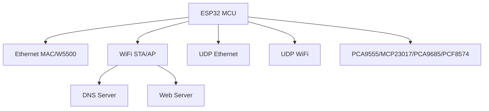
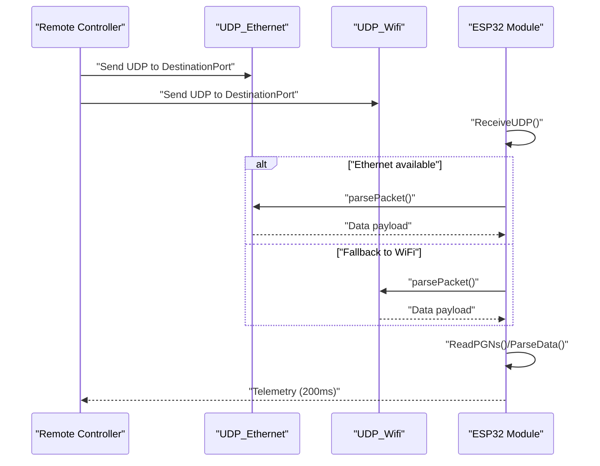
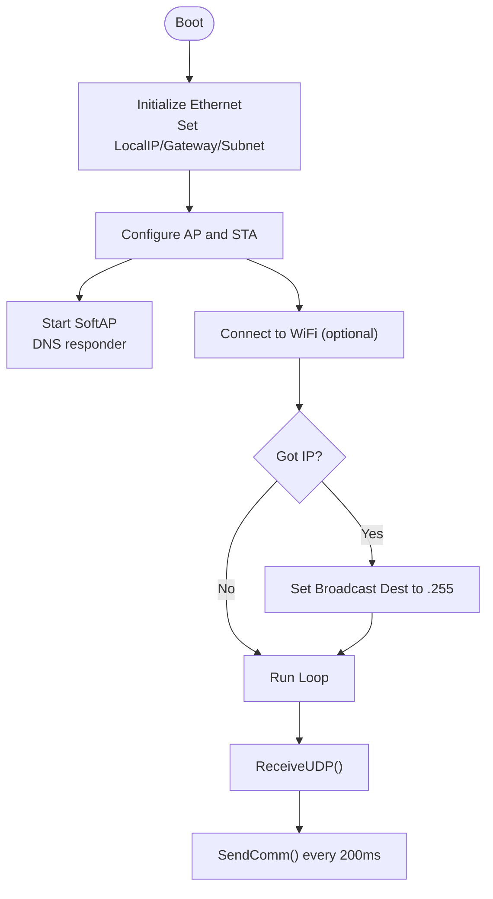
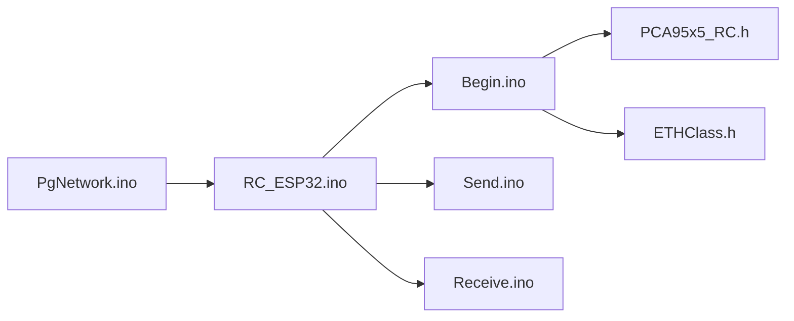

# Communication System

<cite>
**Referenced Files in This Document**
- [RC_ESP32.ino](file://RC_ESP32/RC_ESP32.ino)
- [Begin.ino](file://RC_ESP32/Begin.ino)
- [Send.ino](file://RC_ESP32/Send.ino)
- [Receive.ino](file://RC_ESP32/Receive.ino)
- [PgNetwork.ino](file://RC_ESP32/PgNetwork.ino)
- [PCA95x5_RC.h](file://RC_ESP32/PCA95x5_RC.h)
- [ETHClass.h](file://OLD CODE/RC_ESP32/ETHClass.h)
- [UDPComm.ino (OLD)](file://OLD CODE/RC_ESP32/UDPComm.ino)
</cite>

## Table of Contents
1. [Introduction](#introduction)
2. [Project Structure](#project-structure)
3. [Core Components](#core-components)
4. [Architecture Overview](#architecture-overview)
5. [Detailed Component Analysis](#detailed-component-analysis)
6. [Dependency Analysis](#dependency-analysis)
7. [Performance Considerations](#performance-considerations)
8. [Troubleshooting Guide](#troubleshooting-guide)
9. [Conclusion](#conclusion)
10. [Appendices](#appendices)

## Introduction
This document describes the communication system of the ESP32 Rate Control project. It covers the UDP protocol implementation, packet structure, message formats, and timing. It explains dual-mode networking operation supporting Access Point (AP) and WiFi Client modes, network configuration procedures, discovery and connection handling, and the UDP message protocol including command encoding, parameter transmission, and acknowledgment behavior. It also provides troubleshooting guidance for connection issues, packet loss, and latency, along with security considerations and performance optimization strategies tailored for real-time rate control applications in agricultural environments.

## Project Structure
The communication system spans several modules:
- Initialization and networking setup (Ethernet and WiFi)
- UDP send/receive logic for telemetry and commands
- Web-based configuration pages for network settings
- I2C-based relay expansion support
- Legacy UDP implementation for comparison

**Diagram sources**
- [Begin.ino:87-207](file://RC_ESP32/Begin.ino#L87-L207)
- [RC_ESP32.ino:150-163](file://RC_ESP32/RC_ESP32.ino#L150-L163)

**Section sources**
- [RC_ESP32.ino:12-33](file://RC_ESP32/RC_ESP32.ino#L12-L33)
- [Begin.ino:87-207](file://RC_ESP32/Begin.ino#L87-L207)

## Core Components
- UDP Telemetry Sender: Periodically sends sensor telemetry and module status to a destination IP/port.
- UDP Command Receiver: Parses incoming commands for rate settings, relay control, PID tuning, and configuration updates.
- Dual-Mode Networking: Simultaneous AP and STA mode with automatic fallback and dynamic destination IP calculation.
- Web Configuration: HTML forms to configure SSID/password, AP password, and station mode toggle.
- I2C Relays: Optional relay expansion chips controlled via I2C for module and remote relay control.

Key constants and timing:
- Listening port: 28888
- Destination port: 29999
- Telemetry interval: 200 ms
- Sensor timeout window: 4 seconds

**Section sources**
- [RC_ESP32.ino:150-163](file://RC_ESP32/RC_ESP32.ino#L150-L163)
- [RC_ESP32.ino:179-182](file://RC_ESP32/RC_ESP32.ino#L179-L182)
- [Send.ino:1-195](file://RC_ESP32/Send.ino#L1-L195)
- [Receive.ino:29-343](file://RC_ESP32/Receive.ino#L29-L343)
- [Begin.ino:173-254](file://RC_ESP32/Begin.ino#L173-L254)

## Architecture Overview
The system operates with two UDP channels:
- Ethernet channel: Used when the W5500 chip is present and link is up.
- WiFi channel: Used as a fallback or primary path depending on configuration and connectivity.

**Diagram sources**
- [Receive.ino:2-27](file://RC_ESP32/Receive.ino#L2-L27)
- [Send.ino:1-195](file://RC_ESP32/Send.ino#L1-L195)
- [RC_ESP32.ino:150-163](file://RC_ESP32/RC_ESP32.ino#L150-L163)

## Detailed Component Analysis

### UDP Protocol Specification
- Packet header: Two-byte PGN (Packet Group Number) in little-endian order.
- Payload: Variable-length per PGN; terminated by CRC byte.
- CRC: Simple summation checksum over the payload excluding CRC.

Supported PGNs:
- 32400: Telemetry from module to RC (sensor rate, accumulated quantity, PWM, Hz, status).
- 32401: Module info from module to RC (pressure, wheel speed/count, InoID, status).
- 32500: Rate settings from RC to module (target UPM, meter calibration, command flags, manual PWM).
- 32501: Relay settings from RC to module (relays Lo/Hi, power relays, inverted logic).
- 32502: Control settings from RC to module (PID gains, limits, timing parameters).
- 32503: Subnet/IP change from RC to module (updates module IP and restarts).
- 32504: Wheel speed sensor settings from RC to module.
- 32700: Module configuration from RC to module (pins, relay types, work/pressure pins).
- 32702: Network configuration from RC to module (SSID/password).

Notes:
- Some fields are scaled (e.g., UPM multiplied by 1000, Hz multiplied by 10).
- Command bytes encode flags for reset, control type, master/auto modes, and calibration.

**Section sources**
- [Send.ino:7-195](file://RC_ESP32/Send.ino#L7-L195)
- [Receive.ino:29-343](file://RC_ESP32/Receive.ino#L29-L343)
- [RC_ESP32.ino:282-314](file://RC_ESP32/RC_ESP32.ino#L282-L314)

### Packet Structure Details
- PGN 32400 (Telemetry):
  - Bytes 0-1: PGN 144, 126
  - Byte 2: Module/Sensor ID (top 4 bits = module ID, bottom 4 bits = sensor index)
  - Bytes 3-5: Rate applied (actual × 1000)
  - Bytes 6-8: Accumulated quantity (actual × 10)
  - Bytes 9-10: PWM (16-bit)
  - Byte 11: Status flags (sensor connected, RSSI thresholds, connection status, pin config)
  - Bytes 12-13: Hz (actual × 10)
  - Byte 14: CRC
- PGN 32401 (Module Info):
  - Bytes 0-1: PGN 145, 126
  - Byte 2: Module ID
  - Bytes 3-4: Pressure (16-bit)
  - Bytes 5-6: Wheel speed (actual × 10)
  - Bytes 7-9: Wheel count (24-bit)
  - Bytes 10-12: InoType/InoID (16-bit)
  - Byte 13: Status flags (work switch, RSSI thresholds, Ethernet connected, pin config, 3-wire)
  - Byte 14: CRC

- PGN 32500 (Rate Settings):
  - Bytes 0-1: PGN 244, 126
  - Byte 2: Module/Sensor ID
  - Bytes 3-5: Rate set (actual × 1000)
  - Bytes 6-8: Meter calibration (actual × 1000)
  - Byte 9: Command (bitwise flags)
  - Bytes 10-11: Manual PWM (16-bit)
  - Byte 12-13: Reserved
  - Byte 14: CRC

- PGN 32501 (Relay Settings):
  - Bytes 0-1: PGN 245, 126
  - Byte 2: Module ID
  - Bytes 3-4: Relay Lo/Hi bitmask
  - Bytes 5-6: Power relay Lo/Hi bitmask
  - Bytes 7-8: Inverted Lo/Hi bitmask
  - Byte 9: Flow master valve index (0-15 or 255 disabled)
  - Byte 10: CRC

- PGN 32502 (Control Settings):
  - Bytes 0-1: PGN 246, 126
  - Byte 2: Module/Sensor ID
  - Byte 3: Max PWM percentage
  - Byte 4: Min PWM percentage
  - Byte 5: Kp encoded (exponential scaling)
  - Byte 6: Ki encoded (exponential scaling)
  - Byte 7: Deadband (%, actual × 10)
  - Byte 8: Brake point (%)
  - Byte 9: PID slow adjust (%)
  - Byte 10: Slew rate
  - Byte 11: Max integral (actual × 10)
  - Bytes 12-13: TimedMinStart (actual × 100)
  - Bytes 14-15: TimedAdjust (16-bit)
  - Bytes 16-17: TimedPause (16-bit)
  - Byte 18: PIDtime
  - Byte 19: PulseMinHz (actual × 10)
  - Bytes 20-21: PulseMaxHz (16-bit)
  - Byte 22: PulseSampleSize
  - Byte 23: CRC

- PGN 32503 (Subnet Change):
  - Bytes 0-1: PGN 247, 126
  - Bytes 2-4: New IP octets (0-255)
  - Byte 5: CRC

- PGN 32504 (Wheel Speed Settings):
  - Bytes 0-1: PGN 248, 126
  - Byte 2: Module ID
  - Byte 3: GPIO pin number
  - Bytes 4-6: Calibration (24-bit)
  - Byte 7: Commands (bitwise flags)
  - Byte 8: CRC

- PGN 32700 (Module Config):
  - Bytes 0-1: PGN 188, 127
  - Byte 2: Module ID
  - Byte 3: Sensor count
  - Byte 4: Commands (bitwise)
  - Byte 5: Onboard relay control type
  - Byte 6: Remote relay control type
  - Bytes 7-12: Sensor pins (Flow/IN1/IN2 for sensors 0 and 1)
  - Bytes 13-28: Relay control pins 0-15
  - Bytes 29-30: Work pin, pressure pin
  - Byte 31: CRC

- PGN 32702 (Network Config):
  - Bytes 0-1: PGN 190, 127
  - Bytes 2-16: SSID (15 bytes)
  - Bytes 17-31: Password (15 bytes)
  - Byte 32: CRC

**Section sources**
- [Send.ino:7-195](file://RC_ESP32/Send.ino#L7-L195)
- [Receive.ino:29-343](file://RC_ESP32/Receive.ino#L29-L343)

### Communication Timing and Acknowledgment
- Telemetry interval: approximately every 200 ms.
- Sensor connection health: marked connected if a command was received within the last 4 seconds.
- No explicit acknowledgments are implemented in the receive logic; the system relies on periodic polling and timeouts.

**Section sources**
- [RC_ESP32.ino:179-182](file://RC_ESP32/RC_ESP32.ino#L179-L182)
- [RC_ESP32.ino:265-270](file://RC_ESP32/RC_ESP32.ino#L265-L270)
- [Receive.ino:60-99](file://RC_ESP32/Receive.ino#L60-L99)

### Dual-Mode Networking Operation
- Mode: APSTA (simultaneous AP and STA).
- AP configuration:
  - Local IP: 192.168.(ID+200).1
  - Gateway/Subnet: 192.168.(ID+200).0
  - DNS: 53
  - SSID suffix derived from MAC
  - WPA2-PSK if password length ≥ 8, otherwise open AP
- STA configuration:
  - Connects to configured SSID/password
  - On IP acquisition, destination broadcast is set to 192.168.X.255
  - On disconnect, attempts reconnection; after repeated failures, falls back to AP-only mode
- UDP listening on port 28888; sending to port 29999.

**Diagram sources**
- [Begin.ino:87-207](file://RC_ESP32/Begin.ino#L87-L207)
- [RC_ESP32.ino:212-244](file://RC_ESP32/RC_ESP32.ino#L212-L244)
- [RC_ESP32.ino:150-163](file://RC_ESP32/RC_ESP32.ino#L150-L163)

**Section sources**
- [Begin.ino:173-254](file://RC_ESP32/Begin.ino#L173-L254)
- [RC_ESP32.ino:212-244](file://RC_ESP32/RC_ESP32.ino#L212-L244)

### Network Configuration Procedures
- Configure SSID and password via the web interface (/page2).
- Toggle “Use this Network” to enable STA mode.
- AP password: 8–10 characters recommended; shorter passwords force open AP.
- After saving, device restarts to apply changes.
- Subnet change messages update module IP and trigger restart.

**Section sources**
- [PgNetwork.ino:1-155](file://RC_ESP32/PgNetwork.ino#L1-L155)
- [Receive.ino:222-244](file://RC_ESP32/Receive.ino#L222-L244)
- [Begin.ino:738-766](file://RC_ESP32/Begin.ino#L738-L766)

### Network Discovery and Client Connection Handling
- DHCP is not used; IP is statically assigned per module ID.
- AP DNS responder answers queries for captive portal detection.
- STA reconnects automatically on disconnection; after multiple failures, AP-only mode is enforced.

**Section sources**
- [Begin.ino:173-254](file://RC_ESP32/Begin.ino#L173-L254)
- [RC_ESP32.ino:212-244](file://RC_ESP32/RC_ESP32.ino#L212-L244)

### UDP Message Protocol Encoding
- PGN: 16-bit little-endian identifier.
- Payload: Fixed or variable-length per PGN; terminated by CRC.
- CRC: Summation checksum over payload excluding CRC.
- Parsing validates CRC and extracts parameters; updates internal state accordingly.

**Section sources**
- [RC_ESP32.ino:282-314](file://RC_ESP32/RC_ESP32.ino#L282-L314)
- [Receive.ino:29-343](file://RC_ESP32/Receive.ino#L29-L343)

### Legacy UDP Implementation Comparison
- The legacy implementation mirrors the current approach but includes additional PGNs and slightly different field encodings.
- Differences include:
  - Additional PGN 32401 in the legacy sender.
  - Different status bit assignments and RSSI thresholds.
  - Alternate PGN 32700/32702 handling in the legacy receiver.

**Section sources**
- [UDPComm.ino (OLD):2-503](file://OLD CODE/RC_ESP32/UDPComm.ino#L2-L503)

## Dependency Analysis
- UDP channels depend on EthernetUDP and WiFiUDP instances.
- Networking events (connected, got IP, disconnected) influence destination IP and operational mode.
- I2C devices (PCA9555, MCP23017, PCA9685, PCF8574) are initialized based on configuration and used for relay control.

**Diagram sources**
- [RC_ESP32.ino:1-418](file://RC_ESP32/RC_ESP32.ino#L1-L418)
- [Begin.ino:1-769](file://RC_ESP32/Begin.ino#L1-L769)
- [Send.ino:1-195](file://RC_ESP32/Send.ino#L1-L195)
- [Receive.ino:1-346](file://RC_ESP32/Receive.ino#L1-L346)
- [PgNetwork.ino:1-155](file://RC_ESP32/PgNetwork.ino#L1-L155)
- [PCA95x5_RC.h:1-178](file://RC_ESP32/PCA95x5_RC.h#L1-L178)
- [ETHClass.h:1-118](file://OLD CODE/RC_ESP32/ETHClass.h#L1-L118)

**Section sources**
- [RC_ESP32.ino:12-33](file://RC_ESP32/RC_ESP32.ino#L12-L33)
- [Begin.ino:347-511](file://RC_ESP32/Begin.ino#L347-L511)

## Performance Considerations
- Telemetry interval: 200 ms balances responsiveness and bandwidth.
- Sample sizes and PID parameters are bounded to prevent excessive computation.
- I2C bus speed increased to 400 kHz for faster relay and ADC access.
- Ethernet is preferred when available for lower latency and higher reliability.
- Avoid frequent reconfiguration changes; batch updates to reduce restart overhead.

[No sources needed since this section provides general guidance]

## Troubleshooting Guide
Common issues and resolutions:
- No telemetry received:
  - Verify destination IP/port and subnet configuration.
  - Confirm Ethernet link status and W5500 presence.
- WiFi disconnects frequently:
  - Check SSID/password correctness and signal strength.
  - Reduce interference by switching channels or moving closer to the AP.
- Latency spikes:
  - Prefer wired Ethernet over WiFi.
  - Ensure no heavy concurrent tasks on the ESP32.
- CRC errors:
  - Validate payload lengths and checksum calculations.
  - Check for electromagnetic interference affecting wiring.

**Section sources**
- [RC_ESP32.ino:212-244](file://RC_ESP32/RC_ESP32.ino#L212-L244)
- [Receive.ino:29-343](file://RC_ESP32/Receive.ino#L29-L343)

## Conclusion
The ESP32 Rate Control communication system provides robust UDP-based telemetry and control with dual-mode networking. Its packetized protocol supports real-time adjustments and diagnostics, while the dual AP/STA operation ensures flexible deployment. Proper configuration, attention to latency and interference, and adherence to the defined packet formats are essential for reliable operation in agricultural environments.

[No sources needed since this section summarizes without analyzing specific files]

## Appendices

### Security Considerations
- Use WPA2-PSK with strong passwords for STA mode.
- Keep AP password within 8–10 characters for secure networks; shorter passwords force open AP.
- Limit exposure by disabling STA when not needed.
- Regularly update firmware via OTA where applicable.

**Section sources**
- [Begin.ino:194-203](file://RC_ESP32/Begin.ino#L194-L203)
- [PgNetwork.ino:138-144](file://RC_ESP32/PgNetwork.ino#L138-L144)

### Interference Mitigation Strategies
- Choose less congested channels and locations.
- Use wired Ethernet when feasible.
- Shield cables and keep antennas away from high-frequency switching circuits.
- Monitor RSSI thresholds and adjust operating conditions accordingly.

**Section sources**
- [Send.ino:144-159](file://RC_ESP32/Send.ino#L144-L159)
- [Receive.ino:77-90](file://RC_ESP32/Receive.ino#L77-L90)