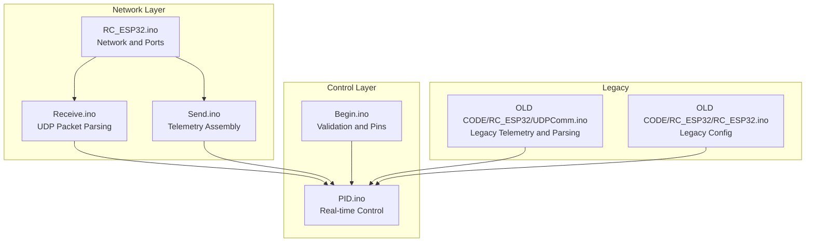
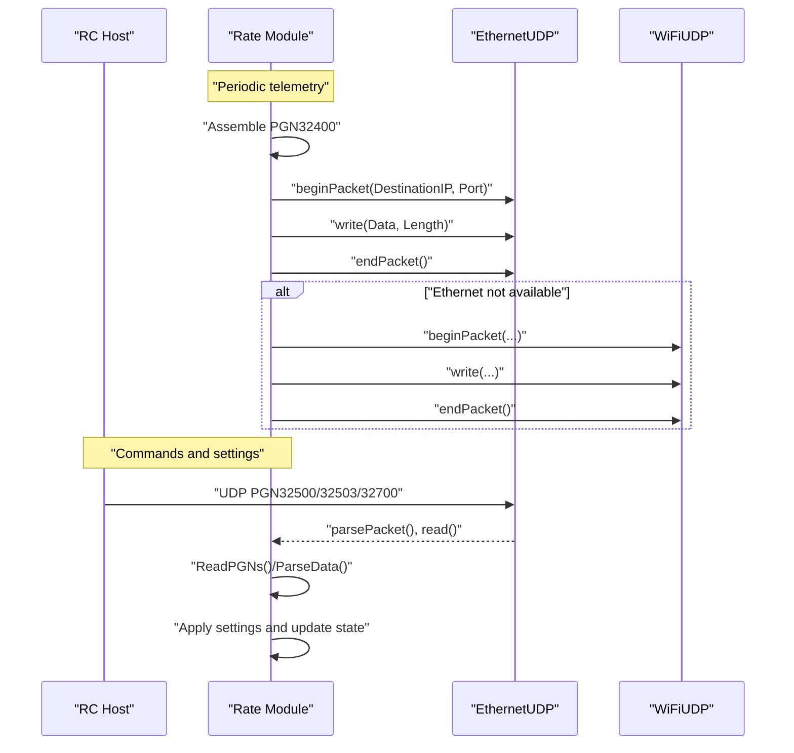
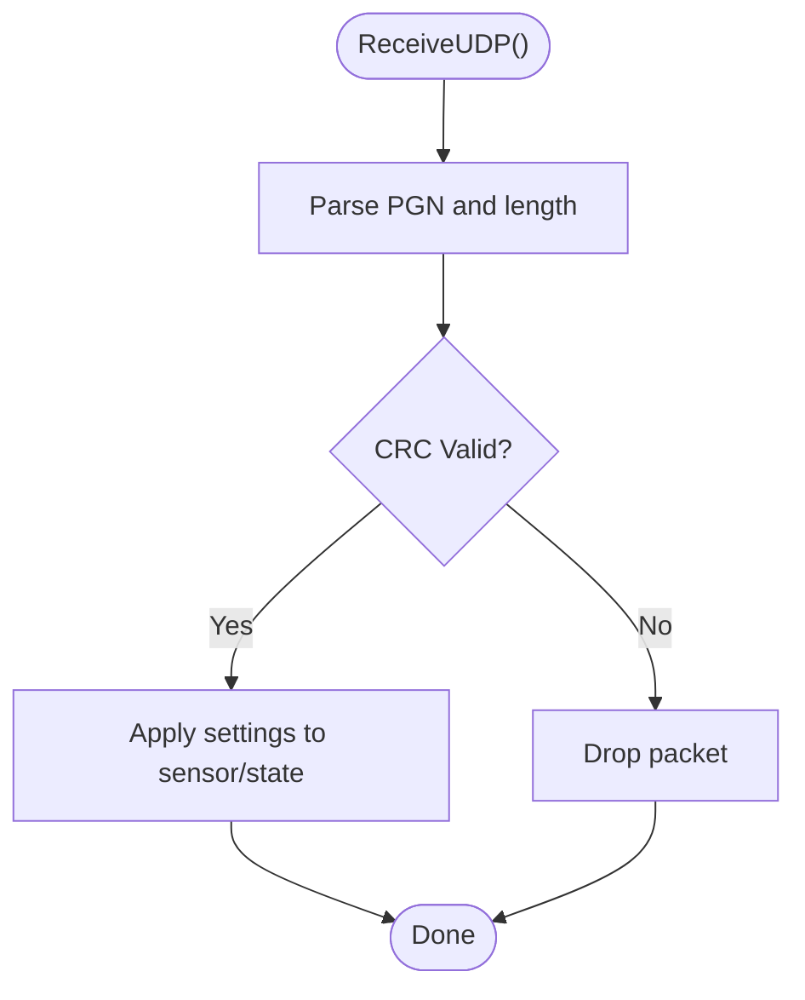
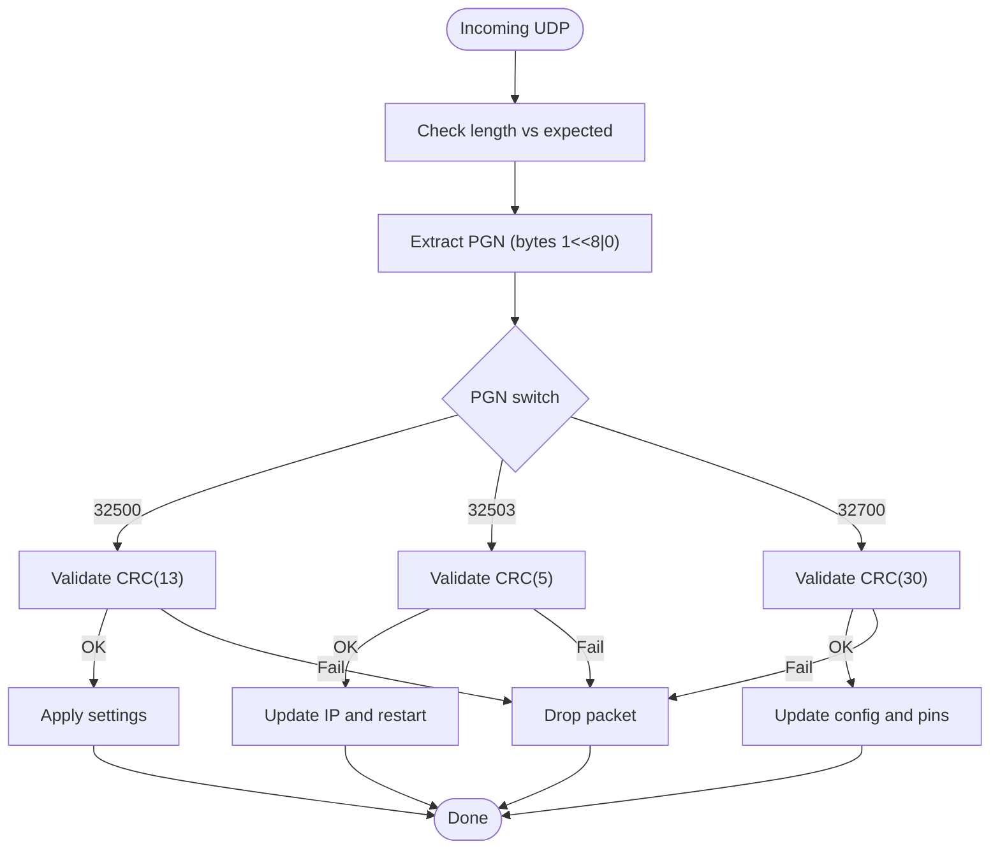
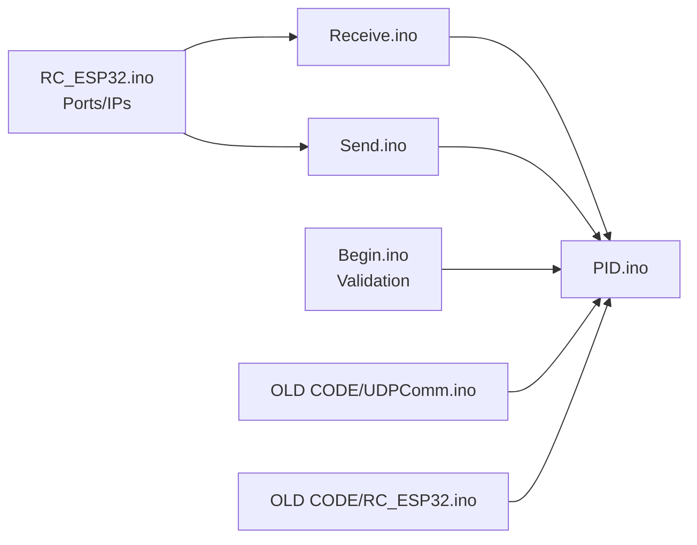

# Message Formats and Specifications

<cite>
**Referenced Files in This Document**
- [UDPComm.ino](file://OLD CODE/RC_ESP32/UDPComm.ino)
- [Send.ino](file://RC_ESP32/Send.ino)
- [Receive.ino](file://RC_ESP32/Receive.ino)
- [RC_ESP32.ino](file://RC_ESP32/RC_ESP32.ino)
- [PID.ino](file://RC_ESP32/PID.ino)
- [Begin.ino](file://RC_ESP32/Begin.ino)
- [Begin.ino](file://OLD CODE/RC_ESP32/Begin.ino)
- [RC_ESP32.ino](file://OLD CODE/RC_ESP32/RC_ESP32.ino)
</cite>

## Table of Contents
1. [Introduction](#introduction)
2. [Project Structure](#project-structure)
3. [Core Components](#core-components)
4. [Architecture Overview](#architecture-overview)
5. [Detailed Component Analysis](#detailed-component-analysis)
6. [Dependency Analysis](#dependency-analysis)
7. [Performance Considerations](#performance-considerations)
8. [Troubleshooting Guide](#troubleshooting-guide)
9. [Conclusion](#conclusion)
10. [Appendices](#appendices)

## Introduction
This document defines the UDP-based message formats and communication protocol used by the Rate Control module. It covers:
- Complete message structure for outgoing telemetry and incoming commands
- Field definitions, data types, scaling factors, and units
- Examples of command encoding and parameter transmission
- Message sequencing and acknowledgment behavior
- Protocol-specific examples: rate control commands, status queries, and configuration requests
- Data validation and error-checking mechanisms (CRC)
- Timing requirements and real-time constraints for agricultural applications
- Backward compatibility and protocol versioning considerations
- Debugging tools and monitoring approaches for message flow analysis

## Project Structure
The communication logic spans several modules:
- Network initialization and configuration
- Telemetry sending (outgoing module-to-RC messages)
- Command reception and parsing (incoming RC-to-module messages)
- Control loop integration and real-time constraints
- Validation and pin configuration checks

**Diagram sources**
- [RC_ESP32.ino:150-162](file://RC_ESP32/RC_ESP32.ino#L150-L162)
- [Receive.ino:1-27](file://RC_ESP32/Receive.ino#L1-L27)
- [Send.ino:1-60](file://RC_ESP32/Send.ino#L1-L60)
- [PID.ino:164-231](file://RC_ESP32/PID.ino#L164-L231)
- [Begin.ino:641-716](file://RC_ESP32/Begin.ino#L641-L716)
- [UDPComm.ino:1-502](file://OLD CODE/RC_ESP32/UDPComm.ino#L1-L502)
- [RC_ESP32.ino:105-128](file://OLD CODE/RC_ESP32/RC_ESP32.ino#L105-L128)

**Section sources**
- [RC_ESP32.ino:150-162](file://RC_ESP32/RC_ESP32.ino#L150-L162)
- [Receive.ino:1-27](file://RC_ESP32/Receive.ino#L1-L27)
- [Send.ino:1-60](file://RC_ESP32/Send.ino#L1-L60)
- [PID.ino:164-231](file://RC_ESP32/PID.ino#L164-L231)
- [Begin.ino:641-716](file://RC_ESP32/Begin.ino#L641-L716)
- [UDPComm.ino:1-502](file://OLD CODE/RC_ESP32/UDPComm.ino#L1-L502)
- [RC_ESP32.ino:105-128](file://OLD CODE/RC_ESP32/RC_ESP32.ino#L105-L128)

## Core Components
- Network configuration and ports
- Telemetry assembly and transmission
- Command parsing and application
- Real-time control integration
- Validation and pin checks

Key responsibilities:
- Define listening and destination ports and IP destinations
- Assemble telemetry packets with header, payload, and CRC
- Parse incoming PGNs and apply settings
- Integrate PID and control logic with timing constraints
- Validate hardware pin configurations and relay settings

**Section sources**
- [RC_ESP32.ino:150-162](file://RC_ESP32/RC_ESP32.ino#L150-L162)
- [Send.ino:1-60](file://RC_ESP32/Send.ino#L1-L60)
- [Receive.ino:29-195](file://RC_ESP32/Receive.ino#L29-L195)
- [PID.ino:164-231](file://RC_ESP32/PID.ino#L164-L231)
- [Begin.ino:641-716](file://RC_ESP32/Begin.ino#L641-L716)

## Architecture Overview
The system operates on UDP with two primary directions:
- Outbound: Module sends periodic telemetry to RC
- Inbound: RC sends commands/settings to module

**Diagram sources**
- [Send.ino:1-60](file://RC_ESP32/Send.ino#L1-L60)
- [Send.ino:171-192](file://RC_ESP32/Send.ino#L171-L192)
- [Receive.ino:1-27](file://RC_ESP32/Receive.ino#L1-L27)
- [Receive.ino:29-195](file://RC_ESP32/Receive.ino#L29-L195)
- [UDPComm.ino:180-203](file://OLD CODE/RC_ESP32/UDPComm.ino#L180-L203)
- [UDPComm.ino:205-393](file://OLD CODE/RC_ESP32/UDPComm.ino#L205-L393)

## Detailed Component Analysis

### UDP Message Definitions

#### Outbound Telemetry: PGN32400 (Module → RC)
Purpose: Periodic telemetry reporting rate applied, accumulated quantity, PWM, status, and frequency.

Fields:
- Bytes 0–1: Header (fixed)
- Byte 2: Module/Sensor ID
- Bytes 3–5: Rate applied (units per minute × 1000)
- Bytes 6–8: Accumulated quantity (units × 10)
- Bytes 9–10: PWM (uint16)
- Byte 11: Status bits
- Bytes 12–13: Hz (uint16)
- Byte 14: CRC

Status bits (Byte 11):
- Bit 0: Sensor connected
- Bit 6: 3-wire configuration flag present in newer firmware
- Bit 7: Good pin configuration

Scaling and units:
- Rate applied: stored as integer parts per minute × 1000
- Accumulated quantity: stored as integer units × 10
- PWM: 0–65535 (typical 8-bit PWM mapped to 16-bit)
- Hz: pulses per second scaled to 16-bit

Transmission order:
- Header bytes 0–1
- Module/Sensor ID
- Rate applied (3 bytes)
- Accumulated quantity (3 bytes)
- PWM (2 bytes)
- Status (1 byte)
- Hz (2 bytes)
- CRC (1 byte)

Notes:
- CRC computed over the payload excluding CRC itself
- Transmission prioritizes Ethernet; falls back to WiFi if unavailable

**Section sources**
- [Send.ino:1-60](file://RC_ESP32/Send.ino#L1-L60)
- [Send.ino:164-194](file://RC_ESP32/Send.ino#L164-L194)
- [UDPComm.ino:2-26](file://OLD CODE/RC_ESP32/UDPComm.ino#L2-L26)
- [UDPComm.ino:146-178](file://OLD CODE/RC_ESP32/UDPComm.ino#L146-L178)

#### Inbound Command: PGN32500 (RC → Module)
Purpose: Configure rate target, meter calibration, control behavior, and manual adjustments.

Fields:
- Bytes 0–1: Header (fixed)
- Byte 2: Module/Sensor ID
- Bytes 3–5: Rate set (units per minute × 1000)
- Bytes 6–8: Flow calibration (calibration factor × 1000)
- Byte 9: Command byte
- Bytes 10–11: Manual PWM adjustment (int16)
- Byte 12: Reserved
- Byte 13: CRC

Command byte (Byte 9):
- Bit 0: Reset accumulated quantity
- Bits 1–3: Control type (0–7)
- Bit 4: Master enable
- Bit 5: Reserved
- Bit 6: Auto enable
- Bit 7: Calibration on

Behavior:
- Apply rate set and calibration to selected sensor
- Update control type, master/auto flags, and manual adjustment
- Reset accumulator if requested

CRC verification:
- Receiver validates CRC before applying changes

**Section sources**
- [Receive.ino:29-195](file://RC_ESP32/Receive.ino#L29-L195)
- [Receive.ino:35-56](file://RC_ESP32/Receive.ino#L35-L56)
- [Receive.ino:60-62](file://RC_ESP32/Receive.ino#L60-L62)
- [UDPComm.ino:243-270](file://OLD CODE/RC_ESP32/UDPComm.ino#L243-L270)

#### Inbound Command: PGN32503 (RC → Module)
Purpose: Change subnet/IP parameters.

Fields:
- Bytes 0–1: Header (fixed)
- Bytes 2–4: New IP octets
- Byte 5: CRC

Behavior:
- Validate CRC
- Update module IP configuration
- Restart device to apply new network settings

**Section sources**
- [Receive.ino:163-195](file://RC_ESP32/Receive.ino#L163-L195)
- [UDPComm.ino:360-382](file://OLD CODE/RC_ESP32/UDPComm.ino#L360-L382)

#### Inbound Command: PGN32700 (RC → Module)
Purpose: Module configuration and capabilities.

Fields:
- Bytes 0–1: Header (fixed)
- Byte 2: Module ID
- Byte 3: Sensor count
- Byte 4: Commands (bitmask)
- Byte 5: Relay control type
- Bytes 6–29: Pin assignments and relay pins
- Byte 30: CRC

Commands (Byte 4):
- Bit 0: Relay on high
- Bit 1: Flow on high
- Bit 2: Client mode

Behavior:
- Update module configuration and pin mappings
- Apply relay control type and pin assignments

Note: Some fields are conditionally used depending on hardware and configuration.

**Section sources**
- [Receive.ino:163-195](file://RC_ESP32/Receive.ino#L163-L195)
- [UDPComm.ino:384-404](file://OLD CODE/RC_ESP32/UDPComm.ino#L384-L404)
- [UDPComm.ino:406-420](file://OLD CODE/RC_ESP32/UDPComm.ino#L406-L420)

### Message Sequencing and Acknowledgment
- No explicit acknowledgment mechanism is implemented in the analyzed code.
- Telemetry is sent periodically based on a timer.
- Commands are applied immediately upon successful CRC validation.

**Diagram sources**
- [Receive.ino:29-62](file://RC_ESP32/Receive.ino#L29-L62)
- [UDPComm.ino:205-242](file://OLD CODE/RC_ESP32/UDPComm.ino#L205-L242)

**Section sources**
- [Receive.ino:29-62](file://RC_ESP32/Receive.ino#L29-L62)
- [UDPComm.ino:205-242](file://OLD CODE/RC_ESP32/UDPComm.ino#L205-L242)

### Protocol-Specific Examples

#### Rate Control Command Encoding (PGN32500)
- Set rate target: write rate × 1000 into bytes 3–5
- Set calibration: write calibration × 1000 into bytes 6–8
- Control type: set bits 1–3 in command byte
- Master/Auto flags: set bits 4/6
- Manual PWM: write int16 into bytes 10–11
- CRC: compute over payload excluding CRC

#### Status Query
- Implemented via periodic telemetry (PGN32400)
- Receiver reads rate applied, accumulated quantity, PWM, status, and Hz

#### Configuration Request (PGN32700)
- Update module ID, sensor count, commands, relay control type, and pin assignments
- CRC validation required before applying changes

**Section sources**
- [Receive.ino:35-56](file://RC_ESP32/Receive.ino#L35-L56)
- [Receive.ino:60-62](file://RC_ESP32/Receive.ino#L60-L62)
- [UDPComm.ino:243-270](file://OLD CODE/RC_ESP32/UDPComm.ino#L243-L270)
- [UDPComm.ino:384-404](file://OLD CODE/RC_ESP32/UDPComm.ino#L384-L404)

### Data Validation and Error Checking
- CRC validation: performed before applying any command
- Header validation: PGN extracted from bytes 0–1
- Module/Sensor ID filtering: parsed and compared against local module ID
- Pin configuration validation: ensures pins are valid for processor and hardware

**Diagram sources**
- [Receive.ino:29-62](file://RC_ESP32/Receive.ino#L29-L62)
- [Receive.ino:163-195](file://RC_ESP32/Receive.ino#L163-L195)
- [UDPComm.ino:360-382](file://OLD CODE/RC_ESP32/UDPComm.ino#L360-L382)
- [UDPComm.ino:384-404](file://OLD CODE/RC_ESP32/UDPComm.ino#L384-L404)

**Section sources**
- [Receive.ino:29-62](file://RC_ESP32/Receive.ino#L29-L62)
- [Receive.ino:163-195](file://RC_ESP32/Receive.ino#L163-L195)
- [UDPComm.ino:360-382](file://OLD CODE/RC_ESP32/UDPComm.ino#L360-L382)
- [UDPComm.ino:384-404](file://OLD CODE/RC_ESP32/UDPComm.ino#L384-L404)

### Timing Requirements and Real-Time Constraints
- Telemetry interval: controlled by a periodic timer; see send loop and timing variables
- Control loop: PID and control logic operate on fixed intervals and state transitions
- Timed combo control: adjustable pause/adjust durations for timed operation modes
- Slew rate and integral limits: constrain control response for stability

Recommendations:
- Keep telemetry interval consistent to avoid jitter
- Ensure control loop updates occur within expected time windows
- Tune PID gains and limits to meet real-time constraints

**Section sources**
- [Send.ino:1-60](file://RC_ESP32/Send.ino#L1-L60)
- [PID.ino:164-231](file://RC_ESP32/PID.ino#L164-L231)
- [RC_ESP32.ino:150-162](file://RC_ESP32/RC_ESP32.ino#L150-L162)

### Backward Compatibility and Versioning
- Header bytes 0–1 act as a version identifier for PGNs
- CRC presence and length vary by PGN; receivers must validate lengths
- Status and capability fields differ between legacy and current implementations
- Newer firmware adds flags (e.g., 3-wire configuration) in status byte

Guidelines:
- Always validate PGN and length before processing
- Maintain CRC for all commands
- Extend fields with reserved bytes to preserve forward compatibility

**Section sources**
- [UDPComm.ino:2-26](file://OLD CODE/RC_ESP32/UDPComm.ino#L2-L26)
- [UDPComm.ino:146-178](file://OLD CODE/RC_ESP32/UDPComm.ino#L146-L178)
- [Receive.ino:11-20](file://RC_ESP32/Receive.ino#L11-L20)
- [Send.ino:164-194](file://RC_ESP32/Send.ino#L164-L194)

### Debugging Tools and Monitoring Approaches
- Enable logging of received PGNs and CRC validation outcomes
- Monitor telemetry intervals and missed packets
- Validate pin configurations and relay control types during startup
- Use network capture tools to inspect UDP traffic and CRC correctness

Practical tips:
- Log when packets are dropped due to invalid CRC or mismatched module ID
- Track control type transitions and manual/automatic mode changes
- Verify IP changes take effect after receiving PGN32503

**Section sources**
- [Receive.ino:29-62](file://RC_ESP32/Receive.ino#L29-L62)
- [Begin.ino:641-716](file://RC_ESP32/Begin.ino#L641-L716)
- [UDPComm.ino:360-382](file://OLD CODE/RC_ESP32/UDPComm.ino#L360-L382)

## Dependency Analysis

**Diagram sources**
- [RC_ESP32.ino:150-162](file://RC_ESP32/RC_ESP32.ino#L150-L162)
- [Receive.ino:1-27](file://RC_ESP32/Receive.ino#L1-L27)
- [Send.ino:1-60](file://RC_ESP32/Send.ino#L1-L60)
- [PID.ino:164-231](file://RC_ESP32/PID.ino#L164-L231)
- [Begin.ino:641-716](file://RC_ESP32/Begin.ino#L641-L716)
- [UDPComm.ino:1-502](file://OLD CODE/RC_ESP32/UDPComm.ino#L1-L502)
- [RC_ESP32.ino:105-128](file://OLD CODE/RC_ESP32/RC_ESP32.ino#L105-L128)

**Section sources**
- [RC_ESP32.ino:150-162](file://RC_ESP32/RC_ESP32.ino#L150-L162)
- [Receive.ino:1-27](file://RC_ESP32/Receive.ino#L1-L27)
- [Send.ino:1-60](file://RC_ESP32/Send.ino#L1-L60)
- [PID.ino:164-231](file://RC_ESP32/PID.ino#L164-L231)
- [Begin.ino:641-716](file://RC_ESP32/Begin.ino#L641-L716)
- [UDPComm.ino:1-502](file://OLD CODE/RC_ESP32/UDPComm.ino#L1-L502)
- [RC_ESP32.ino:105-128](file://OLD CODE/RC_ESP32/RC_ESP32.ino#L105-L128)

## Performance Considerations
- Keep payload sizes minimal to reduce latency and bandwidth usage
- Use CRC to avoid retransmissions due to corrupted packets
- Ensure control loops and telemetry intervals remain stable under varying loads
- Prefer Ethernet when available for lower latency and higher reliability

## Troubleshooting Guide
Common issues and resolutions:
- CRC failures: verify sender/receiver CRC calculation and payload boundaries
- Wrong module ID: confirm module/sensor ID encoding and parsing
- Missing telemetry: check Ethernet/WiFi availability and destination IPs
- Control not responding: verify control type, master/auto flags, and manual PWM settings
- IP changes not taking effect: ensure PGN32503 is received and device restarted

**Section sources**
- [Receive.ino:29-62](file://RC_ESP32/Receive.ino#L29-L62)
- [Receive.ino:163-195](file://RC_ESP32/Receive.ino#L163-L195)
- [UDPComm.ino:360-382](file://OLD CODE/RC_ESP32/UDPComm.ino#L360-L382)
- [Send.ino:171-192](file://RC_ESP32/Send.ino#L171-L192)

## Conclusion
The Rate Control module uses a compact UDP protocol with CRC-protected payloads. Outbound telemetry reports operational state, while inbound commands configure rate targets, calibration, control modes, and module settings. Robust CRC validation and strict header checks ensure reliable operation. Real-time constraints are addressed through fixed-interval telemetry and PID control logic. For future enhancements, maintain CRC and extend fields with reserved bytes to preserve backward compatibility.

## Appendices

### Appendix A: Field Reference Tables

#### Outbound: PGN32400
- Bytes 0–1: Header (fixed)
- Byte 2: Module/Sensor ID
- Bytes 3–5: Rate applied × 1000
- Bytes 6–8: Accumulated quantity × 10
- Bytes 9–10: PWM (uint16)
- Byte 11: Status bits
- Bytes 12–13: Hz (uint16)
- Byte 14: CRC

#### Inbound: PGN32500
- Bytes 0–1: Header (fixed)
- Byte 2: Module/Sensor ID
- Bytes 3–5: Rate set × 1000
- Bytes 6–8: Flow calibration × 1000
- Byte 9: Command byte
- Bytes 10–11: Manual PWM (int16)
- Byte 12: Reserved
- Byte 13: CRC

#### Inbound: PGN32503
- Bytes 0–1: Header (fixed)
- Bytes 2–4: New IP octets
- Byte 5: CRC

#### Inbound: PGN32700
- Bytes 0–1: Header (fixed)
- Byte 2: Module ID
- Byte 3: Sensor count
- Byte 4: Commands (bitmask)
- Byte 5: Relay control type
- Bytes 6–29: Pin assignments and relay pins
- Byte 30: CRC

**Section sources**
- [Send.ino:1-60](file://RC_ESP32/Send.ino#L1-L60)
- [Receive.ino:29-195](file://RC_ESP32/Receive.ino#L29-L195)
- [UDPComm.ino:360-404](file://OLD CODE/RC_ESP32/UDPComm.ino#L360-L404)