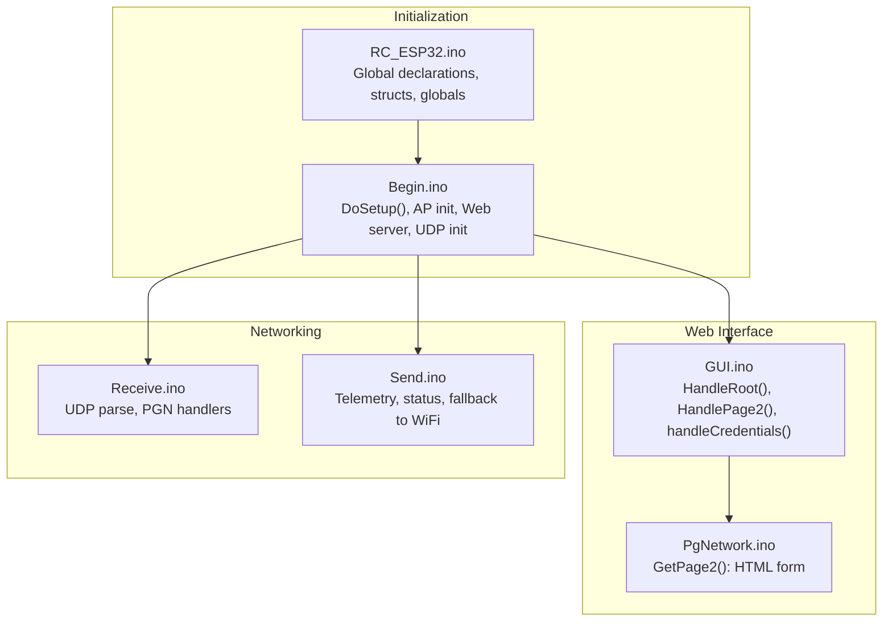
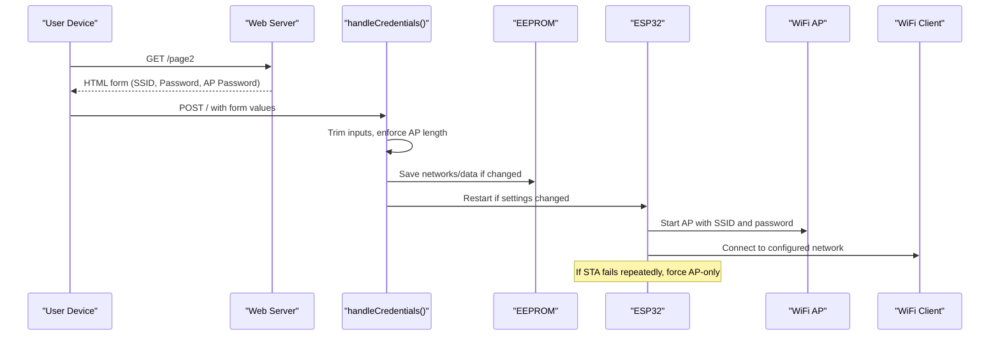
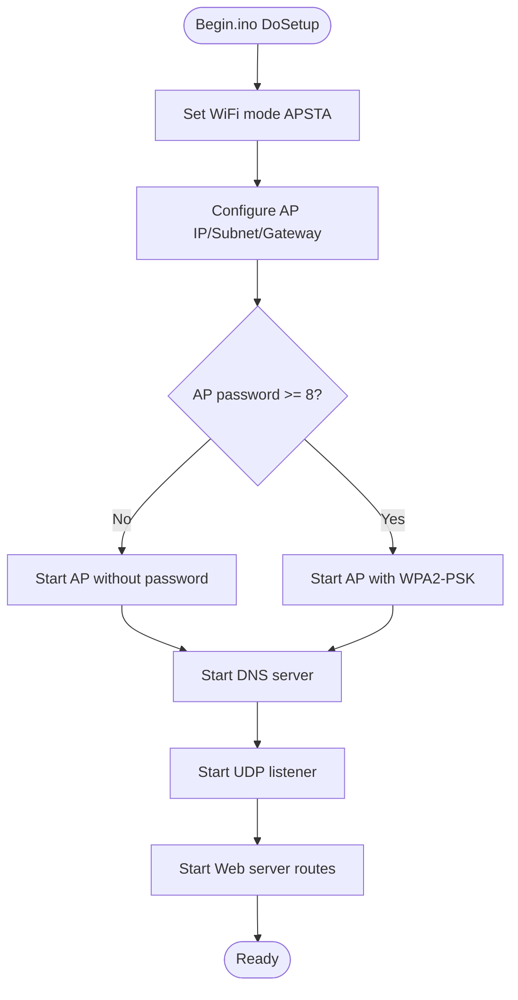
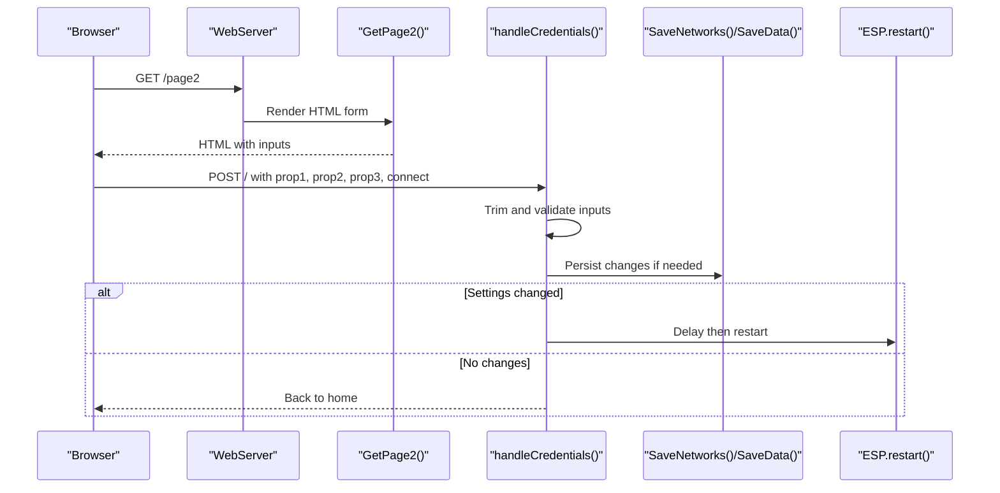
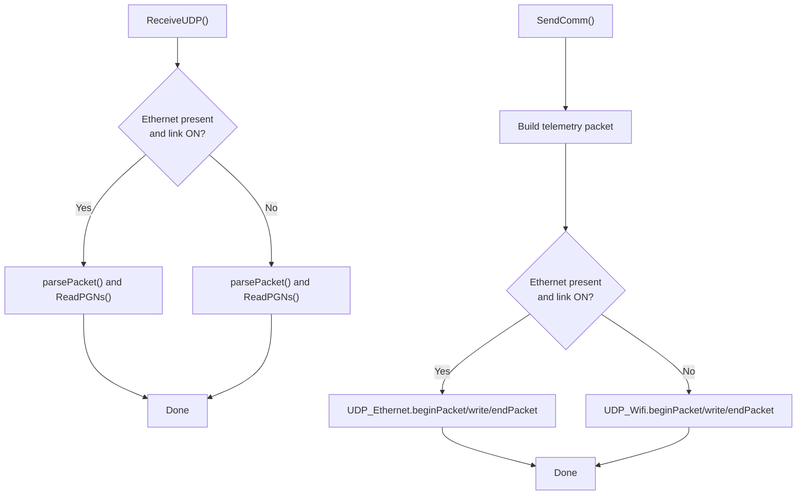
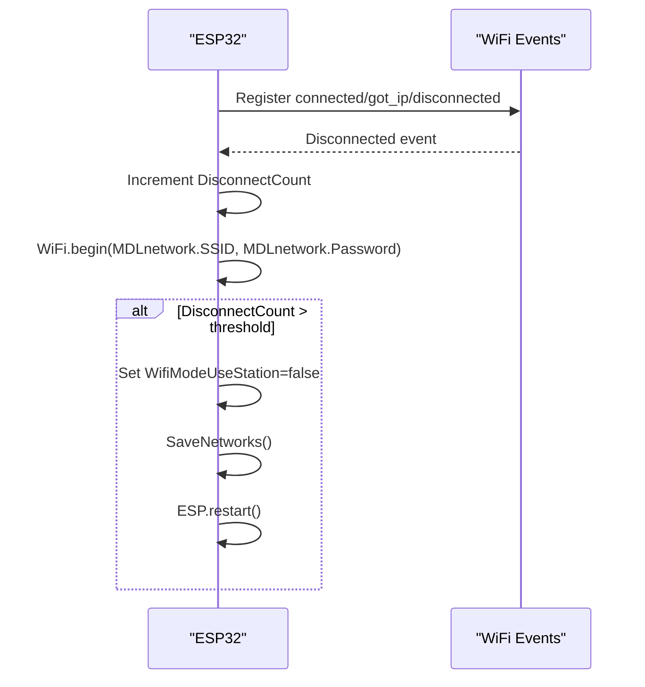
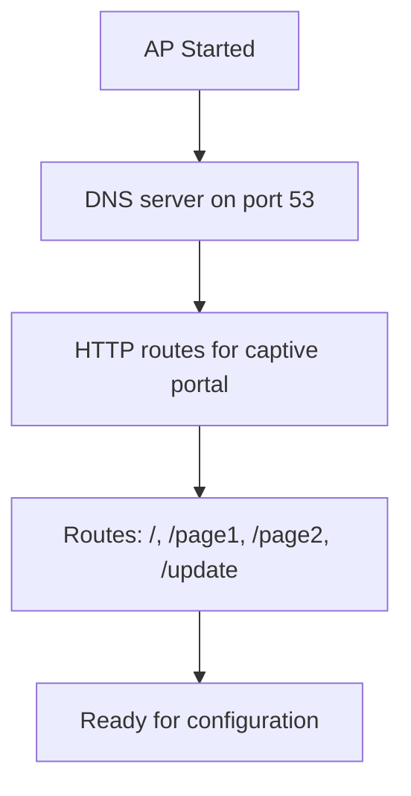
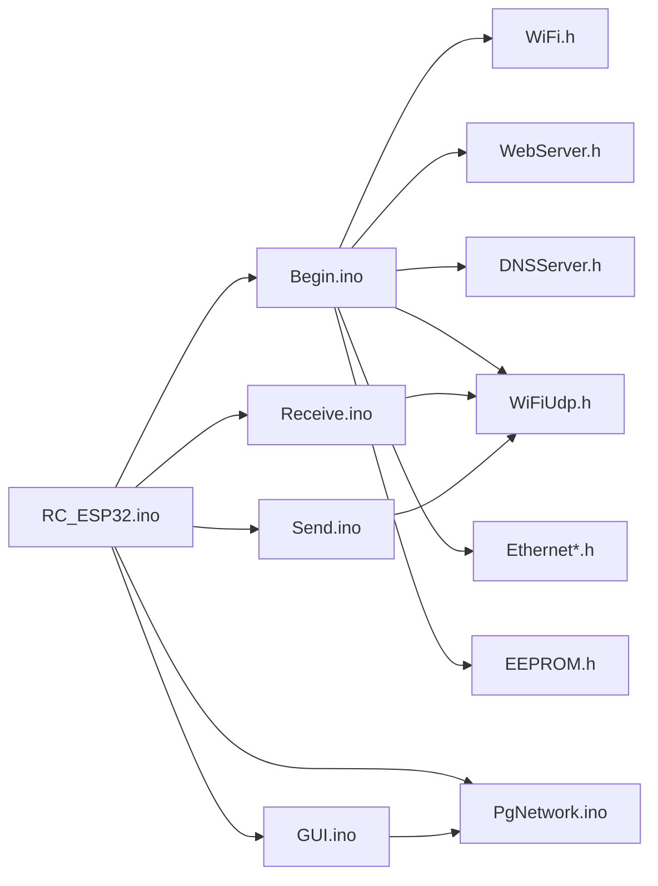

# Network Modes and Configuration

<cite>
**Referenced Files in This Document**
- [RC_ESP32.ino](file://RC_ESP32/RC_ESP32.ino)
- [Begin.ino](file://RC_ESP32/Begin.ino)
- [PgNetwork.ino](file://RC_ESP32/PgNetwork.ino)
- [GUI.ino](file://RC_ESP32/GUI.ino)
- [Receive.ino](file://RC_ESP32/Receive.ino)
- [Send.ino](file://RC_ESP32/Send.ino)
- [PgNetwork.ino (OLD CODE)](file://OLD CODE/RC_ESP32/PgNetwork.ino)
</cite>

## Table of Contents
1. [Introduction](#introduction)
2. [Project Structure](#project-structure)
3. [Core Components](#core-components)
4. [Architecture Overview](#architecture-overview)
5. [Detailed Component Analysis](#detailed-component-analysis)
6. [Dependency Analysis](#dependency-analysis)
7. [Performance Considerations](#performance-considerations)
8. [Troubleshooting Guide](#troubleshooting-guide)
9. [Conclusion](#conclusion)
10. [Appendices](#appendices)

## Introduction
This document explains the dual-mode networking operation of the ESP32 Rate module, which supports both Access Point (AP) mode and WiFi Client mode. It covers network configuration procedures, the web-based configuration interface, automatic discovery and client handling, mode switching and failover, deployment scenarios, security considerations, and troubleshooting procedures.

## Project Structure
The networking implementation spans several modules:
- Initialization and dual-mode setup
- Web server and HTML forms for configuration
- UDP communication over WiFi and Ethernet
- Event-driven WiFi client reconnection and failover

**Diagram sources**
- [RC_ESP32.ino:12-25](file://RC_ESP32/RC_ESP32.ino#L12-L25)
- [Begin.ino:173-254](file://RC_ESP32/Begin.ino#L173-L254)
- [GUI.ino:1-103](file://RC_ESP32/GUI.ino#L1-L103)
- [PgNetwork.ino:1-155](file://RC_ESP32/PgNetwork.ino#L1-L155)
- [Receive.ino:2-27](file://RC_ESP32/Receive.ino#L2-L27)
- [Send.ino:1-195](file://RC_ESP32/Send.ino#L1-L195)

**Section sources**
- [RC_ESP32.ino:12-25](file://RC_ESP32/RC_ESP32.ino#L12-L25)
- [Begin.ino:173-254](file://RC_ESP32/Begin.ino#L173-L254)
- [GUI.ino:1-103](file://RC_ESP32/GUI.ino#L1-L103)
- [PgNetwork.ino:1-155](file://RC_ESP32/PgNetwork.ino#L1-L155)
- [Receive.ino:2-27](file://RC_ESP32/Receive.ino#L2-L27)
- [Send.ino:1-195](file://RC_ESP32/Send.ino#L1-L195)

## Core Components
- Dual-mode WiFi initialization: APSTA mode with AP configuration and DNS responder.
- Web-based configuration interface: HTML form for SSID/password and AP password, with validation and persistence.
- UDP transport: Telemetry and control messages over Ethernet and WiFi with fallback.
- Client reconnection and failover: Automatic retry with hard-fail to AP-only mode after repeated failures.

Key implementation references:
- WiFi mode and AP creation: [Begin.ino:173-203](file://RC_ESP32/Begin.ino#L173-L203)
- Web form rendering: [PgNetwork.ino:1-155](file://RC_ESP32/PgNetwork.ino#L1-L155)
- Form handling and validation: [GUI.ino:25-79](file://RC_ESP32/GUI.ino#L25-L79)
- UDP receive and PGN parsing: [Receive.ino:29-343](file://RC_ESP32/Receive.ino#L29-L343)
- UDP send and fallback: [Send.ino:70-191](file://RC_ESP32/Send.ino#L70-L191)
- Client events and reconnect: [RC_ESP32.ino:212-244](file://RC_ESP32/RC_ESP32.ino#L212-L244)

**Section sources**
- [Begin.ino:173-203](file://RC_ESP32/Begin.ino#L173-L203)
- [PgNetwork.ino:1-155](file://RC_ESP32/PgNetwork.ino#L1-L155)
- [GUI.ino:25-79](file://RC_ESP32/GUI.ino#L25-L79)
- [Receive.ino:29-343](file://RC_ESP32/Receive.ino#L29-L343)
- [Send.ino:70-191](file://RC_ESP32/Send.ino#L70-L191)
- [RC_ESP32.ino:212-244](file://RC_ESP32/RC_ESP32.ino#L212-L244)

## Architecture Overview
The system initializes in APSTA mode, starts an AP with a dynamic SSID suffix, and runs a local web server. Users configure SSID/password and AP password via a form. The device attempts to connect to the configured network. If successful, it sends telemetry over Ethernet/WiFi; if Ethernet is unavailable, it falls back to WiFi. If WiFi disconnects repeatedly, it forces AP-only mode.

**Diagram sources**
- [GUI.ino:19-79](file://RC_ESP32/GUI.ino#L19-L79)
- [Begin.ino:173-203](file://RC_ESP32/Begin.ino#L173-L203)
- [RC_ESP32.ino:212-244](file://RC_ESP32/RC_ESP32.ino#L212-L244)

## Detailed Component Analysis

### Dual-Mode Initialization and AP Setup
- Initializes WiFi in APSTA mode and disconnects any existing STA connection.
- Configures AP IP/subnet/gateway and starts DNS responder.
- Creates a unique AP SSID using a MAC-derived suffix.
- Starts UDP listener on the configured port and web server routes.

**Diagram sources**
- [Begin.ino:173-203](file://RC_ESP32/Begin.ino#L173-L203)
- [Begin.ino:215-236](file://RC_ESP32/Begin.ino#L215-L236)

**Section sources**
- [Begin.ino:173-203](file://RC_ESP32/Begin.ino#L173-L203)
- [Begin.ino:215-236](file://RC_ESP32/Begin.ino#L215-L236)

### Web-Based Configuration Interface
- Renders a form with fields for:
  - Network SSID and Password
  - Toggle to enable Client mode (AP + STA)
  - AP Password with hint and length enforcement
- Validates inputs and persists changes to EEPROM.
- Triggers a restart to apply new settings.

**Diagram sources**
- [PgNetwork.ino:1-155](file://RC_ESP32/PgNetwork.ino#L1-L155)
- [GUI.ino:19-79](file://RC_ESP32/GUI.ino#L19-L79)

**Section sources**
- [PgNetwork.ino:1-155](file://RC_ESP32/PgNetwork.ino#L1-L155)
- [GUI.ino:19-79](file://RC_ESP32/GUI.ino#L19-L79)

### UDP Transport and Fallback Behavior
- Receives UDP packets from Ethernet and/or WiFi and parses PGNs.
- Sends telemetry and module info, prioritizing Ethernet when available; otherwise uses WiFi.
- Uses CRC for integrity checks and includes status bits indicating connection quality and configuration.

**Diagram sources**
- [Receive.ino:2-27](file://RC_ESP32/Receive.ino#L2-L27)
- [Send.ino:70-191](file://RC_ESP32/Send.ino#L70-L191)

**Section sources**
- [Receive.ino:2-27](file://RC_ESP32/Receive.ino#L2-L27)
- [Send.ino:70-191](file://RC_ESP32/Send.ino#L70-L191)

### Client Reconnection and Failover
- Registers WiFi event callbacks for connected, got IP, and disconnected.
- On disconnect, retries connection and increments a disconnect counter.
- After exceeding a threshold, disables STA mode and restarts to AP-only mode.

**Diagram sources**
- [RC_ESP32.ino:212-244](file://RC_ESP32/RC_ESP32.ino#L212-L244)
- [Begin.ino:243-254](file://RC_ESP32/Begin.ino#L243-L254)

**Section sources**
- [RC_ESP32.ino:212-244](file://RC_ESP32/RC_ESP32.ino#L212-L244)
- [Begin.ino:243-254](file://RC_ESP32/Begin.ino#L243-L254)

### Network Discovery and Client Handling
- The AP provides captive portal endpoints to assist discovery on mobile devices.
- DNS responder answers queries for the AP IP to guide clients to the settings page.
- The web server exposes routes for configuration pages and OTA updates.

**Diagram sources**
- [Begin.ino:205-236](file://RC_ESP32/Begin.ino#L205-L236)

**Section sources**
- [Begin.ino:205-236](file://RC_ESP32/Begin.ino#L205-L236)

## Dependency Analysis
- Global structures and constants are declared in the main file and used across modules.
- Initialization depends on WiFi, WebServer, DNSServer, UDP, and EEPROM libraries.
- Configuration persistence uses EEPROM with identifiers for network and module data.

**Diagram sources**
- [RC_ESP32.ino:12-25](file://RC_ESP32/RC_ESP32.ino#L12-L25)
- [Begin.ino:173-203](file://RC_ESP32/Begin.ino#L173-L203)
- [GUI.ino:1-103](file://RC_ESP32/GUI.ino#L1-L103)
- [PgNetwork.ino:1-155](file://RC_ESP32/PgNetwork.ino#L1-L155)
- [Receive.ino:2-27](file://RC_ESP32/Receive.ino#L2-L27)
- [Send.ino:1-195](file://RC_ESP32/Send.ino#L1-L195)

**Section sources**
- [RC_ESP32.ino:12-25](file://RC_ESP32/RC_ESP32.ino#L12-L25)
- [Begin.ino:173-203](file://RC_ESP32/Begin.ino#L173-L203)
- [GUI.ino:1-103](file://RC_ESP32/GUI.ino#L1-L103)
- [PgNetwork.ino:1-155](file://RC_ESP32/PgNetwork.ino#L1-L155)
- [Receive.ino:2-27](file://RC_ESP32/Receive.ino#L2-L27)
- [Send.ino:1-195](file://RC_ESP32/Send.ino#L1-L195)

## Performance Considerations
- UDP packet sizes are bounded to reduce memory usage during parsing.
- Telemetry is sent periodically to balance responsiveness and bandwidth.
- Fallback to WiFi ensures continued operation when Ethernet is unavailable.
- EEPROM writes occur only on configuration changes to minimize wear.

[No sources needed since this section provides general guidance]

## Troubleshooting Guide
Common issues and resolutions:
- WiFi not connecting:
  - Verify SSID and password length and correctness.
  - Check that the AP password meets the minimum length requirement for WPA2-PSK.
  - Confirm the device is within range and the router is functioning.
- Frequent disconnections:
  - Review signal strength and placement near the AP.
  - Check for interference or overlapping channels.
  - Allow the device to remain in AP-only mode if repeated failures persist.
- Configuration not saving:
  - Ensure the form is submitted and the device restarts after changes.
  - Confirm EEPROM write operations succeed and the device powers down and back up.
- No telemetry received:
  - Verify Ethernet link status and cable connections.
  - Check destination IP and port settings.
  - Confirm the device is sending on the correct port and the receiver is listening.

**Section sources**
- [GUI.ino:25-79](file://RC_ESP32/GUI.ino#L25-L79)
- [RC_ESP32.ino:212-244](file://RC_ESP32/RC_ESP32.ino#L212-L244)
- [Send.ino:70-191](file://RC_ESP32/Send.ino#L70-L191)
- [Receive.ino:2-27](file://RC_ESP32/Receive.ino#L2-L27)

## Conclusion
The ESP32 Rate module provides robust dual-mode networking with an intuitive web interface for configuration. It supports seamless switching between AP and Client modes, automatic discovery, and resilient failover. The implementation balances simplicity with reliability, enabling flexible deployments in field operations and base station setups.

[No sources needed since this section summarizes without analyzing specific files]

## Appendices

### Step-by-Step Configuration Guides

- Field Operations:
  - Connect to the AP SSID shown on the serial console.
  - Navigate to the settings page and enter the target network credentials.
  - Enable “Use this Network” to activate Client mode.
  - Save and restart; the device will attempt to join the network.
  - If connection fails repeatedly, it will fall back to AP-only mode.

- Base Station Setup:
  - Configure the AP password to a strong passphrase (minimum length enforced).
  - Optionally disable Client mode to keep the device in AP-only mode.
  - Use the settings page to adjust AP password and confirm connectivity.

- Network Security Considerations:
  - Use a strong AP password (minimum length enforced).
  - Prefer WPA2-PSK for AP mode.
  - Limit AP exposure by disabling Client mode when not needed.
  - Regularly review and update passwords.

- Parameter Validation Highlights:
  - AP password length is enforced to a maximum value.
  - Changes to SSID, password, or AP password trigger a restart to apply.
  - Client mode toggle enables APSTA behavior.

**Section sources**
- [PgNetwork.ino:138-144](file://RC_ESP32/PgNetwork.ino#L138-L144)
- [GUI.ino:25-79](file://RC_ESP32/GUI.ino#L25-L79)
- [Begin.ino:194-203](file://RC_ESP32/Begin.ino#L194-L203)