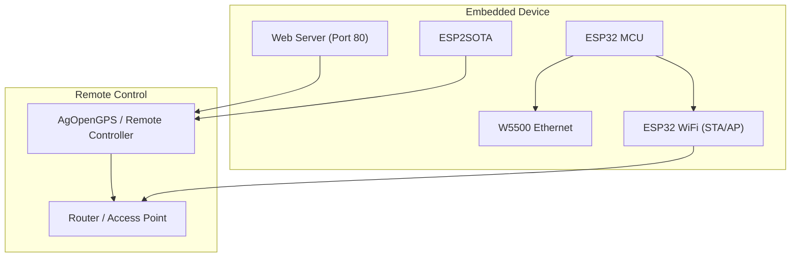
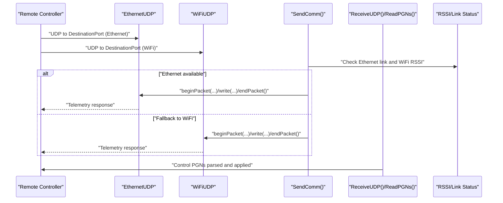
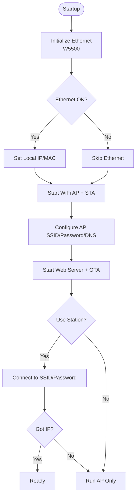
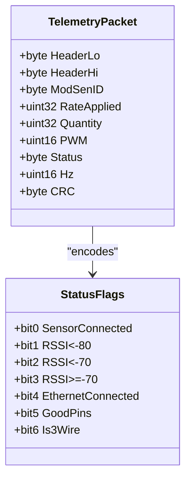
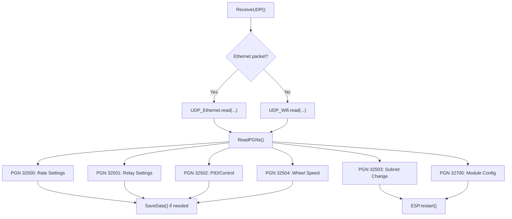
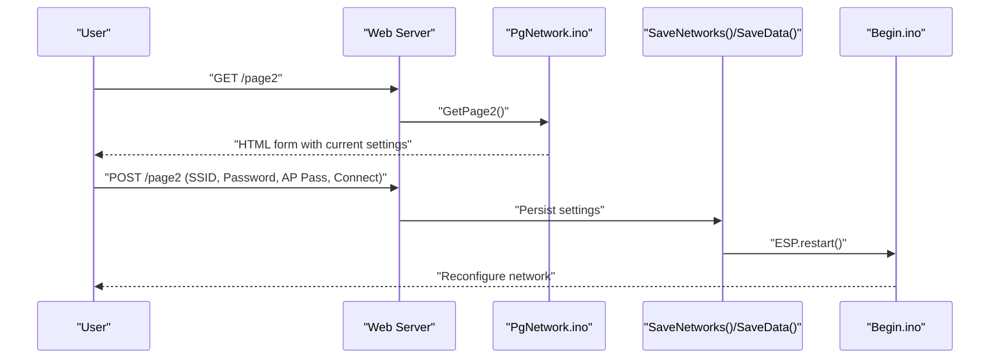
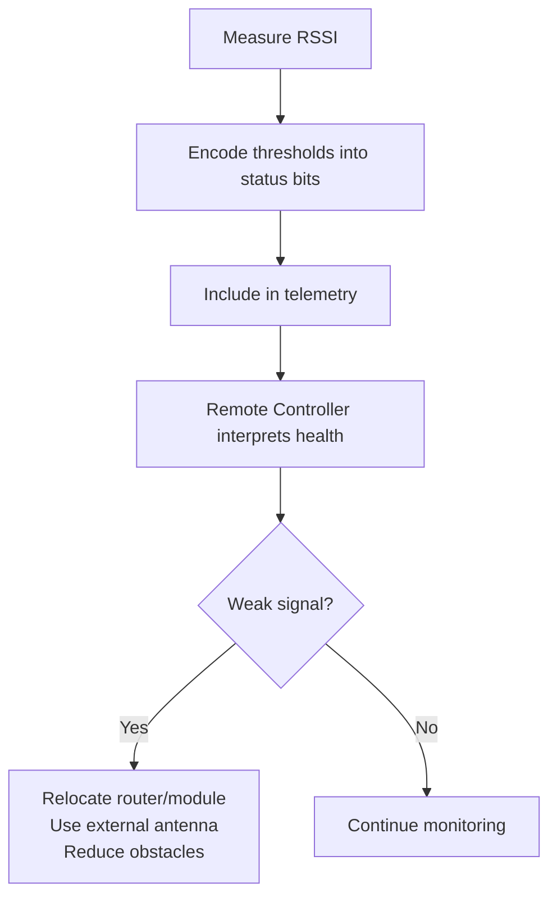
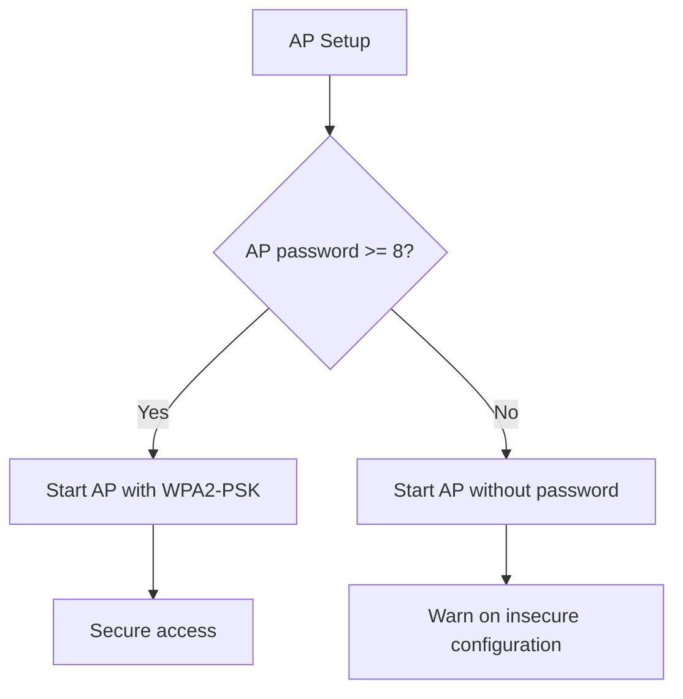
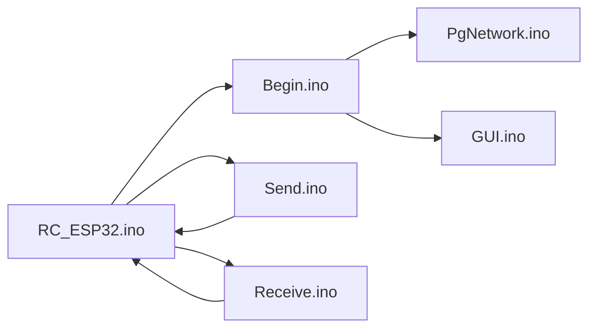

# Network Troubleshooting and Optimization

<cite>
**Referenced Files in This Document**
- [RC_ESP32.ino](file://RC_ESP32/RC_ESP32.ino)
- [Begin.ino](file://RC_ESP32/Begin.ino)
- [Send.ino](file://RC_ESP32/Send.ino)
- [Receive.ino](file://RC_ESP32/Receive.ino)
- [PgNetwork.ino](file://RC_ESP32/PgNetwork.ino)
- [Analog.ino](file://RC_ESP32/Analog.ino)
- [WheelSpeed.ino](file://RC_ESP32/WheelSpeed.ino)
- [GUI.ino](file://RC_ESP32/GUI.ino)
- [UDPComm.ino (OLD)](file://OLD CODE/RC_ESP32/UDPComm.ino)
- [WT5500.ino (OLD)](file://OLD CODE/RC_ESP32/WT5500.ino)
</cite>

## Table of Contents
1. [Introduction](#introduction)
2. [Project Structure](#project-structure)
3. [Core Components](#core-components)
4. [Architecture Overview](#architecture-overview)
5. [Detailed Component Analysis](#detailed-component-analysis)
6. [Dependency Analysis](#dependency-analysis)
7. [Performance Considerations](#performance-considerations)
8. [Troubleshooting Guide](#troubleshooting-guide)
9. [Conclusion](#conclusion)
10. [Appendices](#appendices)

## Introduction
This document provides comprehensive troubleshooting and optimization guidance for the ESP32-based Rate Control module’s network connectivity and performance. It focuses on diagnosing connection failures, packet loss, latency, and throughput issues in agricultural environments with large metal machinery and variable terrain. It also covers signal strength monitoring, range extension techniques, security hardening, performance benchmarking, remote monitoring, and emergency procedures.

## Project Structure
The module supports dual-path communication:
- Ethernet (W5500) for wired reliability
- WiFi (STA/AP) for wireless flexibility and diagnostics

Key runtime behaviors:
- Automatic fallback from Ethernet to WiFi and vice versa
- RSSI-based status reporting for wireless health
- Web-based configuration pages for network and AP settings
- OTA update capability via a custom ESP2SOTA integration

**Diagram sources**
- [Begin.ino:87-122](file://RC_ESP32/Begin.ino#L87-L122)
- [Begin.ino:173-207](file://RC_ESP32/Begin.ino#L173-L207)
- [RC_ESP32.ino:150-163](file://RC_ESP32/RC_ESP32.ino#L150-L163)

**Section sources**
- [Begin.ino:87-122](file://RC_ESP32/Begin.ino#L87-L122)
- [Begin.ino:173-207](file://RC_ESP32/Begin.ino#L173-L207)
- [RC_ESP32.ino:150-163](file://RC_ESP32/RC_ESP32.ino#L150-L163)

## Core Components
- Network initialization and fallback logic
- UDP send/receive for telemetry and control
- RSSI-based wireless health reporting
- Web-based configuration for SSID/password and AP
- OTA update support

Key responsibilities:
- Establish Ethernet and WiFi networks during startup
- Continuously monitor link status and RSSI
- Send periodic telemetry packets with health flags
- Receive control packets and apply settings
- Provide a captive portal and configuration UI

**Section sources**
- [Begin.ino:87-122](file://RC_ESP32/Begin.ino#L87-L122)
- [Begin.ino:173-207](file://RC_ESP32/Begin.ino#L173-L207)
- [Send.ino:1-195](file://RC_ESP32/Send.ino#L1-L195)
- [Receive.ino:1-346](file://RC_ESP32/Receive.ino#L1-L346)
- [PgNetwork.ino:1-155](file://RC_ESP32/PgNetwork.ino#L1-L155)

## Architecture Overview
The system alternates transmission between Ethernet and WiFi, prioritizing Ethernet when available. Telemetry includes RSSI thresholds and Ethernet connectivity flags. Control messages carry rate settings, relay configurations, and module configuration updates.

**Diagram sources**
- [Send.ino:72-91](file://RC_ESP32/Send.ino#L72-L91)
- [Send.ino:171-191](file://RC_ESP32/Send.ino#L171-L191)
- [Receive.ino:2-27](file://RC_ESP32/Receive.ino#L2-L27)
- [RC_ESP32.ino:150-163](file://RC_ESP32/RC_ESP32.ino#L150-L163)

## Detailed Component Analysis

### Network Initialization and Fallback
- Initializes Ethernet with a device-specific IP and MAC
- Starts WiFi AP with a generated SSID suffix and configurable password
- Registers a captive portal and DNS server for seamless device access
- Attempts STA connection if configured; falls back to AP-only after repeated disconnects

**Diagram sources**
- [Begin.ino:87-122](file://RC_ESP32/Begin.ino#L87-L122)
- [Begin.ino:173-207](file://RC_ESP32/Begin.ino#L173-L207)
- [Begin.ino:243-254](file://RC_ESP32/Begin.ino#L243-L254)

**Section sources**
- [Begin.ino:87-122](file://RC_ESP32/Begin.ino#L87-L122)
- [Begin.ino:173-207](file://RC_ESP32/Begin.ino#L173-L207)
- [Begin.ino:243-254](file://RC_ESP32/Begin.ino#L243-L254)

### Telemetry and Health Reporting
- Telemetry packets include:
  - Module ID, rate applied, accumulated quantity, PWM, Hz
  - Status flags: sensor connected, WiFi RSSI thresholds, Ethernet link, pin validity, 3-wire vs 2-wire
- RSSI thresholds are encoded into status bits for quick interpretation by the remote controller

**Diagram sources**
- [Send.ino:7-70](file://RC_ESP32/Send.ino#L7-L70)
- [Send.ino:117-169](file://RC_ESP32/Send.ino#L117-L169)

**Section sources**
- [Send.ino:7-70](file://RC_ESP32/Send.ino#L7-L70)
- [Send.ino:117-169](file://RC_ESP32/Send.ino#L117-L169)

### Control Message Processing
- Receives UDP control packets for:
  - Rate settings and calibration
  - Relay configuration
  - PID and control parameters
  - Subnet/IP changes
  - Wheel speed sensor settings
  - Module configuration
- Applies settings and persists to EEPROM when applicable

**Diagram sources**
- [Receive.ino:2-27](file://RC_ESP32/Receive.ino#L2-L27)
- [Receive.ino:29-343](file://RC_ESP32/Receive.ino#L29-L343)

**Section sources**
- [Receive.ino:2-27](file://RC_ESP32/Receive.ino#L2-L27)
- [Receive.ino:29-343](file://RC_ESP32/Receive.ino#L29-L343)

### Web-Based Network Configuration
- Provides a configuration page to set SSID, password, and enable station mode
- Shows current WiFi connection status
- Allows setting AP password and triggers restart on save

**Diagram sources**
- [PgNetwork.ino:1-155](file://RC_ESP32/PgNetwork.ino#L1-L155)
- [GUI.ino:55-79](file://RC_ESP32/GUI.ino#L55-L79)
- [Begin.ino:738-766](file://RC_ESP32/Begin.ino#L738-L766)

**Section sources**
- [PgNetwork.ino:1-155](file://RC_ESP32/PgNetwork.ino#L1-L155)
- [GUI.ino:55-79](file://RC_ESP32/GUI.ino#L55-L79)
- [Begin.ino:738-766](file://RC_ESP32/Begin.ino#L738-L766)

### Signal Strength Monitoring and Range Extension
- RSSI thresholds are embedded in telemetry status bits for quick detection of weak links
- Recommended range extension techniques:
  - Mount antennas away from large metal machinery
  - Use external high-gain antennas and short coax runs
  - Minimize obstacles and maintain line-of-sight
  - Consider mesh routing or access points along field boundaries

**Diagram sources**
- [Send.ino:144-159](file://RC_ESP32/Send.ino#L144-L159)

**Section sources**
- [Send.ino:144-159](file://RC_ESP32/Send.ino#L144-L159)

### Security Hardening and Unauthorized Access Prevention
- Enforce a minimum-length AP password for WPA2-PSK; otherwise fall back to open AP
- Use station mode with strong credentials for direct network access
- Keep firmware updated via OTA to mitigate known vulnerabilities

**Diagram sources**
- [Begin.ino:193-203](file://RC_ESP32/Begin.ino#L193-L203)

**Section sources**
- [Begin.ino:193-203](file://RC_ESP32/Begin.ino#L193-L203)

### Performance Benchmarking and Throughput Optimization
- Telemetry interval: approximately 200 ms
- Control loop: ~50 ms
- UDP payload sizes are small; prioritize Ethernet for throughput-sensitive scenarios
- Reduce unnecessary packet traffic by disabling unused sensors or relays

[No sources needed since this section provides general guidance]

### Remote Monitoring and Network Health Reporting
- RSSI thresholds and Ethernet link status are reported in telemetry
- Web UI displays current WiFi connection status
- Use these signals to trigger alerts and automatic fallback decisions

**Section sources**
- [Send.ino:144-167](file://RC_ESP32/Send.ino#L144-L167)
- [PgNetwork.ino:124-134](file://RC_ESP32/PgNetwork.ino#L124-L134)

### Emergency Procedures and Manual Override
- If STA disconnects repeatedly, the system automatically switches to AP-only mode
- Web UI allows immediate reconfiguration of network settings
- Manual override: temporarily disable station mode and rely on AP for operation

**Section sources**
- [RC_ESP32.ino:227-244](file://RC_ESP32/RC_ESP32.ino#L227-L244)
- [Begin.ino:243-254](file://RC_ESP32/Begin.ino#L243-L254)
- [PgNetwork.ino:1-155](file://RC_ESP32/PgNetwork.ino#L1-L155)

## Dependency Analysis
- Ethernet and WiFi libraries are initialized independently
- Telemetry and control paths share common parsing and CRC routines
- Web server and OTA depend on the same underlying network stack

**Diagram sources**
- [RC_ESP32.ino:1-418](file://RC_ESP32/RC_ESP32.ino#L1-L418)
- [Begin.ino:1-345](file://RC_ESP32/Begin.ino#L1-L345)
- [Send.ino:1-195](file://RC_ESP32/Send.ino#L1-L195)
- [Receive.ino:1-346](file://RC_ESP32/Receive.ino#L1-L346)
- [PgNetwork.ino:1-155](file://RC_ESP32/PgNetwork.ino#L1-L155)
- [GUI.ino:1-103](file://RC_ESP32/GUI.ino#L1-L103)

**Section sources**
- [RC_ESP32.ino:1-418](file://RC_ESP32/RC_ESP32.ino#L1-L418)
- [Begin.ino:1-345](file://RC_ESP32/Begin.ino#L1-L345)
- [Send.ino:1-195](file://RC_ESP32/Send.ino#L1-L195)
- [Receive.ino:1-346](file://RC_ESP32/Receive.ino#L1-L346)
- [PgNetwork.ino:1-155](file://RC_ESP32/PgNetwork.ino#L1-L155)
- [GUI.ino:1-103](file://RC_ESP32/GUI.ino#L1-L103)

## Performance Considerations
- Prefer Ethernet for high-throughput and deterministic latency
- Tune control loop and telemetry intervals to balance responsiveness and bandwidth
- Use CRC-checked control packets to avoid misapplication of settings
- Monitor RSSI and Ethernet link flags to detect degradation proactively

[No sources needed since this section provides general guidance]

## Troubleshooting Guide

### Connection Failures
- Verify Ethernet link status and IP configuration
- Confirm WiFi credentials and AP availability
- Check for repeated STA disconnects and automatic fallback to AP-only mode

**Section sources**
- [Begin.ino:87-122](file://RC_ESP32/Begin.ino#L87-L122)
- [Begin.ino:243-254](file://RC_ESP32/Begin.ino#L243-L254)
- [RC_ESP32.ino:227-244](file://RC_ESP32/RC_ESP32.ino#L227-L244)

### Packet Loss and Latency
- Inspect telemetry status flags for RSSI thresholds and Ethernet connectivity
- Reduce radio interference by relocating routers and avoiding metal enclosures
- Use wired Ethernet for latency-sensitive operations

**Section sources**
- [Send.ino:144-167](file://RC_ESP32/Send.ino#L144-L167)

### Signal Strength Monitoring
- RSSI thresholds are encoded in telemetry status bits
- Use the web UI to confirm current connection status

**Section sources**
- [Send.ino:144-159](file://RC_ESP32/Send.ino#L144-L159)
- [PgNetwork.ino:124-134](file://RC_ESP32/PgNetwork.ino#L124-L134)

### Range Extension Techniques
- Improve antenna placement and use external high-gain antennas
- Minimize obstacles and maintain line-of-sight
- Deploy additional access points or mesh nodes

[No sources needed since this section provides general guidance]

### Security Concerns and Unauthorized Access
- Ensure AP password meets minimum length for WPA2-PSK
- Avoid open APs in operational environments
- Keep firmware updated via OTA

**Section sources**
- [Begin.ino:193-203](file://RC_ESP32/Begin.ino#L193-L203)

### Performance Benchmarking and Optimization
- Adjust control loop and telemetry intervals
- Prefer Ethernet for throughput
- Validate CRC on control packets before applying changes

**Section sources**
- [RC_ESP32.ino:179-182](file://RC_ESP32/RC_ESP32.ino#L179-L182)
- [Receive.ino:29-343](file://RC_ESP32/Receive.ino#L29-L343)

### Remote Monitoring and Health Reporting
- Monitor RSSI and Ethernet flags in telemetry
- Use web UI to verify connection status

**Section sources**
- [Send.ino:144-167](file://RC_ESP32/Send.ino#L144-L167)
- [PgNetwork.ino:124-134](file://RC_ESP32/PgNetwork.ino#L124-L134)

### Emergency Procedures and Manual Override
- If STA fails repeatedly, rely on AP-only mode
- Use web UI to reconfigure network settings immediately
- Temporarily disable station mode to stabilize operation

**Section sources**
- [RC_ESP32.ino:227-244](file://RC_ESP32/RC_ESP32.ino#L227-L244)
- [Begin.ino:243-254](file://RC_ESP32/Begin.ino#L243-L254)
- [PgNetwork.ino:1-155](file://RC_ESP32/PgNetwork.ino#L1-L155)

## Conclusion
The Rate Control module provides robust dual-path networking with built-in diagnostics and a web-based configuration interface. By leveraging RSSI thresholds, Ethernet prioritization, and secure AP configuration, operators can maintain reliable connectivity in challenging agricultural environments. Use the provided troubleshooting procedures and optimization strategies to diagnose issues, improve performance, and ensure secure operation.

## Appendices

### Historical Notes and Differences
- Previous implementations included explicit ETH event handling and separate AGIO UDP channels
- Current implementation simplifies to a unified Ethernet/WiFi UDP stack with integrated web/OTA

**Section sources**
- [UDPComm.ino (OLD):180-203](file://OLD CODE/RC_ESP32/UDPComm.ino#L180-L203)
- [WT5500.ino (OLD):41-78](file://OLD CODE/RC_ESP32/WT5500.ino#L41-L78)