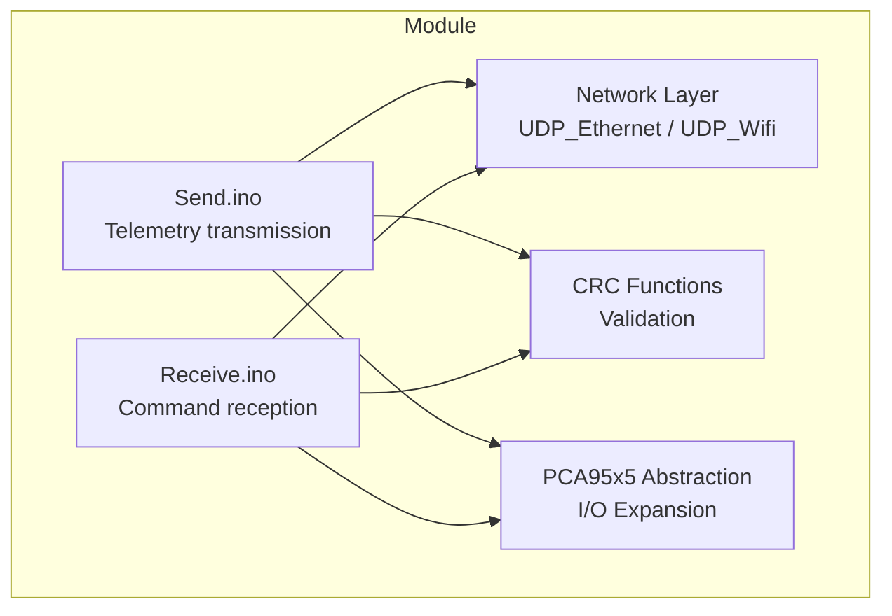
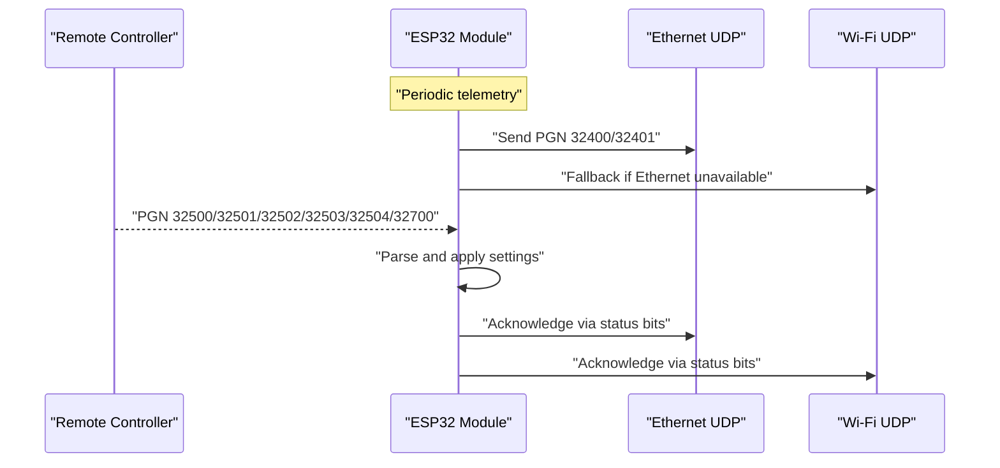
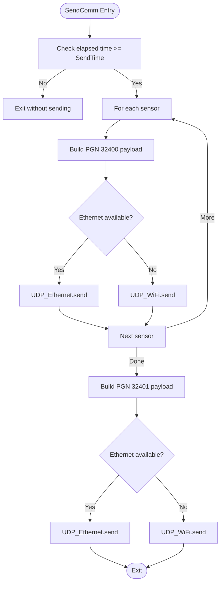
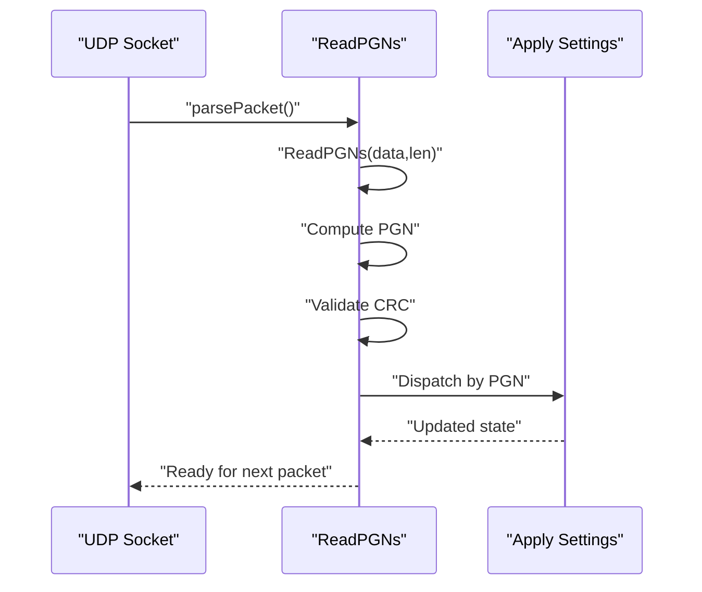
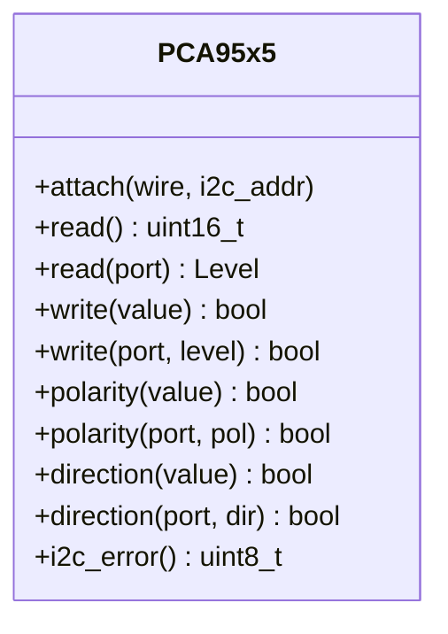
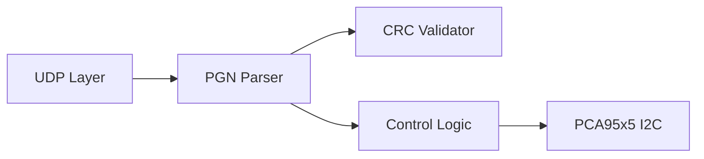

# UDP Protocol Implementation

<cite>
**Referenced Files in This Document**
- [Send.ino](file://RC_ESP32/Send.ino)
- [Receive.ino](file://RC_ESP32/Receive.ino)
- [PCA95x5_RC.h](file://RC_ESP32/PCA95x5_RC.h)
- [Begin.ino](file://OLD CODE/RC_ESP32/Begin.ino)
- [RC_ESP32.ino](file://OLD CODE/RC_ESP32/RC_ESP32.ino)
- [UDPComm.ino](file://OLD CODE/RC_ESP32/UDPComm.ino)
- [FORK_CHANGES.md](file://FORK_CHANGES.md)
</cite>

## Table of Contents
1. [Introduction](#introduction)
2. [Project Structure](#project-structure)
3. [Core Components](#core-components)
4. [Architecture Overview](#architecture-overview)
5. [Detailed Component Analysis](#detailed-component-analysis)
6. [Dependency Analysis](#dependency-analysis)
7. [Performance Considerations](#performance-considerations)
8. [Troubleshooting Guide](#troubleshooting-guide)
9. [Conclusion](#conclusion)

## Introduction
This document describes the UDP-based communication protocol used by the AgOpenGPS ESP32 Rate Control module. It covers packet structure, message formats, data serialization, send/receive mechanisms, timing and scheduling for real-time rate control, checksum implementation, acknowledgment and error handling, and strategies for packet loss recovery and retransmission. Guidance is also provided for performance tuning in agricultural environments and interference mitigation.

## Project Structure
The UDP implementation spans several modules:
- Send and receive logic for telemetry and control messages
- CRC validation and packet parsing
- Network transport via Ethernet and Wi-Fi
- Hardware abstraction for I/O expansion chips (PCA95x5 family)

**Diagram sources**
- [Send.ino:1-195](file://RC_ESP32/Send.ino#L1-L195)
- [Receive.ino:1-346](file://RC_ESP32/Receive.ino#L1-L346)
- [PCA95x5_RC.h:1-178](file://RC_ESP32/PCA95x5_RC.h#L1-L178)

**Section sources**
- [Send.ino:1-195](file://RC_ESP32/Send.ino#L1-L195)
- [Receive.ino:1-346](file://RC_ESP32/Receive.ino#L1-L346)
- [PCA95x5_RC.h:1-178](file://RC_ESP32/PCA95x5_RC.h#L1-L178)

## Core Components
- Telemetry sender: constructs periodic telemetry packets containing rate, accumulated quantity, PWM, frequency, and status; writes to Ethernet or Wi-Fi depending on connectivity.
- Command receiver: parses incoming PGNs for rate settings, relay control, PID/timing parameters, wheel speed sensor configuration, and module/network configuration.
- CRC validation: verifies packet integrity before applying settings.
- Network transport: dual-path UDP sending and receiving over Ethernet and Wi-Fi.
- I/O expansion: PCA95x5-based drivers for external relays and sensors.

**Section sources**
- [Send.ino:1-195](file://RC_ESP32/Send.ino#L1-L195)
- [Receive.ino:1-346](file://RC_ESP32/Receive.ino#L1-L346)
- [PCA95x5_RC.h:1-178](file://RC_ESP32/PCA95x5_RC.h#L1-L178)

## Architecture Overview
The system uses two primary UDP channels:
- Telemetry channel: module-to-RC periodic telemetry
- Command channel: RC-to-module control and configuration

**Diagram sources**
- [Send.ino:1-195](file://RC_ESP32/Send.ino#L1-L195)
- [Receive.ino:1-346](file://RC_ESP32/Receive.ino#L1-L346)

## Detailed Component Analysis

### Packet Header and Message Formats
- PGN 32400: Telemetry per sensor (rate, accumulated quantity, PWM, Hz, status, CRC)
- PGN 32401: Module telemetry (pressure, wheel speed/count, InoType/ID, status, CRC)
- PGN 32500: Rate settings (target UPM, meter calibration, command byte, manual PWM, CRC)
- PGN 32501: Relay settings (relays Lo/Hi, power relays, inverted, master valve index, CRC)
- PGN 32502: Control settings (min/max PWM, PID gains, deadband, brake point, slew rate, integral limits, timing, pulse limits, CRC)
- PGN 32503: Subnet/IP change (IP octets, CRC)
- PGN 32504: Wheel speed sensor settings (GPIO pin, calibration, command, CRC)
- PGN 32700: Module configuration (IDs, pins, relay control types, work/pressure pins, CRC)

Header layout:
- Bytes 0-1: PGN (little-endian)
- Bytes 2+: Payload (per PGN specification)
- Byte N: CRC over bytes 0..N-1

Status fields:
- Bit 0: Sensor connected (telemetry)
- Bits 1-3: Wi-Fi RSSI thresholds
- Bit 4: Ethernet connected
- Bit 5: Good pin configuration
- Bit 6: 3-wire relays vs 2-wire relays

**Section sources**
- [Send.ino:7-24](file://RC_ESP32/Send.ino#L7-L24)
- [Send.ino:93-116](file://RC_ESP32/Send.ino#L93-L116)
- [Receive.ino:35-57](file://RC_ESP32/Receive.ino#L35-L57)
- [Receive.ino:102-115](file://RC_ESP32/Receive.ino#L102-L115)
- [Receive.ino:136-162](file://RC_ESP32/Receive.ino#L136-L162)
- [Receive.ino:222-230](file://RC_ESP32/Receive.ino#L222-L230)
- [Receive.ino:246-258](file://RC_ESP32/Receive.ino#L246-L258)
- [Receive.ino:277-303](file://RC_ESP32/Receive.ino#L277-L303)

### Data Serialization and Deserialization
- Multi-byte integers are serialized in little-endian order.
- Floating-point values are scaled and stored as integers (e.g., 1000× for UPM, 10× for accumulated quantity, 10× for wheel speed).
- Boolean and flags are packed into single bytes using bitwise operations.
- CRC is computed over the packet excluding the CRC byte itself.

Examples of encoding patterns:
- Rate target and meter calibration are decoded from 3-byte big-endian-like fields and scaled back to float.
- PWM and Hz are stored as 2-byte values.
- Status byte encodes connectivity and configuration flags.

**Section sources**
- [Send.ino:33-38](file://RC_ESP32/Send.ino#L33-L38)
- [Send.ino:40-52](file://RC_ESP32/Send.ino#L40-L52)
- [Send.ino:54-67](file://RC_ESP32/Send.ino#L54-L67)
- [Receive.ino:69-76](file://RC_ESP32/Receive.ino#L69-L76)
- [Receive.ino:174-176](file://RC_ESP32/Receive.ino#L174-L176)

### Send Mechanism
- Telemetry is sent periodically based on a timer (SendLast and SendTime).
- For each sensor, a PGN 32400 packet is constructed with rate, accumulated quantity, PWM, Hz, and status.
- A second packet (PGN 32401) carries module telemetry including pressure, wheel speed/count, InoType/ID, and status.
- Transmission order: Ethernet first, fallback to Wi-Fi if Ethernet is unavailable.

**Diagram sources**
- [Send.ino:1-195](file://RC_ESP32/Send.ino#L1-L195)

**Section sources**
- [Send.ino:1-195](file://RC_ESP32/Send.ino#L1-L195)

### Receive Mechanism
- Receives UDP datagrams from both Ethernet and Wi-Fi.
- Parses PGN from the first two bytes.
- Validates CRC for the received length.
- Applies settings based on PGN type and module/sensor ID.
- Updates internal state and flags accordingly.

**Diagram sources**
- [Receive.ino:2-27](file://RC_ESP32/Receive.ino#L2-L27)
- [Receive.ino:29-343](file://RC_ESP32/Receive.ino#L29-L343)

**Section sources**
- [Receive.ino:2-27](file://RC_ESP32/Receive.ino#L2-L27)
- [Receive.ino:29-343](file://RC_ESP32/Receive.ino#L29-L343)

### Timing and Scheduling for Real-Time Rate Control
- Telemetry transmission is governed by a periodic timer (SendLast and SendTime).
- Command reception is event-driven; settings are applied immediately upon successful CRC verification.
- Status updates (e.g., sensor connection, Wi-Fi RSSI thresholds) are embedded in telemetry for feedback to the controller.

Recommendations:
- Tune SendTime to balance bandwidth and responsiveness.
- Ensure CRC validation occurs before applying control parameters to avoid transient instability.

**Section sources**
- [Send.ino:3-6](file://RC_ESP32/Send.ino#L3-L6)
- [Receive.ino:64-96](file://RC_ESP32/Receive.ino#L64-L96)

### Checksum Implementation
- CRC is calculated over the packet excluding the CRC byte.
- Validation is performed before applying any settings.

Notes:
- Historical changes indicate CRC checks were disabled for certain PGNs during development; verify current behavior in production builds.

**Section sources**
- [Send.ino:68-69](file://RC_ESP32/Send.ino#L68-L69)
- [Receive.ino:62-62](file://RC_ESP32/Receive.ino#L62-L62)
- [FORK_CHANGES.md:321-329](file://FORK_CHANGES.md#L321-L329)

### Acknowledgment and Error Handling
- No explicit per-PGN acknowledgments are implemented in the analyzed code.
- Error handling relies on CRC validation and network availability detection (Ethernet vs Wi-Fi).
- On configuration changes (e.g., subnet, module config), the device restarts to apply new settings.

**Section sources**
- [Receive.ino:234-243](file://RC_ESP32/Receive.ino#L234-L243)
- [Receive.ino:307-340](file://RC_ESP32/Receive.ino#L307-L340)

### Packet Loss Recovery and Retransmission
- No built-in retransmission or acknowledgment mechanism was identified in the analyzed code.
- Robustness can be improved by adding sequence numbers, timeouts, and selective repeat strategies if needed.

[No sources needed since this section does not analyze specific files]

### I/O Expansion and Hardware Integration
- PCA95x5 driver supports reading/writing port states, polarity inversion, and direction configuration over I2C.
- Used for external relay control and sensor interfaces.

**Diagram sources**
- [PCA95x5_RC.h:55-172](file://RC_ESP32/PCA95x5_RC.h#L55-L172)

**Section sources**
- [PCA95x5_RC.h:1-178](file://RC_ESP32/PCA95x5_RC.h#L1-L178)

## Dependency Analysis
- Transport layer depends on Arduino WiFiUDP and Ethernet link status.
- Parsing depends on CRC validation and PGN dispatch logic.
- Control logic depends on parsed parameters and hardware state.

**Diagram sources**
- [Send.ino:70-91](file://RC_ESP32/Send.ino#L70-L91)
- [Receive.ino:62-62](file://RC_ESP32/Receive.ino#L62-L62)

**Section sources**
- [Send.ino:70-91](file://RC_ESP32/Send.ino#L70-L91)
- [Receive.ino:62-62](file://RC_ESP32/Receive.ino#L62-L62)

## Performance Considerations
- Bandwidth: Keep payloads minimal; current telemetry packets are small (15 bytes each).
- Latency: Use periodic telemetry with tuned intervals to meet real-time control needs.
- Redundancy: Prefer Ethernet when available; fallback to Wi-Fi automatically.
- Interference mitigation:
  - Use wired Ethernet for stable control loops.
  - Monitor Wi-Fi RSSI thresholds embedded in telemetry to detect degraded links.
  - Limit concurrent high-frequency transmissions to reduce contention.

[No sources needed since this section provides general guidance]

## Troubleshooting Guide
- CRC failures: Verify packet lengths and ensure CRC calculation matches the payload.
- No response to commands: Confirm PGN type and module/sensor ID match local configuration.
- Telemetry not received: Check Ethernet link status and Wi-Fi connectivity; verify destination IP/port.
- Configuration changes not applied: Some configuration updates trigger a restart; confirm device reboot occurred.

**Section sources**
- [Receive.ino:62-62](file://RC_ESP32/Receive.ino#L62-L62)
- [Receive.ino:234-243](file://RC_ESP32/Receive.ino#L234-L243)
- [Receive.ino:307-340](file://RC_ESP32/Receive.ino#L307-L340)

## Conclusion
The UDP protocol implementation provides a compact, reliable communication backbone for real-time rate control. It emphasizes simplicity with CRC validation and dual-path transport. For production deployments, consider adding explicit acknowledgments and retransmissions to improve robustness in challenging agricultural environments.