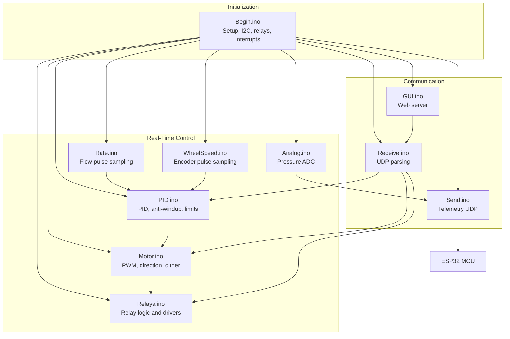
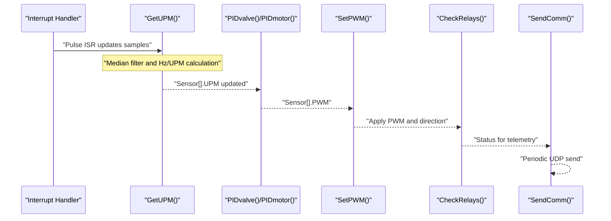
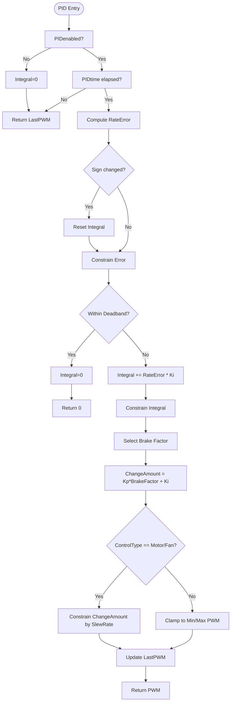
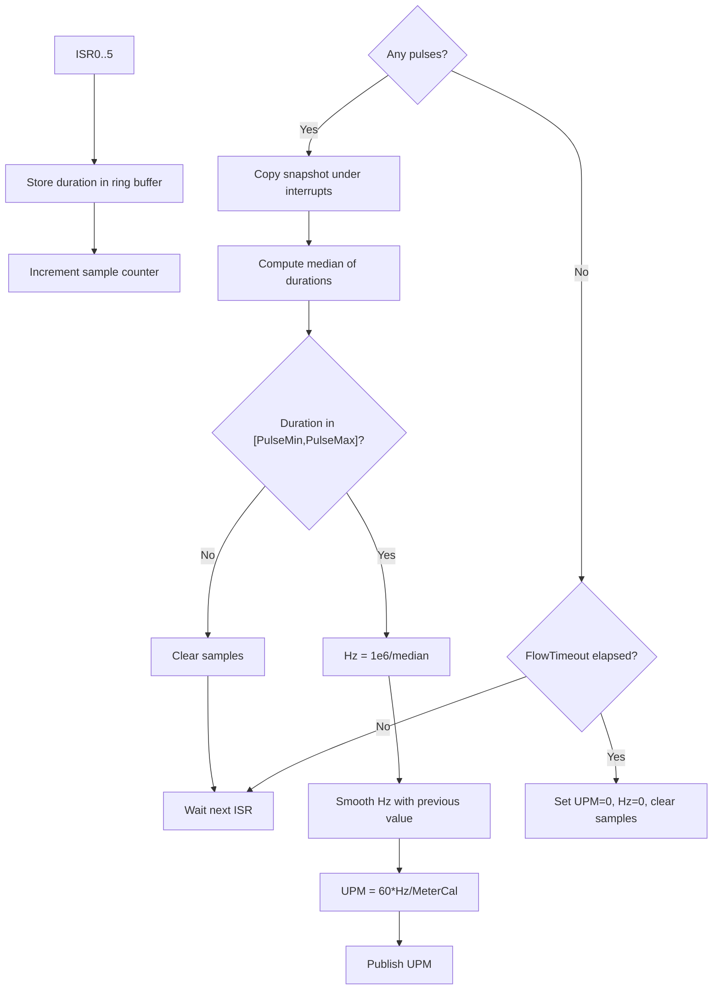
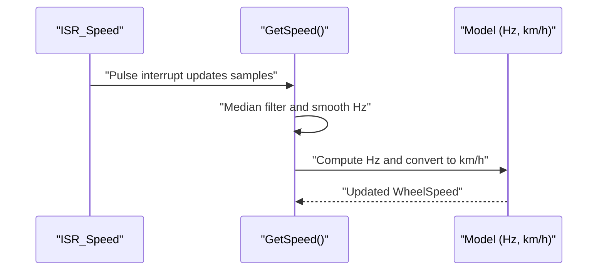
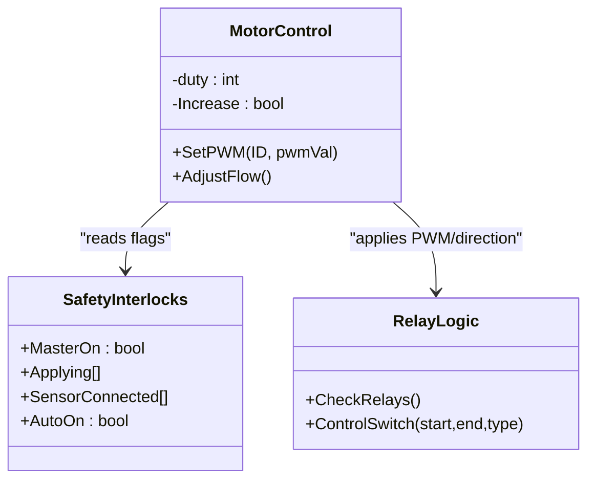
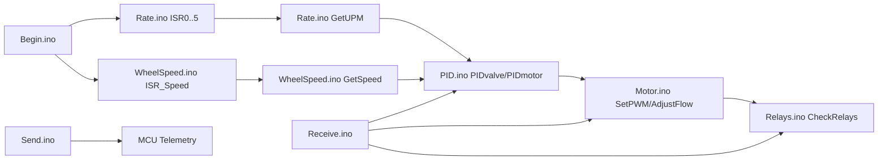

# Control System

<cite>
**Referenced Files in This Document**
- [RC_ESP32.ino](file://RC_ESP32/RC_ESP32.ino)
- [Begin.ino](file://RC_ESP32/Begin.ino)
- [PID.ino](file://RC_ESP32/PID.ino)
- [Rate.ino](file://RC_ESP32/Rate.ino)
- [WheelSpeed.ino](file://RC_ESP32/WheelSpeed.ino)
- [Motor.ino](file://RC_ESP32/Motor.ino)
- [Analog.ino](file://RC_ESP32/Analog.ino)
- [Receive.ino](file://RC_ESP32/Receive.ino)
- [Send.ino](file://RC_ESP32/Send.ino)
- [Relays.ino](file://RC_ESP32/Relays.ino)
- [GUI.ino](file://RC_ESP32/GUI.ino)
- [PCA95x5_RC.h](file://RC_ESP32/PCA95x5_RC.h)
</cite>

## Table of Contents
1. [Introduction](#introduction)
2. [Project Structure](#project-structure)
3. [Core Components](#core-components)
4. [Architecture Overview](#architecture-overview)
5. [Detailed Component Analysis](#detailed-component-analysis)
6. [Dependency Analysis](#dependency-analysis)
7. [Performance Considerations](#performance-considerations)
8. [Troubleshooting Guide](#troubleshooting-guide)
9. [Conclusion](#conclusion)
10. [Appendices](#appendices)

## Introduction
This document describes the ESP32-based Rate Control implementation used in agricultural applications. It covers the PID control algorithm, rate monitoring with ±1% accuracy requirements, motor control logic, torque management, safety interlocks, wheel speed detection via encoder signals, and control parameter configuration and tuning. It also documents mathematical models, real-time performance characteristics, and calibration/validation procedures tailored for field operations.

## Project Structure
The system is organized around a modular Arduino-style firmware with distinct functional areas:
- Initialization and hardware setup
- Real-time control loops (rate sensing, PID, motor control)
- Communication (UDP over Ethernet and Wi-Fi)
- Sensor fusion (flow and wheel speed)
- Actuator control (relays and motor drivers)
- Web interface for configuration and diagnostics

**Diagram sources**
- [Begin.ino:1-769](file://RC_ESP32/Begin.ino#L1-L769)
- [Rate.ino:1-106](file://RC_ESP32/Rate.ino#L1-L106)
- [WheelSpeed.ino:1-71](file://RC_ESP32/WheelSpeed.ino#L1-L71)
- [PID.ino:1-232](file://RC_ESP32/PID.ino#L1-L232)
- [Motor.ino:1-76](file://RC_ESP32/Motor.ino#L1-L76)
- [Relays.ino:1-282](file://RC_ESP32/Relays.ino#L1-L282)
- [Analog.ino:1-70](file://RC_ESP32/Analog.ino#L1-L70)
- [Receive.ino:1-346](file://RC_ESP32/Receive.ino#L1-L346)
- [Send.ino:1-195](file://RC_ESP32/Send.ino#L1-L195)
- [GUI.ino:1-104](file://RC_ESP32/GUI.ino#L1-L104)

**Section sources**
- [RC_ESP32.ino:250-280](file://RC_ESP32/RC_ESP32.ino#L250-L280)
- [Begin.ino:123-167](file://RC_ESP32/Begin.ino#L123-L167)

## Core Components
- Control loop period: 50 ms; telemetry send period: 200 ms.
- Sensors: Up to six independent channels with configurable flow pins and direction pins.
- Control types: Standard valve, combo close, motor/fan, timed combo.
- Anti-windup: Integral sum constrained and reset on sign change across zero error.
- Safety interlocks: MasterOn flag, Applying logic, relay power/inverted states, timeout-based resets.

Key runtime flags and arrays:
- PIDenabled[], Applying[], SensorConnected[] determine control applicability.
- Loop timing and send timing are managed by millisecond counters.

**Section sources**
- [RC_ESP32.ino:179-182](file://RC_ESP32/RC_ESP32.ino#L179-L182)
- [RC_ESP32.ino:265-270](file://RC_ESP32/RC_ESP32.ino#L265-L270)
- [PID.ino:25-67](file://RC_ESP32/PID.ino#L25-L67)

## Architecture Overview
The control architecture follows a closed-loop structure:
- Interrupt-driven pulse counting for flow and wheel speed
- Periodic loop updates for rate estimation and PID computation
- Actuation via PWM/direction control and relay logic
- Telemetry and configuration via UDP and web interface

**Diagram sources**
- [Rate.ino:14-84](file://RC_ESP32/Rate.ino#L14-L84)
- [PID.ino:69-178](file://RC_ESP32/PID.ino#L69-L178)
- [Motor.ino:31-60](file://RC_ESP32/Motor.ino#L31-L60)
- [Relays.ino:11-69](file://RC_ESP32/Relays.ino#L11-L69)
- [Send.ino:1-92](file://RC_ESP32/Send.ino#L1-L92)

## Detailed Component Analysis

### PID Control Algorithm
The PID computes adjustments based on the error between target and measured UPM. It supports:
- Proportional and integral action with anti-windup
- Deadband to avoid oscillation near setpoint
- Variable brake factor depending on error magnitude
- Slew-rate limiting for motor control
- Slow-adjust percentage for coarse regions

Mathematical model summary:
- Error: RateError = TargetUPM − UPM
- Sign-aware integral reset on zero-crossing
- Deadband threshold: |RateError| > Deadband × TargetUPM
- Integral constrained to ±MaxIntegral
- Brake factor selection based on BrakePoint percentage
- Change amount computed from proportional and integral terms
- Motor control applies slew-rate limiting and bounds

**Diagram sources**
- [PID.ino:69-178](file://RC_ESP32/PID.ino#L69-L178)

**Section sources**
- [PID.ino:69-178](file://RC_ESP32/PID.ino#L69-L178)

### Rate Monitoring and Sensor Integration
- Flow pulses captured via dedicated ISRs per channel.
- Pulse durations filtered against PulseMin/PulseMax thresholds.
- Median filter over PulseSampleSize samples for robustness.
- UPM calculation: Hz = 1,000,000 / median_period; UPM = 60 × Hz / MeterCal.
- Timeout-based zeroing of UPM/HZ when no pulses detected.

Accuracy targets:
- ±1% accuracy requirement for rate monitoring is achieved through:
  - Median filtering to reject outliers
  - Threshold gating to exclude noise-induced pulses
  - Exponential smoothing of Hz for stability

**Diagram sources**
- [Rate.ino:14-84](file://RC_ESP32/Rate.ino#L14-L84)

**Section sources**
- [Rate.ino:31-74](file://RC_ESP32/Rate.ino#L31-L74)

### Wheel Speed Detection and Feedback
- Dedicated ISR captures encoder pulses on a separate pin.
- Median filtering and exponential smoothing produce stable Hz and km/h.
- Wheel speed and cumulative counts are resettable via commands.
- Wheel calibration constant converts Hz to km/h.

**Diagram sources**
- [WheelSpeed.ino:15-71](file://RC_ESP32/WheelSpeed.ino#L15-L71)

**Section sources**
- [WheelSpeed.ino:31-71](file://RC_ESP32/WheelSpeed.ino#L31-L71)

### Motor Control Logic, Torque Management, and Safety Interlocks
- PWM generation uses LEDC channels with configurable bits and frequency.
- Direction controlled via IN1/IN2 pins; inversion handled by configuration.
- Dithering applied for 8-bit PWM to improve low-speed resolution.
- Safety interlocks:
  - MasterOn flag gates actuation
  - Applying logic considers MasterOn and whether AutoOn or manual setpoints are active
  - Timeout-based clearing of samples and zeroing of UPM/HZ when disconnected
  - Relay logic restores power/inverted relays when communication is lost

**Diagram sources**
- [Motor.ino:31-60](file://RC_ESP32/Motor.ino#L31-L60)
- [RC_ESP32.ino:265-270](file://RC_ESP32/RC_ESP32.ino#L265-L270)
- [Relays.ino:11-69](file://RC_ESP32/Relays.ino#L11-L69)

**Section sources**
- [Motor.ino:2-29](file://RC_ESP32/Motor.ino#L2-L29)
- [RC_ESP32.ino:265-270](file://RC_ESP32/RC_ESP32.ino#L265-L270)
- [Relays.ino:11-69](file://RC_ESP32/Relays.ino#L11-L69)

### Control Parameter Configuration and Tuning Procedures
Parameters are configured via UDP and persisted to EEPROM:
- Control settings: MaxPWM, MinPWM, Kp, Ki, Deadband, BrakePoint, PIDslowAdjust, SlewRate, MaxIntegral, TimedMinStart, TimedAdjust, TimedPause, PIDtime, PulseMin, PulseMax, PulseSampleSize.
- Module configuration: SensorCount, InvertRelay, InvertFlow, WorkPin, Is3Wire, ADS1115Enabled, PressurePin, WheelSpeedPin, WheelCal.
- Defaults loaded at startup if stored data is invalid.

Tuning guidelines:
- Start with Ki = 0; increase Kp until response is adequate; introduce Ki gradually to eliminate offset; set Deadband to reduce oscillation near setpoint.
- Use BrakePoint and PIDslowAdjust to shape transient behavior; SlewRate limits motor acceleration.
- Verify ±1% accuracy by comparing measured UPM against known standards; adjust MeterCal accordingly.

**Section sources**
- [Receive.ino:136-220](file://RC_ESP32/Receive.ino#L136-L220)
- [Begin.ino:564-619](file://RC_ESP32/Begin.ino#L564-L619)
- [Send.ino:27-92](file://RC_ESP32/Send.ino#L27-L92)

### Fault Detection and Protection Mechanisms
- Communication timeouts: UPM/HZ cleared after FlowTimeout; samples reset.
- Hardware presence checks: I2C devices probed during setup; fallback behavior when absent.
- Network resilience: Automatic AP mode fallback after repeated STA disconnects.
- Safety defaults: On loss of communication, power and inverted relays are restored to maintain safe valve states.

**Section sources**
- [Rate.ino:60-72](file://RC_ESP32/Rate.ino#L60-L72)
- [Begin.ino:58-85](file://RC_ESP32/Begin.ino#L58-L85)
- [RC_ESP32.ino:227-244](file://RC_ESP32/RC_ESP32.ino#L227-L244)
- [Relays.ino:51-57](file://RC_ESP32/Relays.ino#L51-L57)

### Mathematical Models and Control Equations
- Rate estimation:
  - hz = 1,000,000 / median_pulse_duration
  - UPM = 60 × hz / MeterCal
- PID control:
  - RateError = TargetUPM − UPM
  - Integral += RateError × Ki; clamp to ±MaxIntegral
  - If |RateError| > Deadband × TargetUPM:
    - ChangeAmount = Kp × BrakeFactor + Integral
    - For motors: constrain ChangeAmount by SlewRate and add to LastPWM; clamp to [MinPWM, MaxPWM]
    - For valves: clamp ChangeAmount to [MinPWM, MaxPWM]
  - Else: Integral = 0; output = 0
- Wheel speed:
  - Hz = 0.8 × Hz + 0.2 × (1e6 / median); km/h = Hz × 3600 / WheelCal

**Section sources**
- [Rate.ino:50-57](file://RC_ESP32/Rate.ino#L50-L57)
- [PID.ino:90-117](file://RC_ESP32/PID.ino#L90-L117)
- [PID.ino:149-170](file://RC_ESP32/PID.ino#L149-L170)
- [WheelSpeed.ino:50-54](file://RC_ESP32/WheelSpeed.ino#L50-L54)

## Dependency Analysis
- Initialization depends on I2C devices, Ethernet/Wi-Fi, and interrupt setup.
- Control loop depends on ISR-provided samples and configuration parameters.
- Actuation depends on control outputs and relay driver implementations.

**Diagram sources**
- [Begin.ino:123-167](file://RC_ESP32/Begin.ino#L123-L167)
- [Rate.ino:14-84](file://RC_ESP32/Rate.ino#L14-L84)
- [WheelSpeed.ino:15-71](file://RC_ESP32/WheelSpeed.ino#L15-L71)
- [PID.ino:69-178](file://RC_ESP32/PID.ino#L69-L178)
- [Motor.ino:31-60](file://RC_ESP32/Motor.ino#L31-L60)
- [Relays.ino:11-69](file://RC_ESP32/Relays.ino#L11-L69)
- [Receive.ino:29-343](file://RC_ESP32/Receive.ino#L29-L343)
- [Send.ino:1-92](file://RC_ESP32/Send.ino#L1-L92)

**Section sources**
- [Begin.ino:123-167](file://RC_ESP32/Begin.ino#L123-L167)
- [PID.ino:25-67](file://RC_ESP32/PID.ino#L25-L67)

## Performance Considerations
- Loop cadence: 50 ms; PID executed every PIDtime; telemetry every 200 ms.
- ISR latency: Minimal; samples captured in IRAM buffers.
- Filtering: Median filter reduces noise; exponential smoothing stabilizes estimates.
- PWM resolution: 12-bit on ESP32; 8-bit with dithering on legacy platforms.
- Network reliability: Dual-path UDP (Ethernet and Wi-Fi) improves robustness.

[No sources needed since this section provides general guidance]

## Troubleshooting Guide
Common issues and remedies:
- No flow pulses detected:
  - Verify wiring and pull-up resistors; confirm ISR attached to FlowPin.
  - Check PulseMin/PulseMax and MeterCal; ensure pulses fall within thresholds.
- Oscillations near setpoint:
  - Increase Deadband; reduce Kp/Ki; verify anti-windup is active.
- Motor not responding:
  - Confirm MasterOn/Applying flags; check relay logic and driver wiring.
  - Verify PWM direction inversion setting.
- Telemetry gaps:
  - Check Ethernet/Wi-Fi connectivity; inspect CRC and packet lengths.
- Wheel speed not updating:
  - Ensure dedicated WheelSpeedPin differs from flow pins; verify ISR attached.

**Section sources**
- [Rate.ino:60-72](file://RC_ESP32/Rate.ino#L60-L72)
- [PID.ino:90-117](file://RC_ESP32/PID.ino#L90-L117)
- [Motor.ino:31-60](file://RC_ESP32/Motor.ino#L31-L60)
- [Relays.ino:51-57](file://RC_ESP32/Relays.ino#L51-L57)
- [Send.ino:1-92](file://RC_ESP32/Send.ino#L1-L92)

## Conclusion
The ESP32 Rate Control implementation provides robust, real-time rate regulation with configurable PID parameters, anti-windup protection, and safety interlocks. The combination of median filtering, threshold gating, and exponential smoothing achieves the required ±1% accuracy for agricultural applications. The modular design supports multiple actuation types and communication paths, enabling reliable operation in field conditions.

[No sources needed since this section summarizes without analyzing specific files]

## Appendices

### Control Parameter Reference
- Control settings (per sensor):
  - MaxPWM, MinPWM: Output bounds
  - Kp, Ki: Proportional/integral gains
  - Deadband: Error band for no adjustment
  - BrakePoint: Error % for brake factor transition
  - PIDslowAdjust: Slow adjustment percentage
  - SlewRate: Max PWM change per loop (motor)
  - MaxIntegral: Max integral contribution per loop
  - TimedMinStart, TimedAdjust, TimedPause: Timed combo parameters
  - PIDtime: Control execution interval
  - PulseMin, PulseMax, PulseSampleSize: Flow sampling window and sample size
- Module settings:
  - SensorCount, InvertRelay, InvertFlow, WorkPin, Is3Wire, ADS1115Enabled, PressurePin, WheelSpeedPin, WheelCal

**Section sources**
- [Receive.ino:136-220](file://RC_ESP32/Receive.ino#L136-L220)
- [Begin.ino:564-619](file://RC_ESP32/Begin.ino#L564-L619)

### Calibration and Validation Methods
- Flow meter calibration:
  - Measure actual flow and compute MeterCal = 60 × Hz / UPM
  - Validate across multiple UPM values to ensure linearity
- Wheel encoder calibration:
  - Drive known distance and compare reported km/h with GPS or wheel circumference
  - Adjust WheelCal until reported speed matches known distance/time
- Accuracy verification:
  - Compare UPM readings against calibrated standards; ensure within ±1%
  - Validate under varying conditions (flow, pressure, temperature)

**Section sources**
- [Rate.ino:50-57](file://RC_ESP32/Rate.ino#L50-L57)
- [WheelSpeed.ino:50-54](file://RC_ESP32/WheelSpeed.ino#L50-L54)