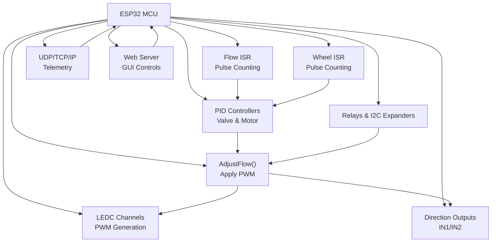
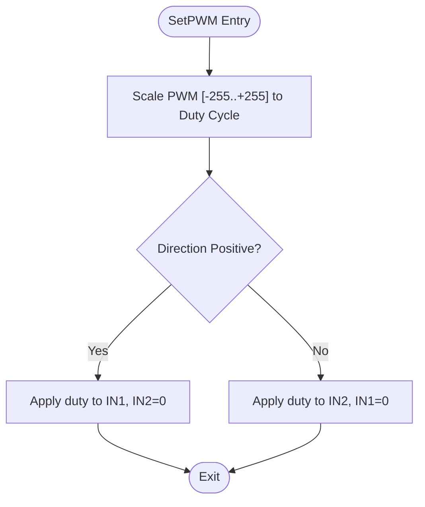
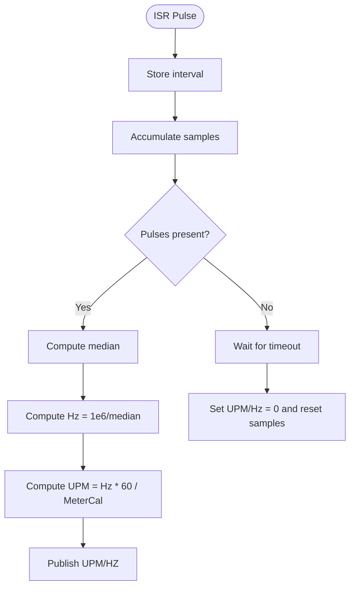
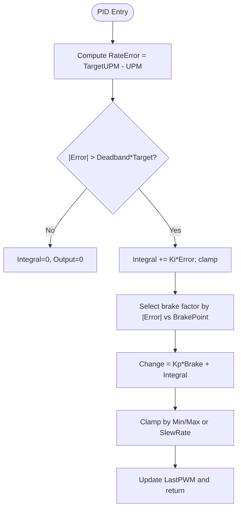
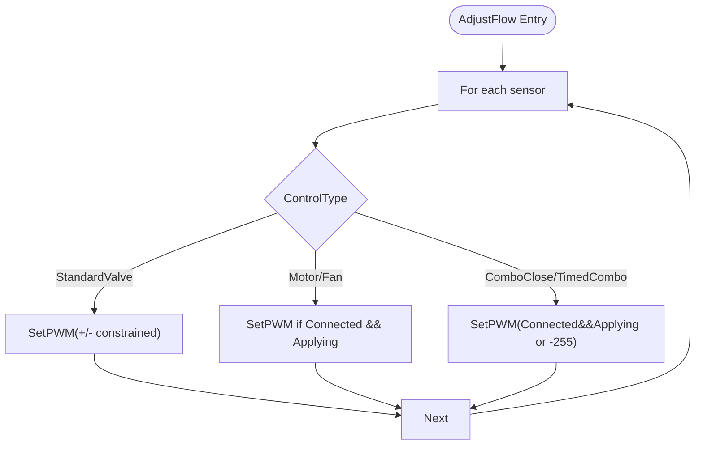
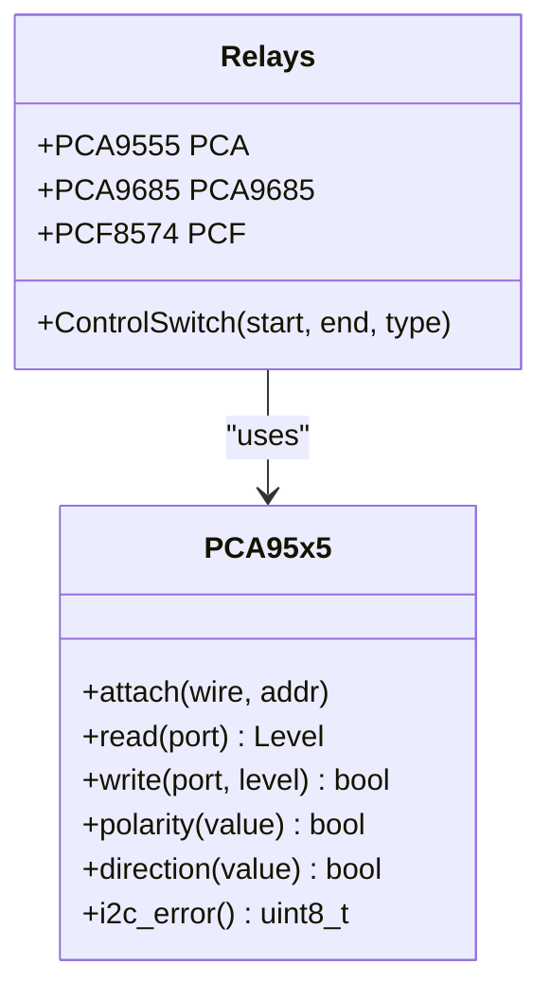
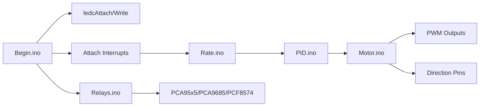

# Motor Control Logic

<cite>
**Referenced Files in This Document**
- [RC_ESP32.ino](file://RC_ESP32/RC_ESP32.ino)
- [Begin.ino](file://RC_ESP32/Begin.ino)
- [Motor.ino](file://RC_ESP32/Motor.ino)
- [PID.ino](file://RC_ESP32/PID.ino)
- [Rate.ino](file://RC_ESP32/Rate.ino)
- [WheelSpeed.ino](file://RC_ESP32/WheelSpeed.ino)
- [PCA95x5_RC.h](file://RC_ESP32/PCA95x5_RC.h)
- [Relays.ino](file://RC_ESP32/Relays.ino)
- [Analog.ino](file://RC_ESP32/Analog.ino)
- [GUI.ino](file://RC_ESP32/GUI.ino)
- [PgNetwork.ino](file://RC_ESP32/PgNetwork.ino)
- [PgStart.ino](file://RC_ESP32/PgStart.ino)
- [PgSwitches.ino](file://RC_ESP32/PgSwitches.ino)
- [PgUpdate.ino](file://RC_ESP32/PgUpdate.ino)
- [Send.ino](file://RC_ESP32/Send.ino)
- [Receive.ino](file://RC_ESP32/Receive.ino)
- [ETHClass.h](file://RC_ESP32/ETHClass.h)
- [ETHClass.cpp](file://RC_ESP32/ETHClass.cpp)
- [WT5500.ino](file://RC_ESP32/WT5500.ino)
- [FORK_CHANGES.md](file://FORK_CHANGES.md)
</cite>

## Table of Contents
1. [Introduction](#introduction)
2. [Project Structure](#project-structure)
3. [Core Components](#core-components)
4. [Architecture Overview](#architecture-overview)
5. [Detailed Component Analysis](#detailed-component-analysis)
6. [Dependency Analysis](#dependency-analysis)
7. [Performance Considerations](#performance-considerations)
8. [Troubleshooting Guide](#troubleshooting-guide)
9. [Conclusion](#conclusion)
10. [Appendices](#appendices)

## Introduction
This document explains the motor control logic and speed regulation implementation for the ESP32 Rate module. It covers PWM generation, direction control, closed-loop PID regulation, speed feedback from tachometer sensors, and supporting subsystems such as relays, I2C expanders, and telemetry. It also documents safety-related logic present in the codebase, including flow and motor disable flags, and outlines areas where thermal protection and current monitoring could be integrated.

## Project Structure
The motor control logic is implemented across several modules:
- Initialization and configuration: setup of PWM channels, interrupts, relays, and I2C peripherals
- Feedback acquisition: pulse counting and median filtering for flow and wheel speed
- Control computation: PID logic for valves and motors
- Actuation: PWM output generation and direction control
- Telemetry and diagnostics: UDP communication, web interface, and optional analog sensing



**Diagram sources**
- [Begin.ino:124-160](file://RC_ESP32/Begin.ino#L124-L160)
- [Rate.ino:14-29](file://RC_ESP32/Rate.ino#L14-L29)
- [WheelSpeed.ino:15-29](file://RC_ESP32/WheelSpeed.ino#L15-L29)
- [PID.ino:25-67](file://RC_ESP32/PID.ino#L25-L67)
- [Motor.ino:2,31-60:2-60](file://RC_ESP32/Motor.ino#L2-L60)
- [Relays.ino:55-115](file://RC_ESP32/Relays.ino#L55-L115)
- [RC_ESP32.ino:255-280](file://RC_ESP32/RC_ESP32.ino#L255-L280)

**Section sources**
- [RC_ESP32.ino:250-280](file://RC_ESP32/RC_ESP32.ino#L255-L280)
- [Begin.ino:54-160](file://RC_ESP32/Begin.ino#L54-L160)

## Core Components
- Initialization and pin configuration: PWM channels initialized with frequency and bit resolution; interrupt handlers attached to flow pins; optional wheel speed ISR configured
- Pulse acquisition and filtering: ISR-based accumulation of pulse intervals; median filter selection for robustness; conversion to Hz and UPM
- PID control: separate logic for valves and motors; includes deadband, integral anti-windup, brake-point scaling, and slew-rate limiting
- PWM actuation: direction control via IN1/IN2; PWM duty computed from normalized 0–255 scale; optional dithering for 8-bit PWM on non-ESP32 targets
- Safety and interlocks: flow/motor disable flags and related logic; relay control via onboard or I2C expanders

**Section sources**
- [Begin.ino:124-160](file://RC_ESP32/Begin.ino#L124-L160)
- [Rate.ino:14-74](file://RC_ESP32/Rate.ino#L14-L74)
- [PID.ino:25-178](file://RC_ESP32/PID.ino#L25-L178)
- [Motor.ino:2,31-76:2-76](file://RC_ESP32/Motor.ino#L2-L76)
- [Relays.ino:55-115](file://RC_ESP32/Relays.ino#L55-L115)

## Architecture Overview
The control loop runs at approximately 20 Hz. Each iteration:
- Determines operational state (master on, auto/manual, target UPM)
- Updates connectivity flags and enables/disables PID
- Reads and filters pulse counts to compute UPM and Hz
- Computes PWM using PID for valves/motors or applies manual setting
- Applies PWM and direction to actuators
- Sends telemetry and handles web/network events

```mermaid
sequenceDiagram
participant Loop as "Main Loop"
participant State as "State Flags"
participant ISR as "ISRs"
participant PID as "PID Controllers"
participant PWM as "AdjustFlow/SetPWM"
participant Net as "Telemetry"
Loop->>State : Compute flags (MasterOn, AutoOn, PIDenabled, Applying)
Loop->>ISR : GetUPM(), GetSpeed()
ISR-->>Loop : UPM, Hz, pulses
Loop->>PID : SetPWM() -> PIDvalve()/PIDmotor()/TimedCombo()
PID-->>Loop : PWM command (-255..+255)
Loop->>PWM : AdjustFlow() -> SetPWM()
PWM-->>Loop : PWM duty, direction applied
Loop->>Net : SendComm()
```

**Diagram sources**
- [RC_ESP32.ino:255-280](file://RC_ESP32/RC_ESP32.ino#L255-L280)
- [Rate.ino:31-74](file://RC_ESP32/Rate.ino#L31-L74)
- [PID.ino:25-67](file://RC_ESP32/PID.ino#L25-L67)
- [Motor.ino:2,31-60:2-60](file://RC_ESP32/Motor.ino#L2-L60)
- [Send.ino](file://RC_ESP32/Send.ino)

**Section sources**
- [RC_ESP32.ino:179-182](file://RC_ESP32/RC_ESP32.ino#L179-L182)
- [RC_ESP32.ino:255-280](file://RC_ESP32/RC_ESP32.ino#L255-L280)

## Detailed Component Analysis

### PWM Generation and Direction Control
- PWM channels are attached with configurable frequency and bit depth; duty cycles are derived from normalized 0–255 PWM commands
- Direction is determined by applying duty to IN1 or IN2; inversion logic accounts for module configuration
- Optional dithering is applied for 8-bit PWM on platforms without native higher-resolution timers



**Diagram sources**
- [Motor.ino:31-60](file://RC_ESP32/Motor.ino#L31-L60)

**Section sources**
- [Motor.ino:2,31-76:2-76](file://RC_ESP32/Motor.ino#L2-L76)
- [Begin.ino:152-158](file://RC_ESP32/Begin.ino#L152-L158)

### Speed Feedback and Pulse Processing
- Interrupt service routines capture pulse intervals and maintain a sliding window of samples
- Median calculation reduces noise and outliers; filtered period is converted to Hz and UPM using calibration constants
- Timeout logic resets UPM/Hz to zero when no pulses are detected for a grace period



**Diagram sources**
- [Rate.ino:14-74](file://RC_ESP32/Rate.ino#L14-L74)
- [WheelSpeed.ino:15-70](file://RC_ESP32/WheelSpeed.ino#L15-L70)

**Section sources**
- [Rate.ino:14-74](file://RC_ESP32/Rate.ino#L14-L74)
- [WheelSpeed.ino:15-70](file://RC_ESP32/WheelSpeed.ino#L15-L70)

### PID Control for Valves and Motors
- Valve PID: uses error scaled by target UPM, deadband, integral anti-windup, and brake-point scaling; outputs signed PWM magnitude respecting min/max limits
- Motor PID: similar structure but includes slew-rate limiting on delta PWM and prevents integral windup across zero-crossing
- Timed combo logic alternates between adjustment and pause windows; supports manual override



**Diagram sources**
- [PID.ino:69-126](file://RC_ESP32/PID.ino#L69-L126)
- [PID.ino:128-178](file://RC_ESP32/PID.ino#L128-L178)

**Section sources**
- [PID.ino:1-232](file://RC_ESP32/PID.ino#L1-L232)

### Actuator Application and Safety Interlocks
- AdjustFlow selects control path based on sensor control type and connection/applied flags
- Motors and fans receive PWM only when connected and under application; valves operate independently
- A “combo” close mode applies fixed reverse PWM during certain states



**Diagram sources**
- [Motor.ino:2,31-29:2-29](file://RC_ESP32/Motor.ino#L2-L29)

**Section sources**
- [Motor.ino:2,31-29:2-29](file://RC_ESP32/Motor.ino#L2-L29)

### Relay Control and I2C Expanders
- Relays are controlled via onboard GPIOs or I2C expanders (PCA9555, MCP23017, PCA9685, PCF8574)
- The system initializes and configures the selected controller type, then writes relay states accordingly



**Diagram sources**
- [PCA95x5_RC.h:55-178](file://RC_ESP32/PCA95x5_RC.h#L55-L178)
- [Relays.ino:71-115](file://RC_ESP32/Relays.ino#L71-L115)

**Section sources**
- [Relays.ino:55-115](file://RC_ESP32/Relays.ino#L55-L115)
- [PCA95x5_RC.h:1-178](file://RC_ESP32/PCA95x5_RC.h#L1-L178)

### Thermal Protection and Current Monitoring
- The codebase includes references to temperature sensor initialization and current measurement utilities in the old/forked branch notes
- These features are not present in the current ESP32 Rate module files; they are documented here for future integration

**Section sources**
- [FORK_CHANGES.md:406-431](file://FORK_CHANGES.md#L406-L431)

## Dependency Analysis
Key dependencies and interactions:
- Initialization depends on platform-specific PWM resolution and frequency
- ISR-driven pulse sampling depends on accurate timing and pin assignments
- PID relies on UPM measurements and control parameters stored per sensor
- Actuation depends on direction pins and PWM channels
- Relays depend on I2C expanders or onboard GPIOs



**Diagram sources**
- [Begin.ino:124-160](file://RC_ESP32/Begin.ino#L124-L160)
- [Rate.ino:14-74](file://RC_ESP32/Rate.ino#L14-L74)
- [PID.ino:25-67](file://RC_ESP32/PID.ino#L25-L67)
- [Motor.ino:2,31-60:2-60](file://RC_ESP32/Motor.ino#L2-L60)
- [Relays.ino:55-115](file://RC_ESP32/Relays.ino#L55-L115)
- [PCA95x5_RC.h:55-178](file://RC_ESP32/PCA95x5_RC.h#L55-L178)

**Section sources**
- [RC_ESP32.ino:255-280](file://RC_ESP32/RC_ESP32.ino#L255-L280)
- [Begin.ino:124-160](file://RC_ESP32/Begin.ino#L124-L160)

## Performance Considerations
- Loop cadence: approximately 20 Hz (50 ms), allowing sufficient time for ISR processing and PID updates
- ISR efficiency: minimal work in ISR; most filtering and computations occur in main loop
- PWM resolution: configurable; higher resolution improves fine control and reduces audible noise
- Median filtering: sample size trade-off between responsiveness and noise rejection
- Network overhead: UDP telemetry adds latency; keep payload sizes reasonable

[No sources needed since this section provides general guidance]

## Troubleshooting Guide
Common issues and diagnostics:
- No flow readings: verify flow pin wiring, ISR attachment, and meter calibration; confirm pulse window constraints
- Erratic or zero UPM: check median sample size and timeout thresholds; ensure adequate pulse density
- Motor does not move: confirm control type is Motor/Fan, sensor is connected and applying, and direction logic is correct
- Relay control failures: verify I2C address detection and expander configuration; check polarity and direction settings
- Telemetry connectivity: validate network configuration and destination IPs; monitor link status and retries

Operational controls and diagnostics:
- Web interface exposes control pages and toggles for operational modes
- Network configuration supports AP and station modes with credentials
- Telemetry messages include sensor states and periodic updates

**Section sources**
- [GUI.ino](file://RC_ESP32/GUI.ino)
- [PgNetwork.ino](file://RC_ESP32/PgNetwork.ino)
- [PgStart.ino](file://RC_ESP32/PgStart.ino)
- [PgSwitches.ino](file://RC_ESP32/PgSwitches.ino)
- [PgUpdate.ino](file://RC_ESP32/PgUpdate.ino)
- [Send.ino](file://RC_ESP32/Send.ino)
- [Receive.ino](file://RC_ESP32/Receive.ino)
- [ETHClass.h](file://RC_ESP32/ETHClass.h)
- [ETHClass.cpp](file://RC_ESP32/ETHClass.cpp)
- [WT5500.ino](file://RC_ESP32/WT5500.ino)

## Conclusion
The ESP32 Rate module implements a robust, modular motor control system centered on ISR-based pulse acquisition, configurable PID control, and clean PWM/direction actuation. The design emphasizes reliability through median filtering, deadbands, and anti-windup strategies. While explicit thermal and current protection are not present in the current codebase, the architecture readily accommodates such enhancements via analog sensing and safety flags.

[No sources needed since this section summarizes without analyzing specific files]

## Appendices

### Safety Interlocks and Fault Response
- Flow and motor disable flags exist conceptually in the forked branch notes and can be integrated to enforce safe operation conditions
- Emergency stop-like behavior can be modeled by forcing PWM to zero and disabling control when faults are detected

**Section sources**
- [FORK_CHANGES.md:421-427](file://FORK_CHANGES.md#L421-L427)

### Torque Management and Current Limiting
- Not implemented in current files; can be added by reading current sensor values and clamping PWM based on measured current

**Section sources**
- [Analog.ino](file://RC_ESP32/Analog.ino)
- [FORK_CHANGES.md:414](file://FORK_CHANGES.md#L414)

### Thermal Protection Mechanisms
- Temperature sensor initialization is noted in forked branch; can be integrated to shut down or derate operation above thresholds

**Section sources**
- [FORK_CHANGES.md:406](file://FORK_CHANGES.md#L406)

### Motor Characterization and Performance Mapping
- Characterization requires establishing meter calibration constant and collecting UPM vs PWM curves under load
- Use the web interface to set targets and record steady-state UPM readings

**Section sources**
- [Rate.ino:54-57](file://RC_ESP32/Rate.ino#L54-L57)
- [GUI.ino](file://RC_ESP32/GUI.ino)

### Power Management and Efficiency
- Reduce PWM frequency or duty to minimize heating when high torque is not required
- Use brake-point scaling to reduce aggressive corrections at large errors
- Monitor ISR and loop timing to avoid missed pulses and excessive CPU usage

**Section sources**
- [PID.ino:98](file://RC_ESP32/PID.ino#L98)
- [RC_ESP32.ino:179-182](file://RC_ESP32/RC_ESP32.ino#L179-L182)