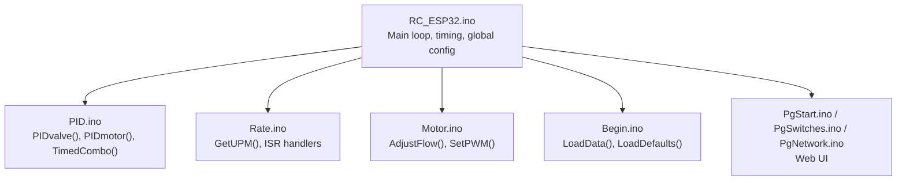
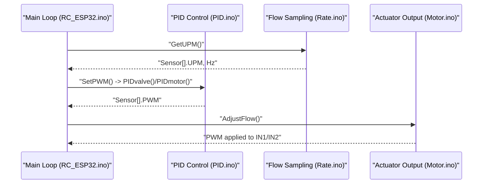
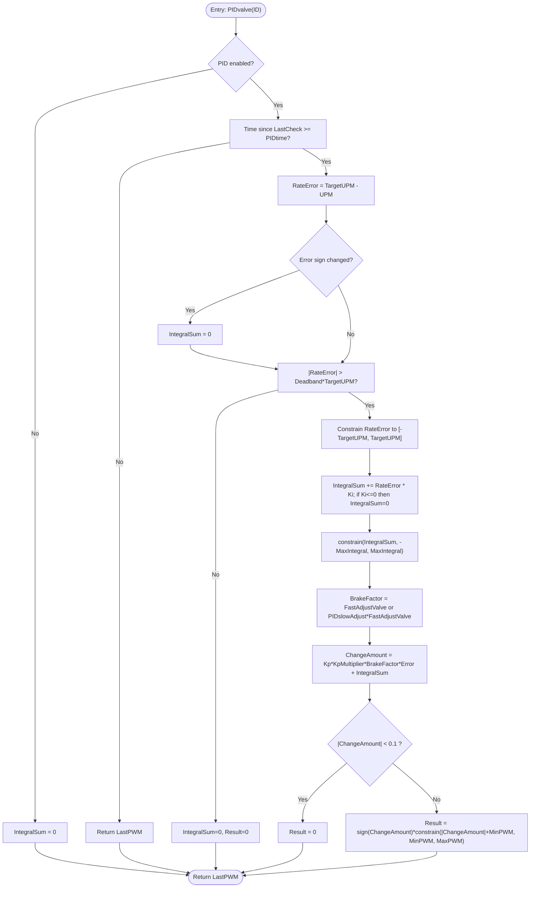
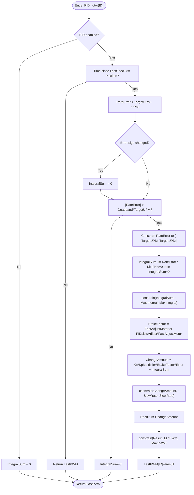
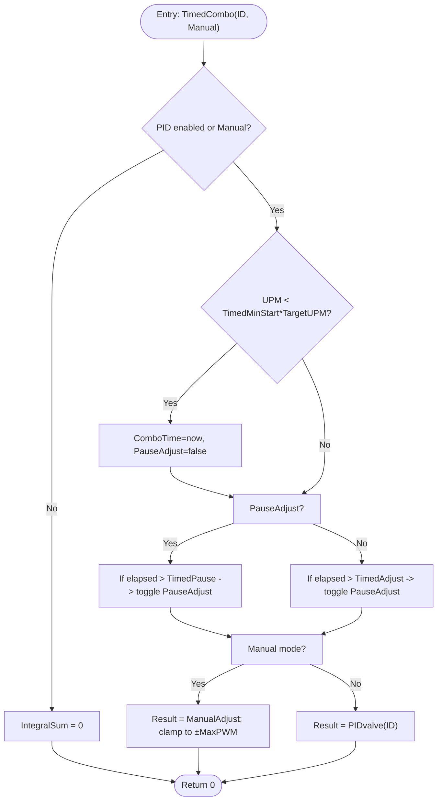
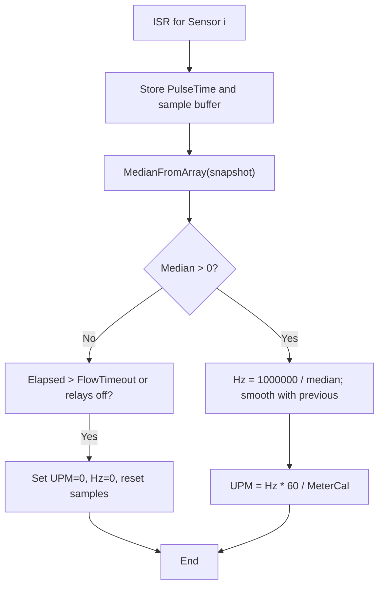
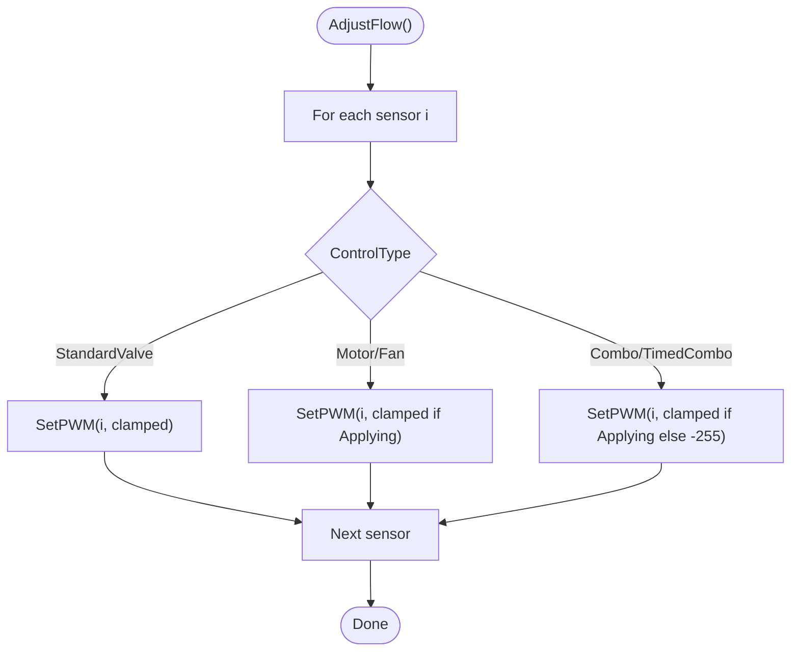
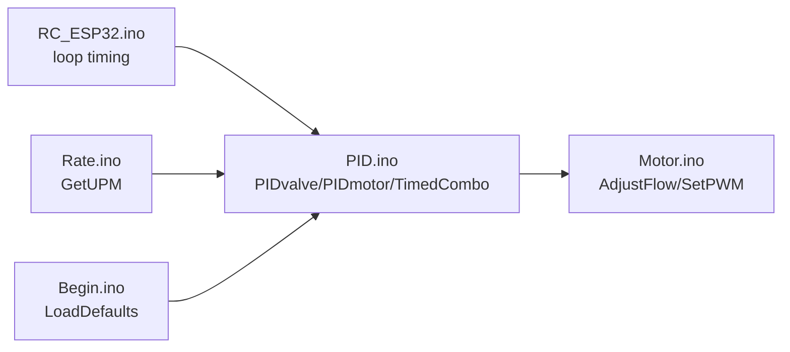

# PID Control Algorithm

<cite>
**Referenced Files in This Document**
- [PID.ino](file://RC_ESP32/PID.ino)
- [Rate.ino](file://RC_ESP32/Rate.ino)
- [RC_ESP32.ino](file://RC_ESP32/RC_ESP32.ino)
- [Begin.ino](file://RC_ESP32/Begin.ino)
- [Motor.ino](file://RC_ESP32/Motor.ino)
- [PgStart.ino](file://RC_ESP32/PgStart.ino)
- [PgSwitches.ino](file://RC_ESP32/PgSwitches.ino)
- [PgNetwork.ino](file://RC_ESP32/PgNetwork.ino)
</cite>

## Table of Contents
1. [Introduction](#introduction)
2. [Project Structure](#project-structure)
3. [Core Components](#core-components)
4. [Architecture Overview](#architecture-overview)
5. [Detailed Component Analysis](#detailed-component-analysis)
6. [Dependency Analysis](#dependency-analysis)
7. [Performance Considerations](#performance-considerations)
8. [Troubleshooting Guide](#troubleshooting-guide)
9. [Conclusion](#conclusion)
10. [Appendices](#appendices)

## Introduction
This document explains the PID control algorithm implementation in the ESP32 Rate Control system. It covers the mathematical foundation of proportional (P), integral (I), and derivative-free (D) control, parameter configuration, anti-windup protection, real-time performance, and practical tuning procedures. The system computes control outputs for valves and motors based on sensed flow rates and target rates, with configurable deadband, brake thresholds, and slew limits.

## Project Structure
The PID control logic is implemented in dedicated modules:
- PID computation and control scheduling
- Flow sensing and UPM calculation
- PWM output application and actuator control
- Web-based configuration and diagnostics pages

**Diagram sources**
- [RC_ESP32.ino:255-280](file://RC_ESP32/RC_ESP32.ino#L255-L280)
- [PID.ino:25-67](file://RC_ESP32/PID.ino#L25-L67)
- [Rate.ino:31-74](file://RC_ESP32/Rate.ino#L31-L74)
- [Motor.ino:2-29](file://RC_ESP32/Motor.ino#L2-L29)
- [Begin.ino:521-619](file://RC_ESP32/Begin.ino#L521-L619)
- [PgStart.ino:1-148](file://RC_ESP32/PgStart.ino#L1-L148)
- [PgSwitches.ino:1-132](file://RC_ESP32/PgSwitches.ino#L1-L132)
- [PgNetwork.ino:1-155](file://RC_ESP32/PgNetwork.ino#L1-L155)

**Section sources**
- [RC_ESP32.ino:179-182](file://RC_ESP32/RC_ESP32.ino#L179-L182)
- [PID.ino:25-67](file://RC_ESP32/PID.ino#L25-L67)
- [Rate.ino:31-74](file://RC_ESP32/Rate.ino#L31-L74)
- [Motor.ino:2-29](file://RC_ESP32/Motor.ino#L2-L29)
- [Begin.ino:521-619](file://RC_ESP32/Begin.ino#L521-L619)

## Core Components
- PIDvalve(): Valve control loop with deadband, integral anti-windup, and variable brake gain.
- PIDmotor(): Motor/fan control loop with integral anti-windup and slew-rate limiting.
- TimedCombo(): Periodic timed combo close mode for rapid shutoff.
- GetUPM(): Interrupt-driven pulse analysis to compute instantaneous UPM and Hz.
- AdjustFlow()/SetPWM(): Apply computed PWM to actuators with direction control and duty scaling.

Key runtime constants and multipliers:
- FastAdjustMotor, FastAdjustValve, KpMultiplier influence control sensitivity and braking behavior.

**Section sources**
- [PID.ino:69-126](file://RC_ESP32/PID.ino#L69-L126)
- [PID.ino:128-178](file://RC_ESP32/PID.ino#L128-L178)
- [PID.ino:180-231](file://RC_ESP32/PID.ino#L180-L231)
- [Rate.ino:31-74](file://RC_ESP32/Rate.ino#L31-L74)
- [Motor.ino:2-29](file://RC_ESP32/Motor.ino#L2-L29)

## Architecture Overview
The control loop runs periodically, driven by the main loop’s timing. Sensors are sampled via interrupts, UPM is computed, PID computes control outputs, and PWM is applied to actuators.

**Diagram sources**
- [RC_ESP32.ino:255-280](file://RC_ESP32/RC_ESP32.ino#L255-L280)
- [PID.ino:25-67](file://RC_ESP32/PID.ino#L25-L67)
- [Rate.ino:31-74](file://RC_ESP32/Rate.ino#L31-L74)
- [Motor.ino:2-29](file://RC_ESP32/Motor.ino#L2-L29)

## Detailed Component Analysis

### PIDvalve() — Valve Control Loop
Mathematical model:
- Error = TargetUPM − UPM
- Anti-windup: IntegralSum is reset on sign change of error to prevent integral windup across zero.
- Deadband: If |Error| ≤ Deadband × TargetUPM, integral is cleared and output is zero.
- Variable brake gain: Above a threshold error percentage, a higher “fast” adjustment factor is used; otherwise a slower factor applies.
- Output composition: Proportional term scaled by KpMultiplier and brake factor, plus integral term; final magnitude constrained to [MinPWM, MaxPWM] with sign preserved.

**Diagram sources**
- [PID.ino:69-126](file://RC_ESP32/PID.ino#L69-L126)

**Section sources**
- [PID.ino:69-126](file://RC_ESP32/PID.ino#L69-L126)

### PIDmotor() — Motor/Fan Control Loop
Mathematical model:
- Same error and anti-windup logic as valve.
- Integral accumulation and anti-windup apply.
- Variable brake gain selection.
- Output composition: ChangeAmount = Kp×KpMultiplier×BrakeFactor×Error + IntegralSum.
- Slew-rate limiting: ChangeAmount constrained to ±SlewRate.
- Incremental update: Result = Result + ChangeAmount, then clamp to [MinPWM, MaxPWM].

**Diagram sources**
- [PID.ino:128-178](file://RC_ESP32/PID.ino#L128-L178)

**Section sources**
- [PID.ino:128-178](file://RC_ESP32/PID.ino#L128-L178)

### TimedCombo() — Timed Combo Close Mode
Behavior:
- Alternates between adjustment and pause windows based on TimedAdjust and TimedPause.
- During adjustment window, uses PIDvalve() output if not manual.
- During pause window, holds output state; near very low rates, pauses are skipped to avoid oscillation.

**Diagram sources**
- [PID.ino:180-231](file://RC_ESP32/PID.ino#L180-L231)

**Section sources**
- [PID.ino:180-231](file://RC_ESP32/PID.ino#L180-L231)

### Flow Sensing and UPM Calculation
- Interrupt service routines capture pulse intervals and maintain a sliding-sample median to estimate period.
- UPM and Hz are computed from median period, with smoothing and calibration applied.
- Flow timeout clears readings when no pulses are detected.

**Diagram sources**
- [Rate.ino:14-29](file://RC_ESP32/Rate.ino#L14-L29)
- [Rate.ino:31-74](file://RC_ESP32/Rate.ino#L31-L74)

**Section sources**
- [Rate.ino:14-29](file://RC_ESP32/Rate.ino#L14-L29)
- [Rate.ino:31-74](file://RC_ESP32/Rate.ino#L31-L74)

### PWM Application and Actuator Control
- AdjustFlow selects control type and clamps PWM to [-255, 255].
- SetPWM maps 0–255 to duty resolution based on PWM_BITS, applies inversion logic, and writes to LEDC channels (IN1/IN2) for direction control.
- Dithering is optionally applied for 8-bit PWM to improve low-duty performance.

**Diagram sources**
- [Motor.ino:2-29](file://RC_ESP32/Motor.ino#L2-L29)
- [Motor.ino:31-60](file://RC_ESP32/Motor.ino#L31-L60)

**Section sources**
- [Motor.ino:2-29](file://RC_ESP32/Motor.ino#L2-L29)
- [Motor.ino:31-60](file://RC_ESP32/Motor.ino#L31-L60)

## Dependency Analysis
- PIDvalve()/PIDmotor() depend on Sensor[] configuration (Kp, Ki, Deadband, BrakePoint, PIDslowAdjust, SlewRate, MaxIntegral, PIDtime) and on UPM computed by Rate.ino.
- SetPWM depends on global PWM_BITS and MDL.InvertFlow to invert direction logic.
- Main loop timing (LoopTime) governs periodic execution and indirectly affects PID sampling.

**Diagram sources**
- [RC_ESP32.ino:179-182](file://RC_ESP32/RC_ESP32.ino#L179-L182)
- [PID.ino:69-126](file://RC_ESP32/PID.ino#L69-L126)
- [PID.ino:128-178](file://RC_ESP32/PID.ino#L128-L178)
- [PID.ino:180-231](file://RC_ESP32/PID.ino#L180-L231)
- [Rate.ino:31-74](file://RC_ESP32/Rate.ino#L31-L74)
- [Motor.ino:2-29](file://RC_ESP32/Motor.ino#L2-L29)
- [Begin.ino:564-597](file://RC_ESP32/Begin.ino#L564-L597)

**Section sources**
- [RC_ESP32.ino:179-182](file://RC_ESP32/RC_ESP32.ino#L179-L182)
- [PID.ino:69-126](file://RC_ESP32/PID.ino#L69-L126)
- [PID.ino:128-178](file://RC_ESP32/PID.ino#L128-L178)
- [PID.ino:180-231](file://RC_ESP32/PID.ino#L180-L231)
- [Rate.ino:31-74](file://RC_ESP32/Rate.ino#L31-L74)
- [Motor.ino:2-29](file://RC_ESP32/Motor.ino#L2-L29)
- [Begin.ino:564-597](file://RC_ESP32/Begin.ino#L564-L597)

## Performance Considerations
- Sampling and timing:
  - Main loop runs at approximately 20 Hz (LoopTime = 50 ms).
  - PID executes when PIDtime elapses for each sensor, decoupled from the main loop frequency.
- Computational efficiency:
  - Integer and float arithmetic are kept minimal; median calculation uses insertion sort on small buffers.
  - Duty scaling uses integer conversion with optional dithering for 8-bit PWM.
- Real-time constraints:
  - ISR handlers avoid heavy computation; only store intervals and samples.
  - PWM write occurs in the control loop after PID computation.

[No sources needed since this section provides general guidance]

## Troubleshooting Guide
Common issues and remedies:
- No flow detected:
  - Symptoms: UPM/Hz remain zero after flow timeout.
  - Actions: Verify pulse wiring, ISR attachment, and meter calibration.
- Oscillation or hunting around setpoint:
  - Likely causes: Low Ki, insufficient MaxIntegral, or overly aggressive Kp.
  - Actions: Reduce Kp, increase Ki gradually, raise MaxIntegral, and enable deadband.
- Slow response or steady-state error:
  - Likely causes: Low Ki or integral windup constraints too tight.
  - Actions: Increase Ki, widen MaxIntegral, and verify anti-windup is functioning.
- Actuator not responding:
  - Likely causes: PID disabled due to disconnected sensor or zero TargetUPM.
  - Actions: Confirm SensorConnected and AutoOn flags; verify TargetUPM > 0.
- Direction reversal or unexpected motion:
  - Likely causes: Inverted relay or inverted flow polarity.
  - Actions: Toggle MDL.InvertRelay or MDL.InvertFlow in configuration.

**Section sources**
- [RC_ESP32.ino:265-270](file://RC_ESP32/RC_ESP32.ino#L265-L270)
- [Rate.ino:60-72](file://RC_ESP32/Rate.ino#L60-L72)
- [PID.ino:73-122](file://RC_ESP32/PID.ino#L73-L122)
- [PID.ino:132-175](file://RC_ESP32/PID.ino#L132-L175)

## Conclusion
The ESP32 Rate Control system implements a robust derivative-free PID control tailored for valve and motor applications. Its design emphasizes anti-windup, deadband, variable brake gain, and slew-rate limiting to achieve stable, responsive control. Proper tuning of Kp, Ki, and MaxIntegral, combined with appropriate PIDtime and brake parameters, enables accurate rate control across diverse actuators.

[No sources needed since this section summarizes without analyzing specific files]

## Appendices

### PID Parameter Configuration and Tuning Guidelines
- Kp (Proportional):
  - Determines immediate response to error; larger values reduce rise time but may increase overshoot.
  - Multiplied by KpMultiplier and brake factors; tune incrementally and observe effect on transient.
- Ki (Integral):
  - Eliminates steady-state error; excessive values cause oscillations.
  - Anti-windup resets integral on zero-crossing; MaxIntegral bounds integral growth.
- Deadband:
  - Prevents chattering near setpoint; expressed as fraction of TargetUPM.
- BrakePoint and PIDslowAdjust:
  - Define error threshold and slow-adjust ratio for smoother operation at large errors.
- SlewRate:
  - Limits maximum change per cycle; prevents abrupt actuator movement.
- MaxIntegral:
  - Bounds integral contribution; prevents integral windup at sustained errors.
- PIDtime:
  - Controls PID execution cadence; shorter intervals improve responsiveness but increase CPU load.

Practical tuning procedure:
1. Disable integral (set Ki effectively zero) and set Deadband to a small value.
2. Set Kp to a modest value and increase until desired response speed is achieved without oscillation.
3. Enable integral and slowly increase Ki until steady-state error is eliminated; monitor for overshoot.
4. Adjust MaxIntegral to prevent windup during sustained errors.
5. Tune BrakePoint and PIDslowAdjust to improve large-error convergence.
6. Validate with step changes in TargetUPM and measure overshoot, settling time, and steady-state error.

**Section sources**
- [PID.ino:69-126](file://RC_ESP32/PID.ino#L69-L126)
- [PID.ino:128-178](file://RC_ESP32/PID.ino#L128-L178)
- [Begin.ino:564-597](file://RC_ESP32/Begin.ino#L564-L597)

### Web Configuration Pages
- Root page links to Switches and Network configuration.
- Switches page toggles master and section relays.
- Network page configures Wi-Fi station and AP credentials.

**Section sources**
- [PgStart.ino:136-142](file://RC_ESP32/PgStart.ino#L136-L142)
- [PgSwitches.ino:112-119](file://RC_ESP32/PgSwitches.ino#L112-L119)
- [PgNetwork.ino:100-149](file://RC_ESP32/PgNetwork.ino#L100-L149)