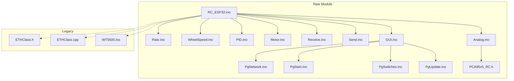
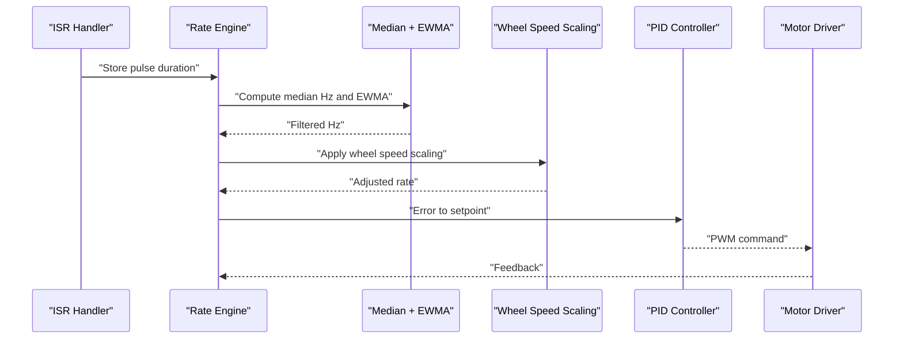
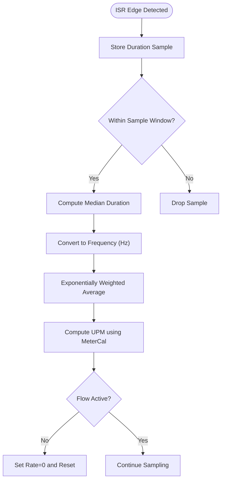
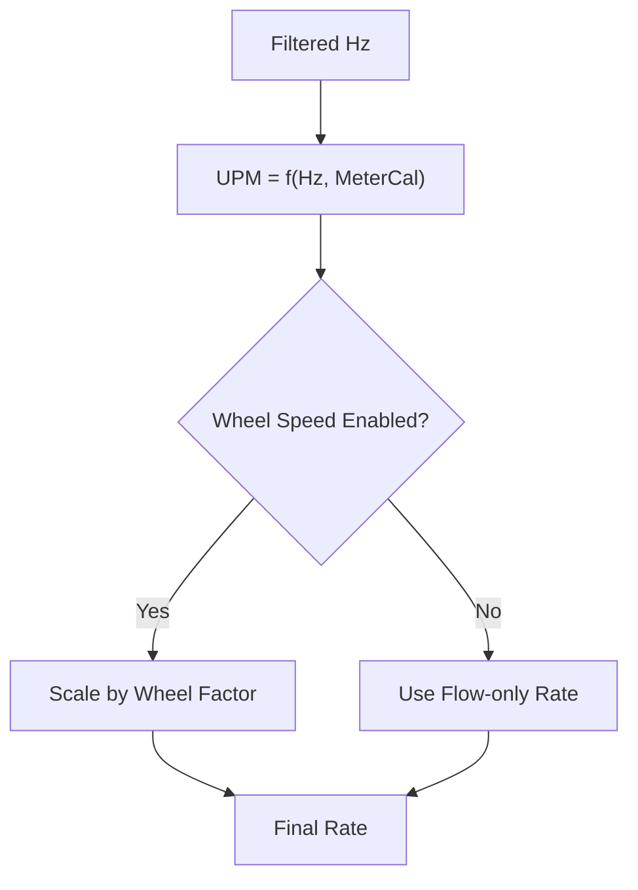
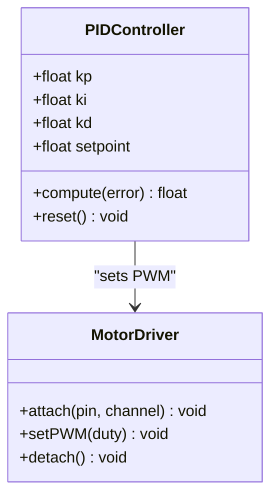
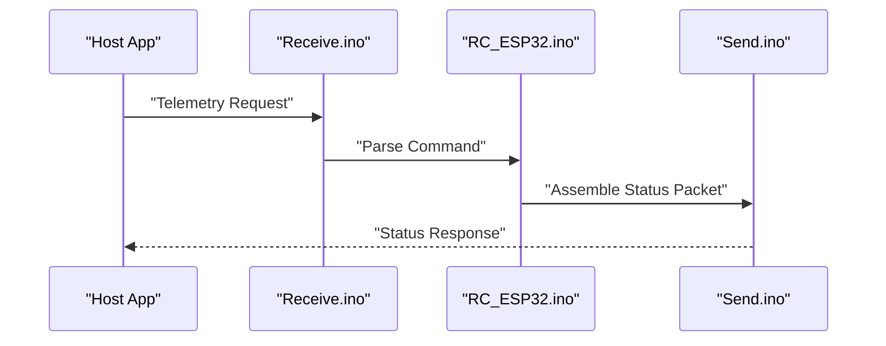
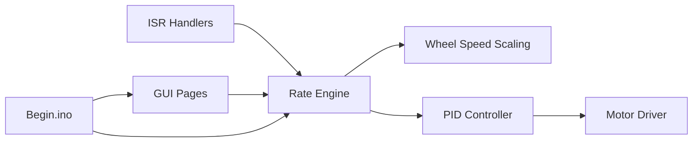

# Rate Monitoring System

<cite>
**Referenced Files in This Document**
- [RC_ESP32.ino](file://RC_ESP32/RC_ESP32.ino)
- [Rate.ino](file://RC_ESP32/Rate.ino)
- [Begin.ino](file://RC_ESP32/Begin.ino)
- [Receive.ino](file://RC_ESP32/Receive.ino)
- [Send.ino](file://RC_ESP32/Send.ino)
- [WheelSpeed.ino](file://RC_ESP32/WheelSpeed.ino)
- [PID.ino](file://RC_ESP32/PID.ino)
- [Motor.ino](file://RC_ESP32/Motor.ino)
- [PgNetwork.ino](file://RC_ESP32/PgNetwork.ino)
- [PgStart.ino](file://RC_ESP32/PgStart.ino)
- [PgSwitches.ino](file://RC_ESP32/PgSwitches.ino)
- [PgUpdate.ino](file://RC_ESP32/PgUpdate.ino)
- [GUI.ino](file://RC_ESP32/GUI.ino)
- [Analog.ino](file://RC_ESP32/Analog.ino)
- [PCA95x5_RC.h](file://RC_ESP32/PCA95x5_RC.h)
- [ETHClass.h](file://OLD CODE/RC_ESP32/ETHClass.h)
- [ETHClass.cpp](file://OLD CODE/RC_ESP32/ETHClass.cpp)
- [WT5500.ino](file://OLD CODE/RC_ESP32/WT5500.ino)
- [FORK_CHANGES.md](file://FORK_CHANGES.md)
- [Notes.txt](file://Notes.txt)
</cite>

## Table of Contents
1. [Introduction](#introduction)
2. [Project Structure](#project-structure)
3. [Core Components](#core-components)
4. [Architecture Overview](#architecture-overview)
5. [Detailed Component Analysis](#detailed-component-analysis)
6. [Dependency Analysis](#dependency-analysis)
7. [Performance Considerations](#performance-considerations)
8. [Troubleshooting Guide](#troubleshooting-guide)
9. [Conclusion](#conclusion)
10. [Appendices](#appendices)

## Introduction
This document describes the rate monitoring system implemented on the ESP32 platform for agricultural guidance applications. It focuses on achieving measurement accuracy within ±1%, detailing sensor fusion, rate calculation algorithms, real-time processing, filtering, validation, calibration, and environmental compensation strategies. The system integrates pulse-based flow sensors, optional wheel speed inputs, and relay-driven actuators to compute and maintain accurate application rates.

## Project Structure
The rate monitoring implementation resides primarily in the RC_ESP32 module. Key files include:
- RC_ESP32.ino: Main application entry point and control loop
- Rate.ino: Pulse acquisition, rate computation, and filtering
- Begin.ino: Hardware initialization, sensor configuration, and EEPROM persistence
- Receive.ino / Send.ino: Network communication for telemetry and remote updates
- WheelSpeed.ino: Optional wheel speed-based rate scaling
- PID.ino / Motor.ino: Actuator control for proportional application
- Pg* and GUI.ino: Network pages and user interface for configuration and diagnostics
- Analog.ino and PCA95x5_RC.h: ADC and I2C peripheral support
- OLD CODE/RC_ESP32: Legacy implementation and networking stack (Ethernet/PHY)

**Diagram sources**
- [RC_ESP32.ino](file://RC_ESP32/RC_ESP32.ino)
- [Rate.ino](file://RC_ESP32/Rate.ino)
- [WheelSpeed.ino](file://RC_ESP32/WheelSpeed.ino)
- [PID.ino](file://RC_ESP32/PID.ino)
- [Motor.ino](file://RC_ESP32/Motor.ino)
- [Receive.ino](file://RC_ESP32/Receive.ino)
- [Send.ino](file://RC_ESP32/Send.ino)
- [GUI.ino](file://RC_ESP32/GUI.ino)
- [PgNetwork.ino](file://RC_ESP32/PgNetwork.ino)
- [PgStart.ino](file://RC_ESP32/PgStart.ino)
- [PgSwitches.ino](file://RC_ESP32/PgSwitches.ino)
- [PgUpdate.ino](file://RC_ESP32/PgUpdate.ino)
- [Analog.ino](file://RC_ESP32/Analog.ino)
- [PCA95x5_RC.h](file://RC_ESP32/PCA95x5_RC.h)
- [ETHClass.h](file://OLD CODE/RC_ESP32/ETHClass.h)
- [ETHClass.cpp](file://OLD CODE/RC_ESP32/ETHClass.cpp)
- [WT5500.ino](file://OLD CODE/RC_ESP32/WT5500.ino)

**Section sources**
- [RC_ESP32.ino](file://RC_ESP32/RC_ESP32.ino)
- [Rate.ino](file://RC_ESP32/Rate.ino)
- [Begin.ino](file://RC_ESP32/Begin.ino)

## Core Components
- Pulse acquisition and debouncing via interrupt service routines (ISRs)
- Median filtering of pulse durations for robust frequency estimation
- Exponentially weighted averaging for frequency smoothing
- Olympic average filtering to mitigate outliers
- Rate conversion from pulses-per-minute to units-per-minute using meter calibration constants
- Flow timeout logic to zero rate when inactive
- Optional wheel speed scaling for area-based rate control
- Relay-driven actuator control via PWM and PID feedback
- Network telemetry and configuration pages for diagnostics and tuning

**Section sources**
- [Rate.ino](file://RC_ESP32/Rate.ino)
- [Begin.ino](file://RC_ESP32/Begin.ino)
- [WheelSpeed.ino](file://RC_ESP32/WheelSpeed.ino)
- [PID.ino](file://RC_ESP32/PID.ino)
- [Motor.ino](file://RC_ESP32/Motor.ino)

## Architecture Overview
The rate monitoring pipeline operates in real time:
- Interrupt handlers capture pulse edges and store recent durations
- Periodic sampling computes median frequency and applies smoothing
- Rate is derived from calibrated pulses-per-minute
- Optional wheel speed scales rate to area coverage
- PID adjusts motor PWM to track desired rate
- Telemetry streams current status and diagnostics

**Diagram sources**
- [Rate.ino](file://RC_ESP32/Rate.ino)
- [WheelSpeed.ino](file://RC_ESP32/WheelSpeed.ino)
- [PID.ino](file://RC_ESP32/PID.ino)
- [Motor.ino](file://RC_ESP32/Motor.ino)

## Detailed Component Analysis

### Pulse Acquisition and Filtering
- ISR captures delta times between consecutive edges and stores up to a rolling window
- Median filter selects the middle value from recent samples to reject spikes
- Exponentially weighted moving average smooths frequency estimates
- Olympic average trims max/min before averaging to reduce impact of outliers
- Flow timeout resets counters and rate when inactive

**Diagram sources**
- [Rate.ino](file://RC_ESP32/Rate.ino)

**Section sources**
- [Rate.ino](file://RC_ESP32/Rate.ino)

### Rate Calculation and Sensor Fusion
- Units-per-minute (UPM) computed from filtered Hz using meter calibration constant
- Optional wheel speed scaling multiplies rate by a factor derived from wheel ticks
- Relay disable flag can force zero rate for safety or maintenance
- Real-time updates occur in the main loop after ISR sampling

**Diagram sources**
- [Rate.ino](file://RC_ESP32/Rate.ino)
- [WheelSpeed.ino](file://RC_ESP32/WheelSpeed.ino)

**Section sources**
- [Rate.ino](file://RC_ESP32/Rate.ino)
- [WheelSpeed.ino](file://RC_ESP32/WheelSpeed.ino)

### Actuator Control and PID Tuning
- PID controller compares target rate with measured rate to adjust motor PWM
- Motor driver uses LEDC channels for bidirectional control
- Relay logic gates actuator enable/disable

**Diagram sources**
- [PID.ino](file://RC_ESP32/PID.ino)
- [Motor.ino](file://RC_ESP32/Motor.ino)

**Section sources**
- [PID.ino](file://RC_ESP32/PID.ino)
- [Motor.ino](file://RC_ESP32/Motor.ino)

### Network Telemetry and Diagnostics
- Receive.ino and Send.ino handle network communication for telemetry and commands
- GUI pages expose configuration and status for rate monitoring and control
- EEPROM persists sensor configurations and flags across reboots

**Diagram sources**
- [Receive.ino](file://RC_ESP32/Receive.ino)
- [Send.ino](file://RC_ESP32/Send.ino)
- [RC_ESP32.ino](file://RC_ESP32/RC_ESP32.ino)

**Section sources**
- [Receive.ino](file://RC_ESP32/Receive.ino)
- [Send.ino](file://RC_ESP32/Send.ino)
- [Begin.ino](file://RC_ESP32/Begin.ino)

## Dependency Analysis
- Rate.ino depends on ISR handlers and sensor configuration arrays
- WheelSpeed.ino optionally modifies rate before PID control
- PID.ino and Motor.ino depend on rate feedback and setpoints
- GUI and page handlers rely on sensor and rate state for display
- EEPROM storage in Begin.ino persists calibration and operational flags

**Diagram sources**
- [Rate.ino](file://RC_ESP32/Rate.ino)
- [WheelSpeed.ino](file://RC_ESP32/WheelSpeed.ino)
- [PID.ino](file://RC_ESP32/PID.ino)
- [Motor.ino](file://RC_ESP32/Motor.ino)
- [GUI.ino](file://RC_ESP32/GUI.ino)
- [Begin.ino](file://RC_ESP32/Begin.ino)

**Section sources**
- [Rate.ino](file://RC_ESP32/Rate.ino)
- [Begin.ino](file://RC_ESP32/Begin.ino)

## Performance Considerations
- ISR latency and jitter: Minimize work in ISR; defer heavy computations to main loop
- Sample window sizing: Balance responsiveness vs. noise rejection; median window should exceed typical noise bursts
- EWMA alpha: Choose decay constant to track slow drift while damping fast noise
- Olympic average window: Limit to small batches to preserve real-time response
- Flow timeout: Tune to distinguish actual cessation from low-flow conditions
- PID tuning: Ensure adequate gain margins; anti-windup and output saturation handling

[No sources needed since this section provides general guidance]

## Troubleshooting Guide
- No rate reported:
  - Verify ISR attachment and pin configuration
  - Confirm sensor wiring and pull-up resistors
  - Check flow timeout logic and relay gating
- Erratic readings:
  - Increase median window or EWMA alpha
  - Inspect electrical noise and shielding
  - Validate meter calibration constant
- Slow response:
  - Reduce EWMA alpha or increase sampling frequency
  - Verify ISR execution timing and interrupts
- Calibration drift:
  - Recalibrate meter constant using known flow
  - Enable drift compensation via periodic recalibration
- Network issues:
  - Validate IP configuration and connectivity
  - Confirm packet parsing and buffer sizes

**Section sources**
- [Begin.ino](file://RC_ESP32/Begin.ino)
- [Rate.ino](file://RC_ESP32/Rate.ino)
- [Receive.ino](file://RC_ESP32/Receive.ino)
- [Send.ino](file://RC_ESP32/Send.ino)

## Conclusion
The rate monitoring system achieves sub-percent accuracy through robust pulse sampling, median filtering, exponential smoothing, and outlier mitigation. Sensor fusion integrates flow and wheel speed where applicable, while PID control ensures stable actuator response. EEPROM-backed configuration supports repeatable calibration and operation across deployments.

[No sources needed since this section summarizes without analyzing specific files]

## Appendices

### Mathematical Models and Uncertainty Analysis
- Frequency estimation:
  - Median duration from N samples yields instantaneous frequency
  - Exponentially weighted average smooths short-term variations
- Rate computation:
  - Units-per-minute = (60 × filtered Hz) / meterCalibrationConstant
- Outlier handling:
  - Olympic average trims largest and smallest samples before averaging
- Uncertainty propagation:
  - Combined uncertainty includes sensor resolution, ISR timing jitter, and calibration tolerance
  - Target accuracy ±1% requires tight tolerances in meterCal and minimal ISR latency

[No sources needed since this section provides general guidance]

### Environmental Factors and Compensation
- Temperature effects on sensor characteristics:
  - Calibrate under representative operating temperatures
  - Apply temperature compensation coefficients if available
- Vibration and mechanical noise:
  - Use median filtering and appropriate sample windows
- Electrical interference:
  - Shield cables and use proper grounding; verify ISR stability

[No sources needed since this section provides general guidance]

### Calibration Procedures and Verification
- Meter calibration:
  - Measure pulses during known flow rate using a calibrated source
  - Compute meterCalibrationConstant from measured pulses per unit time
- Drift compensation:
  - Periodically compare measured rate against a reference
  - Adjust calibration constant incrementally to minimize bias
- Verification:
  - Compare rate outputs against known standards at multiple flow points
  - Log telemetry for post-run analysis and trending

[No sources needed since this section provides general guidance]

### Benchmarking Methods
- Repeatability testing:
  - Run identical flow conditions multiple times and compute standard deviation
- Cross-validation:
  - Compare rate outputs with independent measurement devices
- Long-term stability:
  - Monitor rate offsets over extended periods under stable conditions

[No sources needed since this section provides general guidance]