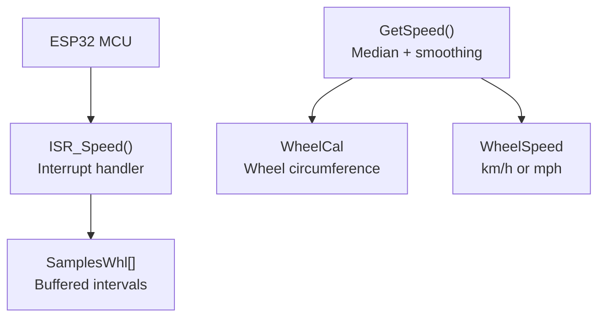
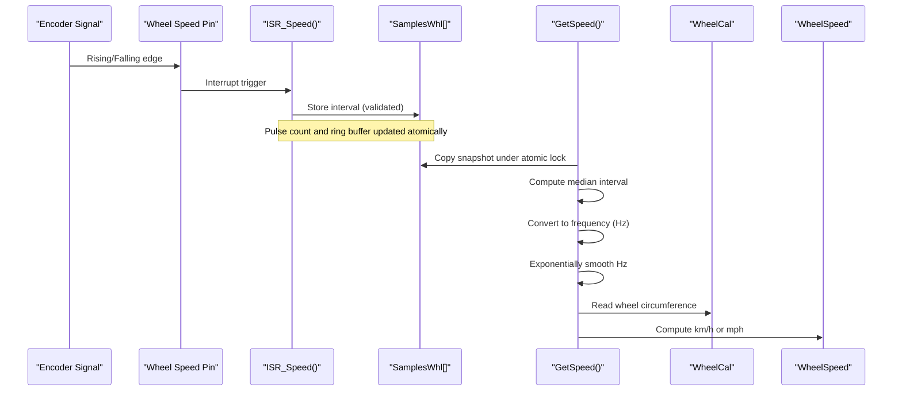
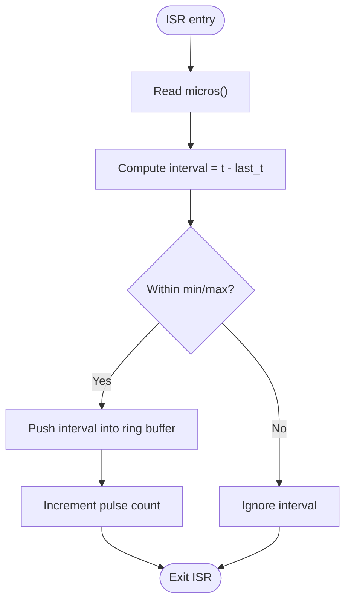
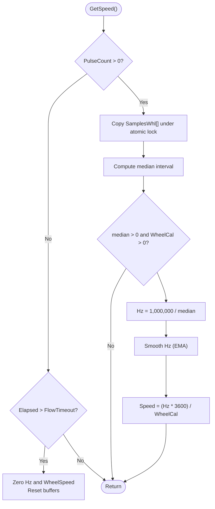
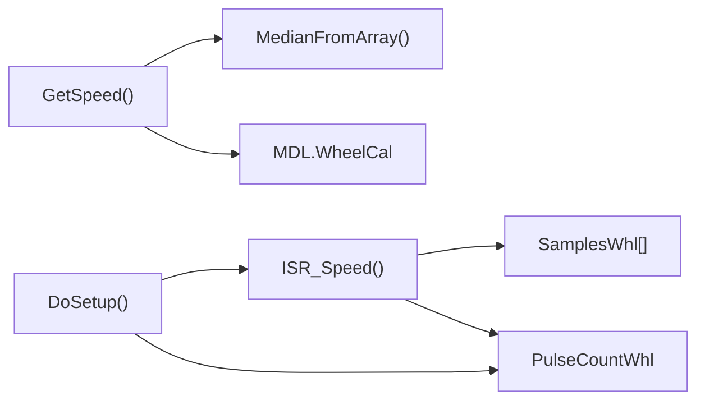

# Wheel Speed Detection

<cite>
**Referenced Files in This Document**
- [RC_ESP32.ino](file://RC_ESP32/RC_ESP32.ino)
- [Begin.ino](file://RC_ESP32/Begin.ino)
- [WheelSpeed.ino](file://RC_ESP32/WheelSpeed.ino)
- [Rate.ino](file://RC_ESP32/Rate.ino)
- [Receive.ino](file://RC_ESP32/Receive.ino)
- [PgStart.ino](file://RC_ESP32/PgStart.ino)
</cite>

## Table of Contents
1. [Introduction](#introduction)
2. [Project Structure](#project-structure)
3. [Core Components](#core-components)
4. [Architecture Overview](#architecture-overview)
5. [Detailed Component Analysis](#detailed-component-analysis)
6. [Dependency Analysis](#dependency-analysis)
7. [Performance Considerations](#performance-considerations)
8. [Troubleshooting Guide](#troubleshooting-guide)
9. [Conclusion](#conclusion)
10. [Appendices](#appendices)

## Introduction
This document describes the wheel speed detection system implemented on the ESP32-based Rate Control module. It focuses on how encoder signals are conditioned, detected via interrupts, sampled, filtered, and transformed into a calibrated vehicle speed estimate. The system emphasizes:
- Interrupt-driven pulse detection and timing
- Median filtering of inter-pulse intervals
- Exponential smoothing of frequency estimates
- Calibration via wheel circumference and optional gear ratio compensation
- Timeout-based deactivation to prevent stale readings
- Remote configuration and diagnostics via the web interface

## Project Structure
The wheel speed subsystem is part of the broader Rate Control firmware and integrates with sensor handling, networking, and web UI:
- Interrupt handlers capture rising/falling edges on the wheel speed pin
- A dedicated ISR buffers inter-pulse intervals
- A periodic task computes median interval, derives frequency, smooths it, and calculates speed from wheel circumference
- Configuration is persisted to EEPROM and can be updated remotely
- The web UI exposes module and sensor settings

**Diagram sources**
- [WheelSpeed.ino:15-29](file://RC_ESP32/WheelSpeed.ino#L15-L29)
- [WheelSpeed.ino:31-69](file://RC_ESP32/WheelSpeed.ino#L31-L69)
- [Begin.ino:162-167](file://RC_ESP32/Begin.ino#L162-L167)

**Section sources**
- [Begin.ino:162-167](file://RC_ESP32/Begin.ino#L162-L167)
- [WheelSpeed.ino:15-29](file://RC_ESP32/WheelSpeed.ino#L15-L29)
- [WheelSpeed.ino:31-69](file://RC_ESP32/WheelSpeed.ino#L31-L69)

## Core Components
- Interrupt handler for wheel speed pin
  - Captures timestamps and computes inter-pulse intervals
  - Validates intervals against min/max bounds
  - Buffers intervals and increments pulse counts
- Periodic speed computation
  - Copies buffered intervals under atomic protection
  - Computes median interval and converts to frequency
  - Applies exponential smoothing to frequency
  - Calculates speed from smoothed frequency and wheel circumference
- Configuration and calibration
  - Wheel circumference stored in module configuration
  - Remote configuration updates via UDP packets
  - EEPROM persistence for settings

Key implementation references:
- Interrupt handler and buffer: [WheelSpeed.ino:15-29](file://RC_ESP32/WheelSpeed.ino#L15-L29)
- Speed computation and smoothing: [WheelSpeed.ino:31-69](file://RC_ESP32/WheelSpeed.ino#L31-L69)
- Setup and pin assignment: [Begin.ino:162-167](file://RC_ESP32/Begin.ino#L162-L167)
- Defaults and constants: [Begin.ino:593-597](file://RC_ESP32/Begin.ino#L593-L597), [Begin.ino:616-618](file://RC_ESP32/Begin.ino#L616-L618)
- Wheel circumference update: [Receive.ino:267-268](file://RC_ESP32/Receive.ino#L267-L268)

**Section sources**
- [WheelSpeed.ino:15-29](file://RC_ESP32/WheelSpeed.ino#L15-L29)
- [WheelSpeed.ino:31-69](file://RC_ESP32/WheelSpeed.ino#L31-L69)
- [Begin.ino:162-167](file://RC_ESP32/Begin.ino#L162-L167)
- [Begin.ino:593-597](file://RC_ESP32/Begin.ino#L593-L597)
- [Begin.ino:616-618](file://RC_ESP32/Begin.ino#L616-L618)
- [Receive.ino:267-268](file://RC_ESP32/Receive.ino#L267-L268)

## Architecture Overview
The wheel speed pipeline consists of:
- Hardware pin configured as input with pull-up
- Interrupt service routine capturing edges and buffering intervals
- Background task computing median interval, deriving frequency, smoothing, and converting to speed
- Configuration via remote commands and persistent storage

**Diagram sources**
- [WheelSpeed.ino:15-29](file://RC_ESP32/WheelSpeed.ino#L15-L29)
- [WheelSpeed.ino:31-69](file://RC_ESP32/WheelSpeed.ino#L31-L69)
- [Begin.ino:162-167](file://RC_ESP32/Begin.ino#L162-L167)

## Detailed Component Analysis

### Interrupt-Based Pulse Detection
- Edge-triggered interrupt captures precise timestamps
- Inter-pulse interval computed as difference between consecutive timestamps
- Validation ensures intervals fall within configured min/max bounds
- Ring-buffer stores recent intervals for median computation
- Pulse count incremented for batch processing

**Diagram sources**
- [WheelSpeed.ino:15-29](file://RC_ESP32/WheelSpeed.ino#L15-L29)

**Section sources**
- [WheelSpeed.ino:15-29](file://RC_ESP32/WheelSpeed.ino#L15-L29)

### Noise Filtering and Frequency Estimation
- Buffered intervals are copied under atomic protection to avoid ISR/data races
- Median interval computed from recent samples to reject outliers
- Frequency derived from inverse of median interval (converted to microseconds)
- Exponential moving average smooths frequency to reduce jitter
- Optional timeout clears state if no pulses are received for extended periods

**Diagram sources**
- [WheelSpeed.ino:31-69](file://RC_ESP32/WheelSpeed.ino#L31-L69)

**Section sources**
- [WheelSpeed.ino:31-69](file://RC_ESP32/WheelSpeed.ino#L31-L69)

### Speed Calculation and Calibration
- Frequency-to-speed conversion uses wheel circumference
- The constant 3600 factor converts Hz to km/h when WheelCal is in millimeters
- Wheel circumference can be updated remotely and persisted to EEPROM
- The system does not apply gear ratio compensation internally; any gearing effects should be reflected in the WheelCal value

References:
- Speed formula and smoothing: [WheelSpeed.ino:50-54](file://RC_ESP32/WheelSpeed.ino#L50-L54)
- Wheel circumference update via remote command: [Receive.ino:267-268](file://RC_ESP32/Receive.ino#L267-L268)
- Defaults and constants: [Begin.ino:593-597](file://RC_ESP32/Begin.ino#L593-L597), [Begin.ino:616-618](file://RC_ESP32/Begin.ino#L616-L618)

**Section sources**
- [WheelSpeed.ino:50-54](file://RC_ESP32/WheelSpeed.ino#L50-L54)
- [Receive.ino:267-268](file://RC_ESP32/Receive.ino#L267-L268)
- [Begin.ino:593-597](file://RC_ESP32/Begin.ino#L593-L597)
- [Begin.ino:616-618](file://RC_ESP32/Begin.ino#L616-L618)

### Signal Conditioning and Interrupt Setup
- Wheel speed pin configured as input with pull-up
- Interrupt attached on falling edge for typical encoder A/B or Z channel wiring
- Sensor pins for other channels use separate ISRs and shared infrastructure

References:
- Pin setup and ISR attachment: [Begin.ino:162-167](file://RC_ESP32/Begin.ino#L162-L167)
- Additional sensor ISRs: [Begin.ino:132-150](file://RC_ESP32/Begin.ino#L132-L150)

**Section sources**
- [Begin.ino:162-167](file://RC_ESP32/Begin.ino#L162-L167)
- [Begin.ino:132-150](file://RC_ESP32/Begin.ino#L132-L150)

### Configuration and Remote Calibration
- Wheel circumference is part of module configuration
- Remote configuration updates wheel pin, circumference, and optional counters
- Settings are saved to EEPROM and may require restart if pin changes

References:
- Wheel circumference field: [RC_ESP32.ino:94](file://RC_ESP32/RC_ESP32.ino#L94)
- Remote update handling: [Receive.ino:264-273](file://RC_ESP32/Receive.ino#L264-L273)
- Web UI entry page: [PgStart.ino:1-148](file://RC_ESP32/PgStart.ino#L1-L148)

**Section sources**
- [RC_ESP32.ino:94](file://RC_ESP32/RC_ESP32.ino#L94)
- [Receive.ino:264-273](file://RC_ESP32/Receive.ino#L264-L273)
- [PgStart.ino:1-148](file://RC_ESP32/PgStart.ino#L1-L148)

## Dependency Analysis
The wheel speed subsystem depends on:
- Interrupt infrastructure for precise timing
- Shared sampling and median routines
- Module configuration for calibration and timeouts
- EEPROM-backed persistence for settings

**Diagram sources**
- [WheelSpeed.ino:15-29](file://RC_ESP32/WheelSpeed.ino#L15-L29)
- [WheelSpeed.ino:31-69](file://RC_ESP32/WheelSpeed.ino#L31-L69)
- [Begin.ino:162-167](file://RC_ESP32/Begin.ino#L162-L167)
- [RC_ESP32.ino:344-377](file://RC_ESP32/RC_ESP32.ino#L344-L377)

**Section sources**
- [WheelSpeed.ino:15-29](file://RC_ESP32/WheelSpeed.ino#L15-L29)
- [WheelSpeed.ino:31-69](file://RC_ESP32/WheelSpeed.ino#L31-L69)
- [Begin.ino:162-167](file://RC_ESP32/Begin.ino#L162-L167)
- [RC_ESP32.ino:344-377](file://RC_ESP32/RC_ESP32.ino#L344-L377)

## Performance Considerations
- Interrupt latency and precision: Using microsecond-precision timestamps ensures accurate inter-pulse interval measurement.
- Buffer sizing: The sample window size trades responsiveness vs. noise rejection; larger windows improve stability but increase lag.
- Smoothing: Exponential smoothing reduces jitter while maintaining responsiveness.
- Atomic copy: Copying buffered intervals under interrupts disabled prevents ISR/data races during median computation.
- Timeout behavior: Long gaps clear frequency and speed to avoid stale readings.

[No sources needed since this section provides general guidance]

## Troubleshooting Guide
Common issues and checks:
- No speed reported
  - Verify wheel speed pin is configured and not duplicated with another sensor
  - Confirm interrupt attached on falling edge for the selected pin
  - Check that encoder signal is reaching the pin and not shorted to ground
  - Inspect wiring continuity and pull-up configuration
  - References: [Begin.ino:162-167](file://RC_ESP32/Begin.ino#L162-L167), [Begin.ino:301-313](file://RC_ESP32/Begin.ino#L301-L313)
- Erratic or noisy readings
  - Increase sample window size for median filtering if supported by configuration
  - Ensure mechanical encoder mounting is secure and free from debris
  - Check for electrical interference and proper shielding
- Incorrect speed scaling
  - Recalibrate wheel circumference via remote configuration
  - Verify units match expected scale (e.g., mm for 3600 factor)
  - References: [Receive.ino:267-268](file://RC_ESP32/Receive.ino#L267-L268), [WheelSpeed.ino:50-54](file://RC_ESP32/WheelSpeed.ino#L50-L54)
- Stale speed after motion stops
  - Confirm FlowTimeout behavior clears speed after idle
  - References: [WheelSpeed.ino:58-68](file://RC_ESP32/WheelSpeed.ino#L58-L68)

**Section sources**
- [Begin.ino:162-167](file://RC_ESP32/Begin.ino#L162-L167)
- [Begin.ino:301-313](file://RC_ESP32/Begin.ino#L301-L313)
- [Receive.ino:267-268](file://RC_ESP32/Receive.ino#L267-L268)
- [WheelSpeed.ino:50-54](file://RC_ESP32/WheelSpeed.ino#L50-L54)
- [WheelSpeed.ino:58-68](file://RC_ESP32/WheelSpeed.ino#L58-L68)

## Conclusion
The wheel speed detection system leverages precise interrupt timing, robust median filtering, and exponential smoothing to produce reliable speed estimates. Calibration is performed via wheel circumference, which can be updated remotely. Proper signal conditioning, correct wiring, and environmental safeguards are essential for accurate operation. The modular design allows easy reconfiguration and diagnostics through the web interface.

[No sources needed since this section summarizes without analyzing specific files]

## Appendices

### Calibration Procedures
- Measure wheel circumference accurately using a calibrated tape or manufacturer specifications
- Send remote configuration to update wheel circumference; the system persists the value
- Validate by driving at known speeds and comparing to a reference source
- References: [Receive.ino:267-268](file://RC_ESP32/Receive.ino#L267-L268), [WheelSpeed.ino:50-54](file://RC_ESP32/WheelSpeed.ino#L50-L54)

**Section sources**
- [Receive.ino:267-268](file://RC_ESP32/Receive.ino#L267-L268)
- [WheelSpeed.ino:50-54](file://RC_ESP32/WheelSpeed.ino#L50-L54)

### Environmental Factors
- Maintain clean, dry encoder optics and magnetic gap
- Secure wiring and connectors to minimize vibration-induced noise
- Avoid proximity to high-frequency switching circuits
- Use appropriate shielding and grounding

[No sources needed since this section provides general guidance]

### Diagnostic Methods
- Monitor median interval and frequency trends via the web UI
- Observe timeout behavior when encoder motion ceases
- Cross-check with external tachometer or GPS-derived speed
- Validate EEPROM-persisted settings after updates

[No sources needed since this section provides general guidance]