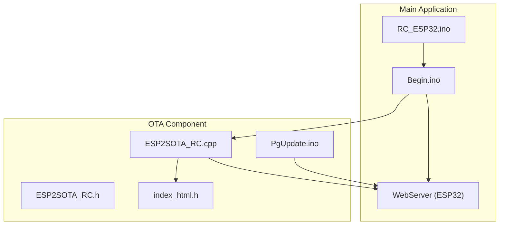
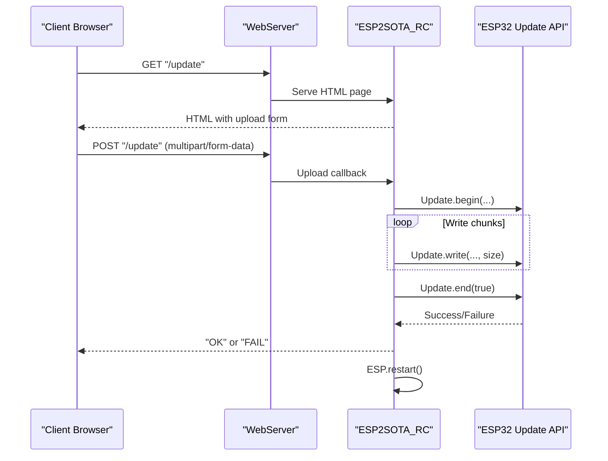
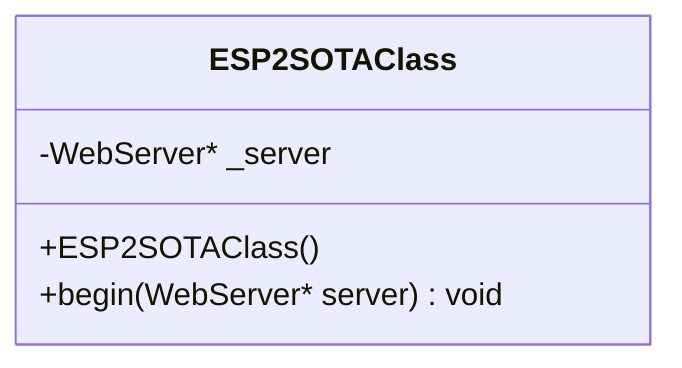
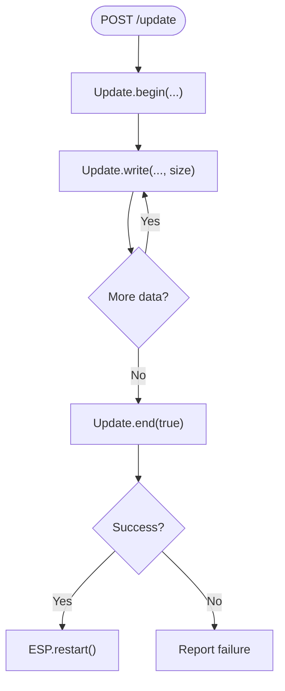
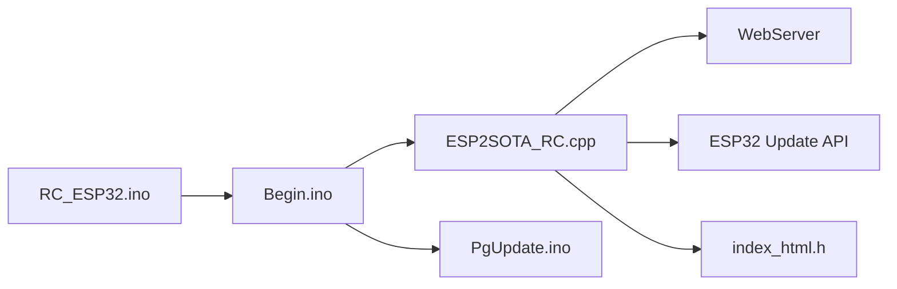
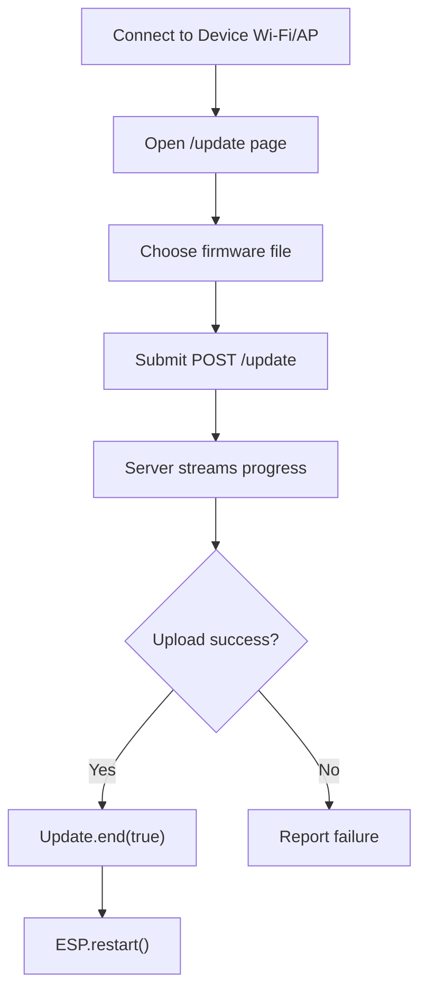

# Firmware Update System

<cite>
**Referenced Files in This Document**
- [ESP2SOTA_RC.h](file://RC_ESP32/ESP2SOTA_RC/ESP2SOTA_RC.h)
- [ESP2SOTA_RC.cpp](file://RC_ESP32/ESP2SOTA_RC/ESP2SOTA_RC.cpp)
- [index_html.h](file://RC_ESP32/ESP2SOTA_RC/index_html.h)
- [PgUpdate.ino](file://RC_ESP32/PgUpdate.ino)
- [Begin.ino](file://RC_ESP32/Begin.ino)
- [RC_ESP32.ino](file://RC_ESP32/RC_ESP32.ino)
- [Notes.txt](file://RC_ESP32/ESP2SOTA_RC/Notes.txt)
- [FORK_CHANGES.md](file://FORK_CHANGES.md)
</cite>

## Table of Contents
1. [Introduction](#introduction)
2. [Project Structure](#project-structure)
3. [Core Components](#core-components)
4. [Architecture Overview](#architecture-overview)
5. [Detailed Component Analysis](#detailed-component-analysis)
6. [Dependency Analysis](#dependency-analysis)
7. [Performance Considerations](#performance-considerations)
8. [Security Considerations](#security-considerations)
9. [Update Procedure](#update-procedure)
10. [Version Management](#version-management)
11. [Update Testing and Validation](#update-testing-and-validation)
12. [Troubleshooting Guide](#troubleshooting-guide)
13. [Automated Deployment Strategies](#automated-deployment-strategies)
14. [Integration with Web Interface](#integration-with-web-interface)
15. [Conclusion](#conclusion)

## Introduction
This document describes the ESP32 Rate Control OTA (Over-The-Air) firmware update system. It explains the ESP2SOTA_RC implementation, the update protocol, reliability features, and integration with the device's web interface. It covers the complete update lifecycle from initiation to completion, including pre-update validation, backup procedures, version management, rollback capabilities, and troubleshooting. Security considerations, automated deployment strategies, and testing/validation procedures are included to ensure safe and reliable updates across fleets.

## Project Structure
The OTA update capability is implemented as a modular component integrated into the main application. Key elements:
- ESP2SOTA_RC: A lightweight OTA server wrapper that registers endpoints and handles firmware uploads.
- Web UI pages: Embedded HTML pages for initiating updates and monitoring progress.
- Main application integration: Registration of OTA routes before other routes to ensure precedence.

**Diagram sources**
- [RC_ESP32.ino:10](file://RC_ESP32/RC_ESP32.ino#L10)
- [Begin.ino:230](file://RC_ESP32/Begin.ino#L230)
- [ESP2SOTA_RC.cpp:15](file://RC_ESP32/ESP2SOTA_RC/ESP2SOTA_RC.cpp#L15)
- [index_html.h:2](file://RC_ESP32/ESP2SOTA_RC/index_html.h#L2)
- [PgUpdate.ino:1](file://RC_ESP32/PgUpdate.ino#L1)

**Section sources**
- [RC_ESP32.ino:10](file://RC_ESP32/RC_ESP32.ino#L10)
- [Begin.ino:230](file://RC_ESP32/Begin.ino#L230)
- [ESP2SOTA_RC.h:15](file://RC_ESP32/ESP2SOTA_RC/ESP2SOTA_RC.h#L15)
- [ESP2SOTA_RC.cpp:15](file://RC_ESP32/ESP2SOTA_RC/ESP2SOTA_RC.cpp#L15)
- [index_html.h:2](file://RC_ESP32/ESP2SOTA_RC/index_html.h#L2)
- [PgUpdate.ino:1](file://RC_ESP32/PgUpdate.ino#L1)

## Core Components
- ESP2SOTA_RC class: Provides OTA endpoint registration and upload handling using the ESP32 Update API.
- Web UI pages: Two embedded HTML pages offer a simple file upload interface and progress feedback.
- Route precedence: The OTA page is registered before the generic update route to ensure it takes priority.

Key responsibilities:
- Expose "/update" GET for the update page.
- Handle "/update" POST multipart form data for firmware upload.
- Manage upload lifecycle: start, write, end, and reboot on success.

**Section sources**
- [ESP2SOTA_RC.h:15](file://RC_ESP32/ESP2SOTA_RC/ESP2SOTA_RC.h#L15)
- [ESP2SOTA_RC.cpp:15](file://RC_ESP32/ESP2SOTA_RC/ESP2SOTA_RC.cpp#L15)
- [Begin.ino:230](file://RC_ESP32/Begin.ino#L230)
- [PgUpdate.ino:79](file://RC_ESP32/PgUpdate.ino#L79)
- [index_html.h:6](file://RC_ESP32/ESP2SOTA_RC/index_html.h#L6)

## Architecture Overview
The OTA system integrates with the main WebServer instance and uses the ESP32 Update API to flash firmware images. The flow includes:
- Client navigates to "/update" to view the upload page.
- Client selects a firmware file and submits via POST to "/update".
- Server streams progress and flashes the image.
- On successful completion, the device restarts automatically.

**Diagram sources**
- [Begin.ino:230](file://RC_ESP32/Begin.ino#L230)
- [ESP2SOTA_RC.cpp:21](file://RC_ESP32/ESP2SOTA_RC/ESP2SOTA_RC.cpp#L21)
- [ESP2SOTA_RC.cpp:29](file://RC_ESP32/ESP2SOTA_RC/ESP2SOTA_RC.cpp#L29)
- [ESP2SOTA_RC.cpp:37](file://RC_ESP32/ESP2SOTA_RC/ESP2SOTA_RC.cpp#L37)

## Detailed Component Analysis

### ESP2SOTA_RC Class
The class encapsulates OTA functionality:
- Constructor initializes internal state.
- begin(): Registers "/update" routes and binds to the provided WebServer instance.
- Uses Update API for flashing and restarts on completion.

**Diagram sources**
- [ESP2SOTA_RC.h:15](file://RC_ESP32/ESP2SOTA_RC/ESP2SOTA_RC.h#L15)
- [ESP2SOTA_RC.cpp:4](file://RC_ESP32/ESP2SOTA_RC/ESP2SOTA_RC.cpp#L4)

**Section sources**
- [ESP2SOTA_RC.h:15](file://RC_ESP32/ESP2SOTA_RC/ESP2SOTA_RC.h#L15)
- [ESP2SOTA_RC.cpp:8](file://RC_ESP32/ESP2SOTA_RC/ESP2SOTA_RC.cpp#L8)

### Update Endpoint Handlers
- GET "/update": Returns the HTML page containing the upload form and progress bar.
- POST "/update": Processes the uploaded firmware file and manages the flashing lifecycle.

**Diagram sources**
- [ESP2SOTA_RC.cpp:29](file://RC_ESP32/ESP2SOTA_RC/ESP2SOTA_RC.cpp#L29)
- [ESP2SOTA_RC.cpp:37](file://RC_ESP32/ESP2SOTA_RC/ESP2SOTA_RC.cpp#L37)

**Section sources**
- [ESP2SOTA_RC.cpp:15](file://RC_ESP32/ESP2SOTA_RC/ESP2SOTA_RC.cpp#L15)
- [ESP2SOTA_RC.cpp:21](file://RC_ESP32/ESP2SOTA_RC/ESP2SOTA_RC.cpp#L21)

### Web UI Pages
Two embedded HTML pages provide the user interface:
- index_html.h: Minimal OTA page with file input and progress indicator.
- PgUpdate.ino: Rich HTML page with CSS styling, form, and JavaScript progress reporting.

Both pages submit to "/update" and display upload progress. The static page avoids dynamic generation overhead.

**Section sources**
- [index_html.h:2](file://RC_ESP32/ESP2SOTA_RC/index_html.h#L2)
- [PgUpdate.ino:79](file://RC_ESP32/PgUpdate.ino#L79)

### Route Precedence and Integration
The OTA page is registered before the generic update route to ensure it takes priority. This prevents conflicts with other handlers and guarantees the OTA UI is served consistently.

**Section sources**
- [Begin.ino:230](file://RC_ESP32/Begin.ino#L230)

## Dependency Analysis
The OTA system depends on:
- ESP32 WebServer and Update API.
- Embedded HTML resources for the UI.
- Integration with the main application's WebServer instance.

**Diagram sources**
- [RC_ESP32.ino:10](file://RC_ESP32/RC_ESP32.ino#L10)
- [Begin.ino:230](file://RC_ESP32/Begin.ino#L230)
- [ESP2SOTA_RC.cpp:15](file://RC_ESP32/ESP2SOTA_RC/ESP2SOTA_RC.cpp#L15)
- [index_html.h:2](file://RC_ESP32/ESP2SOTA_RC/index_html.h#L2)
- [PgUpdate.ino:1](file://RC_ESP32/PgUpdate.ino#L1)

**Section sources**
- [RC_ESP32.ino:10](file://RC_ESP32/RC_ESP32.ino#L10)
- [Begin.ino:230](file://RC_ESP32/Begin.ino#L230)
- [ESP2SOTA_RC.cpp:15](file://RC_ESP32/ESP2SOTA_RC/ESP2SOTA_RC.cpp#L15)

## Performance Considerations
- Upload throughput: Progress reporting uses XMLHttpRequest with lengthComputable to compute percentage. Ensure client bandwidth and server CPU can handle the transfer rate.
- Memory usage: Update.write operations consume RAM proportional to chunk sizes. Large firmware images increase memory pressure.
- Restart behavior: Automatic restart after successful update ensures immediate activation of new firmware, minimizing downtime.

[No sources needed since this section provides general guidance]

## Security Considerations
Current implementation characteristics:
- Transport: No TLS/HTTPS is configured in the OTA component. Updates occur over HTTP.
- Authentication: No built-in authentication or authorization for the "/update" endpoint.
- Integrity: No firmware signature verification or checksum validation within the OTA component.
- Tamper detection: No hardware security module or secure boot integration.

Recommendations:
- Enable HTTPS/TLS for transport encryption.
- Add basic authentication or token-based authorization for the "/update" endpoint.
- Implement firmware signature verification and SHA256 checksum validation.
- Consider enabling ESP32 secure boot and partition swapping for rollback support.

[No sources needed since this section provides general guidance]

## Update Procedure
End-to-end update workflow:
1. Access the device web interface and navigate to the update page.
2. Select a firmware binary file and submit the form.
3. Monitor upload progress via the embedded progress bar.
4. On completion, the device restarts automatically.

**Diagram sources**
- [PgUpdate.ino:94](file://RC_ESP32/PgUpdate.ino#L94)
- [ESP2SOTA_RC.cpp:37](file://RC_ESP32/ESP2SOTA_RC/ESP2SOTA_RC.cpp#L37)

**Section sources**
- [PgUpdate.ino:79](file://RC_ESP32/PgUpdate.ino#L79)
- [ESP2SOTA_RC.cpp:21](file://RC_ESP32/ESP2SOTA_RC/ESP2SOTA_RC.cpp#L21)

## Version Management
Observations from the codebase:
- No explicit version checking or compatibility verification logic is present in the OTA component.
- No rollback mechanism is implemented in the current OTA code.

Recommendations:
- Maintain a version field in firmware metadata and compare against device-reported version.
- Implement compatibility checks (hardware/platform/version).
- Add rollback by maintaining dual partitions and updating the non-active partition, then switching on success.

[No sources needed since this section provides general guidance]

## Update Testing and Validation
Testing procedures to ensure stability:
- Pre-update validation: Verify sufficient free flash space and valid firmware image format.
- Compatibility checks: Confirm firmware targets the correct platform and meets minimum version requirements.
- Partial update simulation: Test upload interruption and recovery.
- Post-update validation: Verify critical functionality after restart and log any errors.

[No sources needed since this section provides general guidance]

## Troubleshooting Guide
Common issues and remedies:
- Upload fails immediately:
  - Check available flash space and firmware validity.
  - Review serial logs for Update.begin/printError messages.
- Upload hangs at 100%:
  - Inspect Update.end(true) result and serial error output.
  - Verify device stability during restart.
- Device does not restart:
  - Confirm ESP.restart() is reached after successful update.
  - Investigate watchdog or interrupt issues preventing restart.

**Section sources**
- [ESP2SOTA_RC.cpp:29](file://RC_ESP32/ESP2SOTA_RC/ESP2SOTA_RC.cpp#L29)
- [ESP2SOTA_RC.cpp:41](file://RC_ESP32/ESP2SOTA_RC/ESP2SOTA_RC.cpp#L41)

## Automated Deployment Strategies
Strategies for fleet management:
- Centralized firmware repository with version catalogs.
- Scheduled maintenance windows for updates.
- Staged rollouts: update a subset first, monitor telemetry, then expand.
- Rollback triggers based on post-update failure metrics.

[No sources needed since this section provides general guidance]

## Integration with Web Interface
The OTA system integrates seamlessly with the existing web interface:
- Dedicated "/update" route for firmware uploads.
- Consistent styling and navigation with other pages.
- Priority registration ensures the OTA page is served reliably.

**Section sources**
- [Begin.ino:230](file://RC_ESP32/Begin.ino#L230)
- [PgUpdate.ino:79](file://RC_ESP32/PgUpdate.ino#L79)

## Conclusion
The ESP2SOTA_RC implementation provides a straightforward OTA update mechanism integrated into the device's web interface. While functional, enhancements are recommended for production use, including HTTPS transport, authentication, integrity verification, and rollback capabilities. With proper testing, validation, and security hardening, the system can support reliable, automated deployments across fleets.