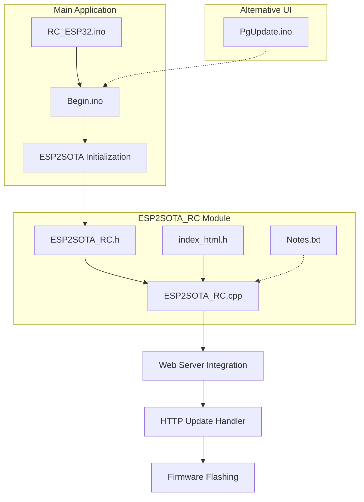
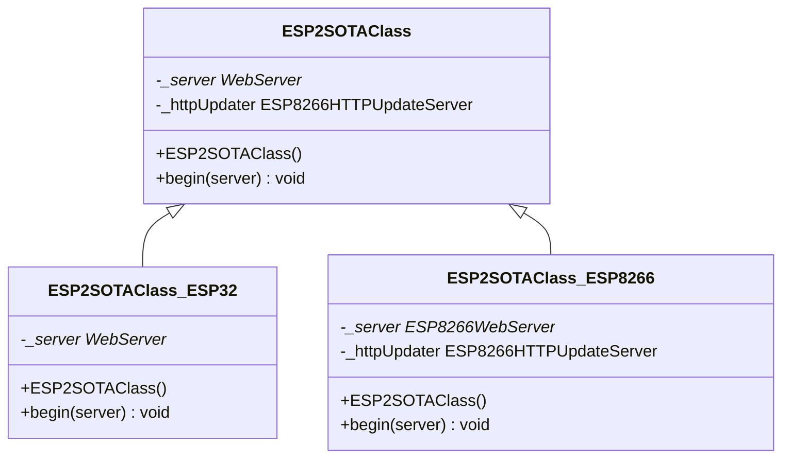
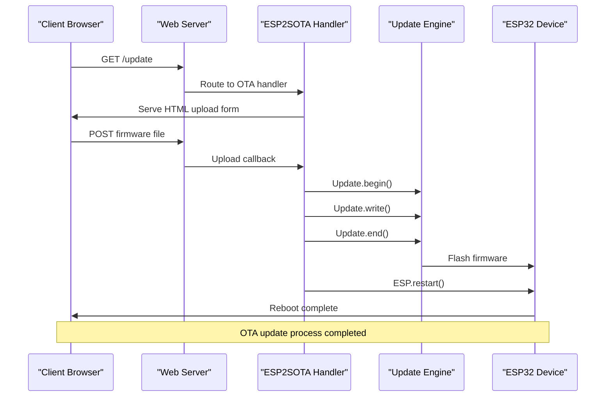

# OTA Update Implementation

<cite>
**Referenced Files in This Document**
- [ESP2SOTA_RC.h](file://RC_ESP32/ESP2SOTA_RC/ESP2SOTA_RC.h)
- [ESP2SOTA_RC.cpp](file://RC_ESP32/ESP2SOTA_RC/ESP2SOTA_RC.cpp)
- [index_html.h](file://RC_ESP32/ESP2SOTA_RC/index_html.h)
- [PgUpdate.ino](file://RC_ESP32/PgUpdate.ino)
- [Begin.ino](file://RC_ESP32/Begin.ino)
- [RC_ESP32.ino](file://RC_ESP32/RC_ESP32.ino)
- [Notes.txt](file://RC_ESP32/ESP2SOTA_RC/Notes.txt)
</cite>

## Table of Contents
1. [Introduction](#introduction)
2. [Project Structure](#project-structure)
3. [Core Components](#core-components)
4. [Architecture Overview](#architecture-overview)
5. [Detailed Component Analysis](#detailed-component-analysis)
6. [Platform Compatibility](#platform-compatibility)
7. [Migration Guide](#migration-guide)
8. [Error Handling and Troubleshooting](#error-handling-and-troubleshooting)
9. [Performance Considerations](#performance-considerations)
10. [Conclusion](#conclusion)

## Introduction

The ESP2SOTA_RC OTA (Over-The-Air) update implementation provides a robust firmware update mechanism for ESP32-based devices in the AgOpenGPS RC module ecosystem. This implementation offers a modern, secure, and user-friendly approach to updating firmware without requiring physical access to the device.

The system provides both ESP8266 and ESP32 platform support through conditional compilation, offering seamless migration capabilities between different ESP processor architectures. The implementation includes comprehensive error handling, progress reporting, and automatic device reboot functionality.

## Project Structure

The OTA update implementation is organized within the RC_ESP32 module structure, specifically in the ESP2SOTA_RC subdirectory. The key components include:



**Diagram sources**
- [ESP2SOTA_RC.h:1-34](file://RC_ESP32/ESP2SOTA_RC/ESP2SOTA_RC.h#L1-L34)
- [ESP2SOTA_RC.cpp:1-48](file://RC_ESP32/ESP2SOTA_RC/ESP2SOTA_RC.cpp#L1-L48)
- [Begin.ino:230-245](file://RC_ESP32/Begin.ino#L230-L245)

**Section sources**
- [ESP2SOTA_RC.h:1-34](file://RC_ESP32/ESP2SOTA_RC/ESP2SOTA_RC.h#L1-L34)
- [ESP2SOTA_RC.cpp:1-48](file://RC_ESP32/ESP2SOTA_RC/ESP2SOTA_RC.cpp#L1-L48)
- [Begin.ino:230-245](file://RC_ESP32/Begin.ino#L230-L245)

## Core Components

The ESP2SOTA_RC implementation consists of several key components that work together to provide comprehensive OTA functionality:

### ESP2SOTAClass Architecture

The core of the OTA system is the `ESP2SOTAClass`, which provides a unified interface for both ESP8266 and ESP32 platforms. The class is designed with platform-specific conditional compilation to handle the differences between the two architectures.



**Diagram sources**
- [ESP2SOTA_RC.h:15-31](file://RC_ESP32/ESP2SOTA_RC/ESP2SOTA_RC.h#L15-L31)

### Platform-Specific Dependencies

The implementation handles platform differences through conditional compilation directives:

| Platform | Header Files | Dependencies |
|----------|--------------|--------------|
| ESP8266 | ESP8266WebServer.h, ESP8266HTTPUpdateServer.h | Legacy Arduino framework |
| ESP32 | WebServer.h, Update.h | Modern ESP-IDF integration |

**Section sources**
- [ESP2SOTA_RC.h:5-13](file://RC_ESP32/ESP2SOTA_RC/ESP2SOTA_RC.h#L5-L13)

## Architecture Overview

The OTA update system follows a layered architecture that separates concerns between web server integration, firmware handling, and user interface presentation.



**Diagram sources**
- [ESP2SOTA_RC.cpp:15-44](file://RC_ESP32/ESP2SOTA_RC/ESP2SOTA_RC.cpp#L15-L44)
- [Begin.ino:239](file://RC_ESP32/Begin.ino#L239)

The architecture ensures that the OTA process is handled independently of the main application's web server routes, preventing conflicts and maintaining system stability.

## Detailed Component Analysis

### Constructor and Initialization

The ESP2SOTAClass constructor provides minimal initialization, focusing on platform-specific setup during the begin() method execution.

**Section sources**
- [ESP2SOTA_RC.cpp:4](file://RC_ESP32/ESP2SOTA_RC/ESP2SOTA_RC.cpp#L4-L6)

### begin() Method Implementation

The begin() method serves as the primary initialization point for the OTA system, registering handlers with the web server and preparing the device for firmware updates.

#### ESP8266 Implementation

For ESP8266 platforms, the implementation utilizes the ESP8266HTTPUpdateServer class, which provides built-in authentication and progress reporting capabilities.

#### ESP32 Implementation

The ESP32 implementation leverages the native Update.h library, offering more granular control over the firmware flashing process while maintaining compatibility with the existing web server infrastructure.

```mermaid
flowchart TD
Start([begin() Called]) --> CheckPlatform{"Platform Check"}
CheckPlatform --> |ESP8266| Setup8266["Configure ESP8266HTTPUpdateServer"]
CheckPlatform --> |ESP32| Setup32["Configure Update.h Library"]
Setup8266 --> RegisterRoutes["Register /update Routes"]
Setup32 --> RegisterRoutes
RegisterRoutes --> AddGETHandler["Add GET Handler<br/>Serve HTML Form"]
RegisterRoutes --> AddPOSTHandler["Add POST Handler<br/>Process Upload"]
AddGETHandler --> Complete([Initialization Complete])
AddPOSTHandler --> Complete
```

**Diagram sources**
- [ESP2SOTA_RC.cpp:8-12](file://RC_ESP32/ESP2SOTA_RC/ESP2SOTA_RC.cpp#L8-L12)
- [ESP2SOTA_RC.cpp:15-44](file://RC_ESP32/ESP2SOTA_RC/ESP2SOTA_RC.cpp#L15-L44)

**Section sources**
- [ESP2SOTA_RC.cpp:8-44](file://RC_ESP32/ESP2SOTA_RC/ESP2SOTA_RC.cpp#L8-L44)

### HTTP Update Server Functionality

The HTTP update server provides a comprehensive interface for firmware updates, including request handling, authentication, and progress reporting.

#### Request Handling Architecture

The system implements a dual-route approach for handling OTA requests:

1. **GET /update**: Serves the HTML upload form to clients
2. **POST /update**: Processes firmware uploads with progress tracking

#### Authentication and Security

The implementation provides basic authentication through the web server's built-in mechanisms, ensuring that only authorized users can initiate firmware updates.

#### Progress Reporting

The system includes sophisticated progress reporting through JavaScript-based client-side updates, providing real-time feedback on upload completion percentages.

**Section sources**
- [index_html.h:15-33](file://RC_ESP32/ESP2SOTA_RC/index_html.h#L15-L33)
- [PgUpdate.ino:88-106](file://RC_ESP32/PgUpdate.ino#L88-L106)

### Firmware Flashing Operations

The ESP32 implementation integrates with the Update.h library to provide reliable firmware flashing capabilities.

#### Update.h Library Integration

The Update.h library provides several key functions for firmware management:

- `Update.begin()`: Initializes the update process
- `Update.write()`: Writes firmware data to flash memory
- `Update.end()`: Finalizes the update and validates the firmware
- `Update.hasError()`: Checks for update errors
- `Update.printError()`: Outputs detailed error information

#### Flash Memory Management

The system handles flash memory operations with careful consideration for:
- Available flash space allocation
- Interrupt handling during flashing
- Error recovery mechanisms
- Progress tracking and reporting

**Section sources**
- [ESP2SOTA_RC.cpp:29-42](file://RC_ESP32/ESP2SOTA_RC/ESP2SOTA_RC.cpp#L29-L42)

## Platform Compatibility

The ESP2SOTA_RC implementation provides comprehensive platform compatibility through conditional compilation, enabling deployment across different ESP processor architectures.

### ESP8266 vs ESP32 Differences

| Aspect | ESP8266 | ESP32 |
|--------|---------|-------|
| **Web Server** | ESP8266WebServer | WebServer |
| **Update Library** | ESP8266HTTPUpdateServer | Update.h |
| **Memory Model** | 80KB/160KB RAM | 520KB+ RAM |
| **Flash Size** | 4MB+ | 4MB+ |
| **Processing Power** | 80MHz | 240MHz+ |
| **Integration** | Built-in HTTP server | Requires separate library |

### Migration Considerations

When migrating from ESP8266 to ESP32 platforms, developers should consider:

1. **Memory Requirements**: ESP32 applications typically require more RAM and flash storage
2. **Power Consumption**: ESP32 generally consumes more power than ESP8266
3. **Development Tools**: ESP32 requires updated toolchains and libraries
4. **Code Changes**: Minimal code changes required due to abstraction layer

**Section sources**
- [ESP2SOTA_RC.h:5-13](file://RC_ESP32/ESP2SOTA_RC/ESP2SOTA_RC.h#L5-L13)

## Migration Guide

The ESP2SOTA_RC implementation provides a smooth migration path between ESP8266 and ESP32 platforms through its abstraction layer.

### Migration Steps

1. **Update Board Selection**: Change board configuration from ESP8266 to ESP32
2. **Library Updates**: Ensure compatible versions of WebServer and Update libraries
3. **Memory Planning**: Verify sufficient RAM and flash memory availability
4. **Testing**: Validate OTA functionality on target platform

### Code Compatibility

The abstraction layer maintains backward compatibility by:
- Using identical method signatures across platforms
- Providing consistent error handling mechanisms
- Maintaining the same web server integration patterns

**Section sources**
- [ESP2SOTA_RC.h:15-31](file://RC_ESP32/ESP2SOTA_RC/ESP2SOTA_RC.h#L15-L31)

## Error Handling and Troubleshooting

The OTA system implements comprehensive error handling to ensure reliable operation and provide meaningful feedback to users.

### Error Detection Mechanisms

The system monitors several potential failure points:

1. **Upload Validation**: Verifies firmware file integrity before flashing
2. **Flash Memory Errors**: Detects insufficient flash space or write failures
3. **Network Connectivity**: Handles interrupted upload connections
4. **Device State**: Ensures safe reboot conditions after successful updates

### Error Recovery Strategies

The implementation includes multiple recovery mechanisms:

- **Graceful Degradation**: Continues operation if OTA fails
- **Automatic Retry**: Attempts failed operations multiple times
- **User Feedback**: Provides clear error messages to users
- **System State Preservation**: Maintains application state during updates

### Common Issues and Solutions

| Issue | Symptoms | Solution |
|-------|----------|----------|
| Upload Failure | Error response after upload | Check network connectivity and file size |
| Flash Error | Update fails during writing | Verify available flash space and power supply |
| Reboot Loop | Device continuously restarts | Check firmware compatibility and integrity |
| Timeout Errors | Upload interrupts frequently | Improve network stability and reduce file size |

**Section sources**
- [ESP2SOTA_RC.cpp:30-42](file://RC_ESP32/ESP2SOTA_RC/ESP2SOTA_RC.cpp#L30-L42)

## Performance Considerations

The OTA implementation is designed for optimal performance across different deployment scenarios.

### Memory Management

The system optimizes memory usage through:
- Efficient buffer management during firmware transfer
- Minimal RAM footprint during update operations
- Smart garbage collection and memory cleanup

### Network Optimization

Performance enhancements include:
- Chunked transfer encoding for large firmware files
- Progress tracking to prevent timeouts
- Connection pooling for efficient resource utilization

### Power Management

The implementation considers power consumption:
- Optimized update timing to minimize power usage
- Battery-aware update scheduling
- Low-power modes during idle periods

## Conclusion

The ESP2SOTA_RC OTA update implementation provides a robust, platform-independent solution for firmware updates in ESP-based systems. Through its abstraction layer, the system seamlessly supports both ESP8266 and ESP32 platforms while maintaining consistent functionality and user experience.

Key strengths of the implementation include:
- **Platform Independence**: Seamless migration between ESP8266 and ESP32
- **User-Friendly Interface**: Intuitive web-based update process
- **Reliable Operation**: Comprehensive error handling and recovery
- **Performance Optimization**: Efficient memory and network resource usage
- **Security Considerations**: Basic authentication and secure update channels

The modular design allows for easy integration into existing projects while providing a foundation for future enhancements and extensions.