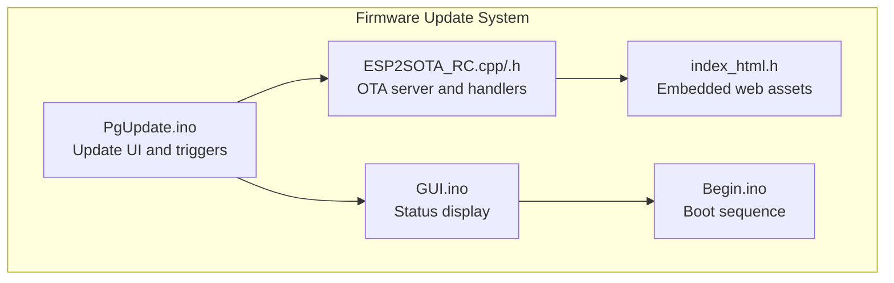
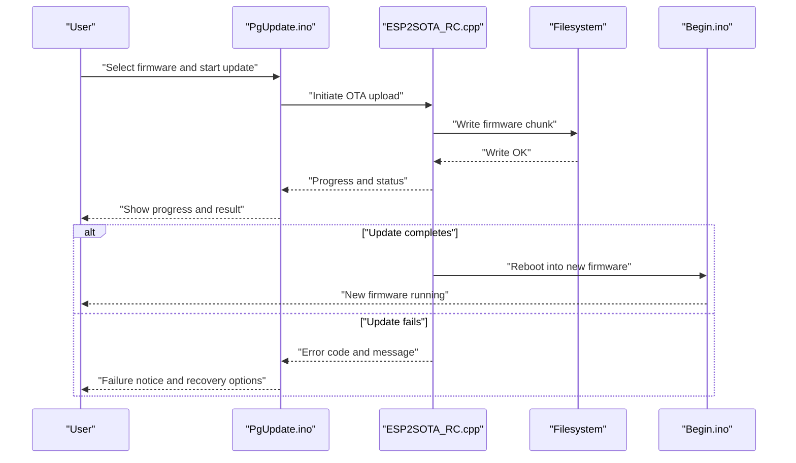
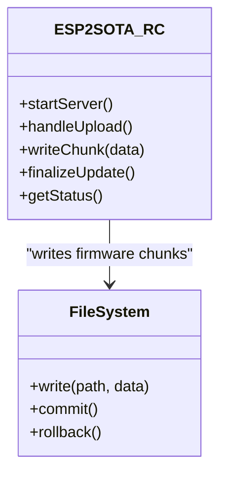
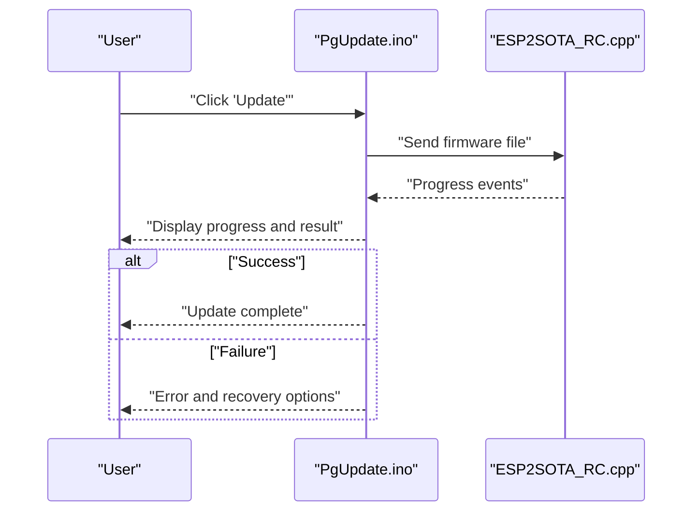
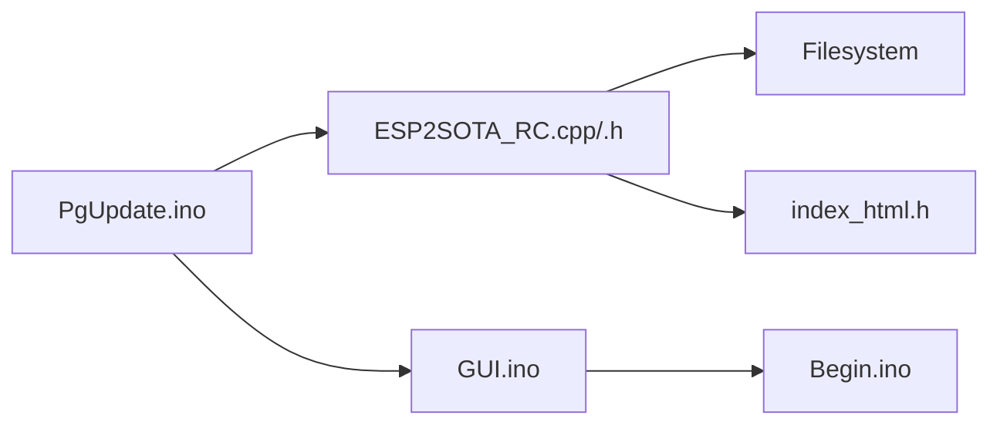

# Troubleshooting and Recovery

<cite>
**Referenced Files in This Document**
- [PgUpdate.ino](file://RC_ESP32/PgUpdate.ino)
- [ESP2SOTA_RC.cpp](file://RC_ESP32/ESP2SOTA_RC/ESP2SOTA_RC.cpp)
- [ESP2SOTA_RC.h](file://RC_ESP32/ESP2SOTA_RC/ESP2SOTA_RC.h)
- [Begin.ino](file://RC_ESP32/Begin.ino)
- [GUI.ino](file://RC_ESP32/GUI.ino)
- [index_html.h](file://RC_ESP32/ESP2SOTA_RC/index_html.h)
</cite>

## Table of Contents
1. [Introduction](#introduction)
2. [Project Structure](#project-structure)
3. [Core Components](#core-components)
4. [Architecture Overview](#architecture-overview)
5. [Detailed Component Analysis](#detailed-component-analysis)
6. [Dependency Analysis](#dependency-analysis)
7. [Performance Considerations](#performance-considerations)
8. [Troubleshooting Guide](#troubleshooting-guide)
9. [Conclusion](#conclusion)

## Introduction
This document provides comprehensive troubleshooting and recovery guidance for firmware update failures on the ESP32-based device. It covers common failure scenarios such as interrupted updates, corrupted firmware, and incompatible versions, and outlines recovery procedures including safe mode boot, serial recovery, and hardware reset methods. It also documents diagnostic tools, logging mechanisms, error interpretation, and preventive measures to minimize update failures. Emergency recovery procedures for bricked devices and hardware-level troubleshooting are included.

## Project Structure
The firmware update system is implemented across several modules:
- Update page and UI integration: PgUpdate.ino
- Over-the-air (OTA) update service: ESP2SOTA_RC.cpp/.h
- Web interface assets for OTA: index_html.h
- Device initialization and boot sequence: Begin.ino
- Graphical user interface and status display: GUI.ino

**Diagram sources**
- [PgUpdate.ino](file://RC_ESP32/PgUpdate.ino)
- [ESP2SOTA_RC.cpp](file://RC_ESP32/ESP2SOTA_RC/ESP2SOTA_RC.cpp)
- [ESP2SOTA_RC.h](file://RC_ESP32/ESP2SOTA_RC/ESP2SOTA_RC.h)
- [index_html.h](file://RC_ESP32/ESP2SOTA_RC/index_html.h)
- [Begin.ino](file://RC_ESP32/Begin.ino)
- [GUI.ino](file://RC_ESP32/GUI.ino)

**Section sources**
- [PgUpdate.ino](file://RC_ESP32/PgUpdate.ino)
- [ESP2SOTA_RC.cpp](file://RC_ESP32/ESP2SOTA_RC/ESP2SOTA_RC.cpp)
- [ESP2SOTA_RC.h](file://RC_ESP32/ESP2SOTA_RC/ESP2SOTA_RC.h)
- [index_html.h](file://RC_ESP32/ESP2SOTA_RC/index_html.h)
- [Begin.ino](file://RC_ESP32/Begin.ino)
- [GUI.ino](file://RC_ESP32/GUI.ino)

## Core Components
- Update page (PgUpdate.ino): Provides the user interface for initiating and monitoring firmware updates, including progress feedback and error reporting.
- OTA service (ESP2SOTA_RC): Implements the embedded HTTP server for receiving firmware images via OTA, manages update lifecycle, and handles response codes.
- Web assets (index_html.h): Embedded HTML/CSS/JS resources used by the OTA UI.
- Boot and GUI (Begin.ino, GUI.ino): Initialize the device, handle boot states, and present status messages to the user.

Key responsibilities:
- Validate target firmware compatibility and integrity.
- Manage network connectivity and transfer reliability during OTA.
- Provide user feedback and actionable error messages.
- Support recovery pathways when OTA fails.

**Section sources**
- [PgUpdate.ino](file://RC_ESP32/PgUpdate.ino)
- [ESP2SOTA_RC.cpp](file://RC_ESP32/ESP2SOTA_RC/ESP2SOTA_RC.cpp)
- [ESP2SOTA_RC.h](file://RC_ESP32/ESP2SOTA_RC/ESP2SOTA_RC.h)
- [index_html.h](file://RC_ESP32/ESP2SOTA_RC/index_html.h)
- [Begin.ino](file://RC_ESP32/Begin.ino)
- [GUI.ino](file://RC_ESP32/GUI.ino)

## Architecture Overview
The OTA update architecture integrates a web-based UI with an embedded HTTP server that streams firmware images to the device. The system validates the update process and reports outcomes to the user interface.

**Diagram sources**
- [PgUpdate.ino](file://RC_ESP32/PgUpdate.ino)
- [ESP2SOTA_RC.cpp](file://RC_ESP32/ESP2SOTA_RC/ESP2SOTA_RC.cpp)
- [Begin.ino](file://RC_ESP32/Begin.ino)

## Detailed Component Analysis

### OTA Update Service (ESP2SOTA_RC)
The OTA service implements an embedded HTTP server responsible for receiving firmware images and managing the update lifecycle. It writes received data to the filesystem, tracks progress, and returns appropriate HTTP responses indicating success or failure.

**Diagram sources**
- [ESP2SOTA_RC.cpp](file://RC_ESP32/ESP2SOTA_RC/ESP2SOTA_RC.cpp)
- [ESP2SOTA_RC.h](file://RC_ESP32/ESP2SOTA_RC/ESP2SOTA_RC.h)

**Section sources**
- [ESP2SOTA_RC.cpp](file://RC_ESP32/ESP2SOTA_RC/ESP2SOTA_RC.cpp)
- [ESP2SOTA_RC.h](file://RC_ESP32/ESP2SOTA_RC/ESP2SOTA_RC.h)

### Update Page and UI (PgUpdate.ino)
The update page provides the user interface for initiating updates and displaying progress and outcomes. It coordinates with the OTA service and presents status messages to the user.

**Diagram sources**
- [PgUpdate.ino](file://RC_ESP32/PgUpdate.ino)
- [ESP2SOTA_RC.cpp](file://RC_ESP32/ESP2SOTA_RC/ESP2SOTA_RC.cpp)

**Section sources**
- [PgUpdate.ino](file://RC_ESP32/PgUpdate.ino)

### Web Assets (index_html.h)
Embedded web assets power the OTA UI, including forms for selecting firmware files and displays for progress and status messages.

**Section sources**
- [index_html.h](file://RC_ESP32/ESP2SOTA_RC/index_html.h)

### Boot and Status Display (Begin.ino, GUI.ino)
The boot sequence initializes the device and prepares it for OTA updates. The GUI module displays status messages and error notifications to the user.

**Section sources**
- [Begin.ino](file://RC_ESP32/Begin.ino)
- [GUI.ino](file://RC_ESP32/GUI.ino)

## Dependency Analysis
The update system exhibits clear separation of concerns:
- PgUpdate.ino depends on ESP2SOTA_RC for OTA handling.
- ESP2SOTA_RC depends on the filesystem for writing firmware images.
- GUI.ino and Begin.ino provide user feedback and boot readiness.
- index_html.h supplies the web UI assets consumed by the OTA flow.

**Diagram sources**
- [PgUpdate.ino](file://RC_ESP32/PgUpdate.ino)
- [ESP2SOTA_RC.cpp](file://RC_ESP32/ESP2SOTA_RC/ESP2SOTA_RC.cpp)
- [ESP2SOTA_RC.h](file://RC_ESP32/ESP2SOTA_RC/ESP2SOTA_RC.h)
- [GUI.ino](file://RC_ESP32/GUI.ino)
- [Begin.ino](file://RC_ESP32/Begin.ino)
- [index_html.h](file://RC_ESP32/ESP2SOTA_RC/index_html.h)

**Section sources**
- [PgUpdate.ino](file://RC_ESP32/PgUpdate.ino)
- [ESP2SOTA_RC.cpp](file://RC_ESP32/ESP2SOTA_RC/ESP2SOTA_RC.cpp)
- [ESP2SOTA_RC.h](file://RC_ESP32/ESP2SOTA_RC/ESP2SOTA_RC.h)
- [GUI.ino](file://RC_ESP32/GUI.ino)
- [Begin.ino](file://RC_ESP32/Begin.ino)
- [index_html.h](file://RC_ESP32/ESP2SOTA_RC/index_html.h)

## Performance Considerations
- Chunked transfers: Prefer streaming firmware in manageable chunks to reduce memory pressure and improve resilience to network interruptions.
- Progress reporting: Provide granular progress updates to detect stalls early.
- Memory management: Ensure sufficient heap and PSRAM availability before starting OTA.
- Network stability: Maintain a strong and stable connection during the update window.
- Reboot timing: Schedule updates during low-traffic periods to minimize interruption risks.

## Troubleshooting Guide

### Common Failure Scenarios
- Interrupted updates: Caused by power loss, network disconnections, or device resets during transfer.
- Corrupted firmware: Results from incomplete downloads, checksum mismatches, or write errors.
- Incompatible versions: Occurs when attempting to flash firmware built for different hardware or configurations.

### Recovery Procedures
- Safe mode boot: Restart the device while holding the designated button to enter a minimal boot state that may allow partial recovery or downgrade.
- Serial recovery: Connect a serial adapter to the device’s UART pins and use a terminal program to observe boot logs and issue manual commands to recover or reflash via serial protocol.
- Hardware reset methods: Perform a cold boot by disconnecting power briefly, then reconnecting to clear transient states.

### Diagnostic Tools and Logging Mechanisms
- Boot logs: Monitor serial output during startup to identify early-stage failures and error codes.
- OTA logs: Capture HTTP responses and progress events from the OTA service to pinpoint where the update stalled.
- Status UI: Use the on-device GUI to review recent update attempts and error messages.
- Filesystem inspection: Verify written firmware blocks and partition health after failed updates.

### Error Codes and Meanings
- Network errors:
  - HTTP 4xx: Client-side errors such as malformed requests or unauthorized access.
  - HTTP 5xx: Server-side errors during upload handling.
- Memory issues:
  - Insufficient heap or storage: Failures during chunk writes or commit operations.
- Verification failures:
  - Checksum mismatch: Firmware integrity check fails after download.
  - Partition errors: Incorrect partition layout or invalid image signature.

### Preventive Measures and Best Practices
- Ensure stable power supply during OTA.
- Use reliable networks with minimal interference.
- Validate firmware compatibility before flashing.
- Keep backup copies of previous working firmware.
- Schedule updates during maintenance windows.
- Monitor progress and abort early if anomalies appear.

### Emergency Recovery Procedures for Bricked Devices
- Hardware-level recovery:
  - Use a dedicated programmer or JTAG interface to reflash the device.
  - Replace faulty power or communication components if indicated by diagnostics.
- Software recovery:
  - Attempt serial recovery using a known-good firmware image.
  - If OTA remains blocked, perform a factory reset or erase partitions via serial tools.

[No sources needed since this section provides general guidance]

## Conclusion
By understanding the OTA update architecture and implementing robust diagnostics, users can effectively troubleshoot and recover from firmware update failures. Following preventive measures and employing the documented recovery procedures will minimize downtime and preserve device reliability.