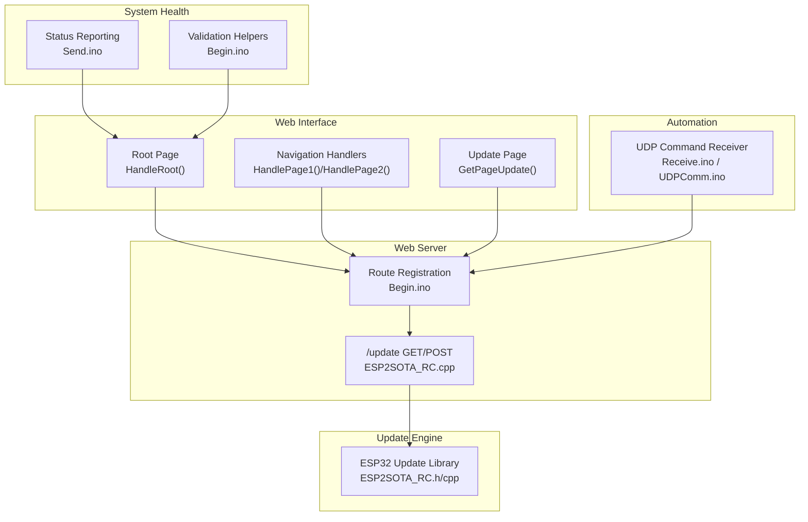
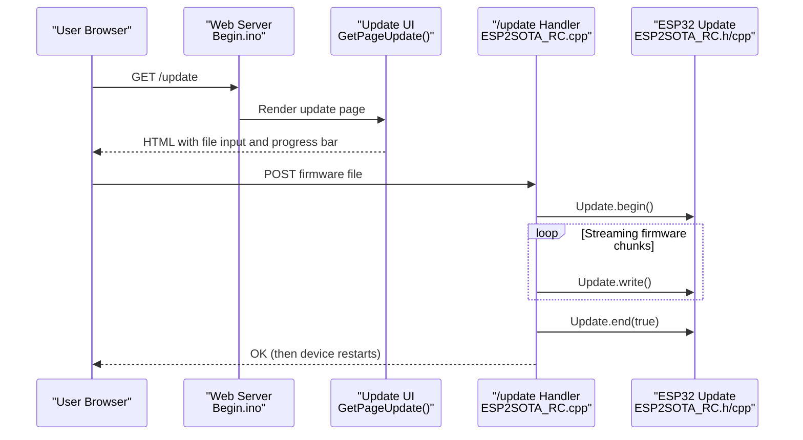
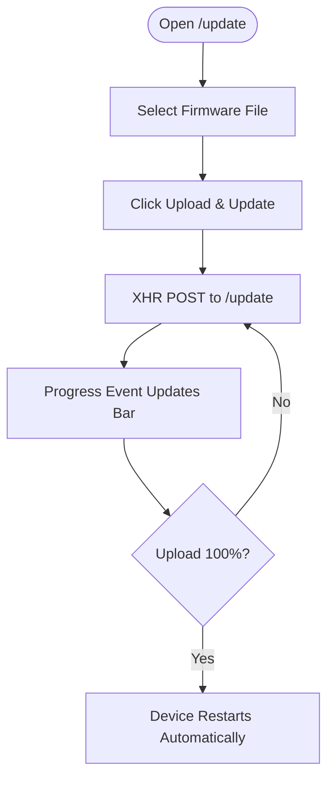
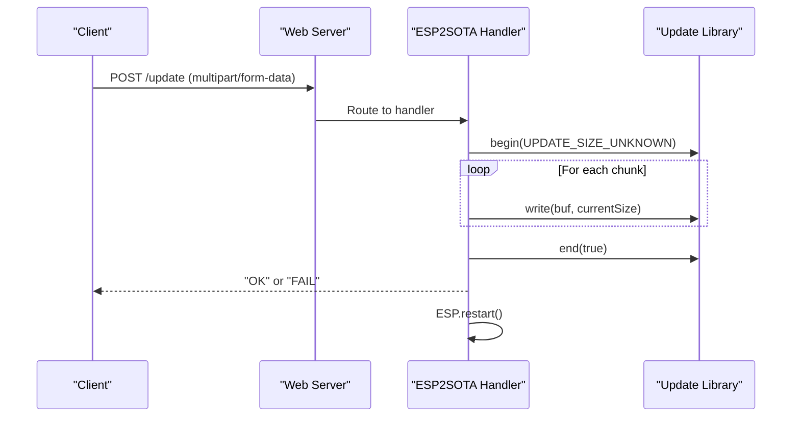
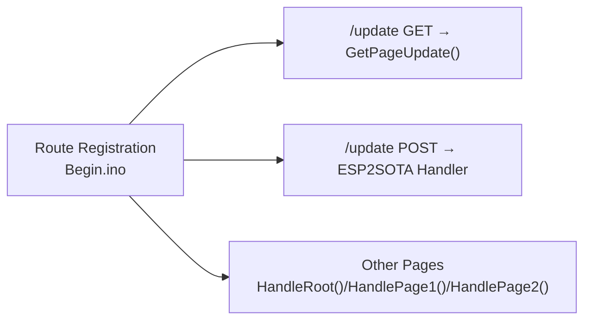
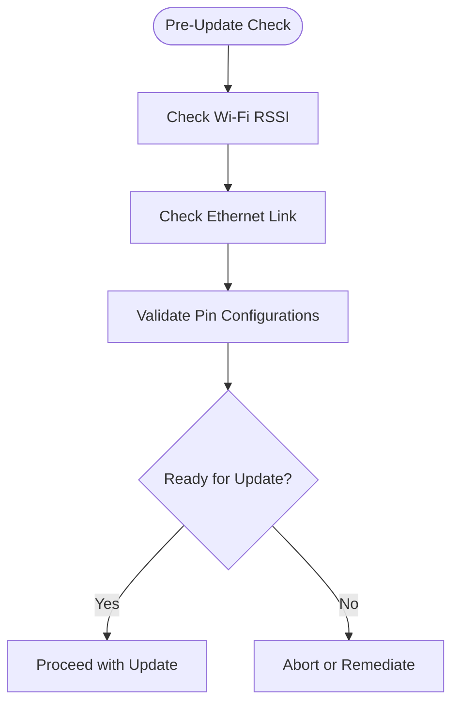
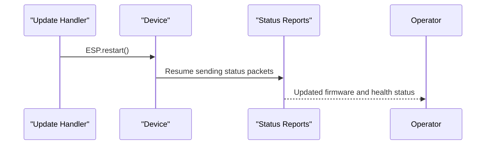
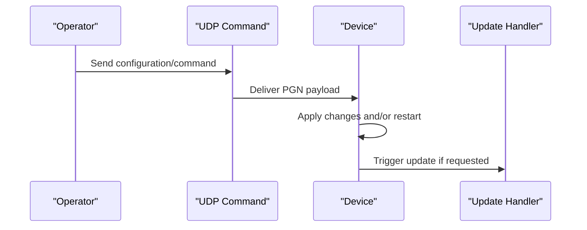
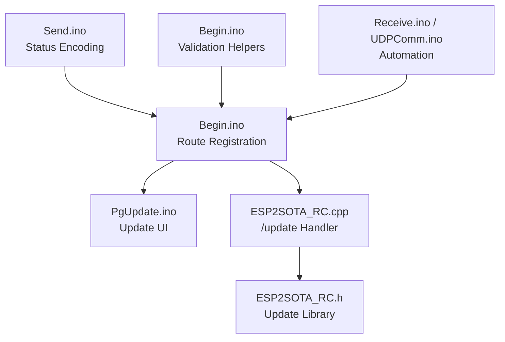

# Update Procedures

<cite>
**Referenced Files in This Document**
- [PgUpdate.ino](file://RC_ESP32/PgUpdate.ino)
- [ESP2SOTA_RC.h](file://RC_ESP32/ESP2SOTA_RC/ESP2SOTA_RC.h)
- [ESP2SOTA_RC.cpp](file://RC_ESP32/ESP2SOTA_RC/ESP2SOTA_RC.cpp)
- [Begin.ino](file://RC_ESP32/Begin.ino)
- [GUI.ino](file://RC_ESP32/GUI.ino)
- [Send.ino](file://RC_ESP32/Send.ino)
- [Receive.ino](file://RC_ESP32/Receive.ino)
- [PID.ino](file://RC_ESP32/PID.ino)
- [UDPComm.ino](file://OLD CODE/RC_ESP32/UDPComm.ino)
</cite>

## Table of Contents
1. [Introduction](#introduction)
2. [Project Structure](#project-structure)
3. [Core Components](#core-components)
4. [Architecture Overview](#architecture-overview)
5. [Detailed Component Analysis](#detailed-component-analysis)
6. [Dependency Analysis](#dependency-analysis)
7. [Performance Considerations](#performance-considerations)
8. [Troubleshooting Guide](#troubleshooting-guide)
9. [Conclusion](#conclusion)
10. [Appendices](#appendices)

## Introduction
This document describes the complete firmware update workflow for the ESP32-based Rate Control module. It covers the web interface integration for initiating updates, pre-update validation, update execution and progress monitoring, and post-update verification. It also outlines user workflows for manual updates and automation via remote commands, and discusses scheduling and background update execution.

## Project Structure
The update workflow spans several modules:
- Web UI and routing: Root pages, navigation handlers, and the dedicated update page
- Update service: A thin wrapper around the ESP32 Update library to serve the update endpoint and handle uploads
- System state and health: Status reporting and validation helpers used during update preparation and verification
- Remote control: UDP-based commands that can trigger configuration changes and restarts, enabling automation

**Diagram sources**
- [Begin.ino:219-239](file://RC_ESP32/Begin.ino#L219-L239)
- [ESP2SOTA_RC.cpp:14-44](file://RC_ESP32/ESP2SOTA_RC/ESP2SOTA_RC.cpp#L14-L44)
- [PgUpdate.ino:1-111](file://RC_ESP32/PgUpdate.ino#L1-L111)
- [Send.ino:111-170](file://RC_ESP32/Send.ino#L111-L170)
- [Receive.ino:48-81](file://RC_ESP32/Receive.ino#L48-L81)
- [UDPComm.ino:469-502](file://OLD CODE/RC_ESP32/UDPComm.ino#L469-L502)

**Section sources**
- [Begin.ino:219-239](file://RC_ESP32/Begin.ino#L219-L239)
- [PgUpdate.ino:1-111](file://RC_ESP32/PgUpdate.ino#L1-L111)
- [ESP2SOTA_RC.cpp:14-44](file://RC_ESP32/ESP2SOTA_RC/ESP2SOTA_RC.cpp#L14-L44)
- [Send.ino:111-170](file://RC_ESP32/Send.ino#L111-L170)
- [Receive.ino:48-81](file://RC_ESP32/Receive.ino#L48-L81)
- [UDPComm.ino:469-502](file://OLD CODE/RC_ESP32/UDPComm.ino#L469-L502)

## Core Components
- Update web page: Provides a file picker and progress bar for firmware uploads
- Update handler: Implements the /update endpoint to receive multipart firmware files and flash them
- Web server routing: Registers routes and ensures the custom update page takes precedence
- System health reporting: Encodes operational status bits for Wi-Fi, Ethernet, and pin configuration
- Automation hooks: UDP commands that can trigger reconfiguration and restarts

Key implementation references:
- Update page and UI: [PgUpdate.ino:1-111](file://RC_ESP32/PgUpdate.ino#L1-L111)
- Route registration and update endpoint: [Begin.ino:230-239](file://RC_ESP32/Begin.ino#L230-L239), [ESP2SOTA_RC.cpp:14-44](file://RC_ESP32/ESP2SOTA_RC/ESP2SOTA_RC.cpp#L14-L44)
- System status encoding: [Send.ino:111-170](file://RC_ESP32/Send.ino#L111-L170)
- Validation helpers: [Begin.ino:621-736](file://RC_ESP32/Begin.ino#L621-L736)
- Automation triggers: [Receive.ino:48-81](file://RC_ESP32/Receive.ino#L48-L81), [UDPComm.ino:469-502](file://OLD CODE/RC_ESP32/UDPComm.ino#L469-L502)

**Section sources**
- [PgUpdate.ino:1-111](file://RC_ESP32/PgUpdate.ino#L1-L111)
- [Begin.ino:230-239](file://RC_ESP32/Begin.ino#L230-L239)
- [ESP2SOTA_RC.cpp:14-44](file://RC_ESP32/ESP2SOTA_RC/ESP2SOTA_RC.cpp#L14-L44)
- [Send.ino:111-170](file://RC_ESP32/Send.ino#L111-L170)
- [Begin.ino:621-736](file://RC_ESP32/Begin.ino#L621-L736)
- [Receive.ino:48-81](file://RC_ESP32/Receive.ino#L48-L81)
- [UDPComm.ino:469-502](file://OLD CODE/RC_ESP32/UDPComm.ino#L469-L502)

## Architecture Overview
The update architecture combines a custom HTML page with a minimal update handler backed by the ESP32 Update library. The web server registers the update route early to ensure it takes precedence over generic handlers. During upload, the handler streams firmware data and flashes it. After completion, the device restarts automatically.

**Diagram sources**
- [Begin.ino:230-239](file://RC_ESP32/Begin.ino#L230-L239)
- [PgUpdate.ino:1-111](file://RC_ESP32/PgUpdate.ino#L1-L111)
- [ESP2SOTA_RC.cpp:21-44](file://RC_ESP32/ESP2SOTA_RC/ESP2SOTA_RC.cpp#L21-L44)
- [ESP2SOTA_RC.h:15-31](file://RC_ESP32/ESP2SOTA_RC/ESP2SOTA_RC.h#L15-L31)

## Detailed Component Analysis

### Web Update Page
The update page provides:
- A file input for selecting the firmware binary
- A submit button to initiate upload
- A progress bar that reflects upload percentage
- JavaScript to send the file via XMLHttpRequest and update the progress indicator

User interaction flow:
- Navigate to the update page
- Choose a firmware file
- Submit the form
- Observe real-time progress until completion

**Diagram sources**
- [PgUpdate.ino:78-106](file://RC_ESP32/PgUpdate.ino#L78-L106)

**Section sources**
- [PgUpdate.ino:1-111](file://RC_ESP32/PgUpdate.ino#L1-L111)

### Update Handler and Flashing
The handler:
- Registers GET and POST for /update
- On POST, sends a response indicating success or failure
- Uses the ESP32 Update library to begin, write, and end the firmware update
- Triggers a restart after completion

**Diagram sources**
- [ESP2SOTA_RC.cpp:21-44](file://RC_ESP32/ESP2SOTA_RC/ESP2SOTA_RC.cpp#L21-L44)
- [ESP2SOTA_RC.h:15-31](file://RC_ESP32/ESP2SOTA_RC/ESP2SOTA_RC.h#L15-L31)

**Section sources**
- [ESP2SOTA_RC.cpp:14-44](file://RC_ESP32/ESP2SOTA_RC/ESP2SOTA_RC.cpp#L14-L44)
- [ESP2SOTA_RC.h:15-31](file://RC_ESP32/ESP2SOTA_RC/ESP2SOTA_RC.h#L15-L31)

### Routing and Precedence
The web server registers routes early, ensuring the custom update page takes precedence over generic handlers. This guarantees the update UI is served consistently.

**Diagram sources**
- [Begin.ino:219-239](file://RC_ESP32/Begin.ino#L219-L239)

**Section sources**
- [Begin.ino:219-239](file://RC_ESP32/Begin.ino#L219-L239)

### Pre-Update Validation and System Health
Pre-update checks focus on system stability and readiness:
- Wi-Fi connectivity and signal strength
- Ethernet availability and link status
- Valid pin configuration for sensors and relays
- Module type and ID correctness

These statuses are encoded in outgoing telemetry/status packets and can be used to assess readiness before initiating an update.

**Diagram sources**
- [Send.ino:111-170](file://RC_ESP32/Send.ino#L111-L170)
- [Begin.ino:621-736](file://RC_ESP32/Begin.ino#L621-L736)

**Section sources**
- [Send.ino:111-170](file://RC_ESP32/Send.ino#L111-L170)
- [Begin.ino:621-736](file://RC_ESP32/Begin.ino#L621-L736)

### Post-Update Verification and Restart
After flashing completes, the handler signals success/failure and restarts the device. The restart ensures the new firmware becomes active. Telemetry sent after restart reflects the updated firmware and operational status.

**Diagram sources**
- [ESP2SOTA_RC.cpp:21-25](file://RC_ESP32/ESP2SOTA_RC/ESP2SOTA_RC.cpp#L21-L25)

**Section sources**
- [ESP2SOTA_RC.cpp:21-25](file://RC_ESP32/ESP2SOTA_RC/ESP2SOTA_RC.cpp#L21-L25)

### Automation and Background Execution
While the repository does not implement a built-in scheduler, automation is supported via UDP commands:
- Configuration changes that require restarts
- Remote triggers that cause device resets

These can be orchestrated externally to schedule updates during maintenance windows or in response to remote commands.

**Diagram sources**
- [Receive.ino:48-81](file://RC_ESP32/Receive.ino#L48-L81)
- [UDPComm.ino:469-502](file://OLD CODE/RC_ESP32/UDPComm.ino#L469-L502)

**Section sources**
- [Receive.ino:48-81](file://RC_ESP32/Receive.ino#L48-L81)
- [UDPComm.ino:469-502](file://OLD CODE/RC_ESP32/UDPComm.ino#L469-L502)

## Dependency Analysis
The update workflow depends on:
- Web server routing precedence to ensure the update page is served
- The ESP32 Update library for safe flashing
- System status reporting to validate readiness
- Optional UDP automation for remote orchestration

**Diagram sources**
- [Begin.ino:219-239](file://RC_ESP32/Begin.ino#L219-L239)
- [PgUpdate.ino:1-111](file://RC_ESP32/PgUpdate.ino#L1-L111)
- [ESP2SOTA_RC.cpp:14-44](file://RC_ESP32/ESP2SOTA_RC/ESP2SOTA_RC.cpp#L14-L44)
- [ESP2SOTA_RC.h:15-31](file://RC_ESP32/ESP2SOTA_RC/ESP2SOTA_RC.h#L15-L31)
- [Send.ino:111-170](file://RC_ESP32/Send.ino#L111-L170)
- [Receive.ino:48-81](file://RC_ESP32/Receive.ino#L48-L81)
- [UDPComm.ino:469-502](file://OLD CODE/RC_ESP32/UDPComm.ino#L469-L502)

**Section sources**
- [Begin.ino:219-239](file://RC_ESP32/Begin.ino#L219-L239)
- [PgUpdate.ino:1-111](file://RC_ESP32/PgUpdate.ino#L1-L111)
- [ESP2SOTA_RC.cpp:14-44](file://RC_ESP32/ESP2SOTA_RC/ESP2SOTA_RC.cpp#L14-L44)
- [ESP2SOTA_RC.h:15-31](file://RC_ESP32/ESP2SOTA_RC/ESP2SOTA_RC.h#L15-L31)
- [Send.ino:111-170](file://RC_ESP32/Send.ino#L111-L170)
- [Receive.ino:48-81](file://RC_ESP32/Receive.ino#L48-L81)
- [UDPComm.ino:469-502](file://OLD CODE/RC_ESP32/UDPComm.ino#L469-L502)

## Performance Considerations
- Upload bandwidth: Large firmware images increase transfer time; ensure stable Wi-Fi or wired Ethernet for reliable updates
- Interrupt handling: Keep update window during low-traffic periods to minimize interference with control loops
- Telemetry overhead: Status reports are lightweight but avoid excessive polling during update to prevent contention
- Restart timing: Schedule restarts after update completion to allow the device to stabilize before resuming operations

## Troubleshooting Guide
Common issues and resolutions:
- Upload fails immediately
  - Verify the update page is reachable and the /update route is registered before other handlers
  - Confirm the firmware file format is compatible with the target device
  - Check browser console for upload errors
  - References: [Begin.ino:230-239](file://RC_ESP32/Begin.ino#L230-L239), [PgUpdate.ino:78-106](file://RC_ESP32/PgUpdate.ino#L78-L106)

- Upload progress stalls
  - Ensure uninterrupted power and network connection
  - Reduce concurrent network activity
  - Retry with a smaller firmware image if possible
  - References: [ESP2SOTA_RC.cpp:25-44](file://RC_ESP32/ESP2SOTA_RC/ESP2SOTA_RC.cpp#L25-L44)

- Device does not restart after update
  - Confirm the handler reaches the restart step
  - Check serial logs for error messages during Update.begin/write/end
  - References: [ESP2SOTA_RC.cpp:21-25](file://RC_ESP32/ESP2SOTA_RC/ESP2SOTA_RC.cpp#L21-L25)

- Update not visible in UI
  - Confirm route registration order so the custom update page takes precedence
  - References: [Begin.ino:230-239](file://RC_ESP32/Begin.ino#L230-L239)

**Section sources**
- [Begin.ino:230-239](file://RC_ESP32/Begin.ino#L230-L239)
- [PgUpdate.ino:78-106](file://RC_ESP32/PgUpdate.ino#L78-L106)
- [ESP2SOTA_RC.cpp:21-25](file://RC_ESP32/ESP2SOTA_RC/ESP2SOTA_RC.cpp#L21-L25)
- [ESP2SOTA_RC.cpp:25-44](file://RC_ESP32/ESP2SOTA_RC/ESP2SOTA_RC.cpp#L25-L44)

## Conclusion
The update workflow integrates a straightforward web UI with a robust update handler leveraging the ESP32 Update library. Pre-update validation and status reporting help ensure reliability, while automation via UDP enables scheduled or remote-triggered updates. Following the documented procedures and troubleshooting steps will minimize risk and improve success rates.

## Appendices

### Step-by-Step User Workflows

- Manual update via web UI
  1. Open the update page in a browser
  2. Select the firmware file
  3. Click Upload & Update
  4. Wait for the progress bar to reach 100%
  5. Allow the device to restart automatically
  - References: [PgUpdate.ino:78-106](file://RC_ESP32/PgUpdate.ino#L78-L106), [ESP2SOTA_RC.cpp:21-25](file://RC_ESP32/ESP2SOTA_RC/ESP2SOTA_RC.cpp#L21-L25)

- Automated update via UDP
  1. Prepare a command payload that triggers configuration changes or restarts
  2. Send the UDP packet to the device
  3. The device applies changes and restarts if required
  4. Optionally trigger the update handler remotely if integrated
  - References: [Receive.ino:48-81](file://RC_ESP32/Receive.ino#L48-L81), [UDPComm.ino:469-502](file://OLD CODE/RC_ESP32/UDPComm.ino#L469-L502)

### Pre-Update Validation Checklist
- Wi-Fi RSSI acceptable for reliable transfer
- Ethernet link up if applicable
- Pin configurations valid for sensors and relays
- Module type and ID consistent with expectations
- References: [Send.ino:111-170](file://RC_ESP32/Send.ino#L111-L170), [Begin.ino:621-736](file://RC_ESP32/Begin.ino#L621-L736)

### Post-Update Verification
- Confirm device restarts and reboots into new firmware
- Validate status telemetry reflects updated firmware and operational state
- References: [ESP2SOTA_RC.cpp:21-25](file://RC_ESP32/ESP2SOTA_RC/ESP2SOTA_RC.cpp#L21-L25), [Send.ino:111-170](file://RC_ESP32/Send.ino#L111-L170)