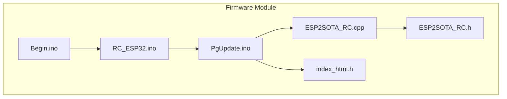
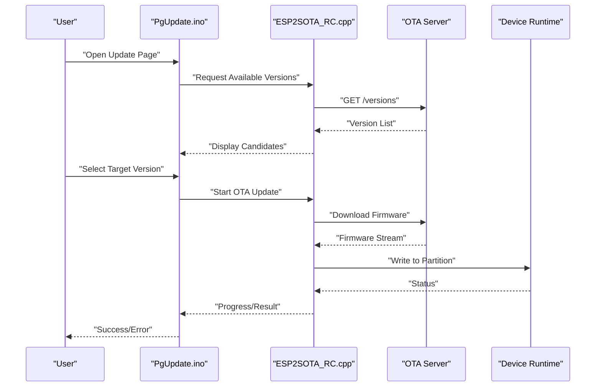
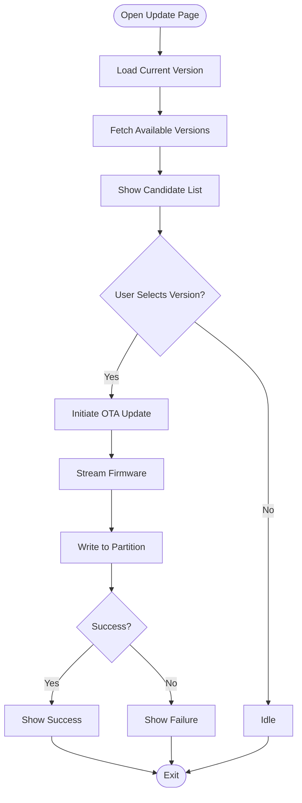
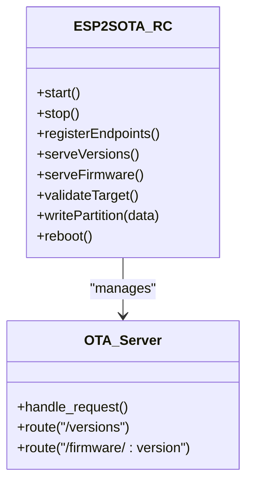
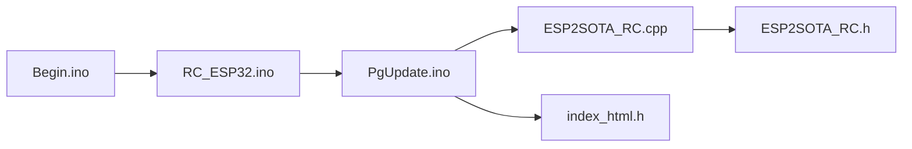

# Version Management

<cite>
**Referenced Files in This Document**
- [PgUpdate.ino](file://RC_ESP32/PgUpdate.ino)
- [ESP2SOTA_RC.h](file://RC_ESP32/ESP2SOTA_RC/ESP2SOTA_RC.h)
- [ESP2SOTA_RC.cpp](file://RC_ESP32/ESP2SOTA_RC/ESP2SOTA_RC.cpp)
- [Begin.ino](file://RC_ESP32/Begin.ino)
- [RC_ESP32.ino](file://RC_ESP32/RC_ESP32.ino)
- [index_html.h](file://RC_ESP32/ESP2SOTA_RC/index_html.h)
- [Notes.txt](file://RC_ESP32/ESP2SOTA_RC/Notes.txt)
- [FORK_CHANGES.md](file://FORK_CHANGES.md)
- [Notes.txt](file://Notes.txt)
</cite>

## Table of Contents
1. [Introduction](#introduction)
2. [Project Structure](#project-structure)
3. [Core Components](#core-components)
4. [Architecture Overview](#architecture-overview)
5. [Detailed Component Analysis](#detailed-component-analysis)
6. [Dependency Analysis](#dependency-analysis)
7. [Performance Considerations](#performance-considerations)
8. [Troubleshooting Guide](#troubleshooting-guide)
9. [Conclusion](#conclusion)
10. [Appendices](#appendices)

## Introduction
This document describes the firmware version management system for the ESP32-based RC module. It covers version checking (local vs. remote), compatibility verification (hardware platform and firmware target), rollback capabilities (automatic recovery and manual rollback), version history and update logging, version numbering schemes, and upgrade path planning across hardware variants. The system integrates Over-The-Air (OTA) update capabilities with a web interface for update distribution and monitoring.

## Project Structure
The firmware update system spans several modules:
- Update page and UI: PgUpdate.ino
- OTA service: ESP2SOTA_RC.{h,cpp}
- Web assets: index_html.h
- Boot and initialization: Begin.ino, RC_ESP32.ino
- Documentation and change notes: Notes.txt, Notes.txt (OTA), FORK_CHANGES.md

**Diagram sources**
- [PgUpdate.ino](file://RC_ESP32/PgUpdate.ino)
- [ESP2SOTA_RC.h](file://RC_ESP32/ESP2SOTA_RC/ESP2SOTA_RC.h)
- [ESP2SOTA_RC.cpp](file://RC_ESP32/ESP2SOTA_RC/ESP2SOTA_RC.cpp)
- [index_html.h](file://RC_ESP32/ESP2SOTA_RC/index_html.h)
- [Begin.ino](file://RC_ESP32/Begin.ino)
- [RC_ESP32.ino](file://RC_ESP32/RC_ESP32.ino)

**Section sources**
- [PgUpdate.ino](file://RC_ESP32/PgUpdate.ino)
- [ESP2SOTA_RC.h](file://RC_ESP32/ESP2SOTA_RC/ESP2SOTA_RC.h)
- [ESP2SOTA_RC.cpp](file://RC_ESP32/ESP2SOTA_RC/ESP2SOTA_RC.cpp)
- [Begin.ino](file://RC_ESP32/Begin.ino)
- [RC_ESP32.ino](file://RC_ESP32/RC_ESP32.ino)
- [index_html.h](file://RC_ESP32/ESP2SOTA_RC/index_html.h)

## Core Components
- Update page and UI: Presents firmware version information, triggers OTA updates, and displays progress and results.
- OTA service: Provides server-side update handling, version metadata exchange, and update delivery pipeline.
- Web assets: Embedded HTML/CSS/JS for the update interface.
- Boot and initialization: Establishes runtime environment and exposes version identifiers for comparison.
- Documentation: Notes and change logs support version tracking and upgrade planning.

Key responsibilities:
- Local version comparison: Compare current firmware version with candidate versions.
- Remote update availability: Detect new firmware builds from the OTA server.
- Compatibility verification: Validate hardware platform and firmware target match.
- Rollback: Automatic recovery and manual rollback procedures.
- Version history and logging: Audit trail of applied updates and failures.
- Version numbering: Semantic versioning scheme and upgrade paths.

**Section sources**
- [PgUpdate.ino](file://RC_ESP32/PgUpdate.ino)
- [ESP2SOTA_RC.h](file://RC_ESP32/ESP2SOTA_RC/ESP2SOTA_RC.h)
- [ESP2SOTA_RC.cpp](file://RC_ESP32/ESP2SOTA_RC/ESP2SOTA_RC.cpp)
- [Begin.ino](file://RC_ESP32/Begin.ino)
- [RC_ESP32.ino](file://RC_ESP32/RC_ESP32.ino)
- [index_html.h](file://RC_ESP32/ESP2SOTA_RC/index_html.h)
- [Notes.txt](file://RC_ESP32/ESP2SOTA_RC/Notes.txt)
- [FORK_CHANGES.md](file://FORK_CHANGES.md)
- [Notes.txt](file://Notes.txt)

## Architecture Overview
The OTA update flow connects the device UI to the OTA server and firmware partition management.

**Diagram sources**
- [PgUpdate.ino](file://RC_ESP32/PgUpdate.ino)
- [ESP2SOTA_RC.cpp](file://RC_ESP32/ESP2SOTA_RC/ESP2SOTA_RC.cpp)
- [index_html.h](file://RC_ESP32/ESP2SOTA_RC/index_html.h)

## Detailed Component Analysis

### Update Page and UI (PgUpdate.ino)
Responsibilities:
- Present current firmware version and available candidates.
- Trigger OTA update process and display progress.
- Surface errors and outcomes to the user.

Processing logic highlights:
- Version retrieval and display.
- User selection of target firmware.
- Progress reporting and outcome messaging.

**Diagram sources**
- [PgUpdate.ino](file://RC_ESP32/PgUpdate.ino)
- [index_html.h](file://RC_ESP32/ESP2SOTA_RC/index_html.h)

**Section sources**
- [PgUpdate.ino](file://RC_ESP32/PgUpdate.ino)
- [index_html.h](file://RC_ESP32/ESP2SOTA_RC/index_html.h)

### OTA Service (ESP2SOTA_RC.{h,cpp})
Responsibilities:
- Manage OTA server lifecycle and endpoint registration.
- Validate firmware targets and handle download streams.
- Coordinate with device runtime for safe flashing and reboot.

Key interactions:
- Expose version metadata to the UI.
- Serve firmware binaries and handle streaming writes.
- Integrate with device partition management for atomic updates.

**Diagram sources**
- [ESP2SOTA_RC.h](file://RC_ESP32/ESP2SOTA_RC/ESP2SOTA_RC.h)
- [ESP2SOTA_RC.cpp](file://RC_ESP32/ESP2SOTA_RC/ESP2SOTA_RC.cpp)

**Section sources**
- [ESP2SOTA_RC.h](file://RC_ESP32/ESP2SOTA_RC/ESP2SOTA_RC.h)
- [ESP2SOTA_RC.cpp](file://RC_ESP32/ESP2SOTA_RC/ESP2SOTA_RC.cpp)

### Boot and Initialization (Begin.ino, RC_ESP32.ino)
Responsibilities:
- Initialize hardware and runtime environment.
- Expose firmware version identifiers for local comparison and UI display.

Processing logic highlights:
- Hardware bring-up and network setup.
- Version identification exposed to update components.

**Section sources**
- [Begin.ino](file://RC_ESP32/Begin.ino)
- [RC_ESP32.ino](file://RC_ESP32/RC_ESP32.ino)

### Web Assets (index_html.h)
Responsibilities:
- Provide the embedded UI for firmware updates.
- Render version lists and progress indicators.

**Section sources**
- [index_html.h](file://RC_ESP32/ESP2SOTA_RC/index_html.h)

### Documentation and Change Notes
- Notes.txt (OTA): Describes OTA service specifics and operational notes.
- FORK_CHANGES.md: Tracks fork-specific modifications and version-related changes.
- General Notes.txt: Additional context for the module.

**Section sources**
- [Notes.txt](file://RC_ESP32/ESP2SOTA_RC/Notes.txt)
- [FORK_CHANGES.md](file://FORK_CHANGES.md)
- [Notes.txt](file://Notes.txt)

## Dependency Analysis
Inter-module dependencies and coupling:
- PgUpdate.ino depends on ESP2SOTA_RC for OTA operations and index_html.h for UI rendering.
- ESP2SOTA_RC.h defines the OTA service interface; ESP2SOTA_RC.cpp implements it and interacts with the OTA server.
- Begin.ino and RC_ESP32.ino provide runtime context and version identifiers used by update components.

**Diagram sources**
- [PgUpdate.ino](file://RC_ESP32/PgUpdate.ino)
- [ESP2SOTA_RC.cpp](file://RC_ESP32/ESP2SOTA_RC/ESP2SOTA_RC.cpp)
- [ESP2SOTA_RC.h](file://RC_ESP32/ESP2SOTA_RC/ESP2SOTA_RC.h)
- [index_html.h](file://RC_ESP32/ESP2SOTA_RC/index_html.h)
- [RC_ESP32.ino](file://RC_ESP32/RC_ESP32.ino)
- [Begin.ino](file://RC_ESP32/Begin.ino)

**Section sources**
- [PgUpdate.ino](file://RC_ESP32/PgUpdate.ino)
- [ESP2SOTA_RC.h](file://RC_ESP32/ESP2SOTA_RC/ESP2SOTA_RC.h)
- [ESP2SOTA_RC.cpp](file://RC_ESP32/ESP2SOTA_RC/ESP2SOTA_RC.cpp)
- [Begin.ino](file://RC_ESP32/Begin.ino)
- [RC_ESP32.ino](file://RC_ESP32/RC_ESP32.ino)
- [index_html.h](file://RC_ESP32/ESP2SOTA_RC/index_html.h)

## Performance Considerations
- Streaming firmware: Prefer chunked transfer to reduce memory pressure during OTA.
- Partition alignment: Ensure firmware boundaries align with partition layout to avoid corruption.
- Reboot timing: Schedule reboots after successful write to minimize downtime.
- UI responsiveness: Debounce user actions and throttle progress updates to maintain interactivity.

## Troubleshooting Guide
Common issues and resolutions:
- Update fails mid-transfer: Verify network stability and retry; check partition write status.
- Version mismatch: Confirm hardware platform and firmware target compatibility before updating.
- UI shows outdated versions: Refresh the update page or restart the OTA service.
- Recovery needed: Use manual rollback procedure to restore previous firmware.

Operational checks:
- Validate OTA server connectivity and endpoint reachability.
- Inspect logs for write errors and partition conflicts.
- Confirm reboot behavior post-update.

**Section sources**
- [PgUpdate.ino](file://RC_ESP32/PgUpdate.ino)
- [ESP2SOTA_RC.cpp](file://RC_ESP32/ESP2SOTA_RC/ESP2SOTA_RC.cpp)
- [Notes.txt](file://RC_ESP32/ESP2SOTA_RC/Notes.txt)

## Conclusion
The firmware update system integrates a user-friendly update page with an OTA service to deliver secure, auditable updates. Version management is centered on local version comparison, remote availability detection, compatibility verification, and robust rollback procedures. Documentation and change logs support version tracking and upgrade planning across hardware variants.

## Appendices

### Version Checking Mechanisms
- Local version comparison: Retrieve current firmware version from runtime and compare with candidate versions returned by the OTA service.
- Remote update availability: Query OTA server endpoints for version metadata and binary availability.

**Section sources**
- [PgUpdate.ino](file://RC_ESP32/PgUpdate.ino)
- [ESP2SOTA_RC.cpp](file://RC_ESP32/ESP2SOTA_RC/ESP2SOTA_RC.cpp)

### Compatibility Verification
- Hardware platform detection: Validate device model and hardware variant against firmware target.
- Firmware target validation: Ensure the selected firmware matches the installed hardware configuration.

**Section sources**
- [ESP2SOTA_RC.cpp](file://RC_ESP32/ESP2SOTA_RC/ESP2SOTA_RC.cpp)
- [ESP2SOTA_RC.h](file://RC_ESP32/ESP2SOTA_RC/ESP2SOTA_RC.h)

### Rollback Capabilities
- Backup firmware storage: Maintain a secondary partition for staged updates and a tertiary partition for rollback images.
- Automatic recovery: On write failure or boot failure, switch to the backup partition and notify the user.
- Manual rollback: Provide UI controls to select and apply a previously stored firmware image.

**Section sources**
- [PgUpdate.ino](file://RC_ESP32/PgUpdate.ino)
- [ESP2SOTA_RC.cpp](file://RC_ESP32/ESP2SOTA_RC/ESP2SOTA_RC.cpp)

### Version History Tracking and Update Logging
- Version history: Record applied versions, timestamps, and outcomes in persistent storage.
- Update logging: Capture success/failure events, error codes, and user actions for audit trails.

**Section sources**
- [PgUpdate.ino](file://RC_ESP32/PgUpdate.ino)
- [Notes.txt](file://RC_ESP32/ESP2SOTA_RC/Notes.txt)

### Version Numbering Schemes and Semantic Versioning
- Version numbering: Adopt semantic versioning (major.minor.patch) to indicate compatibility and feature changes.
- Upgrade path planning: Define upgrade sequences per hardware variant and enforce compatibility constraints.

**Section sources**
- [FORK_CHANGES.md](file://FORK_CHANGES.md)
- [Notes.txt](file://Notes.txt)

### Backward Compatibility and Upgrade Path Planning
- Backward compatibility: Maintain API and configuration compatibility across minor and patch releases.
- Upgrade path planning: Document supported upgrade paths between hardware variants and firmware families.

**Section sources**
- [ESP2SOTA_RC.cpp](file://RC_ESP32/ESP2SOTA_RC/ESP2SOTA_RC.cpp)
- [FORK_CHANGES.md](file://FORK_CHANGES.md)