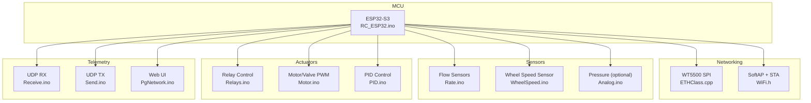
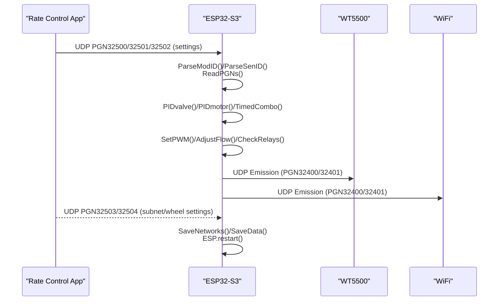
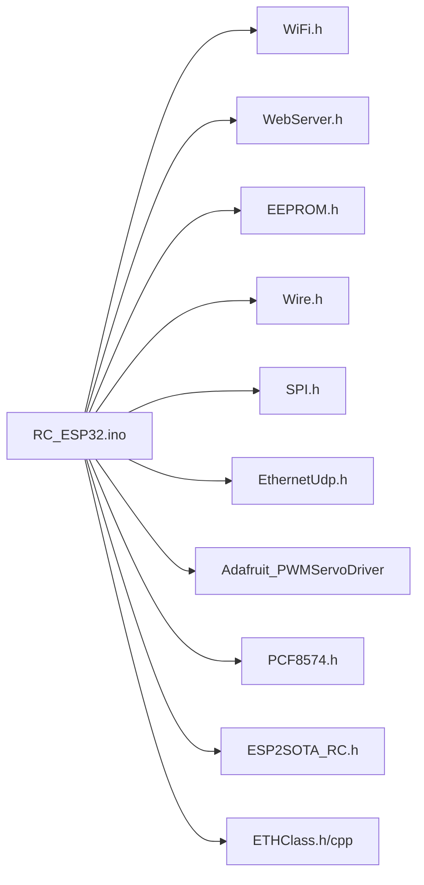
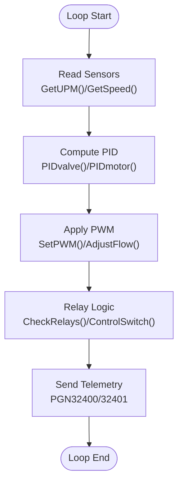

# Getting Started

<cite>
**Referenced Files in This Document**
- [RC_ESP32.ino](file://RC_ESP32/RC_ESP32.ino)
- [Begin.ino](file://RC_ESP32/Begin.ino)
- [PgNetwork.ino](file://RC_ESP32/PgNetwork.ino)
- [Motor.ino](file://RC_ESP32/Motor.ino)
- [PID.ino](file://RC_ESP32/PID.ino)
- [Rate.ino](file://RC_ESP32/Rate.ino)
- [WheelSpeed.ino](file://RC_ESP32/WheelSpeed.ino)
- [Receive.ino](file://RC_ESP32/Receive.ino)
- [Send.ino](file://RC_ESP32/Send.ino)
- [Relays.ino](file://RC_ESP32/Relays.ino)
- [Analog.ino](file://RC_ESP32/Analog.ino)
- [PCA95x5_RC.h](file://RC_ESP32/PCA95x5_RC.h)
- [Notes.txt](file://Notes.txt)
- [FORK_CHANGES.md](file://FORK_CHANGES.md)
- [WT5500.ino](file://OLD CODE/RC_ESP32/WT5500.ino)
- [ETHClass.cpp](file://OLD CODE/RC_ESP32/ETHClass.cpp)
- [ETHClass.h](file://OLD CODE/RC_ESP32/ETHClass.h)
</cite>

## Table of Contents
1. [Introduction](#introduction)
2. [Project Structure](#project-structure)
3. [Core Components](#core-components)
4. [Architecture Overview](#architecture-overview)
5. [Detailed Component Analysis](#detailed-component-analysis)
6. [Dependency Analysis](#dependency-analysis)
7. [Performance Considerations](#performance-considerations)
8. [Troubleshooting Guide](#troubleshooting-guide)
9. [Conclusion](#conclusion)
10. [Appendices](#appendices)

## Introduction
This guide helps you assemble, configure, and operate the ESP32 Rate Control module for agricultural applications. It covers hardware requirements, software prerequisites, step-by-step assembly, initial firmware compilation and upload, first-time configuration, safety guidelines, and verification procedures.

## Project Structure
The project centers around an ESP32-S3-based board with integrated Ethernet (via WT5500 SPI), I2C peripherals, and real-time control logic for valves and motors. Key functional areas include:
- Initialization and configuration (EEPROM, I2C, Ethernet, WiFi AP)
- Real-time flow sensing and rate calculation
- PID control for valves and motors
- Relay control via onboard or external I/O expanders
- Wireless and wired telemetry to the AgOpenGPS Rate Control app

**Diagram sources**
- [RC_ESP32.ino:250-280](file://RC_ESP32/RC_ESP32.ino#L250-L280)
- [Begin.ino:87-122](file://RC_ESP32/Begin.ino#L87-L122)
- [Rate.ino:31-74](file://RC_ESP32/Rate.ino#L31-L74)
- [WheelSpeed.ino:31-69](file://RC_ESP32/WheelSpeed.ino#L31-L69)
- [Analog.ino:2-46](file://RC_ESP32/Analog.ino#L2-L46)
- [Relays.ino:11-69](file://RC_ESP32/Relays.ino#L11-L69)
- [Motor.ino:2-29](file://RC_ESP32/Motor.ino#L2-L29)
- [PID.ino:25-67](file://RC_ESP32/PID.ino#L25-L67)
- [Receive.ino:2-27](file://RC_ESP32/Receive.ino#L2-L27)
- [Send.ino:1-92](file://RC_ESP32/Send.ino#L1-L92)
- [PgNetwork.ino:1-155](file://RC_ESP32/PgNetwork.ino#L1-L155)

**Section sources**
- [RC_ESP32.ino:250-280](file://RC_ESP32/RC_ESP32.ino#L250-L280)
- [Begin.ino:87-122](file://RC_ESP32/Begin.ino#L87-L122)

## Core Components
- MCU and runtime: ESP32-S3 with real-time loop, interrupts, and telemetry.
- Networking: Ethernet via WT5500 SPI and SoftAP/STA for wireless connectivity.
- Sensors: Pulse-based flow sensors and optional wheel speed and pressure sensors.
- Actuation: PWM-controlled valves/motors and relay switching via onboard or external I/O expanders.
- Telemetry: UDP messages to/from the Rate Control app over Ethernet or WiFi.

Key implementation highlights:
- Real-time loop and periodic tasks for control and telemetry.
- Interrupt-driven pulse counting for flow and wheel speed.
- PID control for valves and motors with configurable gains and limits.
- Web UI for network configuration and diagnostics.

**Section sources**
- [RC_ESP32.ino:179-183](file://RC_ESP32/RC_ESP32.ino#L179-L183)
- [Rate.ino:14-29](file://RC_ESP32/Rate.ino#L14-L29)
- [PID.ino:69-126](file://RC_ESP32/PID.ino#L69-L126)
- [Send.ino:25-92](file://RC_ESP32/Send.ino#L25-L92)

## Architecture Overview
The system integrates multiple communication paths and control loops. The ESP32-S3 initializes I2C, Ethernet (WT5500), and WiFi, then runs a control loop that reads sensors, computes targets, adjusts actuators, and sends telemetry.

**Diagram sources**
- [Receive.ino:29-343](file://RC_ESP32/Receive.ino#L29-L343)
- [PID.ino:25-178](file://RC_ESP32/PID.ino#L25-L178)
- [Motor.ino:31-60](file://RC_ESP32/Motor.ino#L31-L60)
- [Relays.ino:11-69](file://RC_ESP32/Relays.ino#L11-L69)
- [Send.ino:1-193](file://RC_ESP32/Send.ino#L1-L193)

## Detailed Component Analysis

### Hardware Requirements
- ESP32-S3 development board (custom board with WT5500 Ethernet and I2C peripherals).
- WT5500 Ethernet module (SPI) with the following pin mapping:
  - MISO: GPIO 37
  - MOSI: GPIO 35
  - SCLK: GPIO 36
  - CS: GPIO 38
  - INT: GPIO 45
  - RST: GPIO 48
- I2C devices:
  - PCF8574 GPIO expander (I2C address 0x20)
  - PCA9555/PCA9535 I/O expanders (I2C address 0x20)
  - MCP23017 I/O expander (I2C address 0x20 or 0x21)
  - PCA9685 PWM driver (I2C address 0x55 on original; see ESP32-S3 changes)
- Motor drivers and solenoid valves compatible with 2-wire or 3-wire control.
- Flow sensors with pulse output.
- Optional pressure sensor (ADS1115) and wheel speed sensor.
- Power supply suitable for the board and attached peripherals.

Notes on ESP32-S3 migration:
- I2C pins differ from ESP32 (SDA/SCL moved).
- PCA9685 address and OutputEnablePin usage changed.
- SPI Ethernet replaced with WT5500 via custom ETHClass.

**Section sources**
- [WT5500.ino:1-17](file://OLD CODE/RC_ESP32/WT5500.ino#L1-L17)
- [Begin.ino:54-56](file://RC_ESP32/Begin.ino#L54-L56)
- [FORK_CHANGES.md:76-90](file://FORK_CHANGES.md#L76-L90)
- [FORK_CHANGES.md:92-96](file://FORK_CHANGES.md#L92-L96)

### Software Prerequisites
- Arduino IDE with ESP32-S3 board package installed.
- Required libraries:
  - WiFi, WebServer, EEPROM, Wire, SPI, EthernetUdp
  - Adafruit_PWMServoDriver
  - PCF8574
  - ESP2SOTA (OTA updates)
- Ensure library versions match ESP32-S3 core compatibility.

**Section sources**
- [RC_ESP32.ino:12-25](file://RC_ESP32/RC_ESP32.ino#L12-L25)
- [FORK_CHANGES.md:18-28](file://FORK_CHANGES.md#L18-L28)

### Step-by-Step Hardware Assembly
1. Mount the ESP32-S3 board and connect the WT5500 Ethernet module to the designated SPI pins.
2. Wire I2C devices (PCF8574, PCA9555/PCA9535, MCP23017, PCA9685) to the I2C bus.
3. Connect flow sensors to interrupt-capable pins and configure sensor pins in firmware defaults.
4. Wire motor drivers and solenoid valves to PWM pins and relays.
5. Connect optional pressure sensor (ADS1115) and wheel speed sensor if used.
6. Verify power and ground connections; ensure no short circuits.

Note: ESP32-S3 I2C pins differ from ESP32. Use SDA 8 and SCL 18.

**Section sources**
- [WT5500.ino:51-60](file://OLD CODE/RC_ESP32/WT5500.ino#L51-L60)
- [Begin.ino:54-56](file://RC_ESP32/Begin.ino#L54-L56)
- [FORK_CHANGES.md:76-90](file://FORK_CHANGES.md#L76-L90)

### Initial Firmware Compilation and Upload
1. Open the sketch in Arduino IDE.
2. Select the ESP32-S3 board (e.g., “ESP32S3 Dev Module”).
3. Install required libraries via Library Manager.
4. Compile and upload the firmware.
5. Monitor the serial console for initialization logs and confirm Ethernet/WiFi startup.

Common issues:
- Board not selected or wrong core installed.
- Missing libraries or incompatible versions.
- I2C bus conflicts or incorrect pin assignments.

**Section sources**
- [FORK_CHANGES.md:18-28](file://FORK_CHANGES.md#L18-L28)
- [Begin.ino:256-344](file://RC_ESP32/Begin.ino#L256-L344)

### First-Time Configuration
1. Connect to the ESP32 SoftAP (SSID starts with “RateModule…”). The AP subnet is 192.168.(module number + 200).xxx.
2. Open the web UI and navigate to the network configuration page.
3. Set the target subnet for the Rate Control app and save.
4. Optionally set WiFi credentials for station mode.
5. Restart the module to apply changes.

Verification:
- Confirm the module’s IP appears in the SoftAP subnet.
- Check the web UI status for Ethernet/WiFi connectivity and pin configuration.

**Section sources**
- [Notes.txt:1-8](file://Notes.txt#L1-L8)
- [PgNetwork.ino:100-151](file://RC_ESP32/PgNetwork.ino#L100-L151)
- [Begin.ino:173-254](file://RC_ESP32/Begin.ino#L173-L254)

### Safety Guidelines
- Always disconnect power before connecting or disconnecting wires.
- Use appropriate current-limiting resistors for optocouplers and signal conditioning.
- Ensure proper grounding and isolation for pressure/flow sensors.
- Avoid mixing 5V and 3.3V logic levels directly.
- Keep Ethernet and power traces away from sensitive analog sensor wiring.

[No sources needed since this section provides general guidance]

### Verification Procedures
- Confirm Ethernet link status and IP assignment.
- Validate sensor pulses are detected and UPM readings update.
- Test relay switching via the web UI and verify actuator response.
- Verify UDP telemetry packets are received by the Rate Control app.
- Check PID tuning parameters and adjust for desired response.

**Section sources**
- [Begin.ino:96-118](file://RC_ESP32/Begin.ino#L96-L118)
- [Rate.ino:31-74](file://RC_ESP32/Rate.ino#L31-L74)
- [Send.ino:25-92](file://RC_ESP32/Send.ino#L25-L92)
- [Relays.ino:11-69](file://RC_ESP32/Relays.ino#L11-L69)

## Dependency Analysis
The system relies on several libraries and modules. Dependencies include:
- ESP32-S3 core and WiFi/Ethernet stacks
- Adafruit_PWMServoDriver for PCA9685
- PCF8574 for GPIO expansion
- ESP2SOTA for OTA updates
- Custom ETHClass for WT5500 SPI Ethernet

**Diagram sources**
- [RC_ESP32.ino:12-25](file://RC_ESP32/RC_ESP32.ino#L12-L25)
- [ETHClass.h:60-113](file://OLD CODE/RC_ESP32/ETHClass.h#L60-L113)

**Section sources**
- [RC_ESP32.ino:12-25](file://RC_ESP32/RC_ESP32.ino#L12-L25)
- [ETHClass.h:60-113](file://OLD CODE/RC_ESP32/ETHClass.h#L60-L113)

## Performance Considerations
- Real-time loop runs at approximately 20 Hz; keep ISR routines minimal.
- Use median filtering for pulse measurements to reduce noise.
- Tune PID parameters carefully to avoid oscillations and integral windup.
- Limit I2C polling and conversions to reduce CPU load.
- Prefer event-driven Ethernet link status (as implemented) to avoid busy-waiting.

[No sources needed since this section provides general guidance]

## Troubleshooting Guide
- No Ethernet link:
  - Verify WT5500 wiring and chip detection.
  - Check custom ETHClass initialization and event handling.
- WiFi station disconnects:
  - The module falls back to AP-only mode after repeated failures.
- I2C device not found:
  - Confirm addresses and pull-ups; verify SDA/SCL pin mapping.
- Incorrect pin configuration:
  - Review valid pin lists and saved EEPROM settings.
- Telemetry not received:
  - Confirm subnet settings and destination IP broadcast.

**Section sources**
- [Begin.ino:96-118](file://RC_ESP32/Begin.ino#L96-L118)
- [WT5500.ino:20-78](file://OLD CODE/RC_ESP32/WT5500.ino#L20-L78)
- [Begin.ino:347-511](file://RC_ESP32/Begin.ino#L347-L511)
- [Notes.txt:6-8](file://Notes.txt#L6-L8)

## Conclusion
With the correct hardware assembly, ESP32-S3 board configuration, and firmware upload, the module provides robust rate control over Ethernet and WiFi. Follow the configuration steps and verification procedures to ensure reliable operation before agricultural deployment.

[No sources needed since this section summarizes without analyzing specific files]

## Appendices

### Wiring Reference (ESP32-S3)
- I2C: SDA 8, SCL 18
- WT5500 SPI: MISO 37, MOSI 35, SCLK 36, CS 38, INT 45, RST 48
- Flow sensors: interrupt-capable pins (default in firmware)
- PWM/Relays: configurable pins per module settings

**Section sources**
- [Begin.ino:54-56](file://RC_ESP32/Begin.ino#L54-L56)
- [WT5500.ino:51-60](file://OLD CODE/RC_ESP32/WT5500.ino#L51-L60)
- [Begin.ino:569-619](file://RC_ESP32/Begin.ino#L569-L619)

### Control Logic Flow (Rate Control)

**Diagram sources**
- [Rate.ino:31-74](file://RC_ESP32/Rate.ino#L31-L74)
- [PID.ino:69-178](file://RC_ESP32/PID.ino#L69-L178)
- [Motor.ino:2-60](file://RC_ESP32/Motor.ino#L2-L60)
- [Relays.ino:11-69](file://RC_ESP32/Relays.ino#L11-L69)
- [Send.ino:25-193](file://RC_ESP32/Send.ino#L25-L193)