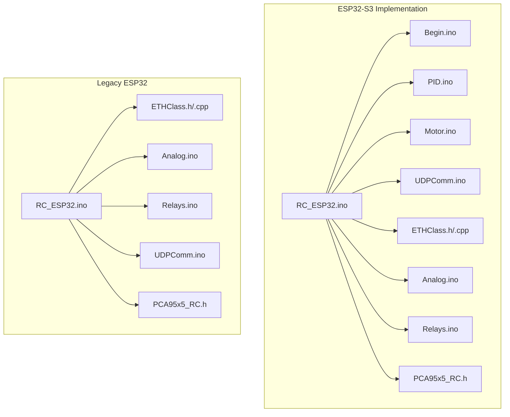
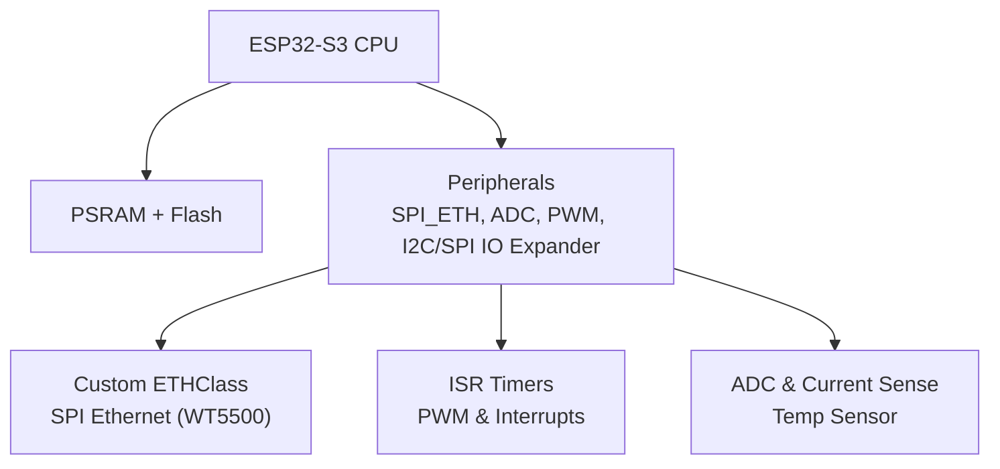
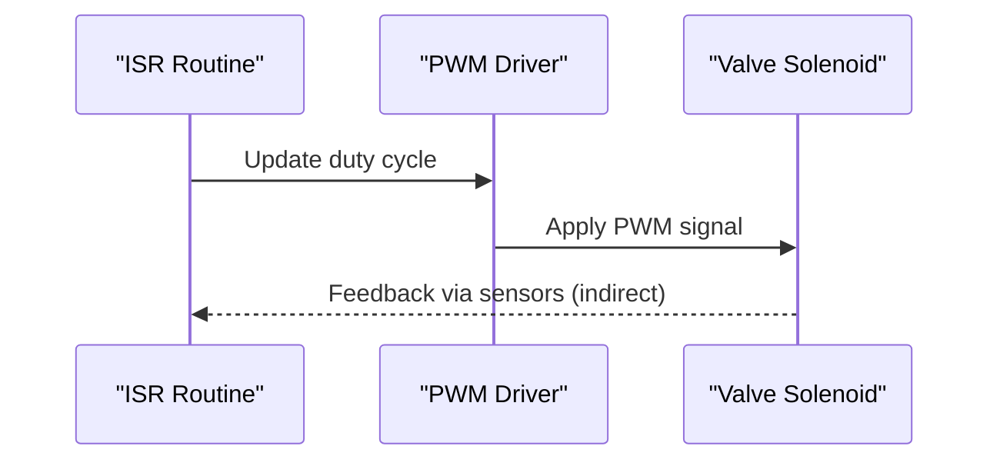
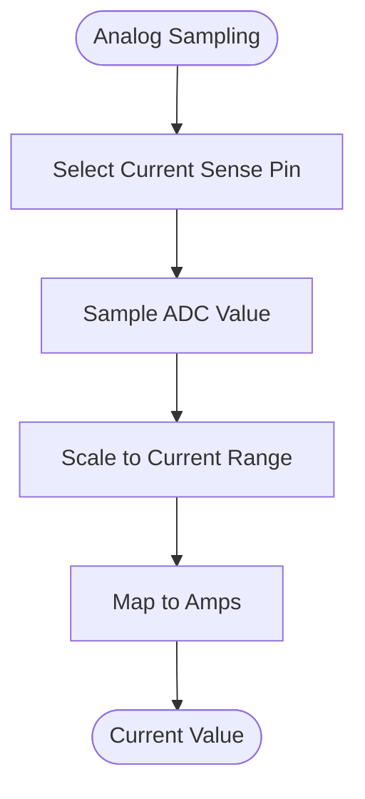
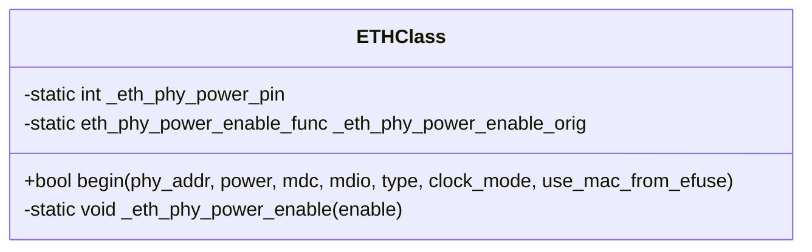
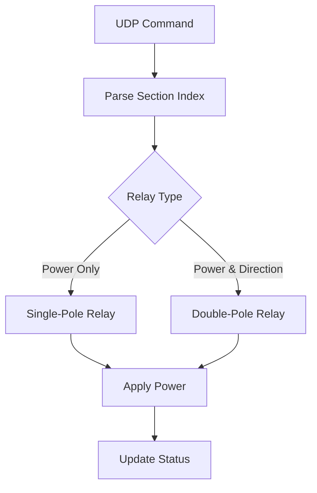
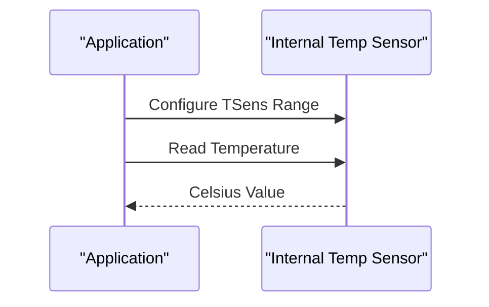
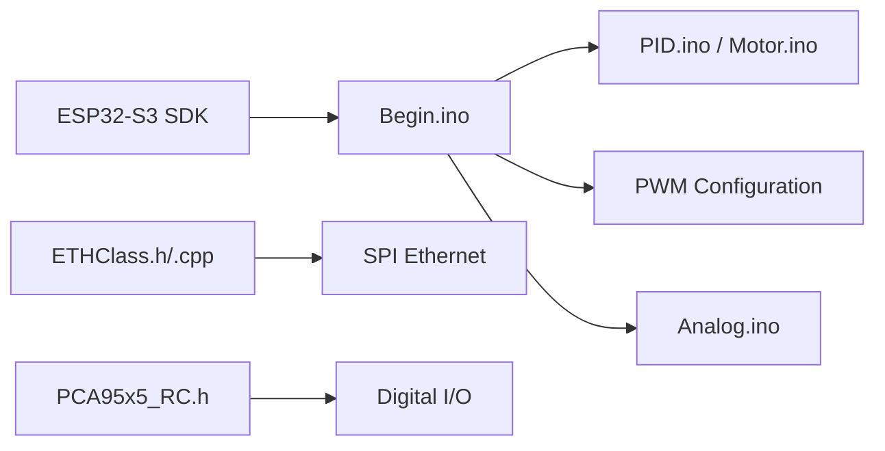
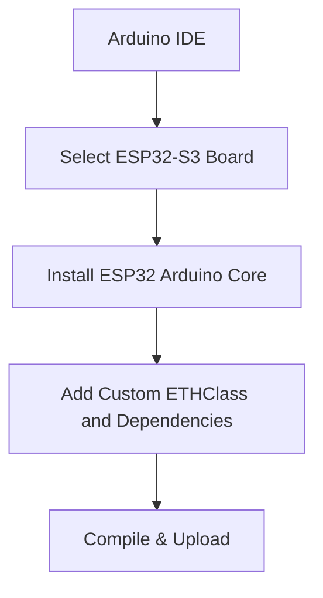
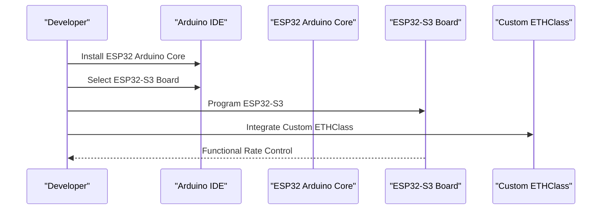

# ESP32-S3 Platform Specifications

<cite>
**Referenced Files in This Document**
- [FORK_CHANGES.md](file://FORK_CHANGES.md)
- [debug.cfg](file://OLD CODE/RC_ESP32/debug.cfg)
- [debug_custom.json](file://OLD CODE/RC_ESP32/debug_custom.json)
- [debug.svd](file://OLD CODE/RC_ESP32/debug.svd)
- [Begin.ino](file://RC_ESP32/Begin.ino)
- [Analog.ino](file://OLD CODE/RC_ESP32/Analog.ino)
- [ETHClass.h](file://OLD CODE/RC_ESP32/ETHClass.h)
- [ETHClass.cpp](file://OLD CODE/RC_ESP32/ETHClass.cpp)
- [PID.ino](file://RC_ESP32/PID.ino)
- [Motor.ino](file://RC_ESP32/Motor.ino)
- [Relays.ino](file://OLD CODE/RC_ESP32/Relays.ino)
- [UDPComm.ino](file://OLD CODE/RC_ESP32/UDPComm.ino)
- [PCA95x5_RC.h](file://RC_ESP32/PCA95x5_RC.h)
- [PCA95x5_RC.h](file://OLD CODE/RC_ESP32/PCA95x5_RC.h)
</cite>

## Table of Contents
1. [Introduction](#introduction)
2. [Project Structure](#project-structure)
3. [Core Components](#core-components)
4. [Architecture Overview](#architecture-overview)
5. [Detailed Component Analysis](#detailed-component-analysis)
6. [Dependency Analysis](#dependency-analysis)
7. [Performance Considerations](#performance-considerations)
8. [Power and Thermal Management](#power-and-thermal-management)
9. [Development Environment Setup](#development-environment-setup)
10. [Migration from ESP32 to ESP32-S3](#migration-from-esp32-to-esp32-s3)
11. [Platform Limitations and Design Implications](#platform-limitations-and-design-imlications)
12. [Troubleshooting Guide](#troubleshooting-guide)
13. [Conclusion](#conclusion)

## Introduction
This document consolidates platform specifications and migration details for the ESP32-S3 used in the rate control system. It covers microcontroller architecture, clock behavior, memory layout, power requirements, and thermal management as evidenced by the repository. It also documents the migration from the original ESP32, including hardware differences, pin mapping changes, and performance-related adjustments visible in the codebase.

## Project Structure
The repository contains two primary codebases:
- OLD CODE/RC_ESP32: Legacy ESP32-based implementation and supporting files (debugging, Ethernet, sensors).
- RC_ESP32: ESP32-S3-based implementation with updated components and platform-specific adaptations.

Key files relevant to platform specifics:
- Migration notes and pin mapping: [FORK_CHANGES.md](file://FORK_CHANGES.md)
- Debugging and toolchain configuration: [debug.cfg](file://OLD CODE/RC_ESP32/debug.cfg), [debug_custom.json](file://OLD CODE/RC_ESP32/debug_custom.json), [debug.svd](file://OLD CODE/RC_ESP32/debug.svd)
- Core runtime and peripherals: [Begin.ino](file://RC_ESP32/Begin.ino), [Analog.ino](file://OLD CODE/RC_ESP32/Analog.ino)
- Network and Ethernet: [ETHClass.h](file://OLD CODE/RC_ESP32/ETHClass.h), [ETHClass.cpp](file://OLD CODE/RC_ESP32/ETHClass.cpp)
- Control logic: [PID.ino](file://RC_ESP32/PID.ino), [Motor.ino](file://RC_ESP32/Motor.ino)
- Power relays and current sensing: [Relays.ino](file://OLD CODE/RC_ESP32/Relays.ino), [Analog.ino](file://OLD CODE/RC_ESP32/Analog.ino)
- Communication: [UDPComm.ino](file://OLD CODE/RC_ESP32/UDPComm.ino)
- I/O expanders: [PCA95x5_RC.h](file://RC_ESP32/PCA95x5_RC.h), [PCA95x5_RC.h](file://OLD CODE/RC_ESP32/PCA95x5_RC.h)

**Section sources**
- [FORK_CHANGES.md](file://FORK_CHANGES.md)
- [Begin.ino](file://RC_ESP32/Begin.ino)
- [Analog.ino](file://OLD CODE/RC_ESP32/Analog.ino)
- [ETHClass.h](file://OLD CODE/RC_ESP32/ETHClass.h)
- [ETHClass.cpp](file://OLD CODE/RC_ESP32/ETHClass.cpp)
- [PID.ino](file://RC_ESP32/PID.ino)
- [Motor.ino](file://RC_ESP32/Motor.ino)
- [UDPComm.ino](file://OLD CODE/RC_ESP32/UDPComm.ino)
- [Relays.ino](file://OLD CODE/RC_ESP32/Relays.ino)
- [PCA95x5_RC.h](file://RC_ESP32/PCA95x5_RC.h)
- [PCA95x5_RC.h](file://OLD CODE/RC_ESP32/PCA95x5_RC.h)

## Core Components
- Real-time control loop: Implemented via ISR routines and periodic tasks in the legacy code, with PWM configuration and frequency tuning present in the ESP32-S3 codebase.
- Analog front-end: Includes ADC sampling and current sensing for relays and motor drivers.
- Network stack: Uses a custom Ethernet class for SPI Ethernet (WT5500) on ESP32-S3, differing from the original ESP32’s native Ethernet.
- Power management: Relays control for solenoid valves and motor drivers; current monitoring via analog channels.
- I/O expansion: PCA95x5-based I/O expanders for additional digital lines.

**Section sources**
- [Begin.ino](file://RC_ESP32/Begin.ino)
- [Analog.ino](file://OLD CODE/RC_ESP32/Analog.ino)
- [ETHClass.h](file://OLD CODE/RC_ESP32/ETHClass.h)
- [ETHClass.cpp](file://OLD CODE/RC_ESP32/ETHClass.cpp)
- [Relays.ino](file://OLD CODE/RC_ESP32/Relays.ino)
- [PCA95x5_RC.h](file://RC_ESP32/PCA95x5_RC.h)

## Architecture Overview
The ESP32-S3 architecture in this project centers around:
- CPU and memory: The build artifacts indicate ESP32-S3 SDK linkage and CPU frequency APIs, reflecting the ESP32-S3 core.
- Peripherals: Dedicated SPI Ethernet controller and WT5500 PHY via custom driver; internal temperature sensor support; configurable PWM frequencies; ADC for current sensing.
- Networking: Custom Ethernet class replaces the standard Ethernet library for SPI Ethernet operation.
- Real-time timing: ISR-based interrupts and configurable PWM frequencies for actuator control.

**Section sources**
- [debug.svd](file://OLD CODE/RC_ESP32/debug.svd)
- [Begin.ino](file://RC_ESP32/Begin.ino)
- [Analog.ino](file://OLD CODE/RC_ESP32/Analog.ino)
- [ETHClass.h](file://OLD CODE/RC_ESP32/ETHClass.h)
- [ETHClass.cpp](file://OLD CODE/RC_ESP32/ETHClass.cpp)

## Detailed Component Analysis

### Real-Time Control Loop and PWM
- PWM frequency adjustment is explicitly configured to accommodate specific valve behavior.
- ISR routines are marked for real-time execution, indicating timing-critical control loops.

**Section sources**
- [Begin.ino](file://RC_ESP32/Begin.ino)

### Analog Front-End and Current Sensing
- ADC sampling and mapping to current ranges are implemented for relay and motor current monitoring.
- Current sense pins and scaling are defined in the pin mapping table.

**Section sources**
- [Analog.ino](file://OLD CODE/RC_ESP32/Analog.ino)
- [FORK_CHANGES.md](file://FORK_CHANGES.md)

### Network Stack and SPI Ethernet
- A custom Ethernet class encapsulates WT5500 PHY initialization and power control.
- The class supports configurable PHY address, power pin, MDC/MDIO pins, and clock mode.

**Diagram sources**
- [ETHClass.h](file://OLD CODE/RC_ESP32/ETHClass.h)
- [ETHClass.cpp](file://OLD CODE/RC_ESP32/ETHClass.cpp)

**Section sources**
- [ETHClass.h](file://OLD CODE/RC_ESP32/ETHClass.h)
- [ETHClass.cpp](file://OLD CODE/RC_ESP32/ETHClass.cpp)
- [FORK_CHANGES.md](file://FORK_CHANGES.md)

### Power Relays and Actuator Control
- Power relays manage 16 sections for solenoid valves (single-pole) and 8 sections for reversible motor drivers (double-pole).
- Relay logic integrates with UDP commands for remote control.

**Section sources**
- [Relays.ino](file://OLD CODE/RC_ESP32/Relays.ino)
- [UDPComm.ino](file://OLD CODE/RC_ESP32/UDPComm.ino)
- [FORK_CHANGES.md](file://FORK_CHANGES.md)

### Internal Temperature Monitoring
- The ESP32-S3 internal temperature sensor is configured and used for thermal monitoring.
- Temperature range is set to a specific TSens range suitable for typical operating conditions.

**Section sources**
- [FORK_CHANGES.md](file://FORK_CHANGES.md)

## Dependency Analysis
- Core runtime depends on ESP32-S3 SDK and CPU frequency APIs evident in build artifacts.
- Network stack depends on a custom Ethernet class for SPI Ethernet (WT5500).
- Control logic depends on ISR routines and PWM configuration.
- I/O expanders depend on PCA95x5 registers and GPIO mapping.

**Section sources**
- [debug.svd](file://OLD CODE/RC_ESP32/debug.svd)
- [Begin.ino](file://RC_ESP32/Begin.ino)
- [PID.ino](file://RC_ESP32/PID.ino)
- [Motor.ino](file://RC_ESP32/Motor.ino)
- [Analog.ino](file://OLD CODE/RC_ESP32/Analog.ino)
- [ETHClass.h](file://OLD CODE/RC_ESP32/ETHClass.h)
- [ETHClass.cpp](file://OLD CODE/RC_ESP32/ETHClass.cpp)
- [PCA95x5_RC.h](file://RC_ESP32/PCA95x5_RC.h)

## Performance Considerations
- CPU frequency APIs and configurable PWM frequency indicate dynamic performance tuning for deterministic control.
- SPI Ethernet configuration and clock modes influence network throughput and latency.
- ISR routines and interrupt-driven control require careful scheduling to maintain real-time response.

[No sources needed since this section provides general guidance]

## Power and Thermal Management
- Internal temperature sensor is enabled and configured for monitoring core temperature.
- PWM frequency adjustments impact switching losses and heating in drivers and solenoids.
- Relays and motor drivers consume significant power; ensure adequate power delivery and thermal dissipation.

**Section sources**
- [FORK_CHANGES.md](file://FORK_CHANGES.md)
- [Begin.ino](file://RC_ESP32/Begin.ino)
- [Relays.ino](file://OLD CODE/RC_ESP32/Relays.ino)

## Development Environment Setup
- Toolchain: OpenOCD configuration targets ESP32-S3 via USB-JTAG.
- Board selection: ESP32-S3 variant (e.g., “ESP32S3 Dev Module”) in Arduino IDE.
- Core: ESP32 Arduino Core (ESP SDK v2.x or v3.x) for ESP32-S3, distinct from the original ESP32 SDK.
- Libraries: Custom Ethernet class replaces standard Ethernet; WiFiUDP used for Ethernet stack on ESP32-S3.

**Section sources**
- [FORK_CHANGES.md](file://FORK_CHANGES.md)
- [debug.cfg](file://OLD CODE/RC_ESP32/debug.cfg)
- [debug_custom.json](file://OLD CODE/RC_ESP32/debug_custom.json)

## Migration from ESP32 to ESP32-S3
Key migration changes documented in the repository:
- Hardware platform: ESP32 DOIT DevKit to ESP32-S3 custom board.
- Core and board: ESP32 Arduino Core for ESP32-S3; board selection “ESP32S3 Dev Module”.
- Ethernet: Replace standard Ethernet with custom ETHClass for SPI Ethernet (WT5500).
- Temperature sensor: Use internal temp sensor driver; configure TSens range.
- UDP class: Use WiFiUDP for Ethernet stack on ESP32-S3.
- Pin mapping: Significant changes for signals including current sense pins and others.

**Section sources**
- [FORK_CHANGES.md](file://FORK_CHANGES.md)

## Platform Limitations and Design Implications
- Memory: PSRAM and flash usage are implied by SDK linkage; ensure sufficient heap for networking and real-time tasks.
- Clock behavior: CPU frequency APIs suggest dynamic scaling; validate timing-critical paths under different frequencies.
- Peripherals: SPI Ethernet requires dedicated pins and power control; ensure routing and supply stability.
- Thermal: Internal temperature monitoring indicates need for thermal management; verify heatsinking and airflow for continuous operation.
- I/O: PCA95x5-based expanders require proper addressing and timing; verify bus integrity under load.

**Section sources**
- [debug.svd](file://OLD CODE/RC_ESP32/debug.svd)
- [Begin.ino](file://RC_ESP32/Begin.ino)
- [ETHClass.cpp](file://OLD CODE/RC_ESP32/ETHClass.cpp)
- [PCA95x5_RC.h](file://RC_ESP32/PCA95x5_RC.h)

## Troubleshooting Guide
- Debugging: Use OpenOCD with ESP32-S3 JTAG configuration for on-chip debugging.
- Network connectivity: Verify custom ETHClass initialization parameters (PHY address, power pin, MDC/MDIO, clock mode).
- PWM behavior: Confirm PWM frequency configuration matches actuator requirements.
- Temperature monitoring: Ensure internal temperature sensor is initialized and read correctly.
- Communication: Validate UDP command parsing and relay control logic.

**Section sources**
- [debug.cfg](file://OLD CODE/RC_ESP32/debug.cfg)
- [debug_custom.json](file://OLD CODE/RC_ESP32/debug_custom.json)
- [ETHClass.h](file://OLD CODE/RC_ESP32/ETHClass.h)
- [ETHClass.cpp](file://OLD CODE/RC_ESP32/ETHClass.cpp)
- [Begin.ino](file://RC_ESP32/Begin.ino)
- [FORK_CHANGES.md](file://FORK_CHANGES.md)

## Conclusion
The ESP32-S3 platform in this rate control system leverages dynamic CPU frequency, configurable PWM, and a custom SPI Ethernet stack for reliable operation. Migration from ESP32 introduces new core requirements, Ethernet libraries, and pin mappings, while retaining real-time control via ISRs and analog front-end monitoring. Proper thermal management, power delivery, and peripheral configuration are essential for robust performance.