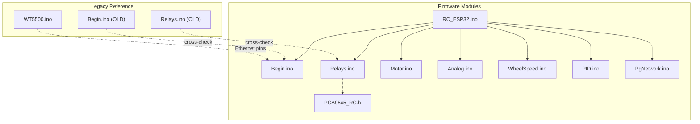
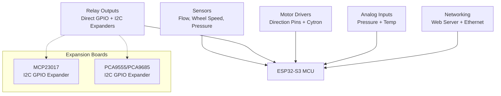
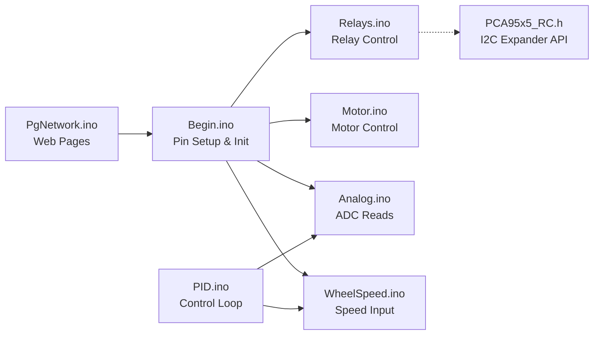

# GPIO Pin Assignments and Connections

<cite>
**Referenced Files in This Document**
- [RC_ESP32.ino](file://RC_ESP32/RC_ESP32.ino)
- [Begin.ino](file://RC_ESP32/Begin.ino)
- [Relays.ino](file://RC_ESP32/Relays.ino)
- [Motor.ino](file://RC_ESP32/Motor.ino)
- [Analog.ino](file://RC_ESP32/Analog.ino)
- [WheelSpeed.ino](file://RC_ESP32/WheelSpeed.ino)
- [PID.ino](file://RC_ESP32/PID.ino)
- [PgNetwork.ino](file://RC_ESP32/PgNetwork.ino)
- [PCA95x5_RC.h](file://RC_ESP32/PCA95x5_RC.h)
- [WT5500.ino](file://OLD CODE/RC_ESP32/WT5500.ino)
- [Begin.ino (OLD)](file://OLD CODE/RC_ESP32/Begin.ino)
- [Relays.ino (OLD)](file://OLD CODE/RC_ESP32/Relays.ino)
</cite>

## Table of Contents
1. [Introduction](#introduction)
2. [Project Structure](#project-structure)
3. [Core Components](#core-components)
4. [Architecture Overview](#architecture-overview)
5. [Detailed Component Analysis](#detailed-component-analysis)
6. [Dependency Analysis](#dependency-analysis)
7. [Performance Considerations](#performance-considerations)
8. [Troubleshooting Guide](#troubleshooting-guide)
9. [Conclusion](#conclusion)
10. [Appendices](#appendices)

## Introduction
This document provides a comprehensive GPIO pin mapping and connection guide for the ESP32-S3-based rate control system. It documents the complete pin assignment matrix for relays, motor drivers, analog sensors, and expansion boards, along with pin function descriptions, pull-up/pull-down configurations, and signal conditioning requirements. It also includes wiring diagrams and notes on pin conflicts, shared peripherals, and multiplexing considerations derived from the codebase.

## Project Structure
The rate control firmware is organized into modular components that handle initialization, sensor input, motor control, relay switching, analog measurement, wheel speed sensing, PID control, networking, and web UI pages. The primary functional modules are located under the RC_ESP32 directory, with legacy pin assignments preserved in the OLD CODE/RC_ESP32 directory for cross-reference.

**Diagram sources**
- [RC_ESP32.ino](file://RC_ESP32/RC_ESP32.ino)
- [Begin.ino](file://RC_ESP32/Begin.ino)
- [Relays.ino](file://RC_ESP32/Relays.ino)
- [Motor.ino](file://RC_ESP32/Motor.ino)
- [Analog.ino](file://RC_ESP32/Analog.ino)
- [WheelSpeed.ino](file://RC_ESP32/WheelSpeed.ino)
- [PID.ino](file://RC_ESP32/PID.ino)
- [PgNetwork.ino](file://RC_ESP32/PgNetwork.ino)
- [PCA95x5_RC.h](file://RC_ESP32/PCA95x5_RC.h)
- [Begin.ino (OLD)](file://OLD CODE/RC_ESP32/Begin.ino)
- [Relays.ino (OLD)](file://OLD CODE/RC_ESP32/Relays.ino)
- [WT5500.ino](file://OLD CODE/RC_ESP32/WT5500.ino)

**Section sources**
- [RC_ESP32.ino](file://RC_ESP32/RC_ESP32.ino)
- [Begin.ino](file://RC_ESP32/Begin.ino)
- [Relays.ino](file://RC_ESP32/Relays.ino)
- [Motor.ino](file://RC_ESP32/Motor.ino)
- [Analog.ino](file://RC_ESP32/Analog.ino)
- [WheelSpeed.ino](file://RC_ESP32/WheelSpeed.ino)
- [PID.ino](file://RC_ESP32/PID.ino)
- [PgNetwork.ino](file://RC_ESP32/PgNetwork.ino)
- [PCA95x5_RC.h](file://RC_ESP32/PCA95x5_RC.h)
- [Begin.ino (OLD)](file://OLD CODE/RC_ESP32/Begin.ino)
- [Relays.ino (OLD)](file://OLD CODE/RC_ESP32/Relays.ino)
- [WT5500.ino](file://OLD CODE/RC_ESP32/WT5500.ino)

## Core Components
This section summarizes the roles of major components and their associated GPIO usage patterns as evidenced by the codebase.

- Initialization and Pin Setup
  - Sensors: Flow sensor pins configured as input with internal pull-up; wheel speed sensor pin configured as input with internal pull-up.
  - Relays: Direct GPIO outputs; optional PCA/I2C expansion via MCP23017/PCA9555.
  - Motor Drivers: Direction pins configured as outputs; Cytron driver uses a dedicated output pin.
  - Analog Inputs: Pressure sensor pin read via analog input.
  - Network: Ethernet PHY pins defined for RMII interface.

- Relay Control
  - Direct GPIO relay pins and I2C expanders (MCP23017/PCA9555) support multiple relay banks.
  - Polarity controlled by configuration flags.

- Motor Control
  - Direction control via IN1/IN2 pins per sensor channel.
  - Special-case handling for specific relay-driven disable logic.

- Analog Measurement
  - Pressure sensor reading via analog pin.
  - Temperature sensor initialization and sampling.

- Wheel Speed Sensing
  - Hall effect or optical sensor input with pull-up enabled.

- PID Control
  - Feedback loop integrating wheel speed and pressure measurements.

- Networking
  - Web server pages and network configuration.

**Section sources**
- [Begin.ino](file://RC_ESP32/Begin.ino)
- [Relays.ino](file://RC_ESP32/Relays.ino)
- [Motor.ino](file://RC_ESP32/Motor.ino)
- [Analog.ino](file://RC_ESP32/Analog.ino)
- [WheelSpeed.ino](file://RC_ESP32/WheelSpeed.ino)
- [PID.ino](file://RC_ESP32/PID.ino)
- [PgNetwork.ino](file://RC_ESP32/PgNetwork.ino)
- [PCA95x5_RC.h](file://RC_ESP32/PCA95x5_RC.h)
- [Begin.ino (OLD)](file://OLD CODE/RC_ESP32/Begin.ino)
- [Relays.ino (OLD)](file://OLD CODE/RC_ESP32/Relays.ino)
- [WT5500.ino](file://OLD CODE/RC_ESP32/WT5500.ino)

## Architecture Overview
The system architecture integrates sensor inputs, relay outputs, motor driver control, analog measurement, and network connectivity through the ESP32-S3. The following diagram maps functional blocks to their GPIO usage and peripheral assignments.

**Diagram sources**
- [Begin.ino](file://RC_ESP32/Begin.ino)
- [Relays.ino](file://RC_ESP32/Relays.ino)
- [Motor.ino](file://RC_ESP32/Motor.ino)
- [Analog.ino](file://RC_ESP32/Analog.ino)
- [WheelSpeed.ino](file://RC_ESP32/WheelSpeed.ino)
- [PID.ino](file://RC_ESP32/PID.ino)
- [PgNetwork.ino](file://RC_ESP32/PgNetwork.ino)
- [PCA95x5_RC.h](file://RC_ESP32/PCA95x5_RC.h)

## Detailed Component Analysis

### Sensor Inputs and Pull-up Configurations
- Flow Sensor Pins
  - Function: Digital input with internal pull-up enabled.
  - Purpose: Detect pulses from flow sensors.
  - Typical ESP32-S3 Pins: Refer to initialization routines for specific assignments.
  - Notes: Internal pull-up reduces external resistor requirements.

- Wheel Speed Sensor Pin
  - Function: Digital input with internal pull-up enabled.
  - Purpose: Measure wheel rotation pulses for speed feedback.
  - Notes: Ensure adequate filtering and debouncing at the sensor level.

- Pressure Sensor Pin
  - Function: Analog input for pressure transducer.
  - Purpose: Provide continuous pressure feedback for PID control.
  - Notes: Use appropriate ADC resolution and calibration.

**Section sources**
- [Begin.ino](file://RC_ESP32/Begin.ino)
- [Analog.ino](file://RC_ESP32/Analog.ino)
- [WheelSpeed.ino](file://RC_ESP32/WheelSpeed.ino)

### Relay Outputs and Expansion Boards
- Direct GPIO Relays
  - Function: Digital outputs controlling relay modules.
  - Polarity: Controlled by configuration flags; logic-high or low activates relays depending on circuit design.
  - Optional: Disable motor drive based on specific relay state.

- I2C Expansion Boards
  - MCP23017: 16-bit GPIO expander accessed over I2C.
  - PCA9555/PCA9685: 16-bit GPIO or PWM expander accessed over I2C.
  - Wiring: Connect SDA/SCL to ESP32 I2C bus; enable internal pull-ups if needed.

- Relay Control Logic
  - Direct GPIO: Write logic levels to activate/deactivate relays.
  - I2C Expanders: Configure pin directions and write values via I2C transactions.

**Section sources**
- [Begin.ino](file://RC_ESP32/Begin.ino)
- [Relays.ino](file://RC_ESP32/Relays.ino)
- [PCA95x5_RC.h](file://RC_ESP32/PCA95x5_RC.h)
- [Begin.ino (OLD)](file://OLD CODE/RC_ESP32/Begin.ino)
- [Relays.ino (OLD)](file://OLD CODE/RC_ESP32/Relays.ino)

### Motor Driver Control
- Direction Pins
  - Function: Digital outputs controlling motor direction via H-bridge or similar driver.
  - Implementation: Per-sensor channel with IN1/IN2 pins configured as outputs.
  - Special Case: Motor drive may be disabled based on relay state.

- Cytron Driver
  - Dedicated output pin configured for driver enable/control.
  - Logic level determines operational state.

**Section sources**
- [Begin.ino](file://RC_ESP32/Begin.ino)
- [Motor.ino](file://RC_ESP32/Motor.ino)
- [Begin.ino (OLD)](file://OLD CODE/RC_ESP32/Begin.ino)

### Analog Inputs and Signal Conditioning
- Pressure Sensor
  - Function: Analog input for pressure measurement.
  - Sampling: ADC read performed in analog module.
  - Conditioning: Ensure proper voltage scaling and noise filtering.

- Temperature Sensor
  - Initialization: Temperature sensor configured and started during setup.
  - Sampling: Read temperature in degrees Celsius during runtime.

**Section sources**
- [Analog.ino](file://RC_ESP32/Analog.ino)
- [Begin.ino](file://RC_ESP32/Begin.ino)
- [PGInfo.ino](file://OLD CODE/RC_ESP32/PGInfo.ino)

### Networking and Ethernet Pins
- RMII Ethernet Pins
  - MISO: GPIO 37
  - MOSI: GPIO 35
  - SCLK: GPIO 36
  - CS: GPIO 38
  - INT: GPIO 45
  - RST: GPIO 48
  - Notes: These pins are used for the external Ethernet PHY interface.

**Section sources**
- [WT5500.ino](file://OLD CODE/RC_ESP32/WT5500.ino)

### Wiring Diagrams
The following diagrams illustrate typical physical connections between ESP32-S3 pins and external components. Replace pin numbers with the actual assignments from the initialization routines.

- Relay Module Wiring
  - ESP32 GPIO -> Relay Module Coil (+) via transistor switch
  - Relay Module GND -> ESP32 GND
  - Optional: Use I2C expander for additional relay channels

- Motor Driver Wiring
  - ESP32 GPIO -> IN1/IN2 (Driver Input)
  - ESP32 GPIO -> Enable/Cytron Control Pin
  - Load: Motor leads; flyback diodes recommended

- Sensor Wiring
  - Flow Sensor -> ESP32 GPIO with internal pull-up
  - Wheel Speed Sensor -> ESP32 GPIO with internal pull-up
  - Pressure Sensor -> ESP32 Analog Pin (ensure correct voltage range)

- Expansion Boards (I2C)
  - ESP32 SDA/SCL -> I2C Bus
  - Pull-ups: 4.7 kΩ to 10 kΩ recommended if not present on board

[No sources needed since this section provides conceptual wiring guidance]

### Pin Conflicts, Shared Peripherals, and Multiplexing
- Pin Conflicts
  - Avoid assigning the same GPIO to multiple conflicting functions (e.g., input and output simultaneously).
  - Ensure Ethernet RMII pins are not repurposed for other functions.

- Shared Peripherals
  - I2C bus: Multiple devices can share SDA/SCL; ensure correct addressing and pull-ups.
  - SPI/UART: If used elsewhere, avoid sharing lines with Ethernet RMII.

- Multiplexing Considerations
  - GPIOs are primarily used for digital I/O and analog inputs; PWM and specific peripheral functions are not widely used in this codebase.
  - When enabling additional peripherals, verify pin availability and alternate function mapping.

**Section sources**
- [Begin.ino](file://RC_ESP32/Begin.ino)
- [WT5500.ino](file://OLD CODE/RC_ESP32/WT5500.ino)

## Dependency Analysis
The following diagram shows dependencies among modules and their GPIO-related responsibilities.

**Diagram sources**
- [Begin.ino](file://RC_ESP32/Begin.ino)
- [Relays.ino](file://RC_ESP32/Relays.ino)
- [Motor.ino](file://RC_ESP32/Motor.ino)
- [Analog.ino](file://RC_ESP32/Analog.ino)
- [WheelSpeed.ino](file://RC_ESP32/WheelSpeed.ino)
- [PID.ino](file://RC_ESP32/PID.ino)
- [PgNetwork.ino](file://RC_ESP32/PgNetwork.ino)
- [PCA95x5_RC.h](file://RC_ESP32/PCA95x5_RC.h)

**Section sources**
- [Begin.ino](file://RC_ESP32/Begin.ino)
- [Relays.ino](file://RC_ESP32/Relays.ino)
- [Motor.ino](file://RC_ESP32/Motor.ino)
- [Analog.ino](file://RC_ESP32/Analog.ino)
- [WheelSpeed.ino](file://RC_ESP32/WheelSpeed.ino)
- [PID.ino](file://RC_ESP32/PID.ino)
- [PgNetwork.ino](file://RC_ESP32/PgNetwork.ino)
- [PCA95x5_RC.h](file://RC_ESP32/PCA95x5_RC.h)

## Performance Considerations
- Debounce and Filtering
  - Apply software debounce or hardware filtering for sensor inputs to reduce false triggers.
- Pull-up/Pull-down Selection
  - Use internal pull-ups for open-drain or push-pull sensors; external resistors for higher current or long traces.
- ADC Resolution and Sampling
  - Choose appropriate ADC attenuation and sampling time for accurate pressure readings.
- I2C Bus Speed
  - Optimize I2C clock speed to balance throughput and reliability; ensure bus integrity with proper pull-ups.

[No sources needed since this section provides general guidance]

## Troubleshooting Guide
- No Relay Activation
  - Verify relay pin configuration and polarity flag.
  - Check I2C address and expander pin direction settings.

- Motor Not Responding
  - Confirm direction pin outputs and enable pin logic.
  - Review relay-based disable conditions.

- Incorrect Pressure Readings
  - Validate ADC pin assignment and sensor wiring.
  - Calibrate sensor and verify power supply stability.

- Ethernet Issues
  - Confirm RMII pin assignments and PHY reset/interrupt wiring.
  - Check cable integrity and switch configuration.

**Section sources**
- [Relays.ino](file://RC_ESP32/Relays.ino)
- [Motor.ino](file://RC_ESP32/Motor.ino)
- [Analog.ino](file://RC_ESP32/Analog.ino)
- [WT5500.ino](file://OLD CODE/RC_ESP32/WT5500.ino)

## Conclusion
This document consolidates GPIO pin assignments and connections for the ESP32-S3-based rate control system. By following the pin mapping, pull-up configurations, and wiring guidelines presented here, you can reliably connect relays, motor drivers, analog sensors, and expansion boards while avoiding conflicts and ensuring robust operation.

[No sources needed since this section summarizes without analyzing specific files]

## Appendices

### Pin Assignment Matrix (Derived from Codebase)
- Sensors
  - Flow Sensor Pin: Digital input with internal pull-up
  - Wheel Speed Pin: Digital input with internal pull-up
  - Pressure Pin: Analog input

- Relays
  - Direct GPIO Relays: Digital output
  - I2C Expanders: MCP23017/PCA9555/PCA9685 via I2C

- Motor Drivers
  - Direction Pins (IN1/IN2): Digital output
  - Cytron Control Pin: Digital output

- Networking
  - Ethernet RMII Pins: MISO=GPIO 37, MOSI=GPIO 35, SCLK=GPIO 36, CS=GPIO 38, INT=GPIO 45, RST=GPIO 48

**Section sources**
- [Begin.ino](file://RC_ESP32/Begin.ino)
- [Relays.ino](file://RC_ESP32/Relays.ino)
- [Motor.ino](file://RC_ESP32/Motor.ino)
- [Analog.ino](file://RC_ESP32/Analog.ino)
- [WheelSpeed.ino](file://RC_ESP32/WheelSpeed.ino)
- [WT5500.ino](file://OLD CODE/RC_ESP32/WT5500.ino)