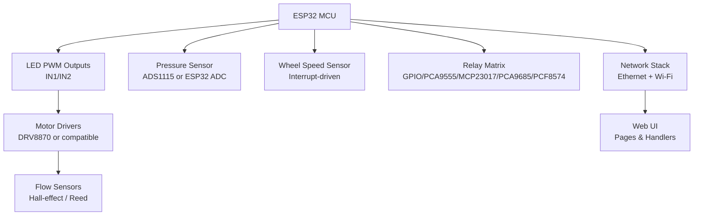
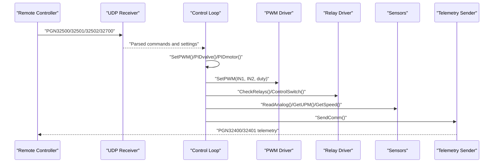
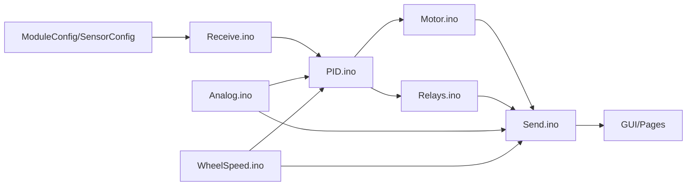

# Hardware Calibration and Testing Procedures

<cite>
**Referenced Files in This Document**
- [RC_ESP32.ino](file://RC_ESP32/RC_ESP32.ino)
- [Begin.ino](file://RC_ESP32/Begin.ino)
- [Motor.ino](file://RC_ESP32/Motor.ino)
- [PID.ino](file://RC_ESP32/PID.ino)
- [Relays.ino](file://RC_ESP32/Relays.ino)
- [Analog.ino](file://RC_ESP32/Analog.ino)
- [WheelSpeed.ino](file://RC_ESP32/WheelSpeed.ino)
- [Receive.ino](file://RC_ESP32/Receive.ino)
- [Send.ino](file://RC_ESP32/Send.ino)
- [PCA95x5_RC.h](file://RC_ESP32/PCA95x5_RC.h)
- [PgStart.ino](file://RC_ESP32/PgStart.ino)
- [PgSwitches.ino](file://RC_ESP32/PgSwitches.ino)
- [GUI.ino](file://RC_ESP32/GUI.ino)
- [PgNetwork.ino](file://RC_ESP32/PgNetwork.ino)
- [PgUpdate.ino](file://RC_ESP32/PgUpdate.ino)
</cite>

## Table of Contents
1. [Introduction](#introduction)
2. [Project Structure](#project-structure)
3. [Core Components](#core-components)
4. [Architecture Overview](#architecture-overview)
5. [Detailed Component Analysis](#detailed-component-analysis)
6. [Dependency Analysis](#dependency-analysis)
7. [Performance Considerations](#performance-considerations)
8. [Troubleshooting Guide](#troubleshooting-guide)
9. [Conclusion](#conclusion)
10. [Appendices](#appendices)

## Introduction
This document defines hardware calibration and testing procedures for the ESP32 Rate module. It covers:
- Motor calibration: torque verification, speed measurement, and control response testing
- Relay testing: switching verification, timing measurements, and load testing
- Sensor calibration: analog inputs, encoder/flow pulses, and wheel speed sensors
- Multimeter and oscilloscope diagnostics
- Component verification sequences, pass/fail criteria, and adjustment procedures
- Troubleshooting workflows for hardware faults and performance verification

The procedures leverage the firmware’s built-in control loops, telemetry, and communication protocol to validate hardware behavior and tune control parameters safely and repeatably.

## Project Structure
The module is organized around a central control loop that reads sensors, applies control, drives motors and relays, and streams telemetry. Key areas:
- Initialization and configuration (pins, I2C devices, sensors)
- Control algorithms (PID, timed combos)
- Actuator drivers (motors, relays)
- Sensors (pressure, flow, wheel speed)
- Communication (UDP over Ethernet and Wi-Fi)
- Web UI for diagnostics and configuration

**Diagram sources**
- [RC_ESP32.ino:250-280](file://RC_ESP32/RC_ESP32.ino#L250-L280)
- [Begin.ino:123-167](file://RC_ESP32/Begin.ino#L123-L167)
- [Motor.ino:31-60](file://RC_ESP32/Motor.ino#L31-L60)
- [Analog.ino:2-65](file://RC_ESP32/Analog.ino#L2-L65)
- [WheelSpeed.ino:15-71](file://RC_ESP32/WheelSpeed.ino#L15-L71)
- [Relays.ino:11-69](file://RC_ESP32/Relays.ino#L11-L69)
- [Send.ino:7-92](file://RC_ESP32/Send.ino#L7-L92)

**Section sources**
- [RC_ESP32.ino:250-280](file://RC_ESP32/RC_ESP32.ino#L250-L280)
- [Begin.ino:123-167](file://RC_ESP32/Begin.ino#L123-L167)

## Core Components
- Motor control and PWM mapping
- PID control for valves and motors
- Relay switching matrix with multiple controller types
- Analog pressure sensing (external ADC or internal ADC)
- Flow and wheel speed pulse processing
- Telemetry and diagnostics via UDP and Web UI

Key implementation references:
- PWM mapping and direction control: [Motor.ino:31-60](file://RC_ESP32/Motor.ino#L31-L60)
- PID control for valves/motors: [PID.ino:25-178](file://RC_ESP32/PID.ino#L25-L178)
- Relay control dispatch: [Relays.ino:71-273](file://RC_ESP32/Relays.ino#L71-L273)
- Pressure sensing: [Analog.ino:2-65](file://RC_ESP32/Analog.ino#L2-L65)
- Wheel speed ISR and median filtering: [WheelSpeed.ino:15-71](file://RC_ESP32/WheelSpeed.ino#L15-L71)
- Telemetry and status flags: [Send.ino:7-192](file://RC_ESP32/Send.ino#L7-L192)

**Section sources**
- [Motor.ino:31-60](file://RC_ESP32/Motor.ino#L31-L60)
- [PID.ino:25-178](file://RC_ESP32/PID.ino#L25-L178)
- [Relays.ino:71-273](file://RC_ESP32/Relays.ino#L71-L273)
- [Analog.ino:2-65](file://RC_ESP32/Analog.ino#L2-L65)
- [WheelSpeed.ino:15-71](file://RC_ESP32/WheelSpeed.ino#L15-L71)
- [Send.ino:7-192](file://RC_ESP32/Send.ino#L7-L192)

## Architecture Overview
The system operates a periodic loop that:
- Receives commands and calibration flags via UDP
- Updates control targets and modes
- Runs PID and control logic
- Applies PWM and relay states
- Reads analog and pulse inputs
- Sends telemetry with status and measurements

**Diagram sources**
- [Receive.ino:29-343](file://RC_ESP32/Receive.ino#L29-L343)
- [PID.ino:25-178](file://RC_ESP32/PID.ino#L25-L178)
- [Motor.ino:31-60](file://RC_ESP32/Motor.ino#L31-L60)
- [Relays.ino:11-69](file://RC_ESP32/Relays.ino#L11-L69)
- [Analog.ino:2-65](file://RC_ESP32/Analog.ino#L2-L65)
- [WheelSpeed.ino:31-71](file://RC_ESP32/WheelSpeed.ino#L31-L71)
- [Send.ino:1-195](file://RC_ESP32/Send.ino#L1-L195)

## Detailed Component Analysis

### Motor Calibration Procedures
Purpose: Verify torque output, speed response, and control accuracy.

Steps:
1. Prepare test rig
- Connect motor to drivers with known load (e.g., calibrated fan or brake).
- Ensure flow sensor is disconnected or isolated to avoid feedback during torque tests.
- Verify wiring matches configured IN1/IN2 pins.

2. Torque verification
- Set control type to motor or fan.
- Enable auto control and set TargetUPM to a moderate value.
- Observe PWM output and mechanical response.
- Record applied PWM and measurable torque/load characteristics.

3. Speed measurement
- Configure wheel speed pin and wheel calibration if using wheel speed as reference.
- Run steady-state test at multiple TargetUPM values.
- Compare reported Hz and calculated speed against expected values.

4. Control response testing
- Use PID tuning parameters (Kp, Ki, Deadband, SlewRate, MaxIntegral).
- Perform step changes in TargetUPM and measure rise time, overshoot, and settling time.
- Adjust Kp/Ki to achieve desired response without oscillation.

5. Pass/fail criteria
- PWM within 0–255 range and direction inversion working as configured.
- Measured speed within ±10% of target for steady-state conditions.
- No integral windup beyond MaxIntegral limits.

6. Adjustment procedures
- Tune Kp/Ki iteratively; reduce Ki to eliminate overshoot.
- Increase Deadband to minimize chattering at low error.
- Limit SlewRate to protect mechanical systems.

References:
- PWM mapping and direction: [Motor.ino:31-60](file://RC_ESP32/Motor.ino#L31-L60)
- PID control logic: [PID.ino:25-178](file://RC_ESP32/PID.ino#L25-L178)
- Telemetry of PWM and Hz: [Send.ino:54-67](file://RC_ESP32/Send.ino#L54-L67)

**Section sources**
- [Motor.ino:31-60](file://RC_ESP32/Motor.ino#L31-L60)
- [PID.ino:25-178](file://RC_ESP32/PID.ino#L25-L178)
- [Send.ino:54-67](file://RC_ESP32/Send.ino#L54-L67)

### Relay Testing Protocols
Purpose: Verify switching, timing, and load handling across all relay controller types.

Steps:
1. Identify relay controller type
- GPIOs, PCA9555 (8/16), MCP23017, PCA9685, or PCF8574.
- Confirm I2C presence and initialization success.

2. Switching verification
- Toggle individual relays via web UI or UDP command (PGN32501).
- Measure with multimeter across relay contacts for continuity.
- Verify LED indicators or status flags reflect state.

3. Timing measurements
- Use oscilloscope to capture turn-on/turn-off edges.
- Measure minimum/maximum pulse widths for 3-wire vs 2-wire configurations.
- Validate OutputEnablePin behavior for PCA9685.

4. Load testing
- Apply rated load to relay outputs.
- Monitor for arcing, overheating, or inconsistent switching.
- Confirm PowerRelayLo/Hi and InvertedLo/Hi settings match wiring.

5. Pass/fail criteria
- All relays switch reliably with ≤50 ms response.
- No chatter or missed transitions.
- Load current within relay ratings.

6. Adjustment procedures
- For PCA9685, confirm PWM frequency and duty cycles.
- For I2C expanders, verify address detection and direction registers.

References:
- Relay selection and initialization: [Begin.ino:347-511](file://RC_ESP32/Begin.ino#L347-L511)
- Relay control dispatch: [Relays.ino:71-273](file://RC_ESP32/Relays.ino#L71-L273)
- PCA9555/MCP23017/PCA9685/PCF8574 APIs: [PCA95x5_RC.h:55-178](file://RC_ESP32/PCA95x5_RC.h#L55-L178)

**Section sources**
- [Begin.ino:347-511](file://RC_ESP32/Begin.ino#L347-L511)
- [Relays.ino:71-273](file://RC_ESP32/Relays.ino#L71-L273)
- [PCA95x5_RC.h:55-178](file://RC_ESP32/PCA95x5_RC.h#L55-L178)

### Sensor Calibration Methods
Purpose: Calibrate analog inputs, flow/encoder signals, and wheel speed sensors.

#### Analog Inputs (Pressure)
- Hardware: ADS1115 external ADC or ESP32 internal ADC.
- Procedure:
  - Zero and span calibration using known pressures.
  - Compare raw readings to expected voltage ranges.
  - Validate gain and data rate settings.

References:
- ADC selection and sampling: [Analog.ino:2-65](file://RC_ESP32/Analog.ino#L2-L65)
- Telemetry of pressure: [Send.ino:121-124](file://RC_ESP32/Send.ino#L121-L124)

**Section sources**
- [Analog.ino:2-65](file://RC_ESP32/Analog.ino#L2-L65)
- [Send.ino:121-124](file://RC_ESP32/Send.ino#L121-L124)

#### Encoder/Flow Signals
- Hardware: Hall-effect or reed switches on flow pins.
- Procedure:
  - Configure FlowPin, PulseMin/PulseMax, PulseSampleSize.
  - Generate known flow rates and record pulses.
  - Derive MeterCal from counted pulses and known volume/time.
  - Validate median filter and timeout behavior.

References:
- Interrupt-driven ISR and sampling: [WheelSpeed.ino:15-71](file://RC_ESP32/WheelSpeed.ino#L15-L71)
- Pulse parsing and meter calibration: [Receive.ino:29-220](file://RC_ESP32/Receive.ino#L29-L220)

**Section sources**
- [WheelSpeed.ino:15-71](file://RC_ESP32/WheelSpeed.ino#L15-L71)
- [Receive.ino:29-220](file://RC_ESP32/Receive.ino#L29-L220)

#### Wheel Speed Sensor
- Hardware: Interrupt-triggered sensor.
- Procedure:
  - Assign WheelSpeedPin and set WheelCal.
  - Drive at known speeds and compare reported Hz and speed.
  - Validate median window and timeout resets.

References:
- ISR and median calculation: [WheelSpeed.ino:15-71](file://RC_ESP32/WheelSpeed.ino#L15-L71)
- Telemetry of wheel speed/count: [Send.ino:125-134](file://RC_ESP32/Send.ino#L125-L134)

**Section sources**
- [WheelSpeed.ino:15-71](file://RC_ESP32/WheelSpeed.ino#L15-L71)
- [Send.ino:125-134](file://RC_ESP32/Send.ino#L125-L134)

### Multimeter and Oscilloscope Measurements
- Multimeter checks:
  - Continuity across relay outputs.
  - Voltage levels at motor driver inputs.
  - Supply voltages and ground integrity.
- Oscilloscope checks:
  - PWM waveform symmetry and duty cycle accuracy.
  - Relay switching edges and noise margins.
  - Flow sensor pulses and debounce behavior.

[No sources needed since this section provides general guidance]

### Diagnostic Routines and Telemetry
- Use PGN32400/32401 to inspect:
  - Applied PWM, Hz, and accumulated quantity
  - Status flags (sensor connected, Ethernet/Wi-Fi, pin config, 2/3-wire relays)
- Web UI pages:
  - Start page, Switches page, Network page, Firmware Update page

References:
- Telemetry payload: [Send.ino:7-192](file://RC_ESP32/Send.ino#L7-L192)
- Web handlers: [GUI.ino:1-104](file://RC_ESP32/GUI.ino#L1-L104)
- Pages: [PgStart.ino:1-148](file://RC_ESP32/PgStart.ino#L1-L148), [PgSwitches.ino:1-132](file://RC_ESP32/PgSwitches.ino#L1-L132), [PgNetwork.ino:1-155](file://RC_ESP32/PgNetwork.ino#L1-L155), [PgUpdate.ino:1-111](file://RC_ESP32/PgUpdate.ino#L1-L111)

**Section sources**
- [Send.ino:7-192](file://RC_ESP32/Send.ino#L7-L192)
- [GUI.ino:1-104](file://RC_ESP32/GUI.ino#L1-L104)
- [PgStart.ino:1-148](file://RC_ESP32/PgStart.ino#L1-L148)
- [PgSwitches.ino:1-132](file://RC_ESP32/PgSwitches.ino#L1-L132)
- [PgNetwork.ino:1-155](file://RC_ESP32/PgNetwork.ino#L1-L155)
- [PgUpdate.ino:1-111](file://RC_ESP32/PgUpdate.ino#L1-L111)

## Dependency Analysis
- Control loop depends on:
  - Configuration structures (ModuleConfig, SensorConfig)
  - Control functions (SetPWM, PIDvalve, PIDmotor)
  - Actuator drivers (PWM, relays)
  - Sensor acquisition (ADC, ISR, median filter)
  - Communication (UDP RX/TX, Web server)

**Diagram sources**
- [RC_ESP32.ino:76-149](file://RC_ESP32/RC_ESP32.ino#L76-L149)
- [Receive.ino:29-343](file://RC_ESP32/Receive.ino#L29-L343)
- [PID.ino:25-178](file://RC_ESP32/PID.ino#L25-L178)
- [Motor.ino:31-60](file://RC_ESP32/Motor.ino#L31-L60)
- [Relays.ino:11-69](file://RC_ESP32/Relays.ino#L11-L69)
- [Analog.ino:2-65](file://RC_ESP32/Analog.ino#L2-L65)
- [WheelSpeed.ino:15-71](file://RC_ESP32/WheelSpeed.ino#L15-L71)
- [Send.ino:1-195](file://RC_ESP32/Send.ino#L1-L195)
- [GUI.ino:1-104](file://RC_ESP32/GUI.ino#L1-L104)

**Section sources**
- [RC_ESP32.ino:76-149](file://RC_ESP32/RC_ESP32.ino#L76-L149)
- [Receive.ino:29-343](file://RC_ESP32/Receive.ino#L29-L343)
- [PID.ino:25-178](file://RC_ESP32/PID.ino#L25-L178)
- [Motor.ino:31-60](file://RC_ESP32/Motor.ino#L31-L60)
- [Relays.ino:11-69](file://RC_ESP32/Relays.ino#L11-L69)
- [Analog.ino:2-65](file://RC_ESP32/Analog.ino#L2-L65)
- [WheelSpeed.ino:15-71](file://RC_ESP32/WheelSpeed.ino#L15-L71)
- [Send.ino:1-195](file://RC_ESP32/Send.ino#L1-L195)
- [GUI.ino:1-104](file://RC_ESP32/GUI.ino#L1-L104)

## Performance Considerations
- PWM resolution and frequency:
  - PWM_BITS and PWM_FREQ are defined per platform; ensure compatibility with motor drivers.
- Sampling windows:
  - PulseMin/PulseMax and PulseSampleSize affect flow measurement stability.
- Loop timing:
  - LoopTime governs control cadence; ensure sufficient headroom for ISR and I2C operations.
- I2C speed:
  - Clock increased to 400 kHz for faster ADC and expander access.

[No sources needed since this section provides general guidance]

## Troubleshooting Guide
Common issues and remedies:
- No sensor pulses detected
  - Verify FlowPin wiring and pull-up configuration.
  - Check ISR attachment and PulseMin/PulseMax thresholds.
  - References: [Begin.ino:123-167](file://RC_ESP32/Begin.ino#L123-L167), [WheelSpeed.ino:15-71](file://RC_ESP32/WheelSpeed.ino#L15-L71)

- Pressure sensor not responding
  - Confirm ADS1115 presence and address; fallback to internal ADC if disabled.
  - References: [Begin.ino:58-85](file://RC_ESP32/Begin.ino#L58-L85), [Analog.ino:2-65](file://RC_ESP32/Analog.ino#L2-L65)

- Relay switching unreliable
  - Check I2C device detection and direction registers.
  - Validate OutputEnablePin and PCA9685 configuration.
  - References: [Begin.ino:347-511](file://RC_ESP32/Begin.ino#L347-L511), [PCA95x5_RC.h:55-178](file://RC_ESP32/PCA95x5_RC.h#L55-L178)

- Telemetry missing or incorrect
  - Inspect UDP destination IPs and network connectivity.
  - Verify CRC and message lengths.
  - References: [Send.ino:7-192](file://RC_ESP32/Send.ino#L7-L192), [Receive.ino:29-343](file://RC_ESP32/Receive.ino#L29-L343)

**Section sources**
- [Begin.ino:58-85](file://RC_ESP32/Begin.ino#L58-L85)
- [Begin.ino:123-167](file://RC_ESP32/Begin.ino#L123-L167)
- [Begin.ino:347-511](file://RC_ESP32/Begin.ino#L347-L511)
- [Analog.ino:2-65](file://RC_ESP32/Analog.ino#L2-L65)
- [WheelSpeed.ino:15-71](file://RC_ESP32/WheelSpeed.ino#L15-L71)
- [PCA95x5_RC.h:55-178](file://RC_ESP32/PCA95x5_RC.h#L55-L178)
- [Send.ino:7-192](file://RC_ESP32/Send.ino#L7-L192)
- [Receive.ino:29-343](file://RC_ESP32/Receive.ino#L29-L343)

## Conclusion
These procedures provide a repeatable, test-driven approach to calibrating and verifying the ESP32 Rate module’s hardware. By leveraging the built-in control loops, telemetry, and communication protocol, teams can validate motor performance, relay operation, and sensor accuracy while maintaining safety and reliability. Regular calibration and diagnostics ensure long-term system stability and predictable field performance.

[No sources needed since this section summarizes without analyzing specific files]

## Appendices

### Component Verification Sequences
- Motors
  - Torque: apply known load, observe PWM and mechanical response.
  - Speed: steady-state tests at multiple targets; compare Hz and computed speed.
  - Control: step response tuning with Kp/Ki adjustments.
- Relays
  - Switching: continuity checks per channel.
  - Timing: oscilloscope measurement of edges and pulse widths.
  - Load: rated load testing with thermal monitoring.
- Sensors
  - Pressure: zero/span calibration and gain verification.
  - Flow: meter calibration using known volumes and time.
  - Wheel speed: speed validation with known reference.

[No sources needed since this section provides general guidance]