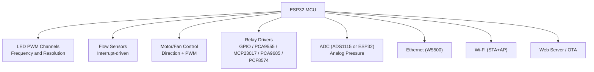
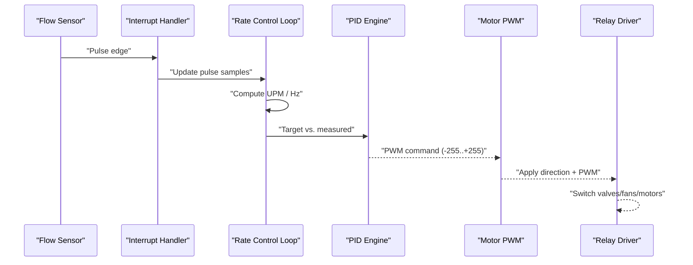
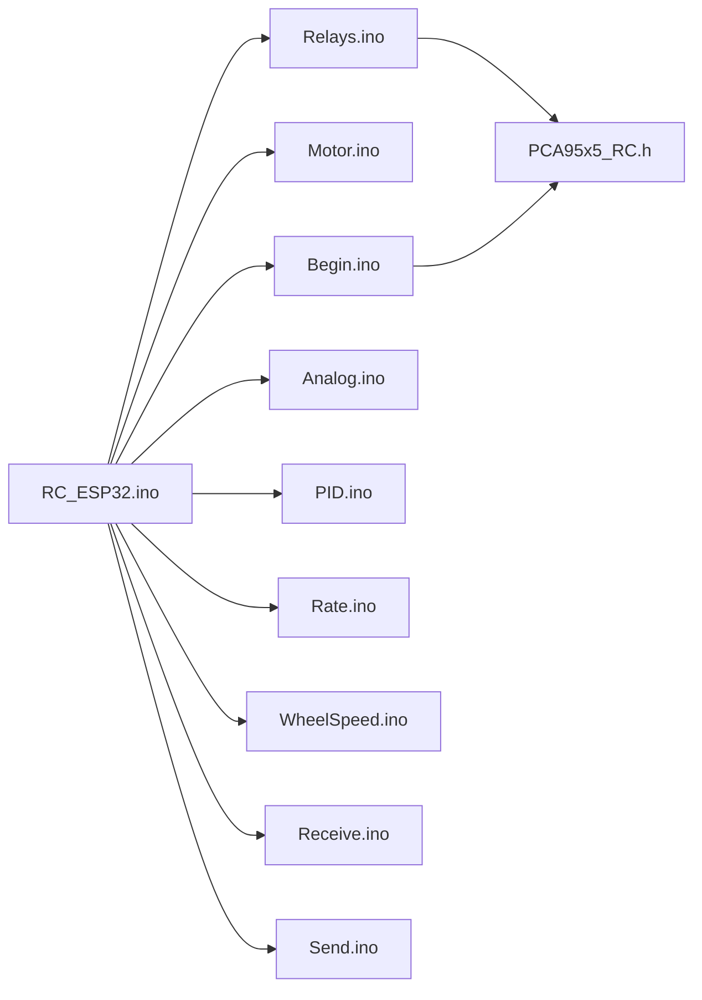

# Hardware Component Specifications

<cite>
**Referenced Files in This Document**
- [RC_ESP32.ino](file://RC_ESP32/RC_ESP32.ino)
- [Begin.ino](file://RC_ESP32/Begin.ino)
- [Motor.ino](file://RC_ESP32/Motor.ino)
- [Relays.ino](file://RC_ESP32/Relays.ino)
- [Analog.ino](file://RC_ESP32/Analog.ino)
- [PID.ino](file://RC_ESP32/PID.ino)
- [Rate.ino](file://RC_ESP32/Rate.ino)
- [WheelSpeed.ino](file://RC_ESP32/WheelSpeed.ino)
- [PCA95x5_RC.h](file://RC_ESP32/PCA95x5_RC.h)
- [Receive.ino](file://RC_ESP32/Receive.ino)
- [Send.ino](file://RC_ESP32/Send.ino)
- [Notes.txt](file://Notes.txt)
</cite>

## Table of Contents
1. [Introduction](#introduction)
2. [Project Structure](#project-structure)
3. [Core Components](#core-components)
4. [Architecture Overview](#architecture-overview)
5. [Detailed Component Analysis](#detailed-component-analysis)
6. [Dependency Analysis](#dependency-analysis)
7. [Performance Considerations](#performance-considerations)
8. [Troubleshooting Guide](#troubleshooting-guide)
9. [Conclusion](#conclusion)
10. [Appendices](#appendices)

## Introduction
This document catalogs the hardware components used in the ESP32-based rate control system. It focuses on motors, relays, sensors, and electrical characteristics, and explains how the firmware interacts with these components. It also covers analog sensor requirements, I/O expanders, and communication interfaces. Component selection criteria, sourcing recommendations, and alternative substitutions are included to guide procurement and maintenance.

## Project Structure
The rate control system is implemented in the RC_ESP32 module. Key functional areas:
- Initialization and configuration
- Flow and wheel speed sensing
- Motor control via PWM
- Relay control via multiple I/O expanders
- Analog pressure measurement
- Network communication (Ethernet and Wi-Fi)
- Web interface for configuration

**Diagram sources**
- [Begin.ino:54-160](file://RC_ESP32/Begin.ino#L54-L160)
- [Motor.ino:31-60](file://RC_ESP32/Motor.ino#L31-L60)
- [Relays.ino:71-272](file://RC_ESP32/Relays.ino#L71-L272)
- [Analog.ino:2-65](file://RC_ESP32/Analog.ino#L2-L65)
- [Receive.ino:2-27](file://RC_ESP32/Receive.ino#L2-L27)
- [Send.ino:1-91](file://RC_ESP32/Send.ino#L1-L91)

**Section sources**
- [RC_ESP32.ino:250-280](file://RC_ESP32/RC_ESP32.ino#L250-L280)
- [Begin.ino:4-160](file://RC_ESP32/Begin.ino#L4-L160)

## Core Components
- Microcontroller: ESP32-WROOM-32U
- Motor control: LEDC PWM channels with direction pins
- Relay drivers: GPIO, PCA9555, MCP23017, PCA9685, PCF8574
- Flow sensors: Interrupt-based pulse counting
- Wheel speed sensor: Optional external sensor or shared flow pin
- Pressure sensor: Optional ADS1115 ADC or ESP32 analog pin
- Communication: Ethernet (W5500) and Wi-Fi (STA+AP), UDP messaging
- Web interface: Embedded HTTP server and OTA updates

**Section sources**
- [RC_ESP32.ino:30-32](file://RC_ESP32/RC_ESP32.ino#L30-L32)
- [Begin.ino:124-167](file://RC_ESP32/Begin.ino#L124-L167)
- [Motor.ino:31-60](file://RC_ESP32/Motor.ino#L31-L60)
- [Relays.ino:71-272](file://RC_ESP32/Relays.ino#L71-L272)
- [Analog.ino:2-65](file://RC_ESP32/Analog.ino#L2-L65)
- [Receive.ino:2-27](file://RC_ESP32/Receive.ino#L2-L27)
- [Send.ino:1-91](file://RC_ESP32/Send.ino#L1-L91)

## Architecture Overview
The system acquires flow and wheel speed signals, computes target PWM using PID logic, and applies PWM to motor drivers. Relay outputs are controlled via selected I/O expanders. Pressure readings are optionally acquired via ADC. All telemetry is transmitted via UDP over Ethernet or Wi-Fi.

**Diagram sources**
- [Rate.ino:14-104](file://RC_ESP32/Rate.ino#L14-L104)
- [PID.ino:25-67](file://RC_ESP32/PID.ino#L25-L67)
- [Motor.ino:2-29](file://RC_ESP32/Motor.ino#L2-L29)
- [Relays.ino:11-69](file://RC_ESP32/Relays.ino#L11-L69)

## Detailed Component Analysis

### Motors and Motor Control
- Control type: Motors and fans use direction pins plus PWM.
- PWM generation: ESP32 LEDC channels configured with frequency and bit resolution.
- Polarity inversion: Firmware flips direction based on configuration.
- Dithering: 8-bit PWM path uses dithering for improved low-speed performance.
- Driver circuitry: Not specified in code; firmware assumes standard H-bridge or driver capable of IN1/IN2 control.

Electrical characteristics
- PWM frequency: 490 Hz (firmware default).
- PWM resolution: 12-bit on ESP32; 8-bit path uses dithering.
- Direction control: Two pins per motor/fan channel.
- Polarity inversion: Controlled by configuration flag.

Mounting and wiring
- Flow pin: Input with pull-up resistor.
- IN1/IN2 pins: Output for direction and PWM.

Selection criteria and alternatives
- Use drivers that accept 2- or 3-wire valve actuation as configured.
- Ensure driver can handle required current and voltage for motors/fans.
- If using 2-wire valves, configure accordingly; 3-wire valves allow separate power and control.

**Section sources**
- [Begin.ino:152-158](file://RC_ESP32/Begin.ino#L152-L158)
- [Motor.ino:31-60](file://RC_ESP32/Motor.ino#L31-L60)
- [Motor.ino:62-76](file://RC_ESP32/Motor.ino#L62-L76)
- [RC_ESP32.ino:49-65](file://RC_ESP32/RC_ESP32.ino#L49-L65)

### Relays and Relay Drivers
Supported relay driver configurations:
- GPIO pins directly
- PCA9555 (8- or 16-relay) via I2C
- MCP23017 via I2C
- PCA9685 (PWM/Servo driver) used for relays with configurable 2- or 3-wire modes
- PCF8574 via I2C

Relay specifications
- Polarity inversion: Configurable.
- Contact configuration: Assumed SPST or configured via external wiring.
- Switching times: Not specified; depend on relay coil and load.

Mounting and wiring
- Relay pins mapped via configuration array.
- PCA9685 spare driver can be used for an additional relay.

Selection criteria and alternatives
- Choose relays rated for the load voltage/current.
- For 2-wire valves, use PCA9685 dual-output mode; for 3-wire valves, use single-output mode.
- I2C address conflicts must be avoided; PCA9555 default is 0x20; MCP23017 tested at 0x20/0x21.

**Section sources**
- [Relays.ino:71-272](file://RC_ESP32/Relays.ino#L71-L272)
- [PCA95x5_RC.h:1-178](file://RC_ESP32/PCA95x5_RC.h#L1-L178)
- [Begin.ino:347-511](file://RC_ESP32/Begin.ino#L347-L511)

### Sensors
Flow sensors
- Interrupt-driven pulse counting with median filtering.
- Pulse thresholds and sampling window are configurable.
- Supports up to six sensor channels.

Wheel speed sensor
- Optional external sensor or shared with flow pin.
- Uses falling-edge interrupt and median-based Hz calculation.

Signal conditioning
- Flow sensor inputs use internal pull-up resistors.
- Pulse validation filters out noise based on min/max pulse time.

Mounting and wiring
- Flow pin: Input with pull-up.
- Wheel speed pin: Input with pull-up.

Selection criteria and alternatives
- Use reed or hall-effect sensors suitable for field conditions.
- Ensure debouncing and shielding for reliable readings.

**Section sources**
- [Rate.ino:14-104](file://RC_ESP32/Rate.ino#L14-L104)
- [WheelSpeed.ino:15-71](file://RC_ESP32/WheelSpeed.ino#L15-L71)
- [Begin.ino:124-167](file://RC_ESP32/Begin.ino#L124-L167)

### Analog Sensors (Pressure)
ADC options
- ADS1115 I2C ADC (optional): Single-ended AIN0 for pressure; configurable gain and sample rate.
- ESP32 analog pin (fallback): If ADS1115 is disabled or not found.

Requirements
- Input range: Configurable via ADC gain.
- Resolution: 16-bit effective with PGA settings.
- Sample rate: Up to 860 SPS in single-shot mode.

Mounting and wiring
- Connect pressure transducer to AIN0 with proper filtering.
- Use internal pull-ups for flow sensor pins; avoid floating ADC inputs.

Selection criteria and alternatives
- Use precision PGA and stable reference for accuracy.
- Alternative: Other 16-bit ADCs via I2C if ADS1115 is unavailable.

**Section sources**
- [Analog.ino:2-65](file://RC_ESP32/Analog.ino#L2-L65)
- [Begin.ino:58-85](file://RC_ESP32/Begin.ino#L58-L85)
- [RC_ESP32.ino:44](file://RC_ESP32/RC_ESP32.ino#L44)

### Communication Interfaces
Ethernet
- W5500 chip with dedicated SS pin.
- UDP unicast/broadcast to host application.

Wi-Fi
- Soft AP + STA mode; DHCP-like IP assignment for AP.
- UDP unicast/broadcast to host application.

Web interface and OTA
- Embedded HTTP server for configuration pages.
- OTA update support.

Mounting and wiring
- Ethernet: SPI SS on configured pin; MAC derived from device MAC.
- Wi-Fi: AP subnet derived from module ID.

**Section sources**
- [Begin.ino:87-122](file://RC_ESP32/Begin.ino#L87-L122)
- [Begin.ino:173-254](file://RC_ESP32/Begin.ino#L173-L254)
- [Send.ino:1-91](file://RC_ESP32/Send.ino#L1-L91)
- [Receive.ino:2-27](file://RC_ESP32/Receive.ino#L2-L27)
- [Notes.txt:1-8](file://Notes.txt#L1-L8)

### PID and Control Logic
- PIDvalve: Valve control with deadband, integral anti-windup, and brake factor.
- PIDmotor: Motor control with slew rate limiting.
- TimedCombo: Alternates adjustment/pause intervals for combo valves.

Parameters
- Proportional and integral gains, deadband, brake point, slow-adjust percentage.
- Slew rate and max integral per loop.
- TimedMinStart, TimedAdjust, TimedPause.

Mounting and wiring
- No additional hardware beyond sensors and actuators.

Selection criteria and alternatives
- Tune gains for stability and response; reduce Ki if oscillations occur.
- Use appropriate PIDtime for loop stability.

**Section sources**
- [PID.ino:1-232](file://RC_ESP32/PID.ino#L1-L232)

## Dependency Analysis
The system depends on:
- ESP32 peripherals: LEDC PWM, interrupts, I2C, SPI, Wi-Fi, Ethernet.
- Libraries: PCA95x5-compatible I/O expanders, PCA9685 PWM driver, PCF8574, EthernetUDP, WebServer.
- External devices: W5500 Ethernet, ADS1115 ADC, I/O expanders.

**Diagram sources**
- [RC_ESP32.ino:1-40](file://RC_ESP32/RC_ESP32.ino#L1-L40)
- [Begin.ino:1-20](file://RC_ESP32/Begin.ino#L1-L20)
- [Relays.ino:1-10](file://RC_ESP32/Relays.ino#L1-L10)
- [PCA95x5_RC.h:1-10](file://RC_ESP32/PCA95x5_RC.h#L1-L10)

**Section sources**
- [RC_ESP32.ino:1-40](file://RC_ESP32/RC_ESP32.ino#L1-L40)
- [Begin.ino:1-20](file://RC_ESP32/Begin.ino#L1-L20)

## Performance Considerations
- Loop timing: 50 ms loop; telemetry sent every 200 ms.
- Interrupt latency: ISR handles flow/wheel pulses; ensure adequate debounce and filtering.
- PWM resolution: 12-bit on ESP32; 8-bit with dithering on other platforms.
- I2C speed: 400 kHz configured.
- Network reliability: UDP over Ethernet preferred; fallback to Wi-Fi.

[No sources needed since this section provides general guidance]

## Troubleshooting Guide
Common issues and remedies
- No flow readings: Verify pull-up configuration and ISR wiring; confirm pulse thresholds.
- Relay not switching: Check I2C address detection and driver initialization; verify relay pin mapping.
- Pressure readings missing: Confirm ADS1115 presence and wiring; fallback to analog pin if disabled.
- Wi-Fi connectivity: If repeated disconnects exceed threshold, system falls back to AP-only mode.
- Network subnet: AP subnet derived from module ID; ensure host app matches.

**Section sources**
- [Begin.ino:315-344](file://RC_ESP32/Begin.ino#L315-L344)
- [Notes.txt:6-8](file://Notes.txt#L6-L8)
- [RC_ESP32.ino:227-244](file://RC_ESP32/RC_ESP32.ino#L227-L244)

## Conclusion
The ESP32-based rate control system integrates flow and wheel speed sensing, PID-based control, and flexible relay actuation via multiple driver options. Hardware choices center on robust sensor interfaces, configurable PWM control, and reliable communication paths. Proper component selection and wiring, along with careful tuning of control parameters, ensure stable operation in agricultural environments.

[No sources needed since this section summarizes without analyzing specific files]

## Appendices

### Component Selection Criteria and Sourcing
- Motors/Fans: Select drivers with appropriate current/voltage ratings; verify 2-/3-wire compatibility.
- Relays: Choose PCB-mount or panel relays rated for load; verify coil voltage and contact ratings.
- Flow sensors: Reed or hall-effect sensors with suitable sealing; ensure signal integrity.
- Pressure transducers: Use 4-20mA or 3.3V output variants compatible with ADC or analog pin.
- I/O expanders: PCA9555/MCP23017/PCA9685/PCF8574; verify I2C addresses and supply voltages.
- Communication: W5500 Ethernet module; ESP32 Wi-Fi antenna and cabling.

[No sources needed since this section provides general guidance]