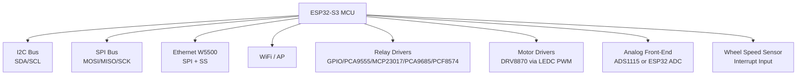
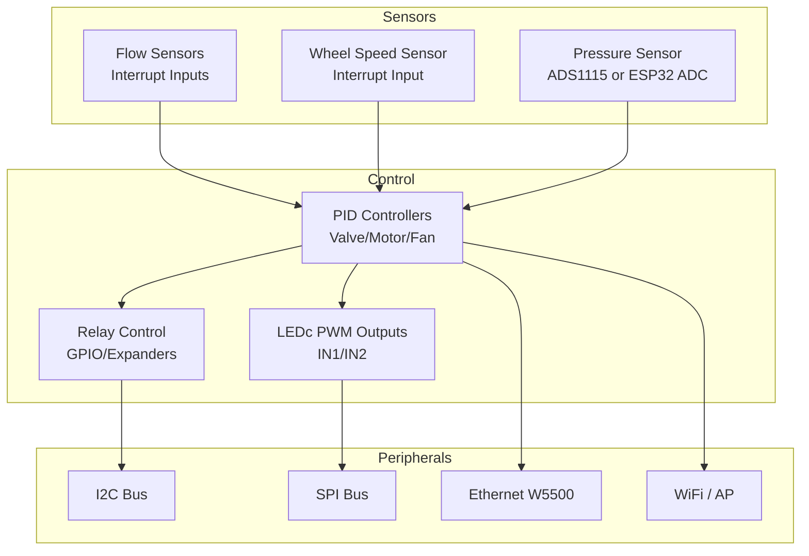
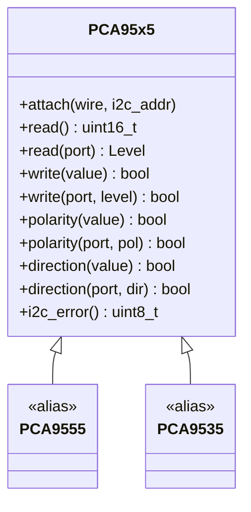
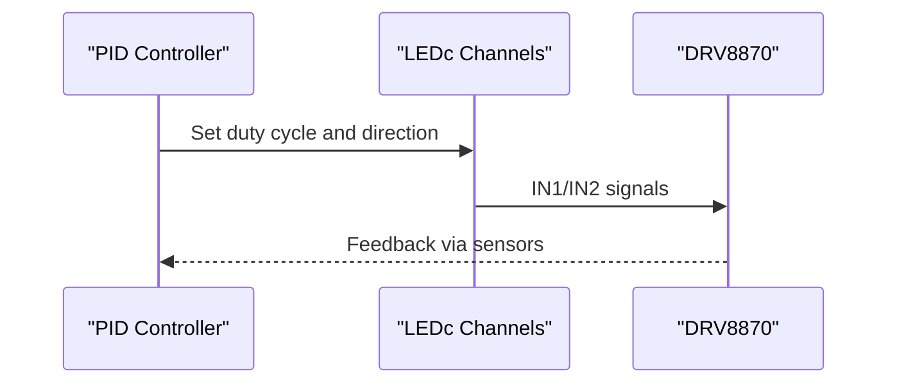
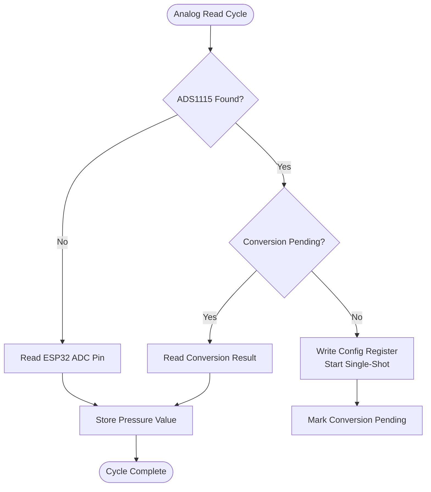
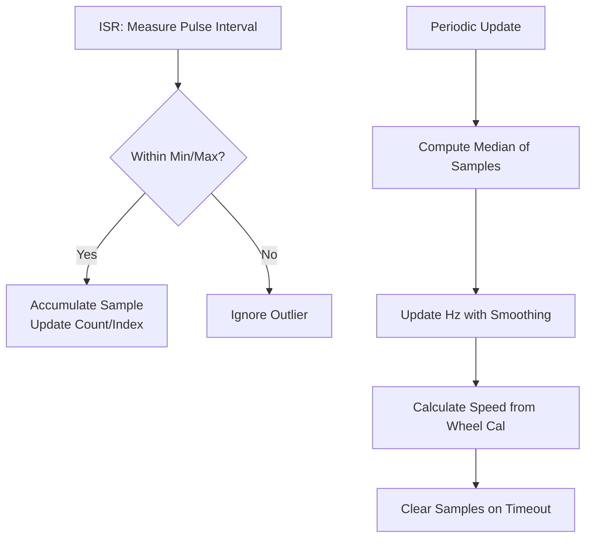
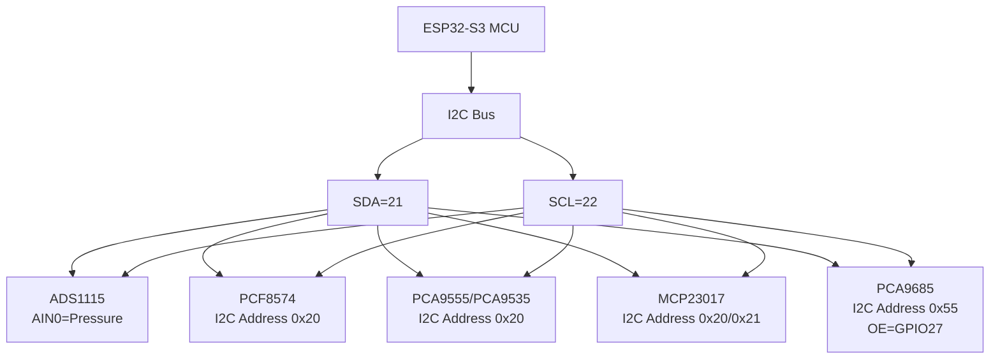
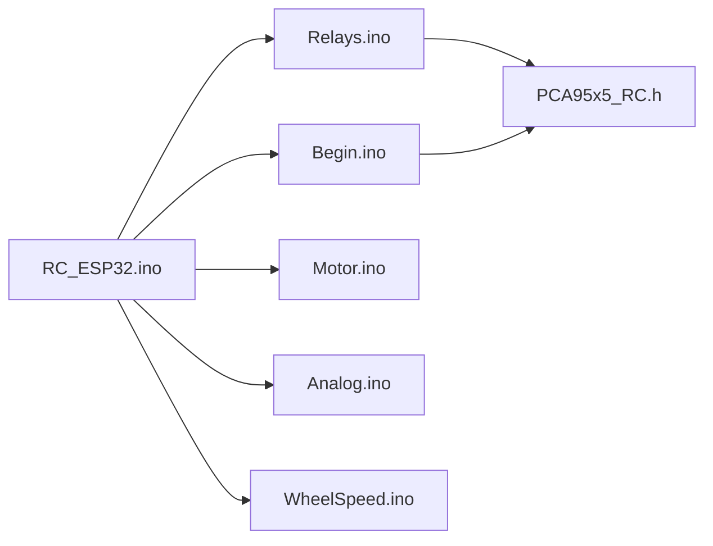

# Hardware Configuration

<cite>
**Referenced Files in This Document**
- [RC_ESP32.ino](file://RC_ESP32/RC_ESP32.ino)
- [Begin.ino](file://RC_ESP32/Begin.ino)
- [Relays.ino](file://RC_ESP32/Relays.ino)
- [Motor.ino](file://RC_ESP32/Motor.ino)
- [Analog.ino](file://RC_ESP32/Analog.ino)
- [WheelSpeed.ino](file://RC_ESP32/WheelSpeed.ino)
- [PCA95x5_RC.h](file://RC_ESP32/PCA95x5_RC.h)
- [Notes.txt](file://Notes.txt)
- [RC_ESP32.ino (OLD CODE)](file://OLD CODE/RC_ESP32/RC_ESP32.ino)
- [Begin.ino (OLD CODE)](file://OLD CODE/RC_ESP32/Begin.ino)
</cite>

## Table of Contents
1. [Introduction](#introduction)
2. [Project Structure](#project-structure)
3. [Core Components](#core-components)
4. [Architecture Overview](#architecture-overview)
5. [Detailed Component Analysis](#detailed-component-analysis)
6. [Dependency Analysis](#dependency-analysis)
7. [Performance Considerations](#performance-considerations)
8. [Troubleshooting Guide](#troubleshooting-guide)
9. [Conclusion](#conclusion)
10. [Appendices](#appendices)

## Introduction
This document provides comprehensive hardware configuration documentation for the ESP32 Rate Control system. It covers ESP32-S3 platform specifics, pin assignments, power requirements, hardware limitations, GPIO pin mapping for relays, motor drivers, analog sensors, and expansion boards. It also documents the PCF8574 GPIO expander configuration, component specifications, wiring schematics, hardware abstraction layers, and calibration procedures.

## Project Structure
The hardware configuration spans several modules:
- Initialization and setup of peripherals and I/O
- Relay control via onboard GPIOs or external expanders
- Motor/PWM control for proportional flow actuation
- Analog pressure sensing via ADS1115 or ESP32 analog pins
- Wheel speed measurement using interrupts and median filtering
- Web-based configuration and diagnostics

**Diagram sources**
- [Begin.ino:54-118](file://RC_ESP32/Begin.ino#L54-L118)
- [RC_ESP32.ino:40-47](file://RC_ESP32/RC_ESP32.ino#L40-L47)

**Section sources**
- [Begin.ino:54-118](file://RC_ESP32/Begin.ino#L54-L118)
- [RC_ESP32.ino:40-47](file://RC_ESP32/RC_ESP32.ino#L40-L47)

## Core Components
- ESP32-S3 platform: 240 MHz dual-core, integrated Wi-Fi and Bluetooth, 520 KB ROM, 320 KB SRAM, 8 MB PSRAM optional on some variants.
- I2C: SDA on pin 21, SCL on pin 22; clock speed up to 400 kHz.
- SPI: W5500 chip select on pin 5; other SPI peripherals supported.
- Ethernet: W5500 chip present and initialized during setup.
- Relays: Controlled via onboard GPIOs or external expanders (PCA9555, MCP23017, PCA9685, PCF8574).
- Motors: DRV8870 controlled via ESP32 LEDC channels with configurable PWM frequency and resolution.
- Analog: ADS1115 ADC for pressure sensing; fallback to ESP32 analog pins if unavailable.
- Wheel speed: Interrupt-driven measurement with median filtering and timeout handling.

**Section sources**
- [Begin.ino:54-118](file://RC_ESP32/Begin.ino#L54-L118)
- [RC_ESP32.ino:40-65](file://RC_ESP32/RC_ESP32.ino#L40-L65)
- [Motor.ino:31-60](file://RC_ESP32/Motor.ino#L31-L60)
- [Analog.ino:2-65](file://RC_ESP32/Analog.ino#L2-L65)
- [WheelSpeed.ino:15-70](file://RC_ESP32/WheelSpeed.ino#L15-L70)

## Architecture Overview
The system integrates multiple hardware interfaces through a unified control loop:
- Sensors (flow and wheel speed) feed feedback to PID loops.
- PWM outputs drive motor drivers for proportional control.
- Relay outputs switch solenoid valves or loads via expanders or direct GPIO.
- I2C peripherals (ADC, expanders) provide extended I/O and sensing.
- Network connectivity (Wi-Fi AP/STA and Ethernet) enables configuration and telemetry.

**Diagram sources**
- [Motor.ino:2-29](file://RC_ESP32/Motor.ino#L2-L29)
- [PID.ino:25-67](file://RC_ESP32/PID.ino#L25-L67)
- [Relays.ino:11-69](file://RC_ESP32/Relays.ino#L11-L69)
- [Begin.ino:54-118](file://RC_ESP32/Begin.ino#L54-L118)

## Detailed Component Analysis

### ESP32-S3 Platform Specifics
- Clock and memory: Dual-core 240 MHz, 520 KB ROM, 320 KB SRAM; PSRAM optional.
- I2C: SDA=21, SCL=22; configured to 400 kHz.
- SPI: W5500 SS on pin 5; other SPI peripherals supported.
- PWM: LEDC channels used for DRV8870; frequency 490 Hz, resolution depends on processor (12-bit on ESP32).
- Valid GPIOs for specific pins constrained to a subset suitable for this board variant.

**Section sources**
- [Begin.ino:1-50](file://RC_ESP32/Begin.ino#L1-L50)
- [RC_ESP32.ino:49-65](file://RC_ESP32/RC_ESP32.ino#L49-L65)

### Pin Assignments and GPIO Mapping
- I2C: SDA=21, SCL=22; 400 kHz clock.
- Ethernet: W5500 SS=5; MAC address derived from device MAC; static IP assignment.
- Sensors: Flow pins and IN1/IN2 pins per sensor; interrupt attached per sensor.
- Wheel speed: Dedicated input pin; interrupt configured on falling edge.
- Work pin: Optional input with pull-up; supports momentary or latching operation.
- Pressure pin: Optional analog input; falls back to ADS1115 if enabled.
- PCA9685 output enable: GPIO 27 active low to enable PWM outputs.

Note: Specific pin numbers are configured in EEPROM-backed structures and validated against valid pin lists.

**Section sources**
- [Begin.ino:54-167](file://RC_ESP32/Begin.ino#L54-L167)
- [RC_ESP32.ino:76-95](file://RC_ESP32/RC_ESP32.ino#L76-L95)

### Relay Control Abstraction and Expanders
Relay control is abstracted behind a uniform interface supporting:
- Onboard GPIO pins
- PCA9555 (8-bit) and PCA9555 (16-bit) expanders
- MCP23017 (16-bit) expanders
- PCA9685 (16-channel 12-bit PWM) used for relay switching and motor control
- PCF8574 (8-bit) expander

The PCA95x5 library provides a template class for PCA9535/PCA9555 devices with methods to set polarity, direction, and output levels. The system initializes and configures each expander according to detected presence.

**Diagram sources**
- [PCA95x5_RC.h:55-178](file://RC_ESP32/PCA95x5_RC.h#L55-L178)

**Section sources**
- [Begin.ino:347-511](file://RC_ESP32/Begin.ino#L347-L511)
- [Relays.ino:71-273](file://RC_ESP32/Relays.ino#L71-L273)
- [PCA95x5_RC.h:55-178](file://RC_ESP32/PCA95x5_RC.h#L55-L178)

### Motor Drivers and PWM Control
- DRV8870 controlled via two LEDC channels (IN1/IN2) with configurable frequency and resolution.
- PWM frequency set to 490 Hz; resolution 12-bit on ESP32.
- Direction and duty cycle computed from PID output; inverted direction based on configuration.
- Dithering support for 8-bit resolution on other processors; not used on ESP32.

**Diagram sources**
- [Motor.ino:31-60](file://RC_ESP32/Motor.ino#L31-L60)

**Section sources**
- [Motor.ino:2-29](file://RC_ESP32/Motor.ino#L2-L29)
- [Motor.ino:31-60](file://RC_ESP32/Motor.ino#L31-L60)

### Analog Sensors and Pressure Measurement
- ADS1115 ADC: Single-ended configuration on AIN0 for pressure; continuous conversion mode disabled between reads.
- Fallback to ESP32 analog pin if ADS1115 is not found.
- Conversion timing optimized to alternate between initiating conversions and reading results.

**Diagram sources**
- [Analog.ino:2-65](file://RC_ESP32/Analog.ino#L2-L65)

**Section sources**
- [Analog.ino:2-65](file://RC_ESP32/Analog.ino#L2-L65)

### Wheel Speed Measurement
- Interrupt-driven measurement on a dedicated pin with falling-edge detection.
- Median filtering over a configurable window; timeout clears values if no pulses received.
- Calculated Hz and km/h based on calibrated circumference.

**Diagram sources**
- [WheelSpeed.ino:15-70](file://RC_ESP32/WheelSpeed.ino#L15-L70)

**Section sources**
- [WheelSpeed.ino:15-70](file://RC_ESP32/WheelSpeed.ino#L15-L70)

### PCF8574 GPIO Expander Configuration
- Address 0x20; detected via I2C presence check.
- Initialized via begin() and used to control 8 relays with inversion configurable per module setting.
- Suitable for simple 8-channel relay switching when local GPIOs are insufficient.

**Section sources**
- [Begin.ino:484-509](file://RC_ESP32/Begin.ino#L484-L509)
- [Relays.ino:262-271](file://RC_ESP32/Relays.ino#L262-L271)

### Hardware Limitations and Power Requirements
- I2C bus operates at 400 kHz; ensure pull-ups and short traces for reliable communication.
- PWM resolution 12-bit; frequency 490 Hz for compatibility with certain valves.
- Expansion boards must match I2C address configurations; mismatched addresses will prevent detection.
- PCA9685 requires output enable pin driven low to activate PWM outputs.
- Ensure adequate current capacity for relay loads; use appropriate external drivers if needed.

**Section sources**
- [Begin.ino:54-118](file://RC_ESP32/Begin.ino#L54-L118)
- [RC_ESP32.ino:40-47](file://RC_ESP32/RC_ESP32.ino#L40-L47)
- [Relays.ino:192-259](file://RC_ESP32/Relays.ino#L192-L259)

### Wiring Schematics and Connection Diagrams
Below are conceptual wiring diagrams for typical connections. Replace pin numbers with your configured values.

[No sources needed since this diagram shows conceptual wiring, not a direct code mapping]

### Hardware Abstraction Layers and Configuration via PCA95x5_RC.h
The PCA95x5 template class encapsulates register-level operations for PCA9535/PCA9555 devices:
- Registers: Input Port, Output Port, Polarity Inversion, Configuration (direction).
- Methods: attach(I2C, address), read(), read(port), write(value), write(port, level), polarity(...), direction(...), i2c_error().
- Status reporting via I2C error code.

This abstraction allows uniform control of different expanders without changing higher-level relay logic.

**Section sources**
- [PCA95x5_RC.h:55-178](file://RC_ESP32/PCA95x5_RC.h#L55-L178)
- [Relays.ino:95-142](file://RC_ESP32/Relays.ino#L95-L142)

### Calibration Procedures and Sensor Verification
- Wheel calibration: Configure wheel circumference in module settings; verified by comparing calculated speed to known distances.
- Pressure calibration: Zero and span checks using known pressure sources; verify readings against expected ADC counts.
- Flow meter calibration: Compare target UPM vs measured UPM over a fixed period; adjust meter calibration constant accordingly.
- Relay verification: Test each relay channel individually via web interface or direct control; confirm mechanical operation and polarity.

[No sources needed since this section provides general guidance]

## Dependency Analysis
The hardware configuration relies on several libraries and modules:
- Wire for I2C communication
- Adafruit_PWMServoDriver for PCA9685
- PCF8574 library for PCF8574
- ESP32 LEDc for PWM generation
- Ethernet and WiFi for networking

**Diagram sources**
- [RC_ESP32.ino:1-11](file://RC_ESP32/RC_ESP32.ino#L1-L11)
- [Begin.ino:347-511](file://RC_ESP32/Begin.ino#L347-L511)
- [Relays.ino:71-273](file://RC_ESP32/Relays.ino#L71-L273)
- [PCA95x5_RC.h:55-178](file://RC_ESP32/PCA95x5_RC.h#L55-L178)

**Section sources**
- [RC_ESP32.ino:1-11](file://RC_ESP32/RC_ESP32.ino#L1-L11)
- [Begin.ino:347-511](file://RC_ESP32/Begin.ino#L347-L511)
- [Relays.ino:71-273](file://RC_ESP32/Relays.ino#L71-L273)
- [PCA95x5_RC.h:55-178](file://RC_ESP32/PCA95x5_RC.h#L55-L178)

## Performance Considerations
- PWM resolution and frequency: 12-bit resolution at 490 Hz for ESP32; sufficient for most proportional valves.
- I2C speed: 400 kHz to balance reliability and throughput.
- Interrupt handling: ISR routines keep minimal work; sampling and filtering performed outside ISR.
- Median filtering: Reduces noise impact on flow and wheel speed measurements.
- Network stability: Wi-Fi AP mode and Ethernet coexistence; fallback to AP mode if STA fails to connect.

[No sources needed since this section provides general guidance]

## Troubleshooting Guide
Common issues and resolutions:
- I2C device not detected:
  - Verify pull-ups and wiring; check addresses (PCA9555/MCP23017 PCA9685 PCF8574).
  - Confirm initialization sequences and error reporting via i2c_error().
- ADS1115 pressure sensor not responding:
  - Ensure proper wiring and address selection; fallback to analog pin if disabled.
  - Check conversion timing and register writes.
- Relay not switching:
  - Confirm expander presence and correct configuration (direction, polarity).
  - Verify output enable pin for PCA9685 and inversion settings.
- Wi-Fi connectivity:
  - AP mode IP is derived from module ID; verify subnet and credentials.
  - If STA fails after retries, system reverts to AP mode.

**Section sources**
- [Begin.ino:347-511](file://RC_ESP32/Begin.ino#L347-L511)
- [Analog.ino:2-65](file://RC_ESP32/Analog.ino#L2-L65)
- [Notes.txt:1-8](file://Notes.txt#L1-L8)

## Conclusion
The ESP32 Rate Control system integrates multiple hardware interfaces through a modular design. The PCA95x5 abstraction simplifies relay control across various expanders, while LEDC PWM and interrupt-driven sensing provide precise control and measurement. Proper configuration of I2C addresses, pin assignments, and calibration constants ensures reliable operation in agricultural applications.

## Appendices

### Appendix A: ESP32-S3 Pin Reference
- I2C: SDA=21, SCL=22
- SPI: MOSI/MISO/SCK as available; W5500 SS=5
- Ethernet: W5500 chip present and initialized
- PCA9685 OE: GPIO 27

**Section sources**
- [Begin.ino:54-118](file://RC_ESP32/Begin.ino#L54-L118)
- [RC_ESP32.ino:40-47](file://RC_ESP32/RC_ESP32.ino#L40-L47)

### Appendix B: I2C Address Summary
- ADS1115: Address configured in code
- PCA9555/PCA9535: Address 0x20
- MCP23017: Addresses 0x20 or 0x21
- PCA9685: Address 0x55
- PCF8574: Address 0x20

**Section sources**
- [Begin.ino:367-509](file://RC_ESP32/Begin.ino#L367-L509)
- [RC_ESP32.ino:44-46](file://RC_ESP32/RC_ESP32.ino#L44-L46)