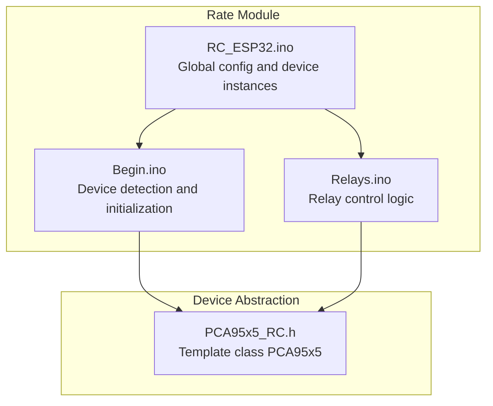
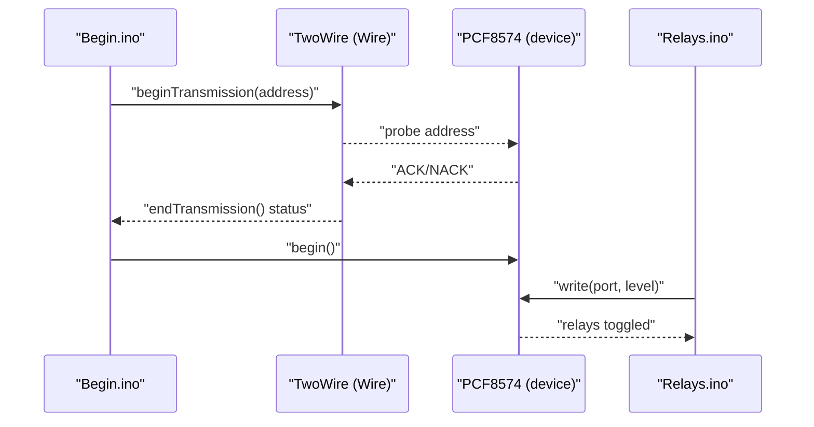
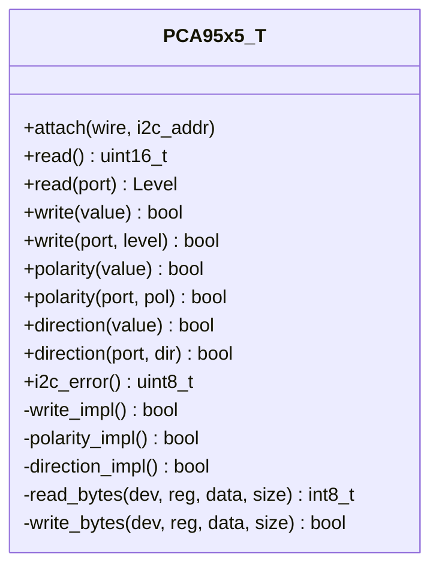
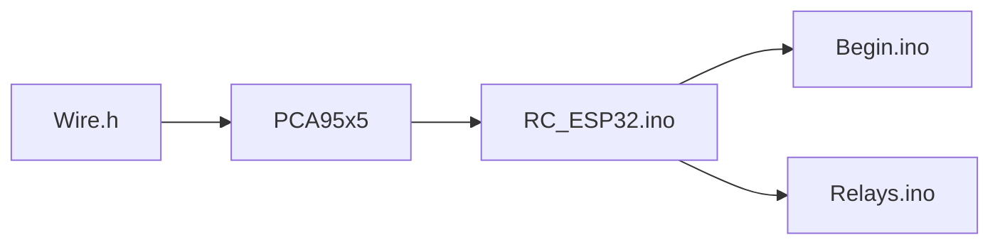

# PCF8574 GPIO Expander Configuration

<cite>
**Referenced Files in This Document**
- [PCA95x5_RC.h](file://RC_ESP32/PCA95x5_RC.h)
- [RC_ESP32.ino](file://RC_ESP32/RC_ESP32.ino)
- [Begin.ino](file://RC_ESP32/Begin.ino)
- [Relays.ino](file://RC_ESP32/Relays.ino)
- [OLD CODE/RC_ESP32/RC_ESP32.ino](file://OLD CODE/RC_ESP32/RC_ESP32.ino)
- [OLD CODE/RC_ESP32/Begin.ino](file://OLD CODE/RC_ESP32/Begin.ino)
</cite>

## Table of Contents
1. [Introduction](#introduction)
2. [Project Structure](#project-structure)
3. [Core Components](#core-components)
4. [Architecture Overview](#architecture-overview)
5. [Detailed Component Analysis](#detailed-component-analysis)
6. [Dependency Analysis](#dependency-analysis)
7. [Performance Considerations](#performance-considerations)
8. [Troubleshooting Guide](#troubleshooting-guide)
9. [Conclusion](#conclusion)

## Introduction
This document explains the PCF8574 GPIO expander implementation and configuration used in the Rate Module. It covers I2C addressing, port mapping, register operations, and the template-based PCA95x5 class that supports both PCF8574 and PCA9555 devices. It also documents the port numbering scheme (P00–P07, P10–P17), I2C communication protocol, timing considerations, error handling, and practical examples for configuring relays and troubleshooting I2C bus issues.

## Project Structure
The PCF8574 integration spans several files:
- Device abstraction and I2C operations are encapsulated in a reusable template class.
- Initialization and detection logic is implemented during module startup.
- Relay control logic writes to the expander to drive external relays.

**Diagram sources**
- [RC_ESP32.ino:46](file://RC_ESP32/RC_ESP32.ino#L46)
- [Begin.ino:484](file://RC_ESP32/Begin.ino#L484)
- [Relays.ino:262](file://RC_ESP32/Relays.ino#L262)
- [PCA95x5_RC.h:55](file://RC_ESP32/PCA95x5_RC.h#L55)

**Section sources**
- [RC_ESP32.ino:46](file://RC_ESP32/RC_ESP32.ino#L46)
- [Begin.ino:484](file://RC_ESP32/Begin.ino#L484)
- [Relays.ino:262](file://RC_ESP32/Relays.ino#L262)
- [PCA95x5_RC.h:55](file://RC_ESP32/PCA95x5_RC.h#L55)

## Core Components
- Template class PCA95x5<TwoWire>: Provides generic I2C register access for PCA9555/PCF8574-like devices.
- Port enumeration: P00–P07 and P10–P17 represent the 16-bit port mapping.
- Register operations: Read input, write output, set polarity inversion, and configure direction.
- I2C error reporting via status byte.

Key implementation references:
- Class definition and template parameters: [PCA95x5_RC.h:55–173:55-173](file://RC_ESP32/PCA95x5_RC.h#L55-L173)
- Port and level enumerations: [PCA95x5_RC.h:19–48:19-48](file://RC_ESP32/PCA95x5_RC.h#L19-L48)
- I2C address base constant: [PCA95x5_RC.h:62](file://RC_ESP32/PCA95x5_RC.h#L62)
- Public APIs: read(), write(), polarity(), direction(), i2c_error(): [PCA95x5_RC.h:78–140:78-140](file://RC_ESP32/PCA95x5_RC.h#L78-L140)

**Section sources**
- [PCA95x5_RC.h:55–173:55-173](file://RC_ESP32/PCA95x5_RC.h#L55-L173)
- [PCA95x5_RC.h:19–48:19-48](file://RC_ESP32/PCA95x5_RC.h#L19-L48)
- [PCA95x5_RC.h:62](file://RC_ESP32/PCA95x5_RC.h#L62)
- [PCA95x5_RC.h:78–140:78-140](file://RC_ESP32/PCA95x5_RC.h#L78-L140)

## Architecture Overview
The PCF8574 is detected and initialized during module startup. The relay control logic writes to the expander to activate/deactivate relays. The template class abstracts I2C register operations and exposes a clean API for port manipulation.

**Diagram sources**
- [Begin.ino:484–509:484-509](file://RC_ESP32/Begin.ino#L484-L509)
- [Relays.ino:262–271:262-271](file://RC_ESP32/Relays.ino#L262-L271)

## Detailed Component Analysis

### PCA95x5 Template Class
The class encapsulates:
- I2C address configuration and status tracking.
- 16-bit port state buffers for input, output, polarity inversion, and direction.
- Read/write operations for registers INPUT_PORT_0/1, OUTPUT_PORT_0/1, POLARITY_INVERSION_PORT_0/1, CONFIGURATION_PORT_0/1.
- Helper methods to read/write bytes and report I2C errors.

**Diagram sources**
- [PCA95x5_RC.h:55–173:55-173](file://RC_ESP32/PCA95x5_RC.h#L55-L173)

**Section sources**
- [PCA95x5_RC.h:55–173:55-173](file://RC_ESP32/PCA95x5_RC.h#L55-L173)

### I2C Address Configuration
- Base I2C address constant is defined for the template class.
- The device instance in the module uses a fixed address constant for PCF8574.
- During detection, the code probes the I2C bus for the presence of the device at the configured address.

References:
- Base address constant: [PCA95x5_RC.h:62](file://RC_ESP32/PCA95x5_RC.h#L62)
- Module address constant: [RC_ESP32.ino:46](file://RC_ESP32/RC_ESP32.ino#L46)
- Detection loop: [Begin.ino:489–497:489-497](file://RC_ESP32/Begin.ino#L489-L497)

**Section sources**
- [PCA95x5_RC.h:62](file://RC_ESP32/PCA95x5_RC.h#L62)
- [RC_ESP32.ino:46](file://RC_ESP32/RC_ESP32.ino#L46)
- [Begin.ino:489–497:489-497](file://RC_ESP32/Begin.ino#L489-L497)

### Port Mapping and Numbering Scheme
Ports are numbered as follows:
- P00–P07: Bits 0–7
- P10–P17: Bits 8–15

This maps to a 16-bit word where bit position equals the port number. The template class uses a union to treat the 16-bit word as two 8-bit ports for register operations.

References:
- Port enumeration: [PCA95x5_RC.h:19–37:19-37](file://RC_ESP32/PCA95x5_RC.h#L19-L37)
- Union layout for 16-bit word and byte array: [PCA95x5_RC.h:57–60:57-60](file://RC_ESP32/PCA95x5_RC.h#L57-L60)

**Section sources**
- [PCA95x5_RC.h:19–37:19-37](file://RC_ESP32/PCA95x5_RC.h#L19-L37)
- [PCA95x5_RC.h:57–60:57-60](file://RC_ESP32/PCA95x5_RC.h#L57-L60)

### Register Operations
- Read input port: reads two consecutive registers to populate the internal input buffer.
- Write output port: writes two consecutive registers with the current output buffer.
- Polarity inversion: sets inversion per bit for input ports.
- Direction: configures each bit as input or output.

References:
- Read/write/polarity/direction APIs: [PCA95x5_RC.h:78–136:78-136](file://RC_ESP32/PCA95x5_RC.h#L78-L136)
- Implementation of register writes: [PCA95x5_RC.h:143–153:143-153](file://RC_ESP32/PCA95x5_RC.h#L143-L153)
- Byte transfer helpers: [PCA95x5_RC.h:155–171:155-171](file://RC_ESP32/PCA95x5_RC.h#L155-L171)

**Section sources**
- [PCA95x5_RC.h:78–136:78-136](file://RC_ESP32/PCA95x5_RC.h#L78-L136)
- [PCA95x5_RC.h:143–153:143-153](file://RC_ESP32/PCA95x5_RC.h#L143-L153)
- [PCA95x5_RC.h:155–171:155-171](file://RC_ESP32/PCA95x5_RC.h#L155-L171)

### Polarity Inversion and Direction Configuration
- Polarity inversion allows inverting the logical sense of input bits.
- Direction controls whether a pin is input or output. The template class stores direction per bit.

References:
- Polarity APIs: [PCA95x5_RC.h:111–122:111-122](file://RC_ESP32/PCA95x5_RC.h#L111-L122)
- Direction APIs: [PCA95x5_RC.h:124–136:124-136](file://RC_ESP32/PCA95x5_RC.h#L124-L136)

**Section sources**
- [PCA95x5_RC.h:111–122:111-122](file://RC_ESP32/PCA95x5_RC.h#L111-L122)
- [PCA95x5_RC.h:124–136:124-136](file://RC_ESP32/PCA95x5_RC.h#L124-L136)

### Practical Examples: Configuring Relays
- The module selects PCF8574 as the relay controller type.
- During relay updates, the code iterates over 8 ports and writes the appropriate level based on the inverted flag.

References:
- Relay control selection: [RC_ESP32.ino:84](file://RC_ESP32/RC_ESP32.ino#L84)
- Relay write loop: [Relays.ino:266–269:266-269](file://RC_ESP32/Relays.ino#L266-L269)

**Section sources**
- [RC_ESP32.ino:84](file://RC_ESP32/RC_ESP32.ino#L84)
- [Relays.ino:266–269:266-269](file://RC_ESP32/Relays.ino#L266-L269)

### I2C Communication Protocol and Timing
- The class uses standard Arduino Wire library calls: beginTransmission, write, endTransmission, requestFrom, and available/read.
- Status from endTransmission is captured to detect I2C errors.
- Timing: The detection loop polls with a delay between attempts.

References:
- Wire usage in read_bytes/write_bytes: [PCA95x5_RC.h:155–171:155-171](file://RC_ESP32/PCA95x5_RC.h#L155-L171)
- I2C error reporting: [PCA95x5_RC.h:138–140:138-140](file://RC_ESP32/PCA95x5_RC.h#L138-L140)
- Detection delay: [Begin.ino:495](file://RC_ESP32/Begin.ino#L495)

**Section sources**
- [PCA95x5_RC.h:155–171:155-171](file://RC_ESP32/PCA95x5_RC.h#L155-L171)
- [PCA95x5_RC.h:138–140:138-140](file://RC_ESP32/PCA95x5_RC.h#L138-L140)
- [Begin.ino:495](file://RC_ESP32/Begin.ino#L495)

### Error Handling Mechanisms
- I2C status is returned by endTransmission and stored for later retrieval.
- Device detection uses repeated probing with a small delay and a retry limit.
- The module logs presence or absence of the PCF8574 after detection.

References:
- Status capture and getter: [PCA95x5_RC.h:138–140:138-140](file://RC_ESP32/PCA95x5_RC.h#L138-L140)
- Detection loop and logging: [Begin.ino:489–509:489-509](file://RC_ESP32/Begin.ino#L489-L509)

**Section sources**
- [PCA95x5_RC.h:138–140:138-140](file://RC_ESP32/PCA95x5_RC.h#L138-L140)
- [Begin.ino:489–509:489-509](file://RC_ESP32/Begin.ino#L489-L509)

## Dependency Analysis
The module depends on:
- Arduino Wire library for I2C communication.
- The PCA95x5 template class for device abstraction.
- Global constants and configuration structures for relay control.

**Diagram sources**
- [PCA95x5_RC.h:1–2:1-2](file://RC_ESP32/PCA95x5_RC.h#L1-L2)
- [PCA95x5_RC.h:55](file://RC_ESP32/PCA95x5_RC.h#L55)
- [RC_ESP32.ino:46](file://RC_ESP32/RC_ESP32.ino#L46)
- [Begin.ino:484](file://RC_ESP32/Begin.ino#L484)
- [Relays.ino:262](file://RC_ESP32/Relays.ino#L262)

**Section sources**
- [PCA95x5_RC.h:1–2:1-2](file://RC_ESP32/PCA95x5_RC.h#L1-L2)
- [PCA95x5_RC.h:55](file://RC_ESP32/PCA95x5_RC.h#L55)
- [RC_ESP32.ino:46](file://RC_ESP32/RC_ESP32.ino#L46)
- [Begin.ino:484](file://RC_ESP32/Begin.ino#L484)
- [Relays.ino:262](file://RC_ESP32/Relays.ino#L262)

## Performance Considerations
- Minimize I2C transactions by batching writes when possible.
- Use the 16-bit write interface to update all outputs in a single transaction.
- Avoid excessive polling during detection; tune retry counts and delays for your bus conditions.

## Troubleshooting Guide
Common issues and resolutions:
- Device not found during detection:
  - Verify pull-up resistors on SDA/SCL.
  - Confirm I2C address jumpers on the PCF8574 board match the configured address.
  - Check wiring and power supply to the device.
  - Review detection logs and I2C status.

- No response from I2C bus:
  - Validate Wire.begin() is called before device operations.
  - Ensure no other device occupies the same I2C address.
  - Use an oscilloscope or logic analyzer to check clock/data signals.

- Relays not switching:
  - Confirm relay control type is set to PCF8574.
  - Verify the inverted flag aligns with your relay logic (active-high vs active-low).
  - Check that the output levels written to the expander match expectations.

References:
- Detection and logging: [Begin.ino:489–509:489-509](file://RC_ESP32/Begin.ino#L489-L509)
- Relay control logic: [Relays.ino:266–269:266-269](file://RC_ESP32/Relays.ino#L266-L269)
- I2C error reporting: [PCA95x5_RC.h:138–140:138-140](file://RC_ESP32/PCA95x5_RC.h#L138-L140)

**Section sources**
- [Begin.ino:489–509:489-509](file://RC_ESP32/Begin.ino#L489-L509)
- [Relays.ino:266–269:266-269](file://RC_ESP32/Relays.ino#L266-L269)
- [PCA95x5_RC.h:138–140:138-140](file://RC_ESP32/PCA95x5_RC.h#L138-L140)

## Conclusion
The PCF8574 GPIO expander is integrated via a flexible template class that supports both PCF8574 and PCA9555 devices. The implementation provides robust I2C operations, clear port mapping, and error reporting. By configuring the I2C address, selecting the PCF8574 relay control type, and applying proper polarity and direction settings, the module reliably controls external relays. Use the provided troubleshooting steps to diagnose and resolve common I2C issues.