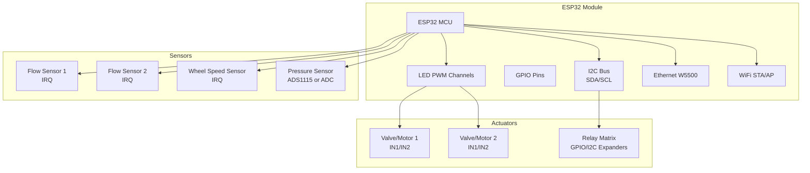
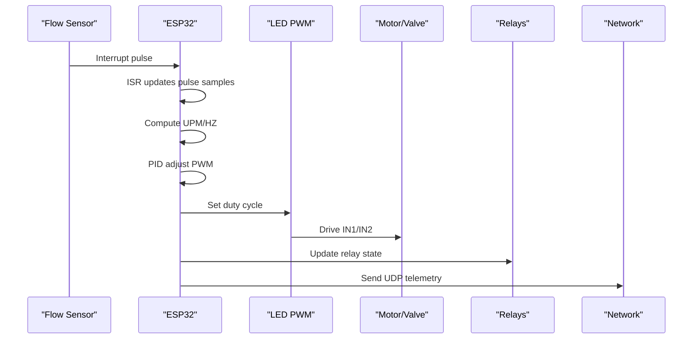
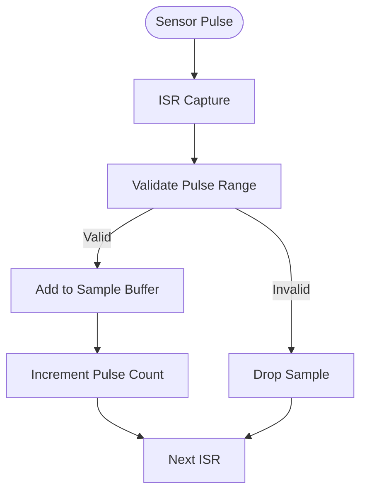
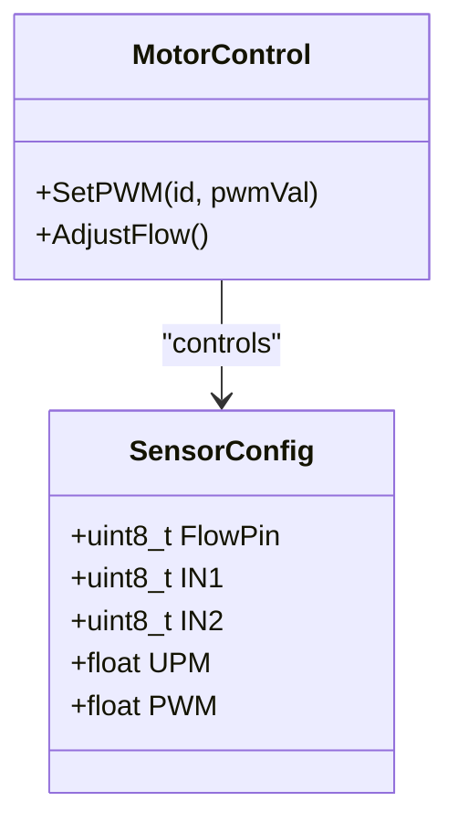
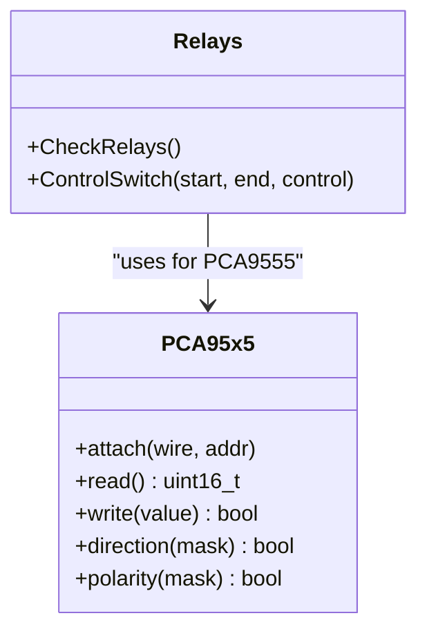
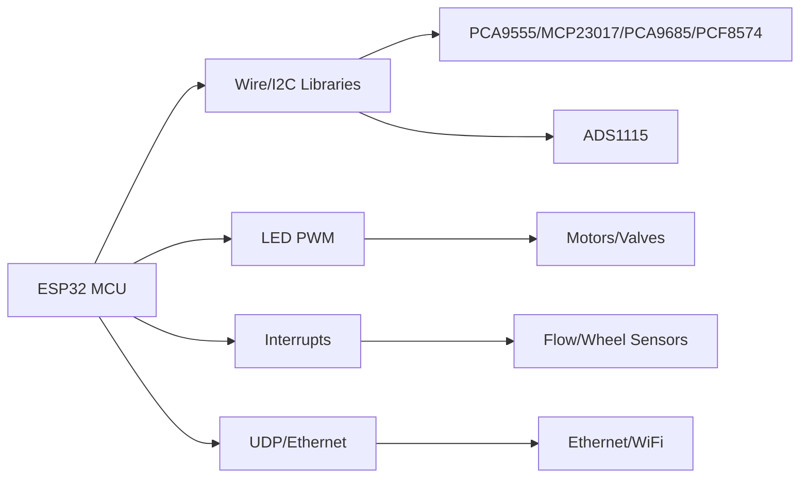
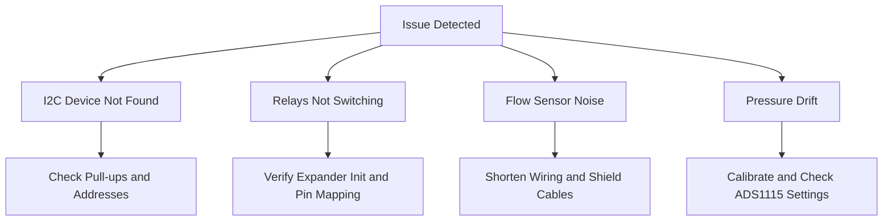

# Wiring Diagrams and Connection Schemes

<cite>
**Referenced Files in This Document**
- [RC_ESP32.ino](file://RC_ESP32/RC_ESP32.ino)
- [Begin.ino](file://RC_ESP32/Begin.ino)
- [PCA95x5_RC.h](file://RC_ESP32/PCA95x5_RC.h)
- [Relays.ino](file://RC_ESP32/Relays.ino)
- [Motor.ino](file://RC_ESP32/Motor.ino)
- [Rate.ino](file://RC_ESP32/Rate.ino)
- [WheelSpeed.ino](file://RC_ESP32/WheelSpeed.ino)
- [Analog.ino](file://RC_ESP32/Analog.ino)
- [PgSwitches.ino](file://RC_ESP32/PgSwitches.ino)
- [Notes.txt](file://Notes.txt)
- [FORK_CHANGES.md](file://FORK_CHANGES.md)
</cite>

## Table of Contents
1. [Introduction](#introduction)
2. [Project Structure](#project-structure)
3. [Core Components](#core-components)
4. [Architecture Overview](#architecture-overview)
5. [Detailed Component Analysis](#detailed-component-analysis)
6. [Dependency Analysis](#dependency-analysis)
7. [Performance Considerations](#performance-considerations)
8. [Troubleshooting Guide](#troubleshooting-guide)
9. [Conclusion](#conclusion)
10. [Appendices](#appendices)

## Introduction
This document provides comprehensive wiring diagrams and connection schemes for the ESP32 Rate Control system. It documents all hardware interfaces including ESP32 GPIOs, I2C expanders, relays, motors, sensors, and power distribution. It includes practical layout recommendations for breadboard and PCB, connector specifications, wire gauges, grounding, noise prevention, and signal integrity considerations. Troubleshooting wiring diagrams are included for common connection errors.

## Project Structure
The rate control system centers around an ESP32 module that manages multiple sensors, motor/valve control, and relay switching. The firmware exposes a web interface and UDP communication for configuration and monitoring.

**Diagram sources**
- [RC_ESP32.ino:250-280](file://RC_ESP32/RC_ESP32.ino#L250-L280)
- [Begin.ino:124-167](file://RC_ESP32/Begin.ino#L124-L167)
- [Motor.ino:31-60](file://RC_ESP32/Motor.ino#L31-L60)
- [Relays.ino:11-69](file://RC_ESP32/Relays.ino#L11-L69)

**Section sources**
- [RC_ESP32.ino:250-280](file://RC_ESP32/RC_ESP32.ino#L250-L280)
- [Begin.ino:124-167](file://RC_ESP32/Begin.ino#L124-L167)

## Core Components
- ESP32 MCU with integrated peripherals
- Flow sensors with interrupt-driven pulse counting
- Wheel speed sensor input
- Pressure sensor via ADS1115 or analog pin
- Motor/valve control via LED PWM channels (IN1/IN2)
- Relay control via onboard GPIOs or I2C expanders (PCA9555/MCP23017/PCA9685/PCF8574)
- Ethernet (W5500) and WiFi (STA/AP) for communication

Key hardware interfaces:
- I2C bus for expanders and ADC
- Dedicated interrupt pins for flow/wheel sensors
- PWM-capable GPIOs for motor/valve control
- Optional ADS1115 analog front-end
- Ethernet and WiFi for remote management

**Section sources**
- [RC_ESP32.ino:76-149](file://RC_ESP32/RC_ESP32.ino#L76-L149)
- [Begin.ino:54-85](file://RC_ESP32/Begin.ino#L54-L85)
- [Motor.ino:31-60](file://RC_ESP32/Motor.ino#L31-L60)

## Architecture Overview
The system architecture integrates real-time sensor sampling, PID-based flow control, and actuator control through PWM and relays. Communication is handled via UDP over Ethernet and WiFi.

**Diagram sources**
- [Rate.ino:14-74](file://RC_ESP32/Rate.ino#L14-L74)
- [Motor.ino:31-60](file://RC_ESP32/Motor.ino#L31-L60)
- [Relays.ino:11-69](file://RC_ESP32/Relays.ino#L11-L69)
- [RC_ESP32.ino:255-280](file://RC_ESP32/RC_ESP32.ino#L255-L280)

## Detailed Component Analysis

### ESP32 Hardware Interfaces
- I2C: SDA/SCL configured at 400 kHz; used for expanders and ADC
- PWM: LED PWM channels configured with frequency and bit resolution
- Interrupts: Dedicated pins for flow and wheel sensors
- Ethernet: W5500 chip initialized with SPI SS pin
- WiFi: AP/STA mode with configurable credentials

Recommended pin assignments (based on defaults and validation):
- Flow sensors: Sensor[0].FlowPin, Sensor[1].FlowPin
- Motor/valve control: Sensor[0].IN1/IN2, Sensor[1].IN1/IN2
- Wheel speed: MDL.WheelSpeedPin
- Pressure: MDL.PressurePin or ADS1115 AIN0

Grounding and power separation:
- Separate logic ground from high-current loads
- Use star grounding near the MCU for I2C and sensor signals
- Keep PWM traces short and away from sensitive analog lines

**Section sources**
- [Begin.ino:54-85](file://RC_ESP32/Begin.ino#L54-L85)
- [Begin.ino:124-167](file://RC_ESP32/Begin.ino#L124-L167)
- [RC_ESP32.ino:49-65](file://RC_ESP32/RC_ESP32.ino#L49-L65)

### Flow Sensors and Interrupt Handling
- Each sensor uses a dedicated interrupt pin
- ISR captures pulse intervals and maintains rolling samples
- Median filtering reduces noise and jitter
- UPM/HZ computed from sampled periods

Wiring tips:
- Use internal pull-up resistors on sensor pins
- Keep sensor wiring short; shielded cables for long runs
- Place pull-up resistor close to MCU to minimize noise pickup

**Diagram sources**
- [Rate.ino:14-29](file://RC_ESP32/Rate.ino#L14-L29)
- [Rate.ino:31-74](file://RC_ESP32/Rate.ino#L31-L74)

**Section sources**
- [Rate.ino:14-74](file://RC_ESP32/Rate.ino#L14-L74)

### Wheel Speed Sensor
- Dedicated interrupt pin with falling-edge detection
- Median sampling over configurable window
- Speed calculation using calibrated wheel circumference

Wiring:
- Use external pull-up if needed; ensure clean transitions
- Debounce handled in firmware; keep wiring mechanical integrity

**Section sources**
- [WheelSpeed.ino:15-71](file://RC_ESP32/WheelSpeed.ino#L15-L71)

### Pressure Sensor (ADS1115 or Analog)
- ADS1115: I2C single-ended measurement on AIN0
- Fallback: ESP32 analog pin if ADC not present

Wiring:
- For ADS1115, connect AIN0 to pressure transducer output
- Use 3.3V supply; ensure proper gain and data rate settings
- For analog pin, ensure voltage within 0–3.3V range

**Section sources**
- [Analog.ino:2-65](file://RC_ESP32/Analog.ino#L2-L65)
- [Begin.ino:58-85](file://RC_ESP32/Begin.ino#L58-L85)

### Motor/Valve PWM Control
- PWM generated via LED PWM channels
- Direction controlled by IN1/IN2 pins
- Duty cycle scaled to configured PWM range

Wiring:
- Connect IN1/IN2 to motor driver or valve coil
- Ensure driver can handle peak current and voltage
- Use flyback diodes across motor terminals

**Diagram sources**
- [Motor.ino:31-60](file://RC_ESP32/Motor.ino#L31-L60)
- [RC_ESP32.ino:113-143](file://RC_ESP32/RC_ESP32.ino#L113-L143)

**Section sources**
- [Motor.ino:2-76](file://RC_ESP32/Motor.ino#L2-L76)

### Relay Control via I2C Expanders
Supported expanders:
- PCA9555: 16-bit I/O expander
- MCP23017: 16-bit I/O expander (two addresses)
- PCA9685: 16-channel 12-bit PWM expander
- PCF8574: 8-bit I/O expander

Wiring:
- I2C SDA/SCL shared among all devices
- Pull-ups recommended (internal/external)
- Address selection via A0/A1/A2 pins

**Diagram sources**
- [PCA95x5_RC.h:55-178](file://RC_ESP32/PCA95x5_RC.h#L55-L178)
- [Relays.ino:71-273](file://RC_ESP32/Relays.ino#L71-L273)

**Section sources**
- [PCA95x5_RC.h:55-178](file://RC_ESP32/PCA95x5_RC.h#L55-L178)
- [Relays.ino:11-69](file://RC_ESP32/Relays.ino#L11-L69)

### Web Interface and Network Connectivity
- Access Point mode with dynamic IP per module
- Web server for configuration pages
- UDP communication for telemetry and control

Wiring:
- Ethernet cable to W5500; ensure correct SS pin
- WiFi antenna for reliable connectivity

**Section sources**
- [RC_ESP32.ino:250-280](file://RC_ESP32/RC_ESP32.ino#L250-L280)
- [Begin.ino:173-207](file://RC_ESP32/Begin.ino#L173-L207)
- [PgSwitches.ino:1-132](file://RC_ESP32/PgSwitches.ino#L1-L132)
- [Notes.txt:1-8](file://Notes.txt#L1-L8)

## Dependency Analysis
The system depends on:
- I2C libraries for expanders and ADC
- LED PWM for motor/valve control
- Interrupt-driven sampling for sensors
- UDP stack for networking

**Diagram sources**
- [RC_ESP32.ino:12-26](file://RC_ESP32/RC_ESP32.ino#L12-L26)
- [Begin.ino:54-85](file://RC_ESP32/Begin.ino#L54-L85)
- [Motor.ino:31-60](file://RC_ESP32/Motor.ino#L31-L60)
- [Relays.ino:71-273](file://RC_ESP32/Relays.ino#L71-L273)

**Section sources**
- [RC_ESP32.ino:12-26](file://RC_ESP32/RC_ESP32.ino#L12-L26)
- [Begin.ino:54-85](file://RC_ESP32/Begin.ino#L54-L85)

## Performance Considerations
- PWM frequency and resolution are tuned for motor/valve compatibility
- Interrupt service routines keep sampling minimal and efficient
- Median filtering reduces noise impact on measurements
- I2C bus speed set to 400 kHz for reliability

[No sources needed since this section provides general guidance]

## Troubleshooting Guide

### Common Wiring Issues and Fixes
- I2C device not detected:
  - Verify pull-ups on SDA/SCL
  - Check address conflicts
  - Confirm wiring continuity and power
- Relays not switching:
  - Validate expander initialization
  - Check control pin mapping and inversion settings
  - Ensure adequate drive voltage/current
- Flow sensor noisy readings:
  - Shorten wiring and use shielded cables
  - Verify pull-up resistors and signal integrity
  - Confirm interrupt pin configuration
- Pressure sensor drift:
  - Calibrate wheel speed if applicable
  - Check ADS1115 wiring and gain settings
  - Verify analog pin protection and range

**Diagram sources**
- [Begin.ino:367-511](file://RC_ESP32/Begin.ino#L367-L511)
- [Relays.ino:71-273](file://RC_ESP32/Relays.ino#L71-L273)
- [Analog.ino:2-65](file://RC_ESP32/Analog.ino#L2-L65)

**Section sources**
- [Begin.ino:367-511](file://RC_ESP32/Begin.ino#L367-L511)
- [Relays.ino:71-273](file://RC_ESP32/Relays.ino#L71-L273)

## Conclusion
The ESP32 Rate Control system integrates robust sensor sampling, precise PWM control, and flexible relay management via I2C expanders. Proper wiring, grounding, and signal integrity are essential for reliable operation. The provided diagrams and guidelines should facilitate successful breadboard and PCB layouts.

[No sources needed since this section summarizes without analyzing specific files]

## Appendices

### Connector Specifications and Wire Gauges
- I2C: Standard 4-pin header or screw terminal strips
- Motor/Valve: Terminal block or Molex connectors rated for load current
- Sensors: 3-pin JST or 2.54mm pitch headers
- ADS1115: 8-pin DIP or surface-mount package with breakout boards
- Ethernet: RJ45 with Cat5e/Cat6 for reliable UDP throughput

[No sources needed since this section provides general guidance]

### Power Distribution Recommendations
- Main power: Dedicated 12V/24V supply to actuators and drivers
- Logic power: 5V/3.3V from ESP32 regulator or external DC-DC
- Signal power: Separate 3.3V rail for I2C and sensors
- Decoupling: Place 0.1µF and 10µF capacitors near each IC and motor driver

[No sources needed since this section provides general guidance]

### Grounding and Noise Prevention
- Star grounding near MCU; avoid ground loops
- Keep high-current traces short and wide
- Route PWM traces away from analog and I2C lines
- Use differential signaling for long sensor runs if available

[No sources needed since this section provides general guidance]

### Layout Examples

#### Breadboard Layout (Conceptual)
- Place ESP32 at center; route I2C near MCU
- Keep sensor wiring as short as possible; add pull-ups
- Position relays near actuators; use terminal blocks
- Provide separate power rails for logic and high-current loads

[No sources needed since this diagram shows conceptual layout, not actual code structure]

#### PCB Layout Recommendations
- Multi-layer board: GND plane under sensitive analog traces
- Keep I2C routing matched length and short
- Provide thermal relief for large power pads
- Add ferrite beads on I2C lines if EMI issues persist

[No sources needed since this section provides general guidance]