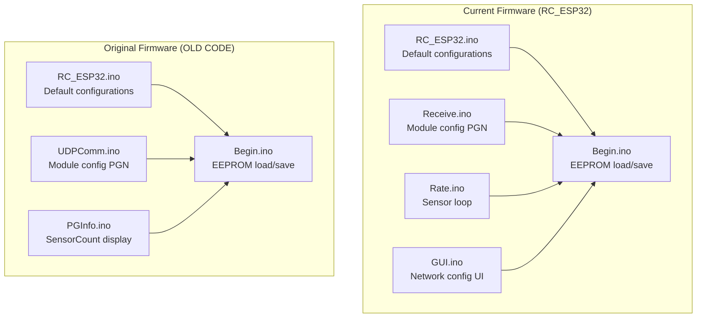
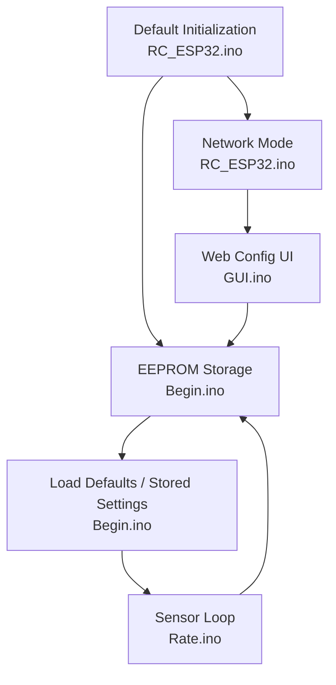
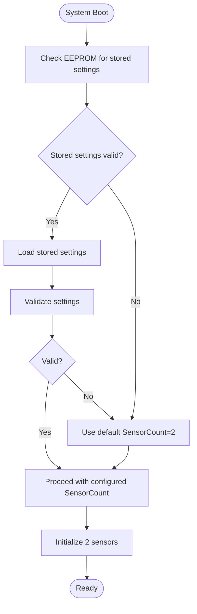
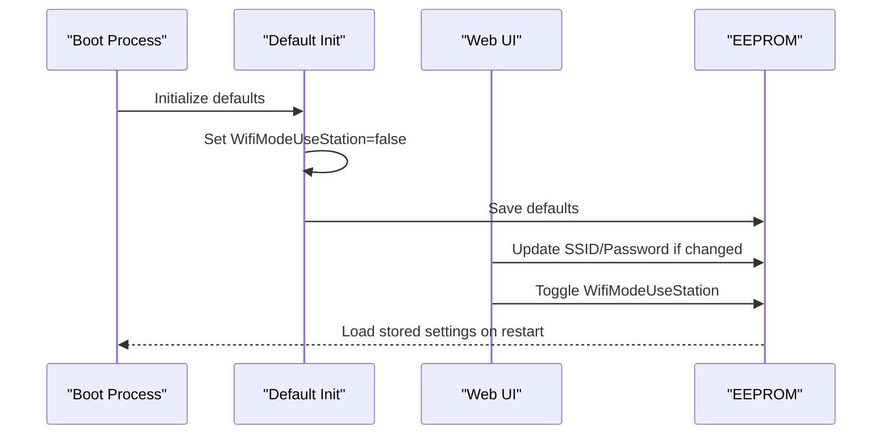
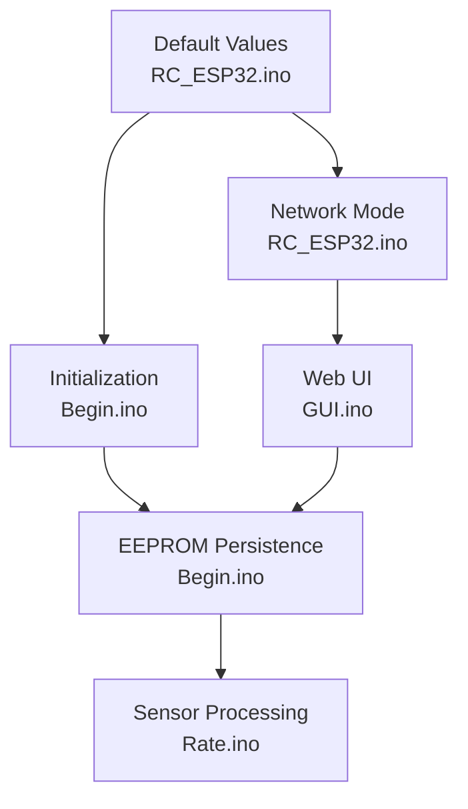

# Default Configuration Updates

<cite>
**Referenced Files in This Document**
- [Begin.ino](file://RC_ESP32/Begin.ino)
- [RC_ESP32.ino](file://RC_ESP32/RC_ESP32.ino)
- [Receive.ino](file://RC_ESP32/Receive.ino)
- [Rate.ino](file://RC_ESP32/Rate.ino)
- [Begin.ino](file://OLD CODE/RC_ESP32/Begin.ino)
- [RC_ESP32.ino](file://OLD CODE/RC_ESP32/RC_ESP32.ino)
- [UDPComm.ino](file://OLD CODE/RC_ESP32/UDPComm.ino)
- [PGInfo.ino](file://OLD CODE/RC_ESP32/PGInfo.ino)
- [GUI.ino](file://RC_ESP32/GUI.ino)
</cite>

## Table of Contents
1. [Introduction](#introduction)
2. [Project Structure](#project-structure)
3. [Core Components](#core-components)
4. [Architecture Overview](#architecture-overview)
5. [Detailed Component Analysis](#detailed-component-analysis)
6. [Dependency Analysis](#dependency-analysis)
7. [Performance Considerations](#performance-considerations)
8. [Troubleshooting Guide](#troubleshooting-guide)
9. [Conclusion](#conclusion)

## Introduction
This document details the default configuration changes introduced during the fork of the ESP32 Rate module firmware. It focuses on two primary updates:
- Increase in SensorCount from 1 to 2
- Change in WifiMode from dual station/AP (1) to AP-only (0)

The document explains the rationale behind each change, how they affect system startup and operation, their implications for different deployment scenarios, and where persistent configuration settings are stored in EEPROM. Guidance is also provided for customizing defaults for specific applications.

## Project Structure
The repository contains both the original and updated firmware versions. The key areas affected by the fork are:
- Default configuration initialization and persistence
- Network mode selection and behavior
- Sensor count handling and startup logic
- Web interface for network configuration

**Diagram sources**
- [RC_ESP32.ino](file://RC_ESP32/RC_ESP32.ino)
- [Begin.ino](file://RC_ESP32/Begin.ino)
- [Receive.ino](file://RC_ESP32/Receive.ino)
- [Rate.ino](file://RC_ESP32/Rate.ino)
- [GUI.ino](file://RC_ESP32/GUI.ino)
- [RC_ESP32.ino](file://OLD CODE/RC_ESP32/RC_ESP32.ino)
- [Begin.ino](file://OLD CODE/RC_ESP32/Begin.ino)
- [UDPComm.ino](file://OLD CODE/RC_ESP32/UDPComm.ino)
- [PGInfo.ino](file://OLD CODE/RC_ESP32/PGInfo.ino)

**Section sources**
- [RC_ESP32.ino](file://RC_ESP32/RC_ESP32.ino)
- [Begin.ino](file://RC_ESP32/Begin.ino)
- [Receive.ino](file://RC_ESP32/Receive.ino)
- [Rate.ino](file://RC_ESP32/Rate.ino)
- [GUI.ino](file://RC_ESP32/GUI.ino)
- [RC_ESP32.ino](file://OLD CODE/RC_ESP32/RC_ESP32.ino)
- [Begin.ino](file://OLD CODE/RC_ESP32/Begin.ino)
- [UDPComm.ino](file://OLD CODE/RC_ESP32/UDPComm.ino)
- [PGInfo.ino](file://OLD CODE/RC_ESP32/PGInfo.ino)

## Core Components
This section outlines the core components impacted by the default configuration changes and their roles in system behavior.

- Default configuration initialization
  - Defines initial values for module identity, network mode, sensor count, and hardware pin assignments.
  - Ensures consistent startup behavior across deployments.

- EEPROM persistence
  - Stores and retrieves persistent configuration data, including module settings and sensor configurations.
  - Provides fallback to defaults when stored data is invalid or missing.

- Network configuration
  - Controls whether the device operates in AP-only or dual station/AP mode.
  - Exposes web UI controls for SSID/password and AP password.

- Sensor handling
  - Manages up to the configured number of sensors, processing pulse inputs and applying control logic.
  - Impacts startup behavior and resource allocation depending on SensorCount.

**Section sources**
- [RC_ESP32.ino](file://RC_ESP32/RC_ESP32.ino)
- [Begin.ino](file://RC_ESP32/Begin.ino)
- [GUI.ino](file://RC_ESP32/GUI.ino)
- [Rate.ino](file://RC_ESP32/Rate.ino)

## Architecture Overview
The system architecture integrates default configuration, EEPROM persistence, network mode selection, and sensor processing. The fork introduces stricter defaults aimed at simplifying deployment and reducing complexity.

**Diagram sources**
- [RC_ESP32.ino](file://RC_ESP32/RC_ESP32.ino)
- [Begin.ino](file://RC_ESP32/Begin.ino)
- [Rate.ino](file://RC_ESP32/Rate.ino)
- [GUI.ino](file://RC_ESP32/GUI.ino)

## Detailed Component Analysis

### Default SensorCount Increase (1 → 2)
Rationale:
- Enables dual-sensor operation out-of-the-box, supporting simultaneous rate control for two products.
- Reduces deployment complexity by eliminating the need to configure sensor count after flashing.

Startup impact:
- The system initializes with two sensors enabled by default.
- Sensor-specific configurations (pins, control parameters) are loaded for both sensors.
- Resource allocation increases accordingly, with ISR handling and sampling arrays sized for two sensors.

Operational implications:
- Applications requiring dual-rate control benefit immediately.
- Single-sensor deployments still function but allocate resources for two sensors.

**Diagram sources**
- [Begin.ino](file://RC_ESP32/Begin.ino)
- [RC_ESP32.ino](file://RC_ESP32/RC_ESP32.ino)
- [Rate.ino](file://RC_ESP32/Rate.ino)

**Section sources**
- [RC_ESP32.ino](file://RC_ESP32/RC_ESP32.ino)
- [Begin.ino](file://RC_ESP32/Begin.ino)
- [Rate.ino](file://RC_ESP32/Rate.ino)

### Default WifiMode Change (Dual Station/AP → AP-only)
Rationale:
- Simplifies deployment by removing the complexity of managing both AP and station modes.
- Reduces power consumption and radio contention by operating in AP-only mode.
- Aligns with typical use cases where the device acts as a standalone access point.

Startup impact:
- The device starts in AP-only mode by default.
- Network credentials for connecting to an external Wi-Fi network are not applied until explicitly configured via the web UI.
- The web UI exposes toggles to enable station mode and set SSID/password.

Operational implications:
- AP-only mode is ideal for agricultural or industrial environments where a dedicated access point is preferred.
- Station mode remains available for deployments requiring connectivity to an existing Wi-Fi infrastructure.

**Diagram sources**
- [RC_ESP32.ino](file://RC_ESP32/RC_ESP32.ino)
- [GUI.ino](file://RC_ESP32/GUI.ino)
- [Begin.ino](file://RC_ESP32/Begin.ino)

**Section sources**
- [RC_ESP32.ino](file://RC_ESP32/RC_ESP32.ino)
- [GUI.ino](file://RC_ESP32/GUI.ino)
- [Begin.ino](file://RC_ESP32/Begin.ino)

### EEPROM Storage Locations for Persistent Configuration
The current firmware stores persistent data at specific EEPROM offsets. These locations are used to save and restore module settings and sensor configurations.

Key storage areas:
- Identity markers and types at the beginning of storage
- Module configuration block (MDL) containing network and operational settings
- Per-sensor configuration blocks, indexed by sensor number
- Additional flags and control settings

Storage layout highlights:
- Identity and type markers for validation
- Module network settings (IP, SSID, password, station mode flag)
- Per-sensor control parameters (pins, PID gains, limits, etc.)
- Commit to EEPROM ensures data durability across resets

Note: The exact offset values and sizes are defined in the EEPROM read/write routines and should be referenced from the source files when modifying or extending the storage scheme.

**Section sources**
- [Begin.ino](file://RC_ESP32/Begin.ino)

### Impact on System Behavior
- Dual sensors: Increased ISR overhead and memory usage for pulse sampling and control loops.
- AP-only mode: Reduced Wi-Fi complexity and improved reliability in environments with limited Wi-Fi infrastructure.
- Startup: Defaults are applied automatically if stored data is invalid or missing, ensuring predictable behavior.

Deployment scenarios:
- Single-sensor applications: Operate with minimal changes; unused sensor resources remain allocated.
- Dual-sensor applications: Immediate support for two independent rate controls.
- AP-only deployments: Ideal for isolated networks or environments without managed Wi-Fi.
- Station mode deployments: Use the web UI to connect to an existing Wi-Fi network when needed.

**Section sources**
- [Rate.ino](file://RC_ESP32/Rate.ino)
- [GUI.ino](file://RC_ESP32/GUI.ino)
- [Begin.ino](file://RC_ESP32/Begin.ino)

### Customizing Defaults for Specific Applications
To customize defaults for specific applications:
- Modify default values in the default initialization routine to match target hardware and deployment needs.
- Adjust sensor pin assignments and control parameters to align with installed peripherals.
- Configure network defaults (AP name/password) for streamlined deployment.
- Use the web UI to override defaults post-flash and persist changes to EEPROM.

Guidance:
- Keep SensorCount aligned with installed hardware to avoid unnecessary resource allocation.
- Prefer AP-only mode for simplicity unless station connectivity is required.
- Validate EEPROM offsets and sizes when adding new persistent settings to prevent conflicts.

**Section sources**
- [RC_ESP32.ino](file://RC_ESP32/RC_ESP32.ino)
- [GUI.ino](file://RC_ESP32/GUI.ino)
- [Begin.ino](file://RC_ESP32/Begin.ino)

## Dependency Analysis
The default configuration changes introduce dependencies between initialization, EEPROM persistence, and runtime behavior.

**Diagram sources**
- [RC_ESP32.ino](file://RC_ESP32/RC_ESP32.ino)
- [Begin.ino](file://RC_ESP32/Begin.ino)
- [Rate.ino](file://RC_ESP32/Rate.ino)
- [GUI.ino](file://RC_ESP32/GUI.ino)

**Section sources**
- [RC_ESP32.ino](file://RC_ESP32/RC_ESP32.ino)
- [Begin.ino](file://RC_ESP32/Begin.ino)
- [Rate.ino](file://RC_ESP32/Rate.ino)
- [GUI.ino](file://RC_ESP32/GUI.ino)

## Performance Considerations
- Dual sensors increase ISR frequency and memory usage for pulse sampling and control calculations.
- AP-only mode reduces Wi-Fi-related overhead and potential interference.
- EEPROM writes occur on configuration changes; batch updates to minimize wear.

## Troubleshooting Guide
Common issues and resolutions:
- Invalid stored settings: The system falls back to defaults and saves them to EEPROM.
- Unexpected sensor behavior: Verify SensorCount and per-sensor pin assignments match hardware.
- Network connectivity problems: Confirm station mode is enabled and SSID/password are correct; restart after changes.
- EEPROM corruption: Clear stored settings and reconfigure via the web UI.

**Section sources**
- [Begin.ino](file://RC_ESP32/Begin.ino)
- [GUI.ino](file://RC_ESP32/GUI.ino)

## Conclusion
The fork introduces two significant default configuration changes:
- SensorCount increased from 1 to 2, enabling dual-sensor operation out-of-the-box.
- WifiMode changed from dual station/AP to AP-only, simplifying deployment and reducing complexity.

These changes streamline startup behavior, improve reliability in typical deployment scenarios, and provide a solid foundation for customization. Understanding the EEPROM storage locations and the initialization flow enables targeted modifications for specialized applications.