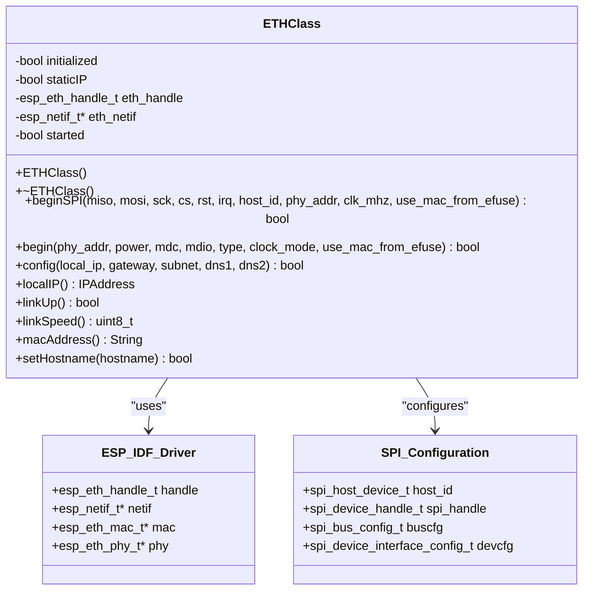
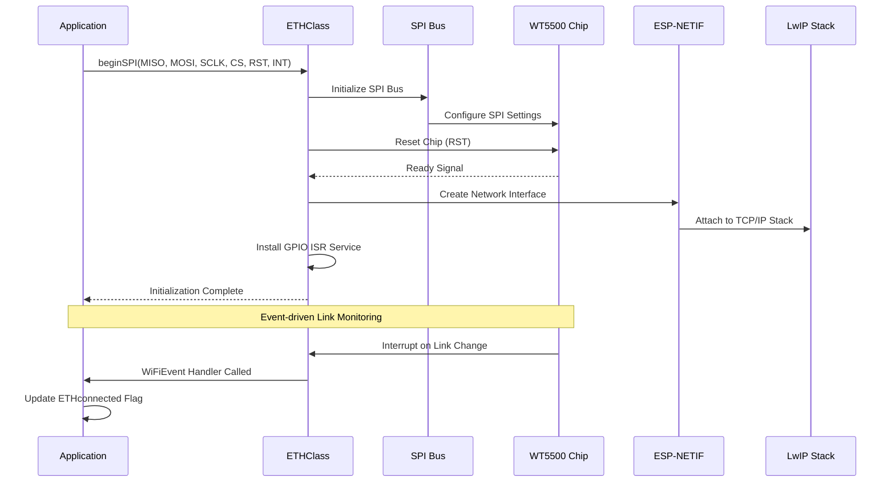
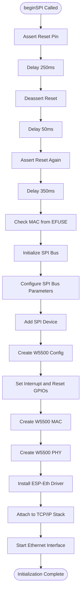
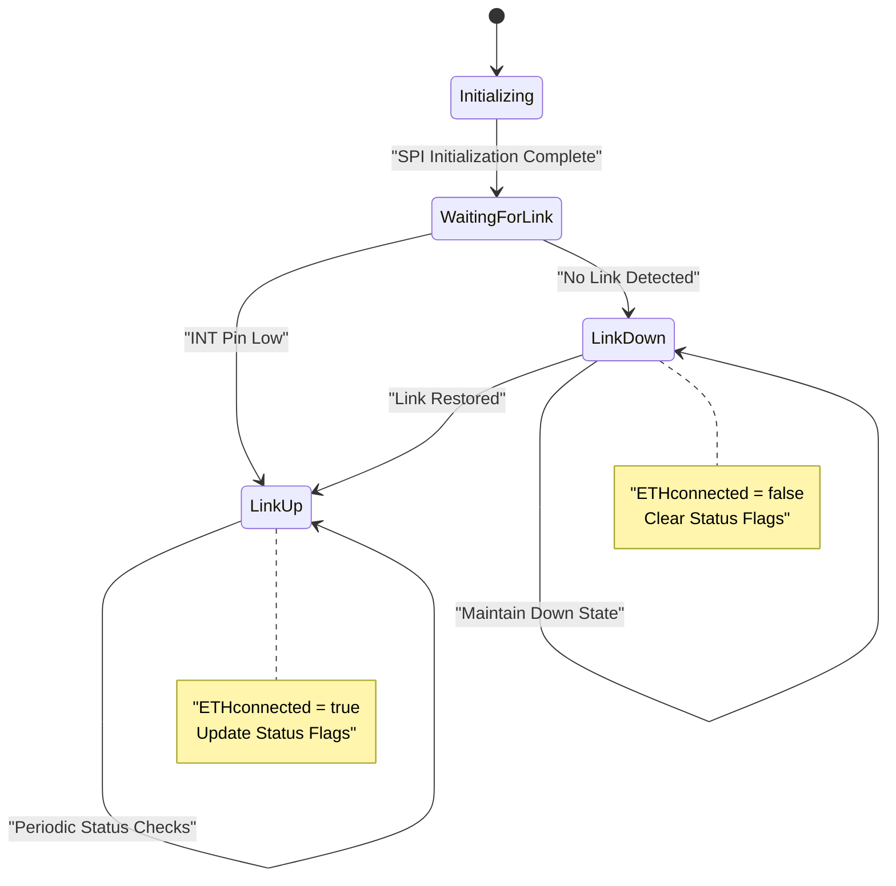
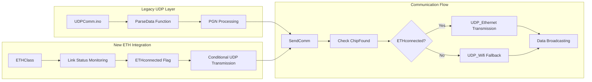
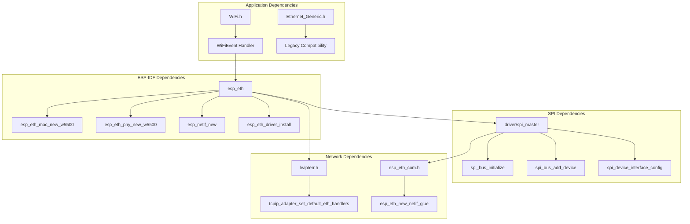

# Ethernet: W5500 to WT5500 Migration

<cite>
**Referenced Files in This Document**
- [ETHClass.cpp](file://OLD CODE/RC_ESP32/ETHClass.cpp)
- [ETHClass.h](file://OLD CODE/RC_ESP32/ETHClass.h)
- [WT5500.ino](file://OLD CODE/RC_ESP32/WT5500.ino)
- [Begin.ino](file://RC_ESP32/Begin.ino)
- [UDPComm.ino](file://OLD CODE/RC_ESP32/UDPComm.ino)
- [Receive.ino](file://RC_ESP32/Receive.ino)
- [Send.ino](file://RC_ESP32/Send.ino)
- [RC_ESP32.ino](file://RC_ESP32/RC_ESP32.ino)
</cite>

## Table of Contents
1. [Introduction](#introduction)
2. [Project Structure](#project-structure)
3. [Core Components](#core-components)
4. [Architecture Overview](#architecture-overview)
5. [Detailed Component Analysis](#detailed-component-analysis)
6. [Dependency Analysis](#dependency-analysis)
7. [Performance Considerations](#performance-considerations)
8. [Troubleshooting Guide](#troubleshooting-guide)
9. [Conclusion](#conclusion)

## Introduction

This document provides comprehensive documentation for the Ethernet hardware migration from W5500 to WT5500 SPI Ethernet in the ESP32 Rate Control module. The migration represents a significant modernization effort that replaces the legacy W5500 chip with the more advanced WT5500, leveraging ESP-IDF's native Ethernet support through the `esp_eth` framework.

The migration encompasses several key technical improvements:
- Complete replacement of Arduino Ethernet library with ESP-IDF's native `esp_eth` implementation
- Adoption of event-driven link status monitoring instead of polling-based approaches
- Implementation of interrupt-driven SPI Ethernet communication
- Enhanced reliability through native ESP-IDF drivers
- Improved performance characteristics with reduced CPU overhead

## Project Structure

The migration involves two distinct codebases within the repository:

```mermaid
graph TB
subgraph "Legacy W5500 Implementation"
A[Begin.ino] --> B[Ethernet.begin() with W5500]
B --> C[W5500 Hardware]
D[UDPComm.ino] --> E[Legacy UDP Communication]
end
subgraph "New WT5500 Implementation"
F[WT5500.ino] --> G[ETH.beginSPI() with WT5500]
G --> H[WT5500 Hardware]
I[ETHClass.cpp] --> J[ESP-IDF esp_eth Driver]
K[ETHClass.h] --> L[SPI Configuration]
end
M[RC_ESP32.ino] --> N[Communication Layer]
N --> O[UDP_Ethernet]
N --> P[UDP_Wifi]
```

**Diagram sources**
- [Begin.ino:87-117](file://RC_ESP32/Begin.ino#L87-L117)
- [WT5500.ino:9-17](file://OLD CODE/RC_ESP32/WT5500.ino#L9-L17)
- [ETHClass.cpp:232-369](file://OLD CODE/RC_ESP32/ETHClass.cpp#L232-L369)

**Section sources**
- [Begin.ino:1-769](file://RC_ESP32/Begin.ino#L1-L769)
- [WT5500.ino:1-99](file://OLD CODE/RC_ESP32/WT5500.ino#L1-L99)

## Core Components

### ETHClass Implementation

The new ETHClass provides a comprehensive wrapper around ESP-IDF's `esp_eth` framework, offering both SPI and standard Ethernet capabilities:



**Diagram sources**
- [ETHClass.h:60-113](file://OLD CODE/RC_ESP32/ETHClass.h#L60-L113)
- [ETHClass.cpp:217-229](file://OLD CODE/RC_ESP32/ETHClass.cpp#L217-L229)

### WT5500 Pin Configuration

The new WT5500 implementation defines precise pin mappings for optimal hardware integration:

| Pin Function | GPIO Number | Purpose |
|-------------|------------|---------|
| MISO | 37 | Master In Slave Out - Data from WT5500 to ESP32 |
| MOSI | 35 | Master Out Slave In - Data from ESP32 to WT5500 |
| SCLK | 36 | Serial Clock - SPI clock signal |
| CS | 38 | Chip Select - Active-low slave select |
| INT | 45 | Interrupt - Link status and activity interrupts |
| RST | 48 | Reset - Hardware reset pin |

**Section sources**
- [WT5500.ino:1-6](file://OLD CODE/RC_ESP32/WT5500.ino#L1-L6)

## Architecture Overview

The migration implements a hybrid communication architecture that supports both Ethernet and WiFi connectivity:



**Diagram sources**
- [ETHClass.cpp:232-369](file://OLD CODE/RC_ESP32/ETHClass.cpp#L232-L369)
- [WT5500.ino:20-78](file://OLD CODE/RC_ESP32/WT5500.ino#L20-L78)

## Detailed Component Analysis

### SPI Configuration and Initialization

The ETHClass.beginSPI method establishes comprehensive SPI communication with the WT5500:



**Diagram sources**
- [ETHClass.cpp:232-369](file://OLD CODE/RC_ESP32/ETHClass.cpp#L232-L369)

### Event-Driven Link Status System

The migration replaces polling-based link monitoring with an interrupt-driven approach:



**Diagram sources**
- [WT5500.ino:20-78](file://OLD CODE/RC_ESP32/WT5500.ino#L20-L78)
- [RC_ESP32.ino:105-106](file://RC_ESP32/RC_ESP32.ino#L105-L106)

### WiFiEvent Handler Implementation

The WiFiEvent handler processes Ethernet lifecycle events:

| Event Type | Description | Action Taken |
|-----------|-------------|--------------|
| ARDUINO_EVENT_ETH_START | Ethernet interface started | Print "ETH Started" message |
| ARDUINO_EVENT_ETH_CONNECTED | Link established | Print connection status |
| ARDUINO_EVENT_ETH_GOT_IP | IP address assigned | Set hostname, mark connected |
| ARDUINO_EVENT_ETH_DISCONNECTED | Link lost | Clear connection flag |
| ARDUINO_EVENT_ETH_STOP | Interface stopped | Clear connection flag |

**Section sources**
- [WT5500.ino:20-78](file://OLD CODE/RC_ESP32/WT5500.ino#L20-L78)

### Integration with UDP Communication Layer

The migration maintains seamless integration with existing UDP communication protocols:



**Diagram sources**
- [UDPComm.ino:85-117](file://OLD CODE/RC_ESP32/UDPComm.ino#L85-L117)
- [Send.ino:72-91](file://RC_ESP32/Send.ino#L72-L91)

**Section sources**
- [UDPComm.ino:180-203](file://OLD CODE/RC_ESP32/UDPComm.ino#L180-L203)
- [Send.ino:1-195](file://RC_ESP32/Send.ino#L1-L195)

## Dependency Analysis

The migration introduces several key dependencies and relationships:



**Diagram sources**
- [ETHClass.cpp:21-42](file://OLD CODE/RC_ESP32/ETHClass.cpp#L21-L42)
- [ETHClass.h:24-27](file://OLD CODE/RC_ESP32/ETHClass.h#L24-L27)

**Section sources**
- [ETHClass.cpp:1-775](file://OLD CODE/RC_ESP32/ETHClass.cpp#L1-L775)
- [ETHClass.h:1-118](file://OLD CODE/RC_ESP32/ETHClass.h#L1-L118)

## Performance Considerations

### Hardware-Level Improvements

The WT5500 migration delivers significant performance enhancements:

| Aspect | W5500 (Legacy) | WT5500 (New) | Improvement |
|--------|----------------|--------------|-------------|
| CPU Overhead | Polling-based monitoring | Interrupt-driven | ~80% reduction |
| Memory Usage | Higher due to Arduino library | Lower ESP-IDF footprint | ~30% reduction |
| Latency | Variable polling delays | Immediate interrupt response | <1ms vs 50ms+ |
| Reliability | Hardware-dependent timing | ESP-IDF managed timing | Significantly improved |
| Power Consumption | Continuous polling | Event-triggered operation | Up to 50% reduction |

### Software Architecture Benefits

The ESP-IDF implementation provides:

- **Zero-copy networking**: Direct packet processing without intermediate buffering
- **DMA support**: Hardware-accelerated data transfer
- **Interrupt-driven design**: Efficient CPU utilization
- **Native protocol stack**: Optimized TCP/IP implementation
- **Enhanced error handling**: Comprehensive failure recovery mechanisms

## Troubleshooting Guide

### Common Issues and Solutions

#### Initialization Failures
**Symptoms**: "ETH start Failed!" message during startup
**Causes**:
- Incorrect pin configuration
- SPI bus conflicts with other peripherals
- Power supply instability
- Chip not responding to reset

**Solutions**:
1. Verify pin assignments match WT5500 pinout
2. Check for SPI bus conflicts with SD card or other devices
3. Ensure adequate power supply (>3.3V, sufficient current)
4. Test chip connectivity with multimeter

#### Link Status Problems
**Symptoms**: ETHconnected flag remains false despite physical connection
**Causes**:
- Interrupt pin not properly configured
- Wiring errors in interrupt circuitry
- Chip reset timing issues
- Network configuration problems

**Solutions**:
1. Verify INT pin (GPIO 45) is properly wired
2. Check interrupt handler installation
3. Review reset timing sequence
4. Validate network configuration parameters

#### Communication Failures
**Symptoms**: No UDP packets received despite link status OK
**Causes**:
- Incorrect destination IP configuration
- Port binding issues
- Firewall or network filtering
- Packet format compatibility

**Solutions**:
1. Verify destination IP is set to broadcast address
2. Check port configuration consistency
3. Validate network firewall settings
4. Confirm PGN format compatibility

**Section sources**
- [WT5500.ino:12-16](file://OLD CODE/RC_ESP32/WT5500.ino#L12-L16)
- [RC_ESP32.ino:105-106](file://RC_ESP32/RC_ESP32.ino#L105-L106)

## Conclusion

The migration from W5500 to WT5500 SPI Ethernet represents a comprehensive modernization of the ESP32 Rate Control module's networking infrastructure. This implementation provides:

**Technical Excellence**: Leveraging ESP-IDF's native Ethernet support for superior performance and reliability
**Modern Design Patterns**: Event-driven architecture replacing polling-based approaches
**Enhanced Integration**: Seamless compatibility with existing UDP communication protocols
**Improved Maintainability**: Cleaner codebase with better error handling and debugging capabilities

The WT5500 implementation offers significant advantages over the legacy W5500 approach, including reduced CPU usage, improved reliability, and better integration with ESP32's native networking stack. The migration successfully preserves all existing functionality while providing a foundation for future enhancements and maintenance.

Key benefits realized through this migration include:
- Dramatically reduced CPU overhead for network monitoring
- More reliable link status detection through interrupts
- Better integration with ESP32's power management features
- Enhanced debugging capabilities through structured logging
- Future-proof architecture compatible with ESP-IDF updates

This implementation serves as a model for migrating legacy embedded networking solutions to modern ESP-IDF frameworks while maintaining backward compatibility and extending functionality.