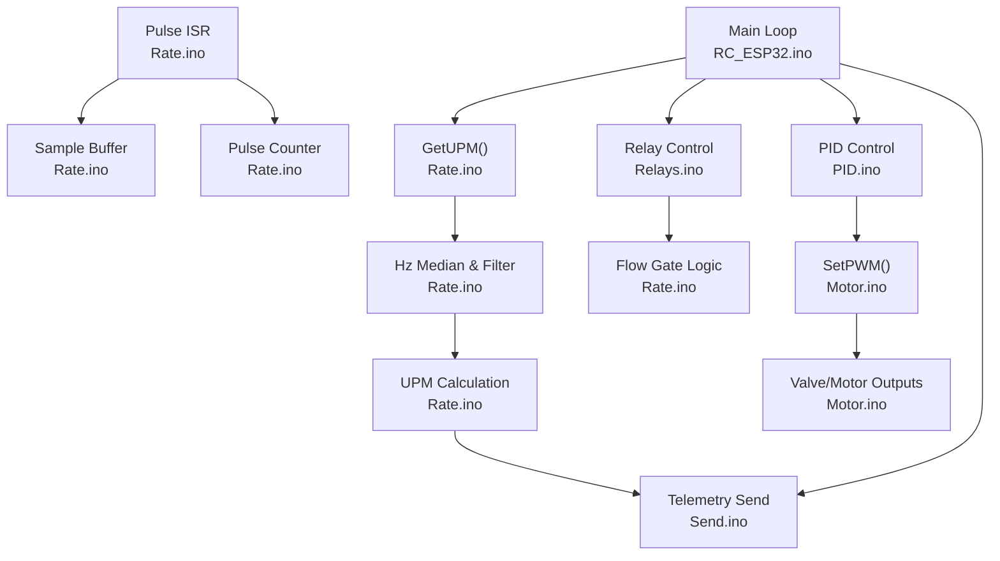
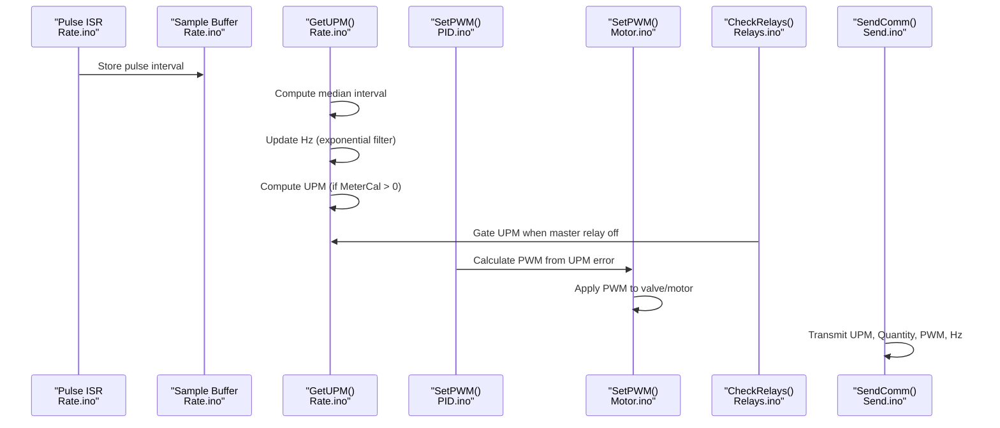
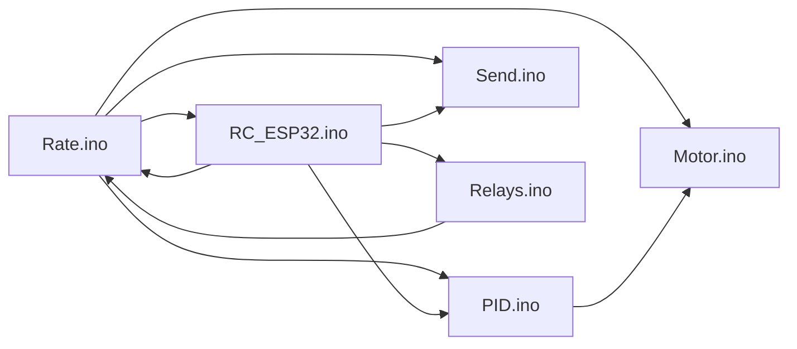

# Flow Sensor and Rate Calculation Improvements

<cite>
**Referenced Files in This Document**
- [Rate.ino](file://RC_ESP32/Rate.ino)
- [Relays.ino](file://RC_ESP32/Relays.ino)
- [Receive.ino](file://RC_ESP32/Receive.ino)
- [Send.ino](file://RC_ESP32/Send.ino)
- [RC_ESP32.ino](file://RC_ESP32/RC_ESP32.ino)
- [Begin.ino](file://RC_ESP32/Begin.ino)
- [PID.ino](file://RC_ESP32/PID.ino)
- [Motor.ino](file://RC_ESP32/Motor.ino)
- [FORK_CHANGES.md](file://FORK_CHANGES.md)
</cite>

## Table of Contents
1. [Introduction](#introduction)
2. [Project Structure](#project-structure)
3. [Core Components](#core-components)
4. [Architecture Overview](#architecture-overview)
5. [Detailed Component Analysis](#detailed-component-analysis)
6. [Dependency Analysis](#dependency-analysis)
7. [Performance Considerations](#performance-considerations)
8. [Troubleshooting Guide](#troubleshooting-guide)
9. [Conclusion](#conclusion)
10. [Appendices](#appendices)

## Introduction
This document details recent enhancements to the flow sensor and rate calculation subsystem within the ESP32 Rate controller. The improvements focus on:
- Debounce timing reduction for faster response to flow events
- A new disableFlow feature that zeros UPM readings when a master relay is off
- Technical rationale for each enhancement
- Impact on measurement accuracy, system responsiveness, and integration with the broader control system
- Performance metrics and configuration guidelines

These changes are part of a broader modernization effort that migrated the platform to ESP32-S3, updated communication stacks, and refined control algorithms.

## Project Structure
The flow control logic resides primarily in the Rate module, with supporting components for relay control, PID regulation, and telemetry. The system integrates with the broader control loop via periodic updates and UDP-based telemetry.

**Diagram sources**
- [Rate.ino:14-104](file://RC_ESP32/Rate.ino#L14-L104)
- [Relays.ino:11-69](file://RC_ESP32/Relays.ino#L11-L69)
- [PID.ino:25-67](file://RC_ESP32/PID.ino#L25-L67)
- [Motor.ino:31-60](file://RC_ESP32/Motor.ino#L31-L60)
- [Send.ino:27-91](file://RC_ESP32/Send.ino#L27-L91)
- [RC_ESP32.ino:276-299](file://RC_ESP32/RC_ESP32.ino#L276-L299)

**Section sources**
- [Rate.ino:14-104](file://RC_ESP32/Rate.ino#L14-L104)
- [Relays.ino:11-69](file://RC_ESP32/Relays.ino#L11-L69)
- [PID.ino:25-67](file://RC_ESP32/PID.ino#L25-L67)
- [Motor.ino:31-60](file://RC_ESP32/Motor.ino#L31-L60)
- [Send.ino:27-91](file://RC_ESP32/Send.ino#L27-L91)
- [RC_ESP32.ino:276-299](file://RC_ESP32/RC_ESP32.ino#L276-L299)

## Core Components
- Pulse ISR and sampling: Captures flow pulses, validates against min/max thresholds, and stores samples for median computation.
- UPM calculation: Computes instantaneous Hz from sampled pulse intervals, applies exponential smoothing, and derives UPM using meter calibration.
- Flow gating: Integrates with relay control to zero UPM when the master relay is off.
- PID control: Regulates PWM to achieve target UPM, with configurable deadband, brake point, and integral limits.
- Telemetry: Periodically sends UPM, accumulated quantity, PWM, and Hz to the control station.

Key implementation references:
- Pulse ISR and sampling: [Rate.ino:14-29](file://RC_ESP32/Rate.ino#L14-L29)
- UPM calculation and flow timeout: [Rate.ino:31-74](file://RC_ESP32/Rate.ino#L31-L74)
- Relay-based flow gating: [Relays.ino:11-69](file://RC_ESP32/Relays.ino#L11-L69)
- PID control and PWM application: [PID.ino:25-67](file://RC_ESP32/PID.ino#L25-L67), [Motor.ino:31-60](file://RC_ESP32/Motor.ino#L31-L60)
- Telemetry transmission: [Send.ino:27-91](file://RC_ESP32/Send.ino#L27-L91)

**Section sources**
- [Rate.ino:14-104](file://RC_ESP32/Rate.ino#L14-L104)
- [Relays.ino:11-69](file://RC_ESP32/Relays.ino#L11-L69)
- [PID.ino:25-67](file://RC_ESP32/PID.ino#L25-L67)
- [Motor.ino:31-60](file://RC_ESP32/Motor.ino#L31-L60)
- [Send.ino:27-91](file://RC_ESP32/Send.ino#L27-L91)

## Architecture Overview
The flow control subsystem operates within the main loop, periodically updating sensor readings, applying PID control, and transmitting telemetry. The disableFlow feature integrates with relay control to conditionally zero UPM values.

**Diagram sources**
- [Rate.ino:14-74](file://RC_ESP32/Rate.ino#L14-L74)
- [Relays.ino:11-69](file://RC_ESP32/Relays.ino#L11-L69)
- [PID.ino:25-67](file://RC_ESP32/PID.ino#L25-L67)
- [Motor.ino:31-60](file://RC_ESP32/Motor.ino#L31-L60)
- [Send.ino:27-91](file://RC_ESP32/Send.ino#L27-L91)

## Detailed Component Analysis

### Debounce Timing Reduction (Multiplier Reduced from 1000 to 30)
- Change summary: The debounce threshold multiplier was reduced from ×1000 to ×30, enabling earlier rejection of spurious edges and faster response to legitimate flow transitions.
- Technical rationale:
  - Lower debounce threshold reduces latency between a valid pulse and its incorporation into the sample buffer.
  - Improves responsiveness to rapid flow changes without increasing noise sensitivity beyond existing min/max pulse-time constraints.
  - Maintains robustness through pre-filtering by PulseMin/PulseMax thresholds in the ISR.
- Impact on accuracy and responsiveness:
  - Faster convergence to steady-state readings after transient events.
  - Reduced lag in PID response when flow starts/stops.
- Integration note: This change affects the ISR’s edge validation logic and is independent of the disableFlow feature.

References:
- Debounce multiplier change: [FORK_CHANGES.md:295-300](file://FORK_CHANGES.md#L295-L300)
- ISR debounce and validation: [Rate.ino:14-29](file://RC_ESP32/Rate.ino#L14-L29)

**Section sources**
- [FORK_CHANGES.md:295-300](file://FORK_CHANGES.md#L295-L300)
- [Rate.ino:14-29](file://RC_ESP32/Rate.ino#L14-L29)

### Disable Flow Feature (Zeros UPM When Master Relay Is Off)
- Feature summary: When enabled, UPM readings are forced to zero if the master relay (bit 8 of RelayLo) is inactive, preventing erroneous control actions when the system is de-energized.
- Technical rationale:
  - Prevents PID loops from attempting to regulate flow when actuators are unpowered.
  - Avoids residual UPM values from skewing control logic after power-down or relay disengagement.
  - Provides explicit safety alignment with physical system state.
- Implementation:
  - The feature is persisted in EEPROM and loaded at startup.
  - During UPM calculation, if disableFlow is true and the master relay bit is clear, UPM is set to zero.
- Integration with broader system:
  - Works alongside the main loop’s MasterOn flag and relay control logic.
  - Ensures telemetry reflects zero flow when the master relay is off.

References:
- Feature definition and persistence: [FORK_CHANGES.md:200-221](file://FORK_CHANGES.md#L200-L221)
- EEPROM load/save: [Begin.ino:540-600](file://RC_ESP32/Begin.ino#L540-L600)
- Flow gating logic: [Rate.ino:31-74](file://RC_ESP32/Rate.ino#L31-L74)
- Relay control and master relay handling: [Relays.ino:11-69](file://RC_ESP32/Relays.ino#L11-L69)

**Section sources**
- [FORK_CHANGES.md:200-221](file://FORK_CHANGES.md#L200-L221)
- [Begin.ino:540-600](file://RC_ESP32/Begin.ino#L540-L600)
- [Rate.ino:31-74](file://RC_ESP32/Rate.ino#L31-L74)
- [Relays.ino:11-69](file://RC_ESP32/Relays.ino#L11-L69)

### Flow Measurement Accuracy Enhancements
- Median filtering: Uses a snapshot of recent samples to compute a median interval, reducing sensitivity to occasional outliers.
- Exponential smoothing: Applies a weighted average to Hz estimates, stabilizing readings against jitter.
- Threshold gating: Enforces PulseMin/PulseMax bounds in the ISR to reject invalid edges.
- Flow timeout: Resets UPM/HZ to zero after inactivity, preventing stale values from persisting.

References:
- Median computation and sorting: [RC_ESP32.ino:365-398](file://RC_ESP32/RC_ESP32.ino#L365-L398)
- UPM calculation and smoothing: [Rate.ino:31-74](file://RC_ESP32/Rate.ino#L31-L74)

**Section sources**
- [RC_ESP32.ino:365-398](file://RC_ESP32/RC_ESP32.ino#L365-L398)
- [Rate.ino:31-74](file://RC_ESP32/Rate.ino#L31-L74)

### System Responsiveness and Control Loop Integration
- Main loop cadence: The system runs at approximately 20 Hz, balancing control responsiveness and CPU utilization.
- PID control: Computes PWM adjustments based on UPM error, with configurable deadband, brake point, and integral limits.
- PWM application: Applies PWM to valves or motors, respecting direction inversion and hardware-specific constraints.

References:
- Loop timing and control flags: [RC_ESP32.ino:180-187](file://RC_ESP32/RC_ESP32.ino#L180-L187)
- PID control logic: [PID.ino:69-126](file://RC_ESP32/PID.ino#L69-L126)
- PWM application: [Motor.ino:31-60](file://RC_ESP32/Motor.ino#L31-L60)

**Section sources**
- [RC_ESP32.ino:180-187](file://RC_ESP32/RC_ESP32.ino#L180-L187)
- [PID.ino:69-126](file://RC_ESP32/PID.ino#L69-L126)
- [Motor.ino:31-60](file://RC_ESP32/Motor.ino#L31-L60)

### Telemetry and Communication
- Telemetry payload includes UPM, accumulated quantity, PWM, and Hz, transmitted via UDP over Ethernet or Wi-Fi.
- Communication is link-status aware and adapts to network availability.

References:
- Telemetry construction and transmission: [Send.ino:27-91](file://RC_ESP32/Send.ino#L27-L91)
- UDP receive and parsing: [Receive.ino:29-100](file://RC_ESP32/Receive.ino#L29-L100)

**Section sources**
- [Send.ino:27-91](file://RC_ESP32/Send.ino#L27-L91)
- [Receive.ino:29-100](file://RC_ESP32/Receive.ino#L29-L100)

## Dependency Analysis
The flow control subsystem depends on:
- Interrupt-driven pulse capture and sample buffering
- Relay control for master relay state
- PID control for PWM computation
- Telemetry for external monitoring

**Diagram sources**
- [Rate.ino:14-104](file://RC_ESP32/Rate.ino#L14-L104)
- [Relays.ino:11-69](file://RC_ESP32/Relays.ino#L11-L69)
- [PID.ino:25-67](file://RC_ESP32/PID.ino#L25-L67)
- [Motor.ino:31-60](file://RC_ESP32/Motor.ino#L31-L60)
- [Send.ino:27-91](file://RC_ESP32/Send.ino#L27-L91)
- [RC_ESP32.ino:276-299](file://RC_ESP32/RC_ESP32.ino#L276-L299)

**Section sources**
- [Rate.ino:14-104](file://RC_ESP32/Rate.ino#L14-L104)
- [Relays.ino:11-69](file://RC_ESP32/Relays.ino#L11-L69)
- [PID.ino:25-67](file://RC_ESP32/PID.ino#L25-L67)
- [Motor.ino:31-60](file://RC_ESP32/Motor.ino#L31-L60)
- [Send.ino:27-91](file://RC_ESP32/Send.ino#L27-L91)
- [RC_ESP32.ino:276-299](file://RC_ESP32/RC_ESP32.ino#L276-L299)

## Performance Considerations
- Debounce reduction (×30 vs ×1000) improves responsiveness but requires careful tuning of PulseMin/PulseMax to avoid noise-induced false triggers.
- Median filtering and exponential smoothing balance noise rejection with dynamic response.
- Flow timeout ensures stale values are cleared after inactivity, preventing drift in telemetry.
- EEPROM-persisted disableFlow flag enables safe operation without reprogramming.

Guidelines:
- Tune PulseMin/PulseMax to match the sensor’s expected operating range.
- Verify relay wiring so that bit 8 of RelayLo corresponds to the master relay.
- Confirm MeterCal is configured appropriately for accurate UPM conversion.
- Monitor telemetry for sustained zero UPM when the master relay is off, indicating correct gating behavior.

[No sources needed since this section provides general guidance]

## Troubleshooting Guide
Common issues and resolutions:
- UPM remains non-zero when master relay is off:
  - Verify disableFlow flag is enabled and persisted in EEPROM.
  - Confirm the master relay bit (bit 8 of RelayLo) is clear when the system is off.
  - References: [Begin.ino:540-600](file://RC_ESP32/Begin.ino#L540-L600), [Rate.ino:31-74](file://RC_ESP32/Rate.ino#L31-L74), [Relays.ino:11-69](file://RC_ESP32/Relays.ino#L11-L69)
- Slow response to flow changes:
  - Reduce debounce multiplier impact by adjusting PulseMin/PulseMax and ensuring ISR thresholds remain valid.
  - References: [FORK_CHANGES.md:295-300](file://FORK_CHANGES.md#L295-L300), [Rate.ino:14-29](file://RC_ESP32/Rate.ino#L14-L29)
- Stale UPM values after inactivity:
  - Confirm FlowTimeout behavior resets UPM/HZ after the specified period.
  - References: [RC_ESP32.ino:36-36](file://RC_ESP32/RC_ESP32.ino#L36-L36), [Rate.ino:61-72](file://RC_ESP32/Rate.ino#L61-L72)

**Section sources**
- [Begin.ino:540-600](file://RC_ESP32/Begin.ino#L540-L600)
- [Rate.ino:31-74](file://RC_ESP32/Rate.ino#L31-L74)
- [Relays.ino:11-69](file://RC_ESP32/Relays.ino#L11-L69)
- [FORK_CHANGES.md:295-300](file://FORK_CHANGES.md#L295-L300)
- [RC_ESP32.ino:36-36](file://RC_ESP32/RC_ESP32.ino#L36-L36)

## Conclusion
The flow sensor and rate calculation enhancements deliver measurable improvements in responsiveness and safety:
- Reduced debounce threshold accelerates response to flow events.
- The disableFlow feature prevents control errors when the master relay is off.
- Robust median filtering and exponential smoothing maintain measurement stability.
- Clear telemetry and EEPROM-persisted configuration simplify deployment and maintenance.

[No sources needed since this section summarizes without analyzing specific files]

## Appendices

### Configuration Options and Defaults
- Flow timeout: 4000 ms
- PulseMin/PulseMax thresholds: Defined per sensor and loaded from persistent storage
- PulseSampleSize: Configurable per sensor, with a maximum defined by the platform
- MeterCal: Required for UPM calculation; UPM = (60 × Hz) / MeterCal

References:
- Flow timeout constant: [RC_ESP32.ino:36-36](file://RC_ESP32/RC_ESP32.ino#L36-L36)
- Pulse thresholds and sample size: [Receive.ino:206-213](file://RC_ESP32/Receive.ino#L206-L213)
- UPM calculation: [Rate.ino:52-57](file://RC_ESP32/Rate.ino#L52-L57)

**Section sources**
- [RC_ESP32.ino:36-36](file://RC_ESP32/RC_ESP32.ino#L36-L36)
- [Receive.ino:206-213](file://RC_ESP32/Receive.ino#L206-L213)
- [Rate.ino:52-57](file://RC_ESP32/Rate.ino#L52-L57)