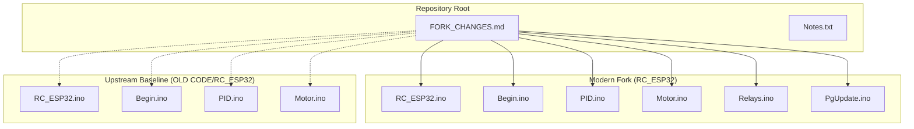
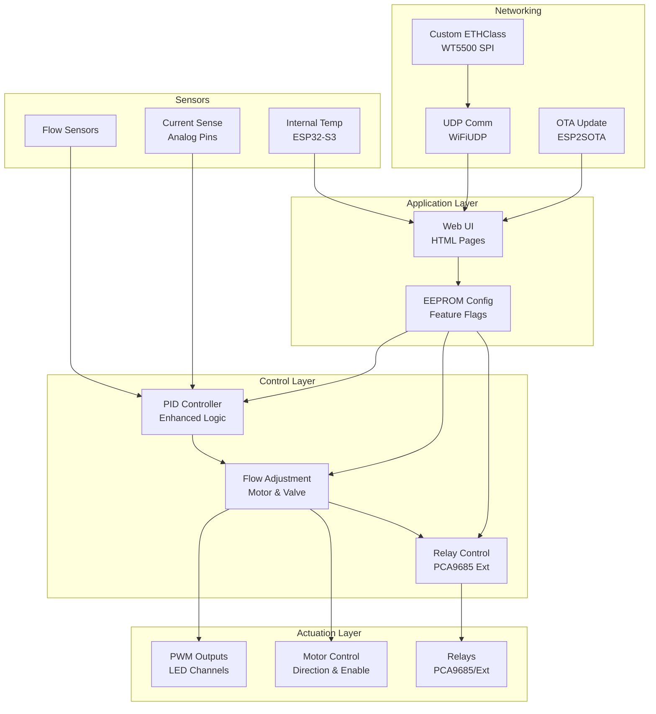
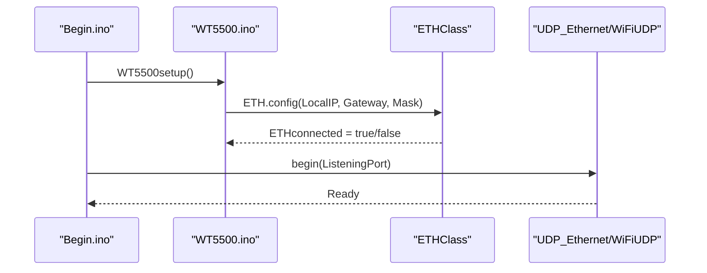
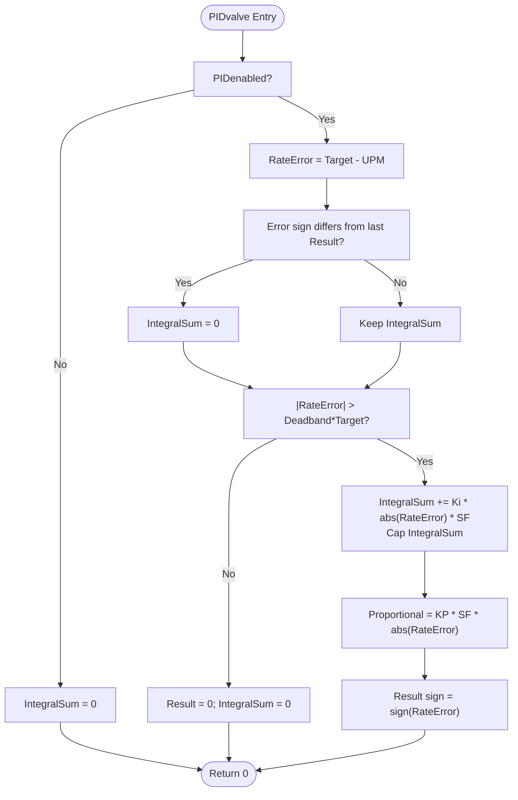
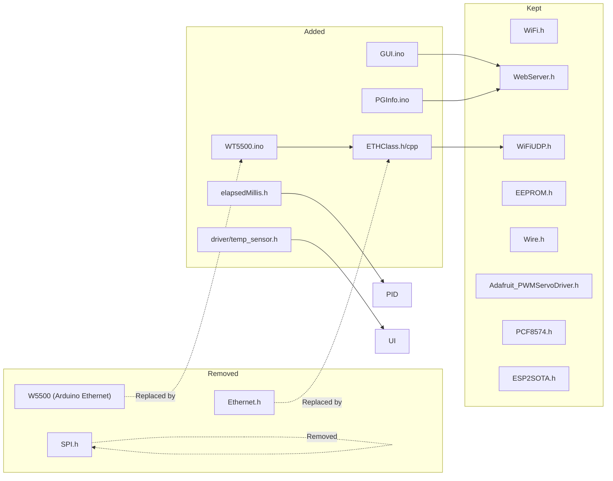

# Fork Changes Overview

<cite>
**Referenced Files in This Document**
- [FORK_CHANGES.md](file://FORK_CHANGES.md)
- [Notes.txt](file://Notes.txt)
- [RC_ESP32.ino](file://RC_ESP32/RC_ESP32.ino)
- [Begin.ino](file://RC_ESP32/Begin.ino)
- [PID.ino](file://RC_ESP32/PID.ino)
- [Motor.ino](file://RC_ESP32/Motor.ino)
- [Relays.ino](file://RC_ESP32/Relays.ino)
- [PgUpdate.ino](file://RC_ESP32/PgUpdate.ino)
- [OLD RC_ESP32.ino](file://OLD CODE/RC_ESP32/RC_ESP32.ino)
- [OLD Begin.ino](file://OLD CODE/RC_ESP32/Begin.ino)
- [OLD PID.ino](file://OLD CODE/RC_ESP32/PID.ino)
- [OLD Motor.ino](file://OLD CODE/RC_ESP32/Motor.ino)
</cite>

## Table of Contents
1. [Introduction](#introduction)
2. [Project Structure](#project-structure)
3. [Core Components](#core-components)
4. [Architecture Overview](#architecture-overview)
5. [Detailed Component Analysis](#detailed-component-analysis)
6. [Dependency Analysis](#dependency-analysis)
7. [Performance Considerations](#performance-considerations)
8. [Troubleshooting Guide](#troubleshooting-guide)
9. [Conclusion](#conclusion)
10. [Appendices](#appendices)

## Introduction
This document explains the changes made in this fork compared to the upstream ESP32 Rate Controller codebase. It identifies the base commit, summarizes major architectural shifts (hardware platform migration, library updates, feature additions), and provides a comprehensive comparison matrix across functional areas. It also includes a re-implementation checklist and guidance for applying these changes to a fresh fork, along with version compatibility and integration considerations.

Base commit reference and purpose:
- Base commit: 465c5cbbf251d56972e12e5c983ac3a86f9df81b
- Purpose: Document all changes so they can be re-implemented on a fresh fork of the upstream ESP32 Rate Controller.

## Project Structure
The repository contains:
- A modernized fork under RC_ESP32 with new features and refactoring
- An “OLD CODE” directory containing the upstream baseline for comparison
- A summary of changes in FORK_CHANGES.md
- Operational notes in Notes.txt

**Diagram sources**
- [FORK_CHANGES.md](file://FORK_CHANGES.md)
- [RC_ESP32.ino](file://RC_ESP32/RC_ESP32.ino)
- [Begin.ino](file://RC_ESP32/Begin.ino)
- [PID.ino](file://RC_ESP32/PID.ino)
- [Motor.ino](file://RC_ESP32/Motor.ino)
- [Relays.ino](file://RC_ESP32/Relays.ino)
- [PgUpdate.ino](file://RC_ESP32/PgUpdate.ino)
- [OLD RC_ESP32.ino](file://OLD CODE/RC_ESP32/RC_ESP32.ino)
- [OLD Begin.ino](file://OLD CODE/RC_ESP32/Begin.ino)
- [OLD PID.ino](file://OLD CODE/RC_ESP32/PID.ino)
- [OLD Motor.ino](file://OLD CODE/RC_ESP32/Motor.ino)

**Section sources**
- [FORK_CHANGES.md](file://FORK_CHANGES.md)
- [Notes.txt](file://Notes.txt)

## Core Components
Key categories of changes documented in this fork:
- Hardware platform migration from ESP32 DOIT DEVKIT V1 to ESP32-S3
- Ethernet stack migration from W5500 + Arduino Ethernet to WT5500 + custom ETHClass
- Library updates and removals (e.g., PCF8574 vs PCF8574, SPI/Ethernet removal)
- GUI and web interface refactoring with shared HTML head and new Info page
- New feature flags persisted in EEPROM (disableMotor, disableFlow, b9threlay)
- Enhanced PID logic with anti-windup, absolute error, and direction fixes
- Motor control improvements (PWM off-state, direction inversion)
- Relay control enhancements (PCA9685 PWM values, extended 16-section support)
- Flow sensor logic updates (debounce tuning, disableFlow override)
- UDP communication updates (event-driven ETHconnected, CRC behavior change)
- New utility functions (I2C scanner, temperature sensor init, current sensing)

**Section sources**
- [FORK_CHANGES.md](file://FORK_CHANGES.md)
- [Begin.ino](file://RC_ESP32/Begin.ino)
- [OLD Begin.ino](file://OLD CODE/RC_ESP32/Begin.ino)

## Architecture Overview
The fork maintains the same high-level architecture (sensor input, PID control, actuator output, web UI, networking) but introduces significant platform and stack changes:

**Diagram sources**
- [PID.ino](file://RC_ESP32/PID.ino)
- [Motor.ino](file://RC_ESP32/Motor.ino)
- [Relays.ino](file://RC_ESP32/Relays.ino)
- [Begin.ino](file://RC_ESP32/Begin.ino)
- [PgUpdate.ino](file://RC_ESP32/PgUpdate.ino)
- [FORK_CHANGES.md](file://FORK_CHANGES.md)

## Detailed Component Analysis

### Hardware Platform Migration: ESP32 → ESP32-S3
- Migration rationale: Modern ESP32-S3 boards offer improved peripherals and power characteristics suitable for this controller.
- Impact: Requires ESP32-S3 Arduino core, updated pin assignments, and board selection in Arduino IDE.
- Verification: Pin mapping changes are extensive and must be validated against the new board’s capabilities.

**Section sources**
- [FORK_CHANGES.md](file://FORK_CHANGES.md)

### Ethernet Stack Migration: W5500 → WT5500 with Custom ETHClass
- Original (W5500): Arduino Ethernet library with hardwareStatus() and linkStatus().
- New (WT5500): Custom ETHClass based on ESP-IDF esp_eth, with WT5500 SPI pins and event-driven ETHconnected flag.
- Benefits: Consistent UDP behavior across ESP32-S3, simplified SPI wiring, and reliable link status via WiFiEvent handler.
- Integration: Replace Ethernet.init() and Ethernet.begin() with WT5500setup() and ETH.config(), and replace linkStatus() checks with ETHconnected.

**Diagram sources**
- [Begin.ino](file://RC_ESP32/Begin.ino)
- [FORK_CHANGES.md](file://FORK_CHANGES.md)

**Section sources**
- [FORK_CHANGES.md](file://FORK_CHANGES.md)
- [Begin.ino](file://RC_ESP32/Begin.ino)
- [OLD Begin.ino](file://OLD CODE/RC_ESP32/Begin.ino)

### Library Updates and Removals
- Updated includes: PCF8574.h (case-sensitive), elapsedMillis.h, driver/temp_sensor.h
- Removed includes: SPI.h, Ethernet.h (replaced by ETHClass)
- UDP class: WiFiUDP used for both UDP instances
- Rationale: Align with ESP32-S3 core and custom Ethernet stack; reduce legacy dependencies.

**Section sources**
- [FORK_CHANGES.md](file://FORK_CHANGES.md)

### GUI and Web Interface Refactoring
- Shared HTML head: HtmlGetHead() centralizes CSS and layout.
- New Info page: Diagnostics, temperature, current readings, feature toggles.
- Web routes: /info and /Cytron endpoints for diagnostics and feature flag updates.
- Impact: Reduced duplication, improved maintainability, and richer diagnostics.

**Section sources**
- [FORK_CHANGES.md](file://FORK_CHANGES.md)
- [PgUpdate.ino](file://RC_ESP32/PgUpdate.ino)

### Feature Flags (EEPROM-persisted)
- disableMotor: Disables Cytron motor drive based on 8th relay.
- disableFlow: Forces Sensor UPM to 0 when 8th relay is off.
- b9threlay: Uses 9th relay to control Sensor[1] PWM for front motor.
- Storage: EEPROM addresses 10, 11, 12; loaded/saved during startup.

**Section sources**
- [FORK_CHANGES.md](file://FORK_CHANGES.md)
- [Begin.ino](file://RC_ESP32/Begin.ino)
- [OLD Begin.ino](file://OLD CODE/RC_ESP32/Begin.ino)

### Enhanced PID Logic
Key improvements:
- Anti-windup with direction detection: Reset integral when error direction and output direction disagree.
- Integral sum uses absolute error and is capped.
- Deadband resets integral.
- PWM direction based on RateError, not Result.
- Proportional term uses absolute error.
- New getDebugPID() returns HTML string for Info page.

**Diagram sources**
- [PID.ino](file://RC_ESP32/PID.ino)
- [OLD PID.ino](file://OLD CODE/RC_ESP32/PID.ino)

**Section sources**
- [FORK_CHANGES.md](file://FORK_CHANGES.md)
- [PID.ino](file://RC_ESP32/PID.ino)
- [OLD PID.ino](file://OLD CODE/RC_ESP32/PID.ino)

### Motor Control Enhancements
- b9threlay guard: When active and processing Sensor[1], AdjustFlow() returns early.
- PWM off-state fix: Explicitly set PWM to 0 when FlowEnabled is false.
- Direction logic inversion: PWM < 0 sets IN1 active; PWM > 0 sets IN2 active.
- Cytron enable/disable via GPIO 13 controlled by disableMotor and 8th relay.

**Section sources**
- [FORK_CHANGES.md](file://FORK_CHANGES.md)
- [Motor.ino](file://RC_ESP32/Motor.ino)
- [OLD Motor.ino](file://OLD CODE/RC_ESP32/Motor.ino)

### Relay Control Improvements
- PCA9685 PWM values corrected: Fully on/off using (0, 4095)/(0,0) instead of legacy (4096,0)/(0,4096).
- Extended support: PCA9685Ext at 0x41 enables 16-section control (relays 8–15).
- Cytron motor disable via relay logic when disableMotor is active.
- b9threlay: 9th relay bit controls Sensor[1] PWM via SetPWM(1, ...).

**Section sources**
- [FORK_CHANGES.md](file://FORK_CHANGES.md)
- [Relays.ino](file://RC_ESP32/Relays.ino)
- [OLD Begin.ino](file://OLD CODE/RC_ESP32/Begin.ino)

### Flow Sensor and Rate Logic Updates
- Debounce timing: Shortened multiplier from ×1000 to ×30 for responsiveness.
- disableFlow feature: When true and 8th relay is on, forces Sensor UPM to 0.

**Section sources**
- [FORK_CHANGES.md](file://FORK_CHANGES.md)
- [OLD Begin.ino](file://OLD CODE/RC_ESP32/Begin.ino)

### UDP Communication Updates
- Replaced Ethernet.linkStatus() checks with event-driven ETHconnected.
- PGN CRC check: Disabled (false) for incoming PGN 239 packets (note: review for production).

**Section sources**
- [FORK_CHANGES.md](file://FORK_CHANGES.md)
- [Begin.ino](file://RC_ESP32/Begin.ino)
- [OLD Begin.ino](file://OLD CODE/RC_ESP32/Begin.ino)

### New Utility Functions
- scanI2CDevices(): Scans 1–127, prints found devices, returns formatted string.
- initTempSensor(): Initializes ESP32-S3 internal temperature sensor with TSENS_DAC_L2 range.
- getCurrentInAmps(int pin): Reads analog voltage and maps to 0–3.0A.

**Section sources**
- [FORK_CHANGES.md](file://FORK_CHANGES.md)
- [OLD Begin.ino](file://OLD CODE/RC_ESP32/Begin.ino)

## Dependency Analysis
The fork introduces new dependencies and removes legacy ones:

**Diagram sources**
- [FORK_CHANGES.md](file://FORK_CHANGES.md)
- [Begin.ino](file://RC_ESP32/Begin.ino)
- [OLD Begin.ino](file://OLD CODE/RC_ESP32/Begin.ino)

**Section sources**
- [FORK_CHANGES.md](file://FORK_CHANGES.md)

## Performance Considerations
- Event-driven Ethernet link status reduces polling overhead and improves responsiveness.
- Shorter debounce multiplier improves flow sensor responsiveness.
- Anti-windup and capped integral improve stability and reduce overshoot.
- Internal temperature and current monitoring enable proactive thermal and power management.

[No sources needed since this section provides general guidance]

## Troubleshooting Guide
Common issues and remedies:
- Boot loops after pin overrides: Disable custom pin overrides to avoid conflicts.
- No Ethernet connectivity: Verify WT5500 SPI wiring and ETH.config() success; confirm ETHconnected becomes true.
- Incorrect relay behavior: Check PCA9685 address (0x40), OutputEnablePin usage removed, and PCA9685Ext support for 16 relays.
- Feature flags not persisting: Confirm EEPROM addresses 10–12 are accessible and written during SaveData().
- Temperature sensor errors: Ensure initTempSensor() is called and TSENS_DAC_L2 range is configured.
- CRC validation concerns: Review PGN CRC behavior change in UDPComm.

**Section sources**
- [FORK_CHANGES.md](file://FORK_CHANGES.md)
- [Begin.ino](file://RC_ESP32/Begin.ino)
- [OLD Begin.ino](file://OLD CODE/RC_ESP32/Begin.ino)

## Conclusion
This fork modernizes the ESP32 Rate Controller for ESP32-S3, replacing the legacy W5500+Arduino Ethernet stack with a custom ETHClass-based solution. It enhances control logic, adds robust diagnostics and feature flags, and improves reliability and maintainability. The re-implementation checklist below will help apply these changes to a fresh fork.

[No sources needed since this section summarizes without analyzing specific files]

## Appendices

### Comprehensive Comparison Matrix
Original vs. New implementations across functional areas:

- Hardware Platform
  - Original: ESP32 DOIT DEVKIT V1
  - New: ESP32-S3 with updated Arduino core and board selection

- Ethernet
  - Original: W5500 + Arduino Ethernet (Ethernet.init, Ethernet.begin, linkStatus())
  - New: WT5500 + Custom ETHClass (WT5500setup, ETH.config, ETHconnected)

- Libraries
  - Original: PCF8574.h, SPI.h, Ethernet.h, EthernetUDP
  - New: PCF8574.h (case-sensitive), elapsedMillis.h, driver/temp_sensor.h, WiFiUDP

- GUI/Web
  - Original: Inline HTML headers per page
  - New: HtmlGetHead() shared header, Info page (/info), /Cytron endpoint

- Feature Flags
  - Original: None persisted in EEPROM
  - New: disableMotor (10), disableFlow (11), b9threlay (12)

- PID Logic
  - Original: Deadband-based integral, direction based on Result
  - New: Anti-windup with direction detection, absolute error, capped integral, direction based on RateError

- Motor Control
  - Original: Positive PWM to IN1, negative to IN2
  - New: PWM < 0 → IN1 active; PWM > 0 → IN2 active; explicit PWM=0 when FlowEnabled=false

- Relays
  - Original: Legacy PCA9685 PWM values (4096,0)/(0,4096)
  - New: Fully on/off (0,4095)/(0,0); PCA9685Ext support; Cytron disable via relay

- Flow Sensor
  - Original: microseconds debounce multiplier
  - New: ×30 multiplier; disableFlow override

- UDP
  - Original: Ethernet.linkStatus() checks
  - New: ETHconnected; PGN CRC check disabled

- Utilities
  - Original: None
  - New: scanI2CDevices(), initTempSensor(), getCurrentInAmps()

**Section sources**
- [FORK_CHANGES.md](file://FORK_CHANGES.md)
- [Begin.ino](file://RC_ESP32/Begin.ino)
- [PID.ino](file://RC_ESP32/PID.ino)
- [Motor.ino](file://RC_ESP32/Motor.ino)
- [Relays.ino](file://RC_ESP32/Relays.ino)
- [OLD RC_ESP32.ino](file://OLD CODE/RC_ESP32/RC_ESP32.ino)
- [OLD Begin.ino](file://OLD CODE/RC_ESP32/Begin.ino)
- [OLD PID.ino](file://OLD CODE/RC_ESP32/PID.ino)
- [OLD Motor.ino](file://OLD CODE/RC_ESP32/Motor.ino)

### Re-Implementation Checklist
- [ ] Switch board to ESP32-S3 and install appropriate Arduino core
- [ ] Replace #include <pcf8574.h> with #include <PCF8574.h>
- [ ] Add #include <elapsedMillis.h> and #include "driver/temp_sensor.h"
- [ ] Replace EthernetUDP with WiFiUDP for both UDP instances
- [ ] Comment out #include <SPI.h> and #include <Ethernet.h>
- [ ] Add ETHClass.h, ETHClass.cpp, WT5500.ino files
- [ ] Update I2C pins: Wire.begin(8, 18, 400000)
- [ ] Update PCA9685 address from 0x55 to 0x40, remove OutputEnablePin usage
- [ ] Add PCAExtaddress (0x41) and PWMServoDriverExt
- [ ] Update flow sensor default pins in LoadDefaults()
- [ ] Add Current1Pin (6) and Current2Pin (14)
- [ ] Replace W5500 init with WT5500setup() + ETH.config() in Begin.ino
- [ ] Add ETHconnected boolean and event handler in WT5500.ino
- [ ] Replace all Ethernet.linkStatus() checks with ETHconnected
- [ ] Extract HTML header into HtmlGetHead() in GUI.ino
- [ ] Create PGInfo.ino with diagnostics page
- [ ] Add /info and /Cytron web routes
- [ ] Add disableMotor, disableFlow, b9threlay flags with EEPROM load/save
- [ ] Apply PID logic changes (anti-windup, abs error, direction fix)
- [ ] Fix PCA9685 PWM values (0,4095 / 0,0 instead of 4096,0 / 0,4096)
- [ ] Add PCA9685Ext relay support in Relays.ino case 6
- [ ] Add Cytron enable/disable via GPIO 13
- [ ] Invert SetPWM direction logic in Motor.ino
- [ ] Add PWM=0 when FlowEnabled is false
- [ ] Change debounce multiplier from 1000 to 30 in Rate.ino
- [ ] Add disableFlow UPM override in Rate.ino
- [ ] Add b9threlay guard in AdjustFlow()
- [ ] Add utility functions: scanI2CDevices(), initTempSensor(), getCurrentInAmps()
- [ ] Change default SensorCount to 2, WifiMode to 0

**Section sources**
- [FORK_CHANGES.md](file://FORK_CHANGES.md)

### Version Compatibility and Integration Notes
- ESP32-S3 Arduino Core: Required for board-specific peripherals and WiFiUDP behavior.
- ETHClass and WT5500: Provide SPI Ethernet abstraction; ensure proper wiring and interrupt handling.
- Library Manager: Prefer Arduino Library Manager versions for PCF8574 and other libraries.
- EEPROM Layout: Addresses 10–12 reserved for feature flags; ensure backward compatibility.
- Access Point Subnet: Notes specify AP subnet pattern; verify Windows auto-reconnect settings if needed.

**Section sources**
- [FORK_CHANGES.md](file://FORK_CHANGES.md)
- [Notes.txt](file://Notes.txt)