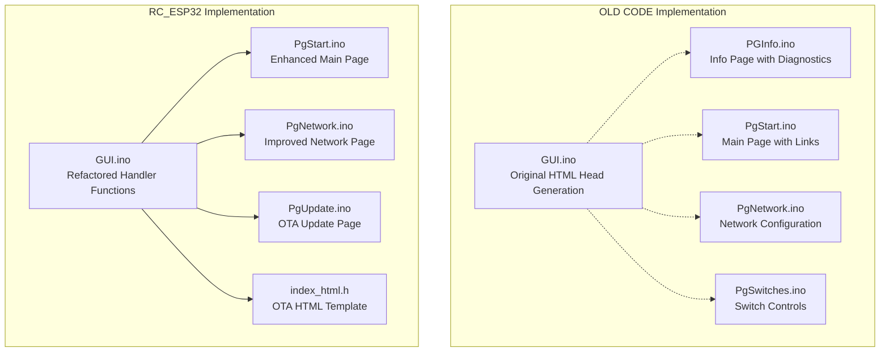
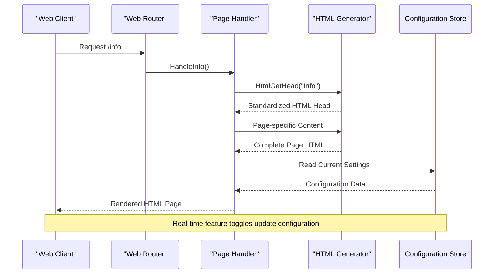
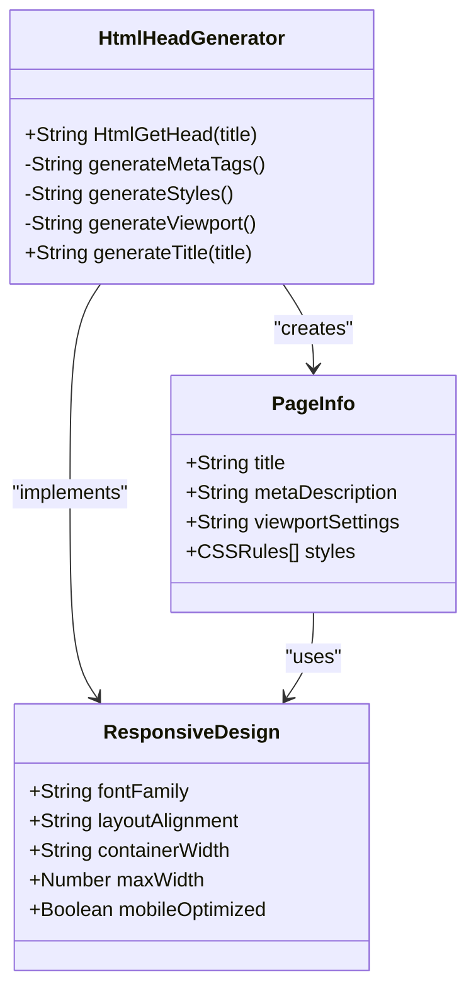
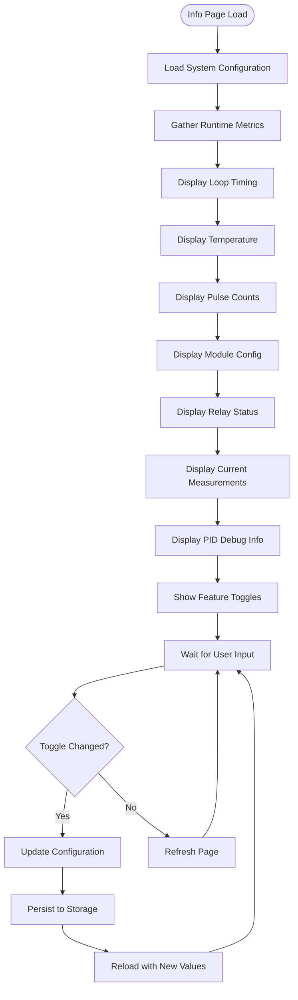
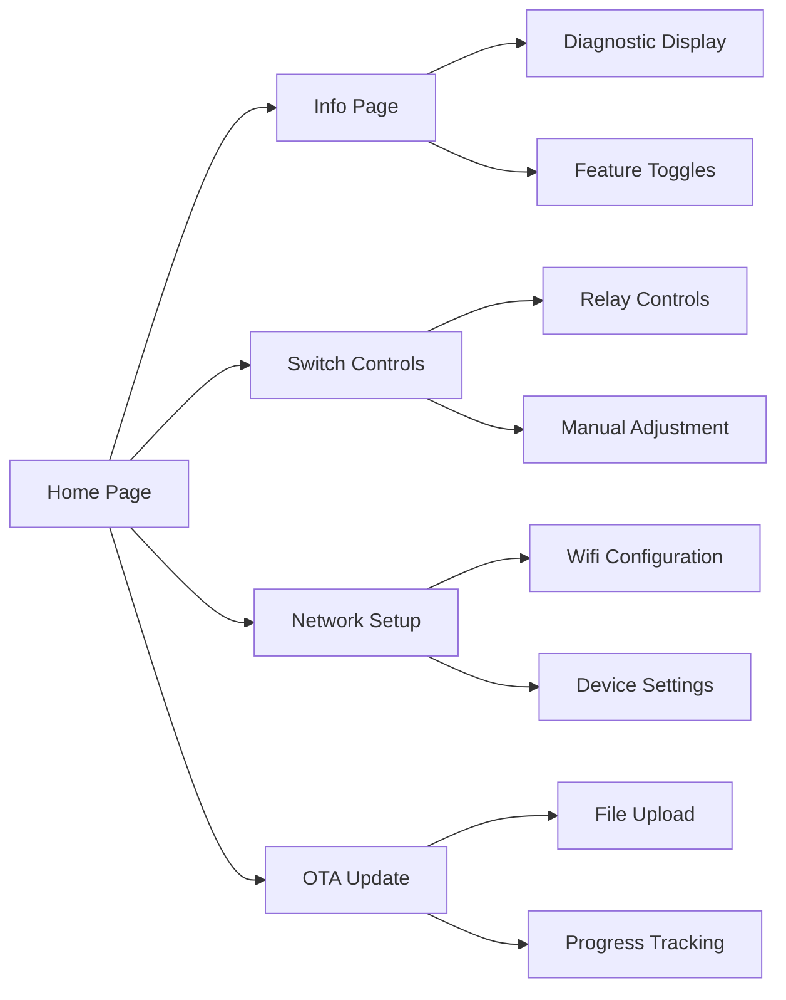
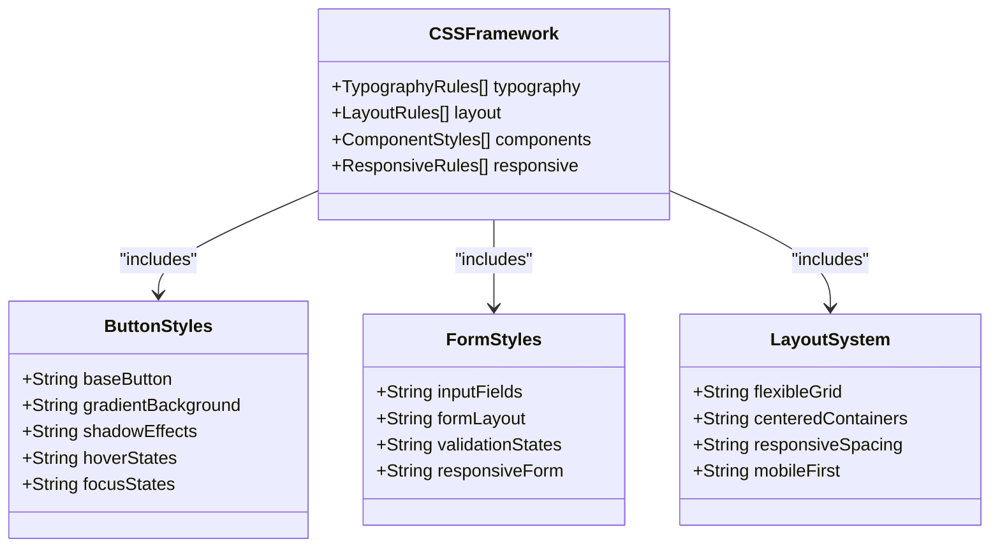
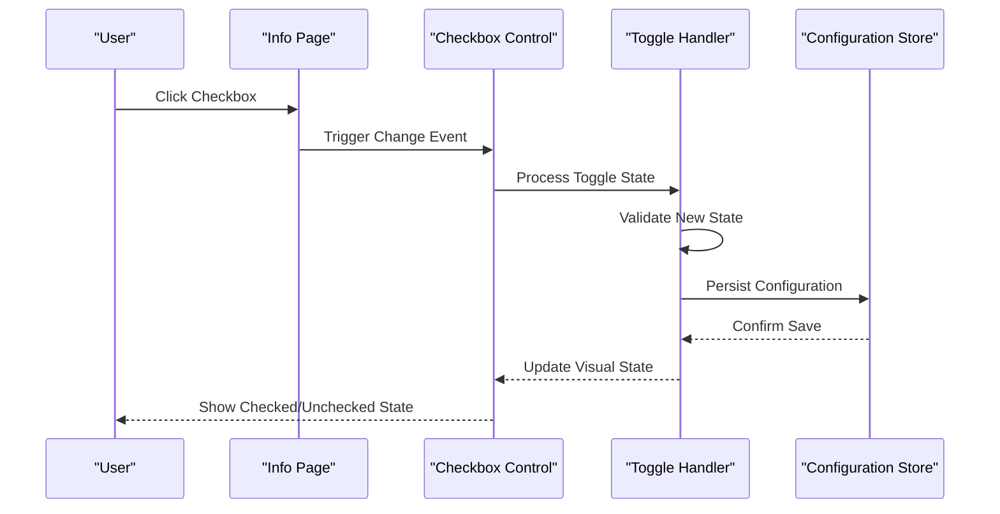
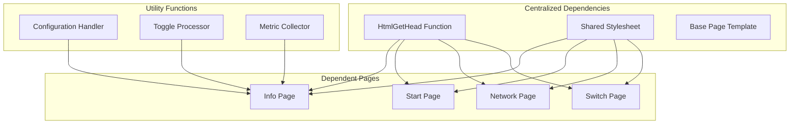

# HTML and GUI Refactoring

<cite>
**Referenced Files in This Document**
- [GUI.ino](file://OLD CODE/RC_ESP32/GUI.ino)
- [PGInfo.ino](file://OLD CODE/RC_ESP32/PGInfo.ino)
- [PgStart.ino](file://OLD CODE/RC_ESP32/PgStart.ino)
- [PgNetwork.ino](file://OLD CODE/RC_ESP32/PgNetwork.ino)
- [PgSwitches.ino](file://OLD CODE/RC_ESP32/PgSwitches.ino)
- [Begin.ino](file://OLD CODE/RC_ESP32/Begin.ino)
- [GUI.ino](file://RC_ESP32/GUI.ino)
- [PgStart.ino](file://RC_ESP32/PgStart.ino)
- [PgNetwork.ino](file://RC_ESP32/PgNetwork.ino)
- [PgUpdate.ino](file://RC_ESP32/PgUpdate.ino)
- [index_html.h](file://RC_ESP32/ESP2SOTA_RC/index_html.h)
</cite>

## Table of Contents
1. [Introduction](#introduction)
2. [Project Structure](#project-structure)
3. [Core Components](#core-components)
4. [Architecture Overview](#architecture-overview)
5. [Detailed Component Analysis](#detailed-component-analysis)
6. [Dependency Analysis](#dependency-analysis)
7. [Performance Considerations](#performance-considerations)
8. [Troubleshooting Guide](#troubleshooting-guide)
9. [Conclusion](#conclusion)

## Introduction
This document details the HTML and GUI refactoring efforts implemented in the ESP32 Rate Control project. The primary goal was to eliminate code duplication by extracting the common HTML head section into a reusable function and to enhance the user interface with improved styling, new web routes, and runtime feature toggles. The refactoring reduced approximately 90 lines of duplicated HTML head code across three pages while introducing a dedicated Info page with comprehensive diagnostic displays and a streamlined web interface.

## Project Structure
The refactoring spans two major directories: the legacy implementation under OLD CODE/RC_ESP32 and the refactored implementation under RC_ESP32. The OLD CODE directory contains the original HTML generation approach with repeated head sections, while the RC_ESP32 directory showcases the refactored structure with centralized HTML head generation and enhanced styling.

**Diagram sources**
- [GUI.ino:1-232](file://OLD CODE/RC_ESP32/GUI.ino#L1-L232)
- [PGInfo.ino:1-187](file://OLD CODE/RC_ESP32/PGInfo.ino#L1-L187)
- [PgStart.ino:1-147](file://OLD CODE/RC_ESP32/PgStart.ino#L1-L147)
- [PgNetwork.ino:1-60](file://OLD CODE/RC_ESP32/PgNetwork.ino#L1-L60)

**Section sources**
- [GUI.ino:1-232](file://OLD CODE/RC_ESP32/GUI.ino#L1-L232)
- [PGInfo.ino:1-187](file://OLD CODE/RC_ESP32/PGInfo.ino#L1-L187)
- [PgStart.ino:1-147](file://OLD CODE/RC_ESP32/PgStart.ino#L1-L147)
- [PgNetwork.ino:1-60](file://OLD CODE/RC_ESP32/PgNetwork.ino#L1-L60)

## Core Components
The refactoring centers around three key components: the centralized HTML head generator, the enhanced Info page with diagnostic capabilities, and the improved web routing system.

### HTML Head Extraction
The original implementation duplicated HTML head sections across multiple pages, resulting in maintenance overhead and inconsistent styling. The refactored approach consolidates this functionality into a single HtmlGetHead() function that generates standardized HTML head content with responsive design and consistent styling.

### Info Page Implementation
The new Info page provides comprehensive diagnostic displays including loop timing metrics, temperature readings, pulse count monitoring, module configuration details, relay status, current measurements, and PID debug information. It serves as a central diagnostic hub for system monitoring and troubleshooting.

### Feature Toggle System
Runtime configuration is now supported through styled checkbox controls that allow real-time modification of system behavior without requiring firmware reprogramming. These toggles provide immediate feedback and persistent storage of user preferences.

**Section sources**
- [GUI.ino:89-229](file://OLD CODE/RC_ESP32/GUI.ino#L89-L229)
- [PGInfo.ino:1-187](file://OLD CODE/RC_ESP32/PGInfo.ino#L1-L187)
- [GUI.ino:1-104](file://RC_ESP32/GUI.ino#L1-L104)

## Architecture Overview
The refactored architecture implements a clean separation of concerns with centralized HTML generation, modular page handlers, and enhanced styling systems.

**Diagram sources**
- [GUI.ino:24-67](file://OLD CODE/RC_ESP32/GUI.ino#L24-L67)
- [PGInfo.ino:1-187](file://OLD CODE/RC_ESP32/PGInfo.ino#L1-L187)
- [GUI.ino:25-79](file://RC_ESP32/GUI.ino#L25-L79)

## Detailed Component Analysis

### HTML Head Generator Enhancement
The HtmlGetHead() function centralizes HTML head generation with responsive design and consistent styling across all pages.

**Diagram sources**
- [GUI.ino:89-229](file://OLD CODE/RC_ESP32/GUI.ino#L89-L229)

The generator produces standardized HTML head content including:
- Meta tags for character encoding and viewport configuration
- Responsive design CSS with flexible layouts
- Consistent typography and spacing
- Cross-browser compatibility settings

**Section sources**
- [GUI.ino:89-229](file://OLD CODE/RC_ESP32/GUI.ino#L89-L229)

### Info Page Diagnostic System
The Info page implements a comprehensive diagnostic interface with real-time system monitoring and configuration display.

**Diagram sources**
- [PGInfo.ino:1-187](file://OLD CODE/RC_ESP32/PGInfo.ino#L1-L187)

Key diagnostic displays include:
- **Loop Times**: Maximum loop execution time monitoring
- **Temperature**: ESP32 internal sensor readings
- **Pulse Counts**: Sensor pulse accumulation tracking
- **Module Configuration**: Hardware and firmware settings
- **Relay Values**: Current relay states and configurations
- **Current Measurements**: Amperage readings from current sensors
- **PID Debug Information**: Control system performance metrics

**Section sources**
- [PGInfo.ino:1-187](file://OLD CODE/RC_ESP32/PGInfo.ino#L1-L187)

### Web Route Management
The refactored routing system provides clean, organized access to different functional areas of the web interface.

**Diagram sources**
- [Begin.ino:387-388](file://OLD CODE/RC_ESP32/Begin.ino#L387-L388)
- [PgStart.ino:26-27](file://OLD CODE/RC_ESP32/PgStart.ino#L26-L27)

**Section sources**
- [Begin.ino:387-388](file://OLD CODE/RC_ESP32/Begin.ino#L387-L388)
- [PgStart.ino:26-27](file://OLD CODE/RC_ESP32/PgStart.ino#L26-L27)

### Enhanced Styling System
The refactored styling system introduces a comprehensive CSS framework with responsive design and consistent visual elements.

**Diagram sources**
- [GUI.ino:99-226](file://OLD CODE/RC_ESP32/GUI.ino#L99-L226)
- [PgStart.ino:7-115](file://OLD CODE/RC_ESP32/PgStart.ino#L7-L115)

The styling enhancements include:
- **Consistent Button Design**: Gradient backgrounds with shadow effects
- **Responsive Layout**: Flexible grid system for different screen sizes
- **Visual Feedback**: Hover and focus states for interactive elements
- **Mobile Optimization**: Touch-friendly controls and scalable layouts

**Section sources**
- [GUI.ino:99-226](file://OLD CODE/RC_ESP32/GUI.ino#L99-L226)
- [PgStart.ino:7-115](file://OLD CODE/RC_ESP32/PgStart.ino#L7-L115)

### Feature Toggle Implementation
Runtime configuration is managed through styled checkbox controls that provide immediate feedback and persistent storage.

**Diagram sources**
- [PGInfo.ino:144-173](file://OLD CODE/RC_ESP32/PGInfo.ino#L144-L173)
- [GUI.ino:47-67](file://OLD CODE/RC_ESP32/GUI.ino#L47-L67)

Feature toggles include:
- **Disable Motor Drive**: Control based on 8th relay state
- **Disable Flow Value**: Flow control based on 8th relay
- **9th Relay Controls**: Special function assignment

**Section sources**
- [PGInfo.ino:144-173](file://OLD CODE/RC_ESP32/PGInfo.ino#L144-L173)
- [GUI.ino:47-67](file://OLD CODE/RC_ESP32/GUI.ino#L47-L67)

## Dependency Analysis
The refactoring maintains clean dependencies while eliminating duplication through centralized HTML generation.

**Diagram sources**
- [GUI.ino:89-229](file://OLD CODE/RC_ESP32/GUI.ino#L89-L229)
- [PGInfo.ino:1-187](file://OLD CODE/RC_ESP32/PGInfo.ino#L1-L187)

**Section sources**
- [GUI.ino:89-229](file://OLD CODE/RC_ESP32/GUI.ino#L89-L229)
- [PGInfo.ino:1-187](file://OLD CODE/RC_ESP32/PGInfo.ino#L1-L187)

## Performance Considerations
The refactoring improves performance through several optimizations:

- **Reduced Code Duplication**: Elimination of ~90 lines of duplicated HTML head code across pages
- **Centralized Processing**: Single HTML head generation reduces memory footprint
- **Efficient Data Collection**: Optimized diagnostic data gathering for real-time display
- **Responsive Design**: Mobile-first approach ensures optimal performance across devices

## Troubleshooting Guide
Common issues and solutions for the refactored HTML and GUI system:

### HTML Generation Issues
- **Symptom**: Pages missing styling or layout problems
- **Solution**: Verify HtmlGetHead() function is properly included in page generation
- **Prevention**: Use centralized HTML head generation for all pages

### Feature Toggle Problems
- **Symptom**: Toggles not responding or losing state
- **Solution**: Check configuration persistence and storage mechanisms
- **Debugging**: Monitor toggle change events and configuration updates

### Performance Monitoring
- **Loop Time Issues**: Excessive loop times indicate processing bottlenecks
- **Memory Usage**: Monitor heap allocation during page rendering
- **Network Connectivity**: Verify web server responsiveness under load

**Section sources**
- [PGInfo.ino:1-187](file://OLD CODE/RC_ESP32/PGInfo.ino#L1-L187)
- [GUI.ino:25-67](file://OLD CODE/RC_ESP32/GUI.ino#L25-L67)

## Conclusion
The HTML and GUI refactoring effort successfully modernized the ESP32 Rate Control web interface through strategic code consolidation, enhanced diagnostics, and improved user experience. The extraction of the HTML head into a centralized function eliminated significant code duplication while the new Info page provides comprehensive system monitoring capabilities. The implementation of feature toggles enables runtime configuration without firmware modifications, and the enhanced styling system ensures consistent, responsive design across all devices. These improvements establish a solid foundation for future enhancements while maintaining code maintainability and system reliability.