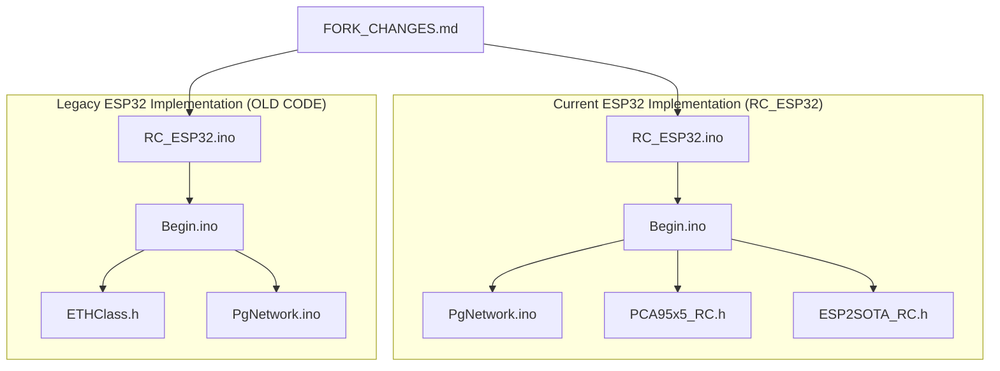
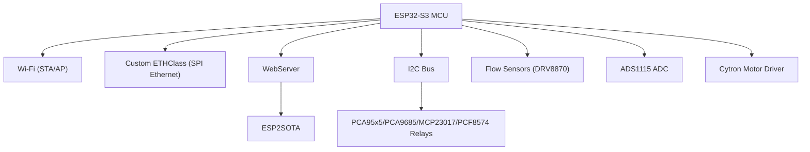
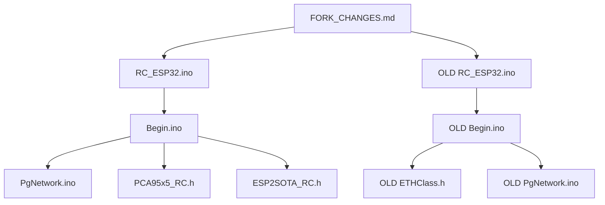

# Hardware Platform Migration

<cite>
**Referenced Files in This Document**
- [RC_ESP32.ino](file://RC_ESP32/RC_ESP32.ino)
- [Begin.ino](file://RC_ESP32/Begin.ino)
- [PgNetwork.ino](file://RC_ESP32/PgNetwork.ino)
- [PCA95x5_RC.h](file://RC_ESP32/PCA95x5_RC.h)
- [ESP2SOTA_RC.h](file://RC_ESP32/ESP2SOTA_RC/ESP2SOTA_RC.h)
- [FORK_CHANGES.md](file://FORK_CHANGES.md)
- [Notes.txt](file://Notes.txt)
- [OLD RC_ESP32.ino](file://OLD CODE/RC_ESP32/RC_ESP32.ino)
- [OLD Begin.ino](file://OLD CODE/RC_ESP32/Begin.ino)
- [OLD ETHClass.h](file://OLD CODE/RC_ESP32/ETHClass.h)
- [OLD PgNetwork.ino](file://OLD CODE/RC_ESP32/PgNetwork.ino)
</cite>

## Table of Contents
1. [Introduction](#introduction)
2. [Project Structure](#project-structure)
3. [Core Components](#core-components)
4. [Architecture Overview](#architecture-overview)
5. [Detailed Component Analysis](#detailed-component-analysis)
6. [Dependency Analysis](#dependency-analysis)
7. [Performance Considerations](#performance-considerations)
8. [Troubleshooting Guide](#troubleshooting-guide)
9. [Conclusion](#conclusion)
10. [Appendices](#appendices)

## Introduction
This document provides a comprehensive guide for migrating the ESP32-based Rate Controller firmware to the ESP32-S3 platform. It covers the rationale for upgrading, technical requirements for the ESP32-S3 Arduino Core, hardware differences, migration steps, compatibility considerations, and performance improvements. The migration involves updating libraries, changing Ethernet/Wi-Fi stacks, adjusting pin mappings, and adapting configuration defaults.

## Project Structure
The repository contains two primary branches of the firmware:
- Current ESP32 implementation under RC_ESP32/
- Legacy ESP32 implementation under OLD CODE/RC_ESP32/

Key files involved in the migration include the main firmware entry points, setup routines, network configuration pages, I2C expanders, and OTA update support. The migration guide consolidates changes documented in FORK_CHANGES.md and compares the current and legacy implementations.

**Diagram sources**
- [RC_ESP32.ino:1-418](file://RC_ESP32/RC_ESP32.ino#L1-L418)
- [Begin.ino:1-769](file://RC_ESP32/Begin.ino#L1-L769)
- [PgNetwork.ino:1-155](file://RC_ESP32/PgNetwork.ino#L1-L155)
- [PCA95x5_RC.h:1-178](file://RC_ESP32/PCA95x5_RC.h#L1-L178)
- [ESP2SOTA_RC.h:1-34](file://RC_ESP32/ESP2SOTA_RC/ESP2SOTA_RC.h#L1-L34)
- [OLD RC_ESP32.ino:1-334](file://OLD CODE/RC_ESP32/RC_ESP32.ino#L1-L334)
- [OLD Begin.ino:1-632](file://OLD CODE/RC_ESP32/Begin.ino#L1-L632)
- [OLD ETHClass.h:1-118](file://OLD CODE/RC_ESP32/ETHClass.h#L1-L118)
- [OLD PgNetwork.ino:1-61](file://OLD CODE/RC_ESP32/PgNetwork.ino#L1-L61)
- [FORK_CHANGES.md:1-433](file://FORK_CHANGES.md#L1-L433)

**Section sources**
- [RC_ESP32.ino:1-418](file://RC_ESP32/RC_ESP32.ino#L1-L418)
- [Begin.ino:1-769](file://RC_ESP32/Begin.ino#L1-L769)
- [PgNetwork.ino:1-155](file://RC_ESP32/PgNetwork.ino#L1-L155)
- [PCA95x5_RC.h:1-178](file://RC_ESP32/PCA95x5_RC.h#L1-L178)
- [ESP2SOTA_RC.h:1-34](file://RC_ESP32/ESP2SOTA_RC/ESP2SOTA_RC.h#L1-L34)
- [OLD RC_ESP32.ino:1-334](file://OLD CODE/RC_ESP32/RC_ESP32.ino#L1-L334)
- [OLD Begin.ino:1-632](file://OLD CODE/RC_ESP32/Begin.ino#L1-L632)
- [OLD ETHClass.h:1-118](file://OLD CODE/RC_ESP32/ETHClass.h#L1-L118)
- [OLD PgNetwork.ino:1-61](file://OLD CODE/RC_ESP32/PgNetwork.ino#L1-L61)
- [FORK_CHANGES.md:1-433](file://FORK_CHANGES.md#L1-L433)

## Core Components
The firmware comprises several core components:
- Firmware entry and configuration: RC_ESP32.ino defines constants, structures, and global variables for module configuration, network settings, sensors, and control logic.
- Setup and initialization: Begin.ino performs EEPROM loading/saving, I2C initialization, sensor pin configuration, relay initialization, Wi-Fi AP/STA setup, web server initialization, and OTA update registration.
- Web interface: PgNetwork.ino generates the network configuration page and handles form submissions.
- I2C expanders: PCA95x5_RC.h provides a generic PCA95x5/PCA9555 I2C expander abstraction used for relay control.
- OTA updates: ESP2SOTA_RC.h integrates ESP32 OTA update capabilities.

Key migration-relevant elements:
- Processor and module identification constants indicate ESP32 (Processor = 0) and module type (InoType = 4).
- Sensor configuration supports up to a configurable maximum (MaxProductCount) with PID parameters and control types.
- Network configuration supports AP-only mode by default in the current implementation.

**Section sources**
- [RC_ESP32.ino:27-95](file://RC_ESP32/RC_ESP32.ino#L27-L95)
- [Begin.ino:513-769](file://RC_ESP32/Begin.ino#L513-L769)
- [PgNetwork.ino:1-155](file://RC_ESP32/PgNetwork.ino#L1-L155)
- [PCA95x5_RC.h:1-178](file://RC_ESP32/PCA95x5_RC.h#L1-L178)
- [ESP2SOTA_RC.h:1-34](file://RC_ESP32/ESP2SOTA_RC/ESP2SOTA_RC.h#L1-L34)

## Architecture Overview
The system architecture combines real-time control loops, network communication, and a web-based configuration interface. The migration to ESP32-S3 impacts the underlying Wi-Fi/Ethernet stack, pin assignments, and peripheral configurations.

**Diagram sources**
- [RC_ESP32.ino:12-26](file://RC_ESP32/RC_ESP32.ino#L12-L26)
- [Begin.ino:173-256](file://RC_ESP32/Begin.ino#L173-L256)
- [PgNetwork.ino:180-236](file://RC_ESP32/PgNetwork.ino#L180-L236)
- [PCA95x5_RC.h:55-178](file://RC_ESP32/PCA95x5_RC.h#L55-L178)
- [ESP2SOTA_RC.h:15-33](file://RC_ESP32/ESP2SOTA_RC/ESP2SOTA_RC.h#L15-L33)

## Detailed Component Analysis

### ESP32-S3 Arduino Core and Board Selection
- Install the ESP32-S3 Arduino Core compatible with ESP-IDF v2.x or v3.x.
- Select an ESP32-S3 variant in the Arduino IDE (e.g., "ESP32S3 Dev Module").
- Ensure the selected core supports the libraries used by the firmware (WiFi, WebServer, Update, Wire, SPIFFS/FS, etc.).

Rationale for ESP32-S3:
- Enhanced Wi-Fi and Bluetooth connectivity.
- Improved memory and processing capabilities.
- Better power management and thermal performance.
- Availability of internal peripherals (e.g., temperature sensor) used by the firmware.

**Section sources**
- [FORK_CHANGES.md:8-16](file://FORK_CHANGES.md#L8-L16)

### Ethernet Stack Migration: W5500 to WT5500 with Custom ETHClass
- Replace the Arduino Ethernet library with a custom ETHClass based on ESP-IDF’s esp_eth for SPI Ethernet (WT5500).
- The custom ETHClass provides beginSPI(), begin(), config(), and event-driven link status via WiFiEvent handlers.
- Update UDP communication to use WiFiUDP for both Ethernet and Wi-Fi contexts.

Pin definitions for WT5500 SPI:
- MISO: GPIO 37
- MOSI: GPIO 35
- SCLK: GPIO 36
- CS: GPIO 38
- INT: GPIO 45
- RST: GPIO 48

Link status monitoring:
- Replace polling of Ethernet.linkStatus() with an event-driven boolean ETHconnected flag managed by WiFiEvent handlers.

**Section sources**
- [FORK_CHANGES.md:31-71](file://FORK_CHANGES.md#L31-L71)
- [OLD ETHClass.h:60-113](file://OLD CODE/RC_ESP32/ETHClass.h#L60-L113)
- [Begin.ino:87-122](file://RC_ESP32/Begin.ino#L87-L122)

### Pin Mapping Changes for ESP32-S3
I2C pins:
- Original (ESP32): SDA 21, SCL 22
- New (ESP32-S3): SDA 8, SCL 18
- Update Wire.begin() to Wire.begin(8, 18, 400000) and add I2C scanning.

PCA9685 servo driver:
- Address changes from 0x55 to 0x40 (primary) and 0x41 (extended).
- OutputEnablePin removed (commented out).
- Extend relay control to 16 sections using a second PCA9685 at 0x41.

Flow sensor default pins:
- Sensor[0]: FlowPin 17→21, IN1 32→4, IN2 33→5
- Sensor[1]: FlowPin 16→47, IN1 25→7, IN2 26→15

New pins:
- Current1Pin: GPIO 6 (section current sense)
- Current2Pin: GPIO 14 (Cytron current sense)
- Cytron enable: GPIO 13 (digital output)

**Section sources**
- [FORK_CHANGES.md:74-112](file://FORK_CHANGES.md#L74-L112)
- [Begin.ino:54-57](file://RC_ESP32/Begin.ino#L54-L57)
- [Begin.ino:453-482](file://RC_ESP32/Begin.ino#L453-L482)

### Module Configuration Defaults and Network Settings
- SensorCount increased to 2 by default.
- WifiModeUseStation set to false (AP-only mode).
- Network defaults include SSID, password, and subnet configuration.

**Section sources**
- [RC_ESP32.ino:76-95](file://RC_ESP32/RC_ESP32.ino#L76-L95)
- [Begin.ino:738-766](file://RC_ESP32/Begin.ino#L738-L766)
- [PgNetwork.ino:100-134](file://RC_ESP32/PgNetwork.ino#L100-L134)

### PID Logic Enhancements
Key improvements in PIDvalve():
- Integral anti-windup with direction detection.
- Integral sum capped and reset within deadband.
- PWM direction based on RateError (absolute error).
- Proportional term uses absolute error.

These changes improve stability and responsiveness under varying conditions.

**Section sources**
- [FORK_CHANGES.md:124-164](file://FORK_CHANGES.md#L124-L164)

### Web Interface and Diagnostics
- Extracted shared HTML head into HtmlGetHead() for reuse across pages.
- Added Info page (/info) displaying loop timing, core temperature, pulse counts, relay states, current measurements, and PID debug values.
- New web routes: /info and /Cytron endpoint for feature toggles.

**Section sources**
- [FORK_CHANGES.md:166-197](file://FORK_CHANGES.md#L166-L197)
- [Begin.ino:219-236](file://RC_ESP32/Begin.ino#L219-L236)

### Feature Flags and EEPROM Persistence
New EEPROM-persisted flags:
- disableMotor: Controls Cytron motor driver enable/disable based on 8th relay.
- disableFlow: Forces Sensor UPM to 0 when 8th relay is active.
- b9threlay: Uses 9th relay to control front motor (Sensor[1]).

Storage locations:
- EEPROM addresses 10, 11, 12 for disableMotor, disableFlow, b9threlay respectively.

**Section sources**
- [FORK_CHANGES.md:200-225](file://FORK_CHANGES.md#L200-L225)
- [Begin.ino:424-475](file://RC_ESP32/Begin.ino#L424-L475)

### Motor Control and Relay Logic Updates
- Early return in AdjustFlow() when b9threlay is active for Sensor[1].
- Explicitly set PWM to 0 when FlowEnabled is false.
- Invert SetPWM direction logic: PWM < 0 drives IN1, otherwise IN2.
- PCA9685 PWM values corrected to fully on/off states (0,4095 / 0,0).
- Extended PCA9685 support for 16-section relays via PWMServoDriverExt.

**Section sources**
- [FORK_CHANGES.md:228-288](file://FORK_CHANGES.md#L228-L288)
- [Begin.ino:453-482](file://RC_ESP32/Begin.ino#L453-L482)

### Utility Functions and Diagnostics
- scanI2CDevices(): Scans all 127 I2C addresses and logs discovered devices.
- initTempSensor(): Configures ESP32-S3 internal temperature sensor.
- getCurrentInAmps(): Maps analog readings to current in amps for section and Cytron drivers.

**Section sources**
- [FORK_CHANGES.md:334-350](file://FORK_CHANGES.md#L334-L350)
- [Begin.ino:621-632](file://RC_ESP32/Begin.ino#L621-L632)

### Migration Process: Step-by-Step
1. Prepare Hardware
   - Verify ESP32-S3 board and power supply meet the new pin and peripheral requirements.
   - Confirm WT5500 SPI connections (MISO, MOSI, SCLK, CS, INT, RST) to the designated GPIOs.

2. Install ESP32-S3 Arduino Core
   - Install the ESP32-S3 Arduino Core compatible with ESP-IDF v2.x or v3.x.
   - Select the appropriate ESP32-S3 board variant in the Arduino IDE.

3. Update Libraries and Includes
   - Replace pcf8574.h with PCF8574.h.
   - Remove direct SPI.h and Ethernet.h includes; add ETHClass.h.
   - Add elapsedMillis.h and driver/temp_sensor.h.
   - Update UDP class usage to WiFiUDP for both Ethernet and Wi-Fi contexts.

4. Adjust Pin Mappings
   - Update I2C pins: Wire.begin(8, 18, 400000).
   - Update PCA9685 addresses: primary 0x40, extended 0x41.
   - Update flow sensor default pins per the new mapping.
   - Assign new pins: Current1Pin (GPIO 6), Current2Pin (GPIO 14), Cytron enable (GPIO 13).

5. Replace Ethernet Stack
   - Integrate ETHClass.h and implement WT5500 SPI initialization and event handling.
   - Replace Ethernet.begin() with WT5500setup() and ETH.config().
   - Replace Ethernet.linkStatus() checks with ETHconnected.

6. Update Configuration Defaults
   - Increase SensorCount to 2.
   - Set WifiModeUseStation to false (AP-only).
   - Adjust network defaults as needed.

7. Apply PID and Control Logic Updates
   - Implement integral anti-windup, deadband reset, and absolute error proportional term.
   - Invert SetPWM direction logic and ensure PWM=0 when FlowEnabled is false.

8. Integrate Web Interface Enhancements
   - Extract shared HTML head into HtmlGetHead().
   - Add Info page (/info) and /Cytron endpoint.
   - Update main pages to link to the Info page.

9. Persist Feature Flags
   - Load and save disableMotor, disableFlow, b9threlay flags to EEPROM addresses 10, 11, 12.

10. Add Utility Functions
    - Implement scanI2CDevices(), initTempSensor(), and getCurrentInAmps().

11. Testing Procedures
    - Upload firmware to ESP32-S3 board.
    - Connect to the module’s Access Point and navigate to the configuration pages.
    - Verify I2C devices are detected, relays operate correctly, and sensors respond.
    - Test Wi-Fi AP/STA modes and OTA updates.
    - Validate PID control stability and motor behavior under various conditions.

**Section sources**
- [FORK_CHANGES.md:400-433](file://FORK_CHANGES.md#L400-L433)
- [Begin.ino:54-57](file://RC_ESP32/Begin.ino#L54-L57)
- [Begin.ino:87-122](file://RC_ESP32/Begin.ino#L87-L122)
- [PgNetwork.ino:100-134](file://RC_ESP32/PgNetwork.ino#L100-L134)

### Compatibility Issues and Limitations
- Library renaming: pcf8574.h → PCF8574.h.
- Removed direct SPI.h and Ethernet.h includes; replaced with custom ETHClass.
- UDP class type changed to WiFiUDP for ESP32-S3 Ethernet stack.
- I2C pins and PCA9685 addresses differ from ESP32 defaults.
- Flow sensor default pins changed; ensure wiring matches new mappings.
- OutputEnablePin removed for PCA9685; verify relay control logic remains functional.

Mitigation strategies:
- Update includes and pin definitions as documented.
- Validate I2C address scanning and device detection.
- Test relay control with PCA9685 primary and extended addresses.
- Recalculate sensor pin configurations to match new defaults.

**Section sources**
- [FORK_CHANGES.md:18-28](file://FORK_CHANGES.md#L18-L28)
- [FORK_CHANGES.md:74-112](file://FORK_CHANGES.md#L74-L112)
- [Begin.ino:453-482](file://RC_ESP32/Begin.ino#L453-L482)

### Performance Improvements
- ESP32-S3 offers improved Wi-Fi and Bluetooth performance, enabling more reliable station mode operation.
- Enhanced processing power and memory support better real-time control and web server responsiveness.
- Internal temperature sensor enables runtime diagnostics and thermal monitoring.
- Event-driven Ethernet link status reduces polling overhead and improves responsiveness.

**Section sources**
- [FORK_CHANGES.md:8-16](file://FORK_CHANGES.md#L8-L16)
- [Begin.ino:621-632](file://RC_ESP32/Begin.ino#L621-L632)

## Dependency Analysis
The firmware depends on several libraries and custom components. The migration introduces new dependencies and removes others.

**Diagram sources**
- [RC_ESP32.ino:1-418](file://RC_ESP32/RC_ESP32.ino#L1-L418)
- [Begin.ino:1-769](file://RC_ESP32/Begin.ino#L1-L769)
- [PgNetwork.ino:1-155](file://RC_ESP32/PgNetwork.ino#L1-L155)
- [PCA95x5_RC.h:1-178](file://RC_ESP32/PCA95x5_RC.h#L1-L178)
- [ESP2SOTA_RC.h:1-34](file://RC_ESP32/ESP2SOTA_RC/ESP2SOTA_RC.h#L1-L34)
- [OLD RC_ESP32.ino:1-334](file://OLD CODE/RC_ESP32/RC_ESP32.ino#L1-L334)
- [OLD Begin.ino:1-632](file://OLD CODE/RC_ESP32/Begin.ino#L1-L632)
- [OLD ETHClass.h:1-118](file://OLD CODE/RC_ESP32/ETHClass.h#L1-L118)
- [OLD PgNetwork.ino:1-61](file://OLD CODE/RC_ESP32/PgNetwork.ino#L1-L61)
- [FORK_CHANGES.md:1-433](file://FORK_CHANGES.md#L1-L433)

**Section sources**
- [RC_ESP32.ino:1-418](file://RC_ESP32/RC_ESP32.ino#L1-L418)
- [Begin.ino:1-769](file://RC_ESP32/Begin.ino#L1-L769)
- [PgNetwork.ino:1-155](file://RC_ESP32/PgNetwork.ino#L1-L155)
- [PCA95x5_RC.h:1-178](file://RC_ESP32/PCA95x5_RC.h#L1-L178)
- [ESP2SOTA_RC.h:1-34](file://RC_ESP32/ESP2SOTA_RC/ESP2SOTA_RC.h#L1-L34)
- [OLD RC_ESP32.ino:1-334](file://OLD CODE/RC_ESP32/RC_ESP32.ino#L1-L334)
- [OLD Begin.ino:1-632](file://OLD CODE/RC_ESP32/Begin.ino#L1-L632)
- [OLD ETHClass.h:1-118](file://OLD CODE/RC_ESP32/ETHClass.h#L1-L118)
- [OLD PgNetwork.ino:1-61](file://OLD CODE/RC_ESP32/PgNetwork.ino#L1-L61)
- [FORK_CHANGES.md:1-433](file://FORK_CHANGES.md#L1-L433)

## Performance Considerations
- Real-time control loop timing: Monitor loop execution time and adjust sampling rates as needed.
- Wi-Fi and Ethernet throughput: Ensure adequate bandwidth for UDP communication and web server requests.
- I2C bus speed: Maintain 400 kHz for reliable device communication.
- Thermal monitoring: Use the internal temperature sensor to track operating temperatures and prevent overheating.
- Memory usage: Optimize EEPROM writes and web page generation to minimize fragmentation.

[No sources needed since this section provides general guidance]

## Troubleshooting Guide
Common issues and resolutions:
- Wi-Fi connection failures: Verify AP credentials and ensure the module reverts to AP-only mode after repeated disconnections.
- Ethernet link not established: Confirm WT5500 SPI wiring and event handler registration; check ETHconnected flag.
- I2C device not detected: Run scanI2CDevices() to enumerate devices and verify addresses.
- Relay control anomalies: Validate PCA9685 addresses (0x40 primary, 0x41 extended) and PWM values.
- OTA update errors: Ensure ESP2SOTA is properly initialized and the web server routes are registered.

**Section sources**
- [Notes.txt:1-8](file://Notes.txt#L1-L8)
- [Begin.ino:212-244](file://RC_ESP32/Begin.ino#L212-L244)
- [Begin.ino:54-85](file://RC_ESP32/Begin.ino#L54-L85)
- [Begin.ino:453-482](file://RC_ESP32/Begin.ino#L453-L482)
- [PgNetwork.ino:125-134](file://RC_ESP32/PgNetwork.ino#L125-L134)

## Conclusion
Migrating the ESP32 Rate Controller to the ESP32-S3 platform brings significant improvements in Wi-Fi/Bluetooth performance, processing power, and diagnostic capabilities. The migration requires updating libraries, replacing the Ethernet stack with a custom ETHClass, adjusting pin mappings, and applying PID and control logic enhancements. By following the step-by-step migration process and addressing compatibility issues, the firmware can achieve better reliability and maintainability on the ESP32-S3.

[No sources needed since this section summarizes without analyzing specific files]

## Appendices

### Appendix A: Pin Mapping Summary
- I2C: SDA 21→8, SCL 22→18
- PCA9685: Primary 0x55→0x40, Extended 0x55→0x41
- Flow sensors: Sensor[0] FlowPin 17→21, IN1 32→4, IN2 33→5; Sensor[1] FlowPin 16→47, IN1 25→7, IN2 26→15
- New pins: Current1Pin 6, Current2Pin 14, Cytron enable 13

**Section sources**
- [FORK_CHANGES.md:74-112](file://FORK_CHANGES.md#L74-L112)
- [Begin.ino:54-57](file://RC_ESP32/Begin.ino#L54-L57)
- [Begin.ino:453-482](file://RC_ESP32/Begin.ino#L453-L482)

### Appendix B: Library and Include Updates
- Replace pcf8574.h with PCF8574.h
- Remove SPI.h and Ethernet.h
- Add ETHClass.h, elapsedMillis.h, driver/temp_sensor.h
- Update UDP class usage to WiFiUDP

**Section sources**
- [FORK_CHANGES.md:18-28](file://FORK_CHANGES.md#L18-L28)

### Appendix C: Testing Checklist
- Upload firmware to ESP32-S3 board
- Connect to Access Point and verify configuration pages
- Confirm I2C device detection
- Test relay control and sensor response
- Validate Wi-Fi AP/STA modes and OTA updates
- Assess PID control stability and motor behavior

**Section sources**
- [Notes.txt:1-8](file://Notes.txt#L1-L8)
- [PgNetwork.ino:100-134](file://RC_ESP32/PgNetwork.ino#L100-L134)