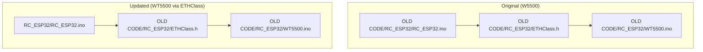
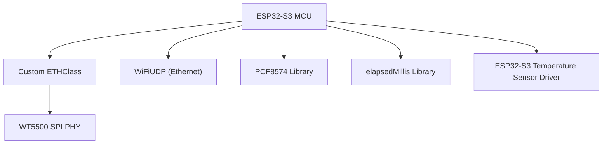
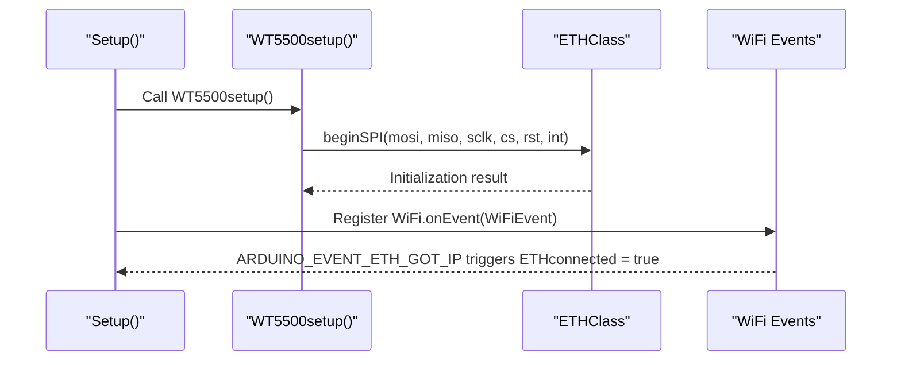
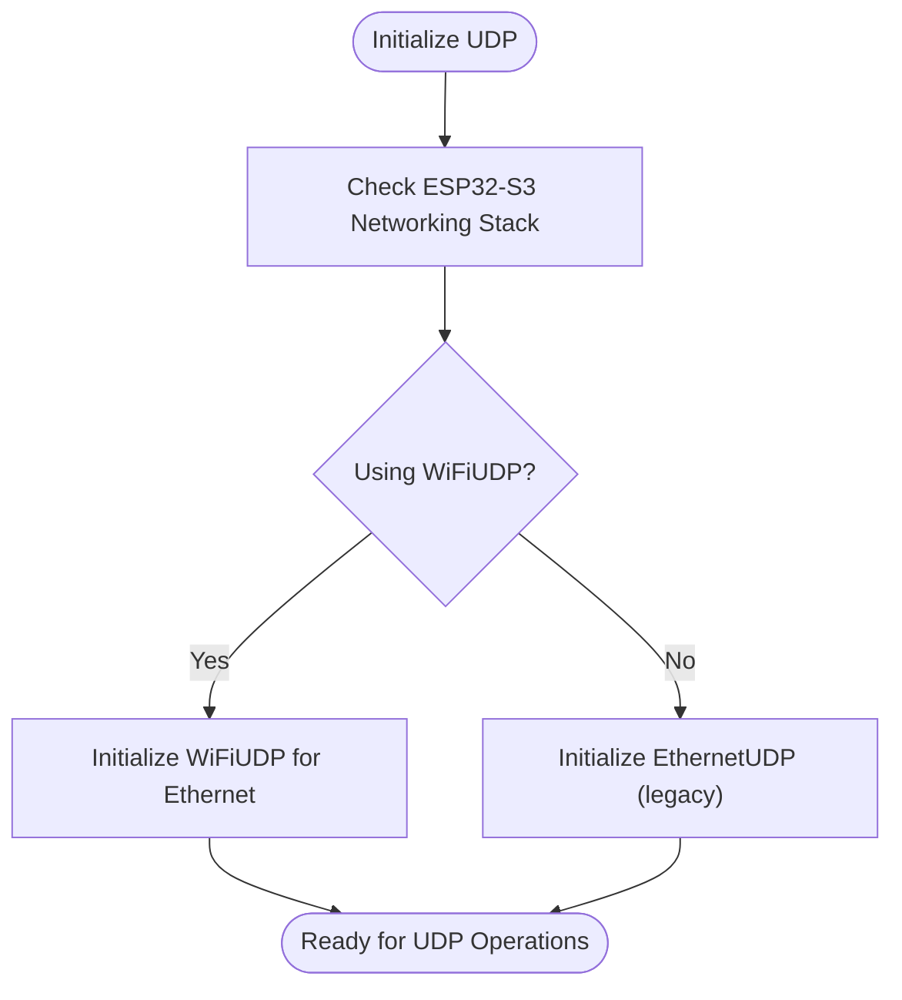
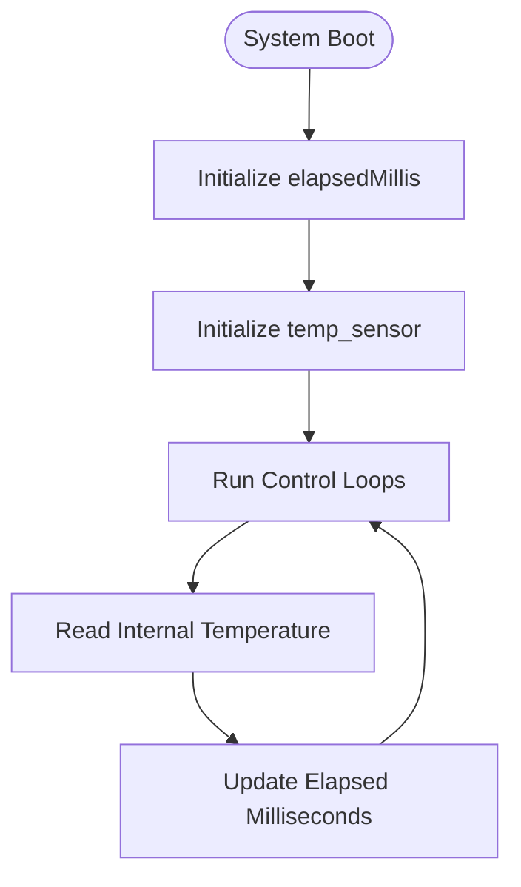
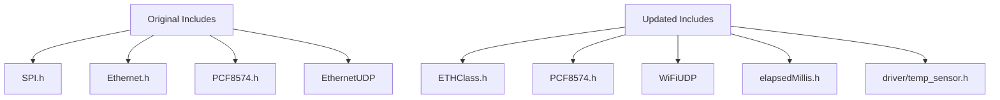

# Library and Dependency Updates

<cite>
**Referenced Files in This Document**
- [FORK_CHANGES.md](file://FORK_CHANGES.md)
- [RC_ESP32.ino](file://OLD CODE/RC_ESP32/RC_ESP32.ino)
- [RC_ESP32.ino](file://RC_ESP32/RC_ESP32.ino)
- [ETHClass.h](file://OLD CODE/RC_ESP32/ETHClass.h)
- [WT5500.ino](file://OLD CODE/RC_ESP32/WT5500.ino)
</cite>

## Table of Contents
1. [Introduction](#introduction)
2. [Project Structure](#project-structure)
3. [Core Components](#core-components)
4. [Architecture Overview](#architecture-overview)
5. [Detailed Component Analysis](#detailed-component-analysis)
6. [Dependency Analysis](#dependency-analysis)
7. [Performance Considerations](#performance-considerations)
8. [Troubleshooting Guide](#troubleshooting-guide)
9. [Conclusion](#conclusion)
10. [Appendices](#appendices)

## Introduction
This document details the library and dependency changes introduced during the fork of the ESP32 Rate Controller project. It provides a complete replacement matrix, explains the rationale behind each change, outlines compatibility implications, and offers step-by-step migration instructions. Special focus is placed on:
- Case-sensitive library naming change from pcf8574.h to PCF8574.h
- Removal of direct SPI.h and Ethernet.h dependencies in favor of a custom ETHClass
- Addition of elapsedMillis.h for precise timing operations
- Inclusion of ESP32-S3-specific driver/temp_sensor.h for internal temperature sensing
- Replacement of EthernetUDP with WiFiUDP for ESP32-S3 Ethernet stack compatibility

## Project Structure
The repository contains two primary branches of the project:
- OLD CODE/RC_ESP32: The original codebase using Arduino Ethernet and W5500
- RC_ESP32: The migrated codebase using a custom ETHClass for WT5500 SPI Ethernet on ESP32-S3

Key files involved in the library changes:
- RC_ESP32.ino (original): Contains the initial library includes and configurations
- RC_ESP32.ino (new): Reflects updated includes and configurations for ESP32-S3
- ETHClass.h: Custom Ethernet class header for ESP32-S3 SPI Ethernet
- WT5500.ino: WT5500 SPI Ethernet initialization and event handling

**Diagram sources**
- [RC_ESP32.ino:1-334](file://OLD CODE/RC_ESP32/RC_ESP32.ino#L1-L334)
- [ETHClass.h:1-118](file://OLD CODE/RC_ESP32/ETHClass.h#L1-L118)
- [WT5500.ino:1-99](file://OLD CODE/RC_ESP32/WT5500.ino#L1-L99)
- [RC_ESP32.ino:1-418](file://RC_ESP32/RC_ESP32.ino#L1-L418)

**Section sources**
- [FORK_CHANGES.md:1-433](file://FORK_CHANGES.md#L1-L433)
- [RC_ESP32.ino:1-334](file://OLD CODE/RC_ESP32/RC_ESP32.ino#L1-L334)
- [RC_ESP32.ino:1-418](file://RC_ESP32/RC_ESP32.ino#L1-L418)
- [ETHClass.h:1-118](file://OLD CODE/RC_ESP32/ETHClass.h#L1-L118)
- [WT5500.ino:1-99](file://OLD CODE/RC_ESP32/WT5500.ino#L1-L99)

## Core Components
This section documents the library and dependency changes with their reasons, compatibility implications, and migration steps.

### Library Replacement Matrix
- pcf8574.h → PCF8574.h
  - Reason: Case-sensitive library naming for Arduino Library Manager compatibility
  - Compatibility: Requires Arduino Library Manager-installed PCF8574 library
  - Migration: Replace include directive and ensure library is installed via Arduino IDE Library Manager
- SPI.h → Removed/Commented
  - Reason: SPI is now handled internally by the custom ETHClass
  - Compatibility: Eliminates direct SPI usage; rely on ETHClass for SPI bus management
  - Migration: Remove or comment out include; ensure ETHClass handles SPI configuration
- Ethernet.h → ETHClass.h
  - Reason: Custom Ethernet class for ESP32-S3 SPI Ethernet (WT5500)
  - Compatibility: Uses ESP-IDF’s esp_eth; requires ESP32-S3 board and appropriate core
  - Migration: Add ETHClass.h and ETHClass.cpp; replace EthernetUDP with WiFiUDP
- elapsedMillis.h → Added
  - Reason: Precise timing operations for loop and communication intervals
  - Compatibility: Part of Arduino ecosystem; widely supported
  - Migration: Install via Arduino IDE Library Manager; include in sketch
- driver/temp_sensor.h → Added
  - Reason: ESP32-S3 internal temperature sensor access
  - Compatibility: ESP32-S3-specific; requires ESP32-S3 board and compatible core
  - Migration: Include header; initialize sensor before use
- EthernetUDP → WiFiUDP
  - Reason: ESP32-S3 Ethernet stack uses WiFiUDP for Ethernet communications
  - Compatibility: Maintains API parity; ensures compatibility with ESP32-S3 networking stack
  - Migration: Replace EthernetUDP instances with WiFiUDP; update initialization accordingly

**Section sources**
- [FORK_CHANGES.md:18-28](file://FORK_CHANGES.md#L18-L28)
- [RC_ESP32.ino:1-334](file://OLD CODE/RC_ESP32/RC_ESP32.ino#L1-L334)
- [RC_ESP32.ino:1-418](file://RC_ESP32/RC_ESP32.ino#L1-L418)

### Reasons Behind Each Change
- Case-sensitive library naming: Ensures proper resolution of libraries installed via Arduino Library Manager, preventing compilation errors on case-sensitive filesystems.
- Removal of SPI.h and Ethernet.h: Centralizes Ethernet configuration and management through a custom ETHClass, simplifying SPI and Ethernet initialization and reducing external dependencies.
- Addition of elapsedMillis.h: Provides accurate millisecond-precision timing without relying on delay(), improving responsiveness and timing consistency.
- ESP32-S3 temp_sensor.h: Enables access to the internal temperature sensor for diagnostics and monitoring on ESP32-S3 boards.
- WiFiUDP replacement: Aligns with ESP32-S3 Ethernet stack behavior, ensuring consistent UDP communication semantics across the platform.

**Section sources**
- [FORK_CHANGES.md:18-28](file://FORK_CHANGES.md#L18-L28)

### Compatibility Implications
- ESP32-S3 Board Requirement: The migration depends on ESP32-S3 hardware and the ESP32-S3 Arduino core. Ensure the board is selected in the Arduino IDE and the correct core is installed.
- Library Availability: Libraries must be available via Arduino Library Manager. Verify installation of PCF8574, elapsedMillis, and any related Adafruit libraries.
- Network Stack Differences: Using ETHClass and WiFiUDP changes how Ethernet is configured and managed compared to the original W5500/Ethernet stack.

**Section sources**
- [FORK_CHANGES.md:8-16](file://FORK_CHANGES.md#L8-L16)
- [FORK_CHANGES.md:21-27](file://FORK_CHANGES.md#L21-L27)

### Step-by-Step Migration Instructions
1. Update Board and Core
   - Select ESP32-S3 board in Arduino IDE.
   - Install ESP32-S3 Arduino core compatible with ESP-IDF v2.x or v3.x.
2. Replace Library Includes
   - Replace pcf8574.h with PCF8574.h in all source files.
   - Remove or comment out SPI.h and Ethernet.h includes.
   - Add elapsedMillis.h and driver/temp_sensor.h includes.
3. Integrate ETHClass
   - Add ETHClass.h and ETHClass.cpp to the project.
   - Replace EthernetUDP with WiFiUDP for both UDP instances.
4. Update Initialization
   - Replace W5500 initialization with WT5500setup() and ETH.config().
   - Initialize WiFiUDP for Ethernet communications.
5. Verify Dependencies
   - Confirm all libraries are installed via Arduino Library Manager.
   - Test I2C device scanning and temperature sensor access.

**Section sources**
- [FORK_CHANGES.md:400-433](file://FORK_CHANGES.md#L400-L433)
- [WT5500.ino:9-17](file://OLD CODE/RC_ESP32/WT5500.ino#L9-L17)
- [ETHClass.h:79-87](file://OLD CODE/RC_ESP32/ETHClass.h#L79-L87)

## Architecture Overview
The updated architecture leverages a custom ETHClass for WT5500 SPI Ethernet on ESP32-S3, replacing the original W5500/Ethernet stack. WiFiUDP is used consistently for Ethernet communications, aligning with the ESP32-S3 networking model.

**Diagram sources**
- [WT5500.ino:9-17](file://OLD CODE/RC_ESP32/WT5500.ino#L9-L17)
- [ETHClass.h:79-87](file://OLD CODE/RC_ESP32/ETHClass.h#L79-L87)
- [RC_ESP32.ino:16-23](file://RC_ESP32/RC_ESP32.ino#L16-L23)

## Detailed Component Analysis

### ETHClass and WT5500 Integration
The custom ETHClass encapsulates ESP-IDF’s esp_eth functionality and provides a simplified interface for WT5500 SPI Ethernet. WT5500.ino initializes the PHY and registers WiFi events to manage link status.

**Diagram sources**
- [WT5500.ino:9-17](file://OLD CODE/RC_ESP32/WT5500.ino#L9-L17)
- [WT5500.ino:20-78](file://OLD CODE/RC_ESP32/WT5500.ino#L20-L78)
- [ETHClass.h:79-87](file://OLD CODE/RC_ESP32/ETHClass.h#L79-L87)

**Section sources**
- [WT5500.ino:1-99](file://OLD CODE/RC_ESP32/WT5500.ino#L1-L99)
- [ETHClass.h:1-118](file://OLD CODE/RC_ESP32/ETHClass.h#L1-L118)

### UDP Communication Changes
EthernetUDP is replaced with WiFiUDP for ESP32-S3 Ethernet stack compatibility. This change affects initialization and usage patterns for UDP communications.

**Diagram sources**
- [FORK_CHANGES.md:27-27](file://FORK_CHANGES.md#L27-L27)
- [RC_ESP32.ino:16-23](file://RC_ESP32/RC_ESP32.ino#L16-L23)

**Section sources**
- [FORK_CHANGES.md:27-27](file://FORK_CHANGES.md#L27-L27)
- [RC_ESP32.ino:151-155](file://RC_ESP32/RC_ESP32.ino#L151-L155)

### Timing and Temperature Sensors
- elapsedMillis.h: Used for precise timing operations, enabling accurate loop and communication scheduling.
- driver/temp_sensor.h: Provides access to the ESP32-S3 internal temperature sensor for diagnostics and monitoring.

**Diagram sources**
- [FORK_CHANGES.md:25-26](file://FORK_CHANGES.md#L25-L26)
- [RC_ESP32.ino:30-32](file://OLD CODE/RC_ESP32/RC_ESP32.ino#L30-L32)

**Section sources**
- [FORK_CHANGES.md:25-26](file://FORK_CHANGES.md#L25-L26)
- [RC_ESP32.ino:30-32](file://OLD CODE/RC_ESP32/RC_ESP32.ino#L30-L32)

## Dependency Analysis
The dependency changes centralize Ethernet management through ETHClass and simplify the overall dependency tree by removing direct SPI and Ethernet dependencies in favor of a unified interface.

**Diagram sources**
- [RC_ESP32.ino:25-29](file://OLD CODE/RC_ESP32/RC_ESP32.ino#L25-L29)
- [RC_ESP32.ino:20-24](file://RC_ESP32/RC_ESP32.ino#L20-L24)
- [FORK_CHANGES.md:18-28](file://FORK_CHANGES.md#L18-L28)

**Section sources**
- [RC_ESP32.ino:25-29](file://OLD CODE/RC_ESP32/RC_ESP32.ino#L25-L29)
- [RC_ESP32.ino:20-24](file://RC_ESP32/RC_ESP32.ino#L20-L24)
- [FORK_CHANGES.md:18-28](file://FORK_CHANGES.md#L18-L28)

## Performance Considerations
- Precise Timing: Using elapsedMillis.h improves timing accuracy and reduces jitter in control loops.
- Reduced Dependencies: Centralizing Ethernet management via ETHClass minimizes overhead and simplifies initialization.
- Temperature Monitoring: Access to the internal temperature sensor enables thermal monitoring and potential throttling strategies.

[No sources needed since this section provides general guidance]

## Troubleshooting Guide
- Library Installation Issues
  - Ensure PCF8574, elapsedMillis, and any Adafruit libraries are installed via Arduino IDE Library Manager.
  - Verify correct case for PCF8574.h includes.
- ETHClass and WT5500 Initialization
  - Confirm SPI pin definitions match hardware connections.
  - Check ETHClass initialization and event registration in WT5500.ino.
- UDP Communication
  - Replace EthernetUDP with WiFiUDP and verify initialization sequences.
  - Monitor ETHconnected flag for link status updates.
- Temperature Sensor Access
  - Initialize temp_sensor before reading temperatures.
  - Confirm ESP32-S3 board selection and compatible core.

**Section sources**
- [FORK_CHANGES.md:400-433](file://FORK_CHANGES.md#L400-L433)
- [WT5500.ino:9-17](file://OLD CODE/RC_ESP32/WT5500.ino#L9-L17)
- [ETHClass.h:79-87](file://OLD CODE/RC_ESP32/ETHClass.h#L79-L87)
- [RC_ESP32.ino:16-23](file://RC_ESP32/RC_ESP32.ino#L16-L23)

## Conclusion
The fork introduces significant improvements by migrating to ESP32-S3, centralizing Ethernet management via ETHClass, and integrating precise timing and temperature monitoring capabilities. These changes enhance maintainability, performance, and platform compatibility while preserving functional parity with the original W5500/Ethernet implementation.

[No sources needed since this section summarizes without analyzing specific files]

## Appendices

### Arduino Library Manager Installation Procedures
- PCF8574
  - Search for “PCF8574” in Library Manager and install.
  - Verify include: #include <PCF8574.h>
- elapsedMillis
  - Search for “elapsedMillis” in Library Manager and install.
  - Verify include: #include <elapsedMillis.h>
- Adafruit Libraries (as needed)
  - Search for Adafruit_PWMServoDriver, Adafruit_MCP23008, etc., and install.
  - Verify includes: #include <Adafruit_PWMServoDriver.h>, etc.

**Section sources**
- [FORK_CHANGES.md:400-433](file://FORK_CHANGES.md#L400-L433)
- [RC_ESP32.ino:1-334](file://OLD CODE/RC_ESP32/RC_ESP32.ino#L1-L334)
- [RC_ESP32.ino:1-418](file://RC_ESP32/RC_ESP32.ino#L1-L418)

### Version Compatibility Requirements
- ESP32-S3 Arduino Core: ESP-IDF v2.x or v3.x
- Board Selection: ESP32S3 Dev Module (or equivalent)
- Libraries: Latest versions available via Arduino IDE Library Manager
- Temp Sensor Driver: Included with ESP32-S3 core; ensure board/core compatibility

**Section sources**
- [FORK_CHANGES.md:8-16](file://FORK_CHANGES.md#L8-L16)
- [FORK_CHANGES.md:25-26](file://FORK_CHANGES.md#L25-L26)