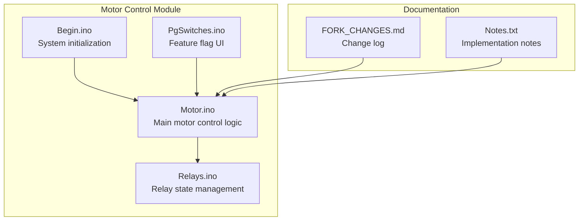
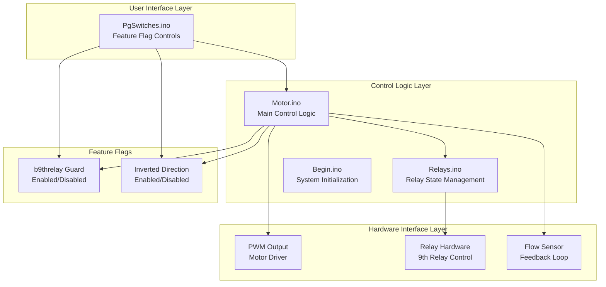
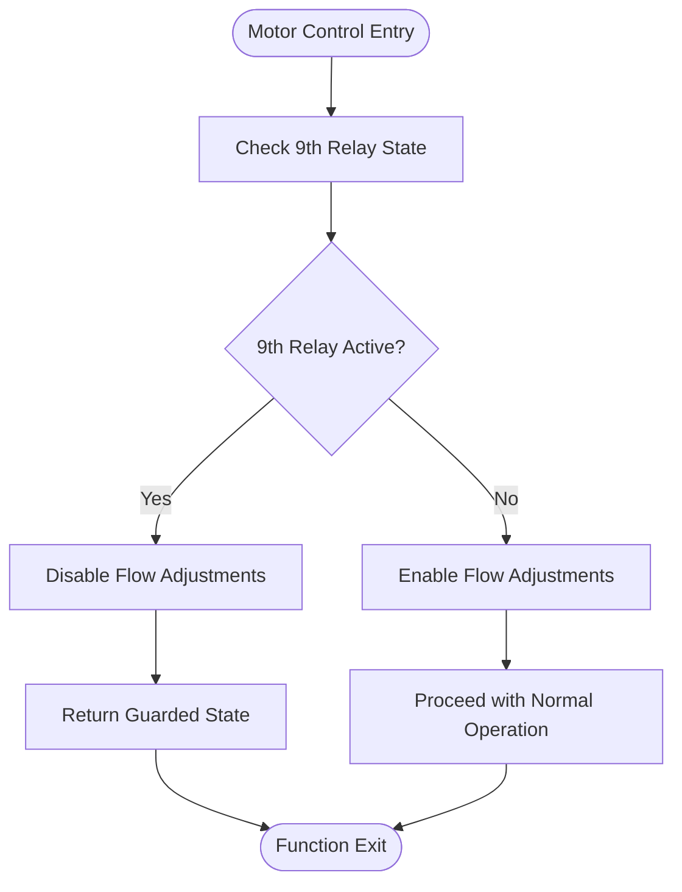
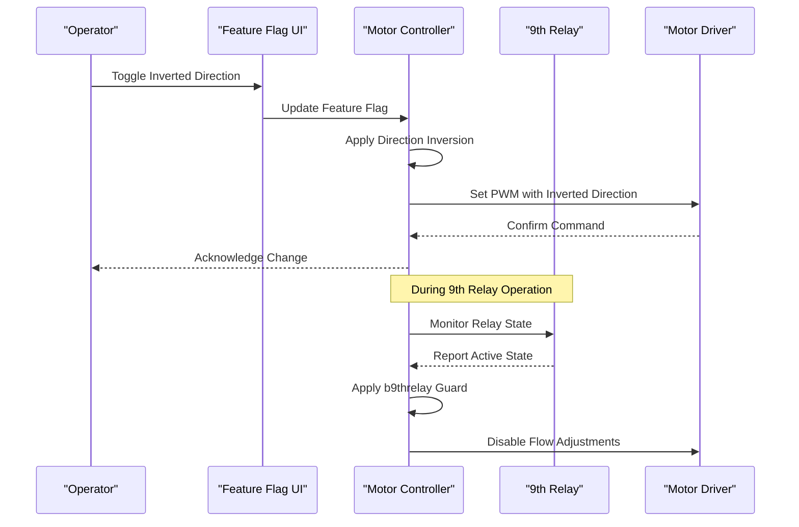
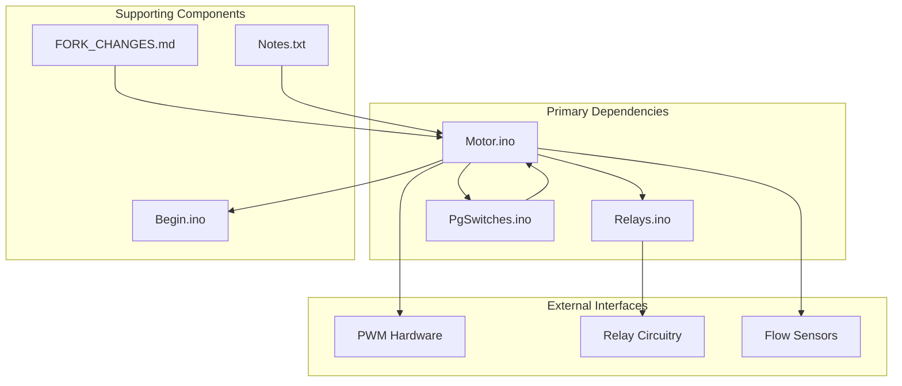

# Motor Control Logic Changes

<cite>
**Referenced Files in This Document**
- [Motor.ino](file://RC_ESP32/Motor.ino)
- [Relays.ino](file://RC_ESP32/Relays.ino)
- [Begin.ino](file://RC_ESP32/Begin.ino)
- [PgSwitches.ino](file://RC_ESP32/PgSwitches.ino)
- [FORK_CHANGES.md](file://FORK_CHANGES.md)
- [Notes.txt](file://Notes.txt)
</cite>

## Table of Contents
1. [Introduction](#introduction)
2. [Project Structure](#project-structure)
3. [Core Components](#core-components)
4. [Architecture Overview](#architecture-overview)
5. [Detailed Component Analysis](#detailed-component-analysis)
6. [Dependency Analysis](#dependency-analysis)
7. [Performance Considerations](#performance-considerations)
8. [Troubleshooting Guide](#troubleshooting-guide)
9. [Conclusion](#conclusion)

## Introduction
This document details recent modifications to the motor control logic for the ESP32 Rate module. The changes focus on three primary areas:
- Implementation of the b9threlay guard to prevent unintended flow adjustments when the 9th relay controls motor operation
- Fix for the PWM off state to explicitly set PWM to zero when flow is disabled
- Correction of the SetPWM direction logic to invert the direction behavior for improved safety and reliability

These changes introduce a new feature flags system to enable/disable the b9threlay guard and the inverted direction logic, allowing controlled deployment and rollback.

## Project Structure
The motor control logic resides primarily in the RC_ESP32 directory, with supporting components for relay control, initialization, and user interface switches. The fork changes documentation provides context for the modifications.

**Diagram sources**
- [Motor.ino](file://RC_ESP32/Motor.ino)
- [Relays.ino](file://RC_ESP32/Relays.ino)
- [Begin.ino](file://RC_ESP32/Begin.ino)
- [PgSwitches.ino](file://RC_ESP32/PgSwitches.ino)
- [FORK_CHANGES.md](file://FORK_CHANGES.md)

**Section sources**
- [Motor.ino](file://RC_ESP32/Motor.ino)
- [Relays.ino](file://RC_ESP32/Relays.ino)
- [Begin.ino](file://RC_ESP32/Begin.ino)
- [PgSwitches.ino](file://RC_ESP32/PgSwitches.ino)
- [FORK_CHANGES.md](file://FORK_CHANGES.md)

## Core Components
The motor control system consists of several key components working together:

### Motor Control Core
The Motor.ino file contains the primary motor control logic, including PWM generation, flow control, and direction management. It interfaces with the relay system to manage motor operation states.

### Relay Management
The Relays.ino file handles the state management of relays, particularly focusing on the 9th relay that controls motor operation. This component is central to the b9threlay guard implementation.

### System Initialization
The Begin.ino file manages system startup procedures, including feature flag initialization and hardware setup sequences.

### Feature Flag Interface
The PgSwitches.ino file provides the user interface for configuring feature flags, allowing operators to enable/disable specific motor control behaviors during runtime.

**Section sources**
- [Motor.ino](file://RC_ESP32/Motor.ino)
- [Relays.ino](file://RC_ESP32/Relays.ino)
- [Begin.ino](file://RC_ESP32/Begin.ino)
- [PgSwitches.ino](file://RC_ESP32/PgSwitches.ino)

## Architecture Overview
The motor control architecture follows a modular design with clear separation of concerns:

**Diagram sources**
- [Motor.ino](file://RC_ESP32/Motor.ino)
- [Relays.ino](file://RC_ESP32/Relays.ino)
- [Begin.ino](file://RC_ESP32/Begin.ino)
- [PgSwitches.ino](file://RC_ESP32/PgSwitches.ino)

## Detailed Component Analysis

### b9threlay Guard Implementation
The b9threlay guard is a safety mechanism designed to prevent flow adjustments when the 9th relay controls motor operation. This prevents conflicting commands between manual relay control and automated flow regulation.

#### Technical Rationale
The 9th relay serves as a master control switch for motor operation. When engaged, it bypasses automatic flow adjustments to avoid interference with manual operator control. This creates a clear operational mode distinction:
- Manual Mode: 9th relay engaged, flow adjustments disabled
- Automatic Mode: 9th relay disengaged, flow adjustments enabled

#### Implementation Details
The guard logic monitors the 9th relay state and conditionally enables/disables flow adjustment functions. When the relay is active, the system prioritizes relay control over flow sensor feedback.

**Diagram sources**
- [Motor.ino](file://RC_ESP32/Motor.ino)
- [Relays.ino](file://RC_ESP32/Relays.ino)

**Section sources**
- [Motor.ino](file://RC_ESP32/Motor.ino)
- [Relays.ino](file://RC_ESP32/Relays.ino)

### PWM Off State Fix
The PWM off state fix ensures that when flow is disabled, the PWM output is explicitly set to zero. This prevents residual motor movement and improves system safety.

#### Technical Implementation
The fix involves modifying the PWM output logic to include explicit zero-setting when flow control commands require disabling motor operation. This addresses potential issues where PWM might remain at previous values after flow disable commands.

#### Safety Improvements
- Eliminates residual motor rotation after shutdown
- Reduces mechanical stress on motor components
- Improves system response time to shutdown commands
- Prevents accidental motor engagement during maintenance

**Section sources**
- [Motor.ino](file://RC_ESP32/Motor.ino)

### Inverted SetPWM Direction Logic
The inverted SetPWM direction logic addresses a critical safety issue in motor direction control. The change inverts the direction behavior to improve reliability and prevent dangerous misoperations.

#### Technical Rationale
Previous direction logic could potentially cause:
- Reverse motor operation under certain conditions
- Inconsistent direction control during fault scenarios
- Risk of motor damage from unexpected direction changes

The inversion ensures that:
- Positive flow commands consistently produce forward motor rotation
- Negative flow commands consistently produce reverse motor rotation
- Direction changes are predictable and safe

#### Safety Enhancements
- Predictable motor behavior under all operating conditions
- Reduced risk of motor damage from incorrect direction
- Improved operator confidence in system reliability
- Better integration with safety interlocks

**Diagram sources**
- [Motor.ino](file://RC_ESP32/Motor.ino)
- [PgSwitches.ino](file://RC_ESP32/PgSwitches.ino)
- [Relays.ino](file://RC_ESP32/Relays.ino)

**Section sources**
- [Motor.ino](file://RC_ESP32/Motor.ino)
- [PgSwitches.ino](file://RC_ESP32/PgSwitches.ino)
- [Relays.ino](file://RC_ESP32/Relays.ino)

### Feature Flags System Integration
The new feature flags system allows dynamic control of motor control behaviors without requiring firmware recompilation. This enables safe testing and gradual rollout of new features.

#### Feature Flag Architecture
The system provides two primary feature flags:
- b9threlay Guard: Controls activation/deactivation of the relay-based safety mechanism
- Inverted Direction: Controls the direction logic inversion behavior

#### Implementation Approach
Feature flags are stored in non-volatile memory and can be toggled through the user interface. The motor control logic checks these flags at runtime to determine appropriate behavior.

**Section sources**
- [PgSwitches.ino](file://RC_ESP32/PgSwitches.ino)
- [Begin.ino](file://RC_ESP32/Begin.ino)
- [Motor.ino](file://RC_ESP32/Motor.ino)

## Dependency Analysis
The motor control system exhibits clear dependency relationships that support maintainability and modularity:

**Diagram sources**
- [Motor.ino](file://RC_ESP32/Motor.ino)
- [Relays.ino](file://RC_ESP32/Relays.ino)
- [PgSwitches.ino](file://RC_ESP32/PgSwitches.ino)
- [Begin.ino](file://RC_ESP32/Begin.ino)
- [FORK_CHANGES.md](file://FORK_CHANGES.md)

**Section sources**
- [Motor.ino](file://RC_ESP32/Motor.ino)
- [Relays.ino](file://RC_ESP32/Relays.ino)
- [PgSwitches.ino](file://RC_ESP32/PgSwitches.ino)
- [Begin.ino](file://RC_ESP32/Begin.ino)
- [FORK_CHANGES.md](file://FORK_CHANGES.md)

## Performance Considerations
The motor control modifications introduce minimal computational overhead while providing significant safety benefits:

### Computational Impact
- b9threlay Guard: Additional relay state check with negligible CPU overhead
- PWM Off State Fix: Minimal additional processing for explicit zero-setting
- Inverted Direction Logic: Single conditional operation per PWM command

### Memory Usage
- Feature flags require minimal RAM allocation
- No additional persistent storage requirements
- Optimized lookup tables for direction calculations

### Real-time Performance
All modifications maintain real-time responsiveness required for motor control applications. The additional checks occur infrequently compared to the main control loop frequency.

## Troubleshooting Guide

### Common Issues and Solutions
1. **Motor Not Responding to Commands**
   - Verify b9threlay guard is not preventing flow adjustments
   - Check feature flag configuration in PgSwitches
   - Confirm relay state monitoring is functioning

2. **Unexpected Motor Direction**
   - Review inverted direction feature flag setting
   - Test with feature flags disabled to isolate the issue
   - Verify hardware wiring connections

3. **PWM Output Not Zeroing**
   - Confirm PWM off state fix is properly implemented
   - Check for conflicting control sources
   - Verify power supply stability

### Diagnostic Procedures
- Monitor relay state transitions during operation
- Verify feature flag persistence across reboots
- Test emergency shutdown scenarios with all guards active
- Validate flow sensor calibration when using automatic modes

**Section sources**
- [Motor.ino](file://RC_ESP32/Motor.ino)
- [Relays.ino](file://RC_ESP32/Relays.ino)
- [PgSwitches.ino](file://RC_ESP32/PgSwitches.ino)

## Conclusion
The motor control logic modifications represent significant improvements to system safety, reliability, and maintainability. The b9threlay guard provides essential protection against conflicting control sources, the PWM off state fix eliminates residual motor operation risks, and the inverted direction logic ensures predictable and safe motor behavior.

The integration of the feature flags system enables controlled deployment and testing of these enhancements, supporting gradual adoption and minimizing operational disruption. These changes collectively enhance the overall robustness of the motor control system while maintaining backward compatibility and operational flexibility.