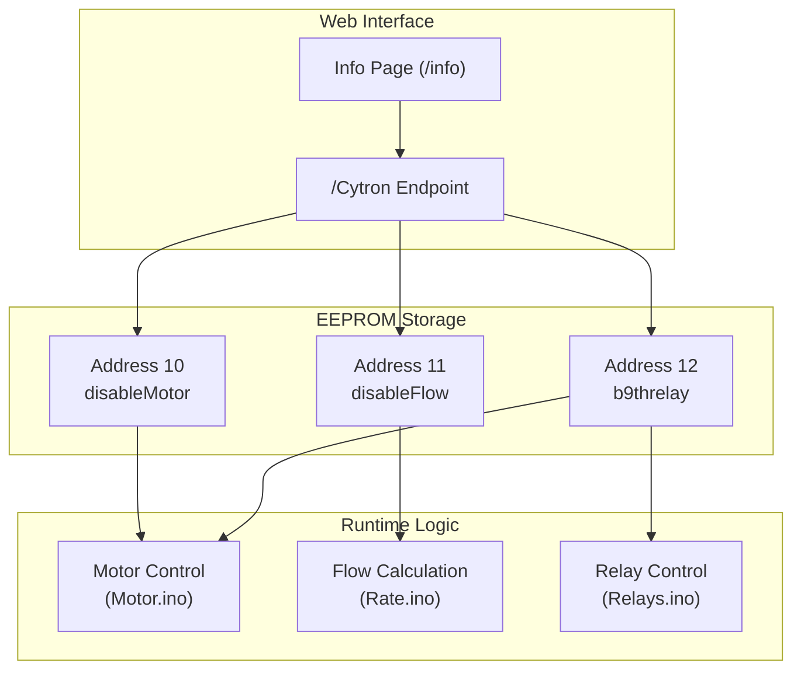
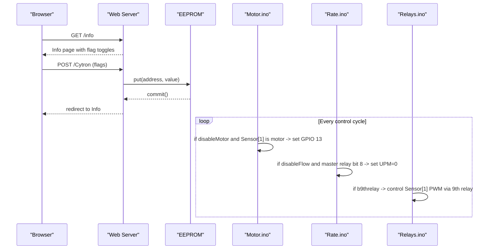
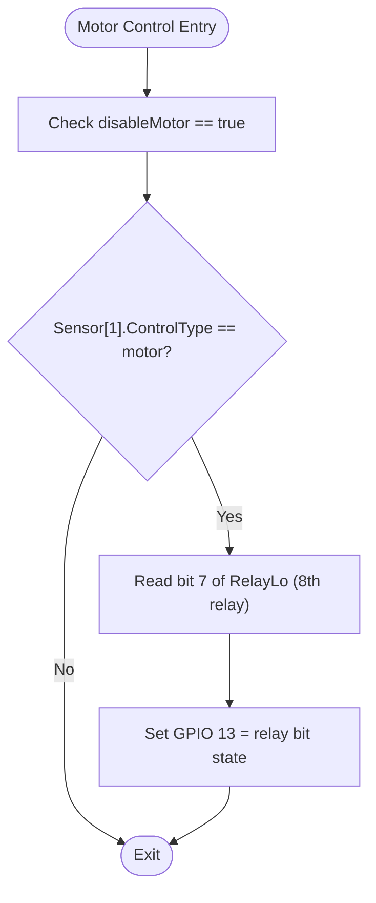
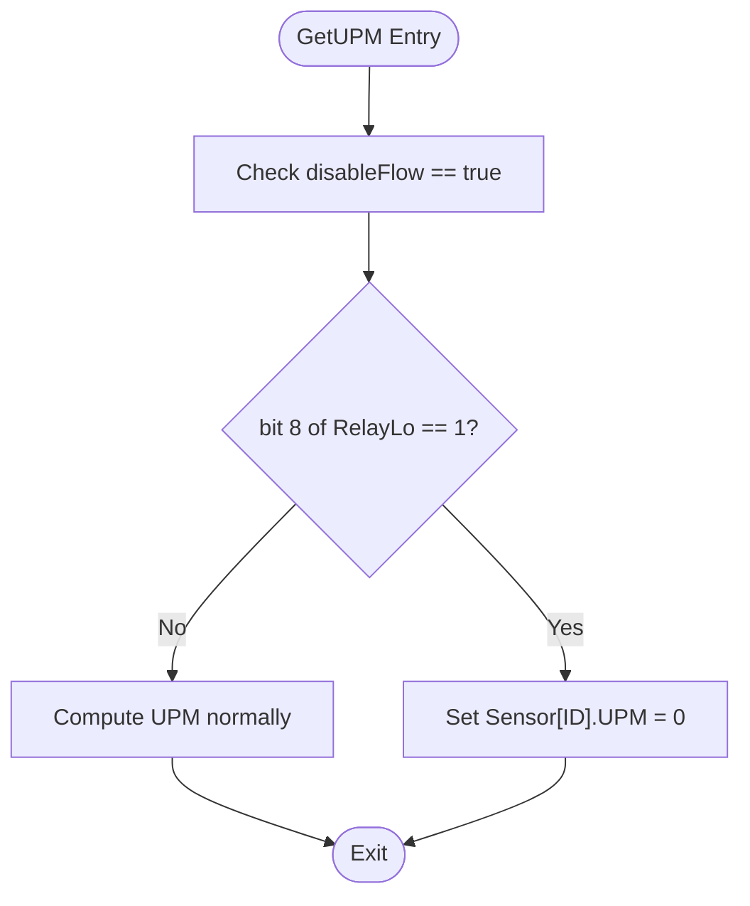
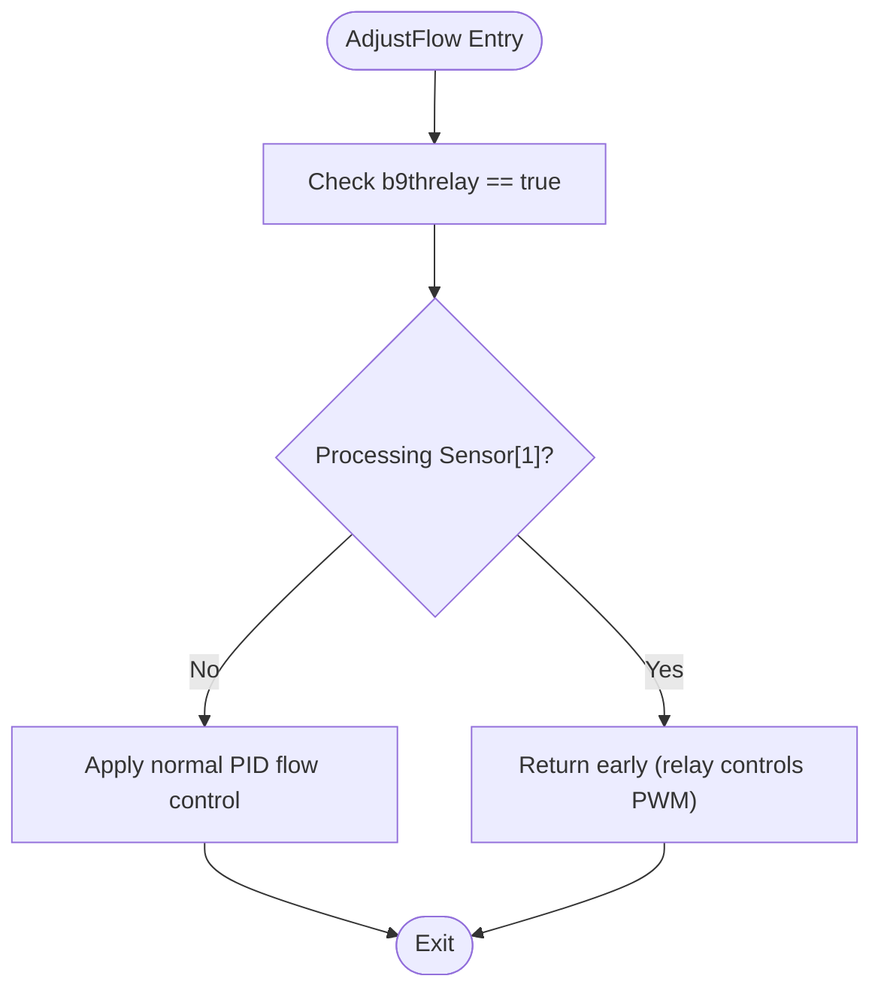
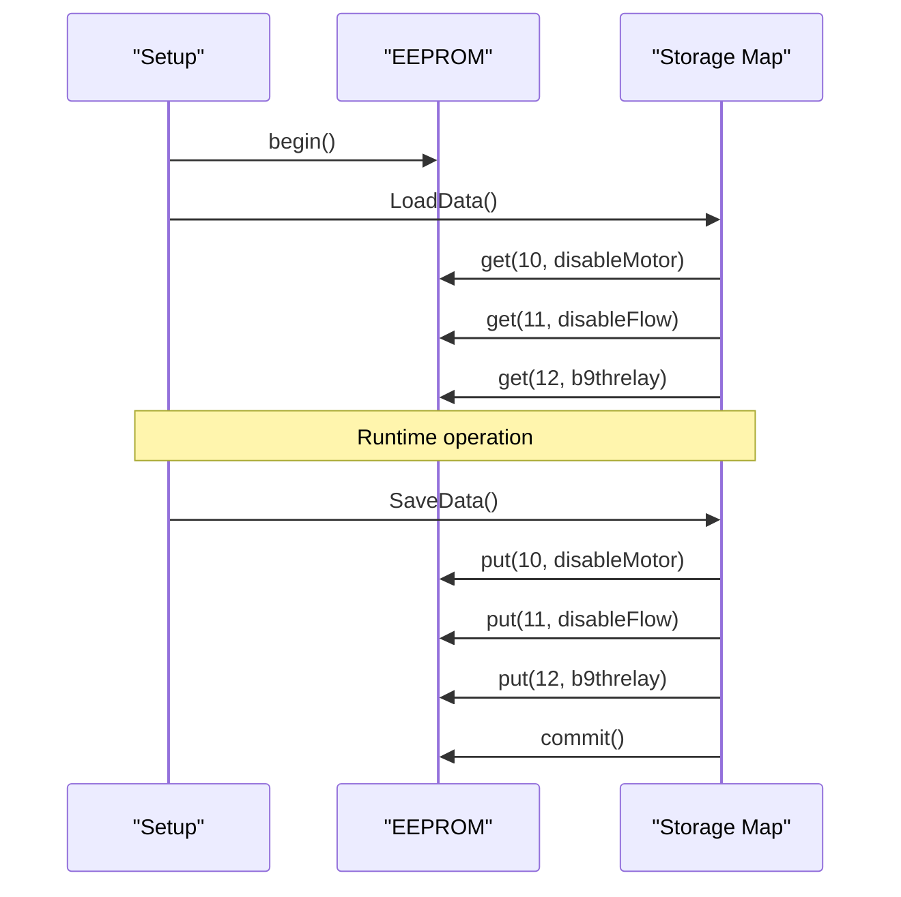
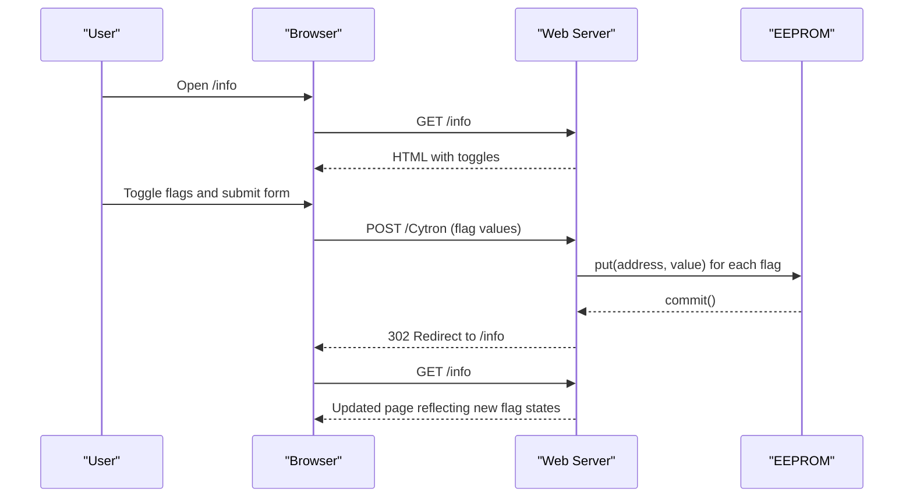
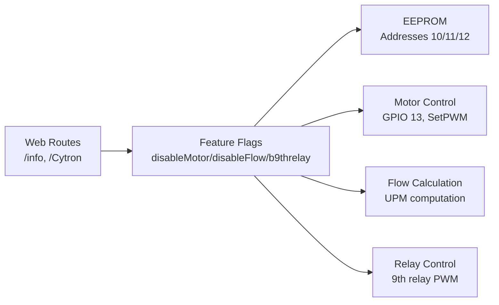

# New Feature Flags Implementation

<cite>
**Referenced Files in This Document**
- [FORK_CHANGES.md](file://FORK_CHANGES.md)
- [Begin.ino](file://RC_ESP32/Begin.ino)
- [Rate.ino](file://RC_ESP32/Rate.ino)
- [Motor.ino](file://RC_ESP32/Motor.ino)
- [Relays.ino](file://RC_ESP32/Relays.ino)
- [GUI.ino](file://RC_ESP32/GUI.ino)
- [Begin.ino (OLD CODE)](file://OLD CODE/RC_ESP32/Begin.ino)
- [PGInfo.ino (OLD CODE)](file://OLD CODE/RC_ESP32/PGInfo.ino)
- [GUI.ino (OLD CODE)](file://OLD CODE/RC_ESP32/GUI.ino)
</cite>

## Table of Contents
1. [Introduction](#introduction)
2. [Project Structure](#project-structure)
3. [Core Components](#core-components)
4. [Architecture Overview](#architecture-overview)
5. [Detailed Component Analysis](#detailed-component-analysis)
6. [Dependency Analysis](#dependency-analysis)
7. [Performance Considerations](#performance-considerations)
8. [Troubleshooting Guide](#troubleshooting-guide)
9. [Conclusion](#conclusion)

## Introduction
This document details the implementation of three new EEPROM-persisted feature flags that control motor and flow behavior in the ESP32 Rate Controller. The flags are:
- disableMotor (address 10): Disables the Cytron motor driver based on the 8th relay state
- disableFlow (address 11): Forces flow sensor readings to zero when the master relay is off
- b9threlay (address 12): Allows the 9th relay to control the front motor (Sensor[1])

Each flag is loaded from EEPROM at startup, can be toggled via the web interface, and persists across reboots. Safety considerations and integration points with motor control, flow sensing, and relay logic are documented.

## Project Structure
The feature flags are implemented across several modules:
- EEPROM persistence and loading/saving in the initialization routines
- Web interface controls on the Info page and the /Cytron endpoint
- Runtime logic applied in motor control, flow calculation, and relay handling

**Diagram sources**
- [Begin.ino:521-562](file://RC_ESP32/Begin.ino#L521-L562)
- [FORK_CHANGES.md:200-225](file://FORK_CHANGES.md#L200-L225)
- [GUI.ino:1-104](file://RC_ESP32/GUI.ino#L1-L104)
- [Motor.ino:1-76](file://RC_ESP32/Motor.ino#L1-L76)
- [Rate.ino:1-106](file://RC_ESP32/Rate.ino#L1-L106)
- [Relays.ino:1-282](file://RC_ESP32/Relays.ino#L1-L282)

**Section sources**
- [Begin.ino:521-562](file://RC_ESP32/Begin.ino#L521-L562)
- [FORK_CHANGES.md:200-225](file://FORK_CHANGES.md#L200-L225)

## Core Components
- disableMotor (address 10): When true and Sensor[1] is configured as a motor, the Cytron motor driver is disabled by setting GPIO 13 according to the 8th relay bit (bit 7 of RelayLo).
- disableFlow (address 11): When true and the master relay bit 8 is set, flow sensor readings (UPM) are forced to zero.
- b9threlay (address 12): When true, the 9th relay bit (bit 0 of NewHi) controls Sensor[1]'s PWM output via SetPWM(1, ...), enabling front motor control.

Storage and retrieval:
- EEPROM.load: Addresses 10, 11, 12 are read during LoadData()
- EEPROM.save: Addresses 10, 11, 12 are written during SaveData()

Web interface:
- Info page exposes three toggle controls for the flags
- POST to /Cytron updates flags and saves to EEPROM

**Section sources**
- [FORK_CHANGES.md:200-225](file://FORK_CHANGES.md#L200-L225)
- [Begin.ino:521-562](file://RC_ESP32/Begin.ino#L521-L562)
- [Begin.ino (OLD CODE):434-473](file://OLD CODE/RC_ESP32/Begin.ino#L434-L473)

## Architecture Overview
The feature flags integrate with the runtime control loop as follows:

**Diagram sources**
- [GUI.ino:1-104](file://RC_ESP32/GUI.ino#L1-L104)
- [Begin.ino:521-562](file://RC_ESP32/Begin.ino#L521-L562)
- [Motor.ino:1-76](file://RC_ESP32/Motor.ino#L1-L76)
- [Rate.ino:1-106](file://RC_ESP32/Rate.ino#L1-L106)
- [Relays.ino:1-282](file://RC_ESP32/Relays.ino#L1-L282)

## Detailed Component Analysis

### disableMotor Flag (Address 10)
Purpose:
- Disable the Cytron motor driver when the master relay is off, preventing unintended motor operation.

Mechanism:
- During motor control, if disableMotor is true and Sensor[1] is configured as a motor, GPIO 13 is set according to bit 7 of RelayLo (the 8th relay).

Safety considerations:
- GPIO 13 is initialized as an output during setup
- The flag only affects Sensor[1] when ControlType indicates a motor
- Ensure proper wiring and relay inversion settings

**Diagram sources**
- [FORK_CHANGES.md:276-280](file://FORK_CHANGES.md#L276-L280)
- [Begin.ino (OLD CODE):185-185](file://OLD CODE/RC_ESP32/Begin.ino#L185-L185)

**Section sources**
- [FORK_CHANGES.md:205-208](file://FORK_CHANGES.md#L205-L208)
- [FORK_CHANGES.md:276-280](file://FORK_CHANGES.md#L276-L280)
- [Begin.ino (OLD CODE):185-185](file://OLD CODE/RC_ESP32/Begin.ino#L185-L185)

### disableFlow Flag (Address 11)
Purpose:
- Prevent flow-based control when the master relay is off by forcing UPM readings to zero.

Mechanism:
- In the flow calculation routine, if disableFlow is true and bit 8 of RelayLo is set, Sensor[ID].UPM is set to zero.

Behavior:
- Applied per sensor during UPM computation
- Does not affect raw pulse counting; only the derived UPM value

**Diagram sources**
- [FORK_CHANGES.md:302-307](file://FORK_CHANGES.md#L302-L307)
- [Rate.ino:31-74](file://RC_ESP32/Rate.ino#L31-L74)

**Section sources**
- [FORK_CHANGES.md:206-208](file://FORK_CHANGES.md#L206-L208)
- [FORK_CHANGES.md:302-307](file://FORK_CHANGES.md#L302-L307)
- [Rate.ino:31-74](file://RC_ESP32/Rate.ino#L31-L74)

### b9threlay Flag (Address 12)
Purpose:
- Allow the 9th relay to directly control the front motor (Sensor[1]) bypassing PID control.

Mechanism:
- When b9threlay is true, Sensor[1] PWM is set based on bit 0 of NewHi (the 9th relay). The PWM direction logic is inverted compared to normal PID operation.

Guard behavior:
- In AdjustFlow(), when b9threlay is active and processing Sensor[1], the function returns early, deferring PWM control to relay logic.

**Diagram sources**
- [FORK_CHANGES.md:230-231](file://FORK_CHANGES.md#L230-L231)
- [FORK_CHANGES.md:282-287](file://FORK_CHANGES.md#L282-L287)
- [Motor.ino:2-29](file://RC_ESP32/Motor.ino#L2-L29)

**Section sources**
- [FORK_CHANGES.md:207-208](file://FORK_CHANGES.md#L207-L208)
- [FORK_CHANGES.md:230-231](file://FORK_CHANGES.md#L230-L231)
- [FORK_CHANGES.md:282-287](file://FORK_CHANGES.md#L282-L287)
- [Motor.ino:2-29](file://RC_ESP32/Motor.ino#L2-L29)

### EEPROM Storage and Retrieval
- LoadData() reads disableMotor, disableFlow, and b9threlay from EEPROM addresses 10, 11, and 12 respectively.
- SaveData() writes the current flag values to the same addresses.
- EEPROM.begin() is called during setup to initialize storage.

**Diagram sources**
- [Begin.ino:521-562](file://RC_ESP32/Begin.ino#L521-L562)
- [Begin.ino (OLD CODE):434-473](file://OLD CODE/RC_ESP32/Begin.ino#L434-L473)

**Section sources**
- [Begin.ino:521-562](file://RC_ESP32/Begin.ino#L521-L562)
- [Begin.ino (OLD CODE):434-473](file://OLD CODE/RC_ESP32/Begin.ino#L434-L473)

### Web Interface Controls
- The Info page (/info) presents three toggle controls for disableMotor, disableFlow, and b9threlay.
- A form posts to /Cytron which updates the flags in memory and saves them to EEPROM.
- After saving, the browser is redirected back to the Info page.

**Diagram sources**
- [FORK_CHANGES.md:186-190](file://FORK_CHANGES.md#L186-L190)
- [FORK_CHANGES.md:223-224](file://FORK_CHANGES.md#L223-L224)
- [GUI.ino:1-104](file://RC_ESP32/GUI.ino#L1-L104)

**Section sources**
- [FORK_CHANGES.md:186-190](file://FORK_CHANGES.md#L186-L190)
- [FORK_CHANGES.md:223-224](file://FORK_CHANGES.md#L223-L224)
- [GUI.ino:1-104](file://RC_ESP32/GUI.ino#L1-L104)

## Dependency Analysis
The feature flags depend on:
- EEPROM storage for persistence
- Web server routes for user interaction
- Motor control logic for Cytron driver gating
- Flow calculation for UPM zeroing
- Relay control for 9th relay PWM override

**Diagram sources**
- [Begin.ino:521-562](file://RC_ESP32/Begin.ino#L521-L562)
- [GUI.ino:1-104](file://RC_ESP32/GUI.ino#L1-L104)
- [Motor.ino:1-76](file://RC_ESP32/Motor.ino#L1-L76)
- [Rate.ino:1-106](file://RC_ESP32/Rate.ino#L1-L106)
- [Relays.ino:1-282](file://RC_ESP32/Relays.ino#L1-L282)

**Section sources**
- [Begin.ino:521-562](file://RC_ESP32/Begin.ino#L521-L562)
- [GUI.ino:1-104](file://RC_ESP32/GUI.ino#L1-L104)
- [Motor.ino:1-76](file://RC_ESP32/Motor.ino#L1-L76)
- [Rate.ino:1-106](file://RC_ESP32/Rate.ino#L1-L106)
- [Relays.ino:1-282](file://RC_ESP32/Relays.ino#L1-L282)

## Performance Considerations
- EEPROM operations: Each flag read/write is a small, infrequent operation. Place writes after user actions to minimize flash wear.
- Motor control: disableMotor adds a single digital write per control cycle when active; negligible overhead.
- Flow calculation: disableFlow performs a bitwise check and assignment; minimal CPU impact.
- Relay override: b9threlay introduces an early return in AdjustFlow() for Sensor[1]; ensure this does not conflict with other control logic.

## Troubleshooting Guide
Common issues and resolutions:
- Flags not persisting: Verify EEPROM.commit() completes after SaveData(). Check for storage corruption by ensuring LoadData() validates stored IDs/types.
- disableMotor ineffective: Confirm Sensor[1] ControlType is set to motor. Verify GPIO 13 pin is initialized and not conflicting with other outputs.
- disableFlow not working: Ensure bit 8 of RelayLo corresponds to the master relay. Check that the condition evaluates during GetUPM().
- b9threlay PWM incorrect: Confirm NewHi bit 0 controls the intended relay channel. Review SetPWM direction inversion logic when b9threlay is active.

**Section sources**
- [Begin.ino:521-562](file://RC_ESP32/Begin.ino#L521-L562)
- [Motor.ino:1-76](file://RC_ESP32/Motor.ino#L1-L76)
- [Rate.ino:31-74](file://RC_ESP32/Rate.ino#L31-L74)
- [Relays.ino:1-282](file://RC_ESP32/Relays.ino#L1-L282)

## Conclusion
The three feature flags provide targeted control over motor operation, flow sensing, and relay-based actuation. Their EEPROM-backed persistence ensures reliable configuration across reboots, while the web interface enables straightforward user management. Proper understanding of their integration points—motor control, flow computation, and relay logic—is essential for safe and effective deployment.