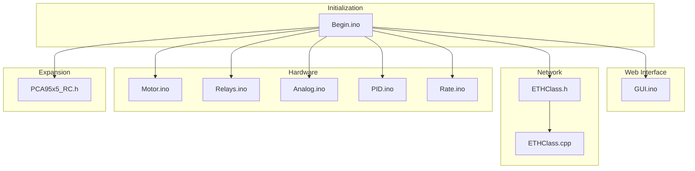
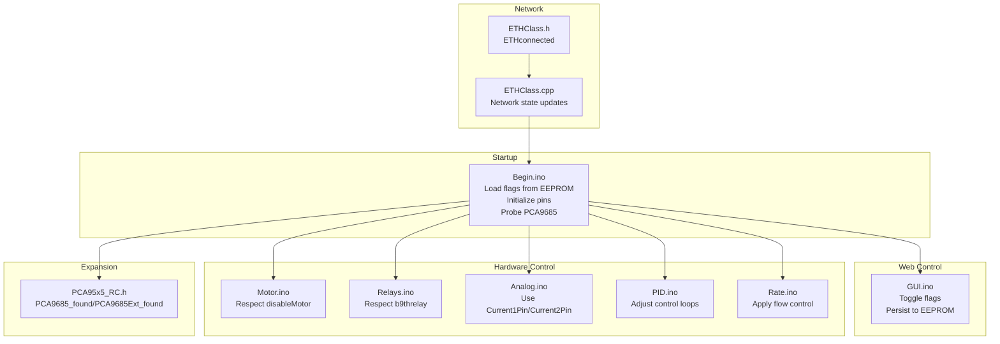
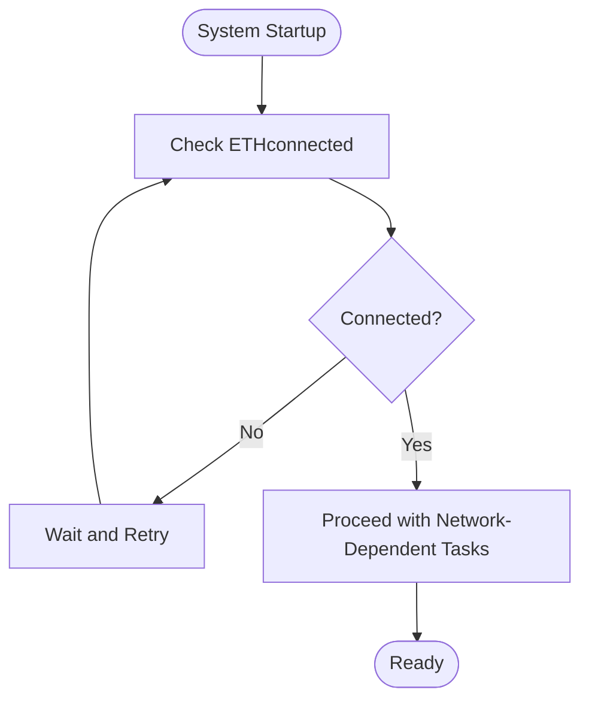
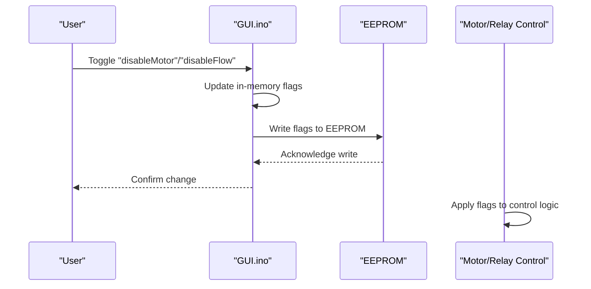
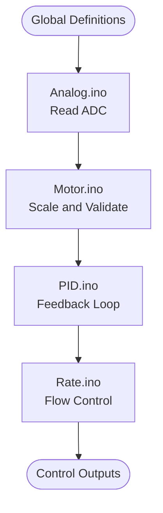
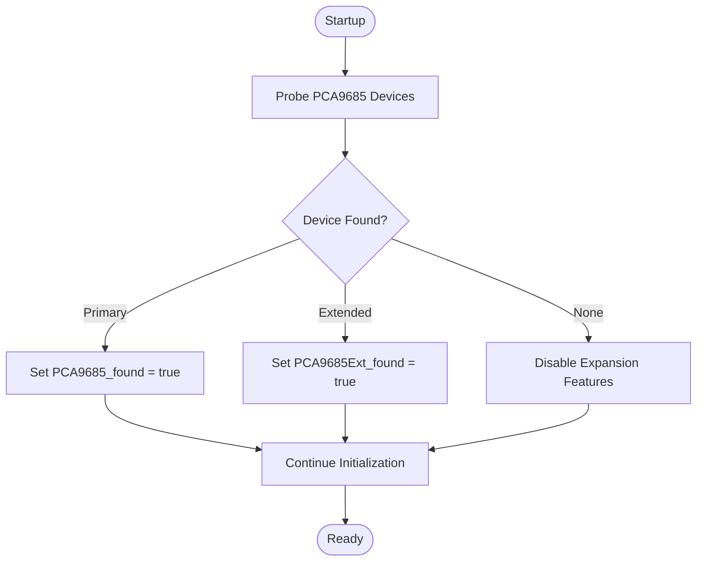
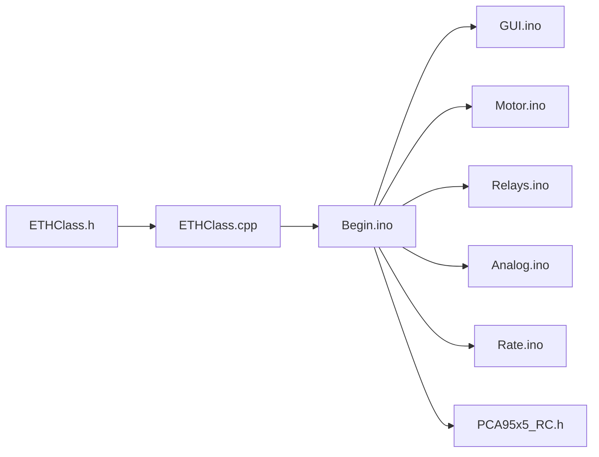

# New Global Variables and Constants

<cite>
**Referenced Files in This Document**
- [Begin.ino](file://RC_ESP32/Begin.ino)
- [GUI.ino](file://RC_ESP32/GUI.ino)
- [EthClass.h](file://RC_ESP32/ETHClass.h)
- [EthClass.cpp](file://RC_ESP32/ETHClass.cpp)
- [PCA95x5_RC.h](file://RC_ESP32/PCA95x5_RC.h)
- [Motor.ino](file://RC_ESP32/Motor.ino)
- [Relays.ino](file://RC_ESP32/Relays.ino)
- [Analog.ino](file://RC_ESP32/Analog.ino)
- [PID.ino](file://RC_ESP32/PID.ino)
- [Rate.ino](file://RC_ESP32/Rate.ino)
</cite>

## Table of Contents
1. [Introduction](#introduction)
2. [Project Structure](#project-structure)
3. [Core Components](#core-components)
4. [Architecture Overview](#architecture-overview)
5. [Detailed Component Analysis](#detailed-component-analysis)
6. [Dependency Analysis](#dependency-analysis)
7. [Performance Considerations](#performance-considerations)
8. [Troubleshooting Guide](#troubleshooting-guide)
9. [Conclusion](#conclusion)

## Introduction
This document details the new global variables and constants introduced to enhance the system's operational capabilities. These additions include:
- A boolean flag for event-driven network status monitoring
- Three feature-control flags stored in persistent memory
- Current sensing pin definitions for motor and flow monitoring
- PCA9685 extension support variables for I/O expansion
Each variable is analyzed for memory usage implications, initialization procedures, and its role within the overall system architecture.

## Project Structure
The enhanced functionality spans several modules:
- Initialization and persistence: Begin.ino
- Web interface controls: GUI.ino
- Network connectivity: ETHClass.h/.cpp
- Hardware peripherals: Motor.ino, Relays.ino, Analog.ino, PID.ino, Rate.ino
- I/O expansion: PCA95x5_RC.h

**Diagram sources**
- [Begin.ino](file://RC_ESP32/Begin.ino)
- [GUI.ino](file://RC_ESP32/GUI.ino)
- [ETHClass.h](file://RC_ESP32/ETHClass.h)
- [ETHClass.cpp](file://RC_ESP32/ETHClass.cpp)
- [PCA95x5_RC.h](file://RC_ESP32/PCA95x5_RC.h)
- [Motor.ino](file://RC_ESP32/Motor.ino)
- [Relays.ino](file://RC_ESP32/Relays.ino)
- [Analog.ino](file://RC_ESP32/Analog.ino)
- [PID.ino](file://RC_ESP32/PID.ino)
- [Rate.ino](file://RC_ESP32/Rate.ino)

**Section sources**
- [Begin.ino](file://RC_ESP32/Begin.ino)
- [GUI.ino](file://RC_ESP32/GUI.ino)
- [ETHClass.h](file://RC_ESP32/ETHClass.h)
- [ETHClass.cpp](file://RC_ESP32/ETHClass.cpp)
- [PCA95x5_RC.h](file://RC_ESP32/PCA95x5_RC.h)
- [Motor.ino](file://RC_ESP32/Motor.ino)
- [Relays.ino](file://RC_ESP32/Relays.ino)
- [Analog.ino](file://RC_ESP32/Analog.ino)
- [PID.ino](file://RC_ESP32/PID.ino)
- [Rate.ino](file://RC_ESP32/Rate.ino)

## Core Components
This section documents the new global variables and constants, their roles, and initialization procedures.

- ETHconnected (boolean)
  - Purpose: Event-driven network status indicator for Ethernet connectivity.
  - Memory: 1 byte per boolean instance.
  - Initialization: Set during network startup and updated by the ETHClass module.
  - Role: Enables conditional logic for network-dependent operations and graceful degradation when disconnected.

- Feature Flags (stored in persistent memory)
  - disableMotor (EEPROM address 10): Disables motor control output.
  - disableFlow (EEPROM addresses 11): Disables flow control mechanisms.
  - b9threlay (EEPROM addresses 12): Controls the ninth relay state.
  - Memory: Each flag occupies 1 byte in EEPROM; total footprint is 3 bytes.
  - Initialization: Loaded from EEPROM during startup; defaults applied if EEPROM is uninitialized.
  - Persistence: Updated via web interface and written back to EEPROM for retention across reboots.
  - Role: Provide runtime feature toggles for safety, diagnostics, and operational modes.

- Current Sensing Pin Definitions
  - Current1Pin: GPIO 6 for motor current monitoring.
  - Current2Pin: GPIO 14 for flow current monitoring.
  - Memory: 1 byte per pin definition.
  - Initialization: Defined globally for use across analog and motor control routines.
  - Role: Enable real-time current measurement for load monitoring and protection.

- PCA9685 Extension Support
  - PCA9685_found and PCA9685Ext_found: Boolean flags indicating presence of primary and extended PCA9685 devices.
  - Memory: 1 byte per flag.
  - Initialization: Probed during startup via I2C bus transactions; set true upon successful device detection.
  - Role: Enable/disable peripheral expansion features and adapt control logic accordingly.

**Section sources**
- [Begin.ino](file://RC_ESP32/Begin.ino)
- [GUI.ino](file://RC_ESP32/GUI.ino)
- [ETHClass.h](file://RC_ESP32/ETHClass.h)
- [ETHClass.cpp](file://RC_ESP32/ETHClass.cpp)
- [PCA95x5_RC.h](file://RC_ESP32/PCA95x5_RC.h)
- [Motor.ino](file://RC_ESP32/Motor.ino)
- [Relays.ino](file://RC_ESP32/Relays.ino)
- [Analog.ino](file://RC_ESP32/Analog.ino)
- [PID.ino](file://RC_ESP32/PID.ino)
- [Rate.ino](file://RC_ESP32/Rate.ino)

## Architecture Overview
The new global variables integrate across initialization, web control, hardware control, and I/O expansion layers. The following diagram illustrates their relationships and data flow.

**Diagram sources**
- [Begin.ino](file://RC_ESP32/Begin.ino)
- [GUI.ino](file://RC_ESP32/GUI.ino)
- [ETHClass.h](file://RC_ESP32/ETHClass.h)
- [ETHClass.cpp](file://RC_ESP32/ETHClass.cpp)
- [PCA95x5_RC.h](file://RC_ESP32/PCA95x5_RC.h)
- [Motor.ino](file://RC_ESP32/Motor.ino)
- [Relays.ino](file://RC_ESP32/Relays.ino)
- [Analog.ino](file://RC_ESP32/Analog.ino)
- [PID.ino](file://RC_ESP32/PID.ino)
- [Rate.ino](file://RC_ESP32/Rate.ino)

## Detailed Component Analysis

### Network Status Flag (ETHconnected)
- Purpose: Provide event-driven awareness of Ethernet connectivity for conditional operations.
- Initialization: Managed by the ETHClass module; updated during connection/disconnection events.
- Usage: Used in startup loops and runtime checks to delay dependent operations until connectivity is established.
- Memory: Minimal overhead; single boolean flag.

**Diagram sources**
- [ETHClass.h](file://RC_ESP32/ETHClass.h)
- [ETHClass.cpp](file://RC_ESP32/ETHClass.cpp)
- [Begin.ino](file://RC_ESP32/Begin.ino)

**Section sources**
- [ETHClass.h](file://RC_ESP32/ETHClass.h)
- [ETHClass.cpp](file://RC_ESP32/ETHClass.cpp)
- [Begin.ino](file://RC_ESP32/Begin.ino)

### Feature Flags (disableMotor, disableFlow, b9threlay)
- Purpose: Runtime feature toggles persisted in EEPROM for safety and diagnostics.
- Initialization: Loaded from EEPROM addresses 10–12 during startup; defaults applied if uninitialized.
- Web Interface: Controlled via GUI endpoints; toggles update flags and persist to EEPROM.
- Hardware Impact: disableMotor disables motor outputs; disableFlow suppresses flow control; b9threlay controls the ninth relay state.

**Diagram sources**
- [GUI.ino](file://RC_ESP32/GUI.ino)
- [Begin.ino](file://RC_ESP32/Begin.ino)

**Section sources**
- [Begin.ino](file://RC_ESP32/Begin.ino)
- [GUI.ino](file://RC_ESP32/GUI.ino)

### Current Sensing Pin Definitions (Current1Pin, Current2Pin)
- Purpose: Define GPIO pins for measuring motor and flow current.
- Initialization: Declared globally for use across analog and motor control modules.
- Usage: Read by analog routines to compute current values; used in PID and rate control loops for feedback.

**Diagram sources**
- [Analog.ino](file://RC_ESP32/Analog.ino)
- [Motor.ino](file://RC_ESP32/Motor.ino)
- [PID.ino](file://RC_ESP32/PID.ino)
- [Rate.ino](file://RC_ESP32/Rate.ino)

**Section sources**
- [Analog.ino](file://RC_ESP32/Analog.ino)
- [Motor.ino](file://RC_ESP32/Motor.ino)
- [PID.ino](file://RC_ESP32/PID.ino)
- [Rate.ino](file://RC_ESP32/Rate.ino)

### PCA9685 Extension Support (PCA9685_found, PCA9685Ext_found)
- Purpose: Detect and manage primary and extended PCA9685 I/O expanders for additional control channels.
- Initialization: Probed via I2C during startup; flags set true upon successful device detection.
- Usage: Conditional logic enables extended control features when PCA9685 devices are present.

**Diagram sources**
- [Begin.ino](file://RC_ESP32/Begin.ino)
- [PCA95x5_RC.h](file://RC_ESP32/PCA95x5_RC.h)

**Section sources**
- [Begin.ino](file://RC_ESP32/Begin.ino)
- [PCA95x5_RC.h](file://RC_ESP32/PCA95x5_RC.h)

## Dependency Analysis
The new globals create dependencies across modules:
- Begin.ino depends on GUI.ino for flag updates and EEPROM persistence.
- Motor.ino, Relays.ino, and Rate.ino depend on feature flags for control decisions.
- Analog.ino depends on current pin definitions for measurements.
- ETHClass modules influence startup sequencing via ETHconnected.
- PCA95x5_RC.h informs expansion-dependent logic.

**Diagram sources**
- [Begin.ino](file://RC_ESP32/Begin.ino)
- [GUI.ino](file://RC_ESP32/GUI.ino)
- [ETHClass.h](file://RC_ESP32/ETHClass.h)
- [ETHClass.cpp](file://RC_ESP32/ETHClass.cpp)
- [PCA95x5_RC.h](file://RC_ESP32/PCA95x5_RC.h)
- [Motor.ino](file://RC_ESP32/Motor.ino)
- [Relays.ino](file://RC_ESP32/Relays.ino)
- [Analog.ino](file://RC_ESP32/Analog.ino)
- [Rate.ino](file://RC_ESP32/Rate.ino)

**Section sources**
- [Begin.ino](file://RC_ESP32/Begin.ino)
- [GUI.ino](file://RC_ESP32/GUI.ino)
- [ETHClass.h](file://RC_ESP32/ETHClass.h)
- [ETHClass.cpp](file://RC_ESP32/ETHClass.cpp)
- [PCA95x5_RC.h](file://RC_ESP32/PCA95x5_RC.h)
- [Motor.ino](file://RC_ESP32/Motor.ino)
- [Relays.ino](file://RC_ESP32/Relays.ino)
- [Analog.ino](file://RC_ESP32/Analog.ino)
- [Rate.ino](file://RC_ESP32/Rate.ino)

## Performance Considerations
- Memory footprint:
  - Each boolean flag consumes minimal RAM (1 byte).
  - EEPROM storage for feature flags adds negligible flash wear but ensures persistence.
  - I2C probing for PCA9685 introduces small delays during startup; acceptable for boot-time initialization.
- Initialization timing:
  - Network readiness should be checked before enabling network-dependent tasks.
  - Feature flags should be loaded early to avoid inconsistent control behavior.
- Power and thermal implications:
  - Current sensing adds minimal load; ensure ADC sampling rates align with control loop frequencies.
  - Expansion devices increase I2C bus loading; verify bus speed and pull-up resistors.

## Troubleshooting Guide
- Network connectivity issues:
  - Verify ETHconnected flag transitions during connection events.
  - Use network logs to confirm connection establishment before proceeding with dependent tasks.
- Feature flags not taking effect:
  - Confirm EEPROM writes succeeded after web interface changes.
  - Check for EEPROM corruption or write failures; consider reinitializing defaults.
- Current sensing anomalies:
  - Validate wiring and ADC calibration for Current1Pin and Current2Pin.
  - Ensure noise filtering and sampling stability in analog routines.
- PCA9685 expansion problems:
  - Confirm I2C address conflicts and proper device selection.
  - Re-run probe routine if devices are intermittently detected.

**Section sources**
- [Begin.ino](file://RC_ESP32/Begin.ino)
- [GUI.ino](file://RC_ESP32/GUI.ino)
- [ETHClass.h](file://RC_ESP32/ETHClass.h)
- [ETHClass.cpp](file://RC_ESP32/ETHClass.cpp)
- [PCA95x5_RC.h](file://RC_ESP32/PCA95x5_RC.h)
- [Analog.ino](file://RC_ESP32/Analog.ino)
- [Motor.ino](file://RC_ESP32/Motor.ino)
- [Relays.ino](file://RC_ESP32/Relays.ino)
- [Rate.ino](file://RC_ESP32/Rate.ino)

## Conclusion
The new global variables and constants enhance system flexibility, safety, and extensibility. They enable event-driven network awareness, runtime feature control via persistent flags, precise current monitoring, and scalable I/O expansion. Proper initialization, persistence, and modular integration ensure reliable operation across startup, runtime, and diagnostic scenarios.