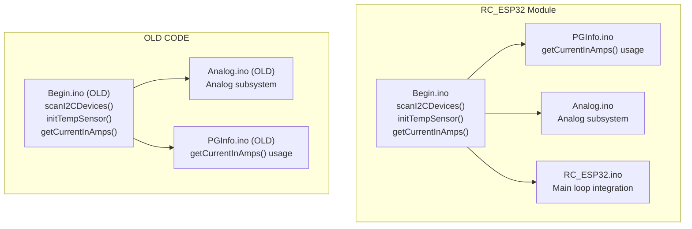
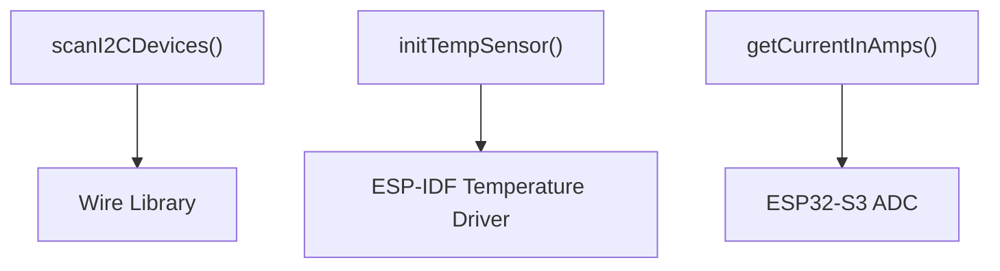

# New Utility Functions Integration

<cite>
**Referenced Files in This Document**
- [Begin.ino](file://RC_ESP32/Begin.ino)
- [Begin.ino (OLD CODE)](file://OLD CODE/RC_ESP32/Begin.ino)
- [PGInfo.ino](file://OLD CODE/RC_ESP32/PGInfo.ino)
- [FORK_CHANGES.md](file://FORK_CHANGES.md)
- [Analog.ino](file://RC_ESP32/Analog.ino)
- [Analog.ino (OLD CODE)](file://OLD CODE/RC_ESP32/Analog.ino)
- [RC_ESP32.ino](file://RC_ESP32/RC_ESP32.ino)
</cite>

## Table of Contents
1. [Introduction](#introduction)
2. [Project Structure](#project-structure)
3. [Core Components](#core-components)
4. [Architecture Overview](#architecture-overview)
5. [Detailed Component Analysis](#detailed-component-analysis)
6. [Dependency Analysis](#dependency-analysis)
7. [Performance Considerations](#performance-considerations)
8. [Troubleshooting Guide](#troubleshooting-guide)
9. [Conclusion](#conclusion)

## Introduction
This document details three new utility functions introduced during the fork: scanI2CDevices() for hardware detection, initTempSensor() for ESP32-S3 temperature monitoring, and getCurrentInAmps() for current measurement calculations. It explains the technical implementation, integration into the main system, hardware requirements for current sensing, usage examples, calibration procedures, and troubleshooting guidance.

## Project Structure
The new utility functions are primarily implemented in the RC_ESP32 module under Begin.ino. The old codebase contains earlier versions of these functions, and PGInfo.ino demonstrates usage of getCurrentInAmps() for displaying current measurements in the user interface.



**Diagram sources**
- [Begin.ino:805-855](file://RC_ESP32/Begin.ino#L805-L855)
- [PGInfo.ino:120-135](file://OLD CODE/RC_ESP32/PGInfo.ino#L120-L135)
- [Analog.ino:1-46](file://RC_ESP32/Analog.ino#L1-L46)
- [RC_ESP32.ino:230-260](file://RC_ESP32/RC_ESP32.ino#L230-L260)
- [Begin.ino (OLD CODE):582-631](file://OLD CODE/RC_ESP32/Begin.ino#L582-L631)
- [Analog.ino (OLD CODE):1-82](file://OLD CODE/RC_ESP32/Analog.ino#L1-L82)
- [PGInfo.ino (OLD CODE):120-135](file://OLD CODE/RC_ESP32/PGInfo.ino#L120-L135)

**Section sources**
- [Begin.ino:1-10](file://RC_ESP32/Begin.ino#L1-L10)
- [Begin.ino (OLD CODE):1-50](file://OLD CODE/RC_ESP32/Begin.ino#L1-L50)

## Core Components
This section documents each utility function, its implementation, integration points, and usage patterns.

- scanI2CDevices(): Scans the I2C bus for connected devices and reports addresses found.
- initTempSensor(): Initializes the ESP32-S3 internal temperature sensor for monitoring chip temperature.
- getCurrentInAmps(): Converts analog readings to current in amps using a linear model suitable for ACS712-style sensors.

Integration highlights:
- scanI2CDevices() is called during initialization to detect I2C peripherals.
- initTempSensor() is invoked early in startup to enable temperature monitoring.
- getCurrentInAmps() is used in PGInfo.ino to present current measurements in the UI.

**Section sources**
- [Begin.ino:805-855](file://RC_ESP32/Begin.ino#L805-L855)
- [PGInfo.ino:120-135](file://OLD CODE/RC_ESP32/PGInfo.ino#L120-L135)
- [Begin.ino (OLD CODE):582-631](file://OLD CODE/RC_ESP32/Begin.ino#L582-L631)

## Architecture Overview
The new utilities integrate into the main loop via initialization and periodic usage. The scanI2CDevices() function runs once at startup to discover I2C devices. The initTempSensor() function prepares the internal temperature sensor for runtime readings. The getCurrentInAmps() function is used by the UI to display measured current values.

```mermaid
sequenceDiagram
participant Boot as "Boot Process"
participant Init as "Initialization"
participant Loop as "Main Loop"
participant UI as "PGInfo UI"
Boot->>Init : "Call scanI2CDevices()"
Init-->>Boot : "Report I2C devices found"
Boot->>Init : "Call initTempSensor()"
Init-->>Boot : "Temperature sensor ready"
Loop->>UI : "Periodic updates"
UI->>UI : "getCurrentInAmps(Current1Pin)"
UI->>UI : "getCurrentInAmps(Current2Pin)"
UI-->>Loop : "Display current values"
```

**Diagram sources**
- [Begin.ino:240-250](file://RC_ESP32/Begin.ino#L240-L250)
- [PGInfo.ino:120-135](file://OLD CODE/RC_ESP32/PGInfo.ino#L120-L135)

## Detailed Component Analysis

### scanI2CDevices()
Purpose: Detect and enumerate I2C devices on the bus by probing addresses 1–127.

Implementation details:
- Uses Wire.beginTransmission() and Wire.endTransmission() to probe each address.
- Prints detected addresses to the serial console and counts devices found.
- Returns a formatted string listing devices for logging or display.

Integration:
- Called during module initialization to verify I2C connectivity and device presence.

Usage example:
- Call scanI2CDevices() after Wire.begin() to list connected I2C devices.

Calibration/troubleshooting:
- If no devices are found, verify I2C pull-up resistors and wiring.
- Check for address conflicts or floating bus conditions.

**Section sources**
- [Begin.ino:805-823](file://RC_ESP32/Begin.ino#L805-L823)
- [Begin.ino (OLD CODE):582-619](file://OLD CODE/RC_ESP32/Begin.ino#L582-L619)

### initTempSensor()
Purpose: Initialize the ESP32-S3 internal temperature sensor for runtime temperature readings.

Implementation details:
- Installs and enables the internal temperature sensor using the ESP-IDF temperature sensor API.
- Provides a separate getChipTempC() function to read the current temperature.

Integration:
- Called during startup to prepare the sensor for periodic reads.

Usage example:
- Call initTempSensor() once at boot, then periodically call getChipTempC() to retrieve temperature.

Calibration/troubleshooting:
- Temperature readings are relative to the chip’s thermal environment; ensure good airflow around the module.
- Avoid exposing the module to direct heat sources that could skew readings.

**Section sources**
- [Begin.ino:825-846](file://RC_ESP32/Begin.ino#L825-L846)

### getCurrentInAmps()
Purpose: Convert analog voltage readings to current in amps using a linear model.

Implementation details:
- Reads raw ADC value from the specified pin.
- Converts raw value to voltage based on the 12-bit ADC range and reference voltage.
- Applies a linear formula typical of ACS712-style Hall-effect current sensors: subtract offset and divide by sensitivity.

Hardware requirements:
- Requires an ACS712-style current sensor or similar Hall-effect sensor with a 2.5V output offset and 66mV/A sensitivity.
- Sensor must be wired so that the signal pin connects to the ESP32-S3 ADC-capable pin configured for current measurement.

Integration:
- Used in PGInfo.ino to display current values for two channels (Current1Pin and Current2Pin).

Usage example:
- getCurrentInAmps(Current1Pin) and getCurrentInAmps(Current2Pin) are called to update the UI.

Calibration procedure:
- Power the circuit with a known constant current load.
- Measure the analog output voltage and compare the calculated current to the known value.
- Adjust the linear model coefficients if significant deviation exists.

Troubleshooting:
- If readings are consistently off, verify the sensor wiring polarity and ensure the sensor is properly seated.
- Confirm the ADC pin selection matches the physical connection.

**Section sources**
- [Begin.ino:848-855](file://RC_ESP32/Begin.ino#L848-L855)
- [PGInfo.ino:120-135](file://OLD CODE/RC_ESP32/PGInfo.ino#L120-L135)
- [Analog.ino (OLD CODE):1-82](file://OLD CODE/RC_ESP32/Analog.ino#L1-L82)

## Dependency Analysis
The new utilities depend on the Arduino Wire library for I2C operations and the ESP-IDF temperature sensor driver for internal temperature monitoring. getCurrentInAmps() depends on the ESP32-S3 ADC subsystem and assumes a specific sensor model.



**Diagram sources**
- [Begin.ino:805-855](file://RC_ESP32/Begin.ino#L805-L855)

**Section sources**
- [Begin.ino:805-855](file://RC_ESP32/Begin.ino#L805-L855)

## Performance Considerations
- I2C scanning: Probes 127 addresses; keep scans minimal to avoid blocking the main loop.
- Temperature sensor: Initialization overhead is small; readings are fast but should be sampled at appropriate intervals.
- Current measurement: ADC conversions are quick; avoid excessive polling to preserve CPU cycles for control loops.

## Troubleshooting Guide
Common issues and resolutions:
- No I2C devices found:
  - Verify pull-up resistors (typically 4.7kΩ) on SDA/SCL lines.
  - Check wiring continuity and device power.
- Temperature sensor not responding:
  - Ensure initTempSensor() is called during setup.
  - Confirm the sensor is enabled before attempting reads.
- Incorrect current readings:
  - Validate sensor wiring and polarity.
  - Calibrate using a known load and adjust the linear model coefficients if necessary.

**Section sources**
- [Begin.ino:805-855](file://RC_ESP32/Begin.ino#L805-L855)
- [PGInfo.ino:120-135](file://OLD CODE/RC_ESP32/PGInfo.ino#L120-L135)

## Conclusion
The new utility functions enhance hardware detection, environmental monitoring, and current measurement capabilities. They integrate seamlessly into the existing system, with clear initialization and usage patterns. Proper calibration and wiring are essential for accurate current sensing, while basic checks ensure reliable I2C and temperature sensor operation.