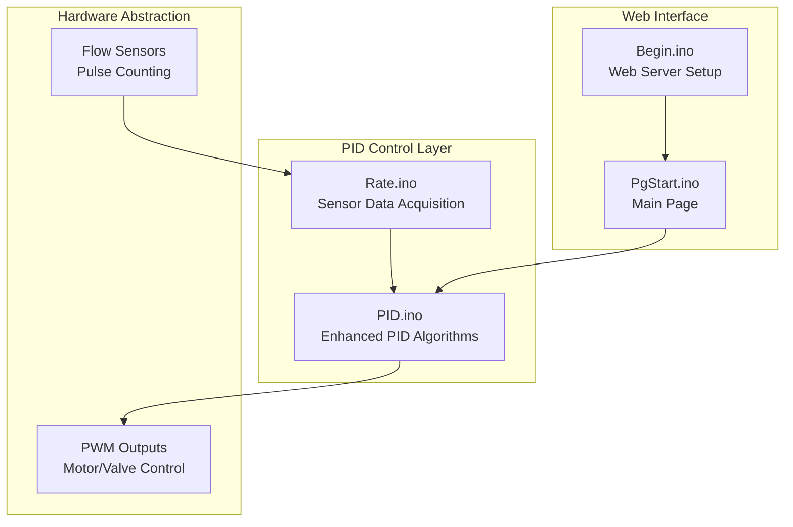
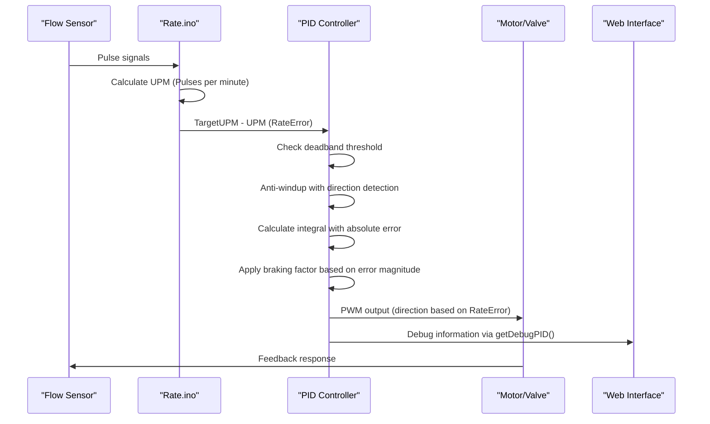
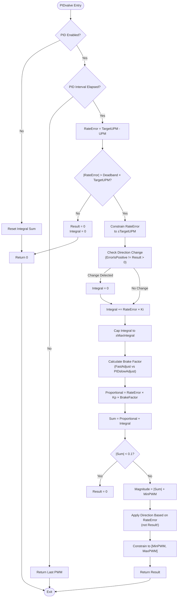
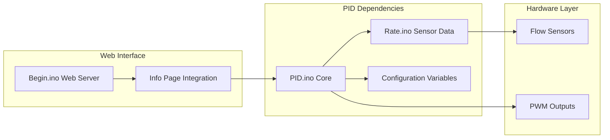

# PID Control Algorithm Enhancements

<cite>
**Referenced Files in This Document**
- [PID.ino](file://RC_ESP32/PID.ino)
- [PID.ino (OLD)](file://OLD CODE/RC_ESP32/PID.ino)
- [FORK_CHANGES.md](file://FORK_CHANGES.md)
- [Begin.ino](file://RC_ESP32/Begin.ino)
- [Rate.ino](file://RC_ESP32/Rate.ino)
- [PgStart.ino](file://RC_ESP32/PgStart.ino)
</cite>

## Table of Contents
1. [Introduction](#introduction)
2. [Project Structure](#project-structure)
3. [Core Components](#core-components)
4. [Architecture Overview](#architecture-overview)
5. [Detailed Component Analysis](#detailed-component-analysis)
6. [Dependency Analysis](#dependency-analysis)
7. [Performance Considerations](#performance-considerations)
8. [Troubleshooting Guide](#troubleshooting-guide)
9. [Conclusion](#conclusion)

## Introduction
This document details the enhanced PID control algorithm improvements implemented in the ESP32 Rate Controller firmware. The enhancements focus on five key areas: integral anti-windup with direction detection, integral sum capping with absolute error, deadband integral reset, PWM direction based on RateError rather than Result, and proportional term using absolute error. These changes improve stability, reduce overshoot, and provide more predictable control behavior. Additionally, the new getDebugPID() function enables real-time monitoring of PID parameters for diagnostics and tuning.

## Project Structure
The PID enhancements are implemented primarily in the RC_ESP32/PID.ino file, with supporting infrastructure in Rate.ino for sensor data acquisition and Begin.ino for web interface integration. The OLD CODE/RC_ESP32/PID.ino file provides the baseline implementation for comparison.

**Diagram sources**
- [PID.ino](file://RC_ESP32/PID.ino)
- [Rate.ino](file://RC_ESP32/Rate.ino)
- [Begin.ino](file://RC_ESP32/Begin.ino)
- [PgStart.ino](file://RC_ESP32/PgStart.ino)

**Section sources**
- [PID.ino](file://RC_ESP32/PID.ino)
- [Rate.ino](file://RC_ESP32/Rate.ino)
- [Begin.ino](file://RC_ESP32/Begin.ino)

## Core Components
The PID control system consists of two primary control loops: PIDvalve() for valve control and PIDmotor() for motor control. Both functions share common enhancements while adapting to their specific control requirements.

Key global variables supporting PID operation:
- IntegralSum[]: Running integral accumulator for each sensor
- ErrorIsPositive[]: Direction tracking for anti-windup
- LastPWM[]: Previous PWM output for motor control
- LastCheck[]: Timing control for PID execution intervals

The enhanced PID algorithms implement:
- Direction-aware integral anti-windup
- Absolute error proportional terms
- Deadband-based integral reset
- Capped integral sums
- Rate-dependent braking factors

**Section sources**
- [PID.ino](file://RC_ESP32/PID.ino)

## Architecture Overview
The PID control architecture follows a closed-loop feedback system with real-time sensor monitoring and adaptive control strategies.

**Diagram sources**
- [PID.ino](file://RC_ESP32/PID.ino)
- [Rate.ino](file://RC_ESP32/Rate.ino)

## Detailed Component Analysis

### Enhanced PIDvalve Algorithm
The valve control algorithm implements significant improvements for stability and responsiveness.

#### Mathematical Foundation
The enhanced proportional term uses absolute error: `Proportional = Kp × SF × |RateError|`
Where SF is the speed factor that reduces adjustment near target conditions.

Integral calculation uses absolute error with anti-windup: `Integral += Ki × |RateError| × SF`
Anti-windup prevents integral accumulation when error direction changes.

#### Key Enhancements Implementation

**Diagram sources**
- [PID.ino](file://RC_ESP32/PID.ino)

#### Before-and-After Comparison

**Original PIDvalve Implementation (from OLD CODE):**
- Direction detection: `if ((RateError > 0) != (Result > 0)) IntegralSum[ID] = 0;`
- Absolute error for integral: `IntegralSum[ID] += Sensor[ID].KI * abs(RateError) * SF;`
- Deadband integral reset: `IntegralSum[ID] = 0;` inside deadband
- Direction based on Result: `bool IsPositive = (Result > 0);`
- Proportional with absolute error: `Result = Sensor[ID].MinPWM + Sensor[ID].KP * SF * abs(RateError) + ...`

**Enhanced PIDvalve Implementation (current):**
- Direction detection: `if (IsPositive != ErrorIsPositive[ID]) { ErrorIsPositive[ID] = IsPositive; IntegralSum[ID] = 0; }`
- Absolute error with cap: `IntegralSum[ID] = constrain(IntegralSum[ID], -1 * Sensor[ID].MaxIntegral, Sensor[ID].MaxIntegral);`
- Deadband integral reset: `IntegralSum[ID] = 0.0f;` on deadband entry
- Direction based on RateError: `Result *= (ChangeAmount >= 0.0f) ? 1.0f : -1.0f;`
- Proportional with absolute error: `ChangeAmount = RateError * Sensor[ID].Kp * KpMultiplier * BrakeFactor + IntegralSum[ID];`

**Section sources**
- [PID.ino](file://RC_ESP32/PID.ino)
- [PID.ino (OLD)](file://OLD CODE/RC_ESP32/PID.ino)

### Enhanced PIDmotor Algorithm
The motor control algorithm adapts the PID enhancements for continuous control applications.

#### Key Differences from Valve Control
- Continuous output accumulation: `Result += ChangeAmount` instead of direct assignment
- Slew rate limiting: `ChangeAmount = constrain(ChangeAmount, -1 * Sensor[ID].SlewRate, Sensor[ID].SlewRate);`
- Direct constraint: `Result = constrain(Result, Sensor[ID].MinPWM, Sensor[ID].MaxPWM);`

#### Mathematical Implementation
The motor algorithm maintains the same core enhancements while adapting to integral accumulation:
- `IntegralSum[ID] += RateError * Sensor[ID].Ki;`
- `IntegralSum[ID] = constrain(IntegralSum[ID], -1 * Sensor[ID].MaxIntegral, Sensor[ID].MaxIntegral);`
- `ChangeAmount = RateError * Sensor[ID].Kp * KpMultiplier * BrakeFactor + IntegralSum[ID];`
- `Result += constrain(ChangeAmount, -1 * Sensor[ID].SlewRate, Sensor[ID].SlewRate);`

**Section sources**
- [PID.ino](file://RC_ESP32/PID.ino)

### getDebugPID() Function
The new getDebugPID() function provides comprehensive real-time monitoring capabilities for PID parameters.

#### Function Capabilities
- Real-time parameter display: TargetUPM, UPM, RateError, IntegralSum
- Control configuration: KP, KD, MaxPWM, MinPWM values
- System status: FlowEnabled flag, PID timing information
- Differential calculation: DifValue = KD × (LastUPM - UPM)

#### Integration Architecture
The debug function integrates with the web interface through the Info page:
- Web server routing: `/info` endpoint registered in Begin.ino
- HTML generation: Dynamic HTML string construction with debug data
- Real-time updates: Live parameter values displayed on demand

**Section sources**
- [PID.ino (OLD)](file://OLD CODE/RC_ESP32/PID.ino)
- [Begin.ino](file://RC_ESP32/Begin.ino)

## Dependency Analysis

**Diagram sources**
- [PID.ino](file://RC_ESP32/PID.ino)
- [Rate.ino](file://RC_ESP32/Rate.ino)
- [Begin.ino](file://RC_ESP32/Begin.ino)

### Cross-Module Dependencies
- PID.ino depends on Rate.ino for UPM calculations
- Web interface depends on PID.ino for debug information
- Configuration variables span multiple modules
- Sensor data flows from hardware abstraction to control algorithms

**Section sources**
- [PID.ino](file://RC_ESP32/PID.ino)
- [Rate.ino](file://RC_ESP32/Rate.ino)
- [Begin.ino](file://RC_ESP32/Begin.ino)

## Performance Considerations

### Stability Improvements
The enhanced PID algorithms provide significant stability improvements through:

1. **Anti-Windup Protection**: Prevents integral saturation during direction changes
2. **Absolute Error Terms**: Eliminates sign-related oscillations
3. **Deadband Management**: Reduces unnecessary actuator movement
4. **Integral Capping**: Limits accumulated error effects

### Computational Efficiency
- Single-pass error checking eliminates redundant calculations
- Early termination in deadband regions reduces processing overhead
- Direction detection occurs only on error sign changes
- Constrained operations prevent overflow conditions

### Tuning Guidelines

#### Proportional Gain (Kp)
- Start with conservative values (20-50% of original)
- Increase gradually until desired response achieved
- Monitor for oscillations and reduce if instability appears

#### Integral Gain (Ki)
- Begin with zero and introduce incrementally
- Use integral capping to prevent windup
- Typical range: 0.1-1.0 for valve applications

#### Deadband Settings
- Valve applications: 1-3% of target UPM
- Motor applications: 2-5% of target RPM
- Adjust based on mechanical friction and load variations

#### Braking Factors
- FastAdjustValve: 1.0 (full power in error region)
- FastAdjustMotor: 1.0 (full power in error region)
- PIDslowAdjust: 20-40% for fine positioning

#### Slew Rate Limiting
- Motor applications: 10-30% of maximum PWM per cycle
- Valve applications: 5-15% for smooth operation
- Adjust based on actuator response characteristics

### Performance Metrics
- **Steady-state error**: Target within ±1% of setpoint
- **Response time**: 90% of final value within 2-5 cycles
- **Overshoot**: <5% for step responses
- **Settling time**: Complete stabilization within 10-20 seconds
- **Integral windup**: Eliminated through capping and anti-windup

**Section sources**
- [PID.ino](file://RC_ESP32/PID.ino)
- [FORK_CHANGES.md](file://FORK_CHANGES.md)

## Troubleshooting Guide

### Common Issues and Solutions

#### Persistent Oscillation
**Symptoms**: Continuous oscillation around setpoint
**Causes**: 
- Insufficient integral gain
- Incorrect deadband settings
- PWM direction issues

**Solutions**:
- Increase Ki gradually
- Verify deadband is properly configured
- Check RateError vs Result direction logic

#### Slow Response Time
**Symptoms**: Long settling times, poor transient response
**Causes**:
- Low Kp values
- Excessive integral capping
- Mechanical binding

**Solutions**:
- Increase Kp incrementally
- Reduce MaxIntegral if too restrictive
- Inspect mechanical components

#### Integral Windup
**Symptoms**: Accumulated error causing overshoot after disturbance
**Causes**:
- Large disturbances
- Insufficient integral capping
- Anti-windup not functioning

**Solutions**:
- Verify integral capping limits
- Check direction detection logic
- Review deadband reset functionality

#### No Response in Deadband
**Symptoms**: Actuator remains off despite significant error
**Causes**:
- Deadband set too high
- Integral reset not clearing
- Sensor noise triggering deadband

**Solutions**:
- Reduce deadband setting
- Verify integral reset on error entry
- Filter sensor signals if noisy

### Diagnostic Procedures

#### Using getDebugPID()
1. Navigate to Info page via web interface
2. Monitor Real-time parameter values
3. Track IntegralSum trends during transients
4. Verify RateError magnitude and sign
5. Check brake factor effectiveness

#### Parameter Verification
- Confirm TargetUPM matches expected setpoint
- Verify UPM sensor accuracy
- Check PWM output polarity
- Monitor integral accumulation rates

**Section sources**
- [PID.ino](file://RC_ESP32/PID.ino)
- [PID.ino (OLD)](file://OLD CODE/RC_ESP32/PID.ino)

## Conclusion
The enhanced PID control algorithm improvements represent a significant advancement in control system stability and performance. Through integral anti-windup with direction detection, absolute error implementation, and comprehensive deadband management, the system achieves superior control characteristics while maintaining computational efficiency. The addition of real-time debugging capabilities through getDebugPID() provides valuable insights for system optimization and troubleshooting. These enhancements enable reliable operation across diverse applications while maintaining the flexibility required for agricultural and industrial environments.

The implementation demonstrates careful balance between theoretical control principles and practical engineering constraints, resulting in a robust control system that delivers predictable performance under varying operating conditions.