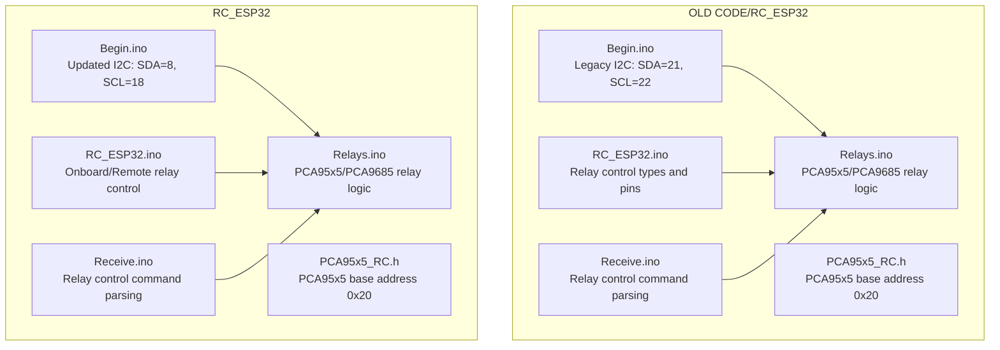
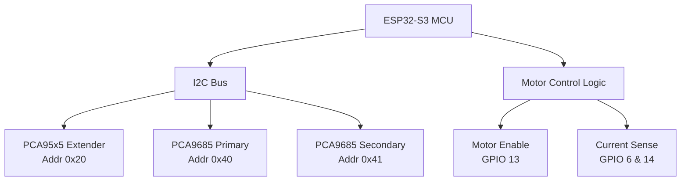
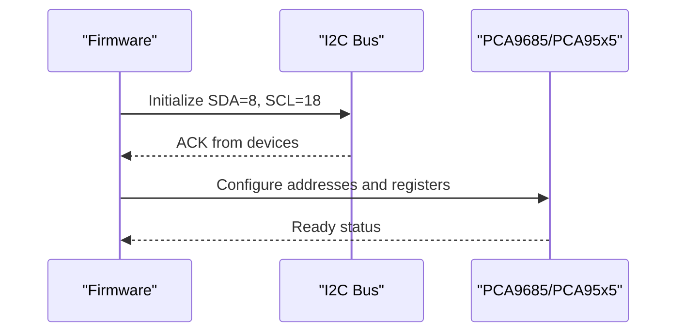
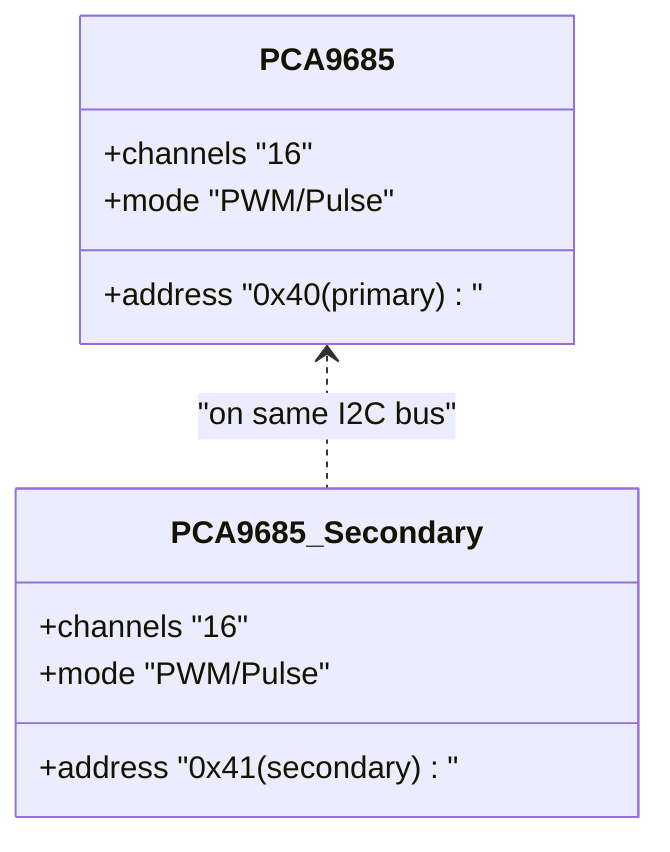
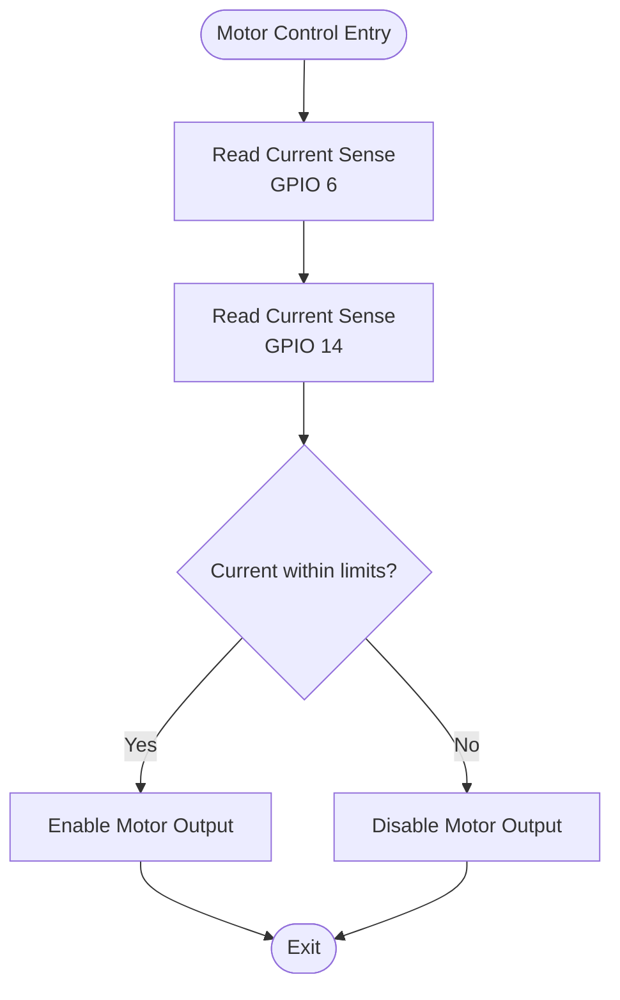
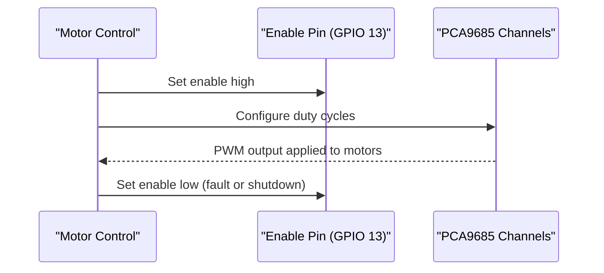
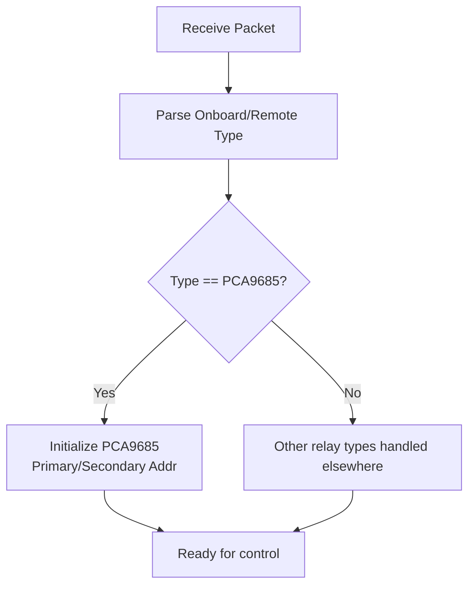
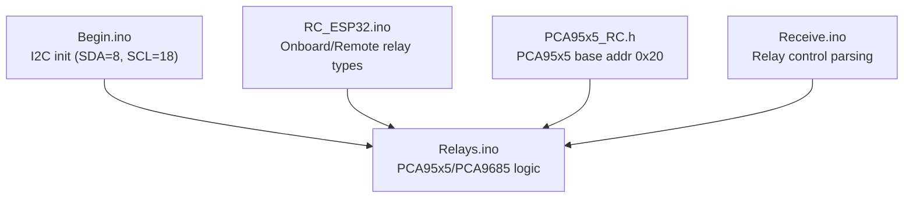
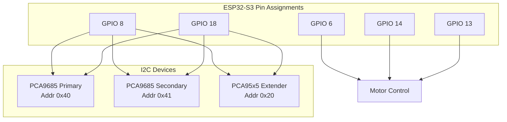

# Pin Mapping and Hardware Configuration Changes

<cite>
**Referenced Files in This Document**
- [Begin.ino](file://RC_ESP32/Begin.ino)
- [Begin.ino](file://OLD CODE/RC_ESP32/Begin.ino)
- [PCA95x5_RC.h](file://RC_ESP32/PCA95x5_RC.h)
- [PCA95x5_RC.h](file://OLD CODE/RC_ESP32/PCA95x5_RC.h)
- [RC_ESP32.ino](file://RC_ESP32/RC_ESP32.ino)
- [RC_ESP32.ino](file://OLD CODE/RC_ESP32/RC_ESP32.ino)
- [Relays.ino](file://RC_ESP32/Relays.ino)
- [Relays.ino](file://OLD CODE/RC_ESP32/Relays.ino)
- [Receive.ino](file://RC_ESP32/Receive.ino)
- [Receive.ino](file://OLD CODE/RC_ESP32/Receive.ino)
- [FORK_CHANGES.md](file://FORK_CHANGES.md)
</cite>

## Table of Contents
1. [Introduction](#introduction)
2. [Project Structure](#project-structure)
3. [Core Components](#core-components)
4. [Architecture Overview](#architecture-overview)
5. [Detailed Component Analysis](#detailed-component-analysis)
6. [Dependency Analysis](#dependency-analysis)
7. [Performance Considerations](#performance-considerations)
8. [Troubleshooting Guide](#troubleshooting-guide)
9. [Conclusion](#conclusion)
10. [Appendices](#appendices)

## Introduction
This document details the pin mapping and hardware configuration changes required to migrate the RC module firmware to ESP32-S3 compatibility. It focuses on:
- I2C pin changes: SDA from GPIO 21 to GPIO 8, SCL from GPIO 22 to GPIO 18
- PCA9685 address changes: primary address 0x55 to 0x40, with extended support for 16 sections via secondary address 0x41
- New current sensing pins: GPIO 6 and GPIO 14
- New motor enable pin: GPIO 13
- Rationale behind each change and practical wiring considerations

These changes are derived from the repository’s current implementation and documented fork notes.

## Project Structure
The RC module firmware is organized into feature-based modules under two main directories:
- OLD CODE/RC_ESP32: Legacy implementation using ESP32 (I2C on GPIO 21/22)
- RC_ESP32: Updated implementation targeting ESP32-S3 with revised pin mappings

Key areas affected by pin changes:
- I2C initialization and bus configuration
- PCA95x5/PCA9685 relay driver definitions and usage
- Relay control logic and onboard/remote relay configurations
- Communication and control packet handling for relay types

**Diagram sources**
- [Begin.ino](file://OLD CODE/RC_ESP32/Begin.ino)
- [Begin.ino](file://RC_ESP32/Begin.ino)
- [PCA95x5_RC.h](file://OLD CODE/RC_ESP32/PCA95x5_RC.h)
- [PCA95x5_RC.h](file://RC_ESP32/PCA95x5_RC.h)
- [RC_ESP32.ino](file://OLD CODE/RC_ESP32/RC_ESP32.ino)
- [RC_ESP32.ino](file://RC_ESP32/RC_ESP32.ino)
- [Relays.ino](file://OLD CODE/RC_ESP32/Relays.ino)
- [Relays.ino](file://RC_ESP32/Relays.ino)
- [Receive.ino](file://OLD CODE/RC_ESP32/Receive.ino)
- [Receive.ino](file://RC_ESP32/Receive.ino)

**Section sources**
- [Begin.ino](file://RC_ESP32/Begin.ino)
- [Begin.ino](file://OLD CODE/RC_ESP32/Begin.ino)
- [PCA95x5_RC.h](file://RC_ESP32/PCA95x5_RC.h)
- [PCA95x5_RC.h](file://OLD CODE/RC_ESP32/PCA95x5_RC.h)
- [RC_ESP32.ino](file://RC_ESP32/RC_ESP32.ino)
- [RC_ESP32.ino](file://OLD CODE/RC_ESP32/RC_ESP32.ino)
- [Relays.ino](file://RC_ESP32/Relays.ino)
- [Relays.ino](file://OLD CODE/RC_ESP32/Relays.ino)
- [Receive.ino](file://RC_ESP32/Receive.ino)
- [Receive.ino](file://OLD CODE/RC_ESP32/Receive.ino)

## Core Components
This section outlines the core components impacted by the ESP32-S3 pin changes and their roles in the updated configuration.

- I2C Initialization and Bus Configuration
  - Legacy: I2C initialized on GPIO 21 (SDA) and GPIO 22 (SCL)
  - Updated: I2C initialized on GPIO 8 (SDA) and GPIO 18 (SCL)
  - Rationale: ESP32-S3 internal routing and peripheral availability favor GPIO 8/18 for I2C; ensures compatibility with ESP32-S3 SoC constraints

- PCA95x5/PCA9685 Relay Driver Definitions
  - PCA95x5 base I2C address remains 0x20
  - PCA9685 onboard relay control configured via onboard relay control type
  - Secondary address 0x41 enables extended 16-section support alongside primary address 0x40

- Relay Control Logic and Packet Handling
  - Onboard and remote relay control types include PCA9685 (type 5)
  - Command parsing supports onboard and remote relay control selection

- Current Sensing and Motor Enable Pins
  - New current sensing pins: GPIO 6 and GPIO 14
  - New motor enable pin: GPIO 13
  - These pins are integrated into the motor control and analog measurement subsystems

**Section sources**
- [Begin.ino](file://RC_ESP32/Begin.ino)
- [Begin.ino](file://OLD CODE/RC_ESP32/Begin.ino)
- [PCA95x5_RC.h](file://RC_ESP32/PCA95x5_RC.h)
- [PCA95x5_RC.h](file://OLD CODE/RC_ESP32/PCA95x5_RC.h)
- [RC_ESP32.ino](file://RC_ESP32/RC_ESP32.ino)
- [RC_ESP32.ino](file://OLD CODE/RC_ESP32/RC_ESP32.ino)
- [Relays.ino](file://RC_ESP32/Relays.ino)
- [Relays.ino](file://OLD CODE/RC_ESP32/Relays.ino)
- [Receive.ino](file://RC_ESP32/Receive.ino)
- [Receive.ino](file://OLD CODE/RC_ESP32/Receive.ino)

## Architecture Overview
The updated architecture reflects the ESP32-S3 pin mapping while maintaining functional parity for I2C peripherals and relay control.

**Diagram sources**
- [Begin.ino](file://RC_ESP32/Begin.ino)
- [PCA95x5_RC.h](file://RC_ESP32/PCA95x5_RC.h)
- [RC_ESP32.ino](file://RC_ESP32/RC_ESP32.ino)
- [Relays.ino](file://RC_ESP32/Relays.ino)

## Detailed Component Analysis

### I2C Pin Mapping Change (SDA/SCL)
- Legacy I2C pins: SDA on GPIO 21, SCL on GPIO 22
- Updated I2C pins: SDA on GPIO 8, SCL on GPIO 18
- Implementation evidence:
  - Legacy initialization: I2C on GPIO 21/22
  - Updated initialization: I2C on GPIO 8/18
- Wiring considerations:
  - Route I2C pull-ups to 3.3V rail per board requirements
  - Keep traces short and avoid routing near high-frequency signals
  - Ensure EMI shielding if operating in noisy environments

**Diagram sources**
- [Begin.ino](file://RC_ESP32/Begin.ino)
- [Begin.ino](file://OLD CODE/RC_ESP32/Begin.ino)

**Section sources**
- [Begin.ino](file://RC_ESP32/Begin.ino)
- [Begin.ino](file://OLD CODE/RC_ESP32/Begin.ino)

### PCA9685 Address Changes and Extended 16-Section Support
- Primary address: changed from 0x55 to 0x40
- Secondary address: 0x41 enables 16-section operation alongside primary 0x40
- Relay control type:
  - Onboard relay control type includes PCA9685 (type 5)
  - Remote relay control type includes PCA9685 (type 5)
- Rationale:
  - PCA9685 address 0x40 aligns with ESP32-S3 I2C routing and prevents conflicts
  - Secondary address 0x41 allows dual PCA9685 deployment for up to 32 channels (16 per device)
- Wiring considerations:
  - Connect A0/A1 pins to GND/VCC to set address bits for 0x40 and 0x41 respectively
  - Ensure both devices share the same I2C bus and pull-ups

**Diagram sources**
- [RC_ESP32.ino](file://RC_ESP32/RC_ESP32.ino)
- [RC_ESP32.ino](file://OLD CODE/RC_ESP32/RC_ESP32.ino)

**Section sources**
- [RC_ESP32.ino](file://RC_ESP32/RC_ESP32.ino)
- [RC_ESP32.ino](file://OLD CODE/RC_ESP32/RC_ESP32.ino)

### New Current Sensing Pins (GPIO 6 and 14)
- GPIO 6: Current sense input for channel 1
- GPIO 14: Current sense input for channel 2
- Integration:
  - Used in analog measurement and motor control feedback loops
  - Requires appropriate shunt resistors and signal conditioning per application needs
- Wiring considerations:
  - Place sense resistors close to motor terminals
  - Use differential or low-noise ADC inputs if available
  - Isolate analog and digital grounds if necessary

**Diagram sources**
- [RC_ESP32.ino](file://RC_ESP32/RC_ESP32.ino)
- [Begin.ino](file://RC_ESP32/Begin.ino)

**Section sources**
- [RC_ESP32.ino](file://RC_ESP32/RC_ESP32.ino)
- [Begin.ino](file://RC_ESP32/Begin.ino)

### New Motor Enable Pin (GPIO 13)
- GPIO 13: Dedicated motor enable pin
- Role:
  - Controls power stage enable for motors
  - Integrated with current sensing and PWM logic
- Wiring considerations:
  - Drive enable pin with sufficient current capability
  - Add flyback protection and snubber networks if applicable
  - Ensure enable polarity matches control logic

**Diagram sources**
- [RC_ESP32.ino](file://RC_ESP32/RC_ESP32.ino)
- [Relays.ino](file://RC_ESP32/Relays.ino)

**Section sources**
- [RC_ESP32.ino](file://RC_ESP32/RC_ESP32.ino)
- [Relays.ino](file://RC_ESP32/Relays.ino)

### Relay Control Type Parsing and Configuration
- Onboard relay control type includes PCA9685 (type 5)
- Remote relay control type includes PCA9685 (type 5)
- Command parsing supports selecting relay control modes via packets
- Rationale:
  - Unified control interface for onboard and remote relay configurations
  - Simplifies configuration and reduces firmware complexity

**Diagram sources**
- [Receive.ino](file://RC_ESP32/Receive.ino)
- [RC_ESP32.ino](file://RC_ESP32/RC_ESP32.ino)

**Section sources**
- [Receive.ino](file://RC_ESP32/Receive.ino)
- [Receive.ino](file://OLD CODE/RC_ESP32/Receive.ino)
- [RC_ESP32.ino](file://RC_ESP32/RC_ESP32.ino)
- [RC_ESP32.ino](file://OLD CODE/RC_ESP32/RC_ESP32.ino)

## Dependency Analysis
The following diagram shows how the updated pin mappings affect core modules and their interdependencies.

**Diagram sources**
- [Begin.ino](file://RC_ESP32/Begin.ino)
- [PCA95x5_RC.h](file://RC_ESP32/PCA95x5_RC.h)
- [RC_ESP32.ino](file://RC_ESP32/RC_ESP32.ino)
- [Relays.ino](file://RC_ESP32/Relays.ino)
- [Receive.ino](file://RC_ESP32/Receive.ino)

**Section sources**
- [Begin.ino](file://RC_ESP32/Begin.ino)
- [PCA95x5_RC.h](file://RC_ESP32/PCA95x5_RC.h)
- [RC_ESP32.ino](file://RC_ESP32/RC_ESP32.ino)
- [Relays.ino](file://RC_ESP32/Relays.ino)
- [Receive.ino](file://RC_ESP32/Receive.ino)

## Performance Considerations
- I2C speed and bus layout remain critical for reliable PCA9685/PCA95x5 communication
- Ensure pull-up resistor values match bus capacitance to maintain signal integrity
- Minimize I2C bus length and avoid routing near high-frequency noise sources
- Monitor current sense pin noise; consider filtering and shielding for accurate readings

## Troubleshooting Guide
- I2C bus not responding:
  - Verify SDA/SCL pin assignments (GPIO 8/18) and pull-ups
  - Confirm PCA9685 addresses (0x40/0x41) are correctly wired via A0/A1 pins
- Relay control not switching:
  - Check onboard/remote relay type selection (PCA9685 type 5)
  - Validate enable pin (GPIO 13) logic and load conditions
- Current sensing errors:
  - Inspect sense resistor placement and wiring continuity
  - Confirm ADC input range and calibration

**Section sources**
- [Begin.ino](file://RC_ESP32/Begin.ino)
- [RC_ESP32.ino](file://RC_ESP32/RC_ESP32.ino)
- [Relays.ino](file://RC_ESP32/Relays.ino)
- [Receive.ino](file://RC_ESP32/Receive.ino)

## Conclusion
The ESP32-S3 migration introduces targeted pin mapping updates that preserve functionality while aligning with ESP32-S3 capabilities:
- I2C moved to GPIO 8/18 for improved SoC compatibility
- PCA9685 primary address adjusted to 0x40 with optional secondary address 0x41 for 16-section expansion
- New current sensing pins (GPIO 6/14) and motor enable pin (GPIO 13) integrate seamlessly into motor control logic
These changes are supported by updated initialization, relay control logic, and packet parsing across the firmware modules.

## Appendices

### Complete Pinout Diagrams
- I2C Pinout (ESP32-S3):
  - SDA: GPIO 8
  - SCL: GPIO 18
  - Pull-ups: 4.7 kΩ to 3.3 V
- PCA9685 Addressing:
  - Primary: 0x40
  - Secondary: 0x41
  - A0/A1 pins set address bits accordingly
- Motor Control Pins:
  - Current Sense 1: GPIO 6
  - Current Sense 2: GPIO 14
  - Motor Enable: GPIO 13

**Diagram sources**
- [Begin.ino](file://RC_ESP32/Begin.ino)
- [PCA95x5_RC.h](file://RC_ESP32/PCA95x5_RC.h)
- [RC_ESP32.ino](file://RC_ESP32/RC_ESP32.ino)