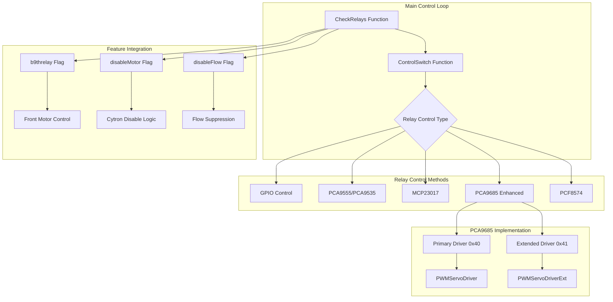
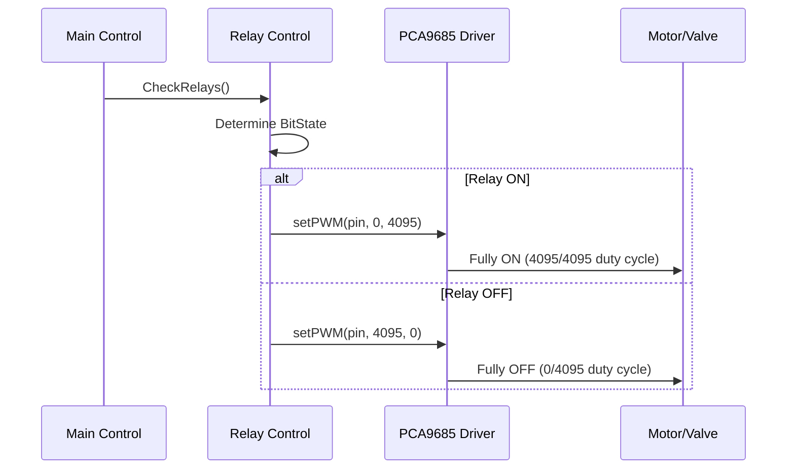
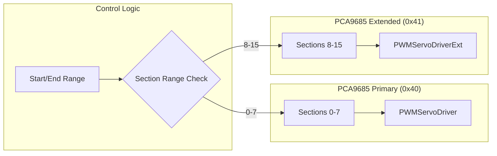
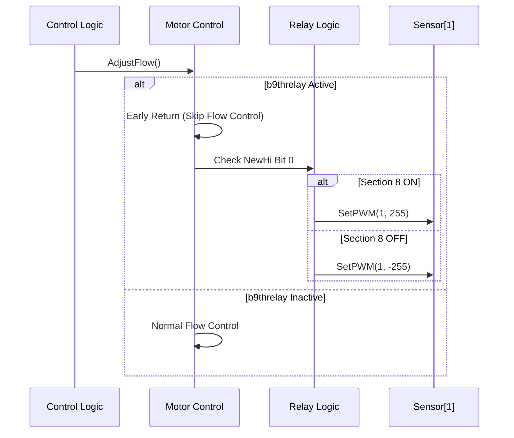
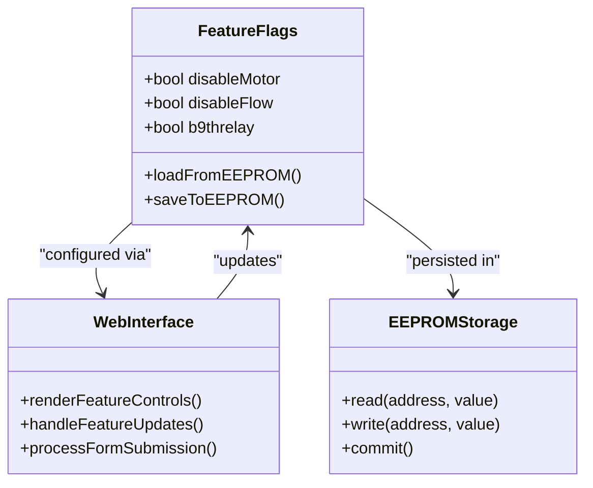
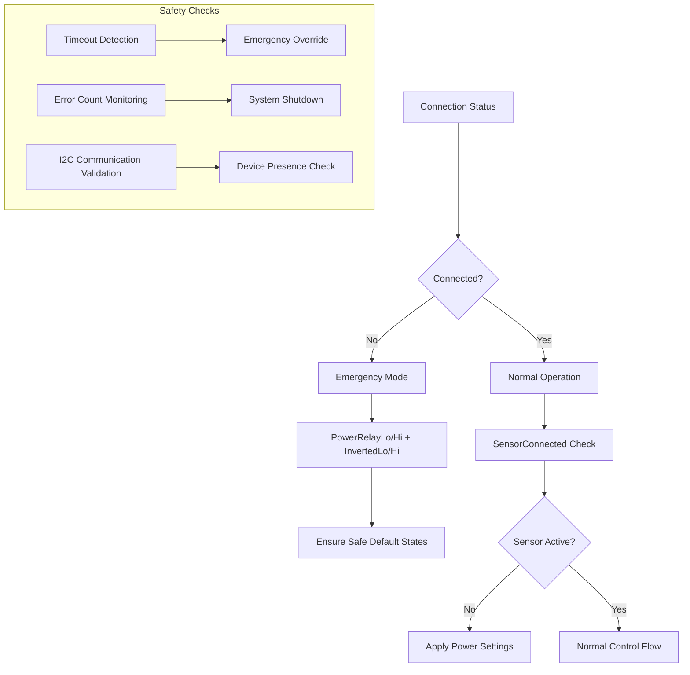

# Relay Control System Enhancements

<cite>
**Referenced Files in This Document**
- [Relays.ino](file://RC_ESP32/Relays.ino)
- [Begin.ino](file://RC_ESP32/Begin.ino)
- [PCA95x5_RC.h](file://RC_ESP32/PCA95x5_RC.h)
- [Motor.ino](file://RC_ESP32/Motor.ino)
- [RC_ESP32.ino](file://RC_ESP32/RC_ESP32.ino)
- [PgSwitches.ino](file://RC_ESP32/PgSwitches.ino)
- [FORK_CHANGES.md](file://FORK_CHANGES.md)
</cite>

## Table of Contents
1. [Introduction](#introduction)
2. [System Architecture Overview](#system-architecture-overview)
3. [PCA9685 PWM Value Improvements](#pca9685-pwm-value-improvements)
4. [Extended PCA9685 Support (16 Sections)](#extended-pca9685-support-16-sections)
5. [Cytron Motor Disable Functionality](#cytron-motor-disable-functionality)
6. [b9threlay Integration for Front Motor Control](#b9threlay-integration-for-front-motor-control)
7. [Feature Flags and Configuration](#feature-flags-and-configuration)
8. [Hardware Requirements](#hardware-requirements)
9. [Safety Mechanisms](#safety-mechanisms)
10. [Integration Examples](#integration-examples)
11. [Troubleshooting Guide](#troubleshooting-guide)
12. [Conclusion](#conclusion)

## Introduction

This document details the comprehensive relay control system enhancements implemented in the AgOpenGPS RC module firmware. The improvements focus on four key areas: precise PCA9685 PWM value control for reliable on/off states, extended support for 16-section relay control via secondary PCA9685 address, Cytron motor disable functionality through relay logic, and b9threlay integration for front motor control. These enhancements provide improved reliability, expanded functionality, and better integration with various agricultural equipment configurations.

The system now supports multiple relay control methods including direct GPIO control, PCA9555/PCA9535 I/O expanders, MCP23017 expanders, PCF8574 expanders, and the enhanced PCA9685-based relay control with extended addressing capabilities.

## System Architecture Overview

The relay control system operates through a hierarchical architecture that manages different relay control methods and integrates with the broader rate control system.



**Diagram sources**
- [Relays.ino:11-69](file://RC_ESP32/Relays.ino#L11-L69)
- [Relays.ino:71-273](file://RC_ESP32/Relays.ino#L71-L273)
- [Begin.ino:447-497](file://RC_ESP32/Begin.ino#L447-L497)

## PCA9685 PWM Value Improvements

### Problem Statement
Previous implementations used incorrect PWM values that could result in partial activation or inconsistent relay states, particularly affecting the reliability of on/off control for agricultural valves and motors.

### Solution Implemented
The PCA9685 implementation was enhanced with precise PWM value control using the full 12-bit resolution capability:



**Diagram sources**
- [Relays.ino:213-231](file://RC_ESP32/Relays.ino#L213-L231)
- [Relays.ino:224-230](file://RC_ESP32/Relays.ino#L224-L230)

### Technical Implementation Details

The enhanced PCA9685 control uses the full 12-bit PWM resolution (0-4095) instead of the previous 15-bit implementation:

- **ON State**: `setPWM(pin, 0, 4095)` - Maximum duty cycle for reliable activation
- **OFF State**: `setPWM(pin, 4095, 0)` - Zero duty cycle for complete deactivation
- **Frequency**: 200 Hz PWM frequency optimized for relay switching

This implementation ensures consistent relay operation regardless of load conditions or voltage variations.

**Section sources**
- [Relays.ino:192-260](file://RC_ESP32/Relays.ino#L192-L260)
- [Begin.ino:466-468](file://RC_ESP32/Begin.ino#L466-L468)

## Extended PCA9685 Support (16 Sections)

### Implementation Overview
The system now supports dual PCA9685 drivers to control up to 16 relay sections:

- **Primary Driver**: Address 0x40 (default PCA9685Address)
- **Extended Driver**: Address 0x41 (PCAExtaddress) for additional 8 relays
- **Total Capacity**: 16 sections (8 per driver)

### Hardware Configuration


**Diagram sources**
- [Begin.ino:474-495](file://RC_ESP32/Begin.ino#L474-L495)
- [Relays.ino:194-259](file://RC_ESP32/Relays.ino#L194-L259)

### Software Implementation
The extended support maintains compatibility with existing single-driver configurations while adding support for the secondary driver:

- **Automatic Detection**: Both drivers are detected independently
- **Range Management**: Control logic automatically routes sections to appropriate drivers
- **Unified Interface**: Same control API works for both single and dual driver configurations

**Section sources**
- [Begin.ino:474-495](file://RC_ESP32/Begin.ino#L474-L495)
- [Relays.ino:194-259](file://RC_ESP32/Relays.ino#L194-L259)

## Cytron Motor Disable Functionality

### Purpose
The Cytron motor disable feature allows external motor control through relay logic, enabling safe operation when the 8th relay section is used for motor disable functionality.

### Implementation Details
```mermaid
flowchart TD
A[Motor Control Request] --> B{disableMotor Flag}
B --> |Active| C[Check Sensor[1] Type]
B --> |Inactive| D[Normal Operation]
C --> |Motor Control| E[Apply Relay Logic]
E --> F[Digital Write GPIO13]
F --> G{BitRead(NewLo, 7)}
G --> |ON| H[GPIO13 HIGH]
G --> |OFF| I[GPIO13 LOW]
H --> J[Motor Enabled]
I --> K[Motor Disabled]
```

**Diagram sources**
- [Relays.ino:50](file://RC_ESP32/Relays.ino#L50)
- [RC_ESP32.ino:218-220](file://RC_ESP32/RC_ESP32.ino#L218-L220)

### Hardware Requirements
- **GPIO13**: Dedicated pin for motor disable control
- **External Circuitry**: Required to interface with Cytron motor driver
- **Pull-up/Pull-down Resistors**: As specified in motor driver requirements

**Section sources**
- [Relays.ino:50](file://RC_ESP32/Relays.ino#L50)
- [RC_ESP32.ino:218-220](file://RC_ESP32/RC_ESP32.ino#L218-L220)

## b9threlay Integration for Front Motor Control

### System Enhancement
The b9threlay feature enables the use of the 9th relay (section 8) to control the front motor channel (Sensor[1]) instead of traditional flow control.

### Implementation Logic


**Diagram sources**
- [Motor.ino:6](file://RC_ESP32/Motor.ino#L6)
- [Relays.ino:284-286](file://RC_ESP32/Relays.ino#L284-L286)

### Technical Specifications
- **Front Motor Channel**: Sensor[1] (Motor channel 1)
- **Control Method**: Direct PWM control via relay logic
- **PWM Values**: 
  - ON: 255 (forward rotation)
  - OFF: -255 (reverse rotation or brake)
- **Section Mapping**: Uses NewHi bit 0 for control

**Section sources**
- [Motor.ino:6](file://RC_ESP32/Motor.ino#L6)
- [Relays.ino:284-286](file://RC_ESP32/Relays.ino#L284-L286)

## Feature Flags and Configuration

### EEPROM-Persisted Features
The system includes three configurable feature flags stored in EEPROM for persistent configuration:

| Feature Flag | EEPROM Location | Description | Default Value |
|--------------|----------------|-------------|---------------|
| `disableMotor` | EEPROM Address 10 | Enable Cytron motor disable via relay | false |
| `disableFlow` | EEPROM Address 11 | Suppress flow when section 8 active | false |
| `b9threlay` | EEPROM Address 12 | Use 9th relay for front motor control | false |

### Web Interface Integration
The features are managed through the web interface with dedicated checkboxes on the Information page:



**Diagram sources**
- [RC_ESP32.ino:217-220](file://RC_ESP32/RC_ESP32.ino#L217-L220)
- [PGInfo.ino:144-173](file://OLD CODE/RC_ESP32/PGInfo.ino#L144-L173)

### Configuration Guidelines

#### Basic Setup (Single Driver)
- **OnboardRelayControl**: Set to 5 (PCA9685)
- **RemoteRelayControl**: Set to 0 (disabled)
- **SensorCount**: 1-2 motors/sensors
- **Is3Wire**: Enable for 3-wire valve control

#### Advanced Setup (Dual Driver)
- **OnboardRelayControl**: Set to 5 (PCA9685)
- **RemoteRelayControl**: Set to 5 (PCA9685)
- **SensorCount**: 1-2 motors/sensors
- **Section Requirements**: 9+ sections needed for b9threlay

**Section sources**
- [Begin.ino:625-634](file://RC_ESP32/Begin.ino#L625-L634)
- [RC_ESP32.ino:269-274](file://RC_ESP32/RC_ESP32.ino#L269-L274)

## Hardware Requirements

### PCA9685 Driver Specifications
- **Primary Address**: 0x40 (default)
- **Extended Address**: 0x41 (secondary driver)
- **I2C Bus Speed**: 400 kHz
- **PWM Frequency**: 200 Hz
- **Resolution**: 12-bit (0-4095)
- **Current Limit**: 2.4A per channel, 14.4A total

### Relay Configuration Options

| Control Method | Maximum Relays | I2C Address | GPIO Pins Required |
|----------------|----------------|-------------|-------------------|
| GPIO Direct | 16 | None | 16 Digital Outputs |
| PCA9555/PCA9535 | 16 | 0x20 | None |
| MCP23017 | 16 | 0x20/0x21 | None |
| PCA9685 | 16 | 0x40/0x41 | None |
| PCF8574 | 8 | 0x20 | None |

### Safety Hardware Requirements
- **Flyback Diodes**: Across relay coils
- **Snubber Circuits**: For inductive loads
- **Fuse Protection**: Individual relay branch protection
- **Reverse Voltage Protection**: Across motor terminals
- **Current Sensing**: Optional for motor protection

## Safety Mechanisms

### Emergency Override System
The system implements multiple safety mechanisms for reliable operation:



**Diagram sources**
- [Relays.ino:46-57](file://RC_ESP32/Relays.ino#L46-L57)

### Timeout and Error Handling
- **Connection Timeout**: 30-second timeout for remote control
- **I2C Error Detection**: Automatic device presence verification
- **Emergency Override**: Safe default states when communication fails
- **Error Count Tracking**: Prevents system degradation from persistent errors

### Thermal and Electrical Protection
- **Current Monitoring**: Optional current sensing for overload detection
- **Temperature Monitoring**: Internal ESP32 temperature monitoring
- **Voltage Regulation**: Stable 5V supply for I2C devices
- **ESD Protection**: TVS diodes across I2C lines

**Section sources**
- [Relays.ino:27-45](file://RC_ESP32/Relays.ino#L27-L45)
- [Begin.ino:54-55](file://RC_ESP32/Begin.ino#L54-L55)

## Integration Examples

### Example 1: Dual PCA9685 Configuration
```cpp
// Configuration for 16-section system
MDL.OnboardRelayControl = 5;  // PCA9685 primary
MDL.RemoteRelayControl = 5;  // PCA9685 extended
MDL.SensorCount = 2;         // Front and rear motors
MDL.Is3Wire = true;          // 3-wire valve control
b9threlay = true;           // Enable front motor control
```

### Example 2: Cytron Motor Integration
```cpp
// Configure for motor disable functionality
disableMotor = true;        // Enable motor disable
Sensor[1].ControlType = 2;  // Motor control type
digitalWrite(13, bitRead(NewLo, 7)); // Manual override
```

### Example 3: Flow Suppression Setup
```cpp
// Suppress flow when section 8 is active
disableFlow = true;         // Enable flow suppression
if (disableFlow && bitRead(RelayLo, 8)) {
    Sensor[ID].UPM = 0;     // Zero flow rate
}
```

## Troubleshooting Guide

### Common Issues and Solutions

| Issue | Symptoms | Solution |
|-------|----------|----------|
| Relays Not Responding | No change in relay states | Check I2C address configuration, verify PCA9685 detection |
| Partial Relay Activation | Relays click but don't stay engaged | Verify PWM values, check power supply voltage |
| Section 9 Control Not Working | b9threlay has no effect | Confirm b9threlay flag is enabled, verify Sensor[1] configuration |
| Motor Not Disabling | disableMotor has no effect | Check GPIO13 wiring, verify external circuitry |
| Flow Suppression Not Working | disableFlow has no effect | Verify disableFlow flag, check section 8 relay state |

### Diagnostic Commands
- **I2C Device Scan**: Use serial output to verify device detection
- **PWM Verification**: Monitor relay coil voltage with multimeter
- **Timing Analysis**: Use oscilloscope to verify PWM waveform integrity
- **Communication Logs**: Enable serial debugging for I2C transaction verification

### Performance Monitoring
- **Response Time**: Measure relay switching latency
- **Power Consumption**: Monitor current draw under load
- **Temperature**: Track component temperatures during operation
- **Reliability**: Monitor error rates and system uptime

**Section sources**
- [Begin.ino:336-339](file://RC_ESP32/Begin.ino#L336-L339)
- [FORK_CHANGES.md:210-221](file://FORK_CHANGES.md#L210-L221)

## Conclusion

The relay control system enhancements represent a significant advancement in agricultural control system reliability and flexibility. The improvements to PCA9685 PWM control ensure consistent relay operation, while the extended 16-section support provides scalability for larger agricultural operations. The Cytron motor disable functionality and b9threlay integration enable sophisticated motor control scenarios, particularly beneficial for front motor applications.

Key benefits include:
- **Enhanced Reliability**: Precise PWM control eliminates partial activation issues
- **Scalability**: Support for up to 16 relay sections with dual driver capability
- **Flexibility**: Multiple control methods accommodate various hardware configurations
- **Safety**: Comprehensive error handling and emergency override systems
- **Integration**: Seamless integration with existing AgOpenGPS infrastructure

These enhancements position the system for future expansion while maintaining backward compatibility with existing installations.