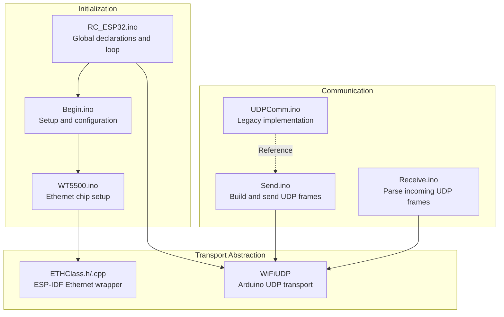
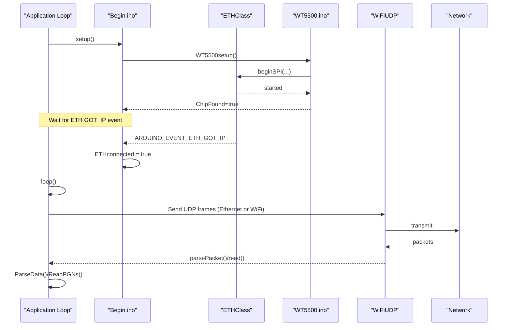
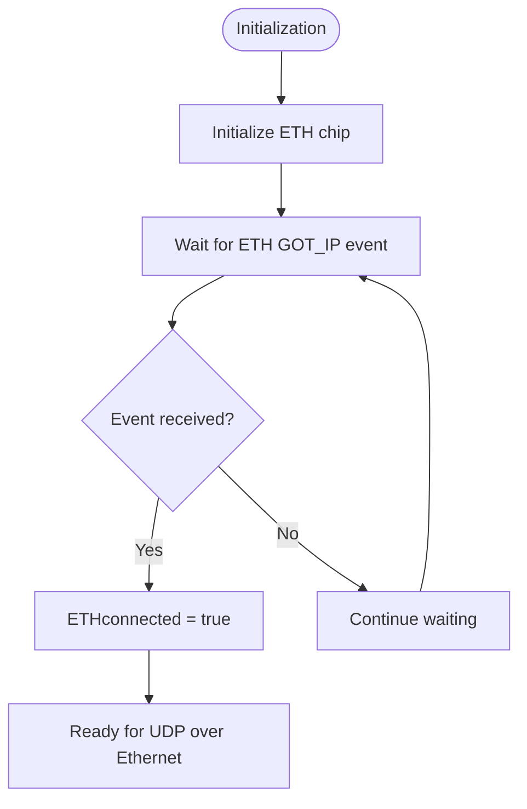
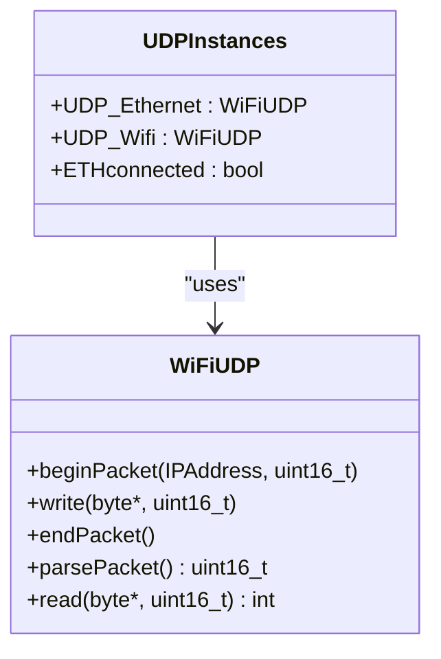
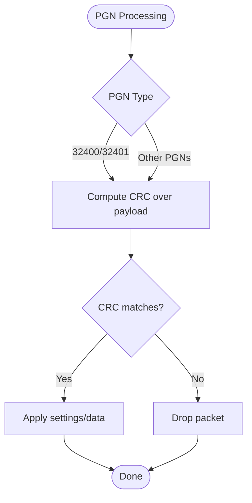
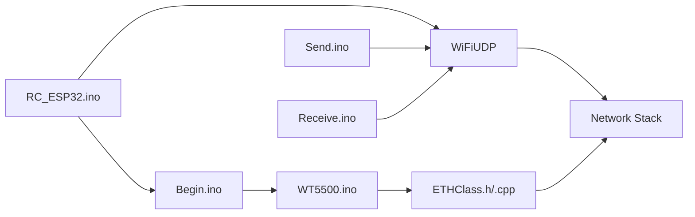

# UDP Communication Layer Updates

<cite>
**Referenced Files in This Document**
- [RC_ESP32.ino](file://RC_ESP32/RC_ESP32.ino)
- [Begin.ino](file://RC_ESP32/Begin.ino)
- [Send.ino](file://RC_ESP32/Send.ino)
- [Receive.ino](file://RC_ESP32/Receive.ino)
- [ETHClass.h](file://RC_ESP32/ETHClass.h)
- [ETHClass.cpp](file://RC_ESP32/ETHClass.cpp)
- [WT5500.ino](file://RC_ESP32/WT5500.ino)
- [UDPComm.ino](file://OLD CODE/RC_ESP32/UDPComm.ino)
</cite>

## Table of Contents
1. [Introduction](#introduction)
2. [Project Structure](#project-structure)
3. [Core Components](#core-components)
4. [Architecture Overview](#architecture-overview)
5. [Detailed Component Analysis](#detailed-component-analysis)
6. [Dependency Analysis](#dependency-analysis)
7. [Performance Considerations](#performance-considerations)
8. [Troubleshooting Guide](#troubleshooting-guide)
9. [Conclusion](#conclusion)

## Introduction
This document details the UDP communication layer adaptations made for ESP32-S3 compatibility. It focuses on three key changes:
- Replacement of Ethernet.linkStatus() polling with an event-driven ETHconnected boolean flag
- PGN CRC validation behavior differences between old and new implementations
- Unified WiFiUDP class usage for both Ethernet and WiFi transports

The document explains the technical implications of these changes, the benefits of the event-driven architecture, and provides debugging guidance for CRC validation modifications. It also includes troubleshooting steps for network connectivity issues.

## Project Structure
The UDP communication layer spans several modules:
- Initialization and global state management
- Ethernet/WiFi transport abstraction
- UDP send/receive logic
- Event handling for Ethernet link state

**Diagram sources**
- [RC_ESP32.ino:150-165](file://RC_ESP32/RC_ESP32.ino#L150-L165)
- [Begin.ino:86-116](file://RC_ESP32/Begin.ino#L86-L116)
- [WT5500.ino:9-17](file://RC_ESP32/WT5500.ino#L9-L17)
- [ETHClass.h:60-113](file://RC_ESP32/ETHClass.h#L60-L113)
- [Send.ino:1-195](file://RC_ESP32/Send.ino#L1-L195)
- [Receive.ino:1-346](file://RC_ESP32/Receive.ino#L1-L346)
- [UDPComm.ino:1-503](file://OLD CODE/RC_ESP32/UDPComm.ino#L1-L503)

**Section sources**
- [RC_ESP32.ino:150-165](file://RC_ESP32/RC_ESP32.ino#L150-L165)
- [Begin.ino:86-116](file://RC_ESP32/Begin.ino#L86-L116)
- [WT5500.ino:9-17](file://RC_ESP32/WT5500.ino#L9-L17)
- [ETHClass.h:60-113](file://RC_ESP32/ETHClass.h#L60-L113)
- [Send.ino:1-195](file://RC_ESP32/Send.ino#L1-L195)
- [Receive.ino:1-346](file://RC_ESP32/Receive.ino#L1-L346)
- [UDPComm.ino:1-503](file://OLD CODE/RC_ESP32/UDPComm.ino#L1-L503)

## Core Components
- Global UDP instances and flags:
  - WiFiUDP instances for Ethernet and WiFi transports
  - ETHconnected boolean flag managed by event handlers
  - Destination IP/port constants for broadcast-like destinations
- Transport abstraction:
  - ETHClass wraps ESP-IDF Ethernet APIs and exposes link status
- Send logic:
  - Builds PGN 32400 (rate info) and 32401 (module info) frames
  - Uses ETHconnected for Ethernet availability
  - Falls back to WiFi when Ethernet is unavailable
- Receive logic:
  - Parses incoming UDP frames and validates CRC per PGN
  - Routes messages to appropriate handlers

Key implementation references:
- UDP instances and flags: [RC_ESP32.ino:150-165](file://RC_ESP32/RC_ESP32.ino#L150-L165)
- ETHClass interface: [ETHClass.h:60-113](file://RC_ESP32/ETHClass.h#L60-L113)
- Send logic: [Send.ino:1-195](file://RC_ESP32/Send.ino#L1-L195)
- Receive logic: [Receive.ino:1-346](file://RC_ESP32/Receive.ino#L1-L346)

**Section sources**
- [RC_ESP32.ino:150-165](file://RC_ESP32/RC_ESP32.ino#L150-L165)
- [ETHClass.h:60-113](file://RC_ESP32/ETHClass.h#L60-L113)
- [Send.ino:1-195](file://RC_ESP32/Send.ino#L1-L195)
- [Receive.ino:1-346](file://RC_ESP32/Receive.ino#L1-L346)

## Architecture Overview
The UDP communication architecture integrates event-driven Ethernet detection with unified UDP transport:

**Diagram sources**
- [Begin.ino:86-116](file://RC_ESP32/Begin.ino#L86-L116)
- [WT5500.ino:20-78](file://RC_ESP32/WT5500.ino#L20-L78)
- [RC_ESP32.ino:150-165](file://RC_ESP32/RC_ESP32.ino#L150-L165)
- [Send.ino:1-195](file://RC_ESP32/Send.ino#L1-L195)
- [Receive.ino:1-346](file://RC_ESP32/Receive.ino#L1-L346)

## Detailed Component Analysis

### Event-Driven Ethernet Detection
The legacy implementation polled Ethernet.linkStatus() in a loop. The updated implementation uses ESP-IDF event callbacks to set ETHconnected when the Ethernet interface obtains an IP address.

Key changes:
- Polling replaced by event-driven flag
- Initialization waits for ARDUINO_EVENT_ETH_GOT_IP before configuring static IP
- ETHconnected flag controls UDP_Ethernet usage

**Diagram sources**
- [Begin.ino:95-110](file://RC_ESP32/Begin.ino#L95-L110)
- [WT5500.ino:20-78](file://RC_ESP32/WT5500.ino#L20-L78)

**Section sources**
- [Begin.ino:95-110](file://RC_ESP32/Begin.ino#L95-L110)
- [WT5500.ino:20-78](file://RC_ESP32/WT5500.ino#L20-L78)

### Unified WiFiUDP Transport Usage
Both Ethernet and WiFi transports use the same WiFiUDP class. The application selects the appropriate instance based on ETHconnected and availability.

Implementation highlights:
- UDP_Ethernet and UDP_Wifi instances declared globally
- Send logic checks ETHconnected and Ethernet.linkStatus() before sending over Ethernet
- Receive logic parses both UDP_Ethernet and UDP_Wifi packets

**Diagram sources**
- [RC_ESP32.ino:150-165](file://RC_ESP32/RC_ESP32.ino#L150-L165)
- [Send.ino:72-91](file://RC_ESP32/Send.ino#L72-L91)
- [Receive.ino:2-27](file://RC_ESP32/Receive.ino#L2-L27)

**Section sources**
- [RC_ESP32.ino:150-165](file://RC_ESP32/RC_ESP32.ino#L150-L165)
- [Send.ino:72-91](file://RC_ESP32/Send.ino#L72-L91)
- [Receive.ino:2-27](file://RC_ESP32/Receive.ino#L2-L27)

### PGN CRC Validation Behavior
CRC validation differs between the legacy and current implementations:

Legacy behavior (reference):
- CRC computed for PGN 32400 and 32401
- CRC validated in ParseData for multiple PGNs
- Specific PGN 32700 had CRC check disabled in code comments

Current behavior (reference):
- CRC computed for PGN 32400 and 32401
- CRC validated in ReadPGNs for multiple PGNs
- Specific PGN 32700 has CRC check conditionally disabled in code comments

**Diagram sources**
- [UDPComm.ino:205-466](file://OLD CODE/RC_ESP32/UDPComm.ino#L205-L466)
- [Receive.ino:29-343](file://RC_ESP32/Receive.ino#L29-L343)

**Section sources**
- [UDPComm.ino:205-466](file://OLD CODE/RC_ESP32/UDPComm.ino#L205-L466)
- [Receive.ino:29-343](file://RC_ESP32/Receive.ino#L29-L343)

### Technical Implications and Benefits
- Event-driven architecture reduces CPU overhead by eliminating polling loops
- Improved responsiveness to link state changes
- Simplified transport selection logic using a single boolean flag
- Consistent UDP API usage across Ethernet and WiFi paths

## Dependency Analysis
The UDP communication layer depends on:
- ESP-IDF Ethernet stack via ETHClass wrapper
- Arduino WiFiUDP transport for both Ethernet and WiFi
- Event system for asynchronous link state updates
- EEPROM-backed configuration for network parameters

**Diagram sources**
- [RC_ESP32.ino:12-26](file://RC_ESP32/RC_ESP32.ino#L12-L26)
- [Begin.ino:86-116](file://RC_ESP32/Begin.ino#L86-L116)
- [WT5500.ino:9-17](file://RC_ESP32/WT5500.ino#L9-L17)
- [ETHClass.h:24-27](file://RC_ESP32/ETHClass.h#L24-L27)
- [Send.ino:1-195](file://RC_ESP32/Send.ino#L1-L195)
- [Receive.ino:1-346](file://RC_ESP32/Receive.ino#L1-L346)

**Section sources**
- [RC_ESP32.ino:12-26](file://RC_ESP32/RC_ESP32.ino#L12-L26)
- [Begin.ino:86-116](file://RC_ESP32/Begin.ino#L86-L116)
- [WT5500.ino:9-17](file://RC_ESP32/WT5500.ino#L9-L17)
- [ETHClass.h:24-27](file://RC_ESP32/ETHClass.h#L24-L27)
- [Send.ino:1-195](file://RC_ESP32/Send.ino#L1-L195)
- [Receive.ino:1-346](file://RC_ESP32/Receive.ino#L1-L346)

## Performance Considerations
- Event-driven Ethernet detection eliminates continuous polling, reducing CPU usage
- Using a single WiFiUDP class instance for both transports simplifies memory usage
- CRC computation occurs only when PGN length conditions are met
- Static IP configuration after link-up avoids repeated DHCP attempts

## Troubleshooting Guide
Common network connectivity issues and resolutions:

### Ethernet Not Connecting
- Verify physical wiring and chip presence
- Check ETH GOT_IP event logs during startup
- Confirm static IP configuration after ETHconnected becomes true
- Ensure proper SPI pin assignments for WT5500

### WiFi Connectivity Problems
- Monitor WiFi station events and reconnection attempts
- Verify AP credentials and signal strength
- Check destination IP calculations for WiFi broadcast
- Review disconnect reasons and automatic retry logic

### UDP Communication Failures
- Validate PGN length checks before CRC processing
- Confirm ETHconnected flag reflects actual link state
- Check port numbers and destination IPs for both transports
- Inspect CRC computation and validation logic for malformed packets

**Section sources**
- [WT5500.ino:20-78](file://RC_ESP32/WT5500.ino#L20-L78)
- [Begin.ino:95-110](file://RC_ESP32/Begin.ino#L95-L110)
- [RC_ESP32.ino:226-258](file://RC_ESP32/RC_ESP32.ino#L226-L258)
- [Receive.ino:29-343](file://RC_ESP32/Receive.ino#L29-L343)

## Conclusion
The UDP communication layer updates for ESP32-S3 introduce significant improvements:
- Event-driven Ethernet detection replaces polling for better responsiveness and efficiency
- Unified WiFiUDP transport simplifies code and reduces resource usage
- CRC validation remains robust across PGN types, with configurable checks for specific frames

These changes enhance reliability and maintainability while preserving backward compatibility with existing PGN protocols. The event-driven model provides a solid foundation for future enhancements and debugging capabilities.