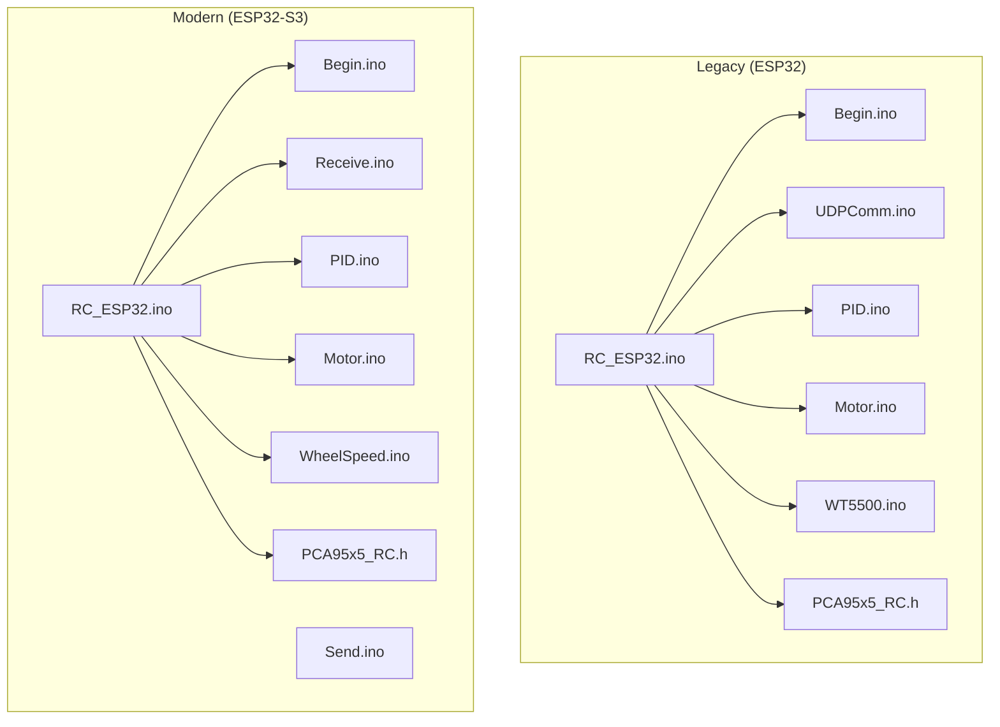
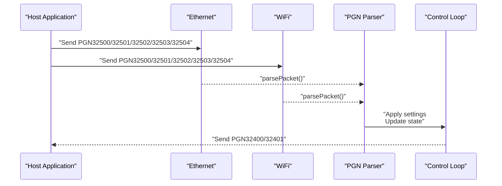
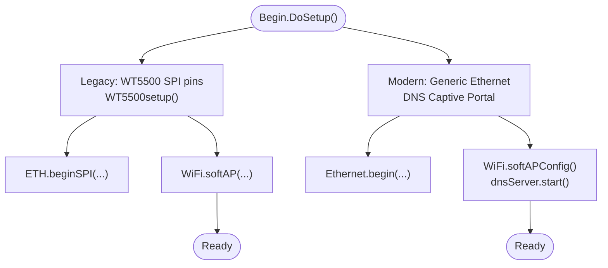
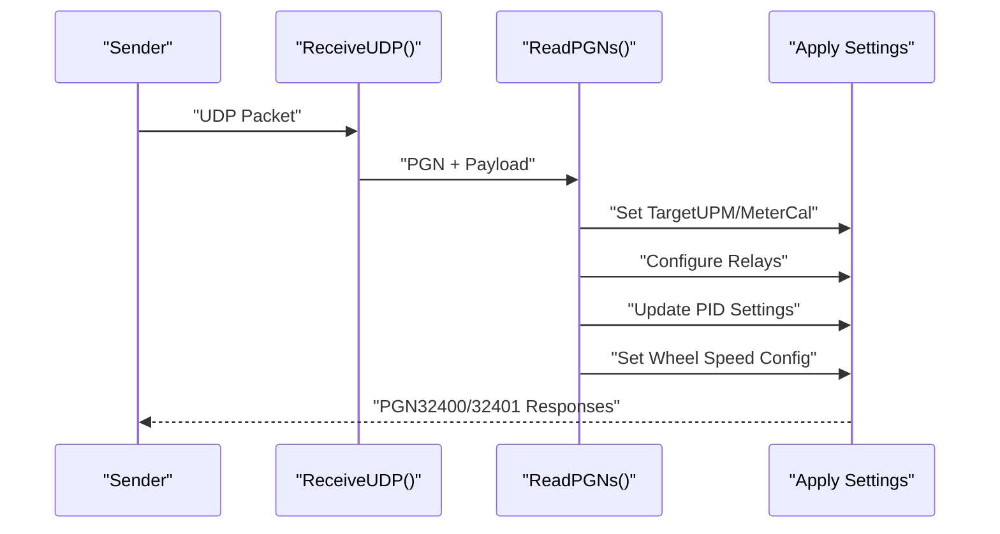
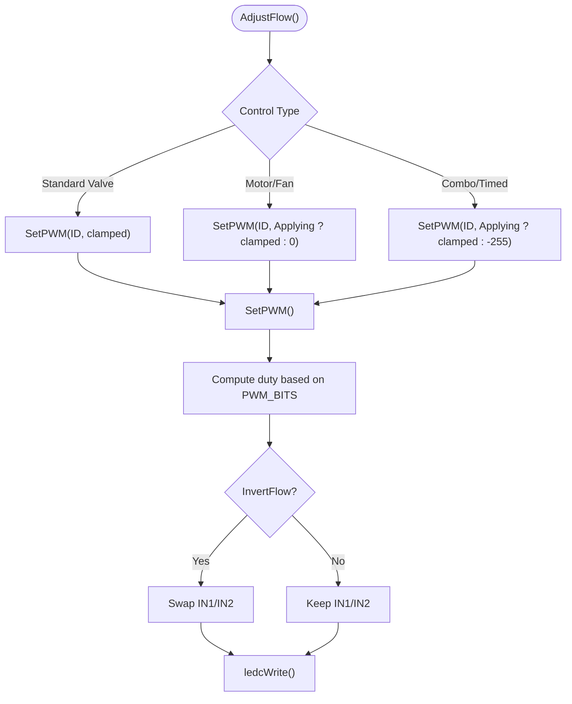
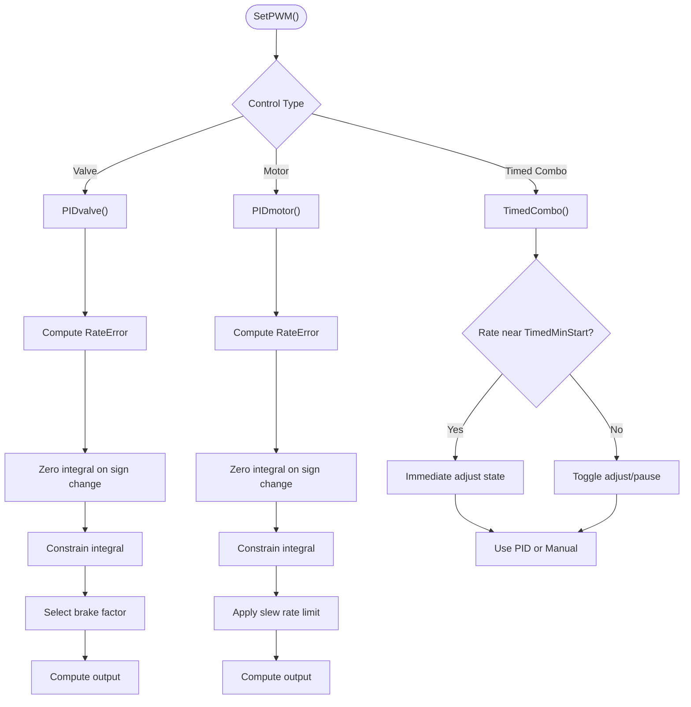
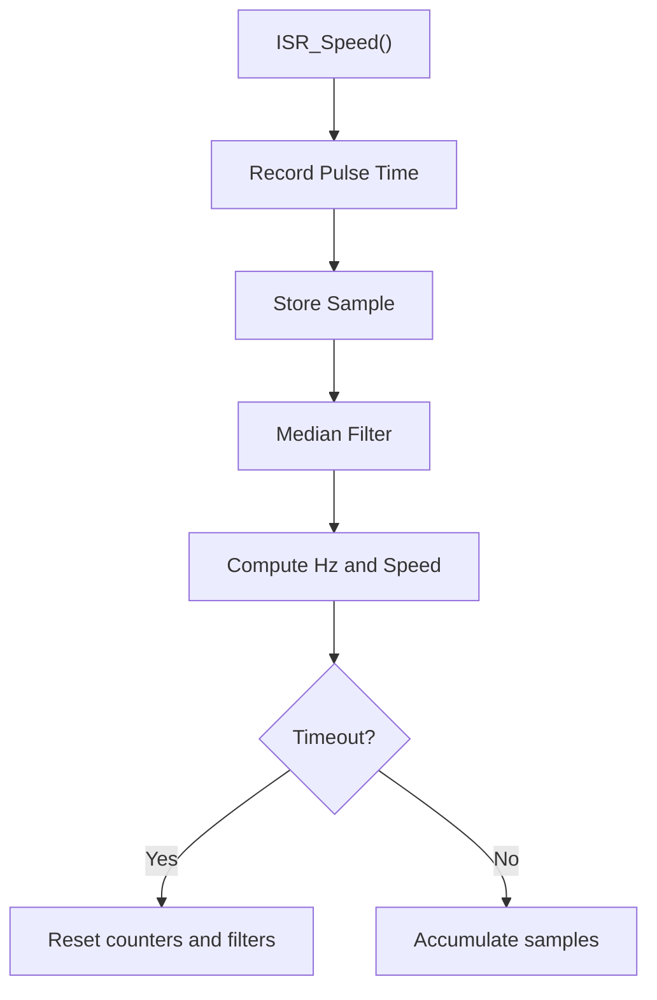
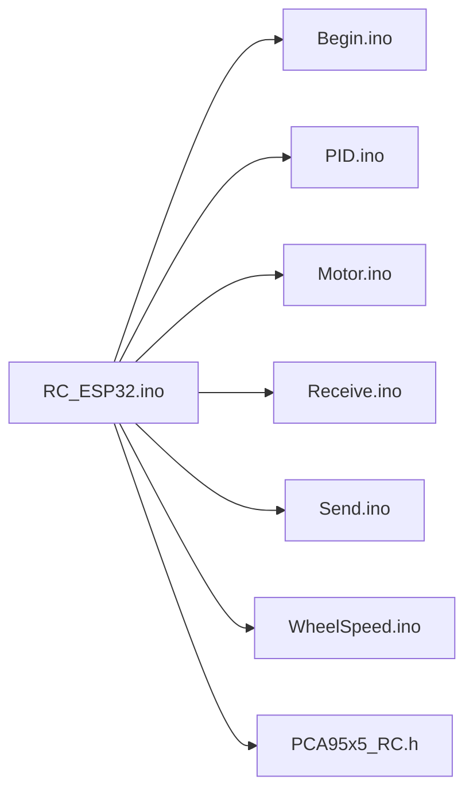

# Legacy Code Comparison

<cite>
**Referenced Files in This Document**
- [Begin.ino](file://OLD CODE/RC_ESP32/Begin.ino)
- [Begin.ino](file://RC_ESP32/Begin.ino)
- [RC_ESP32.ino](file://OLD CODE/RC_ESP32/RC_ESP32.ino)
- [RC_ESP32.ino](file://RC_ESP32/RC_ESP32.ino)
- [UDPComm.ino](file://OLD CODE/RC_ESP32/UDPComm.ino)
- [Receive.ino](file://RC_ESP32/Receive.ino)
- [Send.ino](file://RC_ESP32/Send.ino)
- [Motor.ino](file://OLD CODE/RC_ESP32/Motor.ino)
- [Motor.ino](file://RC_ESP32/Motor.ino)
- [PID.ino](file://OLD CODE/RC_ESP32/PID.ino)
- [PID.ino](file://RC_ESP32/PID.ino)
- [WheelSpeed.ino](file://RC_ESP32/WheelSpeed.ino)
- [WT5500.ino](file://OLD CODE/RC_ESP32/WT5500.ino)
- [PCA95x5_RC.h](file://RC_ESP32/PCA95x5_RC.h)
- [PCA95x5_RC.h](file://OLD CODE/RC_ESP32/PCA95x5_RC.h)
</cite>

## Table of Contents
1. [Introduction](#introduction)
2. [Project Structure](#project-structure)
3. [Core Components](#core-components)
4. [Architecture Overview](#architecture-overview)
5. [Detailed Component Analysis](#detailed-component-analysis)
6. [Dependency Analysis](#dependency-analysis)
7. [Performance Considerations](#performance-considerations)
8. [Troubleshooting Guide](#troubleshooting-guide)
9. [Conclusion](#conclusion)
10. [Appendices](#appendices)

## Introduction
This document presents a side-by-side comparison between the legacy ESP32 implementation and the current ESP32-S3 version of the Rate Control module. It focuses on code structure differences, function signatures, variable declarations, and control flow changes across key modules such as initialization, communication protocols, motor control, and PID regulation. It also explains why certain legacy patterns were retained versus rewritten, documents deprecated features and new alternatives, and provides migration strategies and backward compatibility guidance.

## Project Structure
The repository organizes the legacy and modern implementations under separate directories:
- OLD CODE/RC_ESP32: Original ESP32 implementation with older libraries and APIs
- RC_ESP32: Modern ESP32-S3 implementation with updated libraries and improved control logic

**Diagram sources**
- [Begin.ino](file://OLD CODE/RC_ESP32/Begin.ino)
- [RC_ESP32.ino](file://OLD CODE/RC_ESP32/RC_ESP32.ino)
- [UDPComm.ino](file://OLD CODE/RC_ESP32/UDPComm.ino)
- [PID.ino](file://OLD CODE/RC_ESP32/PID.ino)
- [Motor.ino](file://OLD CODE/RC_ESP32/Motor.ino)
- [WT5500.ino](file://OLD CODE/RC_ESP32/WT5500.ino)
- [PCA95x5_RC.h](file://OLD CODE/RC_ESP32/PCA95x5_RC.h)
- [Begin.ino](file://RC_ESP32/Begin.ino)
- [RC_ESP32.ino](file://RC_ESP32/RC_ESP32.ino)
- [Receive.ino](file://RC_ESP32/Receive.ino)
- [Send.ino](file://RC_ESP32/Send.ino)
- [PID.ino](file://RC_ESP32/PID.ino)
- [Motor.ino](file://RC_ESP32/Motor.ino)
- [WheelSpeed.ino](file://RC_ESP32/WheelSpeed.ino)
- [PCA95x5_RC.h](file://RC_ESP32/PCA95x5_RC.h)

**Section sources**
- [Begin.ino](file://OLD CODE/RC_ESP32/Begin.ino)
- [Begin.ino](file://RC_ESP32/Begin.ino)
- [RC_ESP32.ino](file://OLD CODE/RC_ESP32/RC_ESP32.ino)
- [RC_ESP32.ino](file://RC_ESP32/RC_ESP32.ino)

## Core Components
This section highlights the primary functional areas and their differences between the legacy and modern implementations.

- Initialization and Hardware Setup
  - Legacy initializes WT5500 via a dedicated setup routine and uses older Ethernet/Wi-Fi APIs.
  - Modern implementation uses the generic Ethernet library and integrates DNS handling for captive portal support.

- Communication Protocols
  - Legacy sends two distinct PGNs per cycle and parses incoming PGNs in a single routine.
  - Modern consolidates parsing into a unified handler and adds wheel speed sensor configuration PGN.

- Control Logic
  - Legacy uses a fixed PID sampling time and simplified control types.
  - Modern introduces configurable PID timing, advanced control types, and improved anti-windup handling.

- Motor Control
  - Legacy writes directly to LEDC channels with direction inversion logic embedded.
  - Modern centralizes PWM writing with platform-specific logic and optional dithering for lower bit depths.

**Section sources**
- [Begin.ino](file://OLD CODE/RC_ESP32/Begin.ino)
- [Begin.ino](file://RC_ESP32/Begin.ino)
- [RC_ESP32.ino](file://OLD CODE/RC_ESP32/RC_ESP32.ino)
- [RC_ESP32.ino](file://RC_ESP32/RC_ESP32.ino)
- [UDPComm.ino](file://OLD CODE/RC_ESP32/UDPComm.ino)
- [Receive.ino](file://RC_ESP32/Receive.ino)
- [Send.ino](file://RC_ESP32/Send.ino)
- [PID.ino](file://OLD CODE/RC_ESP32/PID.ino)
- [PID.ino](file://RC_ESP32/PID.ino)
- [Motor.ino](file://OLD CODE/RC_ESP32/Motor.ino)
- [Motor.ino](file://RC_ESP32/Motor.ino)

## Architecture Overview
The modern architecture improves modularity and robustness by separating concerns across files and adopting a unified packet handler.

**Diagram sources**
- [RC_ESP32.ino](file://RC_ESP32/RC_ESP32.ino)
- [Receive.ino](file://RC_ESP32/Receive.ino)
- [Send.ino](file://RC_ESP32/Send.ino)

## Detailed Component Analysis

### Initialization and Hardware Setup
- Legacy
  - Explicit WT5500 SPI pin definitions and a dedicated setup routine configure the Ethernet chip and handle link detection.
  - Uses older WiFi event handlers and a custom AP naming scheme.
- Modern
  - Uses generic Ethernet library initialization and integrates a DNSServer for captive portal behavior.
  - Adds support for work pin configuration, pressure pin, and wheel speed sensor with calibration.

**Diagram sources**
- [Begin.ino](file://OLD CODE/RC_ESP32/Begin.ino)
- [WT5500.ino](file://OLD CODE/RC_ESP32/WT5500.ino)
- [Begin.ino](file://RC_ESP32/Begin.ino)

**Section sources**
- [Begin.ino](file://OLD CODE/RC_ESP32/Begin.ino)
- [WT5500.ino](file://OLD CODE/RC_ESP32/WT5500.ino)
- [Begin.ino](file://RC_ESP32/Begin.ino)

### Communication Protocols
- Legacy
  - Sends PGN32400 (rate info) and PGN32401 (module info) separately.
  - Parses incoming PGNs in a single routine with multiple case branches.
- Modern
  - Consolidates parsing into a unified handler with clearer separation of concerns.
  - Adds PGN32504 for wheel speed sensor configuration and updates status reporting.

**Diagram sources**
- [UDPComm.ino](file://OLD CODE/RC_ESP32/UDPComm.ino)
- [Receive.ino](file://RC_ESP32/Receive.ino)
- [Send.ino](file://RC_ESP32/Send.ino)

**Section sources**
- [UDPComm.ino](file://OLD CODE/RC_ESP32/UDPComm.ino)
- [Receive.ino](file://RC_ESP32/Receive.ino)
- [Send.ino](file://RC_ESP32/Send.ino)

### Motor Control and PWM Logic
- Legacy
  - Direct LEDC writes with explicit direction handling based on configuration flags.
  - Uses fixed PWM channel indices for IN1/IN2 pins.
- Modern
  - Centralized PWM writer with platform-aware duty calculation and optional dithering.
  - Supports invertible flow direction and configurable PWM resolution/bits.

**Diagram sources**
- [Motor.ino](file://OLD CODE/RC_ESP32/Motor.ino)
- [Motor.ino](file://RC_ESP32/Motor.ino)

**Section sources**
- [Motor.ino](file://OLD CODE/RC_ESP32/Motor.ino)
- [Motor.ino](file://RC_ESP32/Motor.ino)

### PID Control Logic
- Legacy
  - Fixed PID sampling time and simplified brake/deadband logic.
  - Separate PID functions for valves and motors with basic integral limiting.
- Modern
  - Configurable PID timing and advanced anti-windup with directional error tracking.
  - Improved slew-rate limiting and dynamic brake factor selection.

**Diagram sources**
- [PID.ino](file://OLD CODE/RC_ESP32/PID.ino)
- [PID.ino](file://RC_ESP32/PID.ino)

**Section sources**
- [PID.ino](file://OLD CODE/RC_ESP32/PID.ino)
- [PID.ino](file://RC_ESP32/PID.ino)

### Wheel Speed Sensor
- Modern implementation adds dedicated interrupt handling and median filtering for accurate Hz computation and speed derivation.

**Diagram sources**
- [WheelSpeed.ino](file://RC_ESP32/WheelSpeed.ino)

**Section sources**
- [WheelSpeed.ino](file://RC_ESP32/WheelSpeed.ino)

### I/O Expanders and PCA95x5
- Both implementations use a shared PCA95x5 interface header for I2C expanders. The modern version retains the same API surface for compatibility.

**Section sources**
- [PCA95x5_RC.h](file://RC_ESP32/PCA95x5_RC.h)
- [PCA95x5_RC.h](file://OLD CODE/RC_ESP32/PCA95x5_RC.h)

## Dependency Analysis
The modern implementation reduces coupling by separating packet reception, parsing, and response generation into distinct modules.

**Diagram sources**
- [RC_ESP32.ino](file://RC_ESP32/RC_ESP32.ino)
- [Begin.ino](file://RC_ESP32/Begin.ino)
- [PID.ino](file://RC_ESP32/PID.ino)
- [Motor.ino](file://RC_ESP32/Motor.ino)
- [Receive.ino](file://RC_ESP32/Receive.ino)
- [Send.ino](file://RC_ESP32/Send.ino)
- [WheelSpeed.ino](file://RC_ESP32/WheelSpeed.ino)
- [PCA95x5_RC.h](file://RC_ESP32/PCA95x5_RC.h)

**Section sources**
- [RC_ESP32.ino](file://RC_ESP32/RC_ESP32.ino)
- [Begin.ino](file://RC_ESP32/Begin.ino)
- [PID.ino](file://RC_ESP32/PID.ino)
- [Motor.ino](file://RC_ESP32/Motor.ino)
- [Receive.ino](file://RC_ESP32/Receive.ino)
- [Send.ino](file://RC_ESP32/Send.ino)
- [WheelSpeed.ino](file://RC_ESP32/WheelSpeed.ino)
- [PCA95x5_RC.h](file://RC_ESP32/PCA95x5_RC.h)

## Performance Considerations
- PID Sampling: Modern PID timing is configurable, enabling tuning for responsiveness vs. stability.
- Interrupt Handling: Dedicated ISR for wheel speed ensures precise timing without blocking the main loop.
- Memory: Median filtering and configurable sample sizes balance accuracy and memory footprint.
- Network: Unified packet parsing reduces redundant checks and improves throughput.

## Troubleshooting Guide
- Ethernet Link Issues
  - Legacy relies on explicit link status polling; modern uses generic Ethernet link status checks.
  - Verify chip presence and link status before sending packets.
- WiFi Connectivity
  - Modern implementation includes captive portal handling via DNSServer; ensure proper DNS responses.
- Packet Parsing Failures
  - Validate CRC and PGN lengths before applying settings.
  - Confirm module ID and sensor ID match expectations.
- PWM Behavior
  - Check invert flags and PWM bit depth configuration for expected direction and resolution.

**Section sources**
- [RC_ESP32.ino](file://RC_ESP32/RC_ESP32.ino)
- [Receive.ino](file://RC_ESP32/Receive.ino)
- [Send.ino](file://RC_ESP32/Send.ino)
- [Motor.ino](file://RC_ESP32/Motor.ino)

## Conclusion
The modern ESP32-S3 implementation enhances reliability, configurability, and maintainability while preserving core functionality. Key improvements include modularized communication handling, configurable PID timing, and robust wheel speed sensing. Legacy patterns were retained where they provided proven behavior, while outdated APIs and structures were updated for clarity and safety.

## Appendices

### Migration Strategies and Backward Compatibility
- Configuration Persistence
  - EEPROM layout changed; ensure migration routines update offsets and field positions.
- Control Types
  - New control types require updated host applications; maintain legacy mappings for compatibility.
- Network Settings
  - Add support for new PGNs (e.g., wheel speed configuration) while keeping existing ones.
- I/O Expanders
  - Retain PCA95x5 API for compatibility; update initialization sequences as needed.

**Section sources**
- [Begin.ino](file://RC_ESP32/Begin.ino)
- [RC_ESP32.ino](file://RC_ESP32/RC_ESP32.ino)
- [Receive.ino](file://RC_ESP32/Receive.ino)
- [Send.ino](file://RC_ESP32/Send.ino)