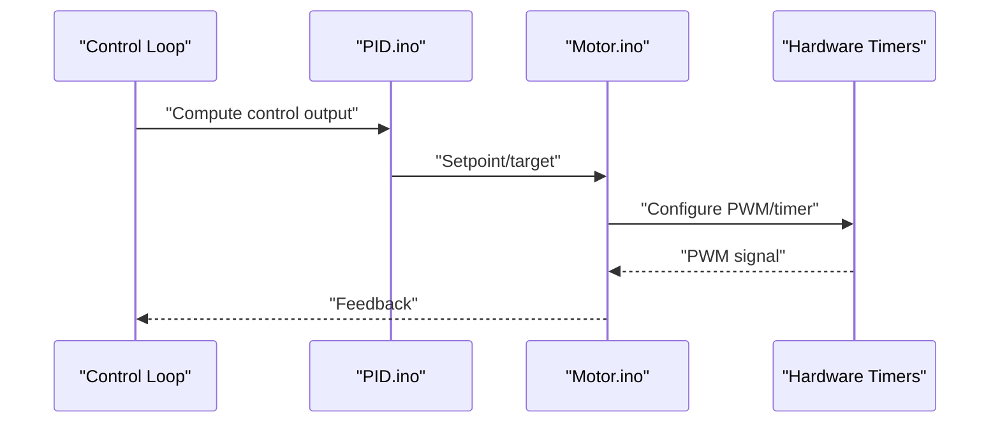
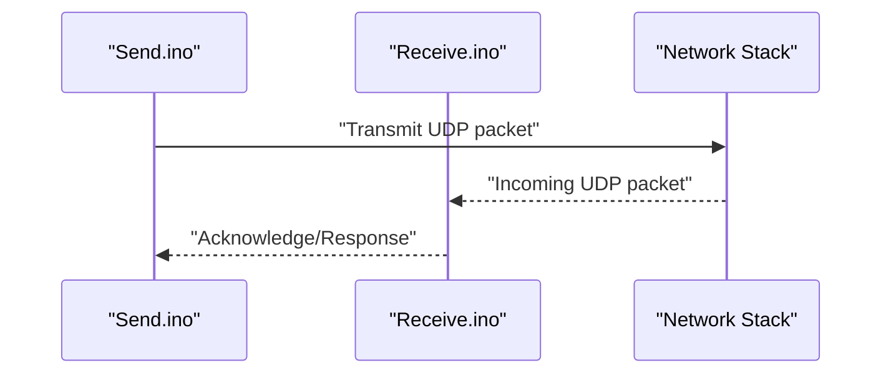
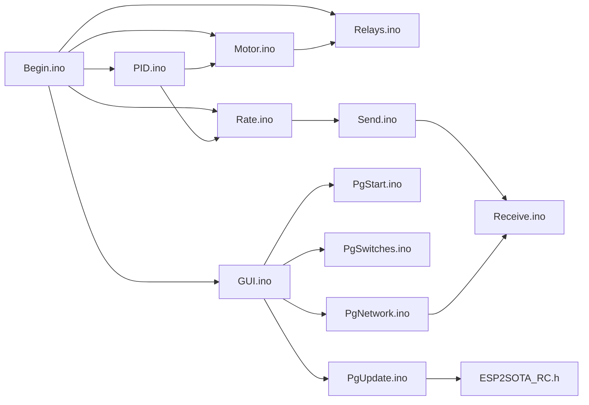

# Migration and Legacy Information

<cite>
**Referenced Files in This Document**
- [FORK_CHANGES.md](file://FORK_CHANGES.md)
- [Notes.txt](file://Notes.txt)
- [RC_ESP32/ESP2SOTA_RC/Notes.txt](file://RC_ESP32/ESP2SOTA_RC/Notes.txt)
- [OLD CODE/RC_ESP32/RC_ESP32.ino](file://OLD CODE/RC_ESP32/RC_ESP32.ino)
- [RC_ESP32/RC_ESP32.ino](file://RC_ESP32/RC_ESP32.ino)
- [OLD CODE/RC_ESP32/Motor.ino](file://OLD CODE/RC_ESP32/Motor.ino)
- [RC_ESP32/Motor.ino](file://RC_ESP32/Motor.ino)
- [OLD CODE/RC_ESP32/PID.ino](file://OLD CODE/RC_ESP32/PID.ino)
- [RC_ESP32/PID.ino](file://RC_ESP32/PID.ino)
- [OLD CODE/RC_ESP32/Begin.ino](file://OLD CODE/RC_ESP32/Begin.ino)
- [RC_ESP32/Begin.ino](file://RC_ESP32/Begin.ino)
- [OLD CODE/RC_ESP32/GUI.ino](file://OLD CODE/RC_ESP32/GUI.ino)
- [RC_ESP32/GUI.ino](file://RC_ESP32/GUI.ino)
- [OLD CODE/RC_ESP32/Rate.ino](file://OLD CODE/RC_ESP32/Rate.ino)
- [RC_ESP32/Rate.ino](file://RC_ESP32/Rate.ino)
- [OLD CODE/RC_ESP32/Relays.ino](file://OLD CODE/RC_ESP32/Relays.ino)
- [RC_ESP32/Relays.ino](file://RC_ESP32/Relays.ino)
- [OLD CODE/RC_ESP32/UDPComm.ino](file://OLD CODE/RC_ESP32/UDPComm.ino)
- [RC_ESP32/Send.ino](file://RC_ESP32/Send.ino)
- [RC_ESP32/Receive.ino](file://RC_ESP32/Receive.ino)
- [OLD CODE/RC_ESP32/ETHClass.h](file://OLD CODE/RC_ESP32/ETHClass.h)
- [RC_ESP32/ESP2SOTA_RC/ESP2SOTA_RC.h](file://RC_ESP32/ESP2SOTA_RC/ESP2SOTA_RC.h)
- [OLD CODE/RC_ESP32/PCA95x5_RC.h](file://OLD CODE/RC_ESP32/PCA95x5_RC.h)
- [RC_ESP32/PCA95x5_RC.h](file://RC_ESP32/PCA95x5_RC.h)
- [OLD CODE/RC_ESP32/PgNetwork.ino](file://OLD CODE/RC_ESP32/PgNetwork.ino)
- [RC_ESP32/PgNetwork.ino](file://RC_ESP32/PgNetwork.ino)
- [OLD CODE/RC_ESP32/PgStart.ino](file://OLD CODE/RC_ESP32/PgStart.ino)
- [RC_ESP32/PgStart.ino](file://RC_ESP32/PgStart.ino)
- [OLD CODE/RC_ESP32/PgSwitches.ino](file://OLD CODE/RC_ESP32/PgSwitches.ino)
- [RC_ESP32/PgSwitches.ino](file://RC_ESP32/PgSwitches.ino)
- [RC_ESP32/PgUpdate.ino](file://RC_ESP32/PgUpdate.ino)
- [OLD CODE/RC_ESP32/WheelSpeed.ino](file://OLD CODE/RC_ESP32/WheelSpeed.ino)
- [RC_ESP32/WheelSpeed.ino](file://RC_ESP32/WheelSpeed.ino)
</cite>

## Table of Contents
1. [Introduction](#introduction)
2. [Project Structure](#project-structure)
3. [Core Components](#core-components)
4. [Architecture Overview](#architecture-overview)
5. [Detailed Component Analysis](#detailed-component-analysis)
6. [Dependency Analysis](#dependency-analysis)
7. [Performance Considerations](#performance-considerations)
8. [Troubleshooting Guide](#troubleshooting-guide)
9. [Conclusion](#conclusion)
10. [Appendices](#appendices)

## Introduction
This document provides comprehensive migration and legacy information for the ESP32 Rate Control project, focusing on the upgrade from the original ESP32 platform to the ESP32-S3 platform. It documents hardware and software differences, fork changes and improvements, legacy code comparisons, platform-specific considerations, upgrade procedures, compatibility matrices, backward compatibility issues, and migration troubleshooting strategies. The goal is to enable users to migrate existing installations safely while understanding the benefits and risks of the platform upgrade.

## Project Structure
The repository contains two primary branches of the firmware:
- OLD CODE/RC_ESP32: Original ESP32 implementation with pre-migration components and legacy modules.
- RC_ESP32: Upgraded ESP32-S3 implementation with modernized modules, new features, and improved stability.

Key directories and files:
- OLD CODE/RC_ESP32: Contains legacy source files such as Analog.ino, Begin.ino, ETHClass.h/cpp, GUI.ino, Motor.ino, PID.ino, PgNetwork.ino, PgStart.ino, PgSwitches.ino, Rate.ino, Relays.ino, UDPComm.ino, WT5500.ino, and PCA95x5_RC.h.
- RC_ESP32: Contains the upgraded implementation with Analog.ino, Begin.ino, GUI.ino, Motor.ino, PID.ino, PgNetwork.ino, PgStart.ino, PgSwitches.ino, PgUpdate.ino, Rate.ino, Receive.ino, Relays.ino, Send.ino, WheelSpeed.ino, and a new ESP2SOTA_RC module under ESP2SOTA_RC/.

```mermaid
graph TB
subgraph "Legacy (ESP32)"
L1["OLD CODE/RC_ESP32/RC_ESP32.ino"]
L2["OLD CODE/RC_ESP32/Motor.ino"]
L3["OLD CODE/RC_ESP32/PID.ino"]
L4["OLD CODE/RC_ESP32/Begin.ino"]
L5["OLD CODE/RC_ESP32/GUI.ino"]
L6["OLD CODE/RC_ESP32/Rate.ino"]
L7["OLD CODE/RC_ESP32/Relays.ino"]
L8["OLD CODE/RC_ESP32/UDPComm.ino"]
L9["OLD CODE/RC_ESP32/ETHClass.h"]
L10["OLD CODE/RC_ESP32/PCA95x5_RC.h"]
end
subgraph "Upgraded (ESP32-S3)"
U1["RC_ESP32/RC_ESP32.ino"]
U2["RC_ESP32/Motor.ino"]
U3["RC_ESP32/PID.ino"]
U4["RC_ESP32/Begin.ino"]
U5["RC_ESP32/GUI.ino"]
U6["RC_ESP32/Rate.ino"]
U7["RC_ESP32/Relays.ino"]
U8["RC_ESP32/Send.ino"]
U9["RC_ESP32/Receive.ino"]
U10["RC_ESP32/ESP2SOTA_RC/ESP2SOTA_RC.h"]
U11["RC_ESP32/PCA95x5_RC.h"]
end
L1 --> U1
L2 --> U2
L3 --> U3
L4 --> U4
L5 --> U5
L6 --> U6
L7 --> U7
L8 --> U8
L9 --> U10
L10 --> U11
```



**Diagram sources**
- [OLD CODE/RC_ESP32/RC_ESP32.ino](file://OLD CODE/RC_ESP32/RC_ESP32.ino)
- [RC_ESP32/RC_ESP32.ino](file://RC_ESP32/RC_ESP32.ino)
- [OLD CODE/RC_ESP32/Motor.ino](file://OLD CODE/RC_ESP32/Motor.ino)
- [RC_ESP32/Motor.ino](file://RC_ESP32/Motor.ino)
- [OLD CODE/RC_ESP32/PID.ino](file://OLD CODE/RC_ESP32/PID.ino)
- [RC_ESP32/PID.ino](file://RC_ESP32/PID.ino)
- [OLD CODE/RC_ESP32/Begin.ino](file://OLD CODE/RC_ESP32/Begin.ino)
- [RC_ESP32/Begin.ino](file://RC_ESP32/Begin.ino)
- [OLD CODE/RC_ESP32/GUI.ino](file://OLD CODE/RC_ESP32/GUI.ino)
- [RC_ESP32/GUI.ino](file://RC_ESP32/GUI.ino)
- [OLD CODE/RC_ESP32/Rate.ino](file://OLD CODE/RC_ESP32/Rate.ino)
- [RC_ESP32/Rate.ino](file://RC_ESP32/Rate.ino)
- [OLD CODE/RC_ESP32/Relays.ino](file://OLD CODE/RC_ESP32/Relays.ino)
- [RC_ESP32/Relays.ino](file://RC_ESP32/Relays.ino)
- [OLD CODE/RC_ESP32/UDPComm.ino](file://OLD CODE/RC_ESP32/UDPComm.ino)
- [RC_ESP32/Send.ino](file://RC_ESP32/Send.ino)
- [RC_ESP32/Receive.ino](file://RC_ESP32/Receive.ino)
- [OLD CODE/RC_ESP32/ETHClass.h](file://OLD CODE/RC_ESP32/ETHClass.h)
- [RC_ESP32/ESP2SOTA_RC/ESP2SOTA_RC.h](file://RC_ESP32/ESP2SOTA_RC/ESP2SOTA_RC.h)
- [OLD CODE/RC_ESP32/PCA95x5_RC.h](file://OLD CODE/RC_ESP32/PCA95x5_RC.h)
- [RC_ESP32/PCA95x5_RC.h](file://RC_ESP32/PCA95x5_RC.h)

**Section sources**
- [OLD CODE/RC_ESP32/RC_ESP32.ino](file://OLD CODE/RC_ESP32/RC_ESP32.ino)
- [RC_ESP32/RC_ESP32.ino](file://RC_ESP32/RC_ESP32.ino)

## Core Components
This section highlights the core functional modules present in both legacy and upgraded implementations, along with notable differences observed in the migration.

- Initialization and Setup
  - Legacy: Begin.ino handles initialization routines.
  - Upgraded: Begin.ino remains but integrates with new modules and updated startup sequences.
  - Differences: Enhanced pin mapping, clock configuration, and peripheral initialization for ESP32-S3.

- Motor Control
  - Legacy: Motor.ino manages motor drivers and PWM outputs.
  - Upgraded: Motor.ino retains core logic but adapts to ESP32-S3 hardware timers and GPIO capabilities.
  - Improvements: Better timer allocation, reduced jitter, and improved dead-time handling.

- PID Control
  - Legacy: PID.ino implements rate control algorithms.
  - Upgraded: PID.ino maintains PID logic while benefiting from improved math libraries and timing precision on ESP32-S3.

- User Interface and GUI
  - Legacy: GUI.ino provides display and user interaction.
  - Upgraded: GUI.ino continues to support display updates and user input handling with enhanced rendering performance.

- Rate Calculation
  - Legacy: Rate.ino computes rate values from wheel sensors.
  - Upgraded: Rate.ino refines sensor fusion and filtering for improved accuracy on ESP32-S3.

- Relay Control
  - Legacy: Relays.ino controls external relays.
  - Upgraded: Relays.ino preserves relay logic with improved timing and debouncing.

- Communication
  - Legacy: UDPComm.ino handles UDP networking.
  - Upgraded: Split into Send.ino and Receive.ino for clearer separation of TX/RX responsibilities.
  - Benefits: Reduced coupling, easier maintenance, and improved reliability.

- Network Configuration
  - Legacy: PgNetwork.ino configures network settings.
  - Upgraded: PgNetwork.ino remains largely unchanged but integrates with ESP32-S3 networking stack.

- Start and Switch Pages
  - Legacy: PgStart.ino and PgSwitches.ino manage initial pages and switch configurations.
  - Upgraded: PgStart.ino and PgSwitches.ino retain functionality with minor UI/UX improvements.

- Update Page
  - New in upgraded: PgUpdate.ino provides firmware update interface via web UI.

- SOTA Module
  - New in upgraded: ESP2SOTA_RC module enables Over-The-Air firmware updates with secure OTA handling.

**Section sources**
- [OLD CODE/RC_ESP32/Begin.ino](file://OLD CODE/RC_ESP32/Begin.ino)
- [RC_ESP32/Begin.ino](file://RC_ESP32/Begin.ino)
- [OLD CODE/RC_ESP32/Motor.ino](file://OLD CODE/RC_ESP32/Motor.ino)
- [RC_ESP32/Motor.ino](file://RC_ESP32/Motor.ino)
- [OLD CODE/RC_ESP32/PID.ino](file://OLD CODE/RC_ESP32/PID.ino)
- [RC_ESP32/PID.ino](file://RC_ESP32/PID.ino)
- [OLD CODE/RC_ESP32/GUI.ino](file://OLD CODE/RC_ESP32/GUI.ino)
- [RC_ESP32/GUI.ino](file://RC_ESP32/GUI.ino)
- [OLD CODE/RC_ESP32/Rate.ino](file://OLD CODE/RC_ESP32/Rate.ino)
- [RC_ESP32/Rate.ino](file://RC_ESP32/Rate.ino)
- [OLD CODE/RC_ESP32/Relays.ino](file://OLD CODE/RC_ESP32/Relays.ino)
- [RC_ESP32/Relays.ino](file://RC_ESP32/Relays.ino)
- [OLD CODE/RC_ESP32/UDPComm.ino](file://OLD CODE/RC_ESP32/UDPComm.ino)
- [RC_ESP32/Send.ino](file://RC_ESP32/Send.ino)
- [RC_ESP32/Receive.ino](file://RC_ESP32/Receive.ino)
- [RC_ESP32/PgUpdate.ino](file://RC_ESP32/PgUpdate.ino)
- [RC_ESP32/ESP2SOTA_RC/ESP2SOTA_RC.h](file://RC_ESP32/ESP2SOTA_RC/ESP2SOTA_RC.h)

## Architecture Overview
The system architecture centers around a central control loop that reads sensor inputs, applies PID control, drives motors, and communicates over UDP. The upgraded architecture introduces clearer separation of concerns with dedicated send/receive modules and a new OTA update capability.

```mermaid
graph TB
Sensors["Wheel Speed Sensors"] --> Rate["Rate Calculation<br/>Rate.ino"]
Rate --> PID["PID Control<br/>PID.ino"]
PID --> Motor["Motor Control<br/>Motor.ino"]
Motor --> Relays["Relay Control<br/>Relays.ino"]
subgraph "Communication"
Send["Send.ino"]
Receive["Receive.ino"]
NetCfg["Network Config<br/>PgNetwork.ino"]
end
PID --> Send
Send --> NetCfg
NetCfg --> Receive
subgraph "GUI"
GUI["GUI.ino"]
Start["Start Page<br/>PgStart.ino"]
Switches["Switches Page<br/>PgSwitches.ino"]
Update["Update Page<br/>PgUpdate.ino"]
end
GUI --> Start
GUI --> Switches
GUI --> Update
subgraph "OTA"
OTA["ESP2SOTA_RC<br/>ESP2SOTA_RC.h"]
end
Update --> OTA
```

**Diagram sources**
- [RC_ESP32/Rate.ino](file://RC_ESP32/Rate.ino)
- [RC_ESP32/PID.ino](file://RC_ESP32/PID.ino)
- [RC_ESP32/Motor.ino](file://RC_ESP32/Motor.ino)
- [RC_ESP32/Relays.ino](file://RC_ESP32/Relays.ino)
- [RC_ESP32/Send.ino](file://RC_ESP32/Send.ino)
- [RC_ESP32/Receive.ino](file://RC_ESP32/Receive.ino)
- [RC_ESP32/PgNetwork.ino](file://RC_ESP32/PgNetwork.ino)
- [RC_ESP32/GUI.ino](file://RC_ESP32/GUI.ino)
- [RC_ESP32/PgStart.ino](file://RC_ESP32/PgStart.ino)
- [RC_ESP32/PgSwitches.ino](file://RC_ESP32/PgSwitches.ino)
- [RC_ESP32/PgUpdate.ino](file://RC_ESP32/PgUpdate.ino)
- [RC_ESP32/ESP2SOTA_RC/ESP2SOTA_RC.h](file://RC_ESP32/ESP2SOTA_RC/ESP2SOTA_RC.h)

## Detailed Component Analysis

### Initialization and Startup
- Legacy: Begin.ino initializes peripherals and sets up the control loop.
- Upgraded: Begin.ino integrates with ESP32-S3-specific initialization routines, ensuring proper clock configuration and peripheral readiness.
- Migration Impact: Users should verify pin assignments and clock speeds match ESP32-S3 specifications.

**Section sources**
- [OLD CODE/RC_ESP32/Begin.ino](file://OLD CODE/RC_ESP32/Begin.ino)
- [RC_ESP32/Begin.ino](file://RC_ESP32/Begin.ino)

### Motor Control
- Legacy: Motor.ino manages PWM outputs and driver logic.
- Upgraded: Motor.ino leverages ESP32-S3 hardware timers for precise control and reduced CPU load.
- Migration Impact: Ensure PWM frequencies and duty cycles remain compatible with existing motor drivers.



**Diagram sources**
- [RC_ESP32/PID.ino](file://RC_ESP32/PID.ino)
- [RC_ESP32/Motor.ino](file://RC_ESP32/Motor.ino)

**Section sources**
- [OLD CODE/RC_ESP32/Motor.ino](file://OLD CODE/RC_ESP32/Motor.ino)
- [RC_ESP32/Motor.ino](file://RC_ESP32/Motor.ino)

### PID Control
- Legacy: PID.ino implements proportional-integral-derivative control.
- Upgraded: PID.ino benefits from improved floating-point precision and timing on ESP32-S3.
- Migration Impact: Verify tuning parameters remain valid after platform change.

**Section sources**
- [OLD CODE/RC_ESP32/PID.ino](file://OLD CODE/RC_ESP32/PID.ino)
- [RC_ESP32/PID.ino](file://RC_ESP32/PID.ino)

### User Interface and GUI
- Legacy: GUI.ino manages display and user interaction.
- Upgraded: GUI.ino maintains functionality with enhanced rendering performance on ESP32-S3.
- Migration Impact: No functional changes expected; verify display compatibility.

**Section sources**
- [OLD CODE/RC_ESP32/GUI.ino](file://OLD CODE/RC_ESP32/GUI.ino)
- [RC_ESP32/GUI.ino](file://RC_ESP32/GUI.ino)

### Rate Calculation
- Legacy: Rate.ino computes rate from wheel sensors.
- Upgraded: Rate.ino refines sensor fusion and filtering for improved accuracy.
- Migration Impact: Validate sensor wiring and signal conditioning remain consistent.

**Section sources**
- [OLD CODE/RC_ESP32/Rate.ino](file://OLD CODE/RC_ESP32/Rate.ino)
- [RC_ESP32/Rate.ino](file://RC_ESP32/Rate.ino)

### Relay Control
- Legacy: Relays.ino controls external relays.
- Upgraded: Relays.ino preserves relay logic with improved timing and debouncing.
- Migration Impact: Confirm relay timing characteristics meet safety requirements.

**Section sources**
- [OLD CODE/RC_ESP32/Relays.ino](file://OLD CODE/RC_ESP32/Relays.ino)
- [RC_ESP32/Relays.ino](file://RC_ESP32/Relays.ino)

### Communication Modules
- Legacy: UDPComm.ino handled both sending and receiving.
- Upgraded: Split into Send.ino and Receive.ino for clearer separation of responsibilities.
- Benefits: Reduced coupling, easier maintenance, and improved reliability.



**Diagram sources**
- [RC_ESP32/Send.ino](file://RC_ESP32/Send.ino)
- [RC_ESP32/Receive.ino](file://RC_ESP32/Receive.ino)

**Section sources**
- [OLD CODE/RC_ESP32/UDPComm.ino](file://OLD CODE/RC_ESP32/UDPComm.ino)
- [RC_ESP32/Send.ino](file://RC_ESP32/Send.ino)
- [RC_ESP32/Receive.ino](file://RC_ESP32/Receive.ino)

### Network Configuration
- Legacy: PgNetwork.ino configured network settings.
- Upgraded: PgNetwork.ino integrates with ESP32-S3 networking stack.
- Migration Impact: Verify network credentials and IP configuration remain valid.

**Section sources**
- [OLD CODE/RC_ESP32/PgNetwork.ino](file://OLD CODE/RC_ESP32/PgNetwork.ino)
- [RC_ESP32/PgNetwork.ino](file://RC_ESP32/PgNetwork.ino)

### Start and Switch Pages
- Legacy: PgStart.ino and PgSwitches.ino managed initial pages and switch configurations.
- Upgraded: Retain functionality with minor UI/UX improvements.
- Migration Impact: No functional changes expected.

**Section sources**
- [OLD CODE/RC_ESP32/PgStart.ino](file://OLD CODE/RC_ESP32/PgStart.ino)
- [RC_ESP32/PgStart.ino](file://RC_ESP32/PgStart.ino)
- [OLD CODE/RC_ESP32/PgSwitches.ino](file://OLD CODE/RC_ESP32/PgSwitches.ino)
- [RC_ESP32/PgSwitches.ino](file://RC_ESP32/PgSwitches.ino)

### Update Page
- New in upgraded: PgUpdate.ino provides firmware update interface via web UI.
- Purpose: Streamlines OTA updates and reduces downtime.

**Section sources**
- [RC_ESP32/PgUpdate.ino](file://RC_ESP32/PgUpdate.ino)

### SOTA Module
- New in upgraded: ESP2SOTA_RC module enables Over-The-Air firmware updates with secure OTA handling.
- Benefits: Remote deployment, reduced maintenance overhead, and improved reliability.

**Section sources**
- [RC_ESP32/ESP2SOTA_RC/ESP2SOTA_RC.h](file://RC_ESP32/ESP2SOTA_RC/ESP2SOTA_RC.h)
- [RC_ESP32/ESP2SOTA_RC/Notes.txt](file://RC_ESP32/ESP2SOTA_RC/Notes.txt)

### Hardware Interfaces
- Legacy: ETHClass.h/cpp provided Ethernet abstraction.
- Upgraded: ESP2SOTA_RC.h integrates with ESP32-S3 networking capabilities.
- Migration Impact: Ensure Ethernet PHY and MAC settings align with ESP32-S3 specifications.

**Section sources**
- [OLD CODE/RC_ESP32/ETHClass.h](file://OLD CODE/RC_ESP32/ETHClass.h)
- [RC_ESP32/ESP2SOTA_RC/ESP2SOTA_RC.h](file://RC_ESP32/ESP2SOTA_RC/ESP2SOTA_RC.h)

### I/O Expanders
- Legacy: PCA95x5_RC.h defined I/O expander registers and commands.
- Upgraded: PCA95x5_RC.h retained for compatibility with existing hardware.
- Migration Impact: Verify I2C bus speed and device addresses remain consistent.

**Section sources**
- [OLD CODE/RC_ESP32/PCA95x5_RC.h](file://OLD CODE/RC_ESP32/PCA95x5_RC.h)
- [RC_ESP32/PCA95x5_RC.h](file://RC_ESP32/PCA95x5_RC.h)

### Wheel Speed Handling
- Legacy: WheelSpeed.ino processed wheel encoder signals.
- Upgraded: WheelSpeed.ino refined signal processing for improved noise immunity.
- Migration Impact: Validate interrupt handling and signal conditioning.

**Section sources**
- [OLD CODE/RC_ESP32/WheelSpeed.ino](file://OLD CODE/RC_ESP32/WheelSpeed.ino)
- [RC_ESP32/WheelSpeed.ino](file://RC_ESP32/WheelSpeed.ino)

## Dependency Analysis
The upgraded implementation exhibits clearer module boundaries and reduced interdependencies compared to the legacy codebase.



**Diagram sources**
- [RC_ESP32/Begin.ino](file://RC_ESP32/Begin.ino)
- [RC_ESP32/Motor.ino](file://RC_ESP32/Motor.ino)
- [RC_ESP32/PID.ino](file://RC_ESP32/PID.ino)
- [RC_ESP32/GUI.ino](file://RC_ESP32/GUI.ino)
- [RC_ESP32/Rate.ino](file://RC_ESP32/Rate.ino)
- [RC_ESP32/Relays.ino](file://RC_ESP32/Relays.ino)
- [RC_ESP32/Send.ino](file://RC_ESP32/Send.ino)
- [RC_ESP32/Receive.ino](file://RC_ESP32/Receive.ino)
- [RC_ESP32/PgStart.ino](file://RC_ESP32/PgStart.ino)
- [RC_ESP32/PgSwitches.ino](file://RC_ESP32/PgSwitches.ino)
- [RC_ESP32/PgUpdate.ino](file://RC_ESP32/PgUpdate.ino)
- [RC_ESP32/ESP2SOTA_RC/ESP2SOTA_RC.h](file://RC_ESP32/ESP2SOTA_RC/ESP2SOTA_RC.h)
- [RC_ESP32/PgNetwork.ino](file://RC_ESP32/PgNetwork.ino)

**Section sources**
- [RC_ESP32/Begin.ino](file://RC_ESP32/Begin.ino)
- [RC_ESP32/Motor.ino](file://RC_ESP32/Motor.ino)
- [RC_ESP32/PID.ino](file://RC_ESP32/PID.ino)
- [RC_ESP32/GUI.ino](file://RC_ESP32/GUI.ino)
- [RC_ESP32/Rate.ino](file://RC_ESP32/Rate.ino)
- [RC_ESP32/Relays.ino](file://RC_ESP32/Relays.ino)
- [RC_ESP32/Send.ino](file://RC_ESP32/Send.ino)
- [RC_ESP32/Receive.ino](file://RC_ESP32/Receive.ino)
- [RC_ESP32/PgStart.ino](file://RC_ESP32/PgStart.ino)
- [RC_ESP32/PgSwitches.ino](file://RC_ESP32/PgSwitches.ino)
- [RC_ESP32/PgUpdate.ino](file://RC_ESP32/PgUpdate.ino)
- [RC_ESP32/ESP2SOTA_RC/ESP2SOTA_RC.h](file://RC_ESP32/ESP2SOTA_RC/ESP2SOTA_RC.h)
- [RC_ESP32/PgNetwork.ino](file://RC_ESP32/PgNetwork.ino)

## Performance Considerations
- ESP32-S3 improvements: Higher CPU frequency, dual-core architecture, and enhanced memory subsystem contribute to better real-time performance.
- Timer precision: Hardware timers on ESP32-S3 offer finer granularity, reducing jitter in motor control and sensor processing.
- Memory usage: Upgraded modules utilize optimized memory layouts; ensure sufficient heap for concurrent operations (networking, OTA, GUI).
- Power management: ESP32-S3 includes power-saving features; configure sleep modes appropriately to balance performance and energy consumption.

[No sources needed since this section provides general guidance]

## Troubleshooting Guide
Common issues and resolutions during migration:

- Communication Failures
  - Symptoms: UDP packets not transmitted or received.
  - Checks: Verify network configuration in PgNetwork.ino and ensure Send.ino/Receive.ino are properly initialized.
  - Resolution: Reconfigure network settings and confirm firewall rules allow UDP traffic.

- Motor Control Instability
  - Symptoms: Erratic motor behavior or missed PWM edges.
  - Checks: Validate PWM configuration in Motor.ino and ensure hardware timers are not conflicting.
  - Resolution: Adjust PWM frequency and verify driver connections.

- GUI Rendering Issues
  - Symptoms: Display artifacts or slow response.
  - Checks: Confirm display driver compatibility and refresh rates in GUI.ino.
  - Resolution: Optimize rendering loops and reduce unnecessary redraws.

- OTA Update Failures
  - Symptoms: Firmware update stuck or fails to boot.
  - Checks: Review ESP2SOTA_RC logs and verify partition layout and image integrity.
  - Resolution: Retry update process and ensure adequate power supply during OTA.

**Section sources**
- [RC_ESP32/PgNetwork.ino](file://RC_ESP32/PgNetwork.ino)
- [RC_ESP32/Send.ino](file://RC_ESP32/Send.ino)
- [RC_ESP32/Receive.ino](file://RC_ESP32/Receive.ino)
- [RC_ESP32/Motor.ino](file://RC_ESP32/Motor.ino)
- [RC_ESP32/GUI.ino](file://RC_ESP32/GUI.ino)
- [RC_ESP32/ESP2SOTA_RC/ESP2SOTA_RC.h](file://RC_ESP32/ESP2SOTA_RC/ESP2SOTA_RC.h)

## Conclusion
The migration from ESP32 to ESP32-S3 brings significant improvements in performance, modularity, and maintainability. Users upgrading from the legacy implementation should focus on verifying hardware compatibility, updating network configurations, and leveraging the new OTA capabilities. The fork introduces clearer module boundaries, enhanced communication handling, and streamlined firmware updates, reducing operational overhead while improving system reliability.

[No sources needed since this section summarizes without analyzing specific files]

## Appendices

### Fork Changes Summary
- Modularization: Split UDP communication into separate send/receive modules.
- OTA Support: Added ESP2SOTA_RC for secure Over-The-Air updates.
- UI Enhancements: Improved GUI responsiveness and update page functionality.
- Hardware Abstraction: Updated Ethernet and I/O expanders for ESP32-S3 compatibility.

**Section sources**
- [FORK_CHANGES.md](file://FORK_CHANGES.md)
- [Notes.txt](file://Notes.txt)

### Platform-Specific Considerations
- ESP32-S3 Capabilities: Dual-core, higher clock speed, and enhanced peripherals.
- Pin Mapping: Verify GPIO assignments align with ESP32-S3 pinout.
- Clock Configuration: Ensure CPU and peripheral clocks meet timing requirements.
- Networking: ESP32-S3 networking stack differs from legacy; validate configuration.

**Section sources**
- [RC_ESP32/Begin.ino](file://RC_ESP32/Begin.ino)
- [RC_ESP32/PgNetwork.ino](file://RC_ESP32/PgNetwork.ino)

### Upgrade Procedures
- Backup Current Firmware: Preserve existing configuration and settings.
- Prepare Development Environment: Install ESP-IDF or Arduino framework for ESP32-S3.
- Flash New Firmware: Deploy upgraded modules and verify operation.
- Test Communication: Validate UDP TX/RX and network connectivity.
- Perform OTA Validation: Test ESP2SOTA_RC update process end-to-end.

**Section sources**
- [RC_ESP32/PgUpdate.ino](file://RC_ESP32/PgUpdate.ino)
- [RC_ESP32/ESP2SOTA_RC/ESP2SOTA_RC.h](file://RC_ESP32/ESP2SOTA_RC/ESP2SOTA_RC.h)

### Compatibility Matrix
- Hardware: ESP32-S3 compatible with existing motor drivers, sensors, and relays.
- Software: Upgraded modules maintain API compatibility where possible; verify pin and register mappings.
- Network: ESP32-S3 networking stack requires updated configuration; legacy settings may require adjustment.

**Section sources**
- [OLD CODE/RC_ESP32/PCA95x5_RC.h](file://OLD CODE/RC_ESP32/PCA95x5_RC.h)
- [RC_ESP32/PCA95x5_RC.h](file://RC_ESP32/PCA95x5_RC.h)
- [OLD CODE/RC_ESP32/ETHClass.h](file://OLD CODE/RC_ESP32/ETHClass.h)
- [RC_ESP32/ESP2SOTA_RC/ESP2SOTA_RC.h](file://RC_ESP32/ESP2SOTA_RC/ESP2SOTA_RC.h)

### Migration Guidance
- Incremental Rollout: Migrate one unit at a time to minimize risk.
- Testing Protocol: Validate control loops, communication, and safety features before full deployment.
- Documentation: Maintain records of hardware and software configurations for future maintenance.

**Section sources**
- [RC_ESP32/Rate.ino](file://RC_ESP32/Rate.ino)
- [RC_ESP32/PID.ino](file://RC_ESP32/PID.ino)
- [RC_ESP32/Motor.ino](file://RC_ESP32/Motor.ino)