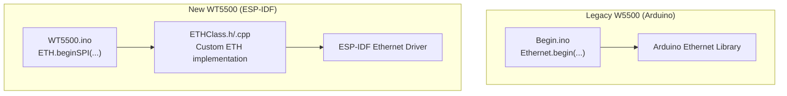
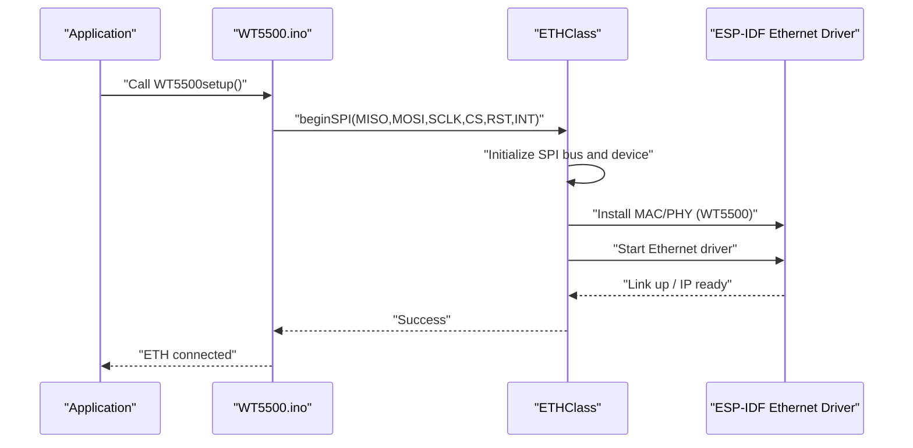
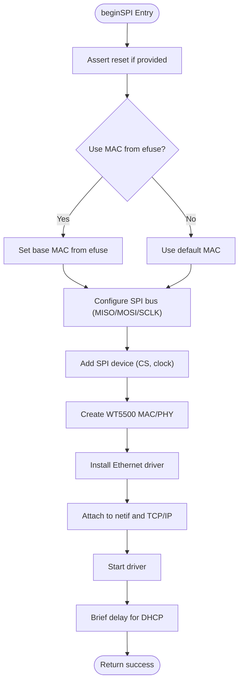
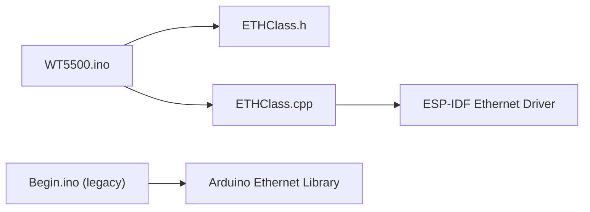

# Ethernet Migration: W5500 to WT5500

<cite>
**Referenced Files in This Document**
- [ETHClass.h](file://OLD CODE/RC_ESP32/ETHClass.h)
- [ETHClass.cpp](file://OLD CODE/RC_ESP32/ETHClass.cpp)
- [WT5500.ino](file://OLD CODE/RC_ESP32/WT5500.ino)
- [Begin.ino](file://RC_ESP32/Begin.ino)
</cite>

## Table of Contents
1. [Introduction](#introduction)
2. [Project Structure](#project-structure)
3. [Core Components](#core-components)
4. [Architecture Overview](#architecture-overview)
5. [Detailed Component Analysis](#detailed-component-analysis)
6. [Dependency Analysis](#dependency-analysis)
7. [Performance Considerations](#performance-considerations)
8. [Troubleshooting Guide](#troubleshooting-guide)
9. [Conclusion](#conclusion)

## Introduction
This document explains the migration from the W5500 to the WT5500 SPI Ethernet controller on ESP32-S3. It covers new pin assignments, physical connections, the custom ETHClass implementation, SPI protocol changes, timing requirements, network configuration, and troubleshooting steps specific to WT5500 integration.

## Project Structure
The migration spans two primary areas:
- Legacy W5500 implementation using the standard Arduino Ethernet library
- New WT5500 implementation using a custom ETHClass built on ESP-IDF Ethernet drivers

Key files involved:
- ETHClass.h/cpp: Custom Ethernet class supporting SPI-based controllers
- WT5500.ino: WT5500-specific pin definitions and initialization
- Begin.ino (RC_ESP32): Legacy W5500 usage with Arduino Ethernet library

**Diagram sources**
- [Begin.ino:87-117](file://RC_ESP32/Begin.ino#L87-L117)
- [WT5500.ino:9-17](file://OLD CODE/RC_ESP32/WT5500.ino#L9-L17)
- [ETHClass.h:79-83](file://OLD CODE/RC_ESP32/ETHClass.h#L79-L83)
- [ETHClass.cpp:232-369](file://OLD CODE/RC_ESP32/ETHClass.cpp#L232-L369)

**Section sources**
- [Begin.ino:87-117](file://RC_ESP32/Begin.ino#L87-L117)
- [WT5500.ino:9-17](file://OLD CODE/RC_ESP32/WT5500.ino#L9-L17)
- [ETHClass.h:79-83](file://OLD CODE/RC_ESP32/ETHClass.h#L79-L83)
- [ETHClass.cpp:232-369](file://OLD CODE/RC_ESP32/ETHClass.cpp#L232-L369)

## Core Components
- WT5500 SPI pin assignments:
  - MISO: 37
  - MOSI: 35
  - SCLK: 36
  - CS: 38
  - INT: 45
  - RST: 48
- Custom ETHClass implementation:
  - Provides beginSPI(...) for SPI Ethernet controllers
  - Initializes SPI bus, device, MAC, and PHY
  - Handles reset, interrupt, and clock configuration
  - Supports MAC address configuration and DHCP
- Legacy W5500 usage:
  - Uses Arduino Ethernet library with Ethernet.begin(...)
  - Manual MAC and IP configuration

**Section sources**
- [WT5500.ino:1-6](file://OLD CODE/RC_ESP32/WT5500.ino#L1-L6)
- [WT5500.ino:12-16](file://OLD CODE/RC_ESP32/WT5500.ino#L12-L16)
- [ETHClass.h:79-83](file://OLD CODE/RC_ESP32/ETHClass.h#L79-L83)
- [ETHClass.cpp:232-369](file://OLD CODE/RC_ESP32/ETHClass.cpp#L232-L369)
- [Begin.ino:93-96](file://RC_ESP32/Begin.ino#L93-L96)

## Architecture Overview
The WT5500 migration replaces the Arduino Ethernet library with a custom ETHClass that leverages ESP-IDF’s Ethernet driver stack. The flow below shows the WT5500 initialization path.

**Diagram sources**
- [WT5500.ino:9-17](file://OLD CODE/RC_ESP32/WT5500.ino#L9-L17)
- [ETHClass.cpp:232-369](file://OLD CODE/RC_ESP32/ETHClass.cpp#L232-L369)

## Detailed Component Analysis

### WT5500 SPI Pin Assignments and Physical Connections
- Pin mapping:
  - MISO: 37
  - MOSI: 35
  - SCLK: 36
  - CS: 38
  - INT: 45
  - RST: 48
- These pins are used to call ETH.beginSPI(...), which configures the SPI bus and device for the WT5500 controller.

**Section sources**
- [WT5500.ino:1-6](file://OLD CODE/RC_ESP32/WT5500.ino#L1-L6)
- [WT5500.ino:12-16](file://OLD CODE/RC_ESP32/WT5500.ino#L12-L16)

### Custom ETHClass Implementation (SPI)
- Purpose: Replace Arduino Ethernet library with ESP-IDF Ethernet driver for SPI-based controllers.
- Key capabilities:
  - beginSPI(...) initializes SPI bus, device, MAC, and PHY
  - Supports reset pin, interrupt pin, and configurable SPI clock speed
  - Configures MAC address and attaches to TCP/IP stack
  - Starts the Ethernet driver and waits briefly for DHCP
- Initialization procedure:
  - Reset controller if provided
  - Optionally set MAC from efuse
  - Configure SPI bus and device
  - Create WT5500 MAC/PHY instances
  - Install driver and attach to netif
  - Start driver and return success

**Diagram sources**
- [ETHClass.cpp:232-369](file://OLD CODE/RC_ESP32/ETHClass.cpp#L232-L369)

**Section sources**
- [ETHClass.h:79-83](file://OLD CODE/RC_ESP32/ETHClass.h#L79-L83)
- [ETHClass.cpp:232-369](file://OLD CODE/RC_ESP32/ETHClass.cpp#L232-L369)

### SPI Communication Protocol Changes and Timing
- SPI configuration:
  - Host device: SPI3_HOST (default)
  - Mode: 0
  - Command bits: 16 (address phase in WT5500 SPI frame)
  - Address bits: 8 (control phase in WT5500 SPI frame)
  - Queue size: 20
- Clock speed:
  - Default: 36 MHz (configurable parameter)
- Timing:
  - Reset sequence with controlled delays
  - Brief delay after start to allow DHCP to settle

**Section sources**
- [ETHClass.cpp:297-303](file://OLD CODE/RC_ESP32/ETHClass.cpp#L297-L303)
- [ETHClass.cpp:300-301](file://OLD CODE/RC_ESP32/ETHClass.cpp#L300-L301)
- [ETHClass.cpp:243-251](file://OLD CODE/RC_ESP32/ETHClass.cpp#L243-L251)
- [ETHClass.cpp:364-367](file://OLD CODE/RC_ESP32/ETHClass.cpp#L364-L367)

### Network Configuration Differences
- Legacy W5500 (Arduino):
  - Manual MAC and IP configuration via Ethernet.begin(...)
  - Example sets a static IP and gateway
- WT5500 (ESP-IDF):
  - MAC can be set from efuse or configured during driver install
  - DHCP handled by ESP-IDF stack; brief delay allows DHCP to complete
  - Hostname can be set post-start using ETH.setHostname(...)

**Section sources**
- [Begin.ino:93-96](file://RC_ESP32/Begin.ino#L93-L96)
- [ETHClass.cpp:253-257](file://OLD CODE/RC_ESP32/ETHClass.cpp#L253-L257)
- [WT5500.ino:26](file://OLD CODE/RC_ESP32/WT5500.ino#L26)

### API Differences Between W5500 and WT5500
- W5500 (Arduino):
  - Ethernet.begin(mac, ip, gateway, gateway, subnet)
  - Hardware status and link status checks
- WT5500 (ESP-IDF via ETHClass):
  - ETH.beginSPI(mosi, miso, sclk, cs, rst, irq, host, addr, clk_mhz, use_mac_from_efuse)
  - ETH.config(...) for static IP/DNS
  - ETH.localIP(), ETH.macAddress(), ETH.linkUp(), ETH.linkSpeed(), ETH.fullDuplex()

**Section sources**
- [Begin.ino:93-96](file://RC_ESP32/Begin.ino#L93-L96)
- [ETHClass.h:87-109](file://OLD CODE/RC_ESP32/ETHClass.h#L87-L109)
- [ETHClass.cpp:548-772](file://OLD CODE/RC_ESP32/ETHClass.cpp#L548-L772)

## Dependency Analysis
- WT5500.ino depends on ETHClass for SPI Ethernet initialization
- ETHClass.cpp depends on ESP-IDF Ethernet and SPI master drivers
- Legacy W5500 code depends on Arduino Ethernet library

**Diagram sources**
- [WT5500.ino:9-17](file://OLD CODE/RC_ESP32/WT5500.ino#L9-L17)
- [ETHClass.h:24-27](file://OLD CODE/RC_ESP32/ETHClass.h#L24-L27)
- [ETHClass.cpp:21-41](file://OLD CODE/RC_ESP32/ETHClass.cpp#L21-L41)
- [Begin.ino:93](file://RC_ESP32/Begin.ino#L93)

**Section sources**
- [WT5500.ino:9-17](file://OLD CODE/RC_ESP32/WT5500.ino#L9-L17)
- [ETHClass.h:24-27](file://OLD CODE/RC_ESP32/ETHClass.h#L24-L27)
- [ETHClass.cpp:21-41](file://OLD CODE/RC_ESP32/ETHClass.cpp#L21-L41)
- [Begin.ino:93](file://RC_ESP32/Begin.ino#L93)

## Performance Considerations
- SPI clock speed: Default 36 MHz; adjust based on controller and PCB layout constraints
- Interrupt-driven operation: Ensure INT pin is connected for efficient link status updates
- Reset timing: Controlled reset ensures stable initialization before SPI transactions
- DHCP startup delay: Brief delay after start allows DHCP to complete; avoid immediate network operations

[No sources needed since this section provides general guidance]

## Troubleshooting Guide

### SPI Communication Failures
- Verify pin assignments match WT5500 wiring
- Confirm SPI host device and mode settings
- Check SPI queue size and clock speed
- Validate CS pin is active-low and properly driven

**Section sources**
- [WT5500.ino:1-6](file://OLD CODE/RC_ESP32/WT5500.ino#L1-L6)
- [ETHClass.cpp:297-303](file://OLD CODE/RC_ESP32/ETHClass.cpp#L297-L303)

### Ethernet Link Establishment Issues
- Ensure RST pin is connected and asserted during beginSPI
- Confirm INT pin is wired for interrupt handling
- Check MAC address configuration (efuse vs. manual)
- Validate that DHCP delay allows sufficient time for IP acquisition

**Section sources**
- [ETHClass.cpp:243-251](file://OLD CODE/RC_ESP32/ETHClass.cpp#L243-L251)
- [ETHClass.cpp:253-257](file://OLD CODE/RC_ESP32/ETHClass.cpp#L253-L257)
- [ETHClass.cpp:364-367](file://OLD CODE/RC_ESP32/ETHClass.cpp#L364-L367)

### Network Connectivity Problems
- Use ETH.localIP(), ETH.macAddress(), ETH.linkUp(), ETH.linkSpeed() to diagnose
- Set hostname post-start to aid identification on the network
- For static IP scenarios, use ETH.config(...) to configure IP/subnet/gateway

**Section sources**
- [WT5500.ino:32-42](file://OLD CODE/RC_ESP32/WT5500.ino#L32-L42)
- [ETHClass.h:87-109](file://OLD CODE/RC_ESP32/ETHClass.h#L87-L109)
- [ETHClass.cpp:548-607](file://OLD CODE/RC_ESP32/ETHClass.cpp#L548-L607)

## Conclusion
Migrating from W5500 to WT5500 on ESP32-S3 involves switching from the Arduino Ethernet library to a custom ETHClass backed by ESP-IDF Ethernet drivers. The WT5500 pin assignments and SPI configuration are straightforward, and the custom ETHClass simplifies initialization, configuration, and runtime diagnostics. Following the troubleshooting steps will help resolve common integration issues quickly.