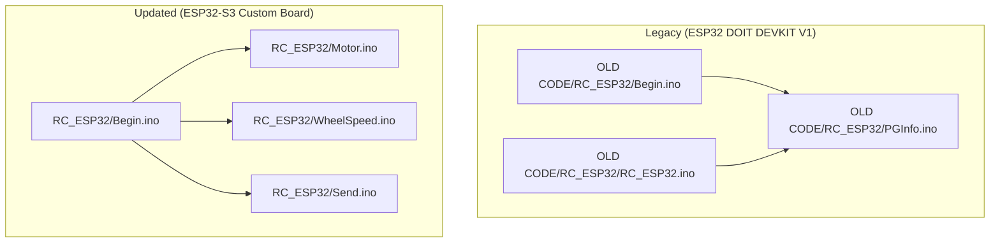
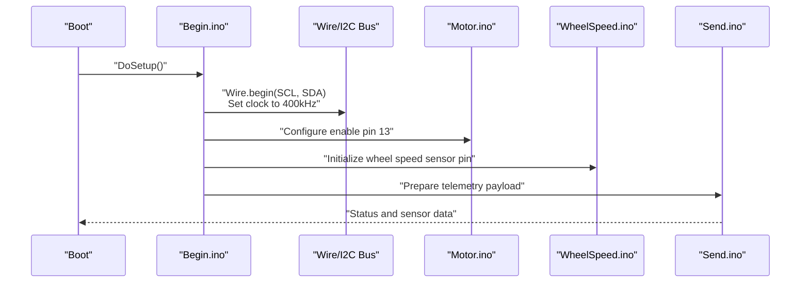
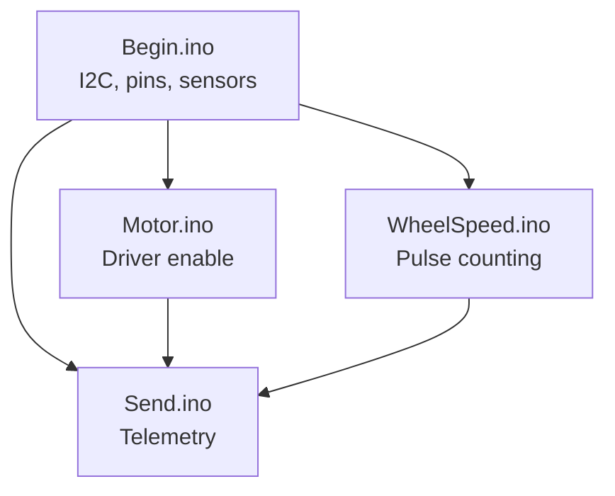

# Hardware Changes and Pin Mapping

<cite>
**Referenced Files in This Document**
- [Begin.ino](file://RC_ESP32/Begin.ino)
- [Begin.ino](file://OLD CODE/RC_ESP32/Begin.ino)
- [RC_ESP32.ino](file://OLD CODE/RC_ESP32/RC_ESP32.ino)
- [PGInfo.ino](file://OLD CODE/RC_ESP32/PGInfo.ino)
- [Motor.ino](file://RC_ESP32/Motor.ino)
- [WheelSpeed.ino](file://RC_ESP32/WheelSpeed.ino)
- [Send.ino](file://RC_ESP32/Send.ino)
- [FORK_CHANGES.md](file://FORK_CHANGES.md)
</cite>

## Table of Contents
1. [Introduction](#introduction)
2. [Project Structure](#project-structure)
3. [Core Components](#core-components)
4. [Architecture Overview](#architecture-overview)
5. [Detailed Component Analysis](#detailed-component-analysis)
6. [Dependency Analysis](#dependency-analysis)
7. [Performance Considerations](#performance-considerations)
8. [Troubleshooting Guide](#troubleshooting-guide)
9. [Conclusion](#conclusion)
10. [Appendices](#appendices)

## Introduction
This document details the hardware changes required when migrating the ESP32-based RC module firmware from the legacy ESP32 DOIT DEVKIT V1 to the newer ESP32-S3 custom board. It focuses on pin mapping updates, including I2C pin reassignment, new current sensing pins, and the Cytron motor driver enable pin. It also documents additions for wheel speed sensors and motor control, compares the two hardware platforms, and provides wiring guidance, power/voltage considerations, and troubleshooting steps for signal integrity and compatibility.

## Project Structure
The repository contains two primary firmware trees:
- OLD CODE/RC_ESP32: Legacy firmware targeting ESP32 DOIT DEVKIT V1
- RC_ESP32: Updated firmware targeting ESP32-S3 custom board

Key files relevant to hardware and pin mapping:
- Initialization and I2C setup
- Current sensing pin definitions
- Motor control and wheel speed sensor handling
- Network and peripheral initialization

**Diagram sources**
- [Begin.ino](file://RC_ESP32/Begin.ino)
- [Begin.ino](file://OLD CODE/RC_ESP32/Begin.ino)
- [RC_ESP32.ino](file://OLD CODE/RC_ESP32/RC_ESP32.ino)
- [PGInfo.ino](file://OLD CODE/RC_ESP32/PGInfo.ino)
- [Motor.ino](file://RC_ESP32/Motor.ino)
- [WheelSpeed.ino](file://RC_ESP32/WheelSpeed.ino)
- [Send.ino](file://RC_ESP32/Send.ino)

**Section sources**
- [Begin.ino](file://RC_ESP32/Begin.ino)
- [Begin.ino](file://OLD CODE/RC_ESP32/Begin.ino)
- [RC_ESP32.ino](file://OLD CODE/RC_ESP32/RC_ESP32.ino)
- [PGInfo.ino](file://OLD CODE/RC_ESP32/PGInfo.ino)

## Core Components
This section outlines the primary hardware changes and their impact on firmware configuration.

- I2C Pin Reassignment
  - Legacy (ESP32 DOIT DEVKIT V1): SDA 8, SCL 18
  - New (ESP32-S3 Custom Board): SDA 21, SCL 22
  - Clock rate remains at 400 kHz in both cases

- Current Sensing Pins
  - Current1Pin: 6 (legacy) → 6 (new)
  - Current2Pin: 14 (legacy) → 14 (new)
  - These pins are used for current measurement via ADC and are referenced in power reporting logic

- Cytron Motor Driver Enable Pin
  - New enable pin: 13
  - This pin is configured as an output and used to enable/disable the motor driver

- Wheel Speed Sensor and Motor Control
  - Wheel speed sensor pin is initialized and used for pulse counting
  - Motor control logic is updated to support the new pin layout and driver enable pin

**Section sources**
- [Begin.ino](file://OLD CODE/RC_ESP32/Begin.ino)
- [Begin.ino](file://RC_ESP32/Begin.ino)
- [RC_ESP32.ino](file://OLD CODE/RC_ESP32/RC_ESP32.ino)
- [PGInfo.ino](file://OLD CODE/RC_ESP32/PGInfo.ino)
- [Motor.ino](file://RC_ESP32/Motor.ino)
- [WheelSpeed.ino](file://RC_ESP32/WheelSpeed.ino)
- [Send.ino](file://RC_ESP32/Send.ino)

## Architecture Overview
The migration affects the initialization sequence and peripheral assignments. The updated firmware initializes I2C on different pins, configures the motor driver enable pin, and integrates wheel speed sensor handling.

**Diagram sources**
- [Begin.ino](file://RC_ESP32/Begin.ino)
- [Motor.ino](file://RC_ESP32/Motor.ino)
- [WheelSpeed.ino](file://RC_ESP32/WheelSpeed.ino)
- [Send.ino](file://RC_ESP32/Send.ino)

## Detailed Component Analysis

### I2C Pin Mapping Change
- Legacy I2C pins: SDA 8, SCL 18
- New I2C pins: SDA 21, SCL 22
- Both configurations set the I2C clock to 400 kHz

Impact:
- Hardware wiring must change to match the new SDA/SCL locations
- Ensure pull-up resistors remain at the bus level
- Verify bus speed compatibility with connected peripherals

**Section sources**
- [Begin.ino](file://OLD CODE/RC_ESP32/Begin.ino)
- [Begin.ino](file://RC_ESP32/Begin.ino)

### Current Sensing Pins
- Current1Pin: 6
- Current2Pin: 14
- Used in power reporting logic to compute total current draw

Wiring:
- Connect current sensors to these pins
- Ensure proper filtering and scaling per ADC specifications

**Section sources**
- [RC_ESP32.ino](file://OLD CODE/RC_ESP32/RC_ESP32.ino)
- [PGInfo.ino](file://OLD CODE/RC_ESP32/PGInfo.ino)

### Cytron Motor Driver Enable Pin
- New pin: 13
- Configured as output to enable/disable the motor driver

Wiring:
- Connect to the Cytron driver’s enable pin
- Ensure logic level compatibility (3.3V)

**Section sources**
- [Begin.ino](file://RC_ESP32/Begin.ino)
- [Motor.ino](file://RC_ESP32/Motor.ino)

### Wheel Speed Sensor and Motor Control
- Wheel speed sensor pin is initialized and used for pulse counting
- Motor control logic integrates with the enable pin and sensor pin

Processing:
- Pulse counting for wheel speed
- Telemetry packaging for transmission

**Section sources**
- [Begin.ino](file://RC_ESP32/Begin.ino)
- [WheelSpeed.ino](file://RC_ESP32/WheelSpeed.ino)
- [Send.ino](file://RC_ESP32/Send.ino)

### Pin Numbering and Physical Placement
- ESP32 DOIT DEVKIT V1: SDA 8, SCL 18
- ESP32-S3 Custom Board: SDA 21, SCL 22
- Enable pin: 13
- Current sense pins: 6, 14
- Wheel speed sensor pin: initialized in setup

Note: Pin numbers correspond to the ESP32-S3 GPIO numbering scheme used by the Arduino framework.

**Section sources**
- [Begin.ino](file://OLD CODE/RC_ESP32/Begin.ino)
- [Begin.ino](file://RC_ESP32/Begin.ino)
- [RC_ESP32.ino](file://OLD CODE/RC_ESP32/RC_ESP32.ino)

## Dependency Analysis
The following diagram shows how initialization and peripheral modules depend on each other during boot and runtime.

**Diagram sources**
- [Begin.ino](file://RC_ESP32/Begin.ino)
- [Motor.ino](file://RC_ESP32/Motor.ino)
- [WheelSpeed.ino](file://RC_ESP32/WheelSpeed.ino)
- [Send.ino](file://RC_ESP32/Send.ino)

**Section sources**
- [Begin.ino](file://RC_ESP32/Begin.ino)
- [Motor.ino](file://RC_ESP32/Motor.ino)
- [WheelSpeed.ino](file://RC_ESP32/WheelSpeed.ino)
- [Send.ino](file://RC_ESP32/Send.ino)

## Performance Considerations
- I2C bus speed remains at 400 kHz; verify peripheral support
- Ensure minimal wiring length for I2C and enable lines to reduce noise
- Use appropriate pull-up resistors for the I2C bus
- Keep current sense wiring short and away from high-current traces

## Troubleshooting Guide
Common issues and resolutions:

- I2C Bus Not Responding
  - Verify SDA/SCL pin assignments match the new board (SDA 21, SCL 22)
  - Confirm pull-up resistors are present on the bus
  - Check for bus contention or incorrect peripheral addresses

- Motor Driver Not Activating
  - Confirm enable pin 13 is configured as output and toggled appropriately
  - Verify logic level compatibility (3.3V)
  - Check wiring between MCU and driver

- Incorrect Current Readings
  - Validate current sensor wiring to pins 6 and 14
  - Confirm ADC scaling and filtering logic
  - Ensure load is within expected range

- Wheel Speed Sensor Noise or Missed Pulses
  - Use proper filtering and debouncing
  - Minimize electromagnetic interference near the sensor wire
  - Verify interrupt/pin configuration for pulse counting

**Section sources**
- [Begin.ino](file://RC_ESP32/Begin.ino)
- [Motor.ino](file://RC_ESP32/Motor.ino)
- [WheelSpeed.ino](file://RC_ESP32/WheelSpeed.ino)
- [PGInfo.ino](file://OLD CODE/RC_ESP32/PGInfo.ino)

## Conclusion
Migrating to the ESP32-S3 custom board requires updating I2C pin assignments, configuring the new motor driver enable pin, and ensuring correct wiring for current sensing and wheel speed sensor functionality. The provided pin mapping and troubleshooting guidance should facilitate a smooth transition while maintaining reliable operation.

## Appendices

### Wiring Diagrams

- I2C Bus Connections
  - ESP32-S3: SDA 21, SCL 22
  - Pull-ups: 4.7 kΩ to 3.3V
  - Peripherals: Ensure 3.3V logic compatibility

- Motor Driver Enable
  - ESP32-S3: GPIO 13 to Cytron enable pin
  - Logic level: 3.3V

- Current Sensing
  - ESP32-S3: GPIO 6 and 14 to current sensors
  - Keep traces short and avoid high-current loops

- Wheel Speed Sensor
  - ESP32-S3: GPIO for pulse input (configured in setup)
  - Use internal or external pull-up/down as required by sensor

Note: These diagrams describe physical connections and pin assignments derived from the firmware initialization and component usage.

### Power and Signal Compatibility
- Logic levels: 3.3V for all MCU pins
- I2C: 400 kHz clock rate maintained
- Current sensing: ADC-based measurements; ensure proper scaling and filtering