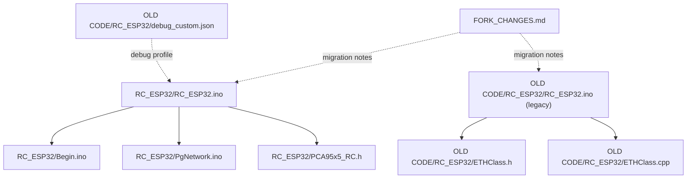
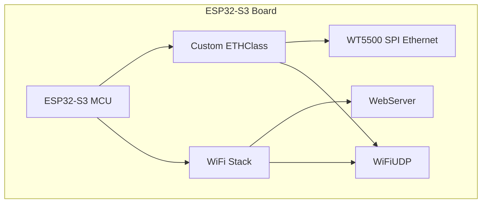
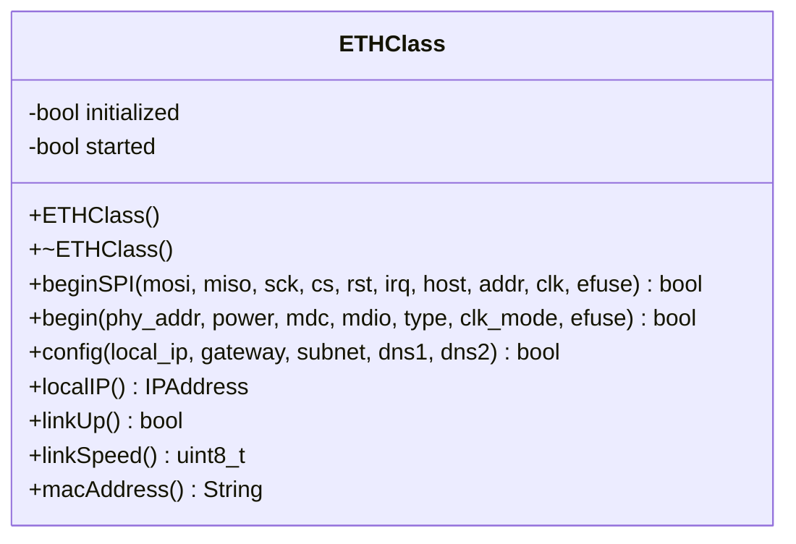
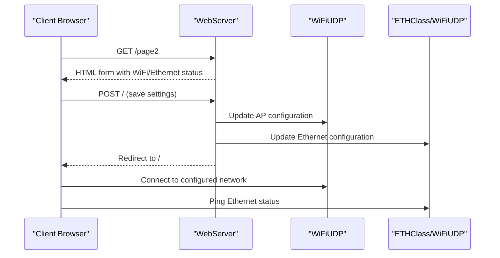
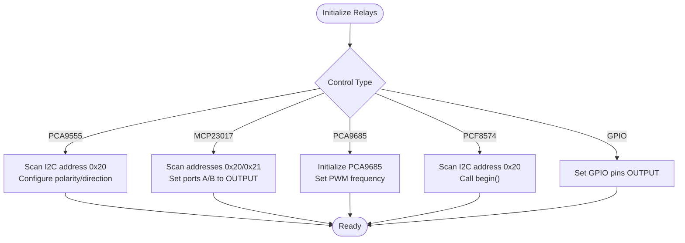
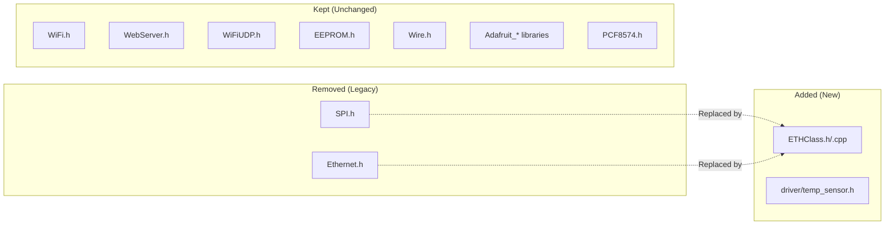

# Library Updates and Dependencies

<cite>
**Referenced Files in This Document**
- [RC_ESP32.ino](file://RC_ESP32/RC_ESP32.ino)
- [Begin.ino](file://RC_ESP32/Begin.ino)
- [PgNetwork.ino](file://RC_ESP32/PgNetwork.ino)
- [PCA95x5_RC.h](file://RC_ESP32/PCA95x5_RC.h)
- [ETHClass.h](file://OLD CODE/RC_ESP32/ETHClass.h)
- [ETHClass.cpp](file://OLD CODE/RC_ESP32/ETHClass.cpp)
- [RC_ESP32.ino (OLD)](file://OLD CODE/RC_ESP32/RC_ESP32.ino)
- [debug_custom.json](file://OLD CODE/RC_ESP32/debug_custom.json)
- [FORK_CHANGES.md](file://FORK_CHANGES.md)
</cite>

## Table of Contents
1. [Introduction](#introduction)
2. [Project Structure](#project-structure)
3. [Core Components](#core-components)
4. [Architecture Overview](#architecture-overview)
5. [Detailed Component Analysis](#detailed-component-analysis)
6. [Dependency Analysis](#dependency-analysis)
7. [Performance Considerations](#performance-considerations)
8. [Troubleshooting Guide](#troubleshooting-guide)
9. [Conclusion](#conclusion)
10. [Appendices](#appendices)

## Introduction
This document provides comprehensive migration guidance for updating the ESP32 Rate module to ESP32-S3 compatibility. It covers updated library dependencies, the case-sensitive library naming change from pcf8574 to PCF8574, the removal of the SPI and Ethernet libraries in favor of a custom ETHClass for WT5500 support, and the required ESP32-S3 Arduino Core and board selection. It also includes step-by-step installation procedures, version compatibility considerations, dependency resolution strategies, and troubleshooting advice for common migration issues.

## Project Structure
The repository contains:
- A modernized RC_ESP32 folder with current code and updated includes
- An OLD CODE/RC_ESP32 folder with legacy includes and ETHClass implementation
- A migration guide (FORK_CHANGES.md) detailing the required changes
- Debug configuration for ESP32-S3 development

**Diagram sources**
- [RC_ESP32.ino:1-40](file://RC_ESP32/RC_ESP32.ino#L1-L40)
- [Begin.ino:1-40](file://RC_ESP32/Begin.ino#L1-L40)
- [PgNetwork.ino:1-40](file://RC_ESP32/PgNetwork.ino#L1-L40)
- [PCA95x5_RC.h:1-40](file://RC_ESP32/PCA95x5_RC.h#L1-L40)
- [RC_ESP32.ino (OLD):1-30](file://OLD CODE/RC_ESP32/RC_ESP32.ino#L1-L30)
- [ETHClass.h:1-40](file://OLD CODE/RC_ESP32/ETHClass.h#L1-L40)
- [ETHClass.cpp:1-40](file://OLD CODE/RC_ESP32/ETHClass.cpp#L1-L40)
- [FORK_CHANGES.md:1-50](file://FORK_CHANGES.md#L1-L50)
- [debug_custom.json:1-17](file://OLD CODE/RC_ESP32/debug_custom.json#L1-L17)

**Section sources**
- [RC_ESP32.ino:1-40](file://RC_ESP32/RC_ESP32.ino#L1-L40)
- [Begin.ino:1-40](file://RC_ESP32/Begin.ino#L1-L40)
- [FORK_CHANGES.md:1-50](file://FORK_CHANGES.md#L1-L50)

## Core Components
Key components affected by the ESP32-S3 migration:
- Ethernet stack: replaced SPI and Ethernet libraries with a custom ETHClass for WT5500
- I2C expanders: PCF8574 library updated to case-sensitive PCF8574
- WiFi and web server: unchanged, still using WiFi.h, WebServer.h, and WiFiUDP
- PWM and peripherals: unchanged, still using ledc and Wire
- OTA: ESP2SOTA remains unchanged

Migration highlights:
- Remove direct SPI and Ethernet includes and replace with ETHClass
- Rename pcf8574.h include to PCF8574.h
- Keep WiFi, WebServer, and WiFiUDP for Ethernet-over-WiFi bridging
- Maintain I2C-based relay drivers (PCA95x5, MCP23017, PCF8574)

**Section sources**
- [RC_ESP32.ino:1-30](file://RC_ESP32/RC_ESP32.ino#L1-L30)
- [Begin.ino:87-120](file://RC_ESP32/Begin.ino#L87-L120)
- [FORK_CHANGES.md:20-30](file://FORK_CHANGES.md#L20-L30)

## Architecture Overview
The ESP32-S3 migration replaces the traditional Ethernet library stack with a custom ETHClass that initializes and manages the WT5500 chip over SPI. The WiFi stack continues to operate independently, enabling both Ethernet-over-WiFi and native Ethernet connectivity depending on configuration.

**Diagram sources**
- [ETHClass.h:60-113](file://OLD CODE/RC_ESP32/ETHClass.h#L60-L113)
- [ETHClass.cpp:232-369](file://OLD CODE/RC_ESP32/ETHClass.cpp#L232-L369)
- [Begin.ino:87-120](file://RC_ESP32/Begin.ino#L87-L120)
- [RC_ESP32.ino:12-25](file://RC_ESP32/RC_ESP32.ino#L12-L25)

## Detailed Component Analysis

### ETHClass Replacement for WT5500
The custom ETHClass encapsulates the WT5500 SPI Ethernet initialization and integrates with the ESP-IDF networking stack. It supports both direct SPI Ethernet initialization and standard EMAC-based Ethernet configurations.

Key capabilities:
- SPI-based WT5500 initialization with configurable pins and host
- Dynamic PHY detection and driver installation
- IP configuration and status reporting
- Compatibility with ESP-IDF v4.x and v5.x

**Diagram sources**
- [ETHClass.h:60-113](file://OLD CODE/RC_ESP32/ETHClass.h#L60-L113)
- [ETHClass.cpp:232-369](file://OLD CODE/RC_ESP32/ETHClass.cpp#L232-L369)

Implementation notes:
- SPI bus initialization and device registration handled internally
- PHY configuration supports multiple Ethernet chips (LAN8720, IP101, RTL8201, DP83848)
- MAC address can be derived from EFUSE or set manually
- IP configuration uses ESP-IDF netif APIs

**Section sources**
- [ETHClass.h:1-118](file://OLD CODE/RC_ESP32/ETHClass.h#L1-L118)
- [ETHClass.cpp:1-120](file://OLD CODE/RC_ESP32/ETHClass.cpp#L1-L120)
- [Begin.ino:87-120](file://RC_ESP32/Begin.ino#L87-L120)

### Case-Sensitive Library Naming Change
The PCF8574 library include was renamed from lowercase to proper case to comply with Arduino Library Manager conventions.

Migration steps:
- Replace `#include <pcf8574.h>` with `#include <PCF8574.h>`
- Ensure the RobTillaart PCF8574 library is installed via Library Manager
- Verify case sensitivity in all source files

**Section sources**
- [RC_ESP32.ino (OLD):1-10](file://OLD CODE/RC_ESP32/RC_ESP32.ino#L1-L10)
- [RC_ESP32.ino:9-10](file://RC_ESP32/RC_ESP32.ino#L9-L10)
- [FORK_CHANGES.md:20-25](file://FORK_CHANGES.md#L20-L25)

### WiFi and Web Server Integration
The WiFi stack remains unchanged and continues to provide:
- Soft AP configuration with dynamic suffix
- DNS server for captive portal behavior
- Web server for configuration pages
- OTA updates via ESP2SOTA

**Diagram sources**
- [PgNetwork.ino:1-155](file://RC_ESP32/PgNetwork.ino#L1-L155)
- [Begin.ino:173-255](file://RC_ESP32/Begin.ino#L173-L255)
- [RC_ESP32.ino:12-25](file://RC_ESP32/RC_ESP32.ino#L12-L25)

**Section sources**
- [PgNetwork.ino:1-155](file://RC_ESP32/PgNetwork.ino#L1-L155)
- [Begin.ino:173-255](file://RC_ESP32/Begin.ino#L173-L255)

### I2C Expanders and Relays
The I2C-based relay drivers remain compatible with ESP32-S3:
- PCA95x5 template-based driver for PCA9555/PCA9535
- MCP23017 address scanning and configuration
- PCF8574 initialization and begin()

**Diagram sources**
- [Begin.ino:347-511](file://RC_ESP32/Begin.ino#L347-L511)
- [PCA95x5_RC.h:55-178](file://RC_ESP32/PCA95x5_RC.h#L55-L178)

**Section sources**
- [Begin.ino:347-511](file://RC_ESP32/Begin.ino#L347-L511)
- [PCA95x5_RC.h:1-178](file://RC_ESP32/PCA95x5_RC.h#L1-L178)

## Dependency Analysis
The migration introduces new dependencies while removing others:

**Diagram sources**
- [RC_ESP32.ino:1-30](file://RC_ESP32/RC_ESP32.ino#L1-L30)
- [Begin.ino:87-120](file://RC_ESP32/Begin.ino#L87-L120)
- [FORK_CHANGES.md:20-30](file://FORK_CHANGES.md#L20-L30)

**Section sources**
- [RC_ESP32.ino:1-30](file://RC_ESP32/RC_ESP32.ino#L1-L30)
- [Begin.ino:87-120](file://RC_ESP32/Begin.ino#L87-L120)
- [FORK_CHANGES.md:20-30](file://FORK_CHANGES.md#L20-L30)

## Performance Considerations
- ETHClass uses ESP-IDF netif APIs for efficient packet processing
- SPI bus initialization occurs once during ETHClass::beginSPI
- WiFiUDP is used for both WiFi and Ethernet-over-WiFi scenarios
- I2C bus speed increased to 400kHz for faster expander communication
- PWM frequency reduced to 490Hz for improved valve operation

## Troubleshooting Guide

### Library Conflicts
Common issues and resolutions:
- **Missing PCF8574 library**: Install via Arduino Library Manager using the proper case include
- **ETHClass not found**: Ensure ETHClass.h/cpp are included from the correct path
- **SPI conflicts**: Remove all SPI-related includes and rely on ETHClass internal SPI management

### Compilation Errors
- **Case sensitivity errors**: Verify all includes use correct case (PCF8574.h, not pcf8574.h)
- **Missing temp_sensor.h**: Add `#include "driver/temp_sensor.h"` for ESP32-S3 internal temperature
- **Ethernet library errors**: Replace `#include <Ethernet.h>` with `#include "ETHClass.h"`

### Runtime Issues
- **Ethernet not connecting**: Check WT5500 wiring and SPI pins; verify ETHClass::beginSPI parameters
- **WiFi AP not appearing**: Confirm soft AP configuration and password length requirements
- **I2C expanders not detected**: Verify pull-up resistors and address scanning logic

**Section sources**
- [Begin.ino:347-511](file://RC_ESP32/Begin.ino#L347-L511)
- [FORK_CHANGES.md:20-30](file://FORK_CHANGES.md#L20-L30)

## Conclusion
The ESP32-S3 migration successfully replaces the legacy Ethernet stack with a robust custom ETHClass implementation while maintaining compatibility with existing WiFi, web server, and I2C-based relay systems. The key changes involve updating library includes, adopting case-sensitive naming conventions, and leveraging ESP-IDF networking APIs for improved performance and reliability.

## Appendices

### Step-by-Step Migration Checklist
1. Install ESP32-S3 Arduino Core in Arduino IDE
2. Replace all Ethernet-related includes with ETHClass
3. Update PCF8574 include to case-sensitive version
4. Remove direct SPI and Ethernet library includes
5. Integrate ETHClass into existing network initialization
6. Test both WiFi AP and Ethernet connectivity
7. Verify I2C expanders and relay functionality
8. Validate OTA update capability

### Version Compatibility Matrix
- ESP32-S3 Arduino Core: v2.x or v3.x (not original ESP32 SDK)
- ETHClass: Compatible with ESP-IDF v4.x and v5.x
- PCF8574 Library: RobTillaart version via Library Manager
- WiFi/WebServer: Standard Arduino ESP32 libraries
- I2C Libraries: Adafruit BusIO and related libraries

**Section sources**
- [FORK_CHANGES.md:1-50](file://FORK_CHANGES.md#L1-L50)
- [debug_custom.json:1-17](file://OLD CODE/RC_ESP32/debug_custom.json#L1-L17)