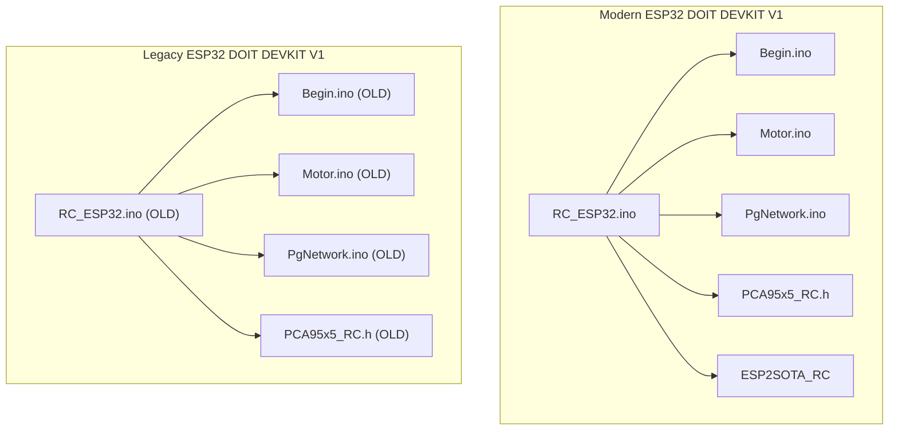
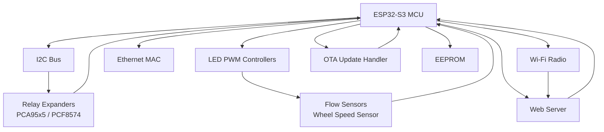
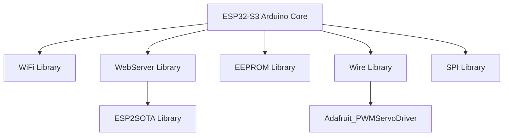

# Migration Checklist and Implementation Guide

<cite>
**Referenced Files in This Document**
- [RC_ESP32.ino](file://RC_ESP32/RC_ESP32.ino)
- [Begin.ino](file://RC_ESP32/Begin.ino)
- [Motor.ino](file://RC_ESP32/Motor.ino)
- [PgNetwork.ino](file://RC_ESP32/PgNetwork.ino)
- [PCA95x5_RC.h](file://RC_ESP32/PCA95x5_RC.h)
- [ESP2SOTA_RC.h](file://RC_ESP32/ESP2SOTA_RC/ESP2SOTA_RC.h)
- [ESP2SOTA_RC.cpp](file://RC_ESP32/ESP2SOTA_RC/ESP2SOTA_RC.cpp)
- [UDPComm.ino](file://OLD CODE/RC_ESP32/UDPComm.ino)
- [Begin.ino (OLD)](file://OLD CODE/RC_ESP32/Begin.ino)
- [Motor.ino (OLD)](file://OLD CODE/RC_ESP32/Motor.ino)
- [PgNetwork.ino (OLD)](file://OLD CODE/RC_ESP32/PgNetwork.ino)
- [PCA95x5_RC.h (OLD)](file://OLD CODE/RC_ESP32/PCA95x5_RC.h)
- [debug.cfg](file://OLD CODE/RC_ESP32/debug.cfg)
- [debug_custom.json](file://OLD CODE/RC_ESP32/debug_custom.json)
</cite>

## Table of Contents
1. [Introduction](#introduction)
2. [Project Structure](#project-structure)
3. [Core Components](#core-components)
4. [Architecture Overview](#architecture-overview)
5. [Detailed Component Analysis](#detailed-component-analysis)
6. [Dependency Analysis](#dependency-analysis)
7. [Performance Considerations](#performance-considerations)
8. [Troubleshooting Guide](#troubleshooting-guide)
9. [Conclusion](#conclusion)
10. [Appendices](#appendices)

## Introduction
This document provides a comprehensive migration checklist and implementation guide to transition the ESP32 Rate module from an ESP32 DOIT DEVKIT V1 hardware platform to a custom ESP32-S3 board. It covers hardware preparation, library installation, code modifications, testing protocols, verification checklists, backup and rollback strategies, and troubleshooting workflows. The guide leverages the existing codebase to ensure minimal disruption and reliable operation on the new platform.

## Project Structure
The migration spans two primary codebases:
- Modern implementation targeting ESP32 DOIT DEVKIT V1 (current working branch)
- Legacy implementation targeting ESP32 DOIT DEVKIT V1 (reference for differences)

Key modules include:
- Initialization and hardware setup
- Motor/PWM control logic
- Network configuration and web UI
- I2C device drivers (PCA95x5, PCF8574)
- Over-the-air update support
- UDP communication protocol

**Diagram sources**
- [RC_ESP32.ino:1-418](file://RC_ESP32/RC_ESP32.ino#L1-L418)
- [Begin.ino:1-769](file://RC_ESP32/Begin.ino#L1-L769)
- [Motor.ino:1-76](file://RC_ESP32/Motor.ino#L1-L76)
- [PgNetwork.ino:1-155](file://RC_ESP32/PgNetwork.ino#L1-L155)
- [PCA95x5_RC.h:1-178](file://RC_ESP32/PCA95x5_RC.h#L1-L178)
- [ESP2SOTA_RC.h:1-34](file://RC_ESP32/ESP2SOTA_RC/ESP2SOTA_RC.h#L1-L34)
- [ESP2SOTA_RC.cpp:1-48](file://RC_ESP32/ESP2SOTA_RC/ESP2SOTA_RC.cpp#L1-L48)
- [UDPComm.ino:1-503](file://OLD CODE/RC_ESP32/UDPComm.ino#L1-L503)
- [Begin.ino (OLD):1-632](file://OLD CODE/RC_ESP32/Begin.ino#L1-L632)
- [Motor.ino (OLD):1-72](file://OLD CODE/RC_ESP32/Motor.ino#L1-L72)
- [PgNetwork.ino (OLD):1-61](file://OLD CODE/RC_ESP32/PgNetwork.ino#L1-L61)
- [PCA95x5_RC.h (OLD):1-178](file://OLD CODE/RC_ESP32/PCA95x5_RC.h#L1-L178)

**Section sources**
- [RC_ESP32.ino:1-418](file://RC_ESP32/RC_ESP32.ino#L1-L418)
- [Begin.ino:1-769](file://RC_ESP32/Begin.ino#L1-L769)
- [Motor.ino:1-76](file://RC_ESP32/Motor.ino#L1-L76)
- [PgNetwork.ino:1-155](file://RC_ESP32/PgNetwork.ino#L1-L155)
- [PCA95x5_RC.h:1-178](file://RC_ESP32/PCA95x5_RC.h#L1-L178)
- [ESP2SOTA_RC.h:1-34](file://RC_ESP32/ESP2SOTA_RC/ESP2SOTA_RC.h#L1-L34)
- [ESP2SOTA_RC.cpp:1-48](file://RC_ESP32/ESP2SOTA_RC/ESP2SOTA_RC.cpp#L1-L48)
- [UDPComm.ino:1-503](file://OLD CODE/RC_ESP32/UDPComm.ino#L1-L503)
- [Begin.ino (OLD):1-632](file://OLD CODE/RC_ESP32/Begin.ino#L1-L632)
- [Motor.ino (OLD):1-72](file://OLD CODE/RC_ESP32/Motor.ino#L1-L72)
- [PgNetwork.ino (OLD):1-61](file://OLD CODE/RC_ESP32/PgNetwork.ino#L1-L61)
- [PCA95x5_RC.h (OLD):1-178](file://OLD CODE/RC_ESP32/PCA95x5_RC.h#L1-L178)

## Core Components
- Initialization and hardware setup: I2C configuration, sensor pin assignments, interrupt setup, relay initialization, Wi-Fi AP/STA mode, web server, OTA update handler, and EEPROM persistence.
- Motor/PWM control: PWM generation with configurable frequency/bits, direction control, and special control modes (standard, motor/fan, combo close, timed combo).
- Network configuration: Wi-Fi station mode, access point configuration, subnet handling, and web UI for network settings.
- I2C device drivers: PCA95x5 family and PCF8574 expanders for relay control.
- Communication protocol: UDP messaging for rate control, relay settings, PID tuning, and network configuration.
- OTA updates: Embedded web-based firmware update server.

**Section sources**
- [Begin.ino:1-769](file://RC_ESP32/Begin.ino#L1-L769)
- [Motor.ino:1-76](file://RC_ESP32/Motor.ino#L1-L76)
- [PgNetwork.ino:1-155](file://RC_ESP32/PgNetwork.ino#L1-L155)
- [PCA95x5_RC.h:1-178](file://RC_ESP32/PCA95x5_RC.h#L1-L178)
- [ESP2SOTA_RC.h:1-34](file://RC_ESP32/ESP2SOTA_RC/ESP2SOTA_RC.h#L1-L34)
- [ESP2SOTA_RC.cpp:1-48](file://RC_ESP32/ESP2SOTA_RC/ESP2SOTA_RC.cpp#L1-L48)
- [UDPComm.ino:1-503](file://OLD CODE/RC_ESP32/UDPComm.ino#L1-L503)

## Architecture Overview
The system architecture integrates hardware-specific initialization with modular components for control, networking, and communication.

**Diagram sources**
- [Begin.ino:1-769](file://RC_ESP32/Begin.ino#L1-L769)
- [Motor.ino:1-76](file://RC_ESP32/Motor.ino#L1-L76)
- [PgNetwork.ino:1-155](file://RC_ESP32/PgNetwork.ino#L1-L155)
- [PCA95x5_RC.h:1-178](file://RC_ESP32/PCA95x5_RC.h#L1-L178)
- [ESP2SOTA_RC.h:1-34](file://RC_ESP32/ESP2SOTA_RC/ESP2SOTA_RC.h#L1-L34)
- [ESP2SOTA_RC.cpp:1-48](file://RC_ESP32/ESP2SOTA_RC/ESP2SOTA_RC.cpp#L1-L48)
- [UDPComm.ino:1-503](file://OLD CODE/RC_ESP32/UDPComm.ino#L1-L503)

## Detailed Component Analysis

### Hardware Preparation Checklist
- Verify ESP32-S3 pinout compatibility with existing peripherals (I2C, SPI, PWM, interrupts).
- Confirm power delivery and voltage levels match component tolerances.
- Validate physical mounting and cable routing for sensors, relays, and communication modules.
- Prepare test equipment: oscilloscope, multimeter, logic analyzer for signal integrity checks.

### Library Installation Checklist
- Install ESP32 board support package for Arduino IDE targeting ESP32-S3.
- Add required libraries: WiFi, WebServer, EEPROM, Wire, SPI, Adafruit_PWMServoDriver, and ESP2SOTA.
- Ensure library versions are compatible with ESP32-S3 and do not conflict with platform-specific drivers.

### Code Modifications Checklist
- Update pin definitions to ESP32-S3 pin mapping; replace DOIT DEVKIT V1-specific pins.
- Adjust PWM frequency and resolution settings for ESP32-S3 capabilities.
- Modify interrupt pin assignments to ESP32-S3-compatible pins.
- Update I2C pull-up resistor values and bus speed to ESP32-S3 characteristics.
- Adjust Wi-Fi and Ethernet initialization parameters per ESP32-S3 hardware constraints.
- Update OTA update server paths and handlers to match ESP32-S3 environment.

### Testing Protocols Checklist
- Functional testing: Verify sensor readings, PWM output, relay switching, and communication messages.
- Performance testing: Measure loop timing, interrupt latency, and communication throughput.
- Stability testing: Run extended tests under varying loads and environmental conditions.
- Regression testing: Validate all previously working features after migration.

### Verification Checklist
- Pin mapping confirmation: Cross-check all GPIO assignments against ESP32-S3 pinout.
- Library compatibility validation: Confirm all libraries compile and function on ESP32-S3.
- Network functionality testing: Validate Wi-Fi AP/STA modes, web UI, and UDP communication.
- Control accuracy testing: Verify PWM control accuracy and response time.
- Communication reliability testing: Validate UDP packet delivery and parsing.
- System stability testing: Monitor memory usage, watchdog behavior, and thermal performance.

### Backup Procedures
- Create a backup of the current working firmware image.
- Export EEPROM settings and configuration data.
- Document all hardware connections and jumper settings.
- Snapshot the development environment with installed libraries and toolchain versions.

### Rollback Strategies
- Maintain a secondary device with known-good firmware for quick restoration.
- Store a compiled firmware binary compatible with ESP32-S3.
- Keep a backup of EEPROM data to restore previous configuration quickly.
- Establish a safe mode procedure to revert to minimal functionality if needed.

### Contingency Plans
- Prepare spare components for critical peripherals (relays, sensors, communication modules).
- Have replacement ESP32-S3 boards available for hardware failure scenarios.
- Develop a staged rollout plan to minimize impact during migration.
- Create diagnostic routines to isolate hardware vs. software issues.

### Migration Step-by-Step Procedure
1. Hardware Preparation
   - Review ESP32-S3 pinout and compare with DOIT DEVKIT V1.
   - Identify differences in power delivery, I2C pins, and PWM channels.
   - Plan cable routing and mounting adjustments for custom board.

2. Environment Setup
   - Install ESP32-S3 board support package in Arduino IDE.
   - Add required libraries and resolve version conflicts.
   - Configure compiler options for ESP32-S3 target.

3. Code Adaptation
   - Update pin definitions in initialization routines.
   - Modify PWM configuration for ESP32-S3 capabilities.
   - Adjust interrupt pin assignments to ESP32-S3-compatible pins.
   - Update I2C initialization parameters and pull-up resistors.

4. Integration Testing
   - Compile and upload firmware to ESP32-S3.
   - Verify basic functionality: LED blink, I2C scan, sensor reads.
   - Test PWM output and relay switching.
   - Validate web server and OTA update functionality.

5. Communication Validation
   - Test UDP communication with external systems.
   - Verify network configuration pages and settings persistence.
   - Validate real-time control commands and status reporting.

6. Performance and Stability Testing
   - Measure loop timing and interrupt latency.
   - Stress-test under various loads and temperatures.
   - Monitor memory usage and heap fragmentation.
   - Validate long-term stability and reliability.

7. Final Verification
   - Cross-reference with legacy implementation behavior.
   - Document any deviations and their rationale.
   - Prepare user documentation and operational procedures.

### Migration Impact Analysis
- Differences between modern and legacy implementations:
  - PWM control logic and scaling factors
  - Interrupt handling and pin assignments
  - I2C device detection and initialization
  - Web UI and network configuration pages
  - Communication protocol details and message formats

**Section sources**
- [Begin.ino:1-769](file://RC_ESP32/Begin.ino#L1-L769)
- [Begin.ino (OLD):1-632](file://OLD CODE/RC_ESP32/Begin.ino#L1-L632)
- [Motor.ino:1-76](file://RC_ESP32/Motor.ino#L1-L76)
- [Motor.ino (OLD):1-72](file://OLD CODE/RC_ESP32/Motor.ino#L1-L72)
- [PgNetwork.ino:1-155](file://RC_ESP32/PgNetwork.ino#L1-L155)
- [PgNetwork.ino (OLD):1-61](file://OLD CODE/RC_ESP32/PgNetwork.ino#L1-L61)
- [PCA95x5_RC.h:1-178](file://RC_ESP32/PCA95x5_RC.h#L1-L178)
- [PCA95x5_RC.h (OLD):1-178](file://OLD CODE/RC_ESP32/PCA95x5_RC.h#L1-L178)
- [UDPComm.ino:1-503](file://OLD CODE/RC_ESP32/UDPComm.ino#L1-L503)

## Dependency Analysis
The system relies on several key dependencies and their interactions:
- Arduino framework for ESP32-S3 platform support
- WiFi and WebServer libraries for network and web functionality
- EEPROM library for persistent storage
- Wire library for I2C communication
- SPI library for Ethernet controller interface
- Adafruit_PWMServoDriver for PCA9685 control
- ESP2SOTA for OTA firmware updates

**Diagram sources**
- [Begin.ino:1-769](file://RC_ESP32/Begin.ino#L1-L769)
- [ESP2SOTA_RC.h:1-34](file://RC_ESP32/ESP2SOTA_RC/ESP2SOTA_RC.h#L1-L34)
- [ESP2SOTA_RC.cpp:1-48](file://RC_ESP32/ESP2SOTA_RC/ESP2SOTA_RC.cpp#L1-L48)

**Section sources**
- [Begin.ino:1-769](file://RC_ESP32/Begin.ino#L1-L769)
- [ESP2SOTA_RC.h:1-34](file://RC_ESP32/ESP2SOTA_RC/ESP2SOTA_RC.h#L1-L34)
- [ESP2SOTA_RC.cpp:1-48](file://RC_ESP32/ESP2SOTA_RC/ESP2SOTA_RC.cpp#L1-L48)

## Performance Considerations
- PWM frequency and resolution: ESP32-S3 supports configurable PWM parameters; adjust for optimal valve control performance.
- Interrupt handling: Ensure sufficient priority and latency for sensor interrupts and communication tasks.
- Memory management: Monitor heap usage and fragmentation during operation.
- Thermal management: Validate operating temperature range and cooling requirements.
- Power consumption: Optimize sleep modes and peripheral usage for battery-powered applications.

## Troubleshooting Guide
Common issues and resolutions during migration:
- Compilation errors: Verify library compatibility and version mismatches.
- Runtime failures: Check pin assignments and peripheral initialization order.
- Communication problems: Validate network configuration and firewall settings.
- PWM instability: Adjust frequency and duty cycle limits for ESP32-S3 characteristics.
- I2C timeouts: Verify pull-up resistors and bus speed settings.

Diagnostic procedures:
- Use serial output for status reporting and error logging.
- Implement watchdog timers to detect hangs and restart automatically.
- Monitor system health indicators and error counters.
- Validate hardware connections and signal integrity with test equipment.

**Section sources**
- [Begin.ino:1-769](file://RC_ESP32/Begin.ino#L1-L769)
- [Motor.ino:1-76](file://RC_ESP32/Motor.ino#L1-L76)
- [PgNetwork.ino:1-155](file://RC_ESP32/PgNetwork.ino#L1-L155)
- [debug.cfg](file://OLD CODE/RC_ESP32/debug.cfg)
- [debug_custom.json](file://OLD CODE/RC_ESP32/debug_custom.json)

## Conclusion
Migrating the ESP32 Rate module to ESP32-S3 requires careful attention to hardware differences, library compatibility, and code adaptations. By following this comprehensive checklist and implementation guide, you can ensure a smooth transition while maintaining system reliability and functionality. Regular testing and validation throughout the process will help identify and resolve issues early, minimizing downtime and ensuring successful deployment.

## Appendices
- Development environment setup and configuration
- Hardware pin mapping reference for ESP32-S3
- Library version compatibility matrix
- Communication protocol specification details
- Emergency contact and support resources