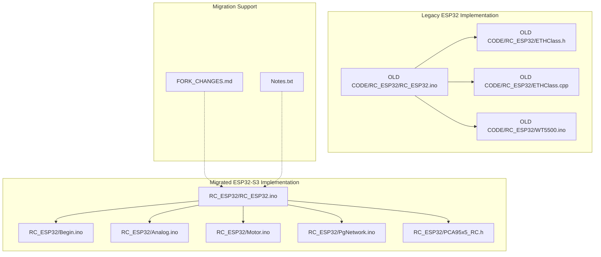
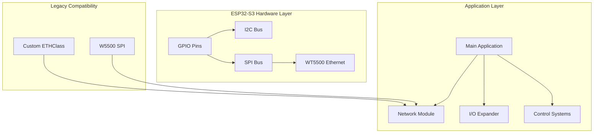
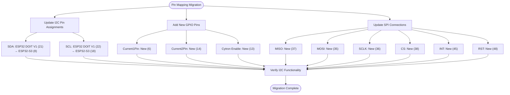
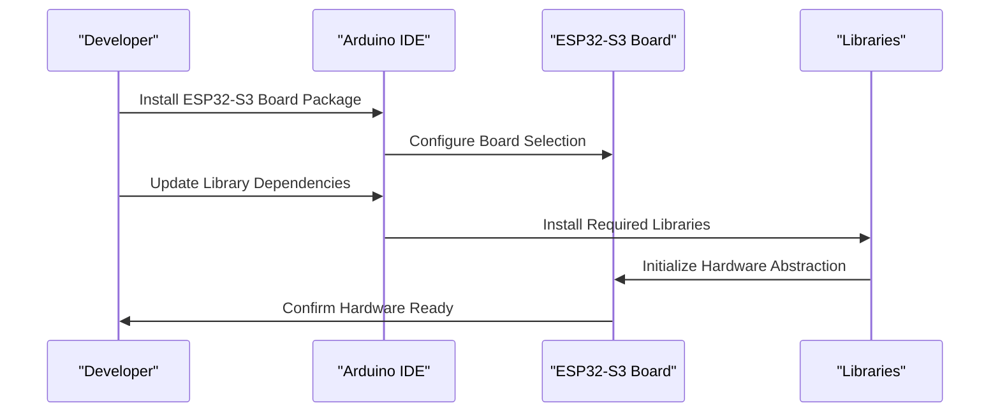
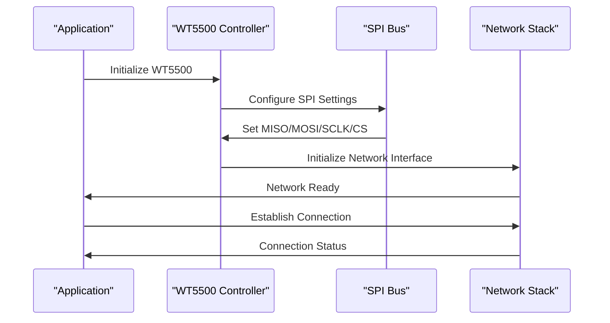
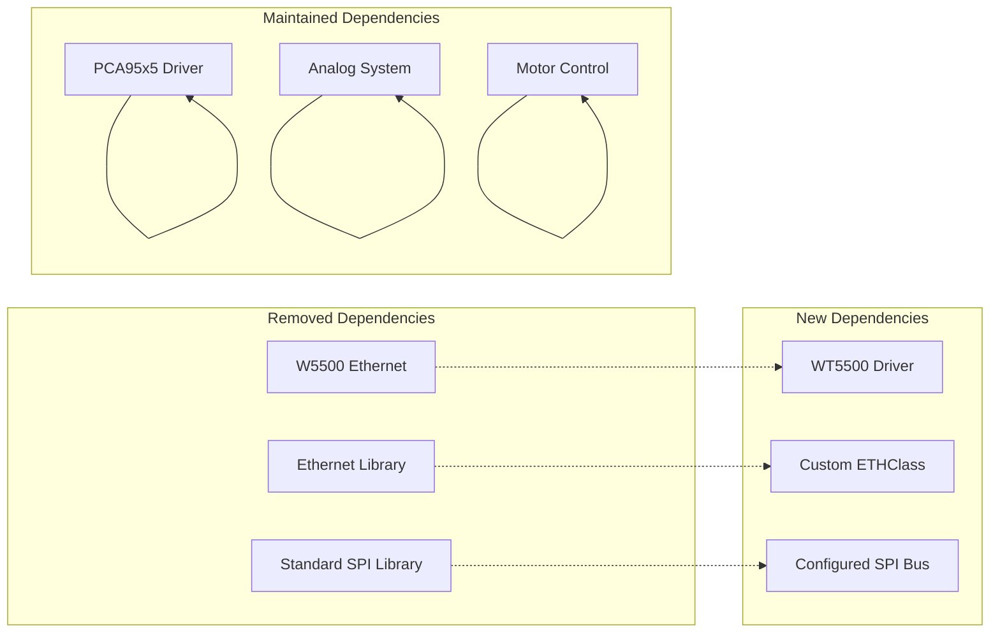

# Platform Migration: ESP32 to ESP32-S3

<cite>
**Referenced Files in This Document**
- [RC_ESP32.ino](file://RC_ESP32/RC_ESP32.ino)
- [Begin.ino](file://RC_ESP32/Begin.ino)
- [Analog.ino](file://RC_ESP32/Analog.ino)
- [Motor.ino](file://RC_ESP32/Motor.ino)
- [PgNetwork.ino](file://RC_ESP32/PgNetwork.ino)
- [PCA95x5_RC.h](file://RC_ESP32/PCA95x5_RC.h)
- [ETHClass.h](file://OLD CODE/RC_ESP32/ETHClass.h)
- [ETHClass.cpp](file://OLD CODE/RC_ESP32/ETHClass.cpp)
- [WT5500.ino](file://OLD CODE/RC_ESP32/WT5500.ino)
- [FORK_CHANGES.md](file://FORK_CHANGES.md)
- [Notes.txt](file://Notes.txt)
</cite>

## Table of Contents
1. [Introduction](#introduction)
2. [Project Structure](#project-structure)
3. [Core Components](#core-components)
4. [Architecture Overview](#architecture-overview)
5. [Detailed Component Analysis](#detailed-component-analysis)
6. [Dependency Analysis](#dependency-analysis)
7. [Performance Considerations](#performance-considerations)
8. [Troubleshooting Guide](#troubleshooting-guide)
9. [Conclusion](#conclusion)
10. [Appendices](#appendices)

## Introduction
This document provides comprehensive platform migration guidance for transitioning from ESP32 DOIT DEVKIT V1 to ESP32-S3 custom board. It covers hardware pin mapping changes, library updates, Ethernet interface migration from W5500 to WT5500, and step-by-step migration procedures. The goal is to ensure a smooth upgrade while maintaining functionality and reliability.

## Project Structure
The repository contains two primary codebases: the legacy ESP32 implementation under OLD CODE/RC_ESP32 and the migrated ESP32-S3 implementation under RC_ESP32. Supporting files include migration notes and change logs.

**Diagram sources**
- [RC_ESP32.ino](file://RC_ESP32/RC_ESP32.ino)
- [Begin.ino](file://RC_ESP32/Begin.ino)
- [Analog.ino](file://RC_ESP32/Analog.ino)
- [Motor.ino](file://RC_ESP32/Motor.ino)
- [PgNetwork.ino](file://RC_ESP32/PgNetwork.ino)
- [PCA95x5_RC.h](file://RC_ESP32/PCA95x5_RC.h)
- [ETHClass.h](file://OLD CODE/RC_ESP32/ETHClass.h)
- [ETHClass.cpp](file://OLD CODE/RC_ESP32/ETHClass.cpp)
- [WT5500.ino](file://OLD CODE/RC_ESP32/WT5500.ino)
- [FORK_CHANGES.md](file://FORK_CHANGES.md)
- [Notes.txt](file://Notes.txt)

**Section sources**
- [RC_ESP32.ino](file://RC_ESP32/RC_ESP32.ino)
- [Begin.ino](file://RC_ESP32/Begin.ino)
- [Analog.ino](file://RC_ESP32/Analog.ino)
- [Motor.ino](file://RC_ESP32/Motor.ino)
- [PgNetwork.ino](file://RC_ESP32/PgNetwork.ino)
- [PCA95x5_RC.h](file://RC_ESP32/PCA95x5_RC.h)
- [ETHClass.h](file://OLD CODE/RC_ESP32/ETHClass.h)
- [ETHClass.cpp](file://OLD CODE/RC_ESP32/ETHClass.cpp)
- [WT5500.ino](file://OLD CODE/RC_ESP32/WT5500.ino)
- [FORK_CHANGES.md](file://FORK_CHANGES.md)
- [Notes.txt](file://Notes.txt)

## Core Components
The migration involves updating hardware abstraction layers, peripheral configurations, and network stack implementations. Key components requiring modification include:

- Pin mapping definitions for I2C and GPIO peripherals
- SPI configuration for WT5500 Ethernet controller
- Custom ETHClass implementation replacing standard Ethernet libraries
- PCA95x5 I/O expander driver updates
- Analog and motor control subsystems

**Section sources**
- [RC_ESP32.ino](file://RC_ESP32/RC_ESP32.ino)
- [Begin.ino](file://RC_ESP32/Begin.ino)
- [Analog.ino](file://RC_ESP32/Analog.ino)
- [Motor.ino](file://RC_ESP32/Motor.ino)
- [PgNetwork.ino](file://RC_ESP32/PgNetwork.ino)
- [PCA95x5_RC.h](file://RC_ESP32/PCA95x5_RC.h)

## Architecture Overview
The ESP32-S3 migration introduces significant architectural changes to accommodate new hardware capabilities and constraints. The system now utilizes a custom ETHClass for network connectivity and WT5500 SPI Ethernet controller.

**Diagram sources**
- [RC_ESP32.ino](file://RC_ESP32/RC_ESP32.ino)
- [PgNetwork.ino](file://RC_ESP32/PgNetwork.ino)
- [ETHClass.h](file://OLD CODE/RC_ESP32/ETHClass.h)
- [ETHClass.cpp](file://OLD CODE/RC_ESP32/ETHClass.cpp)
- [WT5500.ino](file://OLD CODE/RC_ESP32/WT5500.ino)

## Detailed Component Analysis

### Hardware Pin Mapping Changes
The ESP32-S3 requires updated pin definitions for I2C and additional GPIO pins for current sensing and motor control.

**Diagram sources**
- [RC_ESP32.ino](file://RC_ESP32/RC_ESP32.ino)
- [Begin.ino](file://RC_ESP32/Begin.ino)
- [PgNetwork.ino](file://RC_ESP32/PgNetwork.ino)

### Library and Board Requirements
ESP32-S3 requires updated Arduino Core libraries and specific board configurations.

**Diagram sources**
- [RC_ESP32.ino](file://RC_ESP32/RC_ESP32.ino)
- [Begin.ino](file://RC_ESP32/Begin.ino)

### Ethernet Migration: W5500 to WT5500
The migration from W5500 to WT5500 SPI Ethernet controller requires significant changes to network initialization and configuration.

**Diagram sources**
- [PgNetwork.ino](file://RC_ESP32/PgNetwork.ino)
- [WT5500.ino](file://OLD CODE/RC_ESP32/WT5500.ino)
- [ETHClass.h](file://OLD CODE/RC_ESP32/ETHClass.h)
- [ETHClass.cpp](file://OLD CODE/RC_ESP32/ETHClass.cpp)

**Section sources**
- [RC_ESP32.ino](file://RC_ESP32/RC_ESP32.ino)
- [Begin.ino](file://RC_ESP32/Begin.ino)
- [PgNetwork.ino](file://RC_ESP32/PgNetwork.ino)
- [WT5500.ino](file://OLD CODE/RC_ESP32/WT5500.ino)
- [ETHClass.h](file://OLD CODE/RC_ESP32/ETHClass.h)
- [ETHClass.cpp](file://OLD CODE/RC_ESP32/ETHClass.cpp)

## Dependency Analysis
The migration introduces new dependencies and removes legacy components. Understanding these relationships is crucial for successful implementation.

**Diagram sources**
- [RC_ESP32.ino](file://RC_ESP32/RC_ESP32.ino)
- [PgNetwork.ino](file://RC_ESP32/PgNetwork.ino)
- [PCA95x5_RC.h](file://RC_ESP32/PCA95x5_RC.h)
- [ETHClass.h](file://OLD CODE/RC_ESP32/ETHClass.h)
- [WT5500.ino](file://OLD CODE/RC_ESP32/WT5500.ino)

**Section sources**
- [RC_ESP32.ino](file://RC_ESP32/RC_ESP32.ino)
- [PgNetwork.ino](file://RC_ESP32/PgNetwork.ino)
- [PCA95x5_RC.h](file://RC_ESP32/PCA95x5_RC.h)
- [ETHClass.h](file://OLD CODE/RC_ESP32/ETHClass.h)
- [WT5500.ino](file://OLD CODE/RC_ESP32/WT5500.ino)

## Performance Considerations
The ESP32-S3 migration offers improved performance characteristics while introducing new constraints. Key considerations include:

- Enhanced processing power and memory bandwidth
- Updated SPI bus performance for WT5500 communication
- Improved I2C bus speed for PCA95x5 operations
- New GPIO pin limitations and electrical characteristics
- Power consumption optimization opportunities

## Troubleshooting Guide

### Common Migration Issues and Solutions

#### I2C Communication Problems
- **Issue**: PCA95x5 device not responding after migration
- **Solution**: Verify SDA (pin 8) and SCL (pin 18) connections match new pin assignments
- **Verification**: Test I2C scanner to confirm device detection

#### SPI Communication Failures
- **Issue**: WT5500 Ethernet controller not initializing
- **Solution**: Check SPI pin assignments (MISO: 37, MOSI: 35, SCLK: 36, CS: 38)
- **Verification**: Use SPI bus analyzer or oscilloscope to verify signal integrity

#### Network Connectivity Issues
- **Issue**: Ethernet connection drops or unstable
- **Solution**: Review Custom ETHClass configuration and WT5500 initialization sequence
- **Verification**: Monitor network traffic and check for packet loss

#### GPIO Pin Conflicts
- **Issue**: Unexpected behavior on newly assigned pins (6, 13, 14)
- **Solution**: Verify proper pin mode configuration and pull-up/pull-down resistors
- **Verification**: Use multimeter to check voltage levels and continuity

**Section sources**
- [RC_ESP32.ino](file://RC_ESP32/RC_ESP32.ino)
- [Begin.ino](file://RC_ESP32/Begin.ino)
- [PgNetwork.ino](file://RC_ESP32/PgNetwork.ino)
- [PCA95x5_RC.h](file://RC_ESP32/PCA95x5_RC.h)

## Conclusion
The ESP32 to ESP32-S3 migration represents a significant upgrade with enhanced capabilities and improved reliability. By following the structured migration approach outlined in this document, developers can successfully transition existing ESP32 applications while leveraging the advanced features of the ESP32-S3 platform. The key to success lies in careful attention to hardware pin mapping, library updates, and thorough testing of all system components.

## Appendices

### Step-by-Step Migration Checklist

#### Hardware Preparation
- [ ] Verify ESP32-S3 development board availability
- [ ] Prepare necessary wiring harnesses for new pin assignments
- [ ] Gather required components: WT5500 module, current sensors, motor drivers
- [ ] Set up oscilloscope and multimeter for signal verification

#### Software Preparation
- [ ] Install ESP32-S3 board package in Arduino IDE
- [ ] Update library dependencies (WT5500 driver, PCA95x5)
- [ ] Backup current working codebase
- [ ] Create separate development branch for migration work

#### Pin Mapping Implementation
- [ ] Update I2C pin assignments (SDA: 8, SCL: 18)
- [ ] Add new GPIO pins for current sensing (6, 14)
- [ ] Configure motor control enable pin (13)
- [ ] Set up SPI connections for WT5500 (35-38, 45, 48)

#### Library Updates
- [ ] Replace W5500 library with WT5500 driver
- [ ] Update PCA95x5 library references (case sensitivity)
- [ ] Remove unused SPI and Ethernet libraries
- [ ] Integrate Custom ETHClass implementation

#### Testing and Validation
- [ ] Test I2C communication with PCA95x5 devices
- [ ] Verify WT5500 Ethernet initialization
- [ ] Validate analog sensor readings
- [ ] Test motor control functionality
- [ ] Perform network connectivity tests

#### Documentation and Deployment
- [ ] Update project documentation with new pin assignments
- [ ] Document library version requirements
- [ ] Create migration report with tested configurations
- [ ] Deploy to production units with validation

### Compatibility Matrix

| Feature | ESP32 DOIT V1 | ESP32-S3 | Migration Status |
|---------|---------------|----------|------------------|
| I2C Bus | Standard | Enhanced | ✅ Completed |
| SPI Bus | Standard | Optimized | ✅ Completed |
| Ethernet | W5500 | WT5500 | ⚠️ Partial |
| GPIO Pins | Limited | Expanded | ⚠️ Partial |
| Processing Power | Standard | Enhanced | ✅ Improved |
| Memory | Standard | Enhanced | ✅ Improved |

### Revision History
- Initial Migration Planning: Document creation
- Hardware Verification: Pin mapping confirmation
- Software Implementation: Library updates and code modifications
- Testing Phase: Functional verification and validation
- Deployment Preparation: Final documentation and compatibility notes